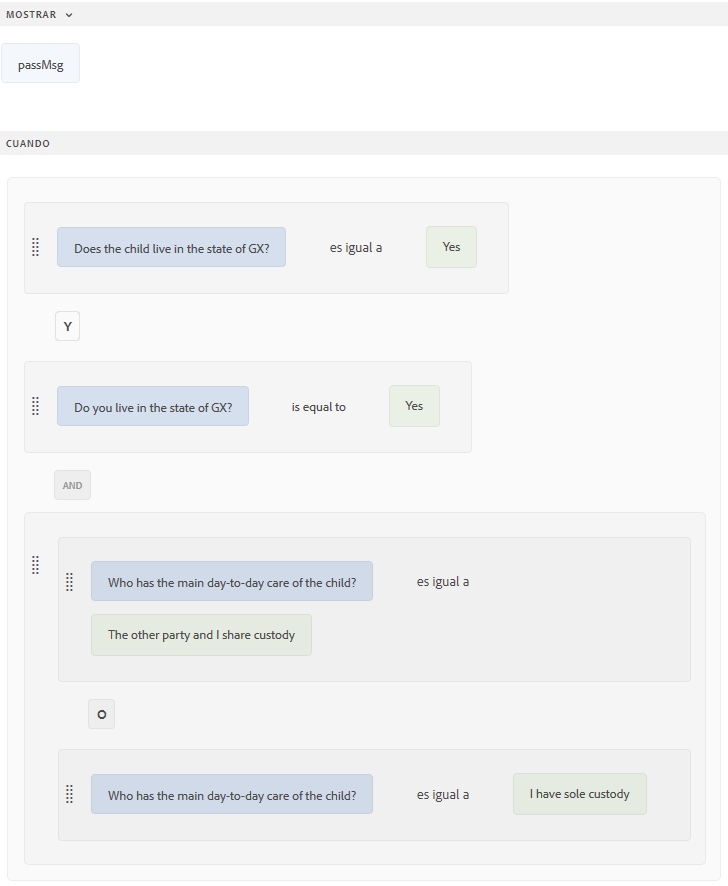
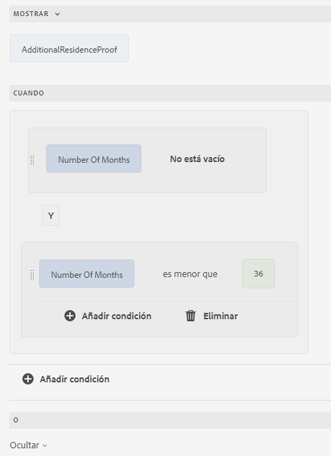
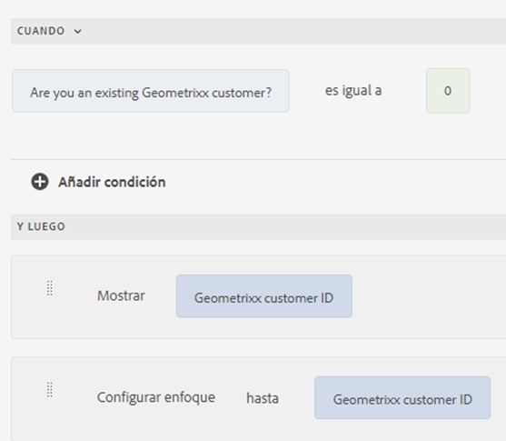
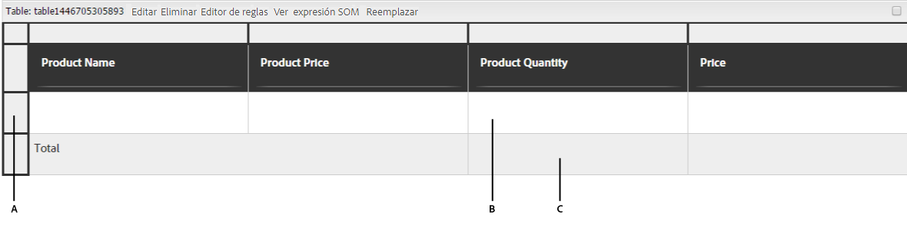
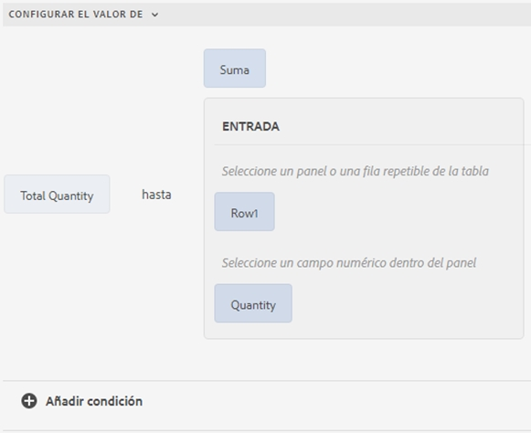

# Diferentes casos de uso del Editor de reglas

El artículo proporciona ejemplos detallados del Editor de reglas para un formulario adaptable basado en componentes principales, y proporciona perspectivas sobre su implementación adecuada para diferentes escenarios. El editor de reglas permite a los desarrolladores definir y administrar la lógica que controla el comportamiento de los formularios.
Ahora, analicemos las diferentes implementaciones de un editor de reglas.

## Optimización de cálculos complejos en paneles repetibles con funciones integradas

El editor de reglas permite utilizar funciones integradas, como Suma, Mín, Máx y Unir, directamente en los campos de los paneles repetibles. Esto desbloquea una potente automatización, lo que le permite implementar una lógica empresarial compleja sin código personalizado.
Imagine un formulario con un panel repetible, donde cada instancia del panel recopila información sobre el valor declarado de los recursos.

Puede usar la función `Sum` para calcular automáticamente el valor de los recursos totales en todos los paneles, lo que elimina la necesidad de realizar cálculos manuales y reduce la posibilidad de que se produzcan errores.

Cuando rellena un formulario y agrega instancias para declarar los valores de los recursos, el botón `Calculate Asset Value` calcula la suma total de todos los valores de recursos declarados y muestra el resultado en el cuadro de texto total de `assetvalue`.

¡Este es solo un ejemplo! Explore las [funciones](#b-form-objects-and-functions-br) disponibles para simplificar los flujos de trabajo y mejorar la precisión de los datos en los formularios.

## Expresiones anidadas {#nestedexpressions}

El editor de reglas permite utilizar varios operadores AND y OR para crear reglas anidadas. Puede combinar varios operadores AND y OR en las reglas.

A continuación se muestra un ejemplo de una regla anidada que muestra un mensaje al usuario sobre la elegibilidad para la custodia de un niño cuando se cumplen las condiciones requeridas.

También puede arrastrar y soltar condiciones dentro de una regla para editarla. Seleccione y pase el ratón por encima del controlador () antes de una condición. Una vez que el puntero se convierta en el símbolo de mano como se muestra a continuación, arrastre y suelte la condición en cualquier lugar dentro de la regla. La estructura de la regla cambia.

## Condiciones de expresión de fecha {#dateexpression}

El editor de reglas permite usar comparaciones de fechas para crear condiciones.

A continuación se muestra una condición de ejemplo que muestra un objeto de texto estático si la hipoteca de la casa ya está cogida, lo que el usuario indica rellenando el campo de la fecha.

Cuando la fecha de la hipoteca de la propiedad tal como la ha rellenado el usuario es anterior, el formulario adaptable muestra una nota sobre el cálculo de ingresos. La siguiente regla compara la fecha rellenada por el usuario con la fecha actual y si la fecha rellenada por el usuario es anterior a la fecha actual, el formulario muestra el mensaje de texto, denominada Income (ingresos).

Cuando la fecha de rellenado es anterior a la fecha actual, el formulario muestra el mensaje de texto (Income) de la siguiente manera:

## Condiciones de comparación de números {#number-comparison-conditions}

El editor de reglas permite crear condiciones que comparen dos números.

A continuación verá una condición de ejemplo que muestra un objeto de texto estático si el número de meses que un solicitante permanece en la dirección actual es inferior a 36.

Si el usuario indica que lleva menos de 36 meses viviendo en su actual domicilio, el formulario muestra una notificación en la que se indica que se pueden solicitar más pruebas de residencia.

<!-- ## Impact of rule editor on existing scripts {#impact-of-rule-editor-on-existing-scripts}

In [!DNL Experience Manager Forms] versions prior to [!DNL Experience Manager 6.1 Forms] feature pack 1, form authors and developers used to write expressions in the Scripts tab of the Edit component dialog to add dynamic behavior to Adaptive Forms. The Scripts tab is now replaced by the rule editor.

Any scripts or expressions that you must have written in the Scripts tab are available in the rule editor. While you cannot view or edit them in visual editor, if you are a part of the forms-power-users group you can edit scripts in code editor. -->

### Invocar servicio de modelo de datos de formulario {#invoke}

Piense en un servicio web `GetInterestRates` que toma el importe del préstamo, el ejercicio y la puntuación crediticia del solicitante como entrada y devuelve un plan de préstamo que incluye el importe del EMI y el tipo de interés. Puede crear un modelo de datos de formulario (FDM) utilizando el servicio web como fuente de datos. Se agregan objetos del modelo de datos y un servicio `get` al modelo de formulario. El servicio aparece en la pestaña Servicios del modelo de datos de formulario (FDM). A continuación, cree un formulario adaptable que incluya campos de los objetos del modelo de datos para capturar las entradas del usuario para el importe del préstamo, el ejercicio y la puntuación crediticia. Agregue un botón que active el servicio web para obtener detalles del plan. La salida se rellena en los campos adecuados.

La regla siguiente muestra cómo configurar la acción Invocar servicio para que se realice el escenario de ejemplo.

>[!NOTE]
>
>Si la entrada es de tipo matriz, los campos que admiten matrices se pueden ver en la sección desplegable Output.

### Activación de varias acciones mediante la regla When {#triggering-multiple-actions-using-the-when-rule}

En un formulario de solicitud de préstamo, se desea capturar si el solicitante del préstamo es o no un cliente existente. En función de la información que proporcione el usuario, el campo ID de cliente debería mostrarse u ocultarse. Además, desea centrarse en el campo ID del cliente si el usuario es un cliente existente. El formulario de solicitud de préstamo tiene los siguientes componentes:

* Un botón de opción, **[!UICONTROL Are you an existing Geometrixx customer? (¿Es cliente de Geometrixx?)]**, que proporciona las opciones [!UICONTROL Yes] (sí) y [!UICONTROL No]. El valor de Yes es **0** y No es **1**.

* Un campo de texto, **[!UICONTROL Geometrixx customer ID]** (ID de cliente de Geometrixx), para especificar el ID de cliente.

Cuando escriba una regla When en el botón de radio para implementar este comportamiento, la regla aparecerá de la siguiente manera en el editor de reglas visuales.

En la regla de ejemplo, la instrucción de la sección When es la condición que, cuando devuelve el valor True, ejecuta las acciones especificadas en la sección Then.

<!-- The rule appears as follows in the code editor.

 

Rule in the code editor -->

### Uso de una salida de función en una regla {#using-a-function-output-in-a-rule}

En un formulario de pedido de compra, tiene la siguiente tabla, en la que los usuarios rellenan sus pedidos. En esta tabla:

* La primera fila es repetible, por lo que los usuarios pueden solicitar varios productos y especificar cantidades diferentes. Su nombre de elemento es `Row1`.
* El título de la celda de la columna Product Quantity (cantidad de producto) de la fila repetible es Quantity (cantidad). El nombre de elemento de esta celda es `productquantity`.
* La segunda fila de la tabla es no repetible y el título de la celda de la columna Product Quantity de esta fila es Total Quantity (cantidad total).

**A.** Row1 **B.** Quantity **C.** Total Quantity

Ahora, desea agregar cantidades especificadas en la columna Product Quantity para todos los productos y mostrar la suma en la celda Total Quantity. Puede obtener esta suma escribiendo una regla Set Value Of en la celda Total Quantity como se muestra a continuación.

### Validación de un valor de campo mediante una expresión {#validating-a-field-value-using-expression}

En el formulario de pedido de compra que se explica en el ejemplo anterior, se desea restringir el pedido de más de una cantidad de cualquier producto con un precio superior al 10000. Para realizar esta validación, puede escribir una regla de validación como se muestra a continuación.

## Consulte también

{{see-also-rule-editor}}