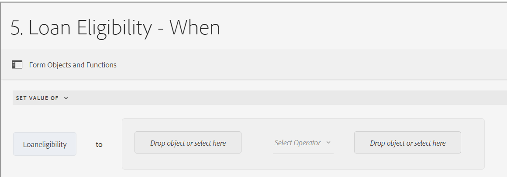
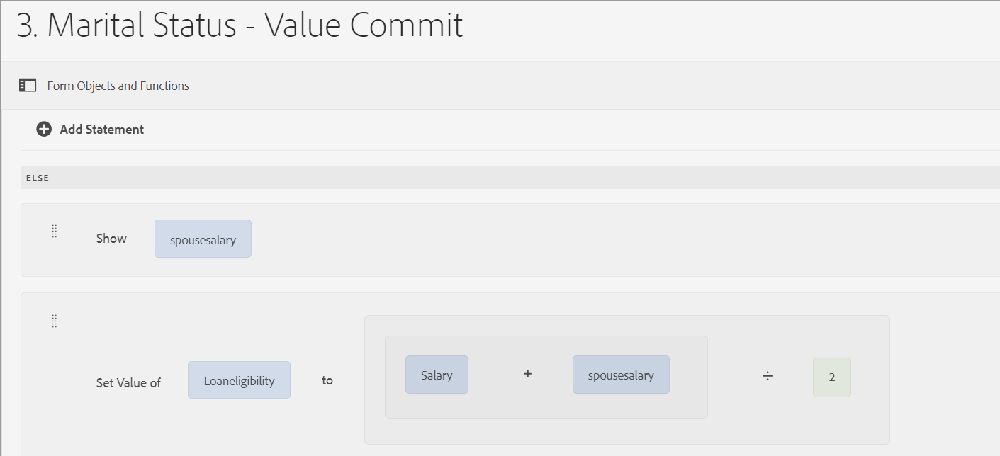

# Interfaz de usuario del Editor de reglas para formularios adaptables basados en componentes principales

La interfaz de usuario del Editor de reglas para Forms adaptable basado en componentes principales mejora el proceso de creación de formularios en Adobe Experience Manager (AEM). Permite a los usuarios y desarrolladores implementar lógica dinámica y compleja en los formularios al escribir reglas que almacenan en déclencheur las acciones en función de condiciones predefinidas, entradas del usuario e interacciones. Esta función admite funcionalidades modernas de JavaScript hasta ES2022 y ofrece un editor visual intuitivo que simplifica el proceso de escritura de reglas.
El Editor de reglas es fundamental para optimizar la experiencia de rellenado de formularios, lo que garantiza tanto la precisión como la eficacia. Permite validar o restablecer paneles y formularios, así como ejecutar funciones personalizadas para calcular los valores de objetos de formulario. Con su compatibilidad con las condiciones anidadas y la capacidad de invocar los servicios del modelo de datos de formulario, la interfaz de usuario del editor de reglas es un componente fundamental para crear formularios adaptables, fáciles de usar y adaptables.

## Explicación de la interfaz de usuario del editor de reglas {#understanding-the-rule-editor-user-interface}

El editor de reglas proporciona una interfaz de usuario completa pero sencilla para escribir y administrar reglas. Puede iniciar la interfaz de usuario del editor de reglas desde un formulario adaptable en modo de creación.

Para iniciar la interfaz de usuario del editor de reglas:

1. Abra un formulario adaptable en modo de creación.
1. Seleccione el objeto de formulario para el que desea escribir una regla y, en la barra de herramientas de componentes, seleccione .  Aparecerá la interfaz de usuario del editor de reglas.

   

   Cualquier regla existente en los objetos de formulario seleccionados se muestra en esta vista. Para obtener información sobre la administración de reglas existentes, consulte [Administrar reglas](rule-editor.md#p-manage-rules-p).

1. Seleccione **[!UICONTROL Crear]** para escribir una regla nueva. El editor visual de la interfaz de usuario del editor de reglas se abre de forma predeterminada cuando se inicia el editor de reglas por primera vez.

   

Veamos en detalle cada componente de la interfaz de usuario del editor de reglas.

### A. Visualización de la regla de componente {#a-component-rule-display}

Muestra el título del objeto de formulario adaptable a través del cual se ha iniciado el editor de reglas y el tipo de regla seleccionado actualmente. En el ejemplo anterior, el editor de reglas se inicia desde un objeto de formulario adaptable llamado Pregunta 1 y el tipo de regla seleccionado es Cuándo.

### B. Desde objetos y funciones {#b-form-objects-and-functions-br}

El panel de la izquierda de la interfaz de usuario del editor de reglas incluye dos pestañas: **[!UICONTROL Objetos de formulario]** y **[!UICONTROL Funciones]**.

La pestaña Objetos de formulario muestra una vista jerárquica de todos los objetos contenidos en el formulario adaptable. Muestra el título y el tipo de los objetos. Al escribir una regla, puede arrastrar y soltar objetos de formulario en el editor de reglas. Al crear o editar una regla cuando arrastra y suelta un objeto o función en un marcador de posición, el marcador de posición toma automáticamente el tipo de valor apropiado.

Los objetos de formulario que tienen una o más reglas válidas aplicadas se marcan con un punto verde. Si alguna de las reglas aplicadas a un objeto de formulario no es válida, el objeto de formulario se marca con un punto amarillo.

La pestaña Funciones incluye un conjunto de funciones integradas, como Sum Of (suma de), Min Of (mín. de), Max Of (máx. de), Average Of (promedio de), Number Of (número de) y Validate Form (validar formulario). Puede utilizar estas funciones para calcular valores en paneles repetibles y filas de tabla y utilizarlos en instrucciones de acción y condición al escribir reglas. Sin embargo, también puede crear funciones personalizadas.

Algunas de las funciones de la lista se muestran en la figura:


>[!NOTE]
>
>Puede buscar texto en nombres de objetos y funciones y títulos en las pestañas Objetos y Funciones de Forms.

En el árbol izquierdo de los objetos de formulario, puede seleccionar los objetos de formulario para mostrar las reglas aplicadas a cada uno de ellos. No solo puede desplazarse por las reglas de los distintos objetos de formulario, sino que también puede copiar y pegar reglas entre los objetos de formulario. Para obtener más información, consulte [Copiar y pegar reglas](rule-editor.md#p-copy-paste-rules-p).

### C. Alternar entre funciones y objetos de formulario {#c-form-objects-and-functions-toggle-br}

Al pulsar el botón de cambio, se alternan los paneles de funciones y de objetos de formulario.

### D. Editor de reglas visual {#visual-rule-editor}

El editor de reglas visual es el área del modo de editor visual de la interfaz de usuario del editor de reglas donde se escriben las reglas. Permite seleccionar un tipo de regla y definir las condiciones y las acciones correspondientes. Al definir condiciones y acciones en una regla, puede arrastrar y soltar funciones y objetos de formulario desde el panel Objetos de formulario y el de Funciones.

Para obtener más información sobre el uso de un editor de reglas visual, consulte [Escribir reglas](rule-editor.md#p-write-rules-p).
<!-- 
### E. Visual-code editors switcher {#e-visual-code-editors-switcher}

Users in the forms-power-users group can access code editor. For other users, code editor is not available. If you have the rights, you can switch from visual editor mode to code editor mode of the rule editor, and conversely, using the switcher right above the rule editor. When you launch rule editor the first time, it opens in the visual editor mode. You can write rules in the visual editor mode or switch to the code editor mode to write a rule script. However, note that if you modify a rule or write a rule in code editor, you cannot switch back to the visual editor for that rule unless you clear the code editor.

[!DNL Experience Manager Forms] tracks the rule editor mode you used last to write a rule. When you launch the rule editor next time, it opens in that mode. However, you can also configure a default mode to open the rule editor in the specified mode. To do so:

1. Go to [!DNL Experience Manager] web console at `https://[host]:[port]/system/console/configMgr`.
1. Click to edit **[!UICONTROL Adaptive Form Configuration Service]**.
1. choose **[!UICONTROL Visual Editor]** or **[!UICONTROL Code Editor]** from the **[!UICONTROL Default Mode for Rule Editor]** drop-down

1. Click **[!UICONTROL Save]**.
-->

### E. Botones de finalización y cancelación {#done-and-cancel-buttons}

El botón **[!UICONTROL Listo]** se utiliza para guardar una regla. Puede guardar una regla incompleta. Sin embargo, las que estén incompletas no son válidas, por lo tanto, no se ejecutan. Las reglas guardadas en un objeto de formulario se enumeran cuando se inicia el editor de reglas la próxima vez desde el mismo objeto. Puede administrar las reglas existentes en esa vista. Para obtener más información, consulte [Administrar reglas](rule-editor.md#p-manage-rules-p).

El botón **[!UICONTROL Cancelar]** descarta los cambios realizados en una regla y cierra el editor de reglas.

## Escribir reglas {#write-rules}

Puede escribir reglas mediante el editor de reglas visual <!-- or the code editor. When you launch the rule editor the first time, it opens in the visual editor mode. You can switch to the code editor mode and write rules. However, if you write or modify a rule in code editor, you cannot switch to the visual editor for that rule unless you clear the code editor. When you launch the rule editor next time, it opens in the mode that you used last to create rule. -->

Veamos primero cómo escribir reglas utilizando un editor visual.

+++ Usando el editor visual {#using-visual-editor}

Vamos a comprender cómo crear una regla en un editor visual utilizando el siguiente formulario de ejemplo.


La sección Loan Requirements (requisitos de préstamo) del formulario de solicitud de ejemplo requiere que los solicitantes especifiquen su estado civil, su salario y, si están casados, el salario de su cónyuge. En función de las entradas del usuario, la regla calcula la cantidad de idoneidad para el préstamo y se muestra en el campo Loan Eligibility (elegibilidad del préstamo). Aplique las siguientes reglas para implementar el escenario:

* El campo Spouse’s Salary (salario del cónyuge) solo se muestra cuando en el estado civil (Marital Status) se indica que se está casado o casada (Married).
* La cantidad de la idoneidad del préstamo es el 50 % del salario total.

Para escribir las reglas, realice los siguientes pasos:

1. En primer lugar, escriba la regla para controlar la visibilidad del campo Spouse Salary en función de la opción que seleccione el usuario para el botón de opción Marital Status.

   Abra el formulario de solicitud de préstamo en modo de creación. Seleccione el componente **[!UICONTROL Estado civil]** y haga clic en . A continuación, seleccione **[!UICONTROL Crear]** para iniciar el editor de reglas.

   

   Al iniciar el editor de reglas, la regla When se selecciona de forma predeterminada. Además, el objeto de formulario (en este caso, Marital Status) desde el que se inició el editor de reglas se especifica en la instrucción When.

   Aunque no puede cambiar ni modificar el objeto seleccionado, puede utilizar la lista desplegable de reglas, como se muestra a continuación, para seleccionar otro tipo de regla. Si desea crear una regla en otro objeto, seleccione Cancelar para salir del editor de reglas y volver a iniciarlo desde el objeto de formulario deseado.

1. Seleccione el menú desplegable **[!UICONTROL Seleccionar estado]** y haga clic en **[!UICONTROL es igual a]**. Aparece el campo **[!UICONTROL Escribir una cadena]**.

   

1. En el campo **[!UICONTROL Escriba una cadena]** en la regla, seleccione **Casado** del menú desplegable.

   

   Ha definido la condición como `When Marital Status is equal to Married`. A continuación, defina la acción que se realizará si esta condición es True.

1. En la instrucción Then, seleccione **[!UICONTROL Show]** de la lista desplegable **[!UICONTROL Seleccionar acción]**.

   

1. Arrastre y suelte el campo **[!UICONTROL Spouse Salary]** de la pestaña Objetos de formulario en el campo **[!UICONTROL Colocar objeto o seleccionar aquí]**. Como alternativa, seleccione el campo **[!UICONTROL Colocar objeto o seleccionar aquí]** y seleccionar el campo **[!UICONTROL Salario del cónyuge]** del menú emergente, que enumera todos los objetos del formulario.

   

   A continuación, defina la acción que se realizará si esta condición es False.
1. Haga clic en **[!UICONTROL Agregar otra sección]** para agregar otra condición para el campo **[!UICONTROL Salario del cónyuge]**, en caso de que seleccione Estado civil como soltero.

   


1. En la instrucción Else, seleccione **[!UICONTROL Hide]** de la lista desplegable **[!UICONTROL Select Action]**.
   

1. Arrastre y suelte el campo **[!UICONTROL Spouse Salary]** de la pestaña Objetos de formulario en el campo **[!UICONTROL Colocar objeto o seleccionar aquí]**. Como alternativa, seleccione el campo **[!UICONTROL Colocar objeto o seleccionar aquí]** y seleccionar el campo **[!UICONTROL Salario del cónyuge]** del menú emergente, que enumera todos los objetos del formulario.
   

   La regla aparece de la siguiente manera en el editor.

   

1. Seleccione **[!UICONTROL Listo]** para guardar la regla.

<!--
1. Repeat steps 1 through 5 to define another rule to hide the Spouse Salary field if the marital Status is Single. The rule appears as follows in the rule editor.

    -->

>[!NOTE]
>
> Como alternativa, puede escribir una regla Show en el campo Spouse Salary, en lugar de reglas When en el campo Marital Status, para implementar el mismo comportamiento.


1. A continuación, escriba una regla para calcular el importe de idoneidad para el préstamo, que es el 50 % del salario total, y muéstrela en el campo Loan Eligibility. Para lograr este resultado, cree reglas **[!UICONTROL Set Value Of]** en el campo Loan Eligibility.

   En el modo de creación, seleccione el campo **[!UICONTROL Idoneidad del préstamo]** y haga clic en . A continuación, seleccione **[!UICONTROL Crear]** para iniciar el editor de reglas.

1. Seleccione la regla **[!UICONTROL Set Value Of]** en la lista desplegable de reglas.

   

1. Seleccione **[!UICONTROL Seleccionar opción]** y seleccione **[!UICONTROL Expresión matemática]**. Se abre un campo para escribir una expresión matemática.

   

1. En el campo de la expresión:

   * Seleccione o arrastre y suelte desde la pestaña Objetos de formulario el campo **[!UICONTROL Salary]** (salario) en el primer campo **[!UICONTROL Colocar objeto o seleccionar aquí]**.

   * Seleccione **[!UICONTROL Más]** en el campo **[!UICONTROL Seleccionar operador]**.

   * Seleccione o arrastre y suelte desde la pestaña Objetos de formulario el campo **[!UICONTROL Spouse Salary]** en el otro campo **[!UICONTROL Colocar objeto o seleccionar aquí]**.

   

1. A continuación, seleccione el área resaltada alrededor del campo de expresión y haga clic en **[!UICONTROL Ampliar expresión]**.

   

   En el campo para ampliar la expresión, seleccione **[!UICONTROL divided byr]** en el campo **[!UICONTROL Seleccionar operador]** y **[!UICONTROL Número]** en el campo **[!UICONTROL Seleccionar opción]**. A continuación, especifique **[!UICONTROL 2]** en el campo de número.

   

   >[!NOTE]
   >
   >Puede crear expresiones complejas utilizando componentes, funciones, expresiones matemáticas y valores de propiedad del campo Seleccionar opción.

   A continuación, cree una condición que, cuando devuelva un valor True, ejecute la expresión.

1. Seleccione **[!UICONTROL Agregar condición]** para agregar una instrucción When.

   

   En la instrucción When:

   * Seleccione o arrastre y suelte desde la pestaña Objetos de formulario el campo **[!UICONTROL Marital Status]** en el primer campo **[!UICONTROL Colocar objeto o seleccionar aquí]**.

   * Seleccione **[!UICONTROL is equal to]** en el campo **[!UICONTROL Seleccionar operador]**.

   * Seleccione Cadena en el otro campo **[!UICONTROL Colocar objeto o seleccionar aquí]** y especifique **[!UICONTROL Married]** en el campo **[!UICONTROL Escribir una cadena]**.

   La regla finalmente aparece de la siguiente manera en el editor de reglas. 

1. Seleccione **[!UICONTROL Listo]**.  Se guarda la regla.

1. Repita los pasos del 7 al 14 para definir otra regla que calcule la idoneidad del préstamo si el estado civil es Single (soltero o soltera). La regla aparece de la siguiente manera en el editor.

   

También puede utilizar la regla Set Value Of para calcular la idoneidad del préstamo en la regla When que creó para mostrar u ocultar el campo Spouse Salary. La regla combinada resultante cuando el estado civil es Single aparece de la siguiente manera en el editor de reglas.


Puede escribir una regla combinada para controlar la visibilidad del campo Spouse Salary y calcular la idoneidad del préstamo cuando el estado civil sea Married con la condición Else.



+++


<!-- ### Using code editor {#using-code-editor}

Users added to the forms-power-users group can use code editor. The rule editor auto generates the JavaScript code for any rule you create using visual editor. You can switch from visual editor to the code editor to view the generated code. However, if you modify the rule code in the code editor, you cannot switch back to the visual editor. If you prefer writing rules in code editor rather than visual editor, you can write rules afresh in the code editor. The visual-code editors switcher helps you switch between the two modes.

The code editor JavaScript is the expression language of Adaptive Forms. All the expressions are valid JavaScript expressions and use Adaptive Forms scripting model APIs. These expressions return values of certain types. For the complete list of Adaptive Forms classes, events, objects, and public APIs, see [JavaScript Library API reference for Adaptive Forms](https://helpx.adobe.com/es/experience-manager/6-5/forms/javascript-api/index.html).

For more information about guidelines to write rules in the code editor, see [Adaptive Form Expressions](adaptive-form-expressions.md).

While writing JavaScript code in the rule editor, the following visual cues help you with the structure and syntax:

* Syntax highlights

* Auto Indentation

* Hints and suggestions for Form objects, functions, and their properties

* Auto completion of form component names and common JavaScript functions


-->

### Funciones personalizadas en el editor de reglas {#custom-functions}

Además de las funciones integradas, como *Sum of* que se enumeran en **Salida de funciones**, también puede usar funciones personalizadas en el editor de reglas. El editor de reglas admite la sintaxis de JavaScript ECMAScript 2019 para scripts y funciones personalizadas. Para obtener instrucciones sobre cómo crear funciones personalizadas, consulte el artículo [Funciones personalizadas en Forms adaptable](/help/forms/create-and-use-custom-functions.md).

<!--

Ensure that the function you write is accompanied by the `jsdoc` above it. Adaptive Form supports the various [JavaScript annotations for custom functions](/help/forms/create-and-use-custom-functions.md#js-annotations).

For more information, see [jsdoc.app](https://jsdoc.app/).

Accompanying `jsdoc` is required:

* If you want custom configuration and description
* Because there are multiple ways to declare a function in `JavaScript,` and comments let you keep a track of the functions.

Supported `jsdoc` tags:

* **Private**
  Syntax: `@private`
  A private function is not included as a custom function.

* **Name**
  Syntax: `@name funcName <Function Name>`
  Alternatively `,` you can use: `@function funcName <Function Name>` **or** `@func` `funcName <Function Name>`.
  `funcName` is the name of the function (no spaces allowed).
  `<Function Name>` is the display name of the function.

* **Parameter**
  Syntax: `@param {type} name <Parameter Description>`
  Alternatively, you can use: `@argument` `{type} name <Parameter Description>` **or** `@arg` `{type}` `name <Parameter Description>`.
  Shows parameters used by the function. A function can have multiple parameter tags, one tag for each parameter in the order of occurrence.
  `{type}` represents parameter type. Allowed parameter types are:

    1. string
    2. number
    3. boolean
    4. scope
    5. string[]
    6. number[]
    7. boolean[]
    8. date
    9. date[]
    10. array
    11. object

   `scope` refers to a special globals object which is provided by forms runtime. It must be the last parameter and is not be visible to the user in the rule editor. You can use scope to access readable form and field proxy object to read properties, event which triggered the rule and a set of functions to manipulate the form.

   `object` type is used to pass readable field object in parameter to a custom function instead of passing the value.

   All parameter types are categorized under one of the above. None is not supported. Ensure that you select one of the types above. Types are not case-sensitive. Spaces are not allowed in the parameter name.  Parameter description can have multiple words.

* **Optional Parameter**
Syntax: `@param {type=} name <Parameter Description>` 
Alternatively, you can use: `@param {type} [name] <Parameter Description>`
By default all parameters are mandatory. You can mark a parameter optional by adding `=` in type of the parameter or by putting param name in square brackets.
   
   For example, let us declare `Input1` as optional parameter:
    * `@param {type=} Input1`
    * `@param {type} [Input1]`

* **Return Type**
  Syntax: `@return {type}`
  Alternatively, you can use `@returns {type}`.
  Adds information about the function, such as its objective.
  {type} represents the return type of the function. Allowed return types are:

    1. string
    2. number
    3. boolean
    4. string[]
    5. number[]
    6. boolean[]
    7. date
    8. date[]
    9. array
    10. object

  All other return types are categorized under one of the above. None is not supported. Ensure that you select one of the types above. Return types are not case-sensitive.

**Adding a custom function**

For example, you want to add a custom function which calculates area of a square. Side length is the user input to the custom function, which is accepted using a numeric box in your form. The calculated output is displayed in another numeric box in your form. To add a custom function, you have to first create a client library, and then add it to the CRX repository.

To create a client library and add it in the CRX repository, perform the following steps:

1. Create a client library. For more information, see [Using Client-Side Libraries](https://experienceleague.adobe.com/docs/experience-manager-cloud-service/implementing/developing/full-stack/clientlibs.html?lang=es#developing).
2. In CRXDE, add a property `categories`with string type value as `customfunction` to the `clientlib` folder.

   >[!NOTE]
   >
   >`customfunction`is an example category. You can choose any name for the category you create in the `clientlib`folder.

After you have added your client library in the CRX repository, use it in your Adaptive Form. It lets you use your custom function as a rule in your form. To add the client library in your Adaptive Form, perform the following steps:

1. Open your form in edit mode.
   To open a form in edit mode, select a form and select **[!UICONTROL Open]**.
1. In the edit mode, select a component, then select  &gt; **[!UICONTROL Adaptive Form Container]**, and then select .
1. In the sidebar, under Name of Client Library, add your client library. ( `customfunction` in the example.)

   

1. Select the input numeric box, and select  to open the rule editor.
1. Select **[!UICONTROL Create Rule]**. Using options shown below, create a rule to save the squared value of the input in the Output field of your form.

   [](assets/add-custom-rule.png)
  
1. Select **[!UICONTROL Done]**. Your custom function is added.

   >[!NOTE]
   >
   > To invoke a form data model from rule editor using custom functions, [see here](/help/forms/using-form-data-model.md#invoke-services-in-adaptive-forms-using-rules-invoke-services). 

#### Function declaration supported types {#function-declaration-supported-types}

**Function Statement**

```javascript
function area(len) {
    return len*len;
}
```

This function is included without `jsdoc` comments.

**Function Expression**

```javascript
var area;
//Some codes later
/** */
area = function(len) {
    return len*len;
};
```

**Function Expression and Statement**

```javascript
var b={};
/** */
b.area = function(len) {
    return len*len;
}
```

**Function Declaration as Variable**

```javascript
/** */
var x1,
    area = function(len) {
        return len*len;
    },
    x2 =5, x3 =true;
```

Limitation: custom function picks only the first function declaration from the variable list, if together. You can use function expression for every function declared.

**Function Declaration as Object**

```javascript
var c = {
    b : {
        /** */
        area : function(len) {
            return len*len;
        }
    }
};
```

>[!NOTE]
>
>Ensure that you use `jsdoc` for every custom function. Although `jsdoc`comments are encouraged, include an empty `jsdoc`comment to mark your function as custom function. It enables default handling of your custom function.
-->

## Administrar reglas {#manage-rules}

Cualquier regla existente en un objeto de formulario aparece enumerada al seleccionar el objeto y seleccionar . Puede ver el título y una vista previa del resumen de la regla. Además, la IU le permite expandir y ver el resumen completo de las reglas, cambiar el orden, editarlas y eliminarlas.


Puede realizar las siguientes acciones en las reglas:

* **Ampliar/contraer**: la columna Contenido de la lista de reglas muestra el contenido de las reglas. Si todo el contenido de la regla no es visible en la vista predeterminada, seleccione  para ampliarla.

* **Reordenar**: cualquier regla nueva que cree se apilará en la parte inferior de la lista de reglas. Las reglas se ejecutan de arriba a abajo. La regla de la parte superior se ejecuta primero, seguida de otras reglas del mismo tipo. Por ejemplo, si tiene las reglas When, Show, Enable y When en las posiciones primera, segunda, tercera y cuarta desde la parte superior, respectivamente, la regla When en la parte superior se ejecuta primero, seguida de la regla When en la cuarta posición. A continuación, se ejecutan las reglas Show y Enable. 
Puede cambiar el orden de una regla al pulsar  o arrástrela hasta el orden deseado en la lista.

* **Editar**: para editar una regla, active la casilla de verificación situada junto al título de la misma. Aparecerán las opciones para editar y eliminar la regla. Seleccione **[!UICONTROL Editar]** para abrir la regla seleccionada en el editor de reglas.

* **Eliminar**: para eliminar una regla, selecciónela y presione **[!UICONTROL Eliminar]**.

* **Habilitar/deshabilitar**: cuando tenga que suspender temporalmente el uso de una regla, puede seleccionar una o más reglas y seleccionar **[!UICONTROL Deshabilitar]** en la barra de herramientas de acciones para deshabilitarlas. Si una regla está deshabilitada, no se ejecuta en el tiempo de ejecución. Para habilitar una regla que esté deshabilitada, puede seleccionarla y seleccionar Habilitar en la barra de herramientas de acciones. La columna de estado de la regla muestra si la regla está habilitada o deshabilitada.


## Copiar y pegar reglas {#copy-paste-rules}

Puede copiar y pegar una regla de un campo a otros campos similares para ahorrar tiempo.

Para copiar y pegar reglas, haga lo siguiente:

1. Seleccione el objeto de formulario del que desea copiar una regla y, en la barra de herramientas de componentes, seleccione . La interfaz de usuario del editor de reglas aparece con el objeto de formulario seleccionado y aparecen las reglas existentes.

   

   Para obtener información sobre la administración de reglas existentes, consulte [Administrar reglas](rule-editor.md#p-manage-rules-p).

1. Seleccione la casilla de verificación situada junto al título de la regla. Aparecerán las opciones para administrar la regla. Seleccione **[!UICONTROL Copiar]**.

   

1. Seleccione otro objeto de formulario al que desee pegar la regla y eija **[!UICONTROL Pegar]**. Además, puede editar la regla para realizar cambios en ella.

   >[!NOTE]
   >
   >Puede pegar una regla en otro objeto de formulario solo si dicho objeto de formulario admite el evento de regla copiada. Por ejemplo, un botón admite el evento de clic. Puede pegar una regla con un evento de clic en un botón, pero no en una casilla de verificación.

1. Seleccione **[!UICONTROL Listo]** para guardar la regla.

## Siguiente paso

Para comprender los distintos tipos de operadores y eventos en el editor de reglas de un formulario adaptable, consulte el artículo [Tipos de operadores y eventos disponibles en el editor de reglas de un formulario adaptable](/help/forms/rule-editor-core-components-events-operators.md).


## Véase también

{{see-also-rule-editor}}
