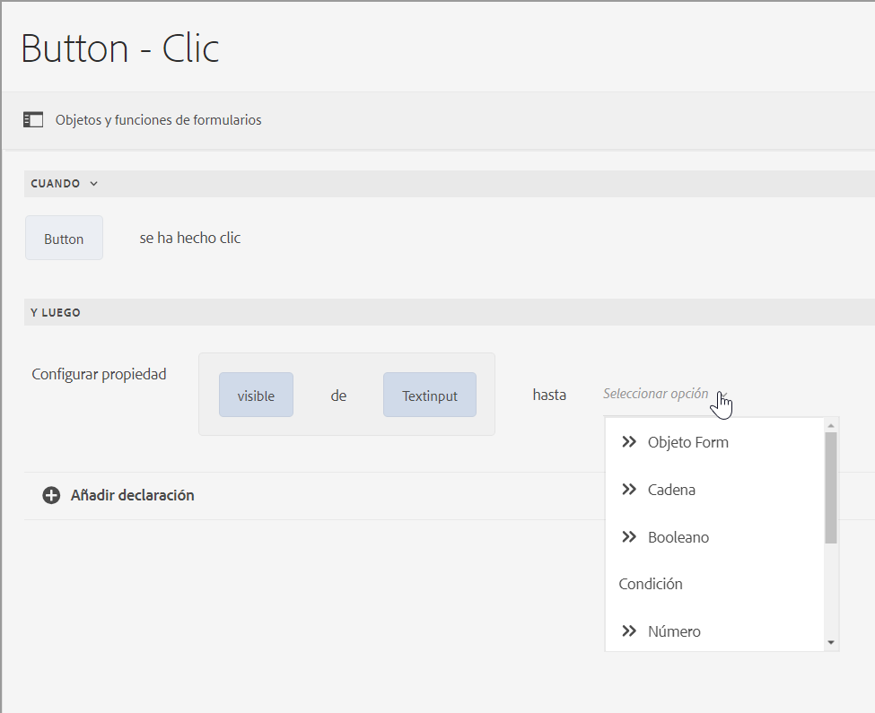
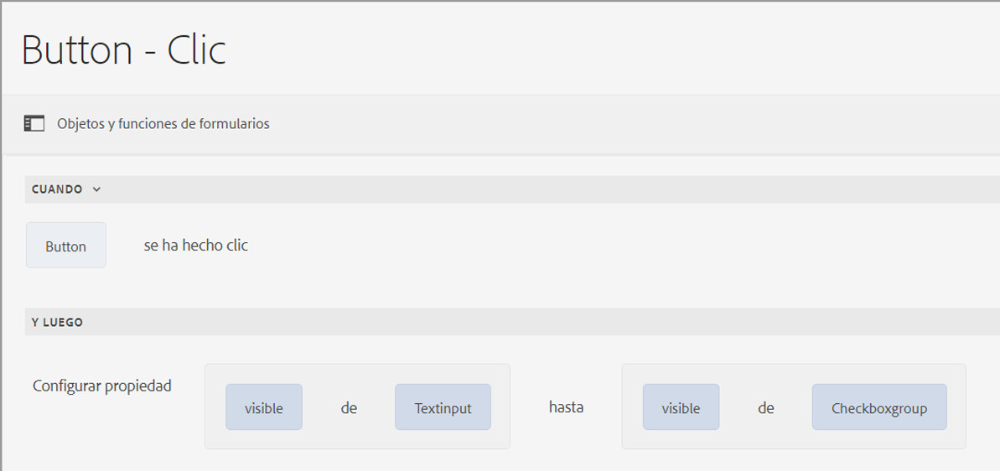
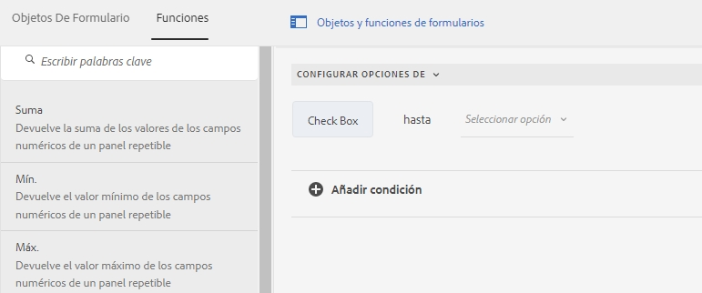
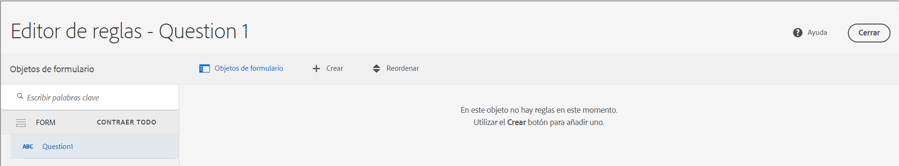
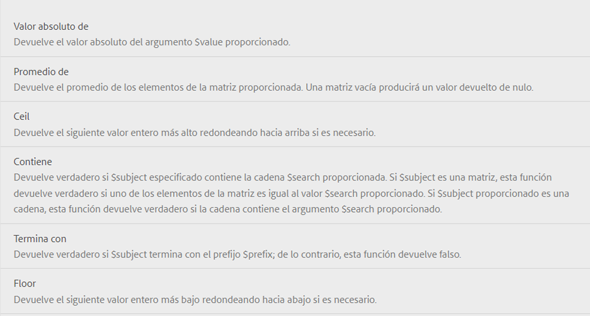
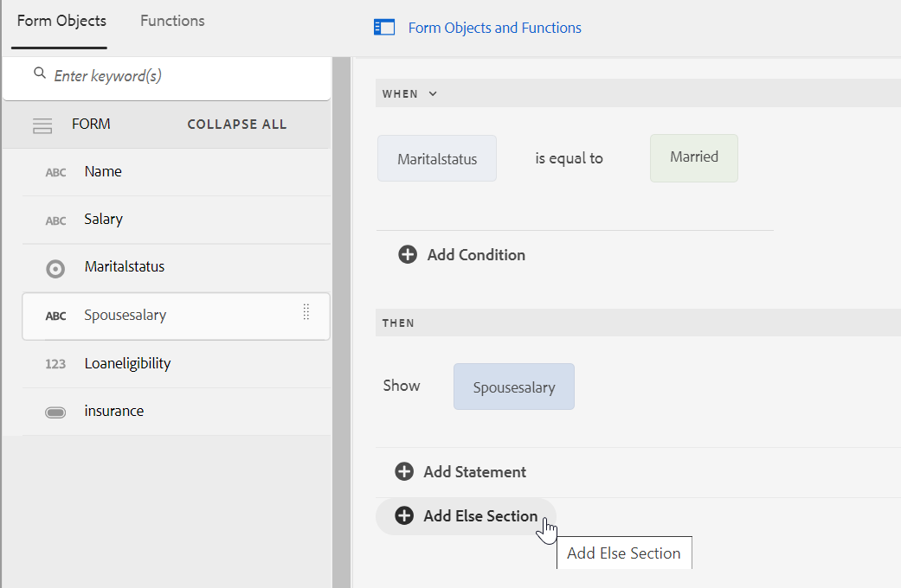
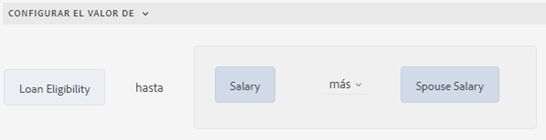
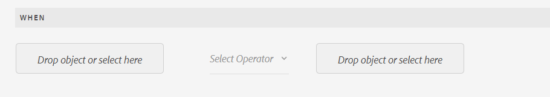
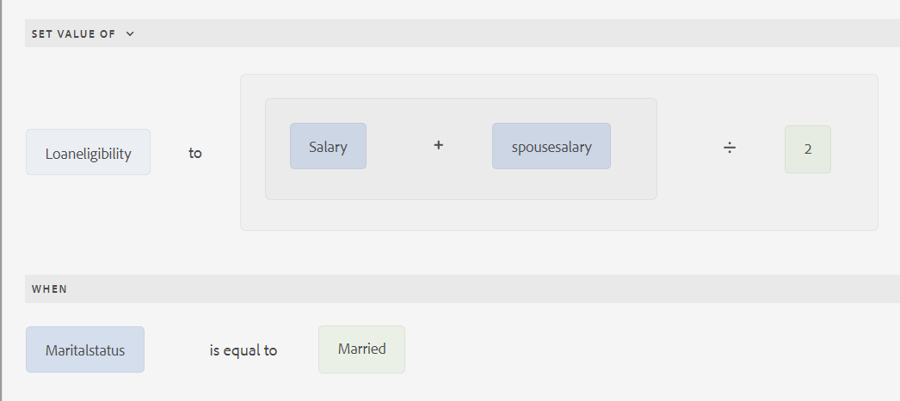
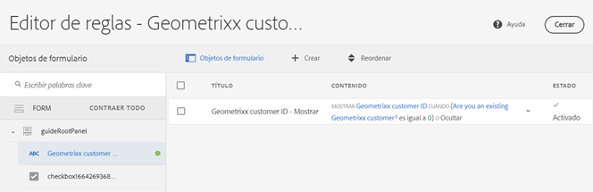

<span class="preview"> Este artículo incluye contenido para algunas funciones previas al lanzamiento. Solo se puede acceder a estas funciones previas al lanzamiento a través de nuestra [canal previo al lanzamiento](https://experienceleague.adobe.com/docs/experience-manager-cloud-service/content/release-notes/prerelease.html?lang=es#new-features). Las funciones del programa previo al lanzamiento son las siguientes:
* Compatibilidad para implementar condiciones anidadas con la funcionalidad When-then-else
* Validar o restablecer paneles y formularios, incluidos campos
* Compatibilidad con funciones de JavaScript modernas, como las funciones izquierda y flecha (compatibilidad con ES10) dentro de funciones personalizadas.
</span>

# Agregar reglas a un formulario adaptable (componentes principales) {#adaptive-forms-rule-editor}

La función de editor de reglas permite a los usuarios y desarrolladores de formularios empresariales escribir reglas sobre los objetos del formulario adaptable. Estas reglas definen las acciones que se deben activar en los objetos del formulario en función de los ajustes preestablecidos, las entradas del usuario y las acciones del usuario en el formulario. Esto ayuda a optimizar aún más la experiencia de cumplimentación de formularios, lo que garantiza precisión y velocidad.

El editor de reglas proporciona una interfaz de usuario intuitiva y simplificada para escribir reglas. El editor de reglas ofrece un editor visual para todos los usuarios.<!-- In addition, only for forms power users, rule editor provides a code editor to write rules and scripts. --> Algunas de las acciones clave que se pueden realizar en objetos de formulario adaptable mediante reglas son las siguientes:

* Mostrar u ocultar un objeto
* Habilitar o deshabilitar un objeto
* Establecer un valor para un objeto
* Validar el valor de un objeto
* Ejecutar funciones para calcular el valor de un objeto
* Invocar un servicio del Modelo de datos de formulario (FDM) y realizar una operación
* Establecer la propiedad de un objeto

<!-- Rule editor replaces the scripting capabilities in [!DNL Experience Manager 6.1 Forms] and earlier releases. However, your existing scripts are preserved in the new rule editor. For more information about working with existing scripts in the rule editor, see [Impact of rule editor on existing scripts](rule-editor.md#p-impact-of-rule-editor-on-existing-scripts-p). -->

Los usuarios que se agregan al grupo de usuarios avanzados de formularios pueden crear scripts y editar los existentes. Los usuarios del grupo [!DNL forms-users] pueden utilizar los scripts, pero no crearlos o editarlos.

## Explicación de una regla {#understanding-a-rule}

Una regla es una combinación de acciones y condiciones. En el editor de reglas, las acciones incluyen actividades como ocultar, mostrar, habilitar, deshabilitar o calcular el valor de un objeto en un formulario. Las condiciones son expresiones booleanas que se evalúan realizando comprobaciones y operaciones en el estado, el valor o la propiedad de un objeto de formulario. Las acciones se realizan según el valor devuelto (`True` o `False`) mediante la evaluación de una condición.

El editor de reglas proporciona un conjunto de tipos de reglas predefinidas, como When, Show, Hide, Enable, Disable, Set Value Of y Validate para ayudarle a escribir reglas. Cada tipo de regla permite definir condiciones y acciones en una regla. El documento explica cada tipo de regla en detalle.

Una regla suele seguir una de las siguientes construcciones:

**Condición-acción**. En esta construcción, una regla primero define una condición seguida de una acción que activar. La construcción es comparable a la instrucción if-then en lenguajes de programación.

En el editor de reglas, el tipo de regla **When** aplica la construcción de condición-acción.

**Acción-condición**. En esta construcción, una regla primero define una acción que activar seguida de condiciones para la evaluación. Otra variación de esta construcción es acción-condición-acción alternativa, que también define una acción alternativa que activar si la condición devuelve un valor False.

Los tipos de reglas Show, Hide, Enable, Disable, Set Value Of y Validate del editor de reglas aplican la construcción de reglas acción-condición. De forma predeterminada, la acción alternativa para Show es Hide y para Enable es Disable y viceversa. No se puede cambiar la acción alternativa predeterminada.

>[!NOTE]
>
>Los tipos de reglas disponibles, incluidas las condiciones y las acciones definidas en el editor de reglas, también dependen del tipo de objeto de formulario en el que se vaya a crear una regla. El editor de reglas solo muestra tipos de reglas y opciones válidas para escribir condiciones e instrucciones de acción para un tipo de objeto de formulario concreto. Por ejemplo, no ve los tipos Validar y Establecer valor de para un objeto panel.

Para obtener más información sobre los tipos de reglas disponibles en el editor de reglas, consulte [Tipos de reglas disponibles en el editor de reglas](rule-editor.md#p-available-rule-types-in-rule-editor-p).

### Pautas para elegir una construcción de regla {#guidelines-for-choosing-a-rule-construct}

Aunque puede lograr la mayoría de los casos de uso utilizando cualquier construcción de regla, estas son algunas pautas para elegir una construcción antes que otra. Para obtener más información sobre las reglas disponibles en el editor de reglas, consulte [Tipos de reglas disponibles en el editor de reglas](rule-editor.md#p-available-rule-types-in-rule-editor-p).

* Una regla general típica al crear una regla es pensarla en el contexto del objeto en el que quiere escribirla. Tenga en cuenta que desea ocultar o mostrar el campo B en función del valor que un usuario especifique en el campo A. En este caso, quiere evaluar una condición en el campo A y, en función del valor que se devuelva, se debe activar una acción en el campo B.

  Por lo tanto, si está escribiendo una regla en el campo B (el objeto sobre el que se evalúa una condición), utilice la construcción condición-acción o el tipo de regla When. Del mismo modo, utilice la construcción acción-condición o el tipo de regla Show o Hide en el campo A.

* A veces, debe realizar varias acciones en función de una condición. En estos casos, se recomienda utilizar la construcción condición-acción. En esta construcción, puede evaluar una condición una vez y especificar varias instrucciones de acción.

  Por ejemplo, para ocultar los campos B, C y D en función de la condición que comprueba el valor que un usuario especifica en el campo A, escriba una regla con la estructura condición-acción o el tipo de regla When en el campo A y especifique acciones para controlar la visibilidad de los campos B, C y D. De lo contrario, necesitará tres reglas independientes en los campos B, C y D, donde cada regla comprueba la condición y muestra u oculta el campo respectivo. En este ejemplo, es más eficaz escribir el tipo de regla When en un objeto, en lugar de Show o Hide en tres objetos.

* Para activar una acción basada en varias condiciones, se recomienda utilizar la construcción acción-condición. Por ejemplo, para mostrar y ocultar el campo A mediante la evaluación de condiciones en los campos B, C y D, utilice el tipo de regla Mostrar u Ocultar en el campo A.
* Utilice la construcción condición-acción o acción-condición si la regla contiene una acción para una condición.
* Si una regla comprueba la existencia de una condición y realiza una acción inmediatamente al proporcionar un valor en un campo o al salir de un campo, se recomienda escribir una regla con la construcción condición-acción o el tipo de regla When en el campo en el que se evalúa la condición.
* La condición de la regla When se evalúa cuando un usuario cambia el valor del objeto en el que se aplica dicha regla. Sin embargo, si desea que la acción se active cuando el valor cambia en el servidor, como para rellenar previamente el valor, se recomienda escribir una regla When que active la acción cuando el campo se inicialice.
* Al escribir reglas para objetos de menús desplegables, botones de opción o casillas de verificación, las opciones o los valores de estos objetos de formulario en el mismo se rellenan previamente en el editor de reglas.

## Tipos de operadores y eventos disponibles en el editor de reglas {#available-operator-types-and-events-in-rule-editor}

El editor de reglas proporciona los siguientes operadores lógicos y eventos mediante los cuales puede crear reglas.

* **Is Equal To**
* **Is Not Equal To**
* **Starts With**
* **Ends With**
* **Contains**
* **Does not contain**
* **Is Empty**
* **Is Not Empty**
* **Has Selected:** devuelve el valor True cuando el usuario selecciona una opción concreta para un botón de opción, un menú desplegable o una casilla de verificación.
* **Is Initialized (event):** devuelve el valor True cuando un objeto de formulario se procesa en el explorador.
* **Is Changed (event):** devuelve el valor True cuando el usuario cambia el valor indicado o la opción seleccionada para un objeto de formulario.

<!--
* **Navigation(event):** Returns true when the user clicks a navigation object. Navigation objects are used to move between panels. 
* **Step Completion(event):** Returns true when a step of a rule completes.
* **Successful Submission(event):** Returns true on successful submission of data to a form data model.
* **Error in Submission(event):**  Returns true on unsuccessful submission of data to a form data model. -->

## Tipos de reglas disponibles en el editor de reglas {#available-rule-types-in-rule-editor}

El editor de reglas proporciona un conjunto de tipos de reglas predefinidas que puede utilizar para escribir reglas. Veamos en detalle cada tipo de regla. Para obtener más información sobre cómo escribir reglas en el editor de reglas, consulte [Escribir reglas](rule-editor.md#p-write-rules-p).

### [!UICONTROL When] {#whenruletype}

El tipo de regla **[!UICONTROL When]** sigue a la construcción de regla **condición-acción-acción alternativa** o, a veces, solo a la construcción **condición-acción**. En este tipo de regla, primero debe especificar una condición para la evaluación seguida de una acción que se activará si se cumple la condición (`True`). Al usar el tipo de regla When, puede usar varios operadores AND y OR para crear [expresiones anidadas](#nestedexpressions).

Con el tipo de regla When, se puede evaluar una condición en un objeto de formulario y realizar acciones en uno o varios objetos.

En palabras simples, una regla When típica está estructurada de la siguiente manera:

`When on Object A:`

`(Condition 1 AND Condition 2 OR Condition 3) is TRUE;`

`Then, do the following:`

Acción 2 en objeto B;
AND
Acción 3 en objeto C;

`Else, do the following:`

Acción 2 en objeto C; _

Cuando tiene un componente de varios valores, como botones de opción o lista, mientras crea una regla para ese componente, las opciones se recuperan automáticamente y se ponen a disposición del creador de reglas. No es necesario volver a escribir los valores de las opciones.

Por ejemplo, una lista tiene cuatro opciones: rojo, azul, verde y amarillo. Al crear la regla, las opciones (botones de opción) se recuperan automáticamente y se ponen a disposición del creador de reglas de la siguiente manera:


Al escribir una regla When, puede activar la acción Clear Value Of. La acción Clear Value Of borra el valor del objeto especificado. Contar con Clear Value Of como opción en la instrucción When permite crear condiciones complejas con varios campos. Puede agregar la instrucción Else para agregar más condiciones


>[!NOTE]
>
> Cuando el tipo de regla solo admite instrucciones de un solo nivel then-else.

**[!UICONTROL Hide]**. Oculta el objeto especificado.

**[!UICONTROL Show]**. Muestra el objeto especificado.

**[!UICONTROL Enable]**. Habilita el objeto especificado.

**[!UICONTROL Disable]**. Deshabilita el objeto especificado.

**[!UICONTROL Invocar servicio]** Invoca un servicio configurado en un modelo de datos de formulario (FDM). Al elegir la operación Invoke Service, aparece un campo. Al pulsar el campo, se muestran todos los servicios configurados en todo el modelo de datos de formulario (FDM) de la aplicación [!DNL Experience Manager] ejemplo. Al elegir un servicio del modelo de datos de formulario, aparecen más campos en los que se pueden asignar objetos de formulario con parámetros de entrada y salida para el servicio especificado. Consulte la regla de ejemplo para invocar los servicios del Modelo de datos de formulario (FDM).

Además del servicio de modelo de datos de formulario, puede especificar una URL de WSDL directa para invocar un servicio web. Sin embargo, un servicio de modelo de datos de formulario tiene muchas ventajas y es el método recomendado para invocar un servicio.

Para obtener más información sobre la configuración de servicios en el modelo de datos de formulario (FDM), consulte [[!DNL Experience Manager Forms] Integración de datos](data-integration.md).

**[!UICONTROL Set value of]**. Calcula y establece el valor del objeto especificado. Puede establecer el valor del objeto en una cadena, el valor de otro objeto, el valor calculado mediante expresión o función matemática, el valor de una propiedad de un objeto o el valor de salida de un servicio configurado de modelo de datos de formulario. Al elegir la opción de servicio web, se muestran todos los servicios configurados en todo el modelo de datos de formulario (FDM) de la [!DNL Experience Manager] ejemplo. Al elegir un servicio del modelo de datos de formulario, aparecen más campos en los que se pueden asignar objetos de formulario con parámetros de entrada y salida para el servicio especificado.

Para obtener más información sobre la configuración de servicios en el modelo de datos de formulario (FDM), consulte [[!DNL Experience Manager Forms] Integración de datos](data-integration.md).

El tipo de regla **[!UICONTROL Establecer propiedad]** permite establecer el valor de una propiedad del objeto especificado en función de una acción de condición. Puede establecer la propiedad en una de las siguientes opciones:
* visible (booleano)
* label.value (String)
* label.visible (booleano)
* description (cadena)
* habilitado (booleano)
* readOnly (booleano)
* obligatorio (booleano)
* screenReaderText (String)
* válido (booleano)
* errorMessage (Cadena)
* predeterminado (número, cadena, fecha)
* enumNames (cadena)[])
* chartType (Cadena)

Por ejemplo, permite definir reglas para mostrar el cuadro de texto cuando se hace clic en un botón. Puede utilizar una función personalizada, un objeto de formulario, una propiedad de objeto o una salida de servicio para definir una regla.



Para definir una regla basada en una función personalizada, seleccione **[!UICONTROL Salida de función]** en la lista desplegable y arrastre y suelte una función personalizada desde la pestaña **[!UICONTROL Funciones]**. Si se cumple la acción de condición, el cuadro de entrada de texto se vuelve visible.

Para definir una regla basada en un objeto de formulario, seleccione **[!UICONTROL Objeto de formulario]** en la lista desplegable y arrastre y suelte un objeto de formulario desde la pestaña **[!UICONTROL Objetos de formulario]**. Si se cumple la acción de condición, el cuadro de entrada de texto se vuelve visible en el formulario adaptable.

La regla Set Property basada en una propiedad de objeto permite hacer visible el cuadro de entrada de texto en un formulario adaptable basándose en otra propiedad de objeto incluida en el formulario adaptable.

En la siguiente figura se muestra un ejemplo de cómo habilitar dinámicamente la casilla de verificación en función de cómo se oculta o se muestra el cuadro de texto en un formulario adaptable:



**[!UICONTROL Clear Value Of]**. Borra el valor del objeto especificado.

**[!UICONTROL Set Focus]**. Define el enfoque del objeto especificado.

**[!UICONTROL Enviar formulario]** Envía el formulario.

**[!UICONTROL Restablecer]** Restablece el formulario o el objeto especificado.

**[!UICONTROL Validate]** Valida el formulario o el objeto especificado.

**[!UICONTROL Add Instance]**. Agrega una instancia del panel repetible o fila de tabla especificados.

**[!UICONTROL Remove Instance]**. Quita una instancia del panel repetible o fila de tabla especificados.

**[!UICONTROL Salida de función]** Define una regla basada en funciones predefinidas o funciones personalizadas.

**[!UICONTROL Navigate to]**. Navega a otros formularios adaptables<!--Interactive Communications,-->, otros recursos, como imágenes o fragmentos de documento, o una URL externa. <!-- For more information, see [Add button to the Interactive Communication](create-interactive-communication.md#addbuttontothewebchannel). -->

**[!UICONTROL Evento de envío]** Déclencheur las acciones o comportamientos específicos en función de condiciones o eventos predefinidos.


### [!UICONTROL Set Value Of] {#set-value-of}

El tipo de regla **[!UICONTROL Fijar valor de]** le permite definir el valor de un objeto de formulario en función de si la condición especificada se cumple o no. El valor puede establecerse en un valor de otro objeto, una cadena literal, un valor derivado de una expresión matemática o una función, un valor de una propiedad de otro objeto o el resultado de un servicio de modelo de datos de formulario. Del mismo modo, se puede comprobar la existencia de una condición en un componente, una cadena, una propiedad o valores derivados de una función o expresión matemática.

El tipo de regla **Set Value Of** no está disponible para todos los objetos de formulario, como paneles y botones de la barra de herramientas. Una regla de valor definido estándar tiene la siguiente estructura:

Set value of Objeto A to:

(cadena ABC) O (propiedad de objeto X de objeto C) O (valor de una función) O (valor de una expresión matemática) O (valor de salida de un servicio del modelo de datos);

When (opcional):

(Condición 1 AND Condición 2 AND Condición 3) is TRUE;

El siguiente ejemplo selecciona el valor de `Question2` as `True` y establece el valor de `Result` as `correct`.


Ejemplo de la regla Set Value usando un servicio de modelo de datos de formulario.

### [!UICONTROL Show] {#show}

Al usar el tipo de regla **[!UICONTROL Show]**, puede escribir una regla para mostrar u ocultar un objeto de formulario en función de si una condición se cumple o no. El tipo de regla Show también activa la acción Hide (ocultar) en caso de que la condición no se cumpla o devuelva un valor `False`.

Una regla Show típica se estructura de la siguiente manera:

`Show Object A;`

`When:`

`(Condition 1 OR Condition 2 OR Condition 3) is TRUE;`

`Else:`

`Hide Object A;`

### [!UICONTROL Hide] {#hide}

Al igual que el tipo de regla Show, puede usar el tipo de regla **[!UICONTROL Hide]** para mostrar u ocultar un objeto de formulario en función de si se cumple o no una condición. El tipo de regla Hide también activa la acción Show (mostrar) en caso de que la condición no se cumpla o devuelva un valor `False`.

Una regla Hide típica se estructura de la siguiente manera:

`Hide Object A;`

`When:`

`(Condition 1 AND Condition 2 AND Condition 3) is TRUE;`

`Else:`

`Show Object A;`

### [!UICONTROL Enable] {#enable}

El tipo de regla **[!UICONTROL Enable]** permite activar o desactivar un objeto de formulario en función de si se cumple o no una condición. El tipo de regla Enable también activa la acción Disable en caso de que la condición no se cumpla o devuelva un valor `False`.

Una regla Enable típica se estructura de la siguiente manera:

`Enable Object A;`

`When:`

`(Condition 1 AND Condition 2 AND Condition 3) is TRUE;`

`Else:`

`Disable Object A;`

### [!UICONTROL Disable] {#disable}

Similar al tipo de regla Habilitar, el tipo de regla **[!UICONTROL Deshabilitar]** permite habilitar o deshabilitar un objeto de formulario en función de si se cumple o no una condición. El tipo de regla Disable también activa la acción Enable (habilitar) en caso de que la condición no se cumpla o devuelva un valor `False`.

Una regla Disable típica se estructura de la siguiente manera:

`Disable Object A;`

`When:`

`(Condition 1 OR Condition 2 OR Condition 3) is TRUE;`

`Else:`

`Enable Object A;`

### [!UICONTROL Validate] {#validate}

El tipo de regla **[!UICONTROL Validate]** valida el valor de un campo mediante una expresión. Por ejemplo, puede escribir una expresión para comprobar que el cuadro de texto para especificar el nombre no contenga caracteres especiales ni números.

Una regla Validar típica se estructura de la siguiente manera:

`Validate Object A;`

`Using:`

`(Expression 1 AND Expression 2 AND Expression 3) is TRUE;`

>[!NOTE]
>
>Si el valor especificado no cumple la regla Validar, puede mostrar un mensaje de validación al usuario. Puede especificar la notificación en el **[!UICONTROL mensaje de validación del script]** en las propiedades del componente, en la barra lateral.


<!--
### [!UICONTROL Set Options Of] {#setoptionsof}

The **[!UICONTROL Set Options Of]** rule type enables you to define rules to add check boxes dynamically to the Adaptive Form. You can use a Form Data Model or a custom function to define the rule.

To define a rule based on a custom function, select **[!UICONTROL Function Output]** from the drop-down list, and drag-and-drop a custom function from the **[!UICONTROL Functions]** tab. The number of checkboxes defined in the custom function are added to the Adaptive Form.



To create a custom function, see [custom functions in rule editor](#custom-functions).

To define a rule based on a form data model:

1. Select **[!UICONTROL Service Output]** from the drop-down list.
1. Select the data model object.
1. Select a data model object property from the **[!UICONTROL Display Value]** drop-down list. The number of checkboxes in the Adaptive Form is derived from the number of instances defined for that property in the database.
1. Select a data model object property from the **[!UICONTROL Save Value]** drop-down list.

 -->

## Explicación de la interfaz de usuario del editor de reglas {#understanding-the-rule-editor-user-interface}

El editor de reglas proporciona una interfaz de usuario completa pero sencilla para escribir y administrar reglas. Puede iniciar la interfaz de usuario del editor de reglas desde un formulario adaptable en modo de creación.

Para iniciar la interfaz de usuario del editor de reglas:

1. Abra un formulario adaptable en modo de creación.
1. Seleccione el objeto de formulario para el que desea escribir una regla y, en la barra de herramientas de componentes, seleccione .  Aparecerá la interfaz de usuario del editor de reglas.

   

   Cualquier regla existente en los objetos de formulario seleccionados se muestra en esta vista. Para obtener información sobre la administración de reglas existentes, consulte [Administrar reglas](rule-editor.md#p-manage-rules-p).

1. Seleccione **[!UICONTROL Crear]** para escribir una regla nueva. El editor visual de la interfaz de usuario del editor de reglas se abre de forma predeterminada cuando se inicia el editor de reglas por primera vez.

   

Veamos en detalle cada componente de la interfaz de usuario del editor de reglas.

### A. Visualización de la regla de componente {#a-component-rule-display}

Muestra el título del objeto de formulario adaptable a través del cual se ha iniciado el editor de reglas y el tipo de regla seleccionado actualmente. En el ejemplo anterior, el editor de reglas se inicia desde un objeto de formulario adaptable llamado Pregunta 1 y el tipo de regla seleccionado es Cuándo.

### B. Desde objetos y funciones {#b-form-objects-and-functions-br}

El panel de la izquierda de la interfaz de usuario del editor de reglas incluye dos pestañas: **[!UICONTROL Objetos de formulario]** y **[!UICONTROL Funciones]**.

La pestaña Objetos de formulario muestra una vista jerárquica de todos los objetos contenidos en el formulario adaptable. Muestra el título y el tipo de los objetos. Al escribir una regla, puede arrastrar y soltar objetos de formulario en el editor de reglas. Al crear o editar una regla cuando arrastra y suelta un objeto o función en un marcador de posición, el marcador de posición toma automáticamente el tipo de valor apropiado.

Los objetos de formulario que tienen una o más reglas válidas aplicadas se marcan con un punto verde. Si alguna de las reglas aplicadas a un objeto de formulario no es válida, el objeto de formulario se marca con un punto amarillo.

La pestaña Funciones incluye un conjunto de funciones integradas, como Sum Of (suma de), Min Of (mín. de), Max Of (máx. de), Average Of (promedio de), Number Of (número de) y Validate Form (validar formulario). Puede utilizar estas funciones para calcular valores en paneles repetibles y filas de tabla y utilizarlos en instrucciones de acción y condición al escribir reglas. Sin embargo, también puede crear funciones personalizadas.

Algunas de las funciones de la lista se muestran en la figura:



>[!NOTE]
>
>Puede buscar texto en nombres de objetos y funciones y títulos en las pestañas Objetos de formulario y Funciones.

En el árbol izquierdo de los objetos de formulario, puede seleccionar los objetos de formulario para mostrar las reglas aplicadas a cada uno de ellos. No solo puede desplazarse por las reglas de los distintos objetos de formulario, sino que también puede copiar y pegar reglas entre los objetos de formulario. Para obtener más información, consulte [Copiar y pegar reglas](rule-editor.md#p-copy-paste-rules-p).

### C. Alternar entre funciones y objetos de formulario {#c-form-objects-and-functions-toggle-br}

Al pulsar el botón de cambio, se alternan los paneles de funciones y de objetos de formulario.

### D. Editor de reglas visual {#visual-rule-editor}

El editor de reglas visual es el área del modo de editor visual de la interfaz de usuario del editor de reglas donde se escriben las reglas. Permite seleccionar un tipo de regla y definir las condiciones y las acciones correspondientes. Al definir condiciones y acciones en una regla, puede arrastrar y soltar funciones y objetos de formulario desde el panel Objetos de formulario y el de Funciones.

Para obtener más información sobre el uso del editor de reglas visuales, consulte [Escribir reglas](rule-editor.md#p-write-rules-p).
<!-- 
### E. Visual-code editors switcher {#e-visual-code-editors-switcher}

Users in the forms-power-users group can access code editor. For other users, code editor is not available. If you have the rights, you can switch from visual editor mode to code editor mode of the rule editor, and conversely, using the switcher right above the rule editor. When you launch rule editor the first time, it opens in the visual editor mode. You can write rules in the visual editor mode or switch to the code editor mode to write a rule script. However, note that if you modify a rule or write a rule in code editor, you cannot switch back to the visual editor for that rule unless you clear the code editor.

[!DNL Experience Manager Forms] tracks the rule editor mode you used last to write a rule. When you launch the rule editor next time, it opens in that mode. However, you can also configure a default mode to open the rule editor in the specified mode. To do so:

1. Go to [!DNL Experience Manager] web console at `https://[host]:[port]/system/console/configMgr`.
1. Click to edit **[!UICONTROL Adaptive Form Configuration Service]**.
1. choose **[!UICONTROL Visual Editor]** or **[!UICONTROL Code Editor]** from the **[!UICONTROL Default Mode for Rule Editor]** drop-down

1. Click **[!UICONTROL Save]**.
-->

### E. Botones de finalización y cancelación {#done-and-cancel-buttons}

El botón **[!UICONTROL Listo]** se utiliza para guardar una regla. Puede guardar una regla incompleta. Sin embargo, las que estén incompletas no son válidas, por lo tanto, no se ejecutan. Las reglas guardadas en un objeto de formulario se enumeran cuando se inicia el editor de reglas la próxima vez desde el mismo objeto. Puede administrar las reglas existentes en esa vista. Para obtener más información, consulte [Administrar reglas](rule-editor.md#p-manage-rules-p).

El botón **[!UICONTROL Cancelar]** descarta los cambios realizados en una regla y cierra el editor de reglas.

## Escribir reglas {#write-rules}

Puede escribir reglas mediante el editor visual de reglas <!-- or the code editor. When you launch the rule editor the first time, it opens in the visual editor mode. You can switch to the code editor mode and write rules. However, if you write or modify a rule in code editor, you cannot switch to the visual editor for that rule unless you clear the code editor. When you launch the rule editor next time, it opens in the mode that you used last to create rule. -->

Veamos primero cómo escribir reglas utilizando el editor visual.

### Uso del editor visual {#using-visual-editor}

Vamos a comprender cómo crear una regla en el editor visual utilizando el siguiente formulario de ejemplo.


La sección Loan Requirements (requisitos de préstamo) del formulario de solicitud de ejemplo requiere que los solicitantes especifiquen su estado civil, su salario y, si están casados, el salario de su cónyuge. En función de las entradas del usuario, la regla calcula la cantidad de idoneidad para el préstamo y se muestra en el campo Loan Eligibility (elegibilidad del préstamo). Aplique las siguientes reglas para implementar el escenario:

* El campo Spouse’s Salary (salario del cónyuge) solo se muestra cuando en el estado civil (Marital Status) se indica que se está casado o casada (Married).
* La cantidad de la elegibilidad del préstamo es el 50 % del salario total.

Para escribir las reglas, realice los siguientes pasos:

1. En primer lugar, escriba la regla para controlar la visibilidad del campo del salario del cónyuge en función de la opción que seleccione el usuario para el botón de opción de estado civil.

   Abra el formulario de solicitud de préstamo en modo de creación. Seleccione el componente **[!UICONTROL Estado civil]** y haga clic en . A continuación, seleccione **[!UICONTROL Crear]** para iniciar el editor de reglas.

   

   Al iniciar el editor de reglas, la regla When se selecciona de forma predeterminada. Además, el objeto de formulario (en este caso, Marital Status) desde el que se inició el editor de reglas se especifica en la instrucción When.

   Aunque no puede cambiar ni modificar el objeto seleccionado, puede utilizar la lista desplegable de reglas, como se muestra a continuación, para seleccionar otro tipo de regla. Si desea crear una regla en otro objeto, seleccione Cancelar para salir del editor de reglas y volver a iniciarlo desde el objeto de formulario deseado.

1. Seleccione el menú desplegable **[!UICONTROL Seleccionar estado]** y haga clic en **[!UICONTROL es igual a]**. Aparece el campo **[!UICONTROL Escribir una cadena]**.

   

<!--  In the Marital Status radio button, **[!UICONTROL Married]** and **[!UICONTROL Single]** options are assigned **0** and **1** values, respectively. You can verify assigned values in the Title tab of the Edit radio button dialog as shown below.

   -->

1. En el **[!UICONTROL Introduzca una cadena]** en la regla, seleccione **Casado** en el menú desplegable.

   

   Ha definido la condición como `When Marital Status is equal to Married`. A continuación, defina la acción que se realizará si esta condición es True.

1. En la instrucción Then, seleccione **[!UICONTROL Show]** de la lista desplegable **[!UICONTROL Seleccionar acción]**.

   

1. Arrastre y suelte el campo **[!UICONTROL Spouse Salary]** de la pestaña Objetos de formulario en el campo **[!UICONTROL Colocar objeto o seleccionar aquí]**. Como alternativa, seleccione el campo **[!UICONTROL Colocar objeto o seleccionar aquí]** y seleccionar el campo **[!UICONTROL Salario del cónyuge]** del menú emergente, que enumera todos los objetos del formulario.

   

   A continuación, defina la acción que se realizará si esta condición es False.
1. Clic **[!UICONTROL Agregar otra sección]** para añadir otra condición para **[!UICONTROL Salario del cónyuge]** , en caso de que seleccione Marital Status como single.

   


1. En la instrucción Else, seleccione **[!UICONTROL Hide]** desde el **[!UICONTROL Seleccionar acción]** menú desplegable.
   

1. Arrastre y suelte el campo **[!UICONTROL Spouse Salary]** de la pestaña Objetos de formulario en el campo **[!UICONTROL Colocar objeto o seleccionar aquí]**. Como alternativa, seleccione el campo **[!UICONTROL Colocar objeto o seleccionar aquí]** y seleccionar el campo **[!UICONTROL Salario del cónyuge]** del menú emergente, que enumera todos los objetos del formulario.
   

   La regla aparece de la siguiente manera en el editor.

   


1. Seleccione **[!UICONTROL Listo]** para guardar la regla.

<!--
1. Repeat steps 1 through 5 to define another rule to hide the Spouse Salary field if the marital Status is Single. The rule appears as follows in the rule editor.

    -->

>[!NOTE]
>
> Como alternativa, puede escribir una regla Show en el campo Spouse Salary, en lugar de reglas When en el campo Marital Status, para implementar el mismo comportamiento.


1. A continuación, escriba una regla para calcular el importe de idoneidad para el préstamo, que es el 50 % del salario total, y muéstrela en el campo Loan Eligibility. Para lograr este resultado, cree reglas **[!UICONTROL Set Value Of]** sobre el campo Loan Eligibility.

   En el modo de creación, seleccione el campo **[!UICONTROL Idoneidad del préstamo]** y haga clic en . A continuación, seleccione **[!UICONTROL Crear]** para iniciar el editor de reglas.

1. Seleccione la regla **[!UICONTROL Set Value Of]** en la lista desplegable de reglas.

   

1. Seleccione **[!UICONTROL Seleccionar opción]** y seleccione **[!UICONTROL Expresión matemática]**. Se abre un campo para escribir una expresión matemática.

   

1. En el campo de la expresión:

   * Seleccione o arrastre y suelte desde la pestaña Objetos de formulario el campo **[!UICONTROL Salary]** (salario) en el primer campo **[!UICONTROL Colocar objeto o seleccionar aquí]**.

   * Seleccione **[!UICONTROL Más]** en el campo **[!UICONTROL Seleccionar operador]**.

   * Seleccione o arrastre y suelte desde la pestaña Objetos de formulario el campo **[!UICONTROL Spouse Salary]** en el otro campo **[!UICONTROL Colocar objeto o seleccionar aquí]**.

   

1. A continuación, seleccione el área resaltada alrededor del campo de expresión y haga clic en **[!UICONTROL Ampliar expresión]**.

   

   En el campo para ampliar la expresión, seleccione **[!UICONTROL divided byr]** en el campo **[!UICONTROL Seleccionar operador]** y **[!UICONTROL Número]** en el campo **[!UICONTROL Seleccionar opción]**. A continuación, especifique **[!UICONTROL 2]** en el campo de número.

   

   >[!NOTE]
   >
   >Puede crear expresiones complejas utilizando componentes, funciones, expresiones matemáticas y valores de propiedad del campo Seleccionar opción.

   A continuación, cree una condición que, cuando devuelva un valor True, ejecute la expresión.

1. Seleccione **[!UICONTROL Agregar condición]** para agregar una instrucción When.

   

   En la instrucción When:

   * Seleccione o arrastre y suelte desde la pestaña Objetos de formulario el campo **[!UICONTROL Marital Status]** en el primer campo **[!UICONTROL Colocar objeto o seleccionar aquí]**.

   * Seleccione **[!UICONTROL is equal to]** en el campo **[!UICONTROL Seleccionar operador]**.

   * Seleccione Cadena en el otro campo **[!UICONTROL Colocar objeto o seleccionar aquí]** y especifique **[!UICONTROL Married]** en el campo **[!UICONTROL Escribir una cadena]**.

   La regla finalmente aparece de la siguiente manera en el editor de reglas. 

1. Seleccione **[!UICONTROL Listo]**.  Se guarda la regla.

1. Repita los pasos del 7 al 14 para definir otra regla que calcule la idoneidad del préstamo si el estado civil es Single (soltero o soltera). La regla aparece de la siguiente manera en el editor.

   

También puede utilizar la regla Set Value Of para calcular la idoneidad del préstamo en la regla When que creó para mostrar u ocultar el campo Spouse Salary. La regla combinada resultante cuando el estado civil es Single aparece de la siguiente manera en el editor de reglas.


Puede escribir una regla combinada para controlar la visibilidad del campo Spouse Salary y calcular la idoneidad del préstamo cuando el estado civil sea Married con la condición Else.


<!-- ### Using code editor {#using-code-editor}

Users added to the forms-power-users group can use code editor. The rule editor auto generates the JavaScript code for any rule you create using visual editor. You can switch from visual editor to the code editor to view the generated code. However, if you modify the rule code in the code editor, you cannot switch back to the visual editor. If you prefer writing rules in code editor rather than visual editor, you can write rules afresh in the code editor. The visual-code editors switcher helps you switch between the two modes.

The code editor JavaScript is the expression language of Adaptive Forms. All the expressions are valid JavaScript expressions and use Adaptive Forms scripting model APIs. These expressions return values of certain types. For the complete list of Adaptive Forms classes, events, objects, and public APIs, see [JavaScript Library API reference for Adaptive Forms](https://helpx.adobe.com/experience-manager/6-5/forms/javascript-api/index.html).

For more information about guidelines to write rules in the code editor, see [Adaptive Form Expressions](adaptive-form-expressions.md).

While writing JavaScript code in the rule editor, the following visual cues help you with the structure and syntax:

* Syntax highlights

* Auto Indentation

* Hints and suggestions for Form objects, functions, and their properties

* Auto completion of form component names and common JavaScript functions


-->

#### Funciones personalizadas en el editor de reglas {#custom-functions}

Aparte de las funciones integradas, como *Suma de* que se enumeran en **Salida de funciones** Además, también puede utilizar funciones personalizadas en el editor de reglas. El editor de reglas admite la sintaxis de JavaScript ECMAScript 2019 para scripts y funciones personalizadas. Para obtener instrucciones sobre la creación de funciones personalizadas, consulte el artículo [Funciones personalizadas en Forms adaptable](/help/forms/create-and-use-custom-functions.md).

<!--

Ensure that the function you write is accompanied by the `jsdoc` above it. Adaptive Form supports the various [JavaScript annotations for custom functions](/help/forms/create-and-use-custom-functions.md#js-annotations).

For more information, see [jsdoc.app](https://jsdoc.app/).

Accompanying `jsdoc` is required:

* If you want custom configuration and description
* Because there are multiple ways to declare a function in `JavaScript,` and comments let you keep a track of the functions.

Supported `jsdoc` tags:

* **Private**
  Syntax: `@private`
  A private function is not included as a custom function.

* **Name**
  Syntax: `@name funcName <Function Name>`
  Alternatively `,` you can use: `@function funcName <Function Name>` **or** `@func` `funcName <Function Name>`.
  `funcName` is the name of the function (no spaces allowed).
  `<Function Name>` is the display name of the function.

* **Parameter**
  Syntax: `@param {type} name <Parameter Description>`
  Alternatively, you can use: `@argument` `{type} name <Parameter Description>` **or** `@arg` `{type}` `name <Parameter Description>`.
  Shows parameters used by the function. A function can have multiple parameter tags, one tag for each parameter in the order of occurrence.
  `{type}` represents parameter type. Allowed parameter types are:

    1. string
    2. number
    3. boolean
    4. scope
    5. string[]
    6. number[]
    7. boolean[]
    8. date
    9. date[]
    10. array
    11. object

   `scope` refers to a special globals object which is provided by forms runtime. It must be the last parameter and is not be visible to the user in the rule editor. You can use scope to access readable form and field proxy object to read properties, event which triggered the rule and a set of functions to manipulate the form.

   `object` type is used to pass readable field object in parameter to a custom function instead of passing the value.

   All parameter types are categorized under one of the above. None is not supported. Ensure that you select one of the types above. Types are not case-sensitive. Spaces are not allowed in the parameter name.  Parameter description can have multiple words.

* **Optional Parameter**
Syntax: `@param {type=} name <Parameter Description>` 
Alternatively, you can use: `@param {type} [name] <Parameter Description>`
By default all parameters are mandatory. You can mark a parameter optional by adding `=` in type of the parameter or by putting param name in square brackets.
   
   For example, let us declare `Input1` as optional parameter:
    * `@param {type=} Input1`
    * `@param {type} [Input1]`

* **Return Type**
  Syntax: `@return {type}`
  Alternatively, you can use `@returns {type}`.
  Adds information about the function, such as its objective.
  {type} represents the return type of the function. Allowed return types are:

    1. string
    2. number
    3. boolean
    4. string[]
    5. number[]
    6. boolean[]
    7. date
    8. date[]
    9. array
    10. object

  All other return types are categorized under one of the above. None is not supported. Ensure that you select one of the types above. Return types are not case-sensitive.

**Adding a custom function**

For example, you want to add a custom function which calculates area of a square. Side length is the user input to the custom function, which is accepted using a numeric box in your form. The calculated output is displayed in another numeric box in your form. To add a custom function, you have to first create a client library, and then add it to the CRX repository.

To create a client library and add it in the CRX repository, perform the following steps:

1. Create a client library. For more information, see [Using Client-Side Libraries](https://experienceleague.adobe.com/docs/experience-manager-cloud-service/implementing/developing/full-stack/clientlibs.html#developing).
2. In CRXDE, add a property `categories`with string type value as `customfunction` to the `clientlib` folder.

   >[!NOTE]
   >
   >`customfunction`is an example category. You can choose any name for the category you create in the `clientlib`folder.

After you have added your client library in the CRX repository, use it in your Adaptive Form. It lets you use your custom function as a rule in your form. To add the client library in your Adaptive Form, perform the following steps:

1. Open your form in edit mode.
   To open a form in edit mode, select a form and select **[!UICONTROL Open]**.
1. In the edit mode, select a component, then select  &gt; **[!UICONTROL Adaptive Form Container]**, and then select .
1. In the sidebar, under Name of Client Library, add your client library. ( `customfunction` in the example.)

   

1. Select the input numeric box, and select  to open the rule editor.
1. Select **[!UICONTROL Create Rule]**. Using options shown below, create a rule to save the squared value of the input in the Output field of your form.

   [](assets/add-custom-rule.png)
  
1. Select **[!UICONTROL Done]**. Your custom function is added.

   >[!NOTE]
   >
   > To invoke a form data model from rule editor using custom functions, [see here](/help/forms/using-form-data-model.md#invoke-services-in-adaptive-forms-using-rules-invoke-services). 

#### Function declaration supported types {#function-declaration-supported-types}

**Function Statement**

```javascript
function area(len) {
    return len*len;
}
```

This function is included without `jsdoc` comments.

**Function Expression**

```javascript
var area;
//Some codes later
/** */
area = function(len) {
    return len*len;
};
```

**Function Expression and Statement**

```javascript
var b={};
/** */
b.area = function(len) {
    return len*len;
}
```

**Function Declaration as Variable**

```javascript
/** */
var x1,
    area = function(len) {
        return len*len;
    },
    x2 =5, x3 =true;
```

Limitation: custom function picks only the first function declaration from the variable list, if together. You can use function expression for every function declared.

**Function Declaration as Object**

```javascript
var c = {
    b : {
        /** */
        area : function(len) {
            return len*len;
        }
    }
};
```

>[!NOTE]
>
>Ensure that you use `jsdoc` for every custom function. Although `jsdoc`comments are encouraged, include an empty `jsdoc`comment to mark your function as custom function. It enables default handling of your custom function.
-->

## Administrar reglas {#manage-rules}

Cualquier regla existente en un objeto de formulario aparece enumerada al seleccionar el objeto y seleccionar . Puede ver el título y una vista previa del resumen de la regla. Además, la IU le permite expandir y ver el resumen completo de las reglas, cambiar el orden, editarlas y eliminarlas.


Puede realizar las siguientes acciones en reglas:

* **Ampliar/contraer**: la columna Contenido de la lista de reglas muestra el contenido de las reglas. Si todo el contenido de la regla no es visible en la vista predeterminada, seleccione  para ampliarla.

* **Reordenar**: cualquier regla nueva que cree se apilará en la parte inferior de la lista de reglas. Las reglas se ejecutan de arriba a abajo. La regla de la parte superior se ejecuta primero, seguida de otras reglas del mismo tipo. Por ejemplo, si tiene las reglas When, Show, Enable y When en las posiciones primera, segunda, tercera y cuarta desde la parte superior, respectivamente, la regla When en la parte superior se ejecuta primero, seguida de la regla When en la cuarta posición. A continuación, se ejecutan las reglas Show y Enable. 
Puede cambiar el orden de una regla al pulsar  o arrástrela hasta el orden deseado en la lista.

* **Editar**: para editar una regla, active la casilla de verificación situada junto al título de la misma. Aparecerán las opciones para editar y eliminar la regla. Seleccione **[!UICONTROL Editar]** para abrir la regla seleccionada en el editor de reglas <!-- in visual  or code editor mode depending on the mode used to create the rule -->.

* **Eliminar**: para eliminar una regla, selecciónela y presione **[!UICONTROL Eliminar]**.

* **Habilitar/deshabilitar**: cuando tenga que suspender temporalmente el uso de una regla, puede seleccionar una o más reglas y seleccionar **[!UICONTROL Deshabilitar]** en la barra de herramientas de acciones para deshabilitarlas. Si una regla está deshabilitada, no se ejecuta en el tiempo de ejecución. Para habilitar una regla que esté deshabilitada, puede seleccionarla y seleccionar Habilitar en la barra de herramientas de acciones. La columna de estado de la regla muestra si la regla está habilitada o deshabilitada.


## Copiar y pegar reglas {#copy-paste-rules}

Puede copiar y pegar una regla de un campo a otros campos similares para ahorrar tiempo.

Para copiar y pegar reglas, haga lo siguiente:

1. Seleccione el objeto de formulario del que desea copiar una regla y, en la barra de herramientas de componentes, seleccione . La interfaz de usuario del editor de reglas aparece con el objeto de formulario seleccionado y aparecen las reglas existentes.

   

   Para obtener información sobre la administración de reglas existentes, consulte [Administrar reglas](rule-editor.md#p-manage-rules-p).

1. Seleccione la casilla de verificación situada junto al título de la regla. Aparecerán las opciones para administrar la regla. Seleccione **[!UICONTROL Copiar]**.

   

1. Seleccione otro objeto de formulario al que desee pegar la regla y eija **[!UICONTROL Pegar]**. Además, puede editar la regla para realizar cambios en ella.

   >[!NOTE]
   >
   >Puede pegar una regla en otro objeto de formulario solo si dicho objeto de formulario admite el evento de regla copiada. Por ejemplo, un botón admite el evento de clic. Puede pegar una regla con un evento de clic en un botón, pero no en una casilla de verificación.

1. Seleccione **[!UICONTROL Listo]** para guardar la regla.

## Expresiones anidadas {#nestedexpressions}

El editor de reglas permite utilizar varios operadores AND y OR para crear reglas anidadas. Puede combinar varios operadores AND y OR en las reglas.

A continuación verá un ejemplo de una regla anidada que muestra un mensaje al usuario sobre la elegibilidad para la custodia de un niño cuando se cumplen las condiciones requeridas.


También puede arrastrar y soltar condiciones dentro de una regla para editarla. Seleccione y pase el ratón por encima del controlador () antes de una condición. Una vez que el puntero se convierta en el símbolo de mano como se muestra a continuación, arrastre y suelte la condición en cualquier lugar dentro de la regla. La estructura de la regla cambia.


## Condiciones de expresión de fecha {#dateexpression}

El editor de reglas permite usar comparaciones de fechas para crear condiciones.

A continuación verá una condición de ejemplo que muestra un objeto de texto estático si la hipoteca de la casa ya está cogida, lo que el usuario indica rellenando el campo de la fecha.

Cuando la fecha de la hipoteca de la propiedad tal como la ha rellenado el usuario es anterior, el formulario adaptable muestra una nota sobre el cálculo de ingresos. La siguiente regla compara la fecha rellenada por el usuario con la fecha actual y si la fecha rellenada por el usuario es anterior a la fecha actual, el formulario muestra el mensaje de texto, denominada Income (ingresos).


Cuando la fecha de rellenado es anterior a la fecha actual, el formulario muestra el mensaje de texto (Income) de la siguiente manera:


## Condiciones de comparación de números {#number-comparison-conditions}

El editor de reglas permite crear condiciones que comparen dos números.

A continuación verá una condición de ejemplo que muestra un objeto de texto estático si el número de meses que un solicitante permanece en la dirección actual es inferior a 36.


Si el usuario indica que lleva menos de 36 meses viviendo en su actual domicilio, el formulario muestra una notificación en la que se indica que se pueden solicitar más pruebas de residencia.


<!-- ## Impact of rule editor on existing scripts {#impact-of-rule-editor-on-existing-scripts}

In [!DNL Experience Manager Forms] versions prior to [!DNL Experience Manager 6.1 Forms] feature pack 1, form authors and developers used to write expressions in the Scripts tab of the Edit component dialog to add dynamic behavior to Adaptive Forms. The Scripts tab is now replaced by the rule editor.

Any scripts or expressions that you must have written in the Scripts tab are available in the rule editor. While you cannot view or edit them in visual editor, if you are a part of the forms-power-users group you can edit scripts in code editor. -->

## Reglas de ejemplo {#example}

### Invocar servicio de modelo de datos de formulario {#invoke}

Piense en un servicio web `GetInterestRates` que toma el importe del préstamo, el ejercicio y la puntuación crediticia del solicitante como entrada y devuelve un plan de préstamo que incluye el importe del EMI y el tipo de interés. Puede crear un modelo de datos de formulario (FDM) utilizando el servicio web como fuente de datos. Se agregan objetos del modelo de datos y un servicio `get` al modelo de formulario. El servicio aparece en la pestaña Servicios del modelo de datos de formulario (FDM). A continuación, cree un formulario adaptable que incluya campos de los objetos del modelo de datos para capturar las entradas del usuario para el importe del préstamo, el ejercicio y la puntuación crediticia. Agregue un botón que active el servicio web para obtener detalles del plan. La salida se rellena en los campos adecuados.

La regla siguiente muestra cómo configurar la acción Invocar servicio para que se realice el escenario de ejemplo.


>[!NOTE]
>
>Si la entrada es de tipo matriz, los campos que admiten matrices se pueden ver en la sección desplegable Output.

### Activación de varias acciones mediante la regla When {#triggering-multiple-actions-using-the-when-rule}

En un formulario de solicitud de préstamo, se desea capturar si el solicitante del préstamo es o no un cliente existente. En función de la información que proporcione el usuario, el campo ID de cliente debería mostrarse u ocultarse. Además, desea centrarse en el campo ID del cliente si el usuario es un cliente existente. El formulario de solicitud de préstamo tiene los siguientes componentes:

* Un botón de opción, **[!UICONTROL Are you an existing Geometrixx customer? (¿Es cliente de Geometrixx?)]**, que proporciona las opciones [!UICONTROL Yes] (sí) y [!UICONTROL No]. El valor de Yes es **0** y No es **1**.

* Un campo de texto, **[!UICONTROL Geometrixx customer ID]** (ID de cliente de Geometrixx), para especificar el ID de cliente.

Cuando escriba una regla When en el botón de radio para implementar este comportamiento, la regla aparecerá de la siguiente manera en el editor de reglas visuales.


Regla en el editor visual

En la regla de ejemplo, la instrucción de la sección When es la condición que, cuando devuelve el valor True, ejecuta las acciones especificadas en la sección Then.

<!-- The rule appears as follows in the code editor.

 

Rule in the code editor -->

### Uso de una salida de función en una regla {#using-a-function-output-in-a-rule}

En un formulario de pedido de compra, tiene la siguiente tabla, en la que los usuarios rellenan sus pedidos. En esta tabla:

* La primera fila es repetible, por lo que los usuarios pueden solicitar varios productos y especificar cantidades diferentes. Su nombre de elemento es `Row1`.
* El título de la celda de la columna Product Quantity (cantidad de producto) de la fila repetible es Quantity (cantidad). El nombre de elemento de esta celda es `productquantity`.
* La segunda fila de la tabla es no repetible y el título de la celda de la columna Product Quantity de esta fila es Total Quantity (cantidad total).


**A.** Row1 **B.** Quantity **C.** Total Quantity

Ahora, desea agregar cantidades especificadas en la columna Product Quantity para todos los productos y mostrar la suma en la celda Total Quantity. Puede obtener esta suma escribiendo una regla Set Value Of en la celda Total Quantity como se muestra a continuación.


Regla en el editor visual

<!-- he rule appears as follows in the code editor.


Rule in the code editor -->

### Validación de un valor de campo mediante una expresión {#validating-a-field-value-using-expression}

En el formulario de orden de compra que se explica en el ejemplo anterior, se desea restringir el pedido de más de una cantidad de cualquier producto cuyo precio sea superior a 10 000. Para realizar esta validación, puede escribir una regla de validación como se muestra a continuación.


Regla en el editor visual

<!-- The rule appears as follows in the code editor.


Rule in the code editor -->
