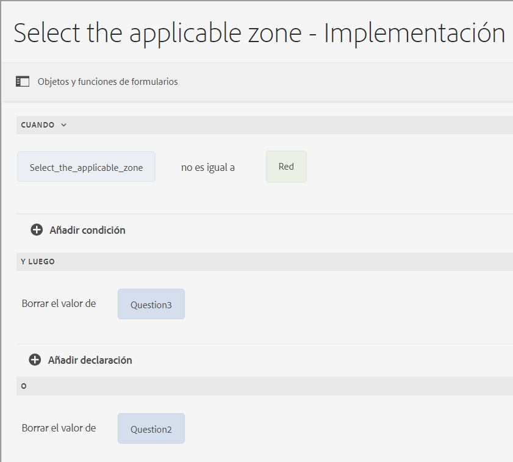
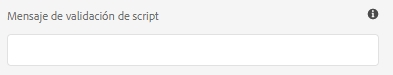
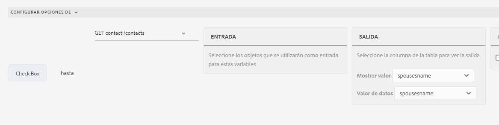
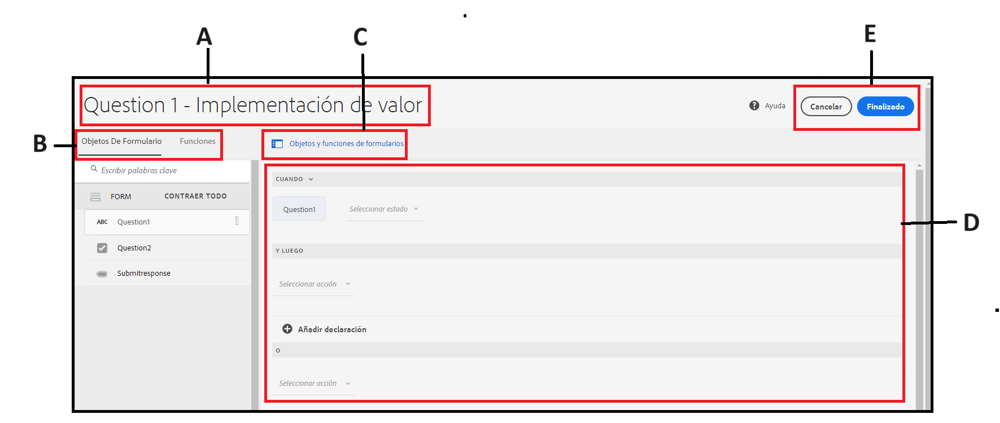
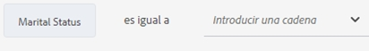
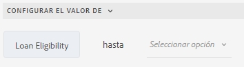
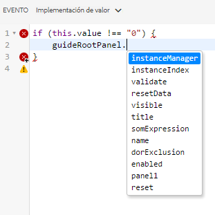
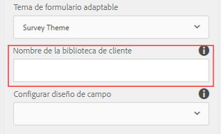
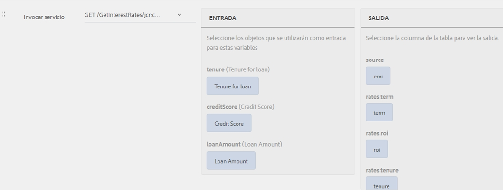
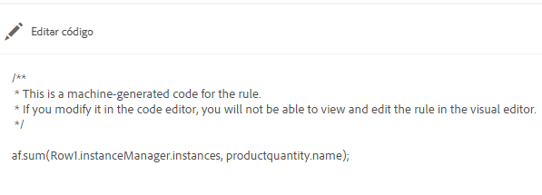

# Adición de reglas a un formulario adaptable {#adaptive-forms-rule-editor}

## Información general {#overview}

La función de editor de reglas permite a los usuarios y desarrolladores de formularios empresariales escribir reglas sobre los objetos de formulario adaptable. Estas reglas definen las acciones que se deben realizar en el déclencheur de los objetos de formulario en función de las condiciones preestablecidas, las entradas del usuario y las acciones del usuario en el formulario. Esto ayuda a optimizar aún más la experiencia de cumplimentación de formularios, lo que garantiza la precisión y la velocidad.

El editor de reglas proporciona una interfaz de usuario intuitiva y simplificada para escribir reglas. El editor de reglas ofrece un editor visual para todos los usuarios.<!-- In addition, only for forms power users, rule editor provides a code editor to write rules and scripts. --> Algunas de las acciones clave que se pueden realizar en objetos de formulario adaptable mediante reglas son:

* Mostrar u ocultar un objeto
* Habilitar o deshabilitar un objeto
* Definición de un valor para un objeto
* Validación del valor de un objeto
* Ejecutar funciones para calcular el valor de un objeto
* Invocar un servicio del Modelo de datos de formulario y realizar una operación
* Establecer la propiedad de un objeto

<!-- Rule editor replaces the scripting capabilities in [!DNL Experience Manager 6.1 Forms] and earlier releases. However, your existing scripts are preserved in the new rule editor. For more information about working with existing scripts in the rule editor, see [Impact of rule editor on existing scripts](rule-editor.md#p-impact-of-rule-editor-on-existing-scripts-p). -->

Los usuarios que se agregan al grupo de usuarios avanzados de formularios pueden crear secuencias de comandos y editar las existentes. Los usuarios de [!DNL forms-users] puede utilizar las secuencias de comandos, pero no crear o editar secuencias de comandos.

## Explicación de una regla {#understanding-a-rule}

Una regla es una combinación de acciones y condiciones. En el editor de reglas, las acciones incluyen actividades como ocultar, mostrar, habilitar, deshabilitar o calcular el valor de un objeto en un formulario. Las condiciones son expresiones booleanas que se evalúan realizando comprobaciones y operaciones en el estado, valor o propiedad de un objeto de formulario. Las acciones se realizan según el valor ( `True` o `False`) devuelto mediante la evaluación de una condición.

El editor de reglas proporciona un conjunto de tipos de reglas predefinidas, como Cuándo, Mostrar, Ocultar, Habilitar, Deshabilitar, Establecer valor de y Validar para ayudarle a escribir reglas. Cada tipo de regla permite definir condiciones y acciones en una regla. El documento explica cada tipo de regla en detalle.

Una regla suele seguir una de las siguientes construcciones:

**Condition-Action** En esta construcción, una regla primero define una condición seguida de una acción de déclencheur. La construcción es comparable a la declaración if-then en lenguajes de programación.

En el editor de reglas, la variable **When** tipo de regla aplica la construcción condition-action.

**Action-Condition** En esta construcción, una regla primero define una acción a déclencheur seguida de condiciones para la evaluación. Otra variación de esta construcción es la acción alternativa de condición de acción, que también define una acción alternativa al déclencheur si la condición devuelve False.

Los tipos de reglas Mostrar, Ocultar, Habilitar, Deshabilitar, Establecer valor de y Validar del editor de reglas aplican la construcción de reglas de condición de acción. De forma predeterminada, la acción alternativa para Mostrar es Ocultar y para Activar es Desactivar, y de forma opuesta. No se puede cambiar la acción alternativa predeterminada.

>[!NOTE]
>
>Los tipos de reglas disponibles, incluidas las condiciones y las acciones definidas en el editor de reglas, también dependen del tipo de objeto de formulario en el que se esté creando una regla. El editor de reglas solo muestra tipos de reglas y opciones válidos para escribir condiciones y instrucciones de acción para un tipo de objeto de formulario concreto. Por ejemplo, no ve los tipos de reglas Validar, Establecer valor de, Habilitar y Deshabilitar para un objeto de panel.

Para obtener más información sobre los tipos de reglas disponibles en el editor de reglas, consulte [Tipos de reglas disponibles en el editor de reglas](rule-editor.md#p-available-rule-types-in-rule-editor-p).

### Pautas para elegir una construcción de regla {#guidelines-for-choosing-a-rule-construct}

Aunque puede lograr la mayoría de los casos de uso utilizando cualquier construcción de regla, estas son algunas pautas para elegir una construcción sobre otra. Para obtener más información sobre las reglas disponibles en el editor de reglas, consulte [Tipos de reglas disponibles en el editor de reglas](rule-editor.md#p-available-rule-types-in-rule-editor-p).

* Una regla general típica al crear una regla es pensarla en el contexto del objeto en el que está escribiendo una regla. Tenga en cuenta que desea ocultar o mostrar el campo B en función del valor que un usuario especifica en el campo A. En este caso, está evaluando una condición en el campo A y, en función del valor que devuelve, está activando una acción en el campo B.

   Por lo tanto, si está escribiendo una regla en el campo B (el objeto sobre el que está evaluando una condición), utilice la construcción de condición-acción o el tipo de regla When . Del mismo modo, utilice la construcción de condición de acción o el tipo de regla Mostrar u Ocultar en el campo A.

* A veces, debe realizar varias acciones en función de una condición. En estos casos, se recomienda utilizar el concepto de condición-acción. En esta construcción, puede evaluar una condición una vez y especificar varias instrucciones de acción.

   Por ejemplo, para ocultar los campos B, C y D en función de la condición que comprueba el valor que un usuario especifica en el campo A, escriba una regla con la estructura de acción condición o Cuando tipo de regla en el campo A y especifique acciones para controlar la visibilidad de los campos B, C y D. De lo contrario, necesitará tres reglas independientes en los campos B, C y D, donde cada regla comprueba la condición y muestra u oculta el campo respectivo. En este ejemplo, es más eficaz escribir el tipo de regla When en un objeto en lugar de Mostrar u Ocultar en tres objetos.

* Para almacenar en déclencheur una acción basada en varias condiciones, se recomienda utilizar la construcción de condición de acción. Por ejemplo, para mostrar y ocultar el campo A mediante la evaluación de condiciones en los campos B, C y D, utilice Mostrar u Ocultar tipo de regla en el campo A.
* Utilice la condición-acción o la condición de acción para construir si la regla contiene una acción para una condición.
* Si una regla comprueba la existencia de una condición y realiza una acción inmediatamente al proporcionar un valor en un campo o al salir de un campo, se recomienda escribir una regla con la construcción de acción-condición o el tipo de regla When en el campo en el que se evalúa la condición.
* La condición de la regla When se evalúa cuando un usuario cambia el valor del objeto en el que se aplica la regla When . Sin embargo, si desea que la acción se déclencheur cuando el valor cambie en el servidor, como para rellenar previamente el valor, se recomienda escribir una regla When que déclencheur la acción cuando el campo se inicialice.
* Al escribir reglas para objetos de desplegables, botones de opción o casillas de verificación, las opciones o los valores de estos objetos de formulario en el formulario se rellenan previamente en el editor de reglas.

## Tipos de operadores y eventos disponibles en el editor de reglas {#available-operator-types-and-events-in-rule-editor}

El editor de reglas proporciona los siguientes operadores lógicos y eventos mediante los cuales puede crear reglas.

* **Is Equal To**
* **Is Not Equal To**
* **Comienza con**
* **Finaliza con**
* **Contiene**
* **está vacío**
* **No está vacío**
* **Tiene seleccionado:** Devuelve el valor verdadero cuando el usuario selecciona una opción concreta para un botón de casilla de verificación, desplegable o radio.
* **Está Inicializado (evento):** Devuelve el valor verdadero cuando un objeto de formulario se procesa en el explorador.
* **Se ha cambiado (evento):** Devuelve el valor verdadero cuando el usuario cambia el valor introducido o la opción seleccionada para un objeto de formulario.
* **Navegación (evento):** Devuelve el valor verdadero cuando el usuario hace clic en un objeto de navegación. Los objetos de navegación se utilizan para desplazarse entre paneles.
* **Paso completado (evento):** Devuelve el valor verdadero cuando se completa un paso de una regla.
* **Envío(evento) correcto:** Devuelve true si los datos se han enviado correctamente a un modelo de datos de formulario.
* **Error en Submission(event):**  Devuelve el valor verdadero si el envío de datos a un modelo de datos de formulario no se ha realizado correctamente.

## Tipos de reglas disponibles en el editor de reglas {#available-rule-types-in-rule-editor}

El editor de reglas proporciona un conjunto de tipos de reglas predefinidas que puede utilizar para escribir reglas. Veamos en detalle cada tipo de regla. Para obtener más información sobre cómo escribir reglas en el editor de reglas, consulte [Escribir reglas](rule-editor.md#p-write-rules-p).

### [!UICONTROL Cuando  ] {#whenruletype}

La variable **[!UICONTROL When]** el tipo de regla sigue a **condition-action-alternative action** construcción de reglas, o a veces solo la variable **condition-action** construir. En este tipo de regla, primero debe especificar una condición para la evaluación seguida de una acción para el déclencheur si se cumple la condición ( `True`). Al usar el tipo de regla When , puede usar varios operadores AND y OR para crear [expresiones anidadas](#nestedexpressions).

Con el tipo de regla When , se puede evaluar una condición en un objeto de formulario y realizar acciones en uno o varios objetos.

En palabras simples, una regla de &quot;Cuando&quot; típica está estructurada de la siguiente manera:

`When on Object A:`

`(Condition 1 AND Condition 2 OR Condition 3) is TRUE;`

`Then, do the following:`

Acción 2 sobre el objeto B; Y Acción 3 sobre el objeto C;

_

Cuando tiene un componente de varios valores, como botones de opción o lista, mientras crea una regla para ese componente, las opciones se recuperan automáticamente y se ponen a disposición del creador de reglas. No es necesario volver a escribir los valores de las opciones.

Por ejemplo, una lista tiene cuatro opciones: Rojo, Azul, Verde y Amarillo. Al crear la regla, las opciones (botones de opción) se recuperan automáticamente y se ponen a disposición del creador de reglas de la siguiente manera:


Al escribir una regla de &quot;Cuando&quot;, puede almacenar en déclencheur el valor de acción Borrar. Borrar valor de la acción borra el valor del objeto especificado. Tener un valor claro de como opción en la instrucción When permite crear condiciones complejas con varios campos.



**[!UICONTROL Ocultar]** Oculta el objeto especificado.

**[!UICONTROL Show]** Muestra el objeto especificado.

**[!UICONTROL Habilitar]** Habilita el objeto especificado.

**[!UICONTROL Deshabilitar]** Desactiva el objeto especificado.

**[!UICONTROL Invocar servicio]** Invoca un servicio configurado en un modelo de datos de formulario. Al elegir la operación Invocar servicio, aparece un campo. Al pulsar el campo , se muestran todos los servicios configurados en todos los modelos de datos de formulario del [!DNL Experience Manager] instancia. Al elegir un servicio del Modelo de datos de formulario, aparecen más campos en los que se pueden asignar objetos de formulario con parámetros de entrada y salida para el servicio especificado. Consulte la regla de ejemplo para invocar los servicios del Modelo de datos de formulario.

Además del servicio Modelo de datos de formulario, puede especificar una URL WSDL directa para invocar un servicio web. Sin embargo, un servicio del Modelo de datos de formulario tiene muchas ventajas y el método recomendado para invocar un servicio.

Para obtener más información sobre la configuración de servicios en el modelo de datos de formulario, consulte [[!DNL Experience Manager Forms] Integración de datos](data-integration.md).

**[!UICONTROL Definir el valor de]** Calcula y establece el valor del objeto especificado. Puede establecer el valor del objeto en una cadena, el valor de otro objeto, el valor calculado mediante expresión o función matemática, el valor de una propiedad de un objeto o el valor de salida de un servicio configurado del Modelo de datos de formulario. Al elegir la opción de servicio web, se muestran todos los servicios configurados en todos los modelos de datos de formulario del [!DNL Experience Manager] instancia. Al elegir un servicio del Modelo de datos de formulario, aparecen más campos en los que se pueden asignar objetos de formulario con parámetros de entrada y salida para el servicio especificado.

Para obtener más información sobre la configuración de servicios en el modelo de datos de formulario, consulte [[!DNL Experience Manager Forms] Integración de datos](data-integration.md).

La variable **[!UICONTROL Definir propiedad]** el tipo de regla permite establecer el valor de una propiedad del objeto especificado en función de una acción de condición.

Permite definir reglas para agregar casillas de verificación de forma dinámica al formulario adaptable. Puede utilizar una función personalizada, un objeto de formulario o una propiedad de objeto para definir una regla.


Para definir una regla basada en una función personalizada, seleccione **[!UICONTROL Salida de función]** en la lista desplegable y arrastre y suelte una función personalizada desde la **[!UICONTROL Funciones]** pestaña . Si se cumple la acción de condición, el número de casillas de verificación definidas en la función personalizada se agrega al formulario adaptable.

Para definir una regla basada en un objeto de formulario, seleccione **[!UICONTROL Objeto de formulario]** en la lista desplegable y arrastre y suelte un objeto de formulario desde la **[!UICONTROL Objetos de formulario]** pestaña . Si se cumple la acción de condición, el número de casillas de verificación definidas en el objeto de formulario se agrega al formulario adaptable.

La regla Definir propiedad basada en una propiedad de objeto permite agregar el número de casillas de verificación en un formulario adaptable basándose en otra propiedad de objeto incluida en el formulario adaptable.

En la siguiente figura se muestra un ejemplo de cómo agregar casillas de verificación de forma dinámica en función del número de listas desplegables del formulario adaptable:


**[!UICONTROL Borrar valor de]** Borra el valor del objeto especificado.

**[!UICONTROL Definir enfoque]** Define el enfoque del objeto especificado.

**[!UICONTROL Guardar formulario]** Guarda el formulario.

**[!UICONTROL Enviar Forms]** Envía el formulario.

**[!UICONTROL Restablecer formulario]** Restablece el formulario.

**[!UICONTROL Validar formulario]** Valida el formulario.

**[!UICONTROL Agregar instancia]** Agrega una instancia del panel repetible o fila de tabla especificados.

**[!UICONTROL Quitar instancia]** Quita una instancia del panel repetible o fila de tabla especificados.

**[!UICONTROL Vaya a]** Navega a otros <!--Interactive Communications,--> Forms adaptable, otros recursos, como imágenes o fragmentos de documento, o una URL externa. <!-- For more information, see [Add button to the Interactive Communication](create-interactive-communication.md#addbuttontothewebchannel). -->

### [!UICONTROL Valor definido de] {#set-value-of}

La variable **[!UICONTROL Definir el valor de]** tipo de regla le permite definir el valor de un objeto de formulario en función de si la condición especificada se cumple o no. El valor puede establecerse en un valor de otro objeto, una cadena literal, un valor derivado de una expresión matemática o una función, un valor de una propiedad de otro objeto o el resultado de un servicio del Modelo de datos de formulario. Del mismo modo, se puede comprobar la existencia de una condición en un componente, cadena, propiedad o valores derivados de una función o expresión matemática.

La variable **Definir valor de** el tipo de regla no está disponible para todos los objetos de formulario, como paneles y botones de la barra de herramientas. Una regla de valor definido estándar tiene la siguiente estructura:

Definir el valor del objeto A como:

(cadena ABC) O (propiedad de objeto X del objeto C) O (valor de una función) O (valor de una expresión matemática) O (valor de salida de un servicio de modelo de datos o servicio Web);

Cuando (opcional):

(Condición 1 Y condición 2 Y condición 3) es VERDADERO;

El ejemplo siguiente toma el valor en `dependentid` como entrada y establece el valor de la variable `Relation` al resultado del `Relation` del `getDependent` Modelo de datos de formulario .


Ejemplo de regla de valor definido con el servicio Modelo de datos de formulario

>[!NOTE]
>
>Además, puede utilizar Definir valor de regla para rellenar todos los valores de un componente de lista desplegable desde la salida de un servicio del Modelo de datos de formulario o un servicio Web. Sin embargo, asegúrese de que el argumento de salida que elija sea de un tipo de matriz. Todos los valores devueltos en una matriz estarán disponibles en la lista desplegable especificada.

### [!UICONTROL Mostrar] {#show}

Al usar la variable **[!UICONTROL Show]** tipo de regla, puede escribir una regla para mostrar u ocultar un objeto de formulario en función de si una condición se cumple o no. El tipo de regla Mostrar también déclencheur la acción Ocultar en caso de que la condición no se cumpla o devuelva `False`.

Una regla Mostrar típica está estructurada de la siguiente manera:

`Show Object A;`

`When:`

`(Condition 1 OR Condition 2 OR Condition 3) is TRUE;`

`Else:`

`Hide Object A;`

### [!UICONTROL Ocultar] {#hide}

Al igual que el tipo de regla Mostrar , puede usar la variable **[!UICONTROL Ocultar]** tipo de regla para mostrar u ocultar un objeto de formulario en función de si se cumple o no una condición. El tipo de regla Ocultar también déclencheur la acción Mostrar en caso de que la condición no se cumpla o devuelva `False`.

Una regla de ocultación típica está estructurada de la siguiente manera:

`Hide Object A;`

`When:`

`(Condition 1 AND Condition 2 AND Condition 3) is TRUE;`

`Else:`

`Show Object A;`

### [!UICONTROL Habilitar] {#enable}

La variable **[!UICONTROL Habilitar]** el tipo de regla permite activar o desactivar un objeto de formulario en función de si se cumple o no una condición. El tipo de regla Enable también déclencheur la acción Disable en caso de que la condición no se cumpla o devuelva `False`.

Una regla Habilitar típica está estructurada de la siguiente manera:

`Enable Object A;`

`When:`

`(Condition 1 AND Condition 2 AND Condition 3) is TRUE;`

`Else:`

`Disable Object A;`

### [!UICONTROL Desactivar] {#disable}

Similar al tipo de regla Habilitar , la variable **[!UICONTROL Deshabilitar]** el tipo de regla permite habilitar o deshabilitar un objeto de formulario en función de si se cumple o no una condición. El tipo de regla Deshabilitar también déclencheur la acción Habilitar en caso de que la condición no se cumpla o devuelva `False`.

Una regla de desactivación típica se estructura de la siguiente manera:

`Disable Object A;`

`When:`

`(Condition 1 OR Condition 2 OR Condition 3) is TRUE;`

`Else:`

`Enable Object A;`

### [!UICONTROL Validar] {#validate}

La variable **[!UICONTROL Validar]** el tipo de regla valida el valor de un campo mediante una expresión. Por ejemplo, puede escribir una expresión para comprobar que el cuadro de texto para especificar el nombre no contenga caracteres especiales ni números.

Una regla de validación típica se estructura de la siguiente manera:

`Validate Object A;`

`Using:`

`(Expression 1 AND Expression 2 AND Expression 3) is TRUE;`

>[!NOTE]
>
>Si el valor especificado no cumple la regla Validar , puede mostrar un mensaje de validación al usuario. Puede especificar el mensaje en la **[!UICONTROL Mensaje de validación de secuencia de comandos]** en las propiedades del componente en la barra lateral.



### [!UICONTROL Definir opciones de] {#setoptionsof}

La variable **[!UICONTROL Definir opciones de]** tipo de regla permite definir reglas para agregar casillas de verificación de forma dinámica al formulario adaptable. Puede utilizar un Modelo de datos de formulario o una función personalizada para definir la regla.

Para definir una regla basada en una función personalizada, seleccione **[!UICONTROL Salida de función]** en la lista desplegable y arrastre y suelte una función personalizada desde la **[!UICONTROL Funciones]** pestaña . El número de casillas de verificación definidas en la función personalizada se agrega al formulario adaptable.


Para crear una función personalizada, consulte [funciones personalizadas en el editor de reglas](#custom-functions).

Para definir una regla basada en un modelo de datos de formulario:

1. Select **[!UICONTROL Salida de servicio]** en la lista desplegable.
1. Seleccione el objeto del modelo de datos.
1. Seleccione una propiedad de objeto del modelo de datos en el **[!UICONTROL Valor de visualización]** lista desplegable. El número de casillas de verificación del formulario adaptable se deriva del número de instancias definidas para esa propiedad en la base de datos.
1. Seleccione una propiedad de objeto del modelo de datos en el **[!UICONTROL Guardar valor]** lista desplegable.



## Explicación de la interfaz de usuario del editor de reglas {#understanding-the-rule-editor-user-interface}

El editor de reglas proporciona una interfaz de usuario completa pero sencilla para escribir y administrar reglas. Puede iniciar la interfaz de usuario del editor de reglas desde un formulario adaptable en modo de creación.

Para iniciar la interfaz de usuario del editor de reglas:

1. Abra un formulario adaptable en modo de creación.
1. Pulse el objeto de formulario para el que desea escribir una regla y, en la barra de herramientas de componentes, pulse . Aparecerá la interfaz de usuario del editor de reglas.

   

   Cualquier regla existente en los objetos de formulario seleccionados se muestra en esta vista. Para obtener información sobre la administración de reglas existentes, consulte [Administrar reglas](rule-editor.md#p-manage-rules-p).

1. Toque **[!UICONTROL Crear]** para escribir una regla nueva. El editor visual de la interfaz de usuario del editor de reglas se abre de forma predeterminada cuando se inicia el editor de reglas por primera vez.

   

Veamos en detalle cada componente de la interfaz de usuario del editor de reglas.

### A. Visualización de la regla de componente {#a-component-rule-display}

Muestra el título del objeto de formulario adaptable a través del cual se ha iniciado el editor de reglas y el tipo de regla seleccionado actualmente. En el ejemplo anterior, el editor de reglas se inicia desde un objeto de formulario adaptable llamado Salario y el tipo de regla seleccionado es Cuando.

### B. Objetos y funciones del formulario {#b-form-objects-and-functions-br}

El panel de la izquierda de la interfaz de usuario del editor de reglas incluye dos fichas: **[!UICONTROL Objetos de Forms]** y **[!UICONTROL Funciones]**.

La ficha Objetos de formulario muestra una vista jerárquica de todos los objetos contenidos en el formulario adaptable. Muestra el título y el tipo de los objetos. Al escribir una regla, puede arrastrar y soltar objetos de formulario en el editor de reglas. Al crear o editar una regla cuando arrastra y suelta un objeto o función en un marcador de posición, el marcador de posición toma automáticamente el tipo de valor apropiado.

Los objetos de formulario que tienen una o más reglas válidas aplicadas se marcan con un punto verde. Si alguna de las reglas aplicadas a un objeto de formulario no es válida, el objeto de formulario se marca con un punto amarillo.

La ficha Funciones incluye un conjunto de funciones integradas, como Suma de, Mínimo de, Máximo de, Promedio de, Número de y Validar formulario. Puede utilizar estas funciones para calcular valores en paneles repetibles y filas de tabla y utilizarlos en instrucciones de acción y condición al escribir reglas. Sin embargo, puede crear [funciones personalizadas](#custom-functions) también.


>[!NOTE]
>
>Puede buscar texto en nombres de objetos y funciones y títulos en las fichas Objetos y funciones de Forms.

En el árbol izquierdo de los objetos de formulario, puede pulsar los objetos de formulario para mostrar las reglas aplicadas a cada uno de los objetos. No solo puede desplazarse por las reglas de los distintos objetos de formulario, sino que también puede copiar y pegar reglas entre los objetos de formulario. Para obtener más información, consulte [Copiar y pegar reglas](rule-editor.md#p-copy-paste-rules-p).

### C. Alternar objetos y funciones de formulario {#c-form-objects-and-functions-toggle-br}

Al pulsar el botón de alternancia, se alternan los objetos de formulario y el panel de funciones.

### D. Editor de reglas visual {#visual-rule-editor}

El editor de reglas visuales es el área del modo de editor visual de la interfaz de usuario del editor de reglas donde se escriben las reglas. Permite seleccionar un tipo de regla y definir las condiciones y las acciones correspondientes. Al definir condiciones y acciones en una regla, puede arrastrar y soltar objetos y funciones de formulario desde el panel Objetos y funciones de formulario .

Para obtener más información sobre el uso del editor de reglas visuales, consulte [Escribir reglas](rule-editor.md#p-write-rules-p).
<!-- 
### E. Visual-code editors switcher {#e-visual-code-editors-switcher}

Users in the forms-power-users group can access code editor. For other users, code editor is not available. If you have the rights, you can switch from visual editor mode to code editor mode of the rule editor, and vice versa, using the switcher right above the rule editor. When you launch rule editor the first time, it opens in the visual editor mode. You can write rules in the visual editor mode or switch to the code editor mode to write a rule script. However, note that if you modify a rule or write a rule in code editor, you cannot switch back to the visual editor for that rule unless you clear the code editor.

[!DNL Experience Manager Forms] tracks the rule editor mode you used last to write a rule. When you launch the rule editor next time, it opens in that mode. However, you can also configure a default mode to open the rule editor in the specified mode. To do so:

1. Go to [!DNL Experience Manager] web console at `https://[host]:[port]/system/console/configMgr`.
1. Click to edit **[!UICONTROL Adaptive Form Configuration Service]**.
1. choose **[!UICONTROL Visual Editor]** or **[!UICONTROL Code Editor]** from the **[!UICONTROL Default Mode for Rule Editor]** drop-down

1. Click **[!UICONTROL Save]**.
-->

### Botones Listo y Cancelar {#done-and-cancel-buttons}

La variable **[!UICONTROL Listo]** se utiliza para guardar una regla. Puede guardar una regla incompleta. Sin embargo, los incompletos no son válidos y no se ejecutan. Las reglas guardadas en un objeto de formulario se enumeran cuando se inicia el editor de reglas la próxima vez desde el mismo objeto de formulario. Puede administrar las reglas existentes en esa vista. Para obtener más información, consulte [Administrar reglas](rule-editor.md#p-manage-rules-p).

La variable **[!UICONTROL Cancelar]** descarta los cambios realizados en una regla y cierra el editor de reglas.

## Escribir reglas {#write-rules}

Puede escribir reglas mediante el editor de reglas visual &lt;!>— o el editor de código>. Cuando se inicia el editor de reglas por primera vez, se abre en el modo de editor visual. Puede cambiar al modo de editor de código y escribir reglas. Sin embargo, si escribe o modifica una regla en el editor de código, no puede cambiar al editor visual para esa regla a menos que borre el editor de código. Cuando inicie el editor de reglas la próxima vez, se abrirá en el modo que utilizó por última vez para crear reglas.

Veamos primero cómo escribir reglas utilizando el editor visual.

### Uso del editor visual {#using-visual-editor}

Vamos a comprender cómo crear una regla en el editor visual utilizando el siguiente formulario de ejemplo.


La sección Requisitos de préstamo del formulario de solicitud de préstamo de ejemplo requiere que los solicitantes especifiquen su estado civil, su salario y, si están casados, el salario de su cónyuge. En función de las entradas del usuario, la regla calcula la cantidad de idoneidad para el préstamo y se muestra en el campo Elegibilidad del préstamo . Aplique las siguientes reglas para implementar el escenario:

* El campo Salario del cónyuge sólo se muestra cuando el estado civil está casado.
* El monto de elegibilidad del préstamo es el 50% del salario total.

Para escribir reglas, realice los siguientes pasos:

1. En primer lugar, escriba la regla para controlar la visibilidad del campo Salario del cónyuge en función de la opción que seleccione el usuario para el botón de opción Estado civil.

   Abra el formulario de solicitud de préstamo en modo de creación. Toque . **[!UICONTROL Estado civil]** componente y toque . A continuación, pulse **[!UICONTROL Crear]** para iniciar el editor de reglas.

   

   Al iniciar el editor de reglas, la regla Cuando se selecciona de forma predeterminada. Además, el objeto de formulario (en este caso, Estado civil) desde el que se inició el editor de reglas se especifica en la instrucción When .

   Aunque no puede cambiar ni modificar el objeto seleccionado, puede utilizar la lista desplegable de reglas, como se muestra a continuación, para seleccionar otro tipo de regla. Si desea crear una regla en otro objeto, pulse Cancelar para salir del editor de reglas y volver a iniciarla desde el objeto de formulario deseado.

1. Toque **[!UICONTROL Seleccionar estado]** y seleccione **[!UICONTROL es igual a]**. La variable **[!UICONTROL Escribir una cadena]** aparece.

   

   En el botón de opción Estado civil, **[!UICONTROL Casado]** y **[!UICONTROL Single]** opciones asignadas **0** y **1** , respectivamente. Puede verificar los valores asignados en la ficha Título del cuadro de diálogo del botón de opción Editar como se muestra a continuación.

   

1. En el **[!UICONTROL Escribir una cadena]** en la regla, especifique **0**.

   

   Ha definido la condición como `When Marital Status is equal to Married`. A continuación, defina la acción que se realizará si esta condición es True.

1. En la instrucción Then, seleccione **[!UICONTROL Show]** de la variable **[!UICONTROL Seleccionar acción]** lista desplegable.

   

1. Arrastre y suelte el **[!UICONTROL Salario del cónyuge]** campo de la ficha Objetos de formulario de la **[!UICONTROL Colocar objeto o seleccionar aquí]** campo . También puede tocar el botón **[!UICONTROL Colocar objeto o seleccionar aquí]** y seleccione **[!UICONTROL Salario del cónyuge]** del menú emergente, que enumera todos los objetos de formulario del formulario.

   

   La regla aparece de la siguiente manera en el editor de reglas.

   

1. Toque **[!UICONTROL Listo]** para guardar la regla.

1. Repita los pasos del 1 al 5 para definir otra regla que oculte el campo Salario del cónyuge si el estado civil es único. La regla aparece de la siguiente manera en el editor de reglas.

   

   >[!NOTE]
   >
   >Como alternativa, puede escribir una regla Mostrar en el campo Salario del cónyuge, en lugar de dos reglas Cuando en el campo Estado civil, para implementar el mismo comportamiento.

   

1. A continuación, escriba una regla para calcular el importe de idoneidad para el préstamo, que es el 50% del salario total, y muéstrela en el campo Elegibilidad del préstamo . Para lograr este resultado, cree **[!UICONTROL Definir valor de]** reglas sobre el campo Elegibilidad de préstamos .

   En el modo de creación, pulse el botón **[!UICONTROL Elegibilidad para préstamos]** toque y campo . A continuación, pulse **[!UICONTROL Crear]** para iniciar el editor de reglas.

1. Select **[!UICONTROL Definir valor de]** en la lista desplegable de reglas.

   

1. Toque **[!UICONTROL Seleccionar opción]** y seleccione **[!UICONTROL Expresión matemática]**. Se abre un campo para escribir una expresión matemática.

   

1. En el campo de expresión:

   * Seleccione o arrastre y suelte desde la ficha Objeto de Forms en la **[!UICONTROL Salario]** en el primer campo **[!UICONTROL Colocar objeto o seleccionar aquí]** campo .

   * Select **[!UICONTROL Más]** de la variable **[!UICONTROL Seleccionar operador]** campo .

   * Seleccione o arrastre y suelte desde la ficha Objeto de Forms en la **[!UICONTROL Salario del cónyuge]** en el otro **[!UICONTROL Colocar objeto o seleccionar aquí]** campo .

   

1. A continuación, pulse el área resaltada alrededor del campo de expresión y pulse **[!UICONTROL Extensión de expresión]**.

   

   En el campo de expresión extendida, seleccione **[!UICONTROL dividido por]** de la variable **[!UICONTROL Seleccionar operador]** campo y **[!UICONTROL Número]** de la variable **[!UICONTROL Seleccionar opción]** campo . A continuación, especifique **[!UICONTROL 2]** en el campo number .

   

   >[!NOTE]
   >
   >Puede crear expresiones complejas utilizando componentes, funciones, expresiones matemáticas y valores de propiedad del campo Seleccionar opción .

   A continuación, cree una condición que, cuando devuelva True, se ejecute la expresión.

1. Toque **[!UICONTROL Agregar condición]** para agregar una instrucción When.

   

   En la instrucción When :

   * Seleccione o arrastre y suelte desde la ficha Objeto de Forms en la **[!UICONTROL Estado civil]** en el primer campo **[!UICONTROL Colocar objeto o seleccionar aquí]** campo .

   * Select **[!UICONTROL es igual a]** de la variable **[!UICONTROL Seleccionar operador]** campo .

   * Seleccione Cadena en el otro **[!UICONTROL Colocar objeto o seleccionar aquí]** campo y especificar **[!UICONTROL Casado]** en el **[!UICONTROL Escribir una cadena]** campo .

   La regla aparece finalmente de la siguiente manera en el editor de reglas.  

1. Puntee **[!UICONTROL Listo]**. Guarda la regla.

1. Repita los pasos del 7 al 14 para definir otra regla para calcular la idoneidad del préstamo si el estado civil es único. La regla aparece de la siguiente manera en el editor de reglas.

   

>[!NOTE]
>
>También puede utilizar la regla Definir valor de para calcular la idoneidad del préstamo en la regla When que creó para mostrar u ocultar el campo Salario del cónyuge. La regla combinada resultante cuando el estado civil es único aparece de la siguiente manera en el editor de reglas.
>
>Del mismo modo, puede escribir una regla combinada para controlar la visibilidad del campo Salario del cónyuge y calcular la idoneidad del préstamo cuando el estado civil está casado.


<!-- ### Using code editor {#using-code-editor}

Users added to the forms-power-users group can use code editor. The rule editor auto generates the JavaScript code for any rule you create using visual editor. You can switch from visual editor to the code editor to view the generated code. However, if you modify the rule code in the code editor, you cannot switch back to the visual editor. If you prefer writing rules in code editor rather than visual editor, you can write rules afresh in the code editor. The visual-code editors switcher helps you switch between the two modes.

The code editor JavaScript is the expression language of Adaptive Forms. All the expressions are valid JavaScript expressions and use Adaptive Forms scripting model APIs. These expressions return values of certain types. For the complete list of Adaptive Forms classes, events, objects, and public APIs, see [JavaScript Library API reference for Adaptive Forms](https://helpx.adobe.com/experience-manager/6-5/forms/javascript-api/index.html).

For more information about guidelines to write rules in the code editor, see [Adaptive Form Expressions](adaptive-form-expressions.md).

While writing JavaScript code in the rule editor, the following visual cues help you with the structure and syntax:

* Syntax highlights

* Auto Indentation

* Hints and suggestions for Form objects, functions, and their properties

* Auto completion of form component names and common JavaScript functions


-->

#### Funciones personalizadas en el editor de reglas {#custom-functions}

Aparte de las funciones integradas, como *Suma de* que se enumeran en Salida de funciones, puede escribir funciones personalizadas que necesite con frecuencia. Asegúrese de que la función que escriba esté acompañada de la variable `jsdoc` encima.

Acompañante `jsdoc` es obligatorio:

* Si desea una configuración y descripción personalizadas
* Porque hay varias formas de declarar una función en `JavaScript,` Los comentarios y permiten realizar un seguimiento de las funciones.

El editor de reglas admite la sintaxis de JavaScript ES2015 para secuencias de comandos y funciones personalizadas.
Para obtener más información, consulte [jsdoc.app](https://jsdoc.app/).

Admitido `jsdoc` etiquetas:

* **Privado**
Sintaxis: Una función privada no se incluye como función personalizada.`@private`
Una función privada no se incluye como función personalizada.

* **Nombre**
Sintaxis: Alternativamente `@name funcName <Function Name>`
Alternativamente `,` puede utilizar: `@function funcName <Function Name>` **o** `@func` `funcName <Function Name>`.
   `funcName` es el nombre de la función (no se permiten espacios).
   `<Function Name>` es el nombre para mostrar de la función.

* **Miembro**
Sintaxis: Adjunta un área de nombres a la función .`@memberof namespace`
Adjunta un área de nombres a la función .

* **Parámetro**
Sintaxis: También puede utilizar: `@param {type} name <Parameter Description>`
También puede utilizar: `@argument` `{type} name <Parameter Description>` **o** `@arg` `{type}` `name <Parameter Description>`.
Muestra los parámetros utilizados por la función . Una función puede tener varias etiquetas de parámetro, una etiqueta para cada parámetro en el orden de incidencia.
   `{type}` representa el tipo de parámetro. Los tipos de parámetros permitidos son:

   1. cadena
   1. número
   1. booleano
   1. scope

   El ámbito hace referencia a los campos de un formulario adaptable. Cuando un formulario utiliza la carga diferida, puede utilizar `scope` para acceder a sus campos. Puede acceder a los campos cuando se cargan o si están marcados como globales.

   Todos los tipos de parámetros se clasifican en una de las categorías anteriores. Ninguno no es compatible. Asegúrese de seleccionar uno de los tipos anteriores. Los tipos no distinguen entre mayúsculas y minúsculas. No se permiten espacios en el parámetro `name`. `<Parameter Descrption>` `<parameter>  can have multiple words. </parameter>`

* **Tipo de devolución**
Sintaxis: Como alternativa, puede usar `@return {type}`
Como alternativa, puede usar `@returns {type}`.
Agrega información sobre la función, como su objetivo.
{type} representa el tipo devuelto de la función. Los tipos de devolución permitidos son:

   1. cadena
   1. número
   1. booleano

   Todos los demás tipos de devolución se clasifican en uno de los anteriores. Ninguno no es compatible. Asegúrese de seleccionar uno de los tipos anteriores. Los tipos de devolución no distinguen entre mayúsculas y minúsculas.

   * **Esta**
Sintaxis: 
`@this currentComponent`
   Utilice @this para hacer referencia al componente Formulario adaptable en el que se escribe la regla.

   El siguiente ejemplo se basa en el valor de campo. En el ejemplo siguiente, la regla oculta un campo del formulario. La variable `this` porción de `this.value` hace referencia al componente de formulario adaptable subyacente, en el que se escribe la regla.

   ```
      /**
      * @function myTestFunction
      * @this currentComponent
      * @param {scope} scope in which code inside function will be executed.
      */
      myTestFunction = function (scope) {
         if(this.value == "O"){
               scope.age.visible = true;
         } else {
            scope.age.visible = false;
         }
      }
   ```

   >[!NOTE]
   >
   >Los comentarios antes de la función personalizada se utilizan como resumen. El resumen puede extenderse a varias líneas hasta que se encuentre una etiqueta. Limite el tamaño a un único para ver una descripción concisa en el generador de reglas.

**Adición de una función personalizada**

Por ejemplo, desea agregar una función personalizada que calcule el área de un cuadrado. La longitud lateral es la entrada del usuario a la función personalizada, que se acepta mediante un cuadro numérico en el formulario. El resultado calculado se muestra en otro cuadro numérico del formulario. Para agregar una función personalizada, primero debe crear una biblioteca de cliente y luego agregarla al repositorio CRX.

Para crear una biblioteca de cliente y agregarla al repositorio CRX, realice los siguientes pasos:

1. Crear un clienteRealice los siguientes pasos en la biblioteca. Para obtener más información, consulte [Uso de bibliotecas del lado del cliente](https://experienceleague.adobe.com/docs/experience-manager-cloud-service/implementing/developing/full-stack/clientlibs.html#developing).
1. En CRXDE, agregue una propiedad `categories`con valor de tipo de cadena como `customfunction` a `clientlib` carpeta.

   >[!NOTE]
   >
   >`customfunction`es una categoría de ejemplo. Puede elegir cualquier nombre para la categoría que cree en la `clientlib`carpeta.

Después de agregar la biblioteca de cliente en el repositorio CRX, utilícela en el formulario adaptable. Permite utilizar la función personalizada como regla en el formulario. Para agregar la biblioteca del cliente en el formulario adaptable, realice los siguientes pasos:

1. Abra el formulario en modo de edición.
Para abrir un formulario en modo de edición, seleccione un formulario y pulse **[!UICONTROL Apertura]**.
1. En el modo de edición, seleccione un componente y, a continuación, pulse  > **[!UICONTROL Contenedor de formulario adaptable]** y, a continuación, toque .
1. En la barra lateral, bajo Nombre de la biblioteca de cliente, agregue la biblioteca de cliente. ( `customfunction` en el ejemplo).

   

1. Seleccione el cuadro numérico de entrada y pulse  para abrir el editor de reglas.
1. Toque **[!UICONTROL Crear regla]**. Con las opciones que se muestran a continuación, cree una regla para guardar el valor al cuadrado de la entrada en el campo Output del formulario.

[](assets/add-custom-rule.png)

1. Puntee **[!UICONTROL Listo]**. Se agrega la función personalizada.

#### Tipos admitidos para la declaración de funciones {#function-declaration-supported-types}

**Instrucción de función**

```javascript
function area(len) {
    return len*len;
}
```

Esta función se incluye sin `jsdoc` comentarios.

**Expresión de función**

```javascript
var area;
//Some codes later
/** */
area = function(len) {
    return len*len;
};
```

**Expresión de función y declaración**

```javascript
var b={};
/** */
b.area = function(len) {
    return len*len;
}
```

**Declaración de función como variable**

```javascript
/** */
var x1,
    area = function(len) {
        return len*len;
    },
    x2 =5, x3 =true;
```

Limitación: la función personalizada selecciona solo la primera declaración de función de la lista de variables, si está junto. Puede utilizar la expresión de función para cada función declarada.

**Declaración de función como objeto**

```javascript
var c = {
    b : {
        /** */
        area : function(len) {
            return len*len;
        }
    }
};
```

>[!NOTE]
>
>Asegúrese de utilizar `jsdoc` para cada función personalizada. Aunque `jsdoc`se recomienda comentar, incluir un vacío `jsdoc`para marcar la función como función personalizada. Permite la gestión predeterminada de la función personalizada.

## Administrar reglas {#manage-rules}

Cualquier regla existente en un objeto de formulario aparece enumerada al pulsar el objeto y pulsar . Puede ver el título y una vista previa del resumen de la regla. Además, la interfaz de usuario le permite expandir y ver el resumen completo de la regla, cambiar el orden de las reglas, editar las reglas y eliminarlas.


Puede realizar las siguientes acciones en reglas:

* **Expandir/Contraer**: La columna Contenido de la lista de reglas muestra el contenido de las reglas. Si todo el contenido de la regla no está visible en la vista predeterminada, pulse  para expandirla.

* **Reordenar**: Cualquier regla nueva que cree se apilará en la parte inferior de la lista de reglas. Las reglas se ejecutan de arriba a abajo. La regla de la parte superior se ejecuta primero seguida de otras reglas del mismo tipo. Por ejemplo, si tiene las reglas When, Show, Enable y When en las posiciones primera, segunda, tercera y cuarta desde la parte superior, respectivamente, la regla When en la parte superior se ejecuta primero seguida de la regla When en la cuarta posición. A continuación, se ejecutan las reglas Mostrar y Activar .
Puede cambiar el orden de una regla tocando  o arrástrela hasta el orden deseado en la lista.

* **Editar**: Para editar una regla, active la casilla de verificación situada junto al título de la regla. Aparecerán las opciones para editar y eliminar la regla. Toque **[!UICONTROL Editar]** para abrir la regla seleccionada en el editor de reglas <!-- in visual  or code editor mode depending on the mode used to create the rule -->.

* **Eliminar**: Para eliminar una regla, selecciónela y pulse **[!UICONTROL Eliminar]**.

* **Habilitar/Deshabilitar**: Cuando tenga que suspender temporalmente el uso de una regla, puede seleccionar una o más reglas y pulsar **[!UICONTROL Deshabilitar]** en la barra de herramientas Acciones para desactivarlos. Si una regla está deshabilitada, no se ejecuta en tiempo de ejecución. Para habilitar una regla que esté deshabilitada, puede seleccionarla y pulsar Habilitar en la barra de herramientas de acciones. La columna de estado de la regla muestra si la regla está activada o desactivada.


## Copiar y pegar reglas {#copy-paste-rules}

Puede copiar y pegar una regla de un campo a otros campos similares para ahorrar tiempo.

Para copiar y pegar reglas, haga lo siguiente:

1. Pulse el objeto de formulario del que desea copiar una regla y, en la barra de herramientas de componentes, pulse . La interfaz de usuario del editor de reglas aparece con el objeto de formulario seleccionado y aparecen las reglas existentes.

   

   Para obtener información sobre la administración de reglas existentes, consulte [Administrar reglas](rule-editor.md#p-manage-rules-p).

1. Seleccione la casilla de verificación situada junto al título de la regla. Aparecerán las opciones para administrar la regla. Pulse **[!UICONTROL Copiar]**.

   

1. Seleccione otro objeto de formulario al que desee pegar la regla y pulse **[!UICONTROL Pegar]**. Además, puede editar la regla para realizar cambios en ella.

   >[!NOTE]
   >
   >Puede pegar una regla en otro objeto de formulario sólo si dicho objeto de formulario admite el suceso de regla copiada. Por ejemplo, un botón admite el suceso click. Puede pegar una regla con un suceso click en un botón, pero no en una casilla de verificación.

1. Toque **[!UICONTROL Listo]** para guardar la regla.

## Expresiones anidadas {#nestedexpressions}

El editor de reglas permite utilizar varios operadores Y y O para crear reglas anidadas. Puede combinar varios operadores AND y OR en las reglas.

A continuación se muestra un ejemplo de una regla anidada que muestra un mensaje al usuario sobre la elegibilidad para la custodia de un niño cuando se cumplen las condiciones requeridas.


También puede arrastrar y soltar condiciones dentro de una regla para editarla. Toque y pase el ratón por encima del identificador ( ) antes de una condición. Una vez que el puntero se convierta en el símbolo de mano como se muestra a continuación, arrastre y suelte la condición en cualquier lugar dentro de la regla. La estructura de reglas cambia.


## Condiciones de expresión de fecha {#dateexpression}

El editor de reglas permite usar comparaciones de fechas para crear condiciones.

A continuación se muestra un ejemplo de condición que muestra un objeto de texto estático si la hipoteca de la casa ya se ha tomado, lo que el usuario significa rellenando el campo de fecha.

Cuando la fecha de la hipoteca de la propiedad tal como la ha rellenado el usuario es anterior, el formulario adaptable muestra una nota sobre el cálculo de ingresos. La siguiente regla compara la fecha rellenada por el usuario con la fecha actual y si la fecha rellenada por el usuario es anterior a la fecha actual, el formulario muestra el mensaje de texto (denominada Ingresos).


Cuando la fecha de rellenado es anterior a la fecha actual, el formulario muestra el mensaje de texto (Ingresos) de la siguiente manera:


## Condiciones de comparación de número {#number-comparison-conditions}

El editor de reglas permite crear condiciones que comparen dos números.

A continuación se muestra un ejemplo de condición que muestra un objeto de texto estático si el número de meses que un solicitante permanece en la dirección actual es menor de 36.


Cuando el usuario significa vivir en la dirección residencial actual durante menos de 36 meses, el formulario muestra una notificación que indica que se puede solicitar más pruebas de residencia.


<!-- ## Impact of rule editor on existing scripts {#impact-of-rule-editor-on-existing-scripts}

In [!DNL Experience Manager Forms] versions prior to [!DNL Experience Manager 6.1 Forms] feature pack 1, form authors and developers used to write expressions in the Scripts tab of the Edit component dialog to add dynamic behavior to Adaptive Forms. The Scripts tab is now replaced by the rule editor.

Any scripts or expressions that you must have written in the Scripts tab are available in the rule editor. While you cannot view or edit them in visual editor, if you are a part of the forms-power-users group you can edit scripts in code editor. -->

## Reglas de ejemplo {#example}

### Invocar el servicio Modelo de datos de formulario {#invoke}

Considerar un servicio web `GetInterestRates` que toma el importe del préstamo, la tenencia y la calificación crediticia del solicitante como insumo y devuelve un plan de préstamo que incluye el importe del IME y el tipo de interés. Puede crear un Modelo de datos de formulario utilizando el servicio web como origen de datos. Los objetos del modelo de datos y las variables `get` servicio al modelo de formulario. El servicio aparece en la ficha Servicios del modelo de datos de formulario. A continuación, cree un formulario adaptable que incluya campos de objetos del modelo de datos para capturar entradas del usuario para la cantidad de préstamo, la tenencia y la puntuación de crédito. Agregue un botón que déclencheur el servicio web para obtener detalles del plan. La salida se rellena en los campos adecuados.

La regla siguiente muestra cómo configurar la acción Invocar servicio para que se realice el escenario de ejemplo.



Invocar el servicio del Modelo de datos de formulario mediante la regla de formulario adaptable

### Activación de varias acciones mediante la regla Cuando {#triggering-multiple-actions-using-the-when-rule}

En un formulario de solicitud de préstamo, se desea capturar si el solicitante del préstamo es o no un cliente existente. En función de la información que proporcione el usuario, el campo ID de cliente debería mostrarse u ocultarse. Además, desea centrarse en el campo ID del cliente si el usuario es un cliente existente. El formulario de solicitud de préstamo tiene los siguientes componentes:

* Un botón de radio, **[!UICONTROL ¿Es cliente de Geometrixx existente?]**, que proporciona [!UICONTROL Sí] y [!UICONTROL No] opciones. El valor de Sí es **0** y No es **1**.

* Un campo de texto, **[!UICONTROL ID de cliente de Geometrixx]**, para especificar el ID de cliente.

Cuando escriba una regla When en el botón de radio para implementar este comportamiento, la regla aparecerá de la siguiente manera en el editor de reglas visuales.


Regla en el editor visual

En la regla de ejemplo, la instrucción de la sección When es la condición que, cuando devuelve True, ejecuta las acciones especificadas en la sección Then.

<!-- The rule appears as follows in the code editor.

 

Rule in the code editor -->

### Uso de una salida de función en una regla {#using-a-function-output-in-a-rule}

En un formulario de orden de compra, tiene la siguiente tabla, en la que los usuarios rellenan sus pedidos. En esta tabla:

* La primera fila es repetible, por lo que los usuarios pueden solicitar varios productos y especificar cantidades diferentes. Su nombre de elemento es `Row1`.
* El título de la celda de la columna Cantidad de producto de la fila repetible es Cantidad. El nombre de elemento de esta celda es `productquantity`.
* La segunda fila de la tabla es no repetible y el título de la celda de la columna Cantidad de producto de esta fila es Cantidad total.


**A.** Fila1 **B.** Cantidad **C.** Cantidad total

Ahora, desea agregar cantidades especificadas en la columna Cantidad de producto para todos los productos y mostrar la suma en la celda Cantidad total. Puede obtener esta suma escribiendo una regla Set Value Of en la celda Total Quantity como se muestra a continuación.


Regla en el editor visual

<!-- he rule appears as follows in the code editor.



Rule in the code editor -->

### Validación de un valor de campo mediante una expresión {#validating-a-field-value-using-expression}

En el formulario de orden de compra que se explica en el ejemplo anterior, se desea restringir el pedido de más de una cantidad de cualquier producto cuyo precio sea superior a 10000. Para realizar esta validación, puede escribir una regla de validación como se muestra a continuación.


Regla en el editor visual

<!-- The rule appears as follows in the code editor.


Rule in the code editor -->
