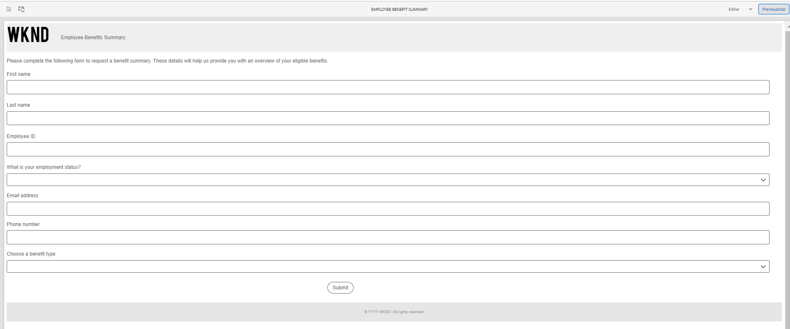
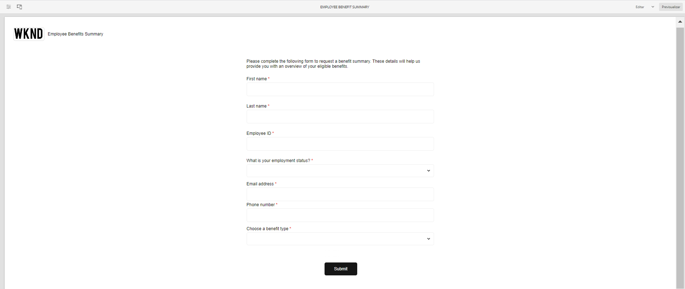
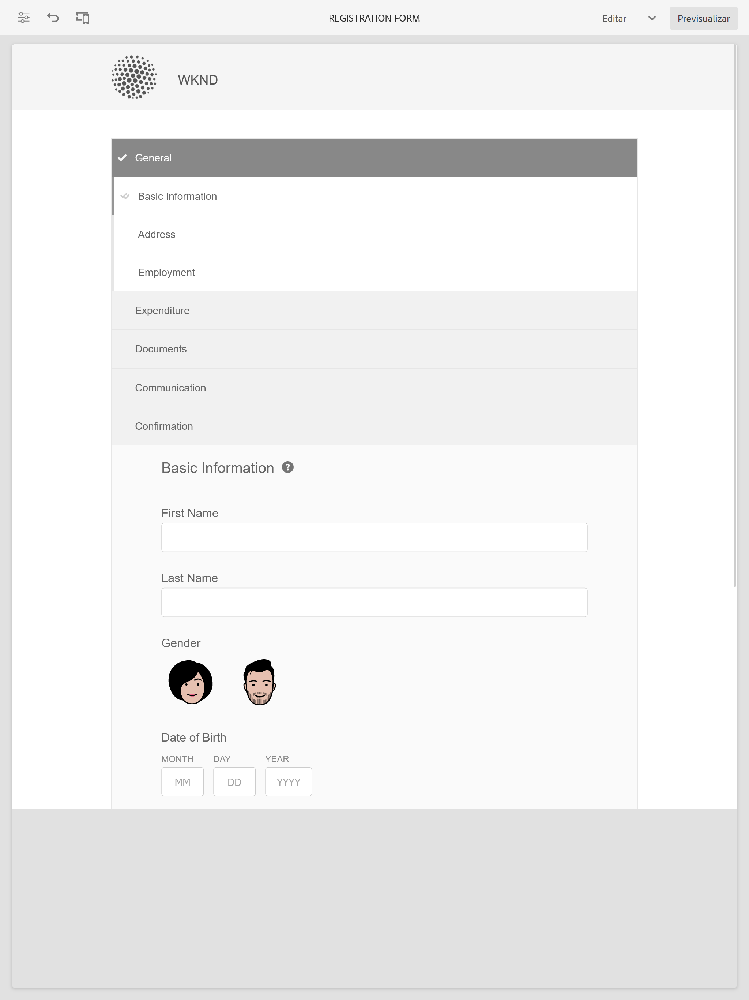
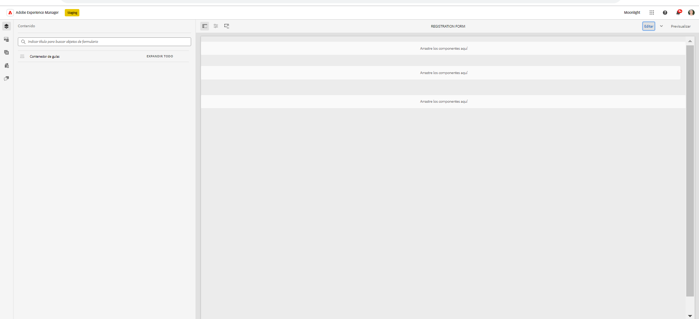

# Temas de muestra, plantillas y modelos de datos de formulario en componentes principales {#sample-themes-templates-and-data-models}

AEM Forms as a Cloud Service proporciona varias temáticas de referencia de ejemplo, plantillas y modelos de datos de formulario para ayudarle a empezar rápidamente a crear Forms adaptable con componentes principales. Puede [habilitar componentes principales de Forms adaptable](https://experienceleague.adobe.com/docs/experience-manager-cloud-service/content/forms/setup-configure-migrate/enable-adaptive-forms-core-components.html?lang=es) en el entorno de desarrollo as a Cloud Service y local de AEM Forms para obtener plantillas OOTB de referencia y [uso y personalización de temáticas](https://experienceleague.adobe.com/docs/experience-manager-cloud-service/content/forms/adaptive-forms-authoring/authoring-adaptive-forms-core-components/create-an-adaptive-form-on-forms-cs/using-themes-in-core-components.html) in [!DNL AEM Forms].

Las temáticas, plantillas y modelos de datos de formulario de ejemplo incluidos en el paquete de contenido de referencia son:

| Plantillas | Temáticas | Modelos de datos de formulario |
---------|----------|---------
| Basic | Canvas | Microsoft® Dynamics 365 |
| Blank | WKND | Salesforce |
| Contáctenos. | Caballete |  |
| Formulario de consentimiento | |  |
| Presentar una queja | | |
| Solicitud de servicio de registro |  |  |
| Enviar comentarios |  |  |
| Inscripción en beneficios |  |   |
| Resumen de beneficios de empleados |   |   |
| Solicitud de extracto de cuenta |   |   |
| Actualización de detalles de contacto |   |   |
| Formulario de inspección de seguridad |   |   |
| Inspección de control de calidad |   |   |
| Solicitud de compra |  |  |

## Temas de muestra {#Sample-Themes}

Los temas de referencia le ayudan a definir el estilo de los formularios sin necesidad de tener experiencia en CSS, incluso puede personalizar el tema según sus necesidades. Puede [habilitar componentes principales de Forms adaptable](https://experienceleague.adobe.com/docs/experience-manager-cloud-service/content/forms/setup-configure-migrate/enable-adaptive-forms-core-components.html?lang=es) Haga clic en el entorno de desarrollo as a Cloud Service y local de AEM Forms para obtener estas temáticas y describirlas de la siguiente manera:

### Canvas {#Canvas}

Canvas es el tema predeterminado para formularios adaptables y enfatiza el uso de colores básicos, transparencia e iconos planos. En la captura de pantalla siguiente, puede ver el aspecto del tema Canvas 

### WKND {#WKND}

El tema de WKND encarna un diseño dinámico, imaginativo y atractivo para mostrar un aspecto elegante en sus formularios. La temática se basa en el aspecto y el estilo de [Sitio WKND](https://wknd.site/us/en.html) que es un sitio web de viajes y aventura basado en [Componentes principales de Adobe Experience Manager](https://experienceleague.adobe.com/docs/experience-manager-core-components/using/introduction).

### Caballete {#Easel}

El tema Easel hace referencia a un tipo específico de diseño de plantilla que es fácil de configurar y que se personaliza para simplificar y facilitar el uso. La temática del caballete se basa en el concepto de un stand portátil utilizado por los artistas para apoyar un lienzo mientras trabajan en sus pinturas.

## Plantillas de muestra {#Sample-templates}

Las plantillas definen la estructura inicial del formulario, el contenido y las acciones que se duplicarán en él o utilizarán una estructura de plantilla similar a la del formulario, por ejemplo, un formulario de consentimiento, un formulario de inscripción en beneficios y mucho más. Puede obtener las siguientes plantillas por [habilitar los componentes principales de Forms adaptable](https://experienceleague.adobe.com/docs/experience-manager-cloud-service/content/forms/setup-configure-migrate/enable-adaptive-forms-core-components.html?lang=es) en el entorno de desarrollo as a Cloud Service o local de AEM Forms. Las plantillas de ejemplo de los componentes principales de Forms adaptable son:

### Basic {#Basic}

La plantilla básica le ayuda a crear rápidamente un formulario de experiencia de inscripción. También puede utilizarlo para previsualizar la funcionalidad de los componentes principales de Forms adaptables. Proporciona un diseño de asistente para la presentación de datos sección a sección.

>[!BEGINTABS]

>[!TAB Escritorio]

    

>[!TAB Teléfono]

    

>[!TAB Tableta]

    

>[!ENDTABS]

### Blank {#Blank}

Se utiliza una plantilla de lienzo en blanco para crear una estructura de formulario adaptable, contenido y reglas desde cero. No se han incorporado componentes de formulario.

### Solicitud de extracto de cuenta {#Request-for-Account-Statement}

Solicitud de un formulario de extracto de cuenta para solicitar un extracto de transacciones. Esta declaración proporciona un registro detallado de transacciones financieras, actividades u otra información relevante acerca de una persona. Al completar este formulario, puede iniciar el proceso de obtención de una declaración precisa y actualizada para sus registros.

### Actualización de detalles de contacto {#Contact-Details-Update}

El formulario de actualización de datos de contacto para la actualización de direcciones y datos de contacto está diseñado para ayudarle a actualizar su información personal relacionada con su suscripción o beneficios para garantizar una comunicación fluida y un acceso ininterrumpido a los servicios o beneficios que recibe.

### Inspección de seguridad {#Safety-Inspection}

El formulario de inspección de seguridad es para mantener un entorno de trabajo seguro. Mediante la realización de inspecciones periódicas utilizando este formulario, pueden identificarse los peligros potenciales. Cubre diversos aspectos como salidas de emergencia, seguridad contra incendios, seguridad eléctrica, materiales peligrosos, equipo de protección personal, ergonomía de estaciones de trabajo, etc. para la seguridad y el bienestar de los empleados, visitantes y clientes, y crea un entorno seguro para todos.

### Solicitud de compra {#Purchase-Request}

Un formulario de solicitud de compra para iniciar el proceso de adquisición y permitir a los empleados solicitar formalmente la compra de los bienes o servicios necesarios para su trabajo. El formulario captura detalles esenciales como la descripción del artículo, la cantidad, el proveedor preferido (si corresponde), la asignación del presupuesto, la justificación de la compra, la información de entrega y las aprobaciones requeridas. El propósito del formulario es agilizar y documentar el proceso de compra, garantizando la debida autorización y seguimiento de las compras solicitadas.

### Resumen de beneficios de empleados {#Employee-Benefits-Summary}

El formulario Resumen de Beneficios para Empleados se utiliza para recopilar detalles esenciales sobre los beneficios de una persona. Ayuda a evaluar la cobertura de forma rápida y precisa, proporcionando una visión general completa para una asistencia y soporte eficientes.

### Inscripción en beneficios {#Benefits-Enrollment}

Una plantilla de formulario de inscripción en beneficios para recopilar información esencial de sus empleados sobre sus beneficios preferidos y opciones de cobertura. Por lo general, acompaña al período anual de inscripción en las prestaciones.

### Inspección del control de calidad {#Quality-Control-Inspection}

Un formulario de inspección de control de calidad para evaluar y documentar el aspecto visual, las dimensiones, la funcionalidad, la documentación, los resultados de las pruebas y la calidad general de un producto o artículo. Ayuda a identificar defectos, incumplimientos y acciones correctivas necesarias para garantizar el cumplimiento de los estándares de calidad.

### Formulario de consentimiento {#Consent-Form}

Un formulario de consentimiento es un documento legal que busca obtener permiso voluntario e informado de una persona o participante antes de que participen en una actividad específica, estudio de investigación, procedimiento médico o cualquier situación en la que su información personal o sus derechos puedan estar involucrados. El propósito de un formulario de consentimiento es garantizar la transparencia, proteger los derechos del participante y establecer una comprensión clara de lo que el individuo está aceptando.

### Contáctenos. {#Contact-Us}

El formulario de actualización de datos de contacto para la actualización de direcciones y datos de contacto está diseñado para ayudarle a actualizar su información personal relacionada con su suscripción o beneficios para garantizar una comunicación fluida y un acceso ininterrumpido a los servicios o beneficios que recibe.

### Solicitud de servicio de registro {#Log-Service-Request}

Formulario de solicitud de servicio de registro para solicitar servicios de registro específicos a un proveedor de servicios. El formulario sirve como solicitud formal para crear un ticket si ciertos eventos, actividades o datos se han registrado para el estado de seguimiento o monitorización.

### Enviar comentarios {#Give-Feedback}

Una plantilla de &quot;dar comentarios&quot; para proporcionar comentarios constructivos a otra persona o equipo. La plantilla ayuda a garantizar que los comentarios sean claros, específicos y procesables, lo que promueve la comunicación abierta y la mejora.

## Modelos de datos de formulario de referencia {#reference-models}

A continuación, el Forms adaptable puede interactuar con los servidores de Microsoft® Dynamics 365 y Salesforce para habilitar los flujos de trabajo empresariales. Por ejemplo:

* escribir datos en Microsoft® Dynamics 365 y Salesforce sobre el envío de formularios adaptables;
* escribir datos en Microsoft® Dynamics 365 y Salesforce a través de entidades personalizadas definidas en el modelo de datos de formulario y viceversa;
* Consulte datos en Microsoft® Dynamics 365 y el servidor de Salesforce y rellene previamente Forms adaptable.
* Leer datos del servidor de Microsoft® Dynamics 365 y Salesforce.

Puede obtener los siguientes modelos de datos de formulario instalando el [Paquete de contenido de referencia](https://experience.adobe.com/#/downloads/content/software-distribution/en/aemcloud.html?package=/content/software-distribution/es/details.html/content/dam/aemcloud/public/aem-forms-reference-content.ui.content-2.1.0.zip):

* Microsoft® Dynamics 365
* Salesforce

Para obtener información sobre el uso de estos modelos, consulte [Configuración de los servicios en la nube de Microsoft® Dynamics 365 y Salesforce](https://experienceleague.adobe.com/docs/experience-manager-cloud-service/content/forms/integrate/use-form-data-model/configure-msdynamics-salesforce.html?lang=es#configure-dynamics-cloud-service)
