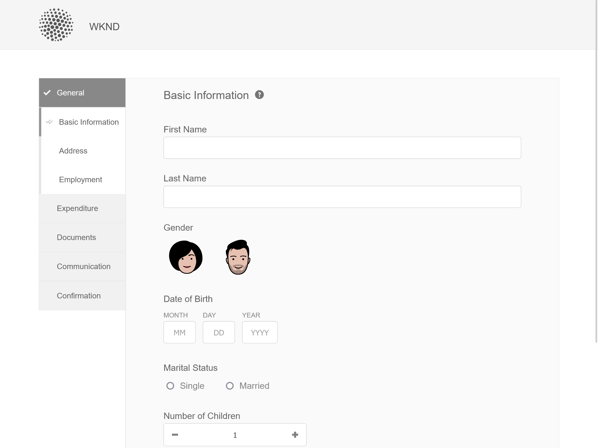

# Temas de muestra, plantillas y modelos de datos de formulario en componentes principales {#sample-themes-templates-and-data-models}

AEM Forms as a Cloud Service proporciona temáticas de referencia de ejemplo, plantillas y modelos de datos de formulario para ayudarle a empezar rápidamente a crear Forms adaptable con componentes principales. Puede [habilitar componentes principales de Forms adaptable](https://experienceleague.adobe.com/docs/experience-manager-cloud-service/content/forms/setup-configure-migrate/enable-adaptive-forms-core-components.html?lang=es) en el entorno de desarrollo as a Cloud Service y local de AEM Forms para obtener plantillas OOTB de muestra y [uso y personalización de temáticas de ejemplo](https://experienceleague.adobe.com/docs/experience-manager-cloud-service/content/forms/adaptive-forms-authoring/authoring-adaptive-forms-core-components/create-an-adaptive-form-on-forms-cs/using-themes-in-core-components.html) in [!DNL AEM Forms].

Las temáticas, plantillas y modelos de datos de formulario de ejemplo incluidos en el paquete de contenido de referencia son:

| Plantillas | Temáticas | Modelos de datos de formulario |
---------|----------|---------
| Basic | Canvas | Microsoft® Dynamics 365 |
| Blank | WKND | Salesforce |
| Contáctenos. | Caballete |  |
| Actualización de detalles de contacto |   |   |
| Formulario de consentimiento | |  |
| Solicitud de servicio de registro |  |  |
| Enviar comentarios |  |  |
| Inscripción en beneficios |  |   |
| Resumen de beneficios de empleados |   |   |
| Solicitud de extracto de cuenta |   |   |
| Formulario de inspección de seguridad |   |   |
| Inspección de control de calidad |   |   |
| Solicitud de compra |  |  |

## Temas de muestra {#Sample-Themes}

Los temas de ejemplo de referencia ayudan a los autores a definir y personalizar el estilo para los formularios, los autores con incluso un conocimiento básico de CSS pueden personalizar el tema según los requisitos. Autores de formularios [habilitar componentes principales de Forms adaptable](https://experienceleague.adobe.com/docs/experience-manager-cloud-service/content/forms/setup-configure-migrate/enable-adaptive-forms-core-components.html?lang=es) Haga clic en el entorno de desarrollo as a Cloud Service y local de AEM Forms para obtener estas temáticas y describirlas de la siguiente manera:

### Canvas {#Canvas}

La temática Lienzo es la predeterminada para los formularios y enfatiza el uso de colores básicos, transparencia e iconos planos. En la captura de pantalla siguiente, puede ver el aspecto del tema Canvas 

### WKND {#WKND}

El tema de WKND encarna un diseño dinámico, imaginativo y atractivo para mostrar un aspecto elegante a sus formularios. La temática se basa en el aspecto y el estilo de [Sitio WKND](https://wknd.site/us/en.html) que es un sitio web de viajes y aventura basado en [Componentes principales de Adobe Experience Manager](https://experienceleague.adobe.com/docs/experience-manager-core-components/using/introduction).

### Caballete {#Easel}

El tema de caballete ayuda a crear un aspecto del formulario que es atractivo y fácil de configurar, está personalizado para la simplicidad y la facilidad de uso. La temática del caballete se basa en el concepto de un stand portátil utilizado por los artistas para apoyar un lienzo mientras trabajan en sus pinturas.

## Plantillas de muestra {#Sample-templates}

Las plantillas definen la estructura inicial del formulario, el contenido y las acciones que se duplicarán en él o utilizarán una estructura de plantilla similar a la del formulario, por ejemplo, un formulario de consentimiento, un formulario de inscripción en beneficios y mucho más. Puede obtener las siguientes plantillas por [habilitar los componentes principales de Forms adaptable](https://experienceleague.adobe.com/docs/experience-manager-cloud-service/content/forms/setup-configure-migrate/enable-adaptive-forms-core-components.html?lang=es) en el entorno de desarrollo as a Cloud Service o local de AEM Forms. Las plantillas de ejemplo de los componentes principales de Forms adaptable son:

### Basic {#Basic}

La plantilla básica le ayuda a crear rápidamente un formulario de experiencia de inscripción. También puede utilizarlo para previsualizar la funcionalidad de [Componentes principales de Forms adaptable](https://experienceleague.adobe.com/docs/experience-manager-core-components/using/adaptive-forms/introduction). Proporciona un diseño de asistente para la presentación de datos sección a sección.

>[!BEGINTABS]

>[!TAB Escritorio]

>[!TAB Teléfono]

>[!TAB Tableta]

>[!ENDTABS]

### Blank {#Blank}

Se utiliza una plantilla de lienzo en blanco para crear una estructura de formulario adaptable, contenido y reglas desde cero. En la plantilla en blanco no se preincorporan componentes de formulario.

### Contáctenos. {#Contact-Us}

La plantilla de formulario Contacto se utiliza para crear un formulario que facilite la comunicación entre los visitantes y los administradores del sitio web. Los usuarios pueden enviar consultas, comentarios o solicitudes de asistencia a través del formulario.

### Actualización de detalles de contacto {#Contact-Details-Update}

La plantilla de actualización de datos de contacto ayuda a los autores a crear un formulario para la actualización de la dirección y los datos de contacto de los clientes. El formulario también ayuda a los clientes a actualizar la información personal relacionada con la suscripción o los beneficios para garantizar una comunicación fluida y un acceso ininterrumpido a los servicios o beneficios.

### Formulario de consentimiento {#Consent-Form}

La plantilla de formulario de consentimiento se utiliza para crear un formulario para obtener un documento legal de los participantes que participan en una actividad específica, estudio de investigación, procedimiento médico o cualquier situación en la que su información personal o sus derechos puedan estar involucrados. El formulario garantiza la transparencia, protege los derechos del participante y establece una comprensión clara de lo que el individuo está de acuerdo.

### Solicitud de servicio de registro {#Log-Service-Request}

La plantilla de solicitud del servicio de registro ayuda a crear un formulario que solicita servicios de registro específicos de un proveedor de servicios. El formulario sirve como solicitud formal para crear un ticket si ciertos eventos, actividades o datos se han registrado para el estado de seguimiento o monitorización.

### Enviar comentarios {#Give-Feedback}

Proporcionar comentarios La plantilla de formulario ayuda a crear un formulario para proporcionar comentarios constructivos a otra persona o equipo. El formulario ayuda a garantizar que los comentarios sean claros, específicos y procesables, lo que promueve la comunicación abierta y la mejora.

### Inscripción en beneficios {#Benefits-Enrollment}

La plantilla de formulario de inscripción en beneficios se utiliza para crear un formulario para recopilar información esencial de sus empleados sobre sus beneficios preferidos y las opciones de cobertura. Por lo general, acompaña al período anual de inscripción en las prestaciones.

### Resumen de beneficios de empleados {#Employee-Benefits-Summary}

La plantilla de formulario Resumen de beneficios para empleados se utiliza para crear un formulario con el fin de recopilar detalles esenciales sobre los beneficios de una persona. Ayuda a evaluar la cobertura de forma rápida y precisa, proporcionando una visión general completa para una asistencia y soporte eficientes.

### Solicitud de extracto de cuenta {#Request-for-Account-Statement}

La plantilla de solicitud de extracto de cuenta ayuda a crear un formulario que inicia el proceso de obtención de un extracto de cliente preciso y actualizado. La declaración proporciona un registro detallado de transacciones financieras, actividades u otra información relevante acerca de los clientes que usan este formulario.

### Inspección de seguridad {#Safety-Inspection}

La plantilla de formulario Inspección de seguridad ayuda a crear un formulario para introducir detalles para un entorno de trabajo seguro. Mediante la realización de inspecciones periódicas utilizando este formulario, pueden identificarse los peligros potenciales. El formulario cubre varios aspectos, como salidas de emergencia, seguridad contra incendios, seguridad eléctrica, materiales peligrosos, equipo de protección personal, ergonomía de la estación de trabajo para la seguridad y el bienestar de los empleados, visitantes y clientes.

### Inspección del control de calidad {#Quality-Control-Inspection}

La plantilla de formulario de inspección de control de calidad se utiliza para crear un formulario para evaluar y documentar el aspecto visual, las dimensiones, la funcionalidad, la documentación, los resultados de las pruebas y la calidad general de un producto o elemento. Ayuda a identificar defectos, incumplimientos y acciones correctivas necesarias para garantizar el cumplimiento de los estándares de calidad.

### Solicitud de compra {#Purchase-Request}

La plantilla de formulario de solicitud de compra ayuda a crear un formulario para iniciar el proceso de adquisición y permitir a los empleados solicitar formalmente la compra de los bienes o servicios necesarios para su trabajo. El formulario captura detalles esenciales como la descripción del artículo, la cantidad, el proveedor preferido (si corresponde), la asignación del presupuesto, la justificación de la compra, la información de entrega y las aprobaciones requeridas.

## Modelos de datos de formulario de referencia {#reference-models}

Después de crear una [Formulario adaptable](https://experienceleague.adobe.com/docs/experience-manager-core-components/using/adaptive-forms/introduction.html?lang=en#adaptive-forms-core-components) basado en [Componente principal](https://experienceleague.adobe.com/docs/experience-manager-core-components/using/adaptive-forms/introduction.html?lang=en#adaptive-forms-core-components), puede conectar el back-end del formulario con la base de datos de los servidores de Microsoft® Dynamics 365 y Salesforce para habilitar los flujos de trabajo empresariales. Por ejemplo:

* escribir datos en Microsoft® Dynamics 365 y Salesforce sobre el envío de formularios adaptables;
* escribir datos en Microsoft® Dynamics 365 y Salesforce a través de entidades personalizadas definidas en el modelo de datos de formulario y viceversa;
* Consulte datos en Microsoft® Dynamics 365 y el servidor de Salesforce y rellene previamente Forms adaptable.
* Leer datos del servidor de Microsoft® Dynamics 365 y Salesforce.

Puede obtener los siguientes modelos de datos de formulario instalando el [Paquete de contenido de referencia](https://experience.adobe.com/#/downloads/content/software-distribution/en/aemcloud.html?package=/content/software-distribution/es/details.html/content/dam/aemcloud/public/aem-forms-reference-content.ui.content-2.1.0.zip):

* Microsoft® Dynamics 365
* Salesforce

Para obtener información sobre el uso de estos modelos, consulte [Configuración de los servicios en la nube de Microsoft® Dynamics 365 y Salesforce](https://experienceleague.adobe.com/docs/experience-manager-cloud-service/content/forms/integrate/use-form-data-model/configure-msdynamics-salesforce.html?lang=es#configure-dynamics-cloud-service)
