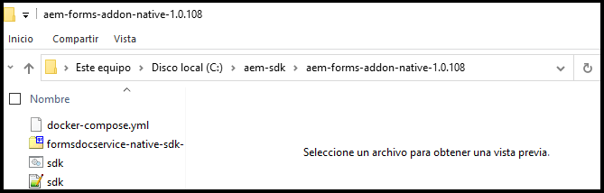

# Configurar un entorno de desarrollo local para AEM Forms {#overview}

Al establecer y configurar un [!DNL  Adobe Experience Manager Forms] como entorno de[!DNL  Cloud Service], configura entornos de desarrollo, de puesta en escena y de producción en la nube. Además, también puede establecer y configurar un entorno de desarrollo local.

Puede utilizar el entorno de desarrollo local para realizar las siguientes acciones sin iniciar sesión en el entorno de desarrollo de la nube:

* [Crear formularios](creating-adaptive-form.md) y activos relacionados (temáticas, plantillas, acciones de envío personalizadas, etc.)
* [Convertir formularios adaptables en PDF forms](https://experienceleague.adobe.com/docs/aem-forms-automated-conversion-service/using/convert-existing-forms-to-adaptive-forms.html?lang=es)
* Generar solicitudes para generar [Comunicaciones del cliente](aem-forms-cloud-service-communications-introduction.md) bajo demanda o en modo por lotes.

Después de que un formulario adaptable o activos relacionados estén listos en la instancia de desarrollo local o una solicitud para generar [Comunicaciones del cliente], puede exportar el formulario adaptable o la solicitud Comunicaciones del cliente desde el entorno de desarrollo local a un entorno de Cloud Service para realizar más pruebas o desplazarse a entornos de producción.

También puede desarrollar y probar código personalizado como componentes personalizados y servicio de relleno previo en el entorno de desarrollo local. Cuando el código personalizado esté listo y se haya probado, puede utilizar el repositorio Git del entorno de desarrollo de Cloud Service para implementar el código personalizado.

Para configurar un nuevo entorno de desarrollo local y utilizarlo para desarrollar actividades, realice las siguientes acciones en el orden indicado:

* [Configurar las herramientas de desarrollo](#setup-development-tools-for-AEM-projects)

* [Configurar las instancias locales Author y Publish](#set-up-local-experience-manager-environment-for-development)

* [Agregar archivos de Forms a instancias de desarrollo local y configurar usuarios](#add-forms-archive-configure-users)

* [Configurar el entorno de desarrollo local para microservicios](#docker-microservices)

* [Configurar un proyecto de desarrollo](#forms-cloud-service-local-development-environment)

* [Configurar las herramientas locales de Dispatcher](#setup-local-dispatcher-tools)

<!--
You can use the local development environment to create and test Adaptive Forms without connecting to the Cloud Service. [!DNL AEM Forms] provides an SDK to help test all the cloud-ready functionalities on the local development environment. When your forms and related assets are ready and tested on the local development environment, you can import these forms and related assets to an [!DNL AEM Forms] as a Cloud Service instance for publishing. 

You can also develop and test custom code like custom components and prefill service on the local development environment. When the custom code is tested and ready, you can use the Git repository of your [!DNL AEM Forms] as a Cloud Service development environment to deploy the custom code. 

>[!NOTE]
>
> Pre-pilot release does not support using an [!DNL AEM Forms] as a Cloud Service development instance to create forms. You can create forms, related assets, and custom code only on a local development environment.-->

<!--
You configure two types of development environments:

* **[!DNL AEM Forms] as a Cloud Service development environment:** Use the [[!DNL AEM Forms] as a Cloud Service](setup-forms-cloud-service.md) environment to store, manage, and publish Adaptive Forms and related assets. Do not use an [!DNL AEM Forms] as a Cloud Service environment to create Adaptive Forms and related assets <!--, form-centric workflows, a form data model, or to generate a Document of Record. -->

<!--
* **Local development environment:** You can use the local development environment to create and test Adaptive Forms without connecting to the service. Adobe provides a SDK for the local development to help test all the cloud-ready functionalities. 
Use a local development environment:
    
    * To create forms and related assets (themes, templates, custom Submit Actions, and more) and convert PDF forms to Adaptive Forms. After an Adaptive Form or related assets are ready on the local development instance, you can export the Adaptive Form and related assets from the local development environment to an [!DNL AEM Forms] as a Cloud Service development environment for publishing.  
    
    * To update configuration settings and develop and test custom code like custom components and prefill service. When the custom code is tested and ready, you can use the Git repository of your [!DNL AEM Forms] as a Cloud Service development environment to deploy the custom code.  

You can use the local development environment to create and test Adaptive Forms without connecting to the service. Adobe provides a SDK for the local development to help test all the cloud-ready functionalities. When your forms and related assets are ready and tested on the local development environment, you can import these forms and related assets to an [!DNL AEM Forms] as a Cloud Service instance for publishing. 

You can use the [development tools](https://experienceleague.adobe.com/docs/experience-manager-65/developing/devtools/dev-tools.html?lang=es) to write custom code, customize or create new Adaptive Forms components, create a custom prefill service, or modify default configurations of an [!DNL AEM Forms] as a Cloud Service instance. 

-->

## Requisitos previos

Necesita el siguiente software para configurar un entorno de desarrollo local. Descargue estos elementos antes de comenzar a configurar el entorno de desarrollo local:

| Software | Descripción | Vínculos de descarga |
|---|---|---|
| SDK de Adobe Experience Manager as a Cloud Service | SDK incluye [!DNL Adobe Experience Manager] Herramientas de QuickStart y Dispatcher | Descargue el SDK más reciente de [Distribución de software](#software-distribution) |  |
| Archivo de características de Adobe Experience Manager Forms (complemento de AEM Forms) | Herramientas para crear, aplicar estilos y optimizar formularios adaptables y otras características de Adobe Experience Manager Forms | Descargar desde [Distribución de software](#software-distribution) |
| (Opcional) Contenido de referencia de Adobe Experience Manager Forms | Herramientas para crear, aplicar estilos y optimizar formularios adaptables y otras características de Adobe Experience Manager Forms | Descargar desde [Distribución de software](#software-distribution) |
| (Opcional) Adobe Experience Manager Forms Designer | Herramientas para crear, aplicar estilos y optimizar formularios adaptables y otras características de Adobe Experience Manager Forms | Descargar desde [Distribución de software](#software-distribution) |

### Descargue la última versión de software desde Distribución de software {#software-distribution}

Para descargar la última versión del SDK de Adobe Experience Manager as a Cloud Service, el archivo de características de Experience Manager Forms (complemento de AEM Forms), los activos de referencia de formularios o Forms Designer desde [Distribución de software](https://experience.adobe.com/#/downloads/content/software-distribution/es-ES/aemcloud.html):

1. Inicie sesión en <https://experience.adobe.com/#/downloads> con su Adobe ID

   >[!NOTE]
   >
   > Su organización de Adobe debe estar aprovisionada para AEM as a Cloud Service para descargar el SDK de AEM as a Cloud Service.

1. Vaya a la pestaña **[!UICONTROL AEM as a Cloud Service]**.
1. Ordene por fecha de publicación en orden de bajada.
1. Haga clic en el SDK de Adobe Experience Manager as a Cloud Service más reciente, el archivo de características de Experience Manager Forms (complemento de AEM Forms), los activos de referencia de formularios o Forms Designer.

   >[!NOTE]
   >
   > Le recomendamos que se descargue la última versión del archivo de características de Experience Manager Forms (complemento de AEM Forms), los recursos de referencia de formularios o Forms Designer para lograr una compatibilidad perfecta con el SDK de Adobe Experience Manager as a Cloud Service.

1. Revise y acepte el EULA. Seleccione el botón **[!UICONTROL Descargar]**.

## Configurar las herramientas de desarrollo para Proyectos AEM {#setup-development-tools-for-AEM-projects}

El proyecto de Adobe Experience Manager Forms es una base de código personalizado. Contiene código, configuraciones y contenido que se implementa mediante Cloud Manager en [!DNL Adobe Experience Manager] as a Cloud Service. El [proyecto AEM Maven Archetype](https://github.com/adobe/aem-project-archetype) proporciona la estructura de la línea de base para el proyecto.

Configure las siguientes herramientas de desarrollo para usar con su [!DNL Adobe Experience Manager] proyecto de desarrollo:

* [Java™](https://experienceleague.adobe.com/docs/experience-manager-learn/cloud-service/local-development-environment-set-up/development-tools.html?lang=es#local-development-environment-set-up)
* [Git](https://experienceleague.adobe.com/docs/experience-manager-learn/cloud-service/local-development-environment-set-up/development-tools.html?lang=es#install-git)
* [Node.js (npm)](https://experienceleague.adobe.com/docs/experience-manager-learn/cloud-service/local-development-environment-set-up/development-tools.html?lang=es#node-js)
* [Maven](https://experienceleague.adobe.com/docs/experience-manager-learn/cloud-service/local-development-environment-set-up/development-tools.html?lang=es#install-maven)

Para obtener instrucciones detalladas para configurar las herramientas de desarrollo mencionadas anteriormente, consulte [Configurar las herramientas de desarrollo](https://experienceleague.adobe.com/docs/experience-manager-learn/cloud-service/local-development-environment-set-up/development-tools.html?lang=es).

## Configurar el entorno local de Experience Manager para el desarrollo

El SDK de Cloud Service proporciona un archivo de QuickStart. Ejecuta una versión local de Experience Manager. Puede ejecutar las instancias Author o Publish de manera local.

Aunque QuickStart proporciona una experiencia de desarrollo local, no todas las características están disponibles en [!DNL Adobe Experience Manager] as a Cloud Service. Por lo tanto, pruebe siempre las características y el código con el entorno de desarrollo[!DNL Adobe Experience Manager] as a Cloud Service antes de mover las características a fase o producción.

Para instalar y configurar el entorno local de Experience Manager, realice los siguientes pasos:

* [Descargue y extraiga](https://experience.adobe.com/#/downloads/content/software-distribution/es-es/aemcloud.html) el SDK [!DNL Adobe Experience Manager] as a Cloud Service
* [Configure una instancia Author](https://experienceleague.adobe.com/docs/experience-manager-learn/cloud-service/local-development-environment-set-up/aem-runtime.html?lang=es#set-up-local-aem-author-service)
* [Configure una instancia de Publish](https://experienceleague.adobe.com/docs/experience-manager-learn/cloud-service/local-development-environment-set-up/aem-runtime.html?lang=es#set-up-local-aem-publish-service)

## Agregue el archivo Forms a las instancias locales Author y Publish y configure usuarios específicos de Forms {#add-forms-archive-configure-users}

Realice los siguientes pasos en el orden indicado para agregar el archivo de Forms a instancias de Experience Manager y configurar usuarios específicos de Forms:

### Instale el último archivo de características de complementos de Forms {#add-forms-archive}

El archivo de características de Adobe Experience Manager Forms as a Cloud Service proporciona herramientas para crear, agregar estilos y optimizar formularios adaptables en el entorno de desarrollo local. Instale el paquete para crear un formulario adaptable y utilice otras características de [!DNL AEM Forms]. Para instalar el paquete, haga lo siguiente:

1. Descargue y extraiga el archivo[!DNL AEM Forms] más reciente para su sistema operativo desde [Distribución de software](https://experience.adobe.com/#/downloads/content/software-distribution/es-es/aemcloud.html).

1. Navegue hasta el directorio crx-quickstart/install. Si la carpeta no existe, créela.

1. Detenga la instancia de AEM, coloque el archivo de características de complementos de [!DNL AEM Forms], `aem-forms-addon-<version>.far`, en la carpeta de instalación.
1. Vaya a la ventana de comandos activa y pulse el comando `Ctrl + C` para reiniciar el SDK.

   >[!NOTE]
   >
   > Se recomienda utilizar el comando &quot;Ctrl + C&quot; para reiniciar el SDK. El reinicio del SDK de AEM mediante métodos alternativos, como detener los procesos de Java, puede generar incoherencias en el entorno de desarrollo de AEM.

<!--**Q**: I've set up a Aem as a Cloud Service environment and added the Forms Add-On for a project. After the .far file addition, the bundles are not in the active state and are in installed state only due to the missing dependencies. How to make the bundles in the active state?
**A**: To resolve the issue:
1. Start the AEM and wait for it to start completely (all bundles up)
1. Stop aem (ctrl + c). Place the forms far in the install folder.
1. Restart AEM.-->


### Configurar usuarios y permisos {#configure-users-and-permissions}

Cree usuarios como Desarrollador de formularios y Profesional de formularios y [agregue estos usuarios a grupos de formularios predefinidos](https://experienceleague.adobe.com/docs/experience-manager-learn/cloud-service/accessing/aem-users-groups-and-permissions.html?lang=es#accessing) para proporcionarles los permisos necesarios. La siguiente tabla muestra todos los tipos de usuarios y grupos predefinidos para cada tipo de usuarios de formularios:

| Tipo de usuario | Grupo de AEM |
|---|---|
| Profesional del formulario / | [!DNL forms-users] (Usuarios de AEM Forms), [!DNL template-authors], [!DNL workflow-users], [!DNL workflow-editors]y [!DNL fdm-authors] |
| Desarrollador de formularios | [!DNL forms-users] (Usuarios de AEM Forms), [!DNL template-authors], [!DNL workflow-users], [!DNL workflow-editors]y [!DNL fdm-authors] |
| Posible cliente de experiencia del cliente o Diseñador de UX | [!DNL forms-users], [!DNL template-authors] |
| Administrador de AEM | [!DNL aem-administrators], [!DNL fd-administrators] |
| Usuario final | Cuando un usuario debe iniciar sesión para ver y enviar un formulario adaptable, agregue estos usuarios al grupo [!DNL forms-users]. </br> Cuando no se requiera autenticación de usuario para acceder a los formularios adaptables, no asigne ningún grupo a esos usuarios. |

<!--  

## Set up a local AEM instance for development

Perform the following steps in the listed order to set up and configure your local development environment:

1. **Set up an AEM author instance:** You require an author instance to create Adaptive Forms. Download and extract the latest AEM SDK archive. Run the quick start file in author run mode to set up an author instance. For detailed instructions, see [default local instance](https://experienceleague.adobe.com/docs/experience-manager-learn/cloud-service/local-development-environment-set-up/aem-runtime.html?lang=es).  

1. **Install the latest [!DNL AEM Forms] add-on feature archive:** [!DNL AEM Forms] add-on feature archive provides tools to create, style, and optimize Adaptive Forms on the local development environment. Install the package to create an Adaptive Form and use various other features of [!DNL AEM Forms]. To install the package:

    1. Download and extract the latest [!DNL AEM Forms] archive for your operating system from [Software Distribution](https://experience.adobe.com/#/downloads/content/software-distribution/en/aemcloud.html).

    1. Navigate to the crx-quickstart/install directory. If the folder does not exist, create it.

    1. Stop your Cloud ready AEM instance, place the [!DNL AEM Forms] add-on feature archive, `aem-forms-addon-<version>.far`,  in the install folder, and restart the instance.

1. **Configure users and permissions:** Create users like Form Developer and Form Practitioner a nd add these users to pre-defined forms group to provide them required permissions. The table below lists all types of users and pre-defined groups for each type of forms users:
  
    | User Type | AEM Group |
    |---|---|
    | Form Practitioner  | forms-users (AEM Forms Users), template-authors  |
    | Form Developer | forms-users (AEM Forms Users), template-authors |
    | End-User| everyone* |

    `*` When a user should log in to access or submit Adaptive Forms, add such users to the everyone group.  -->

<!--    
### Set up an AEM project for the development tasks related to local AEM 6.5.5 Forms instance

Use this project to update configurations, create overlays, develop custom Adaptive Form components, and custom code using the local development environment. To set up the project:

1. **Install and configure Maven and set up an AEM project based on Apache Maven:** Apache Maven is an open-source tool for managing software projects. It helps automate builds and provides quality project information. It is the recommended build management tool for AEM projects. For detailed instructions to set up an AEM project based on Apache Maven, see [How to Build AEM Projects using Apache Maven](https://experienceleague.adobe.com/docs/experience-manager-65/developing/devtools/ht-projects-maven.html?lang=es).

1. Configure the project to use [uber-jar](https://experienceleague.adobe.com/docs/experience-manager-65/release-notes/release-notes.html?lang=es#install-aem-forms-jee-installer) version 6.5.5 or later and [[!DNL AEM Forms] Client SDK](https://repo1.maven.org/maven2/com/adobe/aemfd/aemfd-client-sdk/) version 6.0.160 or later.  

1. **Set Up an Integrated Development Environment:**  Set up an IDE of your choice for development, see [Set Up an Integrated Development Environment](https://experienceleague.adobe.com/docs/experience-manager-learn/foundation/development/set-up-a-local-aem-development-environment.html?lang=es#set-up-an-integrated-development-environment) for detailed instructions.
 -->

## Configurar el entorno de desarrollo local para el documento de registro (DoR){#docker-microservices}

AEM Forms as a Cloud Services proporciona un entorno SDK basado en Docker que facilita el desarrollo del documento de registro y el uso de otros microservicios. Evita que deba configurar manualmente binarios y adaptaciones específicos de la plataforma. Para configurar el entorno, haga lo siguiente:

1. Instale y configure Docker:

   * (Para Microsoft® Windows) Instale [Docker Desktop](https://www.docker.com/products/docker-desktop). Configura `Docker Engine` y `docker-compose` en su máquina.

   * (Apple macOS) Instale [Docker Desktop para Mac](https://hub.docker.com/editions/community/docker-ce-desktop-mac). Incluye Docker Engine, Docker CLI client, Docker Compose, Docker Content Trust, Kubernetes y Credential Helper.

   * (Para Linux®) Instale [Docker Engine](https://docs.docker.com/engine/install/#server) y [Docker Compose](https://docs.docker.com/compose/install/) en su máquina.

   >[!NOTE]
   >
   > * Para Apple macOS, incluya en la lista de permitidos las carpetas que contengan instancias de locales de AEM Author.
   >
   > * Docker Desktop para Windows admite dos backends, Hyper-V
   > (heredado) y WSL2 (moderno). El uso compartido de archivos lo administra automáticamente
   > Docker cuando se utiliza WSL2 (moderno). Tiene que
   > configurar explícitamente el uso compartido de archivos mientras utiliza Hyper-V (heredado).

1. Cree una carpeta, por ejemplo aem-sdk, en paralelo a las instancias Author y Publish. Por ejemplo, C:\aem-sdk.

1. Extraiga el archivo`aem-forms-addon-<version>.zip\aem-forms-addon-native-<version>.zip`.

   

1. Cree una variable de entorno AEM_HOME y apunte a la instalación local de AEM Author. Por ejemplo, C:\aem\author\.

1. Abra sdk.bat o sdk.sh para editarlo. Establezca AEM_HOME para que apunte a la instalación local de AEM Author. Por ejemplo, C:\aem\author\.

1. Abra el símbolo del sistema y navegue hasta la carpeta `aem-forms-addon-native-<version>`.

1. Asegúrese de que la instancia local AEM Author esté funcionando. Ejecute los siguientes comandos para iniciar el SDK:

   * En Microsoft® Windows

     ```shell
     sdk.bat start
     ```


   * Linux® o Apple macOS

     ```Shell
     % export AEM_HOME=[local AEM Author installation]
     % ./sdk.sh start
     ```


   >[!NOTE]
   >
   > Si ha definido la variable de entorno en el archivo sdk.sh, es opcional especificarla en la línea de comandos. La opción para definir la variable de entorno en la línea de comandos se proporciona para ejecutar el comando sin actualizar el script shell.

   

Ahora puede utilizar el entorno de desarrollo local para procesar el documento de registro. Para realizar pruebas, cargue un archivo XDP en su entorno y procéselo. Por ejemplo, <http://localhost:4502/libs/xfaforms/profiles/default.print.pdf?template=crx:///content/dam/formsanddocuments/cheque-request.xdp> convierte el archivo XDP al documento PDF.

## Configurar un proyecto de desarrollo para Forms basado en el arquetipo de Experience Manager {#forms-cloud-service-local-development-environment}

Utilice este proyecto para crear formularios adaptables, implementar actualizaciones de configuración, superposiciones, crear componentes de formularios adaptables personalizados, probar y personalizar código en el SDK local [!DNL Experience Manager Forms]. Después de realizar la prueba de manera local, puede implementar el proyecto en entornos de producción y no producción [!DNL Experience Manager Forms]as a Cloud Service. Al implementar el proyecto, también se implementan los siguientes activos de AEM Forms:

| Temáticas | Plantillas | Modelo de datos de formulario (FDM) |
---------|----------|---------
| Canvas 3.0 | Basic | Microsoft® Dynamics 365 |
| Tranquilo | Blank | Salesforce |
| Urbane |   |  |
| Ultramarine |  |  |
| Beryl |  |  |

>[!NOTE]
>
> Configure la versión 30 o posterior del tipo de archivo del proyecto AEM para poder utilizar el modelo de datos de formulario (Form Data Model, FDM) de Microsoft® Dynamics 365 y Salesforce con AEM Forms as a Cloud Service.
> > Configure la versión 32 o posterior de AEM Archetype para obtener y utilizar los temas Tranquil, Urbane y Ultramarine con AEM Forms as a Cloud Service.

Para configurar el proyecto, haga lo siguiente:

1. **Clone el repositorio Git de Cloud Manager en su instancia de desarrollo local:** Su repositorio Git de Cloud Manager contiene un proyecto de AEM predeterminado. Se basa en [AEM Archetype](https://github.com/adobe/aem-project-archetype/). Clone su Repositorio Git de Cloud Manager mediante la administración de cuentas Git de autoservicio desde la interfaz de usuario de Cloud Manager para llevar el proyecto a su entorno de desarrollo local. Para obtener más información sobre el acceso al repositorio, consulte [Acceso a repositorios](https://experienceleague.adobe.com/docs/experience-manager-cloud-manager/using/managing-code/accessing-repos.html?lang=es).

<!-- 1. 
After the repository is cloned, [integrate your Git repo with Cloud Manager](https://experienceleague.adobe.com/docs/experience-manager-cloud-manager/using/managing-code/setup-cloud-manager-git-integration.html?lang=es)

**Make cloned AEM project compatible with [!DNL AEM Forms] as a Cloud Service:** Remove uber-jar and other non-cloud dependencies from the pom.xml files of the project. You can refer the pom.xml files of the [sample AEM project](assets/FaaCSample.zip) for the list of required dependencies and update your AEM project accordingly. You can also refer [AEM Project Structure](https://experienceleague.adobe.com/docs/experience-manager-cloud-service/content/implementing/developing/aem-project-content-package-structure.html?lang=es) to learn changes required to make an AEM project compatible with AEM as a Cloud Service.  -->

1. **Cree un proyecto de [!DNL Experience Manager Forms] as a [Cloud Service]:** cree un proyecto de [!DNL Experience Manager Forms] as a [Cloud Service] basado en la última versión del [Arquetipo de AEM](https://github.com/adobe/aem-project-archetype) o posterior. El tipo de archivo ayuda a los desarrolladores a empezar a desarrollar fácilmente [!DNL AEM Forms] as a Cloud Service. También incluye algunas temáticas de muestra y plantillas para ayudarle a empezar rápidamente.

   Abra el símbolo del sistema y ejecute el siguiente comando para crear un proyecto de [!DNL Experience Manager Forms] as a Cloud Service.

   ```shell
   mvn -B org.apache.maven.plugins:maven-archetype-plugin:3.2.1:generate -D archetypeGroupId=com.adobe.aem -D archetypeArtifactId=aem-project-archetype -D archetypeVersion="41" -D appTitle=mysite -D appId=mysite -D groupId=com.mysite -D includeFormsenrollment="y" -D aemVersion="cloud"
   ```

   Cambie el `appTitle`, `appId`y `groupId` en el comando anterior para reflejar su entorno. Además, establezca el valor de includeFormsenrollment, includeFormscommunications e includeFormsheadless en `y` o `n` según la licencia y los requisitos. includeFormsheadless es obligatorio para crear formularios adaptables basados en componentes principales.

   * Utilice la opción `includeFormsenrollment=y` para incluir configuraciones, temáticas, plantillas, componentes principales y dependencias específicos para formularios, que son necesarios para crear formularios adaptables. Si utiliza el portal de Forms establezca la opción `includeExamples=y`. Agregue al proyecto los componentes principales del portal de Forms.

   * Utilice la opción `includeFormscommunications=y` para incluir los componentes principales de Forms y las dependencias necesarias para incluir la funcionalidad de comunicaciones del cliente.

     >[!WARNING]
     >
     >* Al crear un proyecto de tipo de archivo con versión 45, la variable [Carpeta de proyecto de tipo de archivo de AEM]/pom.xml establece inicialmente la versión de los componentes principales de formularios en 2.0.64. Antes de crear o implementar el proyecto Archetype, actualice la versión de los componentes principales de Forms a 2.0.62.

1. Implemente el proyecto en su entorno de desarrollo local. Puede utilizar el siguiente comando para implementarlo en su entorno de desarrollo local

   `mvn -PautoInstallPackage clean install`

   Para obtener la lista completa de comandos, consulte [Creación e instalación](https://experienceleague.adobe.com/docs/experience-manager-core-components/using/developing/archetype/using.html?lang=es#building-and-installing)

1. [Implemente el código en su entorno de  [!DNL AEM Forms] as a Cloud Service](https://experienceleague.adobe.com/docs/experience-manager-cloud-service/implementing/deploying/overview.html?lang=es#customer-releases).

## Configurar las herramientas locales de Dispatcher {#setup-local-dispatcher-tools}

Dispatcher es un módulo de servidor web HTTP Apache que proporciona una capa de seguridad y rendimiento entre el nivel de CDN y AEM Publish. Dispatcher es una parte integral de la arquitectura de Experience Manager general y debe formar parte del entorno de desarrollo local.

Realice los siguientes pasos para configurar Dispatcher local y luego agregarle reglas específicas de formularios:

### Configurar Dispatcher local {#setup-local-dispatcher}

El SDK de [!DNL Experience Manager] as a Cloud Service incluye la versión de herramientas de Dispatcher recomendada, que facilita la configuración, validación y simulación de Dispatcher de manera local. Las herramientas de Dispatcher están basadas en Docker y proporcionan herramientas de línea de comandos para transformar archivos de configuración de Apache HTTP Web Server y Dispatcher en un formato compatible e implementarlos en Dispatcher, que se ejecuta en el contenedor de Docker.

El almacenamiento en caché en Dispatcher permite [!DNL AEM Forms] rellenar previamente formularios adaptables en un cliente. Mejora la velocidad de procesamiento de los formularios rellenados previamente.

Para obtener instrucciones detalladas sobre la configuración de Dispatcher, consulte [Configurar las herramientas locales de Dispatcher](https://experienceleague.adobe.com/docs/experience-manager-learn/cloud-service/local-development-environment-set-up/dispatcher-tools.html?lang=es#local-development-environment-set-up)

### Agregar reglas específicas de Forms a Dispatcher {#forms-specific-rules-to-dispatcher}

Realice los siguientes pasos para configurar la memoria caché de Dispatcher para Experience Manager Forms as a Cloud Service:

1. Abra el proyecto AEM y navegue hasta `\src\conf.dispatcher.d\available_farms`
1. Cree una copia del archivo `default.farm`. Por ejemplo, `forms.farm`.
1. Abra el archivo `forms.farm` creado para editar y reemplazar el siguiente código:

   ```json
   #/ignoreUrlParams {
   #/0001 { /glob "*" /type "deny" }
   #/0002 { /glob "q" /type "allow" }
   #}
   ```

   con

   ```json
   /ignoreUrlParams {
   /0001 { /glob "*" /type "deny" }
   /0002 { /glob "dataRef" /type "allow" }
   }
   ```

1. Guarde y cierre el archivo.
1. Vaya a `conf.d/enabled_farms` y cree un vínculo simbólico al archivo`forms.farm`.
1. Compile e implemente el proyecto en su entorno [!DNL AEM Forms]as a Cloud Service.

### Consideraciones sobre el almacenamiento en caché {#considerations-about-caching}

* El almacenamiento en caché de Dispatcher permite [!DNL AEM Forms] rellenar previamente formularios adaptables en un cliente. Mejora la velocidad de procesamiento de los formularios rellenados previamente.
* La funciones relacionadas con el almacenamiento en caché de contenido seguro están deshabilitadas de forma predeterminada. Para habilitar la característica, puede seguir las instrucciones que se proporcionan en el artículo [Almacenamiento en caché de contenido seguro](https://experienceleague.adobe.com/docs/experience-manager-dispatcher/using/configuring/permissions-cache.html?lang=es)
* Dispatcher puede fallar al validar algunos formulario adaptables y los formularios adaptables relacionados. Para resolver estos problemas, consulte [[!DNL AEM Forms] Almacenamiento en caché](troubleshooting-caching-performance.md) en la sección Solución de problemas.
* Almacenamiento en caché de formularios adaptables localizados:
   * En el entorno de Cloud Service, utilice el formato de URL `http://host:port/content/forms/af/<afName>.<locale>.html` para solicitar una versión localizada de un formulario adaptable en lugar de `http://host:port/content/forms/af/afName.html?afAcceptLang=<locale>`
   * La opción Configuración regional del explorador está deshabilitada de manera predeterminada. Para cambiar la configuración regional del explorador,
* Cuando se usa el formato de URL `http://host:port/content/forms/af/<adaptivefName>.html` y la opción Usar configuración regional del explorador está desactivada en el Administrador de configuración, se proporciona la versión no localizada del formulario adaptable. El idioma no localizado es el utilizado al desarrollar el formulario adaptable. No se tendrá en cuenta la configuración regional de su explorador y se proporcionará una versión no localizada del formulario adaptable.
* Cuando usa el formato de URL `http://host:port/content/forms/af/<adaptivefName>.html` y la opción Usar configuración regional del explorador está activada en el Administrador de configuración, se proporciona una versión localizada del formulario adaptable, si está disponible. El idioma del formulario adaptable localizado se basará en la configuración regional del explorador. Puede llevar a [almacenar en caché solo la primera instancia de un formulario adaptable]. Para evitar que el problema se produzca en su instancia, consulte [solo se almacena en caché la primera instancia de un formulario adaptable](troubleshooting-caching-performance.md) en la sección Solución de problemas.

El entorno de desarrollo local está listo.

## Habilitar los componentes principales de formularios adaptables en el entorno de desarrollo as a Cloud Service y local de AEM Forms

Al habilitar los componentes principales de los formularios adaptables en AEM Forms as a Cloud Service, puede empezar a crear, publicar y ofrecer en varios canales los componentes principales basados en formularios adaptables y sin encabezado mediante las instancias de Cloud Service de AEM Forms. Se necesita un entorno habilitado para los componentes principales de formularios adaptables para utilizar formularios adaptables sin encabezado.

>[!NOTE]
>
> Instale la última versión para habilitar los componentes principales de formularios adaptables para su entorno de AEM Cloud Service.

## Actualice su entorno de desarrollo local {#upgrade-your-local-development-environment}

La actualización del SDK a una nueva versión requiere reemplazar todo el entorno de desarrollo local, lo que provoca la pérdida de todo el código, la configuración y el contenido de los repositorios locales. Asegúrese de que cualquier código, configuración o contenido que no se deba destruir se conserva de forma segura con Git o se exporta desde las instancias de Experience Manager locales como paquetes CRX.

### Evitar la pérdida de contenido al actualizar el SDK {#avoid-content-loss-when-upgrading--SDK}

Actualizar el SDK es crear de manera efectiva una nueva instancia Author y Publish, que incluyan un repositorio nuevo ([Configurar proyectos AEM ](#forms-cloud-service-local-development-environment)), lo que significa que se perderá cualquier cambio realizado en el repositorio de un SDK anterior. Para conocer estrategias viables que permitan mantener el contenido entre las actualizaciones del SDK, consulte [Evitar la pérdida de contenido al actualizar el SDK de AEM](https://experienceleague.adobe.com/docs/experience-manager-learn/cloud-service/local-development-environment-set-up/aem-runtime.html?lang=es#optional-local-aem-runtime-set-up-tasks)

<!--When you update any  Forms-specifc configuration, create overlays, develop custom Adaptive Form components, or develop and test any custom code in AEM project for the development tasks related to local development instance, use the AEM project cloned from the Cloud Manager Git repository to [deploy the custom code and other changes to your [!DNL AEM Forms] as a Cloud Service's production or non-production environment](https://video.tv.adobe.com/v/30191?quality=9).

## Upgrade your local development environment {#update-local-setup}

Update the local AEM setup (AEM SDK) to latest version at least monthly on, or shortly after, the last Thursday of each month, which is the release cadence for AEM as a Cloud Service "feature releases". You can download local AEM SDK from [Software Distribution](https://experience.adobe.com/#/downloads/content/software-distribution/en/aemcloud.html).

Updating the AEM SDK to a new version requires replacing the entire local development environment, resulting in a loss of all code, configuration and content in the local AEM repositories. Ensure that any code, config or content that should not be destroyed is safely committed to Git, or exported from the local AEM instance as AEM Packages.

### How to avoid content loss when upgrading the AEM SDK {#avoid-content-loss-when-upgrading--AEM-SDK}

Upgrading the AEM SDK is effectively creating a brand new AEM runtime ([Set up a local AEM instance](setup-forms-cloud-service.md)), including a new repository ([Set up AEM project](#forms-cloud-service-local-development-environment)), meaning any changes made to a prior AEM SDK's repository are lost. The following are viable strategies for aiding in persisting content between AEM SDK upgrades, and can be used discretely or in concert:

1. Create a content package dedicated to containing the sample content to aid in development and maintain it in Git. Any content that should be persisted through AEM SDK upgrades would be persisted into this package and re-deployed after upgrading the AEM SDK.
1. Use [oak-upgrade](https://jackrabbit.apache.org/oak/docs/migration.html) with the `includepaths` directive, to copy content from the prior AEM SDK repository to the new AEM SDK repository.
1. Back up any content using AEM Package Manager and content packages on the prior AEM SDK and re-install them on the new AEM SDK.

Remember, using the above approaches to maintain code between AEM SDK upgrades, indicates a development anti-pattern. Non-disposable code should originate in your Development IDE and flow into AEM SDK via deployments.

For information about troubleshooting, stopping local AEM environment, run modes, and deployment, see [Set up local AEM Runtime](https://experienceleague.adobe.com/docs/experience-manager-learn/cloud-service/local-development-environment-set-up/aem-runtime.html?lang=es#local-development-environment-set-up).-->

### Realizar una copia de seguridad e importar contenido específico de Forms a un entorno nuevo del SDK {#backup-and-import-Forms-specific-content-to-new-SDK-environment}

Para realizar una copia de seguridad y mover activos del SDK existente a un entorno nuevo del SDK, haga lo siguiente:

* Cree una copia de seguridad del contenido existente.

* Configure un entorno nuevo del SDK.

* Importe la copia de seguridad en su nuevo entorno del SDK.

### Crear una copia de seguridad del contenido existente {#create-backup-of-your-existing-content}

Haga una copia de seguridad de los formularios adaptables, plantillas, modelo de datos de formulario (FDM), tema, configuraciones y código personalizado. Puede realizar la siguiente acción para crear una copia de seguridad:

1. [Descargar](import-export-forms-templates.md#manage-forms-and-related-assets) formularios adaptables, temáticas y PDF forms.
1. Exportar plantillas de formularios adaptables.

1. Descargar modelos de datos de formularios

1. Exportar plantillas editables, configuraciones de nube y modelos de flujo de trabajo. Para exportar todos los elementos mencionados anteriormente desde el SDK existente, cree un [Paquete CRX](https://experienceleague.adobe.com/docs/experience-manager-cloud-service/implementing/deploying/overview.html?lang=es) con los siguientes filtros:

   * /conf/ReferenceEditableTemplates
   * /conf/global/settings/cloudconfigs
   * /conf/global/settings/wcm
   * /var/workflow/models
   * /conf/global/settings/workflow
1. Exporte configuraciones de correo electrónico, envíe y rellene previamente código de acciones desde su entorno de desarrollo local. Para exportar esta configuración, cree una copia de las siguientes carpetas y archivos en el entorno de desarrollo local:

   * `[Archetype Project in Cloud Service Git]/core/src/main/java/com/<program name>/core/service`
   * `[Archetype Project in Cloud Service Git] /core/src/main/java/com/<program name>/core/servlets/FileAttachmentServlet.java`
   * `[Archetype Project in Cloud Service Git]/ui.apps/src/main/content/jcr_root/apps/<program name>/config`

### Importe la copia de seguridad en su entorno nuevo del SDK {#import-the-backup-to-your-new-SDK-environment}

Importe formularios adaptables, plantillas, modelos de datos de formulario, temáticas, configuraciones y códigos personalizados a su entorno nuevo. Puede realizar las siguientes acciones para importar la copia de seguridad:

1. [Importar](import-export-forms-templates.md#manage-forms-and-related-assets) formularios adaptables, temáticas y PDF forms a entornos nuevos del SDK.
1. Importar plantillas de formularios adaptables al entorno nuevo del SDK.

1. Cargar modelos de datos de formulario al entorno nuevo del SDK.

1. Importar plantillas editables, configuraciones de nube y modelos de flujo de trabajo. Para importar todos los elementos mencionados anteriormente en su nuevo entorno del SDK, importe el paquete CRX que contenga estos elementos en su entorno nuevo del SDK.

1. Importe configuraciones de correo electrónico, envíe y rellene previamente código de acciones desde su entorno de desarrollo local. Para importar esta configuración, coloque los siguientes archivos del proyecto Archetype antiguo en el nuevo:

   * `[Archetype Project in Cloud Service Git]/core/src/main/java/com/<program name>/core/service`
   * `[Archetype Project in Cloud Service Git] /core/src/main/java/com/<program name>/core/servlets/FileAttachmentServlet.java`
   * `[Archetype Project in Cloud Service Git]/ui.apps/src/main/content/jcr_root/apps/<program name>/config`

El entorno nuevo ahora tendrá formularios y activos relacionados del entorno antiguo.
