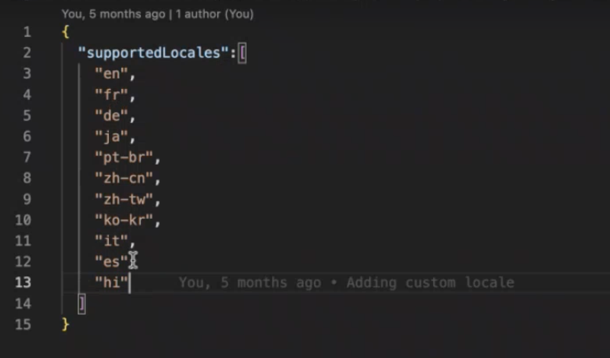

# Añadir una configuración regional para Formularios adaptables basada en componentes principales {#supporting-new-locales-for-adaptive-forms-localization}

| Versión | Vínculo del artículo |
| -------- | ---------------------------- |
| Componentes de base | [Haga clic aquí](supporting-new-language-localization.md) |
| Componentes principales | Este artículo |

<span class="preview"> La función de compatibilidad de idioma de derecha a izquierda está disponible en el programa de primeros usuarios. Puede escribir a aem-forms-ea@adobe.com desde su ID de correo electrónico oficial para unirse al programa de primeros usuarios y solicitar acceso a esta funcionalidad. </span>

AEM Forms admite de forma predeterminada las configuraciones regionales de inglés (en), español (es), francés (fr), italiano (it), alemán (de), japonés (ja), portugués brasileño (pt-BR), chino (zh-CN), chino taiwanés (zh-TW) y coreano (ko-KR). También puede agregar compatibilidad con más configuraciones regionales, como Hindi (hi_IN). También puede presentar formularios adaptables en un idioma de derecha a izquierda (RTL) como árabe, persa y urdu si agrega estas configuraciones regionales.

## ¿Cómo se selecciona la configuración regional para un formulario adaptable?

Antes de empezar a añadir una configuración regional para un formulario adaptable, debe comprender cómo se selecciona una configuración regional para este. Existen dos métodos para identificar y seleccionar la configuración regional de un formulario adaptable cuando se procesa.

* **Uso del `locale`Selector en la dirección URL**: al procesar un formulario adaptable, el sistema identifica la configuración regional solicitada inspeccionando el selector de [configuración regional] en la dirección URL del formulario adaptable. La dirección URL sigue este formato: http:/[AEM Forms Server URL]/content/forms/af/[afName].[locale].html?wcmmode=disabled.  El uso del selector de [configuración regional] permite el almacenamiento en caché del formulario adaptable. Por ejemplo, la dirección URL `www.example.com/content/forms/af/contact-us.hi.html?wcmmmode=disabled` procesa el formulario en el idioma hindi.

* Recupere los parámetros en el orden indicado a continuación:

   * **Uso del `afAcceptLang`parámetro de solicitud**: para anular la configuración regional del explorador del usuario, puede pasar el parámetro de solicitud afAcceptLang. Por ejemplo, la URL `https://'[server]:[port]'/<contextPath>/<formFolder>/<formName>.html?wcmmode=disabled&afAcceptLang=ca-fr` obliga al servidor de AEM Forms a procesar el formulario en la configuración regional de francés canadiense.

   * **Uso de la configuración regional del explorador (encabezado Accept-Language)**: el sistema también tiene en cuenta la configuración regional del explorador del usuario, que se especifica en la solicitud utilizando el encabezado `Accept-Language`.

  Si una biblioteca de cliente (el proceso para crear y utilizar la biblioteca se trata más adelante en este artículo) para la configuración regional solicitada no está disponible, el sistema comprueba si existe una biblioteca de cliente para el código de idioma dentro de la configuración regional. Por ejemplo, si la configuración regional solicitada es `en_ZA` (Inglés sudafricano) y no hay biblioteca de cliente para `en_ZA`, el formulario adaptable utiliza la biblioteca de cliente (en inglés) si está disponible. Si no se encuentra ninguno, el formulario adaptable recurre al diccionario para la configuración regional `en`.

  Una vez identificada la configuración regional, el formulario adaptable elige el diccionario específico del formulario. Si no se encuentra el diccionario de la configuración regional solicitada, el valor predeterminado será utilizar el diccionario del idioma en el que se creó el formulario adaptable.

  En los casos en los que no hay información de configuración regional disponible, el formulario adaptable se muestra en su idioma original, que es el idioma utilizado durante el desarrollo del formulario.


## Requisitos previos {#prerequistes}

Antes de empezar a añadir una configuración regional, haga lo siguiente:

* Instale un editor de texto sin formato (IDE) para facilitar la edición. Los ejemplos de este documento se basan en [Microsoft® Visual Studio Code](https://code.visualstudio.com/download).
* Instale una versión de [Git](https://git-scm.com), si no está disponible en el equipo.
* Clone el repositorio [Componentes principales de Formularios adaptables](https://github.com/adobe/aem-core-forms-components). Para clonar el repositorio, haga lo siguiente:
   1. Abra la línea de comandos o la ventana de terminal y vaya a una ubicación para almacenar el repositorio. Por ejemplo, `/adaptive-forms-core-components`
   1. Ejecute el siguiente comando para clonar el repositorio:

      ```SHELL
          git clone https://github.com/adobe/aem-core-forms-components.git
      ```

  El repositorio incluye una biblioteca de cliente necesaria para agregar una configuración regional.

  Si la ejecución del comando se realiza correctamente, el repositorio se clona en la carpeta `aem-core-forms-components` en el equipo. En el resto del artículo, la carpeta se denomina, [Repositorio de componentes principales de Formularios adaptables].


## Añadir una configuración regional {#add-localization-support-for-non-supported-locales}

Para añadir compatibilidad con una nueva configuración regional, siga estos pasos:


### 1. Clone su repositorio de Git de AEM as a Cloud Service {#clone-the-repository}

1. Abra la línea de comandos y seleccione un directorio para almacenar el repositorio de AEM Forms as a Cloud Service, como `/cloud-service-repository/`.

1. Ejecute el siguiente comando para clonar el repositorio:

   ```SHELL
   git clone https://git.cloudmanager.adobe.com/<my-org>/<my-program>/
   ```

   Reemplazar `<my-org>` y `<my-program>` en la URL anterior con el nombre de su organización y el nombre del programa. Para obtener instrucciones detalladas sobre cómo obtener el nombre de la organización, el nombre del programa o la ruta completa de su repositorio Git y las credenciales necesarias para clonar el repositorio, consulte el artículo [Acceso a Git](https://experienceleague.adobe.com/docs/experience-manager-cloud-service/content/onboarding/journey/developers.html?lang=es#accessing-git).

   Después de completar correctamente el comando, se crea la carpeta `<my-program>`. Contiene el contenido clonado del repositorio de Git. En el resto del artículo, la carpeta se denomina `[AEM Forms as a Cloud Service Git repository]`.


### 2. Añada la nueva configuración regional al Servicio de localización de guías {#add-a-locale-to-the-guide-localization-service}

1. Abra la carpeta del repositorio, clonada en la sección anterior, en un editor de texto sin formato.
1. Navegue hasta la carpeta `[AEM Forms as a Cloud Service Git repository]/ui.config/src/main/content/jcr_root/apps/<appid>/osgiconfig/config`. Puede encontrar el `<appid>` en los archivos `archetype.properties` del proyecto.
1. Abra el archivo `[AEM Forms as a Cloud Service Git repository]/ui.config/src/main/content/jcr_root/apps/<appid>/osgiconfig/config/Guide Localization Service.cfg.json` para editarlo. Si el archivo no existe, créelo. Un archivo de muestra con configuraciones regionales admitidas tiene el siguiente aspecto:

   

1. Añada el [código de configuración regional del idioma](https://en.wikipedia.org/wiki/List_of_ISO_639-1_codes) que desea agregar, por ejemplo, añada “hi” para hindi.
1. Guarde y cierre el archivo.

### 3. Cree una biblioteca de cliente para agregar una configuración regional.

AEM Forms proporciona una biblioteca de cliente de ejemplo para ayudarle a agregar nuevas configuraciones regionales fácilmente. Puede descargar y agregar la `clientlib-it-custom-locale` biblioteca de cliente del [Repositorio de componentes principales de Formularios adaptables] en GitHub a su repositorio as a Cloud Service de Forms. Para añadir la biblioteca de cliente, siga estos pasos:

1. Abra su [Repositorio de componentes principales de Formularios adaptables] en el editor de texto sin formato. Si no ha clonado el repositorio, consulte [Requisitos previos](#prerequistes) para obtener instrucciones para clonar el repositorio.
1. Navegue hasta el directorio `/aem-core-forms-components/it/apps/src/main/content/jcr_root/apps/forms-core-components-it/clientlibs`
1. Copie el directorio `clientlib-it-custom-locale`.
1. Vaya a `[AEM Forms as a Cloud Service Git repository]/ui.apps/src/main/content/jcr_root/apps/moonlightprodprogram/clientlibs` y pegue el directorio `clientlib-it-custom-locale`.


### 4. Cree un archivo específico de la configuración regional {#locale-specific-file}

1. Navegue hasta `[AEM Forms as a Cloud Service Git repository]/ui.apps/src/main/content/jcr_root/apps/<program-id>/clientlibs/clientlib-it-custom-locale/resources/i18n/`
1. Busque el [Archivo .json de la configuración regional en inglés en GitHub](https://github.com/adobe/aem-core-forms-components/blob/master/ui.af.apps/src/main/content/jcr_root/apps/core/fd/af-clientlibs/core-forms-components-runtime-all/resources/i18n/en.json), que contiene el último conjunto de cadenas predeterminadas incluidas en el producto.
1. Cree un archivo .json para la configuración regional específica.
1. En el archivo .json recién creado, refleje la estructura del archivo de configuración regional en inglés.
1. Reemplace las cadenas en inglés del archivo .json por las cadenas localizadas correspondientes para su idioma.
1. Guarde y cierre el archivo.


### 5. Agregar compatibilidad de configuración regional para el diccionario {#add-locale-support-for-the-dictionary}

Realice este paso solo si la configuración regional `<locale>` que está agregando no está entre `en`, `de`, `es`, `fr`, `it`, `pt-br`, `zh-cn`, `zh-tw`, `ja` y `ko-kr`.

1. Navegue hasta la carpeta `[AEM Forms as a Cloud Service Git repository]/ui.content/src/main/content/jcr_root/etc/`. 

1. Cree una carpeta `etc` dentro de la carpeta `jcr_root`, si no está presente.

1. Cree una carpeta `languages` dentro de la carpeta `etc`, si no está presente.

   

1. Cree un archivo `.content.xml` dentro de la carpeta `languages`. Añada el siguiente contenido al archivo:

   ```XML
   <?xml version="1.0" encoding="UTF-8"?>
   <jcr:root xmlns:jcr="http://www.jcp.org/jcr/1.0" xmlns:nt="http://www.jcp.org/jcr/nt/1.0"
   jcr:primaryType="nt:unstructured"
   languages="[de,es,fr,it,pt-br,zh-cn,zh-tw,ja,ko-kr]"/>
   ```

1. Añada el código de configuración regional a la propiedad `languages`. Por ejemplo, hi añadido para hindi al siguiente código de ejemplo.


   ```XML
   <?xml version="1.0" encoding="UTF-8"?>
   <jcr:root xmlns:jcr="http://www.jcp.org/jcr/1.0" xmlns:nt="http://www.jcp.org/jcr/nt/1.0"
   jcr:primaryType="nt:unstructured"
   languages="[de,es,fr,it,pt-br,zh-cn,zh-tw,ja,ko-kr,hi]"/>
   ```

1. Añada las carpetas recién creadas en `filter.xml` dentro de `/ui.content/src/main/content/meta-inf/vault/filter.xml`:

   ```
   <filter root="/etc/languages"/>
   ```

   

### 6. Confirme los cambios e implemente la canalización {#commit-changes-in-repo-deploy-pipeline}

Confirme los cambios en el repositorio de GIT después de agregar la nueva configuración regional. Implemente el código mediante la canalización de pila completa. Aprenda a [configurar una canalización](https://experienceleague.adobe.com/docs/experience-manager-cloud-service/content/onboarding/journey/developers.html?lang=es#setup-pipeline) para añadir compatibilidad con una nueva configuración regional.

Una vez que la ejecución de la canalización se haya realizado correctamente, la configuración regional recién agregada estará lista para su uso.

## Vista previa de un formulario adaptable con la configuración regional recién agregada {#use-added-locale-in-af}

Realice los siguientes pasos para previsualizar un formulario adaptable con la configuración regional recién agregada:

1. Inicie sesión en la instancia as a Cloud Service de AEM Forms.
1. Vaya a **Formularios** > **Formularios y documentos**.
1. Seleccione un formulario adaptable y haga clic en **Agregar diccionario** y aparecerá el asistente **Agregar diccionario al proyecto de traducción**.
1. Especifique el **Título del proyecto** y seleccione los **Idiomas de destino** en el menú desplegable del asistente **Agregar diccionario al proyecto de traducción**.
1. Haga clic en **Listo** y ejecute el proyecto de traducción creado.
1. Seleccione un formulario adaptable y haga clic en **Previsualizar como HTML**.
1. Añada `&afAcceptLang=<locale-name>` en la URL de un formulario adaptable.
1. Actualice la página y el formulario adaptable se procesará en la configuración regional especificada.

## Prácticas recomendadas para la compatibilidad con localización nueva {#best-practices}

* Adobe recomienda crear un proyecto de traducción después de crear un formulario adaptable.

* Cuando se agregan campos nuevos en un formulario adaptable existente:
   * **Para traducción automática**[: vuelva a crear el diccionario y ejecute el proyecto de traducción](/help/forms/using-aem-translation-workflow-to-localize-adaptive-forms-core-components.md). Los campos añadidos a un formulario adaptable después de crear un proyecto de traducción permanecen sin traducir.
   * **Para traducción humana**: exporte el diccionario mediante la IU de `[AEM Forms Server]/libs/cq/i18n/gui/translator.html`. Actualice el diccionario de los campos recién añadidos y cárguelo.

## Más información

* [Generar documento de registro para Formularios adaptables](/help/forms/generate-document-of-record-core-components.md)
* [Agregar un formulario adaptable a una página de AEM Sites o a un fragmento de experiencia](/help/forms/create-or-add-an-adaptive-form-to-aem-sites-page.md)


## Consulte también {#see-also}

{{see-also}}