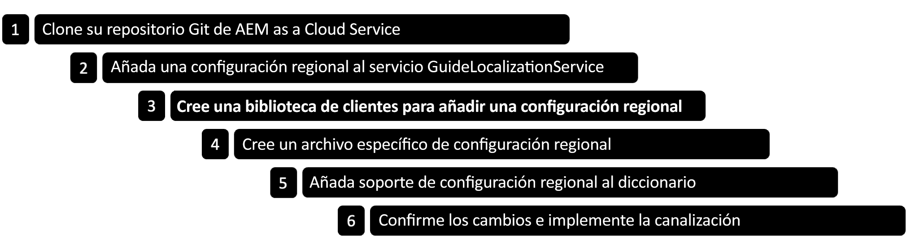

# Añadir una configuración regional para Forms adaptable basada en componentes principales {#supporting-new-locales-for-adaptive-forms-localization}


| Versión | Vínculo del artículo |
| -------- | ---------------------------- |
| Componentes de base | [Haga clic aquí](supporting-new-language-localization.md) |
| Componentes principales | Este artículo |

AEM Forms admite de forma predeterminada las configuraciones regionales de inglés (en), español (es), francés (fr), italiano (it), alemán (de), japonés (ja), portugués brasileño (pt-BR), chino (zh-CN), chino taiwanés (zh-TW) y coreano (ko-KR). También puede agregar compatibilidad con más configuraciones regionales, como Hindi (hi_IN).

## Explicación de los diccionarios de configuración regional {#about-locale-dictionaries}

La localización de formularios adaptables se basa en dos tipos de diccionarios de configuración regional:

* **El diccionario específico del formulario**: contiene cadenas utilizadas en formularios adaptables. Por ejemplo, etiquetas, nombres de campos, mensajes de error y descripciones de ayuda. Se administra como un conjunto de archivos XLIFF para cada configuración regional y puede acceder a él en `[author-instance]/libs/cq/i18n/gui/translator.html`.

* **Los diccionarios globales**: hay dos diccionarios globales, administrados como objetos JSON en la biblioteca de cliente de AEM. Estos diccionarios contienen mensajes de error predeterminados, nombres de mes, símbolos de moneda, patrones de fecha y hora, etc. Puede encontrar estos diccionarios en `[author-instance]/libs/fd/xfaforms/clientlibs/I18N`. Estas ubicaciones contienen carpetas independientes para cada configuración regional. Dado que los diccionarios globales no suelen actualizarse con frecuencia, utilizar archivos JavaScript independientes para cada configuración regional permite a los exploradores almacenarlos en caché y reducir el uso del ancho de banda de red al acceder a diferentes adaptive forms en el mismo servidor.

## Requisitos previos {#prerequistes}

Antes de empezar a añadir compatibilidad con una nueva configuración regional,

* Instale un editor de texto sin formato (IDE) para facilitar la edición. Los ejemplos de este documento se basan en Microsoft VS Code.
* Clone el repositorio de componentes principales de Forms adaptable. Para clonar el repositorio, haga lo siguiente:
   1. Abra la línea de comandos o la ventana de terminal y vaya a una ubicación para almacenar el repositorio. Por ejemplo `/adaptive-forms-core-components`
   1. Ejecute el siguiente comando para clonar el repositorio:

      ```SHELL
          git clone https://github.com/adobe/aem-core-forms-components.git
      ```

  El repositorio incluye una biblioteca de cliente necesaria para agregar una configuración regional.


## Añadir una configuración regional {#add-localization-support-for-non-supported-locales}

AEM Forms admite actualmente la localización del contenido de los formularios adaptables en las configuraciones regionales de inglés (en), español (es), francés (fr), italiano (it), alemán (de), japonés (ja), portugués brasileño (pt-BR), chino (zh-CN), chino taiwanés (zh-TW) y coreano (ko-KR). Para añadir compatibilidad con una nueva configuración regional en el tiempo de ejecución de Forms adaptable, siga estos pasos:



### AEM 1. Clonar el repositorio de Git as a Cloud Service de la {#clone-the-repository}

1. Abra la línea de comandos y seleccione un directorio para almacenar el repositorio, como `/cloud-service-repository/`.

1. Ejecute el siguiente comando para clonar el repositorio:

   ```SHELL
   git clone https://git.cloudmanager.adobe.com/<my-org>/<my-program>/
   ```

   Reemplazar `<my-org>` y `<my-program>` en la URL anterior con el nombre de su organización y el nombre del programa. Para obtener instrucciones detalladas sobre cómo obtener el nombre de la organización, el nombre del programa o la ruta completa de su repositorio Git y las credenciales necesarias para clonar el repositorio, consulte la [Acceso a Git](https://experienceleague.adobe.com/docs/experience-manager-cloud-service/content/onboarding/journey/developers.html?lang=es#accessing-git) artículo.

   Después de completar correctamente el comando, cree una carpeta `<my-program>` se ha creado. Contiene el contenido clonado del repositorio de Git. En el resto del artículo, la carpeta se denomina, `[AEM Forms as a Cloud Service Git repostory]`.


### 2. Añada la nueva configuración regional al servicio de localización de guías {#add-a-locale-to-the-guide-localization-service}

1. Abra la carpeta del repositorio, clonada en la sección anterior, en un editor de texto sin formato.
1. Navegue hasta la carpeta `[AEM Forms as a Cloud Service Git repostory]/ui.config/src/main/content/jcr_root/apps/<appid>/osgiconfig/config`. Puede encontrar el `<appid>` en el `archetype.properties` archivos del proyecto.
1. Abra el archivo `[AEM Forms as a Cloud Service Git repostory]/ui.config/src/main/content/jcr_root/apps/<appid>/osgiconfig/config/Guide Localization Service.cfg.json` para editarlo. Si el archivo no existe, créelo. Un archivo de muestra con configuraciones regionales admitidas tiene el siguiente aspecto:

   

1. Añada el [código de configuración regional del idioma](https://en.wikipedia.org/wiki/List_of_ISO_639-1_codes) desea agregar, por ejemplo, agregue &quot;hi&quot; para hindi.
1. Guarde y cierre el archivo.

### 3. Cree una biblioteca de cliente para agregar una configuración regional.

AEM Forms proporciona una biblioteca de cliente de ejemplo para ayudarle a agregar nuevas configuraciones regionales fácilmente. Puede descargar y agregar `clientlib-it-custom-locale` de la biblioteca de cliente del repositorio de componentes principales de Forms adaptable en GitHub al repositorio as a Cloud Service de Forms. Para añadir la biblioteca de cliente, siga estos pasos:

1. Abra el repositorio de componentes principales de Forms adaptable en el editor de texto sin formato. Si no ha clonado el repositorio, consulte [Requisitos previos](#prerequistes) para obtener instrucciones para clonar el repositorio.
1. Navegue hasta el directorio `/aem-core-forms-components/it/apps/src/main/content/jcr_root/apps/forms-core-components-it/clientlibs`
1. Copie el `clientlib-it-custom-locale` directorio.
1. Vaya a `[AEM Forms as a Cloud Service Git repostory]/ui.apps/src/main/content/jcr_root/apps/moonlightprodprogram/clientlibs` y pegue el `clientlib-it-custom-locale` directorio.


### 4. Cree un archivo específico de la configuración regional {#locale-specific-file}

1. Navegue hasta `[AEM Forms as a Cloud Service Git repostory]/ui.apps/src/main/content/jcr_root/apps/<program-id>/clientlibs/clientlib-it-custom-locale/resources/i18n/`
1. Busque el [Archivo .json de la configuración regional en inglés en GitHub](https://github.com/adobe/aem-core-forms-components/blob/master/ui.af.apps/src/main/content/jcr_root/apps/core/fd/af-clientlibs/core-forms-components-runtime-all/resources/i18n/en.json), que contiene el último conjunto de cadenas predeterminadas incluidas en el producto.
1. Cree un nuevo archivo .json para la configuración regional específica.
1. En el archivo .json recién creado, refleje la estructura del archivo de configuración regional en inglés.
1. Reemplace las cadenas en inglés del archivo .json por las cadenas localizadas correspondientes para su idioma.
1. Guarde y cierre el archivo.


### 4. Agregue compatibilidad con la configuración regional al diccionario {#add-locale-support-for-the-dictionary}

Realice este paso solo si la configuración regional `<locale>` que está agregando no está entre `en`, `de`, `es`, `fr`, `it`, `pt-br`, `zh-cn`, `zh-tw`, `ja` y `ko-kr`.

1. Navegue hasta la carpeta `[AEM Forms as a Cloud Service Git repostory]/ui.content/src/main/content/jcr_root/etc/`. 

1. Crear un `etc` en la carpeta `jcr_root` carpeta, si no está presente.

1. Crear una carpeta `languages` en el `etc` carpeta, si no está presente.

   

1. Crear un `.content.xml` en el archivo `languages` carpeta. Añada el siguiente contenido al archivo:

   ```XML
   <?xml version="1.0" encoding="UTF-8"?>
   <jcr:root xmlns:jcr="http://www.jcp.org/jcr/1.0" xmlns:nt="http://www.jcp.org/jcr/nt/1.0"
   jcr:primaryType="nt:unstructured"
   languages="[de,es,fr,it,pt-br,zh-cn,zh-tw,ja,ko-kr]"/>
   ```

1. Añada el código de configuración regional a `languages` propiedad. Por ejemplo, hola agregó para hindi al siguiente código de ejemplo.


   ```XML
   <?xml version="1.0" encoding="UTF-8"?>
   <jcr:root xmlns:jcr="http://www.jcp.org/jcr/1.0" xmlns:nt="http://www.jcp.org/jcr/nt/1.0"
   jcr:primaryType="nt:unstructured"
   languages="[de,es,fr,it,pt-br,zh-cn,zh-tw,ja,ko-kr,hi]"/>
   ```

1. Añada las carpetas recién creadas en `filter.xml` bajo `/ui.content/src/main/content/meta-inf/vault/filter.xml` como:

   ```
   <filter root="/etc/languages"/>
   ```

   

### 5. Confirme los cambios e implemente la canalización {#commit-changes-in-repo-deploy-pipeline}

Confirme los cambios en el repositorio de Git después de agregar compatibilidad con una nueva configuración regional. Implemente el código mediante la canalización de pila completa. Aprenda a [configurar una canalización](https://experienceleague.adobe.com/docs/experience-manager-cloud-service/content/onboarding/journey/developers.html?lang=es#setup-pipeline) para añadir compatibilidad con una nueva configuración regional.
Una vez finalizada la canalización, la configuración regional recién agregada aparece en el entorno de AEM.

## Uso de una configuración regional añadida en formularios adaptables {#use-added-locale-in-af}

Siga estos pasos para utilizar y procesar un formulario adaptable mediante una configuración regional recién agregada:

1. Inicie sesión en la instancia de autor de AEM.
1. Vaya a **Formularios** > **Formularios y documentos**.
1. Seleccione un formulario adaptable y haga clic en **Agregar diccionario** y aparecerá el asistente **Agregar diccionario al proyecto de traducción**.
1. Especifique el **Título del proyecto** y seleccione los **Idiomas de destino** en el menú desplegable del asistente **Agregar diccionario al proyecto de traducción**.
1. Haga clic en **Listo** y ejecute el proyecto de traducción creado.
1. Seleccione un formulario adaptable y haga clic en **Previsualizar como HTML**.
1. Añada `&afAcceptLang=<locale-name>` en la URL de un formulario adaptable.
1. Actualice la página y el formulario adaptable se procesará en la configuración regional especificada.

Existen dos métodos para identificar la configuración regional de un formulario adaptable. Cuando se procesa un formulario adaptable, este identifica la configuración regional solicitada de las siguientes formas:

* Recuperando el selector `[local]` en la URL del formulario adaptable. El formato de la URL es el siguiente `http://host:[port]/content/forms/af/[afName].[locale].html?wcmmode=disabled`. El uso del selector `[local]` permite almacenar en caché un formulario adaptable.

* Recuperando los siguientes parámetros en el orden indicado:

   * Parámetro de solicitud `afAcceptLang`
Para anular la configuración regional del explorador de los usuarios, puede pasar el `afAcceptLang` para forzar la configuración regional. Por ejemplo, la siguiente URL obliga a procesar el formulario en la configuración regional francés canadiense:
     `https://'[server]:[port]'/<contextPath>/<formFolder>/<formName>.html?wcmmode=disabled&afAcceptLang=ca-fr`

   * La configuración regional del explorador establecida para el usuario, que se especifica en la solicitud utilizando el encabezado `Accept-Language`.

Si no existe una biblioteca de cliente para la configuración regional solicitada, se busca una biblioteca de cliente para el código de idioma presente en la configuración regional. Por ejemplo, si la configuración regional solicitada es `en_ZA` (inglés sudafricano) y la biblioteca de cliente `en_ZA` no existe, el formulario adaptable utiliza la biblioteca de cliente del idioma `en` (inglés), si existe. Sin embargo, si no existe ninguna biblioteca, el formulario adaptable utiliza el diccionario de la configuración regional `en`.


Una vez identificada la configuración regional, el formulario adaptable elige el diccionario específico del formulario. Si no se encuentra el diccionario específico del formulario para la configuración regional solicitada, utiliza el diccionario del idioma en el que se crea el formulario adaptable.

Si no hay información de configuración regional disponible, el formulario adaptable se mostrará en su idioma original, que es el idioma utilizado durante su desarrollo.

Obtenga la [biblioteca de cliente de muestra](/help/forms/assets/locale-support-sample.zip) para agregar compatibilidad con una nueva configuración regional. Debe cambiar el contenido de la carpeta en la configuración regional requerida.

## Prácticas recomendadas para la compatibilidad con localización nueva {#best-practices}

* El Adobe recomienda crear un proyecto de traducción después de crear un formulario adaptable.

* Cuando se agregan campos nuevos en un formulario adaptable existente:
   * **Para traducción automática**: vuelva a crear el diccionario y ejecute el proyecto de traducción. Los campos añadidos a un formulario adaptable después de crear un proyecto de traducción permanecen sin traducir.
   * **Para traducción humana**: exporte el diccionario a través de `[server:port]/libs/cq/i18n/gui/translator.html`. Actualice el diccionario de los campos recién añadidos y cárguelo.
