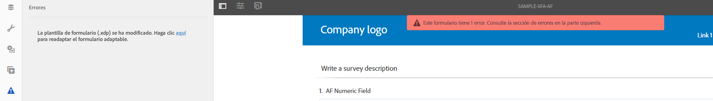
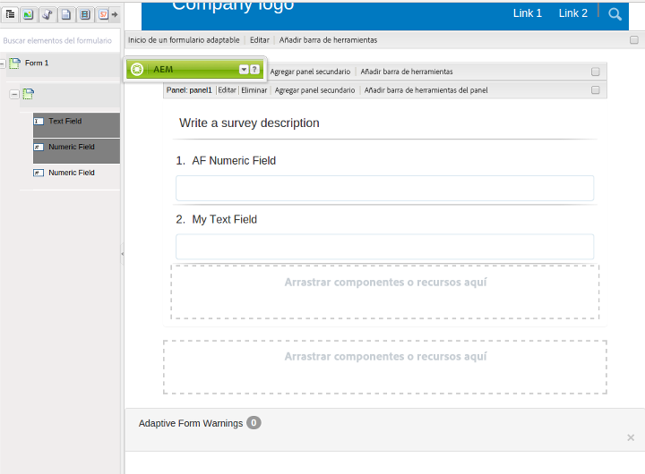
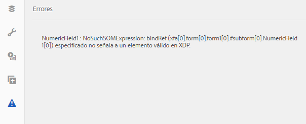

# Sincronizar formularios adaptables con plantillas de formularios XFA{#synchronizing-adaptive-forms-with-xfa-form-templates}

## Introducción {#introduction}

Puede crear un formulario adaptable basado en una plantilla de formulario XFA (archivo `*.XDP`). Esta reutilización le permite conservar su inversión en los formularios XFA existentes. Para obtener información sobre cómo utilizar una plantilla de formulario XFA para crear un formulario adaptable, consulte [Crear un formulario adaptable basado en una plantilla](creating-adaptive-form.md).

Puede reutilizar campos del archivo XDP en su formulario adaptable. Estos campos se denominan campos enlazados. Las propiedades de los campos enlazados (como scripts, etiquetas y formato de visualización) se copian del archivo XDP. También puede optar por anular el valor de algunas de estas propiedades.

[!DNL AEM Forms] ofrece una forma de ayudarle a mantener los campos de los formularios adaptables sincronizados con cualquier cambio que se realice posteriormente en los campos correspondientes del archivo XDP. Este artículo explica cómo puede habilitar esta sincronización.

En el entorno de creación de [!DNL AEM Forms], puede arrastrar campos de un formulario XFA (izquierda) a un formulario adaptable (derecha)

## Requisitos previos {#prerequisites}

Para utilizar la información de este artículo, se recomienda estar familiarizado con las siguientes áreas:

* [Crear un formulario adaptable](creating-adaptive-form.md)

* XFA (arquitectura de formularios en XML)

Para utilizar los recursos que muestra el ejemplo en el artículo, descargue el paquete de muestra como se explica en la siguiente sección: [Paquete de muestra](synchronizing-adaptive-forms-xfa.md#p-sample-package-p).

## Paquete de muestra {#sample-package}

El artículo utiliza un ejemplo para demostrar cómo sincronizar el formulario adaptable con una plantilla de formulario XFA actualizada. Los recursos utilizados en el ejemplo están disponibles en un paquete que se puede descargar de la sección [Descargas](synchronizing-adaptive-forms-xfa.md#p-downloads-p) en este artículo.

Después de cargar el paquete, puede ver estos recursos en la interfaz de usuario de [!DNL AEM Forms].

Instale el paquete utilizando el administrador de paquetes: `https://<server>:<port>/crx/packmgr/index.jsp`

El paquete contiene los siguientes recursos:

1. `sample-form.xdp`: La plantilla de formulario XFA utilizada como ejemplo

1. `sample-xfa-af`: El formulario adaptable basado en el archivo sample-form.xdp. Con todo, este formulario adaptable no incluye ningún campo. En el siguiente paso, añadiremos contenido a este formulario adaptable.

### Añadir contenido al formulario adaptable {#add-content-to-adaptive-form-br}

1. Vaya a https://&lt;server>:&lt;port>/aem/forms.html. Especifique sus credenciales si se le solicita.
1. Abra sample-af-xfa para editarlo en modo de creación.
1. En el explorador de contenido de la barra lateral, seleccione la pestaña Objetos del modelo de datos. Arrastre NumericField1 y TextField1 al formulario adaptable.
1. Cambie el título de NumericField1 de **Numeric Field** a **AF Numeric Field.**

>[!NOTE]
>
>En los pasos anteriores, sobrescribimos una propiedad de un campo en el archivo XDP. Por lo tanto, esta propiedad no se sincroniza si la propiedad correspondiente del archivo XDP se modifica más adelante.

## Detectar cambios en el archivo XDP {#detecting-changes-in-xdp-file}

Siempre que haya algún cambio en un archivo XDP o en un fragmento, la interfaz de usuario de [!DNL AEM Forms] indica todos los formularios adaptables basados en el archivo XDP o en el fragmento.

Después de actualizar un archivo XDP, debe cargarlo de nuevo en la interfaz de usuario de [!DNL AEM Forms] para que se indiquen los cambios.

Por ejemplo, vamos a actualizar el archivo `sample-form.xdp` mediante los siguientes pasos:

1. Vaya a `https://<server>:<port>/projects.html.`. Especifique sus credenciales si se le solicita.
1. Haga clic en la pestaña Formularios de la izquierda.
1. Descargue el archivo `sample-form.xdp` en su equipo local. El archivo XDP se descarga como un archivo `.zip`, que se puede extraer utilizando cualquier utilidad de descompresión de archivos.

1. Abra el archivo `sample-form.xdp` y cambie el título del campo TextField1 de **Campo de texto** a **Mi campo de texto**.

1. Cargue el archivo `sample-form.xdp` de nuevo en la interfaz de usuario de [!DNL AEM Forms].

Si se actualiza un archivo XDP, verá un icono en el editor cuando edite los formularios adaptables basados en el archivo XDP. Este icono indica que el formulario adaptable no está sincronizado con el archivo XDP. En la siguiente imagen, vea el icono que hay junto en la barra lateral.

## Sincronizar formularios adaptables con el archivo XDP más reciente {#synchronizing-adaptive-forms-with-the-latest-xdp-file}

Cuando se abre un formulario adaptable que no está sincronizado con el archivo XDP para la creación la siguiente vez, se muestra el mensaje: **Se ha actualizado la plantilla del esquema/formulario del formulario adaptable. `Click Here` para volver a basarlo con la nueva versión.**

Al hacer clic en el mensaje, se sincronizan los campos del formulario adaptable con los campos correspondientes del archivo XDP.

Para el ejemplo utilizado en este artículo, abra `sample-xfa-af` en el modo de creación. El mensaje se muestra en la parte inferior del formulario adaptable.

### Actualizar las propiedades {#updating-the-properties}

Todas las propiedades que se copiaron del archivo XDP al formulario adaptable se actualizan, a excepción de las propiedades que el autor anuló explícitamente en el formulario adaptable (del cuadro de diálogo Componentes). La lista de propiedades que se han actualizado está disponible en los registros del servidor.

Para actualizar las propiedades en el formulario adaptable de ejemplo, haga clic en el enlace (con la etiqueta `"Click Here"`) en el mensaje. El título de TextField1 cambia de **Campo de texto** a **Mi campo de texto**.

>[!NOTE]
>
>La etiqueta AF Numeric Field no se ha modificado porque ha anulado esta propiedad del cuadro de diálogo de propiedades del componente, tal como se describe en [Añadir contenido al formulario adaptable](synchronizing-adaptive-forms-xfa.md#p-add-content-to-adaptive-form-br-p).

### Añadir nuevos campos del archivo XDP al formulario adaptable {#adding-new-fields-from-xdp-file-to-adaptive-form-nbsp}

Todos los campos que se añadan posteriormente al archivo XDP original aparecen en la pestaña Jerarquía del formulario y puede arrastrar los nuevos campos al formulario adaptable.

No es necesario hacer clic en el enlace del mensaje de error para actualizar los campos en la pestaña Jerarquía del formulario.

### Campos eliminados en el archivo XDP {#deleted-fields-in-xdp-file}

Si un campo que se copió anteriormente en un formulario adaptable se elimina de un archivo XDP, se muestra un mensaje de error en el modo de creación que indica que el campo no existe en el archivo XDP. En estos casos, elimine manualmente el campo del formulario adaptable o borre la propiedad `bindRef` en el cuadro de diálogo del componente.

Los siguientes pasos ilustran este flujo de uso para los recursos en el ejemplo utilizado en este artículo:

1. Actualice el archivo `sample-form.xdp` y elimine NumericField1.
1. Cargue el archivo `sample-form.xdp` en la interfaz de usuario de [!DNL AEM Forms].
1. Abra el formulario adaptable `sample-xfa-af` para la creación. Se muestra el siguiente mensaje de error: Se ha actualizado la plantilla del esquema/formulario del formulario adaptable. `Click Here` para volver a basarlo con la nueva versión.

1. Haga clic en el enlace (con la etiqueta “`Click Here`”) en el mensaje. Se muestra un mensaje de error indicando que el campo ya no existe en el archivo XDP.

El campo que se ha eliminado también se marca con un icono para indicar un error en el campo.

>[!NOTE]
>
>Los campos del formulario adaptable que tienen un enlace incorrecto (un valor `bindRef` no válido en el cuadro de diálogo de edición) también se consideran campos eliminados. Si el autor no corrige estos errores y publica el formulario adaptable, el campo se trata como un campo de formulario adaptable no enlazado normal y se incluye en la sección Sin enlazar del archivo XML de salida.

## Descargas {#downloads}

Paquete de contenido para el ejemplo en este artículo

[Obtener archivo](assets/sample-xfa-af-sync-1.0.zip)
