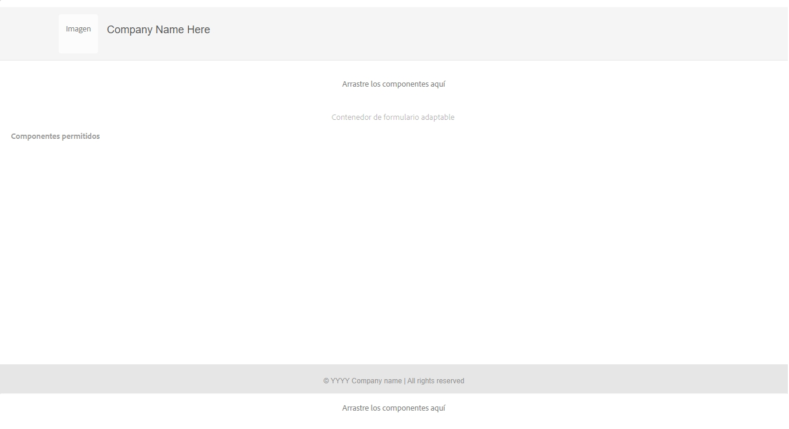

# Creación de una plantilla de formulario adaptable basado en componentes principales {#adaptive-form-templates}

Al crear un formulario, se agregan campos y componentes para definir la estructura del formulario, el contenido y las acciones en el editor. Los campos y componentes se agregan en el `guideRootPanel` del contenedor de formulario. Con el Editor de plantillas, puede crear una plantilla que contenga una estructura básica y contenido inicial que los autores puedan utilizar para crear formularios.

Por ejemplo, desea que todos los autores de formularios tengan ciertos cuadros de texto, botones de navegación y un botón de envío en un formulario de inscripción. Puede crear una plantilla con los componentes que los autores pueden utilizar para crear un formulario coherente con otros formularios de inscripción. Cuando los autores utilizan la plantilla para crear un formulario adaptable, el nuevo formulario hereda la estructura y los componentes que se han especificado en la plantilla. El Editor de plantillas le permite lo siguiente:

* Agregar componentes de encabezado y pie de página de un formulario en la capa de estructura.
* Proporcionar el contenido inicial para el formulario.
* Especificar un tema, Enviar acciones.

<!--
You can download and install [!DNL AEM Forms] reference content package from [Software Distribution](https://experience.adobe.com/#/downloads/content/software-distribution/en/aemcloud.html) portal to import reference themes and templates to your environment.
-->

## Requisito previo

**Habilitar los componentes principales de formularios adaptables para su entorno**: al crear un programa, los componentes principales de formularios adaptables ya están habilitados para su entorno. Instale la última versión para habilitar los componentes principales de formularios adaptables para su entorno de AEM Cloud Service.

>[!NOTE]
>
> Al implementar el entorno Forms as a Cloud Service basado en Archetype 45, las plantillas **Formularios adaptables (componente principal)** y las temáticas basadas en componentes principales se añaden al entorno.

## Trabajo con plantillas {#working-with-templates}

Puede acceder al editor de plantillas desde el menú Herramientas si navega hasta **[!UICONTROL Adobe Experience Manager]** > **[!UICONTROL Herramientas]** > **[!UICONTROL General]** > **[!UICONTROL Plantillas]**. En este caso, las plantillas están organizadas en carpetas habilitadas para plantillas editables.

>[!NOTE]
>
> Puede encontrar las plantillas editables basadas en componentes principales en carpetas específicas de dichos componentes principales.

Experience Manager proporciona una carpeta global para organizar las plantillas. Sin embargo, no está habilitada de forma predeterminada. Puede solicitar al administrador que habilite la carpeta global o que cree una carpeta para plantillas. Para obtener más información sobre cómo crear carpetas, consulte [Carpetas para plantillas](https://experienceleague.adobe.com/docs/experience-manager-cloud-service/sites/authoring/features/templates.html?lang=es#editing-templates-template-authors).

## Crear una plantilla {#create-template}

Después de crear una carpeta, ábrala y haga lo siguiente para crear una plantilla:

1. Seleccione **[!UICONTROL Crear]** dentro de la carpeta que ha creado.
1. En la sección **[!UICONTROL Elegir tipo de plantilla]**, seleccione **[!UICONTROL Plantilla de formulario adaptable (componente principal)]** y seleccione **[!UICONTROL Siguiente]**.

1. En la sección **[!UICONTROL Detalles de la plantilla]**, escriba un **Título de plantilla** y seleccione **[!UICONTROL Crear]**. 
También puede proporcionar una descripción.

1. Seleccione **[!UICONTROL Listo]** para volver a la consola o seleccione **[!UICONTROL Abrir]** para abrir la plantilla en el editor.

## IU del editor de plantillas {#template-editor-ui}

Cuando abra una plantilla para editarla, verá los siguientes componentes del editor de AEM:

* **Barra de herramientas de la página**
Contiene las siguientes opciones:

   * **Alternar panel lateral**: Permite mostrar u ocultar la barra lateral.
   * **Información de la página**: Permite especificar información, como la hora de publicación/cancelación de la publicación, las miniaturas, las bibliotecas del lado del cliente, la directiva de página y la biblioteca de diseños de páginas del lado del cliente.
     <!-- * **Emulator**: Lets you simulate and customize the look for different devices.-->
   * **Selector de modo:** permite cambiar el modo. Puede elegir el modo **[!UICONTROL Estructura]**, **[!UICONTROL Contenido inicial]**, **[!UICONTROL Control de diseño]** en el menú contextual. El modo Estructura permite agregar y personalizar el encabezado y el pie de página. El modo de Contenido inicial permite personalizar el contenido del formulario.
   * **Vista previa:** Permite obtener una vista previa del aspecto de la plantilla al publicarla. Puede utilizar el Selector de capa y la Vista previa para alternar los modos de edición y vista previa.
* **Barra lateral:** Proporciona los exploradores de Contenido, Propiedades, Recursos y Componentes.
* **Barra de herramientas de componentes:** Al seleccionar un componente, aparecerá una barra de herramientas que le permite personalizarlo.
* **Página**: Área donde se agrega contenido para crear la plantilla.

<!-- See [Introduction to authoring Adaptive Forms](introduction-forms-authoring.md) to understand the Touch UI editor. -->

## Editar una plantilla {#editing-a-template}

Los diferentes modos para seleccionar y editar el aspecto adecuado de la plantilla son los siguientes:

* [Estructura](#structure)
* [Contenido inicial](#initial-content)
* [Diseño](#layout)

El selector de capas está disponible junto a la opción Vista previa en la esquina superior derecha de la pantalla.

### Estructura {#structure}

Al seleccionar la capa de estructura en el editor de plantillas, éste le ayuda a predefinir el contenido que no se puede cambiar cuando se crean formularios adaptables asociados a la plantilla.

<!-- you can see the layout containers above and below the Adaptive Form Container. Authors can use these layout containers for header and footer. -->

<!--

**A. Layout container for Header component**
Drag-drop the Adaptive Form Header component in the layout container above the Adaptive Form Container. After you add the component, you can specify its properties that let you add a logo and provide its title.
**B. Adaptive Form Container component**
Drag-drop the Adaptive Form components in the Adaptive Form Container. You can specify the design and arrangement of fields and components in the template editor. After you add the components, you can specify its properties.
**C. Layout container for Footer component**
Similarly, when you drag-drop the footer component in the layout container below the Adaptive Form Container, you can provide the copyright information and company details. 
You can add, edit, or customize the header and footer. Drag-drop the Adaptive Form Header and Footer component to customize the template. Drag-drop the Adaptive Form components in the Adaptive Form Container. You can specify the design and arrangement of fields and components in the template editor. 

Header and footer are added in the Initial Content layer.
-->

#### Bloquear/desbloquear componentes en la capa de estructura {#locking-unlocking-components-in-the-structure-layer}

Cuando edita la plantilla con la capa de estructura seleccionada, puede desbloquear el encabezado y el pie de página de la plantilla. Si un componente está desbloqueado en la plantilla, los autores de formularios pueden editarlo en el formulario adaptable que utiliza la plantilla. Bloquear un componente impide que los autores de formularios lo editen en el formulario adaptable. La opción Bloquear está disponible en la barra de herramientas de componentes.

Por ejemplo, puede agregar el componente Encabezado en la plantilla. Al seleccionar el componente, podrá ver la opción de bloqueo en la barra de herramientas de componentes. Normalmente, el encabezado incluye el nombre de la compañía y el logotipo, y no se desea que los autores de formularios cambien el logotipo y el encabezado de una plantilla. En un formulario adaptable creado con la plantilla con el componente de encabezado bloqueado, los autores de formularios no pueden cambiar el logotipo ni el nombre de la empresa.

>[!NOTE]
>
>No se recomienda bloquear o desbloquear la imagen o el logotipo en el componente del encabezado de forma individual. Puede desbloquear el componente del encabezado.

### Contenido inicial {#initial-content}

Cuando se selecciona la opción Contenido inicial, el contenedor de formulario adaptable de la plantilla se abrirá como un formulario adaptable para su edición. Le permite crear contenido predefinido que se puede cambiar cuando se crean formularios adaptables asociados a la plantilla. Al igual que la creación de un formulario adaptable, puede especificar la configuración inicial, como seleccionar un tema y enviar acciones.

Los autores de formularios lo utilizan como base para crear un formulario. La estructura del flujo de contenido se especifica en la capa Contenido inicial de la plantilla. Para cambiar a la edición del contenido inicial de la plantilla de formulario, antes de Vista previa en la barra de herramientas de la página, seleccione  **>** **[!UICONTROL Contenido inicial]**.

En la capa Contenido inicial, se creará la plantilla Formulario adaptable que los autores utilizan como base. La creación de una plantilla es similar a la de un formulario, se utilizan las opciones disponibles en la barra lateral. La barra lateral proporciona exploradores de contenido, propiedades, activos y componentes.

<!-- See [Sidebar](introduction-forms-authoring.md#sidebar). -->

>[!NOTE]
>
>Cuando selecciona Almacenar contenido o Almacenar PDF como Acción de envío, obtiene una opción para especificar la ruta de almacenamiento. Si especifica la ruta en la plantilla, todos los formularios creados a partir de ella tendrán la misma ruta. Puede especificar la ruta de almacenamiento correcta o asegurarse de que los autores de los formularios lo actualicen para evitar que los datos de todos los formularios se almacenen en la misma ubicación.

### Diseño {#layout}

Al editar una plantilla, puede definir el diseño, que utiliza un diseño adaptable estándar. El diseño ayuda a administrar la anchura de un componente en función de la anchura del dispositivo para facilitar un diseño de formulario adaptable.

Consulte el artículo de [descripción del diseño adaptable](https://experienceleague.adobe.com/docs/experience-manager-learn/sites/page-authoring/responsive-layout-feature-video-understand.html?lang=es) para obtener más información.

## Habilitar la plantilla {#enabling-the-template}

Al crear una plantilla, esta se agrega como borrador. Habilite la plantilla para utilizarla para crear formularios adaptables. Para habilitar una plantilla, haga lo siguiente:

1. Vaya a **[!UICONTROL Adobe Experience Manager]** > **[!UICONTROL Herramientas]** > **[!UICONTROL Plantillas]** y abra la carpeta en la que ha creado la plantilla.
La plantilla que ha creado se marcará como borrador.
1. Seleccione la plantilla y seleccione **[!UICONTROL Habilitar]** en la barra de herramientas. 
Cuando cree un formulario adaptable, podrá ver la plantilla en la lista cuando se le pida que elija una plantilla.

## Importar o exportar una plantilla {#importing-or-exporting-a-template}

Un formulario funciona con su plantilla. Cuando se descarga un formulario adaptable creado con una plantilla personalizada, la plantilla no se descarga. Al importar el formulario en una instancia de [!DNL AEM Forms] diferente, se importará sin su plantilla. Si se importa un formulario pero su plantilla no está disponible, el formulario no se procesará. Puede empaquetar la plantilla personalizada desde el nodo `/conf` en `https://<server>:<port>/crx/packmgr`y portarlo en la instancia [!DNL AEM Forms] en la que desea cargar el formulario. También puede [Crear una plantilla con AEM Archetype e implementarla en su instancia de Cloud Services](https://experienceleague.adobe.com/docs/experience-manager-learn/getting-started-wknd-tutorial-develop/pages-templates.html?lang=es#prerequisites).

>[!NOTE]
>
> * También puede configurar la plantilla [!UICONTROL Documento de registro] directamente desde el editor de formularios adaptables o desde el editor de plantillas de formulario adaptable. Para obtener más información, consulte [Generación de documento de registro para formularios adaptables](/help/forms/generate-document-of-record-for-non-xfa-based-adaptive-forms.md#document-of-record-support-in-adaptive-form-editor-dor-support-in-adaptiveform).

## Asociación de un esquema del modelo de datos de formulario a una plantilla {#associating-form-data-model-schema-in-template}

Los autores pueden asociar un [!UICONTROL Esquema de modelo de datos de formulario] a una plantilla de formulario adaptable en un editor de plantillas. Permite a los autores seleccionar un esquema del editor de plantillas. Cuando asocia un esquema a una plantilla y un autor de formularios crea un formulario basado en ella, el esquema se preselecciona para el formulario. Ayuda a los autores de formularios a regular el uso del esquema y también les ahorra tiempo. Para seleccionar un esquema del modelo de datos de formulario en el editor de plantillas, haga lo siguiente:

1. Seleccione **[!UICONTROL Explorador de contenido]**, situado en el lado izquierdo.
1. Vaya a la **[!UICONTROL Configuración]** del contenedor del formulario.
1. Seleccione **[!UICONTROL Modelo de datos]**.
1. Elija el modelo de datos de formulario mediante **[!UICONTROL Seleccionar modelo de datos de formulario]** y guarde la configuración.

<!--

## Creating an Adaptive Form template with tabs and panels {#creating-an-adaptive-form-template-with-tabs-and-panels-nbs}

For example, you want to create a template with the following tabs:

* General Information
* Professional Information

You have added a logo, provided a title, and added a footer in the structure layer. Lock the header and footer to stop form authors from editing them when they use the template to create forms.

Change the layer from **Structure** to **Initial Content**, and start adding content to the form. To create a tabbed structure, add a child Panel in the guideRootPanel of the Adaptive Form container. To add a panel:

* You can add a panel by tapping the **[!UICONTROL +]** button when you select the **[!UICONTROL Drag components here]** option.

* You can drag-drop the panel component from the components browser in the sidebar.
* You can add child panel of the `guideRootPanel` from the component toolbar.

To create the General Information and Professional Information tabs, add two panels in the child panel of the `guideRootPanel`. Select the panels and select  to open the properties in the sidebar. Change the element names as `general-info` and `professional-info`, and titles as General Information and Professional Information respectively. In the sidebar, select content to open the content browser. In the Form Objects tab, select `guideRootPanel`. In the editor, the guideRootPanel is selected. Select  in the component toolbar to open its properties. In the Panel Layout field, select **[!UICONTROL Tabs on Top]** and select **[!UICONTROL Done]**. The tabbed template structure is applied.

### Adding content in tabs {#adding-content-in-tabs}

After you add panels and structure them as tabs, you can add fields inside the tabs. When you select a tab in the editor, you can see the **[!UICONTROL Drag components here]** option. You can drag-drop components such as text-boxes, list items, and buttons. You can drag-drop components from the components browser in the sidebar.

Each component has properties that enhance data capturing and manipulation. For example, you can enable the **[!UICONTROL Required field]** property of a component. Your authors can specify a message that your customers see when they skip filling a required field. Specify the message in **[!UICONTROL Required Field Message]** property.

In the example template, Name, Phone number, and Date of birth fields are added in the General Information tab. In the Professional Information tab, Currently employed, employment type, Educational qualification fields are added.

After you have added fields, you can add buttons such as Submit and Reset.
-->

### Adición de propiedades personalizadas a componentes de formulario adaptable mediante una política de plantillas

Las propiedades personalizadas le permiten asociar atributos personalizados (pares clave-valor) a un componente principal del formulario adaptable mediante la plantilla de un formulario. Las propiedades personalizadas se reflejan en la sección de **[!UICONTROL propiedades]** de la representación sin encabezado del componente. Permite crear un comportamiento de formulario dinámico que se adapta en función de los valores de atributos personalizados. Por ejemplo, los desarrolladores pueden diseñar varias representaciones de un componente Forms sin encabezado para plataformas móviles, de escritorio o web, lo que mejora significativamente la experiencia del usuario en una amplia gama de dispositivos.

Los pasos para añadir propiedades personalizadas a los campos del componente principal del formulario adaptable son los siguientes:

1. [Añada un nombre de grupo personalizado en la política de un editor de plantillas](#add-a-custom-group-name)
1. [Seleccione un nombre de grupo personalizado en el cuadro de diálogo de edición del componente de un formulario adaptable](#select-a-custom-group-name)

#### Añadir un nombre de grupo personalizado en la política del editor de plantillas {#add-a-custom-group-name}

1. Vaya a **[!UICONTROL Adobe Experience Manager]** > **[!UICONTROL Herramientas]** > **[!UICONTROL General]** > **[!UICONTROL Plantillas]**.
1. Seleccione la plantilla basada en Componentes principales y ábrala en un modo de edición.
1. Haga clic en el icono de **[!UICONTROL Política]** de un campo del componente principal del formulario adaptable en el que deben definirse las propiedades personalizadas. Aparece el cuadro de diálogo **[!UICONTROL Campo de formulario adaptable]**.
1. Seleccione la pestaña **[!UICONTROL Propiedades personalizadas]**.
1. Especifique el **[!UICONTROL Título de política]** en la sección **[!UICONTROL Política]**.
1. Especifique el **[!UICONTROL Nombre de grupo]** y añada un par clave-valor asociado a un grupo específico. El nombre del grupo es visible para los autores de formularios en el cuadro de diálogo de edición de un componente. Si selecciona el nombre del grupo, cada par clave-valor asociado es aplicable a un componente.
1. Haga clic en **[Listo]**.

Cuando añade al menos un grupo de propiedades personalizadas mediante la política de la plantilla, la pestaña **[!UICONTROL Avanzadas]** se vuelve visible en el cuadro de diálogo Editar de un componente principal correspondiente.

#### Seleccione un nombre de grupo personalizado en el cuadro de diálogo de edición de un componente principal {#select-a-custom-group-name}

1. Abra un formulario adaptable en modo de edición.
1. Seleccione el componente para el que se han definido las propiedades personalizadas en el editor de plantillas y seleccione  para abrir el cuadro de diálogo de edición del componente.
1. Seleccione la pestaña **[!UICONTROL Avanzadas]**.
1. Seleccione el nombre del grupo de propiedades personalizadas en la lista desplegable **[!UICONTROL Selección de propiedad personalizada]**. Todos los nombres de grupo personalizados definidos se rellenan automáticamente en la lista desplegable.
1. Seleccione **[!UICONTROL Listo]** para guardar las propiedades.

>[!NOTE]
>
> * La casilla de verificación **[!UICONTROL Propiedades personalizadas adicionales]** permite añadir dinámicamente propiedades personalizadas específicas del componente además de las proporcionadas en la política de la plantilla. La propiedad personalizada del componente específico tiene prioridad sobre la propiedad personalizada establecida en la política de la plantilla cuando coinciden los valores del nombre de clave.

## Crear un formulario adaptable con la plantilla {#creating-an-adaptive-form-using-the-template}

Después de crear y habilitar una plantilla, esta estará disponible en el administrador de formularios al crear un formulario adaptable. Para utilizar una plantilla y crear un formulario adaptable, consulte [Creación de un formulario adaptable basado en componentes principales](/help/forms/creating-adaptive-form-core-components.md).
<!--
## Change display option of out of the box templates  {#change-display-option-of-out-of-the-box-templates}

You can create custom templates for Adaptive Forms to define basic structure and initial content. [!DNL AEM Forms] also provides a set of out of the box template for Adaptive Forms. You can choose to show or hide the templates.

Perform the following steps to show and hide templates:

1. Log in to [!DNL AEM Forms] author instance and navigate to **[!UICONTROL Tools]** &gt; **[!UICONTROL Operations]** &gt; **[!UICONTROL Web Console]**.

   >[!NOTE]
   >
   >The URL of AEM web console is https://'[server]:[port]'/system/console/configMgr

1. Locate and open the **FormsManager Configuration** settings:

    * To show or hide out of the box Adaptive Forms template, check or uncheck the **Include Out of the box AF and AD Templates** option.
    * To show or hide out of the box Adaptive Form templates that were added in AEM 6.0 Forms or AEM 6.1 Forms releases but are now deprecated, check or uncheck the **Include AEM 6.0 AF Templates** option. If this option is checked, and you want it to take effect, it requires the **Include Out of the box AF and AD Templates** configuration to be enabled.

1. Click **Save**. The display options for the out of the box templates are changed. 

## Save an Adaptive Form as a template {#saving-adaptive-form-as-template}

You can also save an Adaptive Form as a template for future use. To save a Adaptive Form as a template:

1. Select an Adaptive Form to save it as a template.
1. Click **[!UICONTROL Save as Template]**. A dialog box appears.
1. Specify **[!UICONTROL Title]** (mandatory field), **[!UICONTROL Location]** (mandatory field) and **[!UICONTROL Description]** (optional field) for the template. 
1. Click **[!UICONTROL Create]**.

   

>[!NOTE]
>
>To use the same container policy as of the source Adaptive Form, it is recommended to save the template in the same folder as of the source Adaptive Form. In case, the template is saved in any other folder, than the created template uses a default container policy.
-->

## Prácticas recomendadas {#best-practices}

* Cree plantillas utilizando los componentes basados en componentes principales, por ejemplo, texto de formulario adaptable, contenedor de formulario adaptable, etc. Para obtener información sobre los componentes principales de formularios adaptables, [haga clic aquí](https://experienceleague.adobe.com/docs/experience-manager-core-components/using/adaptive-forms/introduction.html?lang=es).
* Limite el número de plantillas para que coincidan con los tipos de formulario fundamentalmente diferentes disponibles en los sitios web
* Proporcione la flexibilidad y las funcionalidades de configuración necesarias a los componentes personalizados utilizados en una plantilla.

<!--
## See next

* [Create style or themes for your forms](using-themes-in-core-components.md)
* [Create an Adaptive Form (core components)](/help/forms/creating-adaptive-form-core-components.md)

-->

## Ver también {#see-also}

{{see-also}}
* [Creación de estilos o temáticas para los formularios](using-themes-in-core-components.md)
* [Creación de un formulario adaptable (componentes principales)](/help/forms/creating-adaptive-form-core-components.md)

