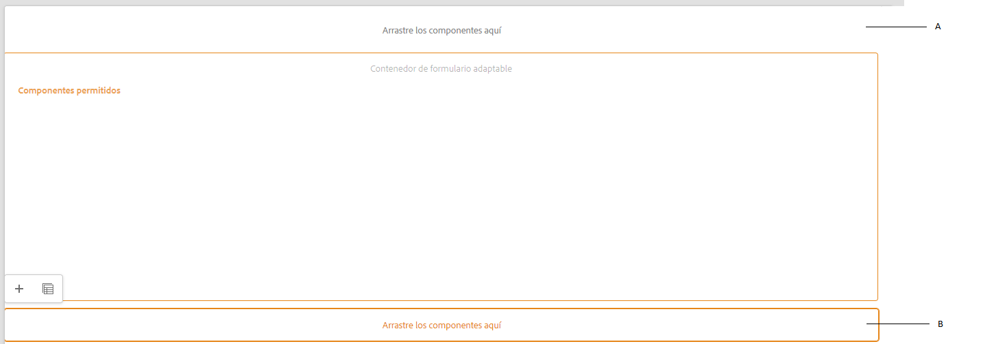

# Crear una plantilla de formulario adaptable {#adaptive-form-templates}

>[!NOTE]
>
> Adobe recomienda utilizar la captura de datos moderna y ampliable [Componentes principales](https://experienceleague.adobe.com/docs/experience-manager-core-components/using/adaptive-forms/introduction.html?lang=es) para [crear nuevos formularios adaptables](/help/forms/creating-adaptive-form-core-components.md) o [adición de formularios adaptables a páginas de AEM Sites](/help/forms/create-or-add-an-adaptive-form-to-aem-sites-page.md). Estos componentes representan un avance significativo en la creación de formularios adaptables, lo que garantiza experiencias de usuario impresionantes. Este artículo describe un enfoque más antiguo para crear formularios adaptables con componentes de base.

| Versión | Vínculo del artículo |
| -------- | ---------------------------- |
| AEM 6.5 | [Haga clic aquí](https://experienceleague.adobe.com/docs/experience-manager-65/forms/adaptive-forms-advanced-authoring/template-editor.html?lang=es) |
| AEM as a Cloud Service | Este artículo |

Al crear un formulario, se agregan campos y componentes para definir la estructura del formulario, el contenido y las acciones en el editor. Los campos y componentes se agregan en el `guideRootPanel` del contenedor de formulario. Con el Editor de plantillas, puede crear una plantilla que contenga una estructura básica y contenido inicial que los autores puedan utilizar para crear formularios.

Por ejemplo, desea que todos los autores de formularios tengan ciertos cuadros de texto, botones de navegación y un botón de envío en un formulario de inscripción. Puede crear una plantilla con los componentes que los autores pueden utilizar para crear un formulario coherente con otros formularios de inscripción. Cuando los autores utilizan la plantilla para crear un formulario adaptable, el nuevo formulario heredará la estructura y los componentes especificados en la plantilla. El Editor de plantillas le permite lo siguiente:

* Agregar componentes de encabezado y pie de página de un formulario en la capa de estructura.
* Proporcionar el contenido inicial para el formulario.
* Especificar un tema, Enviar acciones.

Puede descargar e instalar el paquete de contenido de referencia de [!DNL AEM Forms] en el portal [Distribución de software](https://experience.adobe.com/#/downloads/content/software-distribution/es-es/aemcloud.html) para importar temáticas de referencia y plantillas para su entorno.

## Trabajar con plantillas {#working-with-templates}

Puede acceder al editor de plantillas desde el menú Herramientas si navega hasta **[!UICONTROL Adobe Experience Manager]** > **[!UICONTROL Herramientas]** > **[!UICONTROL General]** > **[!UICONTROL Plantillas]**. En este caso, las plantillas están organizadas en carpetas habilitadas para plantillas editables.

Experience Manager proporciona una carpeta global para organizar las plantillas. Sin embargo, no está habilitada de forma predeterminada. Puede solicitar al administrador que habilite la carpeta global o que cree una carpeta para plantillas. Para obtener más información sobre cómo crear carpetas, consulte [Carpetas para plantillas](https://experienceleague.adobe.com/docs/experience-manager-cloud-service/sites/authoring/features/templates.html?lang=es#editing-templates-template-authors).

### Crear una plantilla {#create-template}

Después de crear una carpeta, ábrala y haga lo siguiente para crear una plantilla:

1. Seleccione **[!UICONTROL Crear]** dentro de la carpeta que ha creado.
1. En la sección Elegir tipo de plantilla, seleccione **[!UICONTROL Plantilla de formulario adaptable]** y seleccione **[!UICONTROL Siguiente]**.

1. En la sección Detalles de la plantilla, escriba un Título de plantilla y seleccione **[!UICONTROL Crear]**. 
También puede proporcionar una descripción.

1. Seleccione **[!UICONTROL Listo]** para volver a la consola o seleccione **[!UICONTROL Abrir]** para abrir la plantilla en el editor.

### IU del editor de plantillas {#template-editor-ui}

Cuando abra una plantilla para editarla, verá los siguientes componentes del editor de AEM:

* **Barra de herramientas de la página**
Contiene las siguientes opciones:

   * **Alternar panel lateral**: Permite mostrar u ocultar la barra lateral.
   * **Información de la página**: Permite especificar información, como la hora de publicación/cancelación de la publicación, las miniaturas, las bibliotecas del lado del cliente, la directiva de página y la biblioteca de diseños de páginas del lado del cliente.
     <!-- * **Emulator**: Lets you simulate and customize the look for different devices.-->
   * **Selector de modo:** permite cambiar el modo. Puede elegir el modo **[!UICONTROL Estructura]**, **[!UICONTROL Contenido inicial]** o **[!UICONTROL Control de diseño]**. El modo Estructura permite agregar y personalizar el encabezado y el pie de página. El modo de Contenido inicial permite personalizar el contenido del formulario.
   * **Vista previa:** Permite obtener una vista previa del aspecto de la plantilla al publicarla. Puede utilizar el Selector de capa y la Vista previa para alternar los modos de edición y vista previa.
* **Barra lateral:** Proporciona los exploradores de Contenido, Propiedades, Recursos y Componentes.
* **Barra de herramientas de componentes:** Al seleccionar un componente, aparecerá una barra de herramientas que le permite personalizarlo.
* **Página**: Área donde se agrega contenido para crear la plantilla.

<!-- See [Introduction to authoring Adaptive Forms](introduction-forms-authoring.md) to understand the Touch UI editor. -->

### Editar una plantilla {#editing-a-template}

Se crea una plantilla de formulario adaptable con dos capas:

* Estructura
* Contenido inicial

El selector de capas está disponible junto a la opción Vista previa en la esquina superior derecha de la pantalla.

### Estructura {#structure}

Al seleccionar la capa de estructura en el Editor de plantillas, puede ver los contenedores de diseño encima y debajo del contenedor del formulario adaptable. Los autores pueden utilizar estos contenedores de diseño para el encabezado y el pie de página. Puede agregar, editar o personalizar el encabezado y el pie de página. Arrastre y suelte el componente Encabezado de formulario adaptable en el contenedor de diseño sobre el contenedor de formulario adaptable para personalizar el encabezado de la plantilla. Arrastre y suelte el componente Pie de página del formulario adaptable en el contenedor de diseño debajo del contenedor del formulario adaptable para personalizar el pie de página de la plantilla.

Contenedores de diseño en la capa de estructura

**A.** Contenedor de diseño para el componente Encabezado **B.** Contenedor de diseño para el componente Pie de página

Arrastre y suelte el componente Encabezado del formulario adaptable en el contenedor de diseño situado encima del contenedor de formulario adaptable. Después de agregar el componente, puede especificar sus propiedades que le permitirán agregar un logotipo y proporcionar su título.

Del mismo modo, cuando arrastra y suelta el componente Pie de página en el contenedor de diseño debajo del contenedor de formulario adaptable, puede proporcionar la información de copyright y los detalles de la empresa.

Encabezado y pie de página agregados en la capa Estructura

#### Bloquear/desbloquear componentes en la capa de estructura {#locking-unlocking-components-in-the-structure-layer}

Cuando edita la plantilla con la capa de estructura seleccionada, puede desbloquear el encabezado y el pie de página de la plantilla. Si un componente está desbloqueado en la plantilla, los autores de formularios pueden editarlo en el formulario adaptable que utiliza la plantilla. Bloquear un componente impide que los autores de formularios lo editen en el formulario adaptable. La opción Bloquear está disponible en la barra de herramientas de componentes.

Por ejemplo, puede agregar el componente Encabezado en la plantilla. Al seleccionar el componente, podrá ver la opción de bloqueo en la barra de herramientas de componentes. Normalmente, el encabezado incluye el nombre de la compañía y el logotipo, y no se desea que los autores de formularios cambien el logotipo y el encabezado de una plantilla. En un formulario adaptable creado con la plantilla con el componente de encabezado bloqueado, los autores de formularios no pueden cambiar el logotipo ni el nombre de la empresa.

>[!NOTE]
>
>No se recomienda bloquear o desbloquear la imagen o el logotipo en el componente del encabezado de forma individual. Puede desbloquear el componente del encabezado.

### Contenido inicial {#initial-content}

Cuando se selecciona la opción Contenido inicial, el contenedor de formulario adaptable de la plantilla se abrirá como un formulario adaptable para su edición. Al igual que la creación de un formulario adaptable, puede especificar la configuración inicial, como seleccionar un tema y enviar acciones.

Los autores de formularios lo utilizan como base para crear un formulario. La estructura del flujo de contenido se especifica en la capa Contenido inicial de la plantilla. Para cambiar a la edición del contenido inicial de la plantilla de formulario, antes de Vista previa en la barra de herramientas de la página, seleccione  **>** **[!UICONTROL Contenido inicial]**.

En la capa Contenido inicial, se creará la plantilla de formulario adaptable que los autores utilizan como base. La creación de una plantilla es similar a la de un formulario, se utilizan las opciones disponibles en la barra lateral. La barra lateral proporciona exploradores de contenido, propiedades, activos y componentes.

<!-- See [Sidebar](introduction-forms-authoring.md#sidebar). -->

>[!NOTE]
>
>Cuando selecciona Almacenar contenido o Almacenar PDF como Acción de envío, obtiene una opción para especificar la ruta de almacenamiento. Si especifica la ruta en la plantilla, todos los formularios creados a partir de ella tendrán la misma ruta. Puede especificar la ruta de almacenamiento correcta o asegurarse de que los autores de los formularios lo actualicen para evitar que los datos de todos los formularios se almacenen en la misma ubicación.

#### Crear una plantilla de formulario adaptable con pestañas y paneles {#creating-an-adaptive-form-template-with-tabs-and-panels-nbsp}

Por ejemplo, desea crear una plantilla con las siguientes pestañas:

* Información general
* Información profesional

Ha agregado un logotipo, proporcionado un título y agregado un pie de página en la capa de estructura. Bloquee el encabezado y el pie de página para impedir que los autores de formularios los editen cuando utilicen la plantilla para crear formularios.

Cambie la capa de Estructura a Contenido inicial y empiece a agregar contenido al formulario. Para crear una estructura con pestañas, agregue un Panel secundario en el guideRootPanel del contenedor del formulario adaptable. Para agregar un panel, haga lo siguiente: 

* Puede agregar un panel si pulsa el botón **[!UICONTROL +]** al seleccionar la opción **[!UICONTROL Arrastrar componentes aquí]**.

* Puede arrastrar y soltar el componente del panel desde el explorador de componentes de la barra lateral.
* Puede agregar el panel secundario del `guideRootPanel` en la barra de herramientas de componentes.

Para crear las pestañas Información general e Información profesional, agregue dos paneles en el panel secundario del `guideRootPanel`. Seleccione los paneles y seleccione  para abrir las propiedades en la barra lateral. Cambie los nombres de los elementos como `general-info` y `professional-info` y títulos como Información general e Información profesional respectivamente. En la barra lateral, seleccione Contenido para abrir el explorador de contenido. En la pestaña Objetos del formulario, seleccione `guideRootPanel`. En el editor, se selecciona guideRootPanel. Seleccione  en la barra de herramientas de componentes para abrir sus propiedades. En el campo Diseño del panel, seleccione **[!UICONTROL Pestañas arriba]** y seleccione **[!UICONTROL Listo]**. Se aplica la estructura de la plantilla con pestañas.

#### Agregar contenido en pestañas {#adding-content-in-tabs}

Después de agregar paneles y estructurarlos como pestañas, puede agregar campos dentro de las pestañas. Al seleccionar una pestaña en el editor, podrá ver la opción **[!UICONTROL Arrastrar componentes aquí]**. Puede arrastrar y soltar componentes, como cuadros de texto, elementos de lista y botones. Puede arrastrar y soltar componentes desde el explorador de componentes en la barra lateral.

Cada componente tiene propiedades que mejoran la captura y manipulación de datos. Por ejemplo, puede habilitar la propiedad **[!UICONTROL Campo obligatorio]** de un componente. Los autores pueden especificar un mensaje que verán los clientes cuando omitan rellenar un campo obligatorio. Especifique el mensaje en la propiedad **[!UICONTROL Mensaje de campo obligatorio]**.

En la plantilla de ejemplo, los campos Nombre, Número de teléfono y Fecha de nacimiento se agregan en la pestaña Información general. En la pestaña Información profesional, Actualmente empleado, Tipo de empleo, se agregan campos de cualificación académica.

Después de agregar campos, puede agregar botones como Enviar y Restablecer.

### Habilitar la plantilla {#enabling-the-template}

Al crear una plantilla, esta se agrega como borrador. Habilite la plantilla para utilizarla para crear formularios adaptables. Para habilitar una plantilla, haga lo siguiente:

1. Vaya a **[!UICONTROL Adobe Experience Manager]** > **[!UICONTROL Herramientas]** > **[!UICONTROL Plantillas]** y abra la carpeta en la que ha creado la plantilla.

1. La plantilla que ha creado se marcará como borrador.
1. Seleccione la plantilla y seleccione **[!UICONTROL Habilitar]** en la barra de herramientas. 
Cuando cree un formulario adaptable, podrá ver la plantilla en la lista cuando se le pida que elija una plantilla.

## Importar o exportar una plantilla {#importing-or-exporting-a-template}

Un formulario funciona con su plantilla. Cuando se descarga un formulario adaptable creado con una plantilla personalizada, la plantilla no se descarga. Al importar el formulario en una instancia de [!DNL AEM Forms] diferente, se importará sin su plantilla. Si se importa un formulario pero su plantilla no está disponible, el formulario no se procesará. Puede empaquetar la plantilla personalizada desde el nodo `/conf` en `https://<server>:<port>/crx/packmgr`y portarlo en la instancia [!DNL AEM Forms] en la que desea cargar el formulario. También puede [Crear una plantilla con AEM Archetype e implementarla en su instancia de Cloud Services](https://experienceleague.adobe.com/docs/experience-manager-learn/getting-started-wknd-tutorial-develop/pages-templates.html?lang=es#prerequisites).

>[!NOTE]
>
> * También puede configurar la plantilla [!UICONTROL Documento de registro] directamente desde el Generador de formularios adaptables o el Generador de plantillas de formulario adaptable. Para obtener más información, consulte [Generación de documento de registro para formularios adaptables](/help/forms/generate-document-of-record-for-non-xfa-based-adaptive-forms.md#document-of-record-support-in-adaptive-form-editor-dor-support-in-adaptiveform).

## Asociación de un esquema del modelo de datos de formulario a una plantilla {#associating-form-data-model-schema-in-template}

Los autores pueden asociar un [!UICONTROL Esquema de modelo de datos de formulario] a una plantilla de formulario adaptable en un editor de plantillas. Permite a los autores seleccionar un esquema del editor de plantillas. Cuando asocia un esquema a una plantilla y un autor de formularios crea un formulario basado en ella, el esquema se preselecciona para el formulario. Ayuda a los autores de formularios a regular el uso del esquema y a ahorrar tiempo. Para seleccionar un esquema del modelo de datos de formulario en el editor de plantillas, haga lo siguiente:

1. Seleccione **[!UICONTROL Explorador de contenido]**, situado en el lado izquierdo.
1. Vaya a la **[!UICONTROL Configuración]** del contenedor del formulario.
1. Seleccione **[!UICONTROL Modelo de datos]**.
1. Elija su modelo de datos de formulario mediante **[!UICONTROL Seleccionar modelo de datos de formulario]** y guarde la configuración.

## Crear un formulario adaptable con la plantilla {#creating-an-adaptive-form-using-the-template}

Después de crear y habilitar una plantilla, esta estará disponible en el administrador de formularios al crear un formulario adaptable. Para utilizar una plantilla y crear un formulario adaptable, consulte [Crear un formulario adaptable](creating-adaptive-form.md).

<!--
## Change display option of out of the box templates  {#change-display-option-of-out-of-the-box-templates}

You can create custom templates for Adaptive Forms to define basic structure and initial content. [!DNL AEM Forms] also provides a set of out of the box template for Adaptive Forms. You can choose to show or hide the templates.

Perform the following steps to show and hide templates:

1. Log in to [!DNL AEM Forms] author instance and navigate to **[!UICONTROL Tools]** &gt; **[!UICONTROL Operations]** &gt; **[!UICONTROL Web Console]**.

   >[!NOTE]
   >
   >The URL of AEM web console is https://'[server]:[port]'/system/console/configMgr

1. Locate and open the **FormsManager Configuration** settings:

    * To show or hide out of the box Adaptive Forms template, check or uncheck the **Include Out of the box AF and AD Templates** option.
    * To show or hide out of the box Adaptive Form templates that were added in AEM 6.0 Forms or AEM 6.1 Forms releases but are now deprecated, check or uncheck the **Include AEM 6.0 AF Templates** option. If this option is checked, and you want it to take effect, it requires the **Include Out of the box AF and AD Templates** configuration to be enabled.

1. Click **Save**. The display options for the out of the box templates are changed. -->

## Guardado de un formulario adaptable como plantilla {#saving-adaptive-form-as-template}

También puede guardar un formulario adaptable como plantilla para usarlo en el futuro. Para guardar un formulario adaptable como plantilla, haga lo siguiente:

1. Seleccione un formulario adaptable para guardarlo como plantilla.
1. Haga clic en **[!UICONTROL Guardar como plantilla]**. Aparecerá un cuadro de diálogo.
1. Especifique un **[!UICONTROL Título]** (campo obligatorio), **[!UICONTROL Ubicación]** (campo obligatorio) y **[!UICONTROL Descripción]** (campo opcional) para la plantilla.
1. Haga clic en **[!UICONTROL Crear]**.

   

>[!NOTE]
>
>Para utilizar la misma directiva de contenedor que el formulario adaptable de origen, se recomienda guardar la plantilla en la misma carpeta que este. En caso de que la plantilla creada se guarde en cualquier otra carpeta, utilizará una directiva de contenedor predeterminada.

## Recomendaciones {#recommendations}

* Cuando modifique las propiedades del formulario en el editor de plantillas, no utilice la propiedad BindReference.
* Si desea agregar un punto de ruptura, créelo cuando cree una plantilla de formulario adaptable. 
Para obtener más información sobre los puntos de ruptura, consulte [Diseño adaptable](https://experienceleague.adobe.com/docs/experience-manager-cloud-service/sites/authoring/features/responsive-layout.html?lang=es#authoring).

## Ver también {#see-also}

{{see-also}}
