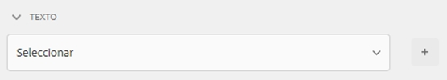

# Creación y uso de temáticas {#creating-and-using-themes}

>[!NOTE]
>
> Adobe recomienda utilizar la captura de datos moderna y ampliable [Componentes principales](https://experienceleague.adobe.com/docs/experience-manager-core-components/using/adaptive-forms/introduction.html?lang=es) para [crear nuevos formularios adaptables](/help/forms/creating-adaptive-form-core-components.md) o [adición de formularios adaptables a páginas de AEM Sites](/help/forms/create-or-add-an-adaptive-form-to-aem-sites-page.md). Estos componentes representan un avance significativo en la creación de formularios adaptables, lo que garantiza experiencias de usuario impresionantes. Este artículo describe un enfoque más antiguo para crear formularios adaptables con componentes de base.

| Versión | Vínculo del artículo |
| -------- | ---------------------------- |
| AEM 6.5 | [Haga clic aquí](https://experienceleague.adobe.com/docs/experience-manager-65/forms/adaptive-forms-advanced-authoring/themes.html?lang=es) |
| AEM as a Cloud Service | Este artículo |

Puede crear y aplicar temáticas para diseñar un formulario adaptable<!-- or an interactive communication-->. Una temática contiene detalles de estilo para los componentes y paneles. Los estilos incluyen propiedades como colores de fondo, colores de estado, transparencia, alineación y tamaño. Al aplicar una temática, el estilo especificado se refleja en los componentes correspondientes. La temática se administra de forma independiente sin hacer referencia a un formulario adaptable<!-- or interactive communication -->.

Puede descargar e instalar el paquete de contenido de referencia de [!DNL AEM Forms] en el portal [Distribución de software](https://experience.adobe.com/#/downloads/content/software-distribution/es-es/aemcloud.html) para importar temáticas de referencia y plantillas para su entorno.

## Creación, descarga o carga de una temática {#creating-downloading-or-uploading-a-theme}

Una temática se crea y se guarda como una entidad independiente, con metapropiedades como los formularios adaptables. Permite reutilizar una temática en varios formularios adaptables<!-- or  and interactive communications-->. También puede mover una temática a otra instancia y reutilizarla.

### Creación de una temática {#creating-a-theme}

Para crear una temática:

1. Haga clic en **[!UICONTROL Adobe Experience Manager]**, luego en **[!UICONTROL Forms]** y, por último, en **[!UICONTROL Temáticas]**.

1. En la página Temáticas, haga clic en **[!UICONTROL Crear]** > **[!UICONTROL Temática]**. 
Se inicia un asistente para crear una temática.

1. Especifique el **[!UICONTROL Nombre]** de la temática.

1. Especifique un formulario para previsualizar la temática en el campo **[!UICONTROL Vista previa predeterminada para esta temática]**. Haga clic en **[!UICONTROL Utilizar predeterminado]** para utilizar el formulario predeterminado y obtener una vista previa de la temática.

1. Especifique un **[!UICONTROL Contenedor de configuración]**. Puede elegir un **[!UICONTROL Contenedor de configuración]** que incluye detalles de configuración de Adobe Fonts para su cuenta. También puede dejar la opción en blanco por ahora y especificar los detalles más adelante desde [propiedades de la temática](#metadata-of-a-theme).

1. Haga clic en **[!UICONTROL Crear]** y luego en **[!UICONTROL Editar]** para abrir la temática en el editor de temáticas, o haga clic en **[!UICONTROL Listo]** para volver a la página de temáticas.

### Diferencia con respecto a las temáticas en Experience Manager 6.5 Forms y versiones anteriores {#difference-in-themes}

Temáticas creadas en una instancia de Cloud Service:

* Tienen la versión número 2.

* Se almacenan en `/content/dam/formsanddocuments-themes/<theme-name>/`

* No proporcionan la opción cliente-biblioteca. No se puede especificar una categoría y una ruta de acceso a la biblioteca de cliente.

* No tiene permisos de escritura y actualización en la ubicación /apps (el grupo de usuarios de Forms no tiene permisos de escritura y actualización en la ubicación /apps).

* Antes de cargar una temática creada en [!DNL Experience Manager Forms] 6.5 o versiones anteriores de una instancia de Cloud Service, asegúrese de que la ubicación de la biblioteca de cliente está configurada en `etc/clientlibs/fd/themes`. Si la biblioteca de cliente no existe en la carpeta `etc`, actualice manualmente la ubicación a `etc/clientlibs/fd/themes`. Puede realizar el cambio en [!DNL Experience Manager Forms] 6.5 o versiones anteriores. Después de establecer la ubicación de la biblioteca del cliente, un administrador puede cargar las temáticas en la instancia de Cloud Service o utilizar la herramienta de transferencia de contenido para migrar las temáticas de la versión 6.5 o anteriores a la instancia de Cloud Service.

  Además, cambie el nombre de la categoría. Si no se cambia el nombre, podría producirse un error `theme with same category name exists`. Cambiar el nombre de la categoría no afecta al formulario adaptable que utiliza la temática.

### Descargar una temática {#downloading-a-theme}

Puede exportar temáticas como archivo zip y utilizarlas en otros proyectos o instancias de Experience Manager. Para descargar una temática:

1. Haga clic en **[!UICONTROL Adobe Experience Manager]**, luego en **[!UICONTROL Forms]** y, por último, en **[!UICONTROL Temáticas]**.

1. En la página Temáticas, **[!UICONTROL seleccione]** una y haga clic en **[!UICONTROL Descargar]**. Se muestra un cuadro de diálogo con los detalles de la temática.

1. Haga clic en **[!UICONTROL Descargar]**. La temática se descarga como archivo zip.

>[!NOTE]
>
>Si descarga una temática que tiene asociado un formulario adaptable y el formulario adaptable asociado se basa en una plantilla personalizada, descargue también la plantilla personalizada. Al cargar la temática descargada y el formulario adaptable, cargue también la plantilla personalizada relacionada.

### Cargar una temática {#uploading-a-theme}

Un usuario con privilegios de administrador puede cargar una temática creada en [!DNL Experience Manager Forms] 6.5 o versiones anteriores.

Para cargar una temática:

1. Haga clic en **[!UICONTROL Adobe Experience Manager]**, luego en **[!UICONTROL Forms]** y, por último, en **[!UICONTROL Temáticas]**.

1. En la página Temáticas, haga clic en **[!UICONTROL Crear]** > **[!UICONTROL Cargar archivo]**.
1. En la solicitud de carga de archivos, examine y seleccione un paquete de temáticas en el equipo y haga clic en **[!UICONTROL Cargar]**. 
La temática cargada está disponible en la página de temáticas.

## Metadatos de una temática {#metadata-of-a-theme}

Lista de metapropiedades de una temática (que se encuentran en la página de propiedades de una temática).

<table>
 <tbody>
  <tr>
   <th>
<strong>ID</strong>
 
 
 </th>
   <th><strong>Nombre</strong></th>
   <th><strong>Se puede editar</strong></th>
   <th><strong>Descripción de la propiedad</strong></th>
  </tr>
  <tr>
   <td>1.</td>
   <td>Título</td>
   <td>Sí</td>
   <td>Nombre para mostrar de la temática.</td>
  </tr>
  <tr>
   <td>2.</td>
   <td>Descripción</td>
   <td>Sí</td>
   <td>Descripción de la temática.</td>
  </tr>
  <tr>
   <td>3.</td>
   <td>Tipo</td>
   <td>No</td>
   <td>
    <ul>
     <li>Tipo de recurso.</li>
     <li>El valor siempre es Temática.</li>
    </ul> </td>
  </tr>
  <tr>
   <td>4.</td>
   <td>Creado</td>
   <td>No</td>
   <td>Fecha de creación de la temática</td>
  </tr>
  <tr>
   <td>5.</td>
   <td>Nombre de autor</td>
   <td>Sí</td>
   <td>Autor de la temática. Se calcula en el momento de la creación de la temática.</td>
  </tr>
  <tr>
   <td>6.</td>
   <td>Fecha de última modificación</td>
   <td>No</td>
   <td>Fecha en la que se modificó la temática por última vez.</td>
  </tr>
  <tr>
   <td>7.</td>
   <td>Estado</td>
   <td>No</td>
   <td>Estado de la temática (modificada/publicada).</td>
  </tr>
  <tr>
   <td>8.</td>
   <td>Hora de publicación activada</td>
   <td>Sí</td>
   <td>Hora a la que publicar automáticamente la temática.</td>
  </tr>
  <tr>
   <td>9.</td>
   <td>Hora de publicación desactivada</td>
   <td>Sí</td>
   <td>Hora a la que cancelar automáticamente la publicación de la temática.</td>
  </tr>
  <tr>
   <td>10.</td>
   <td>Etiquetas</td>
   <td>Sí</td>
   <td>Etiqueta de identificación adjunta a la temática que se utiliza para mejorar la búsqueda.</td>
  </tr>
  <!-- <tr>
   <td>11.</td>
   <td>References</td>
   <td>Links</td>
   <td>
    <ul>
     <li>Contains 'Referred by' section. Lists forms that use the theme.</li>
     <li>Since the theme does not refer to any other asset, there is no 'Refers' section.</li>
    </ul> </td>
  </tr>
   <tr>
   <td>12.</td>
   <td>Clientlib Location</td>
   <td>Yes</td>
   <td>
    <ul>
     <li>The user-defined repository path within '/etc' where the clientlibs corresponding to this theme are stored.</li>
     <li>Default value - '/etc/clientlibs/fd/themes' + relative path of theme asset.</li>
     <li>If the location does not exist, the folder hierarchy is auto-generated.</li>
     <li>When this value is changed, the clientlib node structure is moved to the new location entered.  <em><strong>Note:</strong> If you change default clientlib location, in the CRXDE repository assign <code>crx:replicate, rep:write, rep:glob:*, rep:itemNames:: js.txt, jcr:read </code>to <code>forms-users</code> and <code>crx:replicate</code>, <code>jcr:read </code>to <code>fd-service</code> in the new location. Also attach another ACL by adding <code>deny jcr:addChildNodes</code> for <code>forms-user</code></em></li>
    </ul> </td>
  </tr> 
  <tr>
   <td>13.</td>
   <td>Clientlib Category Name</td>
   <td>Yes</td>
   <td>
    <ul>
     <li>The user-defined clientlib category name for this theme.</li>
     <li>An error is displayed if the name is already in use by some other existing theme.</li>
     <li>Default value - computed using theme location.</li>
     <li>When this value is changed, the category name is updated on the corresponding clientlib node. Updating Clientlib Category Name in the jsp files is not required because clientlib category name is used by reference.</li>
    </ul> </td>
  </tr> -->
 </tbody>
</table>

## Acerca del editor de temáticas {#about-the-theme-editor}

El editor de temáticas es una interfaz fácil de usar para el usuario empresarial y el diseñador/desarrollador web que proporciona las funcionalidades necesarias para especificar el estilo de varios elementos de formularios adaptables <!-- and interactive communication --> de forma sencilla. Cuando se crea una temática, se almacena como una entidad independiente, como formularios <!--  , interactive communications, letters, document fragments, and data dictionaries-->.

El editor de temáticas permite personalizar estilos de los componentes diseñados en una temática. Puede personalizar el modo en que se muestra un formulario <!-- or interactive communication --> en un dispositivo.

El editor de temáticas se divide en dos paneles:

* **Lienzo** - Aparece en el lado derecho. Muestra un formulario adaptable de ejemplo <!--  or interactive communication --> en el que todos los cambios de estilo se reflejan instantáneamente. También puede seleccionar objetos directamente del lienzo para buscar los estilos asociados a ellos y editarlos. Una regla de resolución de dispositivo en la parte superior gobierna el lienzo. Al seleccionar un punto de interrupción de resolución en la regla, se muestra la vista previa del formulario de ejemplo <!--  or interactive communication --> para la resolución correspondiente. El lienzo se analiza en detalle [a continuación](themes.md#using-canvas).

* **Barra lateral*** Aparece en el lado izquierdo. Tiene los siguientes elementos:

   * **Selector:** muestra el componente seleccionado para el estilo y sus propiedades que puede aplicar. El selector representa todos los componentes de un tipo. Si selecciona un componente de cuadro de texto en una temática para el estilo, todos los cuadros de texto del formulario <!-- or interactive communication --> heredan dicho estilo. Los selectores permiten seleccionar un componente genérico o un componente específico para el estilo. Por ejemplo, un componente de campo es un componente genérico y un cuadro de texto es un componente específico.

     **Estilo del componente genérico:**
un campo puede ser un campo de cuadro numérico, como la edad, o un campo de cuadro de texto, como la dirección. 
Al aplicar estilo a un campo, se aplica a todos los campos, como edad, nombre y dirección.

     **Estilo de un componente específico**: un componente específico afecta a los objetos de la categoría específica. Cuando aplique estilo al componente de cuadro numérico en la temática, solo el objeto de cuadro numérico heredará el estilo.

     Por ejemplo, un campo de cuadro de texto como una dirección que es más larga y un campo de cuadro numérico como la edad es más corto. Puede seleccionar un campo de cuadro numérico, reducir su longitud y aplicarlo al formulario. La anchura de todos los campos numéricos de cuadro se reduce en el formulario.

     Al personalizar todos los componentes de campo con un color de fondo específico, todos los campos, como edad, nombre y dirección, heredan el color de fondo. Al seleccionar un cuadro numérico, como la edad, y reducir su anchura, se reduce la anchura de todos los cuadros numéricos, como la edad o el número de personas de una familia. La anchura de los cuadros de texto no cambia.

   * **Estado:** permite personalizar estilos de un objeto en un estado específico. Por ejemplo, se puede especificar la apariencia de un objeto cuando está en estado predeterminado, de enfoque, desactivado, de desplazamiento o de error.
   * **Categorías de las propiedades:** las propiedades de estilo se dividen en varias categorías. Por ejemplo, Dimensión y posición, Texto, Fondo, Borde y Efectos. En cada categoría, se proporciona información sobre el estilo. Por ejemplo, en Fondo, puede proporcionar Color de fondo e Imagen y degradado.

   * **Avanzado:** permite agregar CSS personalizado a un objeto, que anula las propiedades que los controles visuales definen si hay una superposición.

   * **Ver CSS**: permite ver el CSS del componente seleccionado.

  Además, en la barra lateral, en la parte inferior hay una flecha. Al hacer clic en la flecha, aparecen dos opciones más: **Simular éxito** y **Simular error.** Estas opciones, junto con las opciones descritas anteriormente, se examinan en detalle [a continuación](themes.md#using-rail).

 **A.** Barra lateral **B.** Lienzo

### Estilo de componentes {#styling-components}

Puede utilizar una temática en varios formularios adaptables<!-- and interactive communications -->, lo cual importa el formato de componente que ha especificado en la temática. Puede aplicar estilo a varios componentes, como títulos, descripciones, paneles, campos, iconos y cuadros de texto. Use widgets para configurar propiedades de componentes en una temática. Los conocimientos previos de CSS o LESS no son necesarios, pero se recomienda; aunque la sección Anulaciones de CSS le permite escribir código CSS o proporcionar selectores personalizados. La sección Anulaciones de CSS aparece cuando selecciona un componente en la barra lateral.

Opciones en la barra lateral que permiten seleccionar y aplicar estilo a distintos componentes.

Al hacer clic en el botón Editar de un componente en la barra lateral, se selecciona el componente en Lienzo y se le permite aplicar estilo al componente mediante las opciones de la barra lateral.

Algunos componentes, como el cuadro de texto, el cuadro numérico, el botón de opción y la casilla de verificación, se clasifican en componentes genéricos como Campo. Por ejemplo, desea personalizar el estilo de los botones de opción. Para seleccionar botones de opción para el estilo, seleccione **[!UICONTROL Campo]** > **[!UICONTROL Widget]** > **[!UICONTROL Botón de opción]**.

### Estilo de diseños de panel {#styling-panel-layouts-br}

Las temáticas en [!DNL AEM Forms] admiten el estilo de los elementos en el diseño de paneles en los formularios<!-- and  interactive communications -->. Se admite el estilo de elementos en diseños predeterminados y diseños personalizados.

Los paneles integrados incluyen:

* Pestañas izquierda
* Pestañas arriba
* Acordeón
* Interactiva
* Asistente
* Diseño móvil

   * Títulos del panel en el encabezado
   * Sin títulos del panel en el encabezado

Los selectores varían para cada diseño. 
Dar estilo a los diseños personalizados desde el editor de temáticas implica:

* Definición de los componentes para un diseño al que se pueda dar estilo y selectores CSS para identificar estos componentes de forma exclusiva.
* Definición de las propiedades CSS que se pueden aplicar a estos componentes.
* Definición del estilo de estos componentes de forma interactiva desde la interfaz de usuario.

### Distintos estilos para diferentes tamaños de pantalla {#different-styles-for-different-screen-sizes-br}

Los diseños de escritorio y móviles pueden tener estilos ligera o totalmente diferentes. Los dispositivos móviles, tabletas y teléfonos comparten diseños similares, excepto para tamaños de componente.

Utilice los puntos de interrupción del editor de temáticas para definir un estilo alternativo para diferentes tamaños de pantalla. Puede seleccionar un dispositivo base o una resolución en la que comience a crear la temática, tras lo que las variaciones de estilo para otras resoluciones se generan automáticamente. Puede modificar explícitamente el estilo para todas las resoluciones.

>[!NOTE]
>
>La temática se crea primero mediante un formulario<!-- or interactive communication--> y, a continuación, se aplica en diferentes formularios<!-- or interactive communications-->. Los puntos de interrupción utilizados en la creación de la temática pueden ser diferentes al formulario <!-- or interactive communication --> sobre el que se aplica. Las consultas de medios CSS se basan en el formulario <!-- or interactive communication --> que se utiliza en la creación de temáticas y no en el formulario <!-- or interactive communication --> sobre el que se aplican estas.

### El contexto de las propiedades de estilo cambia en la barra lateral al seleccionar objetos {#styling-properties-context-changes-in-sidebar-on-selecting-objects}

Al seleccionar un componente en el Lienzo, sus propiedades de estilo se muestran en la barra lateral. Seleccione el tipo de objeto y su estado y, a continuación, proporcione su estilo.

### Estilos utilizados recientemente en el editor de temáticas {#recently-used-styles-in-theme-editor}

El editor de temáticas almacena en caché hasta diez estilos aplicados a un componente. Puede utilizar los estilos en caché con otros componentes de una temática. Los estilos utilizados recientemente están disponibles justo debajo del componente seleccionado en la barra lateral como cuadro de lista. Inicialmente, la lista de estilos utilizados recientemente está vacía.

Al aplicar estilo a un componente, los estilos se almacenan en caché y se enumeran en el cuadro de lista. En este ejemplo, la etiqueta del cuadro de texto incluye un estilo para cambiar el tamaño y el color de la fuente. Puede seguir pasos similares para elegir una imagen o cambiar los colores para aplicar estilo a un componente. Observe cómo el estilo se almacena en caché y se enumera en el cuadro de lista cuando se cambia de la etiqueta de campo.

En este ejemplo, se cambia el estilo de la etiqueta de campo y, cuando se selecciona Descripción del panel interrecurso para el estilo, se añade una entrada de lista en la biblioteca de recursos. La entrada de la biblioteca de recursos se puede utilizar para cambiar el estilo de Descripción del panel interrecurso.

Cuando se agrega un estilo en la biblioteca de recursos, estará disponible para otras temáticas y para el [modo de estilo](inline-style-adaptive-forms.md) de la interfaz de usuario del generador de formularios. Del mismo modo, cuando se utiliza el modo de estilo de la interfaz de usuario del generador de formularios <!-- or interactive communication editor --> para dar estilo a un componente, el estilo se almacena en caché y está disponible en las temáticas.

El botón “+” de la biblioteca de recursos permite guardar de forma permanente el estilo con el nombre que proporcione. El botón “+” guarda el estilo aunque no haga clic en el botón Guardar de la barra lateral para aplicarlo a un componente. El botón “+” para guardar un estilo para usarlo más tarde no está disponible en el modo de estilo.

Cuando se proporciona un nombre personalizado para un estilo, este se asocia a una temática y ya no está disponible para otras. Para eliminar un estilo guardado:

1. En la barra de herramientas LIENZO, haga clic en **[!UICONTROL Opciones de temática]**  > **[!UICONTROL Administrar estilos]**.
1. En el cuadro de diálogo Administrar estilos, seleccione un estilo guardado y haga clic en **[!UICONTROL Eliminar]**.

   

### Vista previa activa, guardar y descartar cambios {#live-preview-save-and-discard-changes}

Las modificaciones realizadas en el estilo se reflejan instantáneamente en el formulario <!-- or interactive communication --> cargado en el lienzo. La vista previa en directo permite definir y ver de forma interactiva el impacto del estilo. Al cambiar el estilo de un componente, el botón **[!UICONTROL Listo]** aparece habilitado en la barra lateral. Para conservar los cambios, haga clic en el botón **[!UICONTROL Listo]**.

>[!NOTE]
>
>Cuando se introduce un carácter no válido en un campo, el color del límite del campo cambia a rojo y se muestra un mensaje de error en la esquina superior izquierda de la pantalla. Por ejemplo, si se introducen caracteres alfabéticos en un cuadro de texto que acepta caracteres numéricos como entrada, el color de los límites del cuadro de entrada cambia a rojo. No puede guardar una temática de este tipo sin resolver el error mostrado en la parte inferior central de la pantalla.

### Temática con otro formulario adaptable {#theme-with-another-adaptive-form}

Cuando se crea una temática, se crea con un formulario que se envía con el editor de temáticas. Se proporciona estilo para los componentes de este formulario. En lugar del formulario enviado con el editor de temáticas, puede seleccionar un formulario <!-- or interactive communication --> de su elección para proporcionar estilo y previsualizar sus resultados.

Para reemplazar el formulario actual o <!-- interactive communication --> en el lienzo del editor de temáticas:

1. En el panel EDITOR DE TEMÁTICAS, haga clic en **[!UICONTROL Opciones de temática]**  > **[!UICONTROL Configurar]**.

1. En la pestaña General, busque y seleccione un formulario <!-- or interactive communication --> para el campo **[!UICONTROL Formulario adaptable]**.

### Rehacer/deshacer {#redo-undo}

Puede deshacer o rehacer los cambios no deseados que se producen accidentalmente. Utilice los botones Rehacer y Deshacer del lienzo.

Los botones Rehacer y Deshacer aparecen al aplicar estilo a un componente en el editor de temáticas.

## Uso del editor de temáticas {#using-the-theme-editor}

El editor de temáticas permite editar una temática que haya creado o cargado. Vaya a **[!UICONTROL Formularios y documentos]** > **[!UICONTROL Temáticas]**; luego, seleccione una y ábrala. La temática se abre en el editor de temáticas.

Como se ha indicado anteriormente, el editor de temáticas tiene dos paneles: Barra lateral y Lienzo. 

Personalización del estilo del estado de éxito del componente Widget de cuadro de texto en el editor de temáticas. El componente está seleccionado en Lienzo y su estado está seleccionado en la barra lateral. Las opciones de estilo disponibles en la barra lateral se utilizan para personalizar el aspecto de un componente.

### Uso del lienzo {#using-canvas}

La temática se crea mediante el formulario predeterminado o con un formulario <!-- or interactive communication --> de su elección. El lienzo muestra la vista previa del formulario o <!-- interactive communication --> se utiliza para crear la temática con las personalizaciones especificadas en la misma. La regla situada encima del formulario se utiliza para determinar la presentación en función del tamaño de visualización del dispositivo.

En la barra de herramientas Lienzo, verá:

* **[!UICONTROL Alternar panel lateral]** : permite mostrar u ocultar la barra lateral.
* **[!UICONTROL Opciones de la temática]** : proporciona tres opciones

   * Configurar: proporciona opciones para seleccionar el formulario de vista previa <!-- or interactive communication , base clientlib, -->y la configuración de Adobe Fonts.
   * Ver temática CSS: genera CSS para la temática seleccionada.
   * Administrar estilos: proporciona opciones para administrar estilos de texto e imagen
   * Ayuda: ejecuta una repaso guiado con imágenes sobre el editor de temáticas.

* **[!UICONTROL Emulador]** : emula el aspecto de la temática para diferentes tamaños de visualización. Un tamaño de visualización se trata como un punto de interrupción en el emulador. Puede seleccionar un punto de interrupción y especificar un estilo para él. Por ejemplo, Escritorio y Tablet son dos puntos de interrupción. Puede especificar distintos estilos para cada punto de interrupción.

Cuando seleccione un componente en el lienzo, verá la barra de herramientas de componentes encima. La barra de herramientas de componentes permite seleccionar componentes o cambiar a componentes genéricos. Por ejemplo, se selecciona un cuadro de texto numérico en un panel. Verá las siguientes opciones en la barra de herramientas de componentes:

* **[!UICONTROL Widget de cuadro numérico]**: permite seleccionar el componente para personalizar su aspecto en la barra lateral.
* **[!UICONTROL Widget de campos]**: permite seleccionar el componente genérico para el estilo. En este ejemplo, todos los componentes de entrada de texto (cuadro de texto/cuadro numérico/paso numérico/entrada de fecha) están seleccionados para el estilo.

* : permite seleccionar el componente principal para el estilo. Si selecciona un cuadro numérico y selecciona este icono, el componente de campo estará seleccionado.  Si selecciona el componente de campo y seleccione este icono, el panel estará seleccionado.  Si sigue pulsando este icono para seleccionarlo, acaba seleccionando el diseño para el estilo.

>[!NOTE]
>
>Las opciones disponibles en la barra de herramientas de componentes varían en función del componente que seleccione.

### Uso de la barra lateral {#using-rail}

La barra lateral del editor de temáticas ofrece opciones para personalizar estilos para los componentes de una temática y utilizar selectores. Los selectores permiten seleccionar un grupo de componentes o componentes individuales, así como buscar selectores en la barra lateral. Puede escribir selectores para los componentes personalizados.

Cuando se selecciona un componente del lienzo o los selectores en la barra lateral, la barra lateral muestra todas las opciones que le permiten personalizar los estilos para él. 
A continuación se muestran las opciones que ve en la barra lateral al seleccionar un componente:

* Estado
* Hoja de propiedades
* Simular error/éxito

#### Estado {#state}

Un estado es un indicador de la interacción del usuario con un componente. Por ejemplo, cuando un usuario introduce datos erróneos en un cuadro de texto, el estado del cuadro de texto cambia a un estado de error. El editor de temáticas permite especificar el estilo de un estado en particular.

Las opciones para personalizar los estilos de estado varían para los distintos componentes.

#### Hoja de propiedades {#property-sheet}

<table>
 <tbody>
  <tr>
   <td><strong>Propiedad</strong></td>
   <td><strong>Uso de</strong></td>
  </tr>
  <tr>
   <td>
Dimensiones y posición
 </td>
   <td>
Permite aplicar estilo a la alineación, el tamaño, el posicionamiento y la colocación de los componentes en la temática. 
 
Las opciones son configuración de visualización, relleno, margen, anchura, altura e índice Z.
 
También puede utilizar el modo Diseño para definir la anchura de los componentes con una interfaz sencilla de arrastrar y soltar. Para obtener más información, consulte <a href="resize-using-layout-mode.md">Uso del modo Diseño para cambiar el tamaño de los componentes</a>.
 </td>
  </tr>
  <tr>
   <td>
Texto
 </td>
   <td>
Permite personalizar los estilos de texto en el componente de la temática.
 
Por ejemplo, desea cambiar el aspecto del texto introducido en el cuadro de texto.
 
Las opciones son familia de fuentes, grosor, color, tamaño, altura de línea, alineación del texto, espaciado entre letras, sangría del texto, subrayado, cursiva, transformación del texto, alineación vertical, línea de base y dirección. 
 </td>
  </tr>
  <tr>
   <td>
Fondo 
 </td>
   <td>
Permite rellenar el fondo del componente con una imagen o un color. 
 </td>
  </tr>
  <tr>
   <td>
Border
 </td>
   <td>
Permite elegir el aspecto del borde del componente. Por ejemplo, desea que el cuadro de texto tenga un borde grueso y rojo profundo con una línea de puntos. 
 
Las opciones son anchura, estilo, radio y color del borde.
 </td>
  </tr>
  <tr>
   <td>
Efectos
 </td>
   <td>
Permite agregar efectos especiales a los componentes, como opacidad, modo de fusión y sombras. 
 </td>
  </tr>
  <tr>
   <td>
Avanzado 
 </td>
   <td>
Permite agregar:

    <ul>
     <li>Propiedades para los pseudoelementos <code>::before</code> y <code>::after</code> para agregar contenido después o antes del contenido predeterminado en el selector y aplicarle así estilo.  Consulte <a href="https://www.w3schools.com/css/css_pseudo_elements.asp" target="_blank">Pseudoelementos CSS</a>.</li>
     <li>Código CSS personalizado en línea a un componente.</li>
    </ul> 
Cuando agrega un código CSS personalizado, anula la personalización que ha agregado con las opciones de la barra lateral. 
 </td>
  </tr>
 </tbody>
</table>

#### Simular error/éxito {#simulate-error-success}

Las opciones de simular error y éxito están disponibles en la parte inferior de la barra lateral. Se pueden ver mediante una flecha de mostrar u ocultar visible en la parte inferior de la barra lateral. Con el editor de temáticas, puede aplicar estilo a varios estados de un componente.

Por ejemplo, se agrega un campo numérico al formulario y se especifica su estilo en el editor de temáticas. Cuando un usuario escribe un valor alfanumérico en el campo, desea que cambie el color de fondo del cuadro de texto. Se selecciona el campo numérico en la temática y se utiliza la opción de estado en la barra lateral. Seleccione el estado Error en la barra lateral y cambie el color de fondo a rojo. Para obtener una vista previa del comportamiento, puede utilizar la opción Simular error disponible en la barra lateral. Las opciones de simular error y éxito se describen en detalle a continuación:

* **Simular éxito**:
le permite ver el aspecto de un componente si especifica su estilo para el estado de éxito. Por ejemplo, en un formulario, los clientes establecen la contraseña. Los usuarios pueden configurar la contraseña según las directrices que proporcione. Cuando un usuario escribe una contraseña siguiendo todas las directrices proporcionadas, el cuadro de texto se vuelve verde. Cuando el cuadro de texto se vuelve verde, está en estado de éxito. Puede especificar el estilo de un componente en estado de éxito y simular su aspecto utilizando la opción Simular éxito.

* **Simular error**:
le permite ver el aspecto de un componente si especifica su estilo para el estado de error. Por ejemplo, en un formulario, los clientes establecen la contraseña. Los usuarios pueden configurar la contraseña según las directrices que proporcione. Cuando un usuario escribe una contraseña que no sigue todas las directrices proporcionadas, el cuadro de texto se vuelve rojo. Cuando el cuadro de texto se vuelve rojo, está en estado de error. Puede especificar el estilo de un componente en estado de error y simular su aspecto utilizando la opción Simular error.

### Estilo de un componente {#styling-a-component}

Por ejemplo, en el formulario, tiene dos tipos de cuadros de texto: uno que solo acepta valores numéricos y otro que acepta valores alfanuméricos. Puede personalizar el estilo del cuadro de texto que solo acepta valores numéricos (un cuadro numérico).

Para personalizar el estilo de un componente en particular (un cuadro numérico en este ejemplo), realice los siguientes pasos:

1. En el editor de temáticas, seleccione el cuadro numérico en el lienzo.
1. Al seleccionar el cuadro numérico, puede ver la barra de herramientas de componentes con tres opciones:

   * **[!UICONTROL Widget del cuadro numérico]**
   * **[!UICONTROL Widget del campo]**

1. Seleccione **[!UICONTROL Widget del cuadro numérico]**.
1. El título de la barra lateral cambia a Widget del cuadro numérico y muestra las opciones para personalizar su aspecto. 
Use **[!UICONTROL Dimensión y posición]** en la barra lateral para personalizar el tamaño del componente. Compruebe que el estado es **[!UICONTROL Predeterminado]**.

En lugar de seleccionar **[!UICONTROL Widget del cuadro numérico]**, seleccione **[!UICONTROL Widget del campo]** en la barra de herramientas de componentes y realice los pasos anteriores. Al seleccionar dimensiones para **[!UICONTROL Widget del campo]**, todos los cuadros de texto excepto el cuadro numérico tienen el mismo tamaño.

### Estilo de campos para un estado determinado {#styling-fields-given-state}

Con la barra de herramientas de componentes, también puede especificar el estilo de los componentes para sus distintos estados. Por ejemplo, si un componente está deshabilitado, entonces está en estado deshabilitado. Los estados más utilizados de un componente al que se puede aplicar estilo en el editor de temáticas son: Predeterminado, Enfoque, Deshabilitado, Error, Éxito y Desplazamiento. Puede seleccionar un componente en el lienzo y utilizar la opción Estado en la barra lateral para personalizar su aspecto.

Para personalizar el estilo de un componente en un estado específico, realice los siguientes pasos:

1. Seleccione un componente en el lienzo y seleccione la opción adecuada en la barra de herramientas de componentes. 
La barra lateral muestra las opciones para personalizar el estilo del componente.
1. Seleccione un estado en la barra lateral. Por ejemplo, Estado de error.
1. Utilice opciones como **[!UICONTROL Borde o Fondo]** en la barra lateral para personalizar el aspecto del componente.
1. Utilice la opción **[!UICONTROL Simular error]** en la parte inferior de la barra lateral para ver el aspecto del estilo en la edición.

Al personalizar el estilo de un componente después de especificar su estado, la personalización solo aparece para el componente en el estado especificado. Por ejemplo, si personaliza el estilo del componente cuando está seleccionado el estado de desplazamiento. La personalización aparece para el componente cuando se mueve el puntero sobre el componente en el formulario <!-- or interactive communication --> representado al que se aplica la temática.

Para simular el comportamiento de estados que no sean errores y de éxito, utilice el modo de vista previa. Para utilizar el modo de vista previa, haga clic en **[!UICONTROL Vista previa]** en la barra de herramientas de la página.

### Estilo de diseños para pantallas más pequeñas {#styling-layouts-for-smaller-displays}

Utilice la regla del lienzo para seleccionar puntos de interrupción para dispositivos con pantallas más pequeñas. Haga clic en emulador  en Lienzo para ver la regla y los puntos de interrupción. Los puntos de interrupción permiten previsualizar un formulario <!-- or interactive communication --> para tamaños de pantalla pertenecientes a distintos dispositivos, como teléfonos y tabletas. El editor de temáticas admite varios tamaños de visualización.

Para aplicar estilo a los componentes de distintos puntos de interrupción:

1. En el lienzo, seleccione un punto de interrupción encima de la regla. 
Un punto de interrupción representa un dispositivo móvil y su tamaño de visualización.
1. Utilice la barra lateral para personalizar el estilo de los componentes del formulario <!-- or interactive communication --> de la temática para el tamaño de visualización seleccionado.
1. Asegúrese de que la personalización esté guardada.

Puede aplicar estilo a los componentes del formulario <!-- or interactive communication --> para varios dispositivos. Los componentes de formulario <!-- and interactive communication --> para escritorios y dispositivos móviles pueden tener estilos totalmente diferentes.

### Uso de Web Fonts en una temática {#using-web-fonts-in-a-theme}

Ahora puede utilizar fuentes disponibles en un servicio web en un formulario adaptable <!-- or interactive communication -->. De forma predeterminada, [Adobe Fonts](https://fonts.adobe.com/), el servicio de fuentes web de Adobe, está disponible. Para usar Adobe Fonts, cree un kit, añada fuentes y obtenga el ID del kit de [Adobe Fonts](https://fonts.adobe.com/).

Para configurar Adobe Fonts en Experience Manager, realice los siguientes pasos:

1. En la instancia de autor, haga clic en  **[!UICONTROL Adobe Experience Manager]** > **[!UICONTROL Herramientas]**  > **[!UICONTROL Implementación]** > **[!UICONTROL Cloud Services]**.
1. En la página **[!UICONTROL Cloud Service]**, vaya y abra la opción **[!UICONTROL Adobe Fonts]**. Abra la carpeta de configuración y haga clic en **[!UICONTROL Crear]**.
1. En el cuadro de diálogo **[!UICONTROL Crear configuración]**, especifique un título para la configuración y haga clic en **[!UICONTROL Crear]**.

   Se le redirigirá a la página de configuración.

1. En el cuadro de diálogo Editar componente que aparece, proporcione el ID del kit y haga clic en **[!UICONTROL Aceptar]**.

Para configurar una temática para utilizar la configuración de Adobe Fonts, realice los siguientes pasos:

1. En la instancia de autor, abra una temática en el editor de temáticas.
1. En el editor de temáticas, vaya a **[!UICONTROL Opciones de temática]**  > **[!UICONTROL Configurar]**.
1. En **[!UICONTROL Configuración de Adobe Fonts]**, seleccione un kit y haga clic en **[!UICONTROL Guardar]**.

   Ahora, puede ver que las fuentes se añaden en la propiedad font-family de la temática.

<!-- 

### Listing and selecting fonts in theme editor {#listing-and-selecting-fonts-in-theme-editor}

You can use the theme configuration service to add more fonts to the theme editor. Perform the following steps to add fonts:

1. Log in to Experience Manager Web Console with administrative privileges. URL for the Experience Manager Web Console is `https://'[server]:[port]'/system/console/configMgr`.
1. Open **[!UICONTROL Adaptive Form Theme Configuration Service]**.

   

1. Click +, specify the name of the font, and click **Save**. The font is added and available in theme editor. 
-->

#### Selección de fuentes en el editor de temáticas {#selecting-fonts-in-theme-editor}

Puede utilizar el botón “+” para agregar una fuente. Cuando se añade una fuente, esta aparece en la barra lateral.

Además de la opción de configuración de la temática, también puede agregar la fuente desde el editor de temáticas en sí. Escriba la fuente que desee utilizar en el campo de la familia de fuentes en la barra lateral y pulse la tecla “retorno” (return) del teclado.

Cuando selecciona una fuente, esta se añade en la lista de la familia de fuentes. Puede utilizar la opción Máscara en el editor de temáticas para deshabilitar o habilitar las fuentes de la lista.

Puede ver el cambio de fuente del componente.

El campo Familia de fuentes admite varias fuentes. Al escribir una fuente, el navegador la busca y la aplica al componente seleccionado. Si el navegador no encuentra una fuente, busca una que esté junto a ella en la familia. Puede empezar escribiendo la fuente específica que está buscando. Si no encuentra la fuente que desea utilizar, puede escribir una fuente genérica en la familia y utilizarla.

#### Estilos de máscara aplicados en el editor de temáticas {#mask-styles-applied-in-theme-editor}

Puede enmascarar estilos aplicados en una temática. En la barra lateral del editor de temáticas, puede usar el icono  para desactivar un estilo aplicado. Por ejemplo, si cambia las dimensiones de un componente en un formulario <!-- or interactive communication -->, a continuación, puede utilizar el botón de máscara de la izquierda de una propiedad para desactivarla. Al guardar una temática, se conservan las opciones de máscara seleccionadas.

El ejemplo siguiente muestra estilos enmascarados y sin enmascarar en una temática.

## Aplicación de una temática a un formulario {#applying-a-theme-to-a-form-or-interactive-communication-br}

Para aplicar una temática a un formulario adaptable:

1. Abra el formulario en modo de edición. Para abrir un formulario en modo de edición, seleccione un formulario y haga clic en **[!UICONTROL Abrir]**.
1. En el modo de edición, seleccione un componente y, a continuación, pulse  > **[!UICONTROL Contenedor de formulario adaptable]** y haga clic en .

   Puede editar las propiedades del formulario en la barra lateral.

1. En la barra lateral, haga clic en **[!UICONTROL Estilo]**.
1. Seleccione la temática en el menú desplegable **[!UICONTROL Temática del formulario adaptable]** y haga clic en **[!UICONTROL Listo]** .

También puede definir una temática para un formulario adaptable cuando lo esté creando.

<!-- To apply a theme to an interactive communication:

1. Open your interactive communication in edit mode. To open a interactive communication in edit mode, select a form and click **Open**.
1. In the edit mode, select a component, then click  &gt;**Document Container**, and then click .

   You can edit properties of your form in the sidebar.

1. In the sidebar, under **Basic**, select your theme from the **Theme** drop-down and click **Done**  -->

### Cambiar la temática de un formulario durante la ejecución {#change-theme-of-a-form-at-runtime}

Una temática presenta distintos componentes de un formulario. Puede usar la propiedad `themeOverride` para cambiar dinámicamente la temática de un formulario. Una URL típica de un formulario es:

`https://<server>:<port>/content/forms/af/test.html`

Puede utilizar el parámetro themeOverride para aplicar una temática durante la ejecución.

`https://<server>:<port>/content/forms/af/test.html?themeOverride=/content/dam/formsanddocuments-themes/simpleEnrollmentTheme`

La opción `themeOverride` permite proporcionar una ruta a una temática. Cambia la temática del formulario y lo actualiza con estilos mejorados.

## Obtención de un aspecto específico mediante Temáticas {#specific-af-appearance}

Con [!DNL AEM Forms], junto con la temática predeterminada del lienzo, hay muchas otras temáticas. Si desea diseñar el formulario <!-- or interactive communication --> con otras temáticas, junto con más cambios, copie la temática de la carpeta Biblioteca de temáticas. Pegue las temáticas copiadas fuera de la carpeta Biblioteca de temáticas y edite la temática copiada según los cambios que desee.

Para copiar una temática, realice los siguientes pasos:

1. En la instancia de creación, vaya a **[!UICONTROL Adobe Experience Manager]** > **[!UICONTROL Forms]** > **[!UICONTROL Temáticas]**.
1. Abra la carpeta Biblioteca de temáticas.
1. En la carpeta Biblioteca de temáticas, pase el puntero sobre la temática correspondiente y seleccione **[!UICONTROL Copiar]**.
1. Pegue la temática copiada fuera de la carpeta Biblioteca de temáticas.
1. Personalice la temática copiada.

Después de personalizar la temática, aplíquela en el formulario <!-- or interactive communication -->.

>[!NOTE]
>
>No modifique las temáticas disponibles en la carpeta Biblioteca de temáticas. Esta carpeta contiene temáticas del sistema. Cualquier cambio que haya realizado en estas temáticas se sobrescribirá al instalar una versión más reciente o una corrección de errores de [!DNL AEM Forms].

## Impacto en otros casos de uso del formulario adaptable {#impact-on-other-adaptive-form-use-cases}

* **Publicar/cancelar la publicación de un formulario:** al publicar un formulario, la temática aplicada también se publica (si aún no se ha publicado).
* **Importar/exportar un formulario:** al importar o exportar un formulario, su temática asociada también se importa o exporta automáticamente.
* **Referencias de un formulario:** la sección Referencias de las referencias de formulario contiene una entrada adicional para la temática.
* **Hora de la última modificación de un formulario:** se actualiza cuando se cambia la temática asociada.
<!-- * **A/B Testing:** You can apply a different theme to two versions of the form in A/B testing. The information of the two themes is individually stored on the two guide containers. -->

## Secuencia de generación de CSS {#css-generation-sequence}

Cuando selecciona Ver CSS, el Editor de temáticas recopila toda la información de estilo y crea un archivo CSS. Recopila información en el siguiente orden:

<!-- 1. Styling defined in the theme's base client library. -->
1. Estilo definido por el usuario, especificado con las propiedades de la barra lateral.
1. Estilo CSS proporcionado mediante la opción Sustitución de CSS.

Por ejemplo, el color de fondo de un cuadro de texto es azul<!-- in the base client library-->. Puede cambiarlo a rosa con las propiedades de la barra lateral. Cuando genere un archivo CSS, verá el color de fondo del cuadro de texto como rosa. Después de cambiar el color de fondo mediante las propiedades, otro autor utiliza la opción de anulación de CSS para cambiar el cuadro de texto de color de fondo como blanco. Cuando genere un archivo CSS, verá el color de fondo como blanco en el CSS generado.

## Depuración de estilos {#debugging-styles}

Cuando se especifican estilos para los componentes en el Editor de temáticas, se genera un archivo CSS. Al aplicar estilo a un componente genérico, también se diseñan varios componentes incluidos en él. Por ejemplo, al aplicar estilo a un campo, también se le aplica estilo al cuadro de texto y a la etiqueta. Cuando aplica estilo al cuadro de texto dentro del campo, obtiene su propio archivo CSS. Si desea depurar el archivo CSS generado para el campo y el componente, el Editor de temáticas proporciona opciones que le permiten ver el CSS.

Puede ver el CSS generado mediante las siguientes opciones:

* Opción **Ver CSS** en la barra lateral: al seleccionar un componente en la temática, puede ver la opción VER CSS en la barra lateral. Muestra el CSS generado, incluido el CSS para los pseudoelementos `::before` y `::after`.
* Opción **Ver temática CSS** en la barra de herramientas del lienzo: en la barra de herramientas del lienzo, haga clic en  > **[!UICONTROL Ver temática CSS]**. Puede ver la temática completa en CSS generada a partir de las propiedades definidas en el Editor de temáticas.

## Solución de problemas, recomendaciones y prácticas recomendadas {#troubleshooting-recommendations-and-best-practices}

* **Evitar recursos de otra temática**

  Al editar una temática, puede examinar y agregar recursos (como imágenes) de otras temáticas. Por ejemplo, quiere editar el fondo de una página. Al seleccionar **[!UICONTROL Página]**  > **[!UICONTROL Fondo]** > **[!UICONTROL Agregar]** > **[!UICONTROL Imagen]**, verá un cuadro de diálogo que le permite examinar y agregar imágenes en otras temáticas.

* Puede tener problemas con la temática actual si se agrega un recurso desde otra y esta se mueve o se elimina. Se recomienda evitar explorar y agregar recursos de otras temáticas.

<!-- * **Using base clientlib, theme editor, and inline styling**

    * **Base clientlib**:

      Base client library contains styling information. To use styling information in client-side libraries in themes.

        1. Navigate to **[!UICONTROL Experience Manager]** &gt; **[!UICONTROL Forms]** &gt; **[!UICONTROL Themes]**.
        1. In the Themes page, select a theme and click **[!UICONTROL Properties]**.
        1. In the Properties page that opens, click **[!UICONTROL Advanced]**.
        1. In the Advanced tab, in the Clientlib Location field, browse, and select the client-library you want to use.
        1. Click **[!UICONTROL Save]**.

      The styling you specify in client library is imported in the theme that uses it. For example, you specify styling for text box, numeric box, and switch in the client library. When you import your client library in the theme, styling for text box, numeric box, and switch is imported. You can then style other components using theme editor. -->
    También puede crear una temática, crear copias de la misma y, a continuación, modificar el estilo proporcionado en las temáticas copiadas para casos de uso similares.
    Consulte [Obtención de apariencia específica mediante Temáticas](#specific-af-appearance)
    
    * **Editor de temáticas:**
    
    El editor de temáticas permite crear temáticas para darle estilo al formulario &lt;!-- o comunicación interactiva -->. Puede especificar el estilo de los componentes de una temática, que permite la coherencia en la apariencia y la presentación en los varios formularios que desarrolle. Se recomienda especificar información de estilo en una temática y, a continuación, aplicarla a un formulario.
    
    * **Estilo alineado:**
    
    Puede aplicar estilo a los componentes mediante el modo Estilo del editor multicanal del formulario &lt;!-- o la comunicación interactiva --> cuando se trabaja con un formulario. Si se utiliza el modo de estilo para cambiar el estilo de los componentes del formulario, se anula el estilo especificado en la temática. Si desea cambiar el estilo de ciertos componentes de un formulario concreto, consulte [Estilo alineado de componentes](inline-style-adaptive-forms.md).

<!-- * **Using client-side libraries**

  If you want to create client libraries to import styling information, see [Using Client-Side Libraries](https://experienceleague.adobe.com/docs/experience-manager-cloud-service/implementing/developing/clientlibs.html). After you create a client library, you can import it in your theme using the steps mentioned above. -->

* **Cambio de la anchura de diseño del panel contenedor**

  No se recomienda cambiar la anchura del diseño del panel contenedor. Cuando se especifica la anchura de un panel contenedor, este se vuelve estático y no se adapta a distintas pantallas.

* **Cuándo usar el generador de formularios o el editor de temáticas para trabajar con encabezado y pie de página**

  Utilice el editor de temáticas si desea aplicar estilo al encabezado y al pie de página mediante opciones de estilo como estilo de fuente, fondo y transparencia.
Si desea proporcionar información como un logotipo, el nombre de la empresa en el encabezado e información de copyright en el pie de página, utilice las opciones de Form Builder.

## Ver también {#see-also}

{{see-also}}
