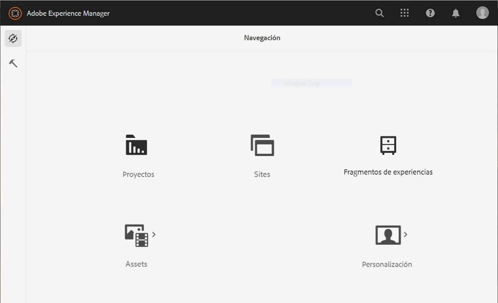
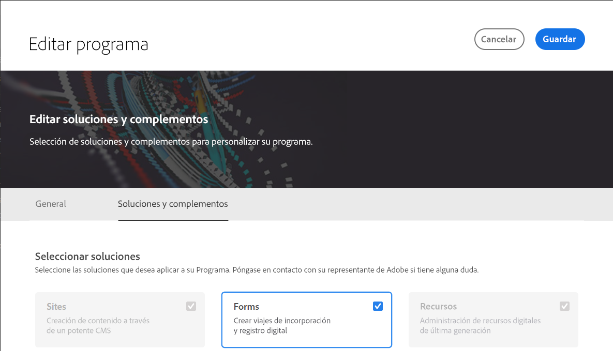

# Configuración {#installation-and-configuration}

Puede encontrar algunos de los siguientes problemas al configurar un entorno de Cloud Service:

## La opción Forms no está disponible

La opción **[!UICONTROL Forms]** no está disponible en la página **[!UICONTROL Navegación]**.

Para habilitar la opción **[!UICONTROL Forms]**:

1. Inicie sesión en [Cloud Manager](https://experience.adobe.com/).
1. Busque el programa y haga clic en el icono . Se abre la página Editar programa del programa.
1. Abra la pestaña **[!UICONTROL Soluciones y complementos]**.
1. Seleccione la opción **[!UICONTROL Forms]** y haga clic en **[!UICONTROL Guardar]**.

   

1. [Cree](https://experienceleague.adobe.com/docs/experience-manager-cloud-manager/using/how-to-use/configuring-pipeline.html?lang=es#how-to-use) y [ejecute](https://experienceleague.adobe.com/docs/experience-manager-cloud-manager/using/how-to-use/deploying-code.html?lang=es) canalizaciones de producción y de no producción.

Una vez construida e implementada la canalización, la opción **[!UICONTROL Forms]** en la página **[!UICONTROL Navegación]**.

<!--  
## Environment creation fails {#environment-creation-fails}

Users are unable to create an [!DNL AEM Forms] as a Cloud Service environment. The environment creation fails after running for some time.

A missing profile can lead to environment creation failure. Check that the profile exists in Admin Console. If the profile does not exist, perform the following steps to create the profile:

1. Log in to [Admin Console](https://adminconsole.adobe.com/). Use Adobe ID of administrator provisioned to use Automated Forms Conversion Service to login. Do not any other ID or Federated ID to login.
1. Click the **[!UICONTROL Automated Forms Conversion Service]** option.
1. Click **[!UICONTROL New Profile]** in the Products tab.
1. Specify Name, Display Name, and Description for the profile. Click **[!UICONTROL Done]**. A profile is created.

If the profile exists and issues still persist, contact Adobe Support. -->

## Se produce un error en la canalización de compilación {#build-pipeline-fails}

Los usuarios no pueden ejecutar la canalización de compilación. Se produce un error en la canalización después de ejecutarse durante algún tiempo.

Para resolver el problema, abra Cloud Manager, seleccione la opción **[!UICONTROL Actualizar]** correspondiente a su entorno y ejecute la canalización.

## Los paquetes no están en estado activo {#bundles-inactive-state}

Para resolver el problema, realice los siguientes pasos:

1. Inicie AEM y espere a que se inicie completamente hasta que todos los paquetes estén activos.
1. Detenga AEM (Ctrl + C).
1. Coloque el archivo `.far` de Forms en la carpeta de instalación.
1. Reinicie el servidor de AEM.