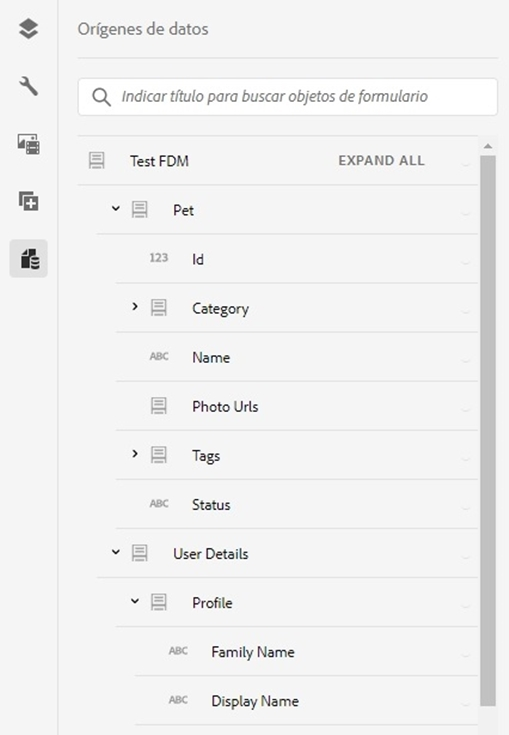
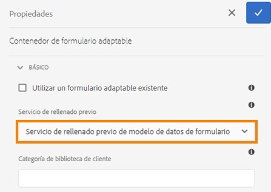
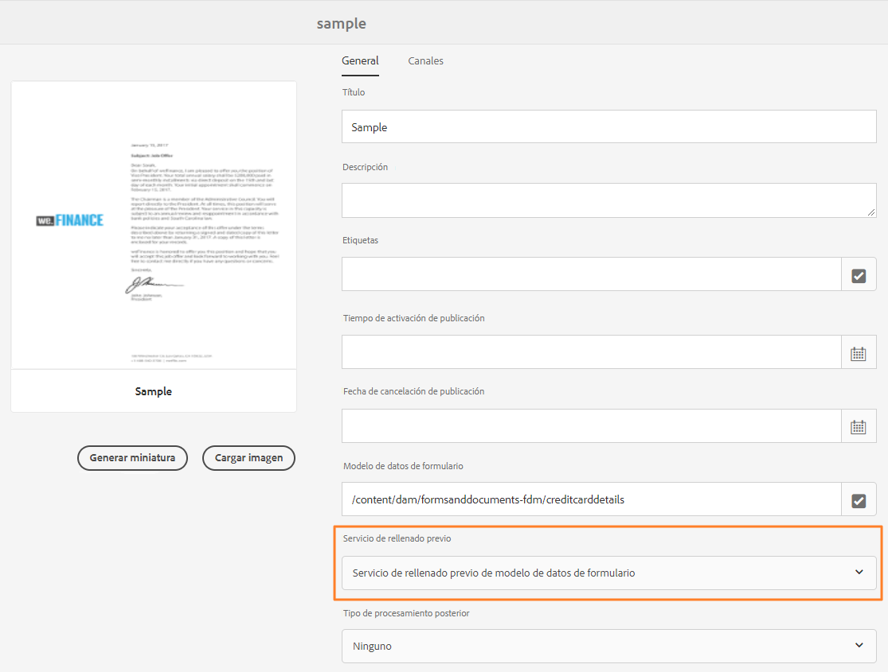
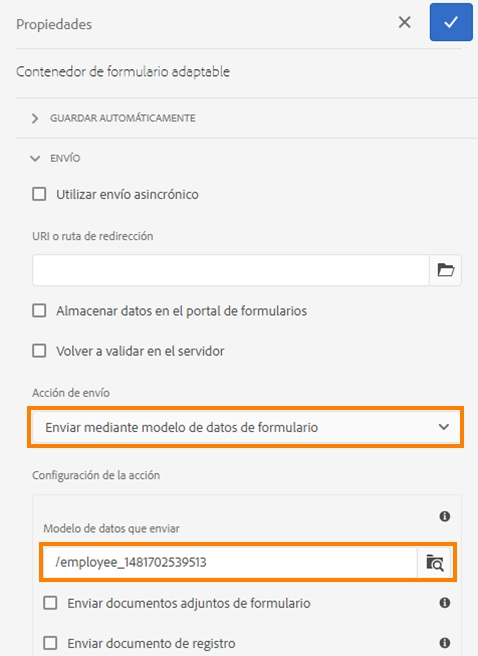
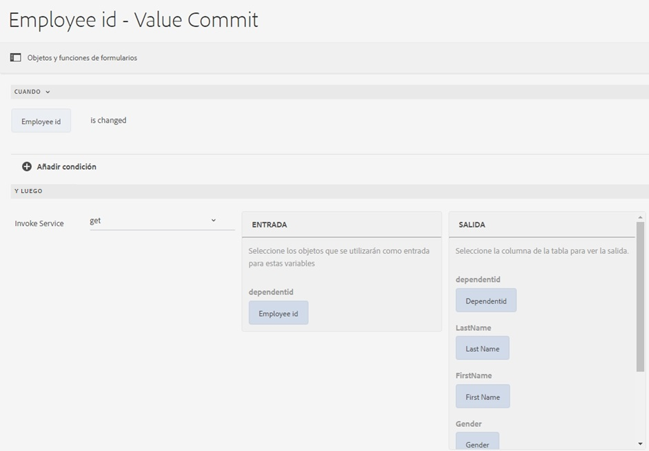

# Uso del modelo de datos de formulario {#use-form-data-model}

| Versión | Vínculo del artículo |
| -------- | ---------------------------- |
| AEM 6.5 | [Haga clic aquí](https://experienceleague.adobe.com/docs/experience-manager-65/forms/form-data-model/using-form-data-model.html) |
| AEM as a Cloud Service | Este artículo |

La integración de datos de [!DNL Experience Manager Forms] permite utilizar fuentes de datos de diferentes back-end para crear un modelo de datos de formulario que se puede utilizar como esquema en varios flujos de trabajo de formularios adaptables e <!--and interactive communications-->. Para ello, es necesario configurar las fuentes de datos y crear un modelo de datos de formulario basado en los objetos y servicios de modelo de datos disponibles en las fuentes de datos. Para obtener más información, consulte:

* [Integración de datos de [!DNL Experience Manager Forms]](data-integration.md)
* [Configurar fuentes de datos](configure-data-sources.md)
* [Crear un modelo de datos de formulario](create-form-data-models.md)
* [Trabajar con el modelo de datos de formulario](work-with-form-data-model.md)

Un modelo de datos de formulario es una extensión del esquema JSON que puede utilizar para lo siguiente:

* [Crear formularios adaptables y fragmentos;](#create-af)
  <!--* [Create interactive communications and building blocks like text, list, and condition fragments](#create-ic)-->
* [Usar una vista previa con datos de ejemplo;](#preview-ic)
* [Usar el servicio del modelo de datos de formulario;](#prefill)
* [Escribir en diferido datos de formulario adaptable en fuentes de datos;](#write-af)
* [Invocar servicios mediante reglas de formulario adaptable.](#invoke-services)

## Crear formularios adaptables y fragmentos; {#create-af}

Puede crear [formularios adaptables](creating-adaptive-form.md) y fragmentos de formulario adaptables <!-- [Adaptive Form Fragments](adaptive-form-fragments.md) --> a partir de un modelo de datos de formulario. Para utilizar un modelo de datos de formulario al crear un formulario adaptable o un fragmento de formulario adaptable, haga lo siguiente:

1. En la pestaña modelo de formulario de la pantalla Agregar propiedades, seleccione **[!UICONTROL Modelo de datos de formulario]** en la lista desplegable **[!UICONTROL Seleccionar desde]**.

   

1. Pulse para expandir **[!UICONTROL Seleccionar modelo de datos de formulario]**. Se muestran todos los modelos de datos de formulario disponibles.

   Seleccione un modelo de datos de formulario.

   

1. (**Solo fragmentos de formulario adaptable**) Puede crear un fragmento de formulario adaptable basado en un único objeto de modelo de datos en un modelo de datos de formulario. Expanda la lista desplegable **[!UICONTROL Definiciones del modelo de datos de formulario]**. Esta lista enumera todos los objetos de modelo de datos del modelo de datos de formulario especificado. Seleccione un objeto de modelo de datos de la lista.

   

   Una vez creado el formulario adaptable o el fragmento de formulario adaptable basado en un modelo de datos de formulario, los objetos de modelo de datos de formulario aparecen en la pestaña **[!UICONTROL Fuentes de datos]** del Explorador de contenido en el Editor de formularios adaptables.

   >[!NOTE]
   >
   >En el caso de los fragmentos de formulario adaptable, solo el objeto de modelo de datos seleccionado en el momento de la creación y los objetos de modelo de datos asociados aparecen en la pestaña Fuentes de datos.

   

   Puede arrastrar y soltar objetos de modelo de datos en el formulario adaptable o en el fragmento para agregar campos de formulario. Los campos de formulario agregados conservan las propiedades de metadatos y el enlace con las propiedades del objeto de modelo de datos. El enlace garantiza que los valores de los campos se actualicen en las fuentes de datos correspondientes al enviar el formulario y se prerrellenen cuando se representa el formulario.

<!-- ## Create interactive communications {#create-ic}

You can create an interactive communication based on a Form Data Model that you can use to prefill interactive communication with data from configured data sources. In addition, the building blocks of an interactive communication, such as text, list, and condition document fragments can be based on a form data model.

You can choose a Form Data Model when creating an interactive communication or a document fragment. The following image shows the General tab of the Create Interactive Communication dialog.

General tab of Create Interactive Communication dialog

For more information, see:

[Create an interactive communication](create-interactive-communication.md)

[Text in Interactive Communications](texts-interactive-communications.md)

[Conditions in Interactive Communications](conditions-interactive-communications.md)

[List fragments](lists.md) -->

## Usar una vista previa con datos de ejemplo; {#preview-ic}

El editor del modelo de datos de formulario permite generar y editar datos de ejemplo para objetos de modelo de datos en el modelo de datos de formulario. Puede utilizar estos datos para previsualizar y probar formularios adaptables de <!--interactive communications and-->. Debe generar los datos de ejemplo antes de obtener la vista previa, tal como se describe en [Trabajo con el modelo de datos de formulario](work-with-form-data-model.md#sample).

<!--To preview an interactive communication with sample Form Data Model data:

1. On [!DNL  Experience Manager] author instance, navigate to **[!UICONTROL Forms > Forms & Documents]**.
1. Select an interactive communication and tap **[!UICONTROL Preview]** in the toolbar to select **[!UICONTROL Web Channel]**, **[!UICONTROL Print Channel]**, or **[!UICONTROL Both Channels]** to preview the interactive communication.
1. In the Preview [*channel*] dialog, ensure that **[!UICONTROL Test Data of Form Data Model]** is selected and tap **[!UICONTROL Preview]**.

The interactive communication opens with prefilled sample data.

-->

Para obtener una vista previa de un formulario adaptable con datos de ejemplo, abra el formulario adaptable en el modo Autor y pulse **[!UICONTROL Vista previa]**.

## Prerrellenado mediante el servicio del modelo de datos de formulario {#prefill}

[!DNL Experience Manager Forms] proporciona de forma predeterminada un servicio de prerrellenado del modelo de datos de formulario que puede habilitar para formularios adaptables y <!--and interactive communications--> basados en el modelo de datos de formulario. El servicio de prerrellenado consulta las fuentes de datos de los objetos de modelo de datos del formulario adaptable <!--and interactive communication--> y prerrellena los datos de la forma correspondiente al representar el formulario o la comunicación.

Para habilitar el servicio de prerrellenado del modelo de datos de formulario de un formulario adaptable, abra las propiedades del contenedor de formulario adaptable y seleccione **[!UICONTROL Servicio de prerrellenado del modelo de datos de formulario]** en la lista desplegable **[!UICONTROL Servicio de prerrellenado]** en el acordeón Básico. A continuación, guarde las propiedades.

<!--To configure Form Data Model prefill service in an interactive communication, you can select Form Data Model Prefill Service in the Prefill Service drop-down while creating it or later by modifying the properties.

Edit Properties dialog for an interactive communication-->

## Escribir los datos de los formularios adaptables enviados en fuentes de datos {#write-af}

Cuando un usuario envía un formulario basado en un modelo de datos de formulario, se puede configurar el formulario para que escriba los datos enviados de un objeto de modelo de datos en sus fuentes de datos. Para aplicar este caso de uso, [!DNL Experience Manager Forms] proporciona la [Acción de envío del modelo de datos de formulario](configuring-submit-actions.md), disponible de forma predeterminada solo para formularios adaptables basados en un modelo de datos de formulario. Escribe los datos enviados de un objeto de modelo de datos en su fuente de datos.

Para configurar la acción de envío del modelo de datos de formulario, abra las propiedades del contenedor de formulario adaptable y seleccione **[!UICONTROL Enviar mediante el modelo de datos de formulario]** en la lista desplegable Acción de envío, en el acordeón Envío. A continuación, examine y seleccione un objeto de modelo de datos en la lista desplegable **[!UICONTROL Nombre del objeto de modelo de datos que se va a enviar]**. Guarde las propiedades.

Al enviar el formulario, los datos del objeto de modelo de datos configurado se escriben en la fuente de datos correspondiente.

<!---->

También puede enviar los archivos adjuntos del formulario a una fuente de datos mediante la propiedad de objeto del modelo de datos binaria. Haga lo siguiente para enviar archivos adjuntos a una fuente de datos JDBC:

1. Agregue un objeto de modelo de datos que incluya una propiedad binaria al modelo de datos de formulario.
1. En el formulario adaptable, arrastre y coloque el componente **[!UICONTROL Archivo adjunto]** desde el Explorador de componente al formulario adaptable.
1. Pulse para seleccionar el componente añadido y pulse  para abrir el Explorador de propiedades del componente.
1. En el campo Referencia de enlace, pulse  y desplácese hasta seleccionar la propiedad binaria añadida en el modelo de datos de formulario. Configure otras propiedades según corresponda.

   Pulse  para guardar las propiedades. El campo Datos adjuntos ahora está enlazado a la propiedad binaria del modelo de datos de formulario.

1. En la sección Envío de las propiedades del contenedor de formulario adaptable, active **[!UICONTROL Enviar archivos adjuntos del formulario]**. Esto envía el archivo adjunto del campo de propiedad binaria a la fuente de datos al enviar el formulario.

## Invocar servicios desde formularios adaptables mediante reglas {#invoke-services}

En un formulario adaptable basado en un modelo de datos de formulario, puede [crear reglas](rule-editor.md) para invocar servicios configurados en el modelo de datos de formulario. El **[!UICONTROL Invocar servicios]** Esta operación en una regla enumera todos los servicios disponibles en el modelo de datos de formulario y permite seleccionar campos de entrada y salida para el servicio. También puede usar el tipo de regla **[!UICONTROL Configurar el valor de]** para invocar un servicio del modelo de datos de formulario y establecer el valor de un campo en la salida devuelta por el servicio.

Por ejemplo, la siguiente regla invoca un servicio de obtención que toma el ID de empleado como entrada, y los valores devueltos se rellenan en los campos correspondientes ID de la persona dependiente, Apellidos, Nombre y Género del formulario.

Además, puede usar la API `guidelib.dataIntegrationUtils.executeOperation` para escribir un JavaScript en el Editor de código del Editor de reglas. <!-- For API details, see [API to invoke Form Data Model service](invoke-form-data-model-services.md).-->

### Invocar un modelo de datos de formulario mediante funciones personalizadas {#invoke-form-data-model-using-custom-functions}

Puede [invocar un modelo de datos de formulario desde el editor de reglas mediante funciones personalizadas](/help/forms/rule-editor.md#custom-functions-in-rule-editor-custom-functions). Para invocar el modelo de datos de formulario, agregue un modelo de datos de formulario a la lista de permitidos. Para agregar un modelo de datos de formulario a una lista de permitidos:

1. Vaya a la consola web del Experience Manager en `https://server:host/system/console/configMgr`.
1. Localizar **[!UICONTROL Lista blanca a nivel de formulario adaptable del modelo de datos de formulario para la invocación de servicio: fábrica de configuración]**.
1. Clic  para añadir la configuración.
1. Añadir **[!UICONTROL Patrón de ruta de contenido]** para especificar la ubicación de su Forms adaptable.  El valor predeterminado es `/content/forms/af/(.*)` que incluye todo el Forms adaptable. También puede especificar la ruta para un formulario adaptable específico.
1. Añadir **[!UICONTROL Patrón de ruta del modelo de datos de formulario]** para especificar la ubicación del modelo de datos de formulario. El valor predeterminado es `/content/dams/formsanddocuments-fdm/(.*)` que incluye todo el modelo de datos de formulario. También puede especificar la ruta para un modelo de datos de formulario específico.
1. Guarde la configuración.

La configuración añadida se guarda en **[!UICONTROL Lista blanca a nivel de formulario adaptable del modelo de datos de formulario para la invocación de servicio: fábrica de configuración]** opción.

>[!VIDEO](https://video.tv.adobe.com/v/3423977/adaptive-forms-custom-function-rule-editor)

>[!NOTE]
>
> AEM Para invocar un modelo de datos de formulario desde el editor de reglas utilizando funciones personalizadas a través de un proyecto de arquetipo de:
>
>1. [Creación de un archivo de configuración](https://github.com/adobe/aem-core-forms-components/blob/master/it/config/src/main/content/jcr_root/apps/system/config/com.adobe.aemds.guide.factory.impl.AdaptiveFormFDMConfigurationFactoryImpl~core-components-it.cfg.json).
>1. Establezca las propiedades de getContentPathPattern y getFormDataModelPathPattern.
>1. Implemente el proyecto.
