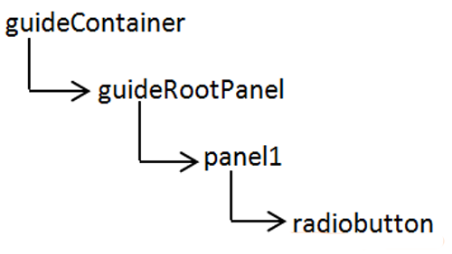

# Uso de expresiones SOM en formularios adaptables{#using-som-expressions-in-adaptive-forms}

Los formularios adaptables se modelan como páginas de AEM que se representan como una estructura de contenido JCR en el repositorio de AEM. El elemento clave de la estructura de contenido es el nodo guideContainer. Debajo de guideContainer, está el panel raíz rootPanel, que puede contener paneles y campos anidados.

Puede utilizar un modelo de objetos de scripts (SOM) para hacer referencia a valores, propiedades y métodos dentro de un modelo de objetos de documento (DOM) concreto. Un DOM organiza los objetos de memoria y las propiedades en una jerarquía de árbol. Una expresión SOM hace referencia a los elementos y paneles de campos/dibujo.

La siguiente imagen muestra la estructura de nodos a la que se traduce un formulario adaptable cuando se agregan componentes a un formulario. Por ejemplo, puede agregar un panel al panel raíz y un botón de opción al panel que se transforme en un DOM durante el tiempo de ejecución. La expresión SOM del campo de botón de opción del formulario adaptable se especifica como `guide[0].guide1[0].guideRootPanel[0].panel1[0].radiobutton[0]`.

Árbol DOM

La expresión SOM de cualquier elemento de un formulario adaptable lleva el prefijo `guide[0].guide1[0]`. La posición de un componente en la jerarquía de estructuras de nodos se utiliza para derivar su expresión SOM.

Árbol DOM con dos botones de opción

La expresión SOM cambia al cambiar la posición de los botones de opción del formulario adaptable. En el modo Autor, puede ver la expresión SOM de un campo o elemento de [!DNL AEM Forms] utilizando la opción Ver expresión SOM. La opción aparece en el panel y al hacer clic con el botón derecho en el campo o elemento.

Extracción de expresiones SOM en un formulario adaptable

En los paneles, puede acceder a la función desde la barra de herramientas del panel. La función facilita los scripts de los autores de formularios adaptables.

Extraer expresiones SOM mediante la barra de herramientas del panel

Algunas API enumeradas en [GuideBridge](https://helpx.adobe.com/es/aem-forms/6/javascript-api/GuideBridge.html) utilizan la expresión SOM de un elemento. Por ejemplo, para establecer el enfoque en un campo concreto de un formulario adaptable, pase la expresión SOM correspondiente a la API `getFocus` en `guideBridge`.
