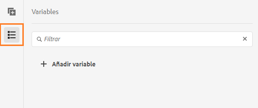
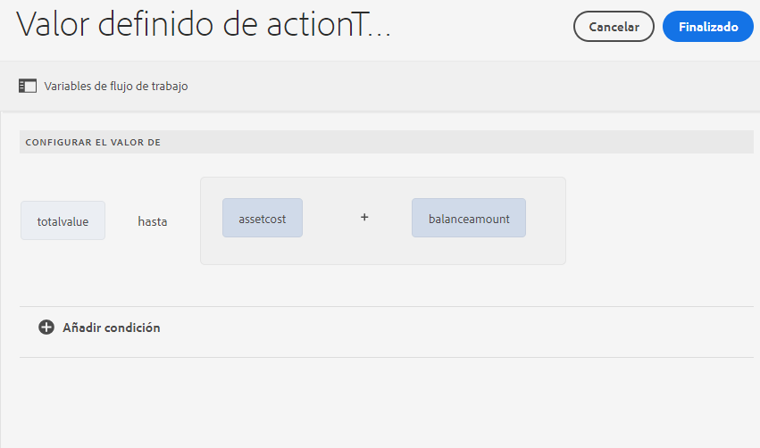
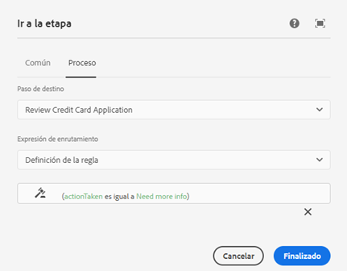

# Variables en flujos de trabajo de AEM centrados en Forms {#variables-in-aem-forms-workflows}

| Versión | Vínculo del artículo |
| -------- | ---------------------------- |
| AEM 6.5 | [Haga clic aquí](https://experienceleague.adobe.com/docs/experience-manager-65/forms/workflows/variable-in-aem-workflows.html?lang=es) |
| AEM as a Cloud Service | Este artículo |

Una variable en un modelo de flujo de trabajo es una forma de almacenar un valor basado en su tipo de datos. Puede utilizar el nombre de la variable en cualquier paso del flujo de trabajo para recuperar el valor almacenado en la variable. También puede utilizar nombres de variables para definir expresiones para tomar decisiones de enrutamiento.

En modelos de flujo de trabajo de AEM, puede hacer lo siguiente:

* [Crear una variable](variable-in-aem-workflows.md#create-a-variable) de un tipo de datos basada en el tipo de información que desea almacenar en él.
* [Configurar un valor para la variable](variable-in-aem-workflows.md#set-a-variable) mediante el paso del flujo de trabajo Establecer variable.
* [Utilizar la variable](variable-in-aem-workflows.md#use-a-variable) en todos [!DNL AEM Forms] los pasos del flujo de trabajo para recuperar el valor almacenado y en los pasos OR Split y Goto para definir una expresión de enrutamiento.

En el siguiente vídeo se muestra cómo crear, establecer y utilizar variables en los modelos de flujo de trabajo de AEM:

>[!VIDEO](assets/variables_introduction_1_1.mp4)

Las variables son una extensión de la interfaz [MetaDataMap](https://helpx.adobe.com/experience-manager/6-5/sites/developing/using/reference-materials/javadoc/com/adobe/granite/workflow/metadata/MetaDataMap.html). Puede usar [MetaDataMap](https://helpx.adobe.com/experience-manager/6-5/sites/developing/using/reference-materials/javadoc/com/adobe/granite/workflow/metadata/MetaDataMap.html) en ECMAScript para acceder a los metadatos guardados mediante el uso de variables.

## Crear una variable {#create-a-variable}

Las variables se crean mediante la sección Variables disponible en la barra de tareas del modelo de flujo de trabajo. Las variables del flujo de trabajo de AEM admiten los siguientes tipos de datos:

* **Tipos de datos primitivos**: Largo, Doble, Booleano, Fecha y Cadena
* **Tipos de datos complejos**: [Documento](https://helpx.adobe.com/es/experience-manager/6-5/forms/javadocs/com/adobe/aemfd/docmanager/Document.html), [XML](https://docs.oracle.com/javase/8/docs/api/org/w3c/dom/Document.html), [JSON](https://static.javadoc.io/com.google.code.gson/gson/2.3/com/google/gson/JsonObject.html), y la instancia del modelo de datos de formulario.

>[!NOTE]
>
>Los flujos de trabajo solo admiten el formato ISO8601 para las variables de tipo Fecha.

Utilice el tipo de datos ArrayList para crear colecciones de variables. Puede crear una variable ArrayList para todos los tipos de datos primitivos y complejos. Por ejemplo, cree una variable ArrayList y seleccione Cadena como subtipo para almacenar varios valores en cadena mediante el uso de la variable.

Para crear una variable, haga lo siguiente:

1. En una instancia de AEM, navegue hasta Herramientas  > Flujo de trabajo > Modelos.
1. Seleccione **[!UICONTROL Crear]** y especifique el título y un nombre opcional para el modelo de flujo de trabajo. Seleccione el modelo y seleccione **[!UICONTROL Editar]**.
1. Seleccione el icono de variables disponible en la barra de tareas del modelo de flujo de trabajo y seleccione **[!UICONTROL Agregar variable]**.

   

1. En el cuadro de diálogo Agregar variable, especifique el nombre y seleccione el tipo de variable.
1. Seleccione el tipo de datos de la lista desplegable **[!UICONTROL Tipo]** y especifique los siguientes valores:

   * Tipo de datos primitivo: especifique un valor predeterminado opcional para la variable.
   * JSON o XML: especifique una ruta de esquema JSON o XML opcional. El sistema valida la ruta del esquema al asignar y almacenar las propiedades disponibles en este esquema para otra variable.
   * Modelo de datos de formulario (Form Data Model, FDM): especifique una ruta para el modelo de datos de formulario.
   * ArrayList: especifique un subtipo para la colección.

1. Especifique una descripción opcional para la variable y seleccione  para guardar los cambios. La variable se muestra en la lista disponible en el panel izquierdo.

Cuando cree variables, tenga en cuenta las siguientes prácticas:

* Cree tantas variables como requiera un flujo de trabajo. Sin embargo, para conservar los recursos de la base de datos, utilice el número mínimo de variables necesarias y vuelva a utilizar las variables siempre que sea posible.
* Las variables distinguen entre mayúsculas y minúsculas. Asegúrese de hacer referencia a las variables con el mismo caso en el flujo de trabajo.
* Evite utilizar caracteres especiales en el nombre de la variable

## Establecer una variable {#set-a-variable}

Puede utilizar el paso Establecer variable para establecer el valor de una variable y definir el orden en que se configuran los valores. La variable se configura en el orden en que se enumeran las asignaciones de variables en el paso Establecer variable.

Los cambios en los valores de las variables afectan únicamente a la instancia del proceso en que se produce el cambio. Por ejemplo, cuando se inicia un flujo de trabajo y cambian los datos de las variables, los cambios afectan únicamente a esa instancia del flujo de trabajo. Los cambios no afectan a otras instancias del flujo de trabajo que se iniciaron anteriormente o más tarde.

Según el tipo de datos de la variable, puede utilizar las siguientes opciones para establecer su valor:

* **Literal:** Utilice la opción cuando conozca el valor exacto que desea especificar. También puede utilizar la opción para especificar un JSON en forma de cadena.

* **Expresión:** Utilice la opción cuando el valor que se va a utilizar se calcule en función de una expresión. La expresión se crea en el editor de expresiones proporcionado.

* **Notación de puntos JSON:** Utilice la opción para recuperar un valor de una variable de tipo JSON o FDM.
* **XPATH:** Utilice la opción para recuperar un valor de una variable de tipo XML.

* **En relación con la carga útil:** Utilice la opción cuando el valor que se va a guardar en la variable esté disponible en una ruta relativa a la carga útil.

* **Ruta absoluta:** Utilice la opción cuando el valor que se va a guardar en la variable esté disponible en una ruta absoluta.

También puede actualizar elementos específicos de una variable de tipo JSON o XML mediante la notación DOT JSON o XPATH.

### Agregar una asignación entre variables {#add-mapping-between-variables}

Para agregar asignaciones entre variables, haga lo siguiente:

1. En la página de edición del flujo de trabajo, seleccione el icono Pasos en la barra de tareas del modelo de flujo de trabajo.
1. Arrastre y suelte el paso **[!UICONTROL Establecer variable]** en el editor de flujo de trabajo, seleccione el paso y seleccione  (Configurar).
1. En el cuadro de diálogo Establecer variable, seleccione **[!UICONTROL Asignación]** > **[!UICONTROL Agregar asignación]**.
1. En la sección **Variable de mapa**, seleccione la variable para almacenar datos, seleccione el modo de asignación y especifique un valor para almacenar en la variable. Los modos de asignación varían en función del tipo de variable.
1. Asigne más variables para crear una expresión significativa. Seleccione  para guardar los cambios.

### Ejemplo 1: Consultar una variable XML para establecer el valor de una variable en cadena {#example-query-an-xml-variable-to-set-value-for-a-string-variable}

Seleccione una variable de tipo XML para almacenar un archivo XML. Consulte la variable XML para establecer el valor de una variable en cadena para la propiedad disponible en el archivo XML. Utilice el campo **Especificar XPATH para la variable XML** para definir la propiedad que se almacenará en la variable en cadena.

En este ejemplo, seleccione una variable XML **formdata** para almacenar el archivo **cc-app.xml**. Consulte la variable **formdata** para establecer el valor de la variable en cadena **emailaddress** para almacenar el valor de la propiedad **emailAddress** disponible en el archivo **cc-app.xml**.

>[!VIDEO](https://helpx.adobe.com/content/dam/help/en/experience-manager/6-5/forms/using/set_variable_example1.mp4 "Establecer el valor de una variable")

### Ejemplo 2: Usar una expresión para almacenar valores según otras variables {#example2}

Utilice una expresión para calcular la suma de las variables y almacenar el resultado en una variable.

En este ejemplo, utilice el editor de expresiones para definir una expresión para calcular la suma de las variables **assetscost** y **balanceamount** y almacenar el resultado en la variable **totalvalue**.

>[!VIDEO](https://helpx.adobe.com/content/dam/help/en/experience-manager/6-5/forms/using/variables_expression.mp4)

## Usar el editor de expresiones {#use-expression-editor}

También se utilizan expresiones para calcular el valor de una variable durante el tiempo de ejecución. Las variables proporcionan un editor de expresiones para definir expresiones.

Utilice el editor de expresiones para lo siguiente:

* Establecer el valor de las variables mediante otras variables del flujo de trabajo, números o expresiones matemáticas.
* Utilizar variables del flujo de trabajo, cadenas, números o una expresión dentro de una expresión matemática
* Agregar condiciones para establecer los valores de las variables.
* Agregar operadores entre condiciones.



Se basa en el editor de reglas de formularios adaptables con los siguientes cambios. Editor de reglas en variables:

* No admite funciones.
* No proporciona una interfaz de usuario para ver el resumen de las reglas
* No tiene editor de código.
* No admite habilitar y deshabilitar el valor de un objeto.
* No admite la configuración de la propiedad de un objeto.
* No admite llamar a un servicio web.

Para obtener más información, consulte [Editor de reglas de formularios adaptables](rule-editor.md).

## Usar una variable {#use-a-variable}

Puede utilizar variables para recuperar entradas y salidas o para guardar el resultado de un paso. El editor del flujo de trabajo proporciona dos tipos de pasos del flujo de trabajo:

* Pasos del flujo de trabajo compatibles con las variables
* Pasos del flujo de trabajo no compatibles con variables

### Pasos del flujo de trabajo compatibles con las variables {#workflow-steps-with-support-for-variables}

Los pasos del flujo de trabajo Ir a, OR Split y todo [!DNL AEM Forms]admiten variables.

#### Paso OR Split {#or-split-step}

OR Splits crea una división en el flujo de trabajo, tras la cual solo una rama está activa. Este paso le permite introducir rutas de procesamiento condicionales en su flujo de trabajo. Los pasos del flujo de trabajo se agregan a cada rama según sea necesario.

Puede definir la expresión de enrutamiento para una rama mediante una definición de regla, un script ECMA o un script externo.

Puede utilizar variables para definir la expresión de enrutamiento mediante el editor de expresiones. Para obtener más información sobre el uso de expresiones de enrutamiento para el paso OR Split, consulte [Paso OR Split](https://experienceleague.adobe.com/docs/experience-manager-65/developing/extending-aem/extending-workflows/workflows-step-ref.html?lang=es#extending-aem#or-split).

En este ejemplo, antes de definir la expresión de enrutamiento, utilice el [ejemplo 2](variable-in-aem-workflows.md#example2) para establecer el valor de la variable **totalvalue**. La rama 1 está activa si el valor de la variable **totalvalue** es mayor que 50 000. Del mismo modo, puede definir una regla para que la rama 2 se active si el valor de la variable **totalvalue** es menor que 50 000.

>[!VIDEO](https://helpx.adobe.com/content/dam/help/en/experience-manager/6-5/forms/using/variables_orsplit_example.mp4)

Del mismo modo, seleccione una ruta de script externa o especifique el script ECMA para las expresiones de enrutamiento para evaluar la rama activa. Seleccione **[!UICONTROL Cambiar nombre de rama]** para especificar un nombre alternativo para la rama.

<!-- For more examples, see [Create a workflow model](aem-forms-workflow.md#create-a-workflow-model). -->

#### Paso Ir a {#go-to-step}

El **Paso Ir a** permite especificar el siguiente paso en el modelo de flujo de trabajo que se va a ejecutar, según el resultado de una expresión de enrutamiento.

De forma similar al paso OR Split, puede definir la expresión de enrutamiento para el paso Ir a mediante una definición de regla, un script ECMA o un script externo.

Puede utilizar variables para definir la expresión de enrutamiento mediante el editor de expresiones. Para obtener más información sobre el uso de expresiones de enrutamiento para el paso Ir a, consulte [Paso Ir a](https://experienceleague.adobe.com/docs/experience-manager-65/developing/extending-aem/extending-workflows/workflows-step-ref.html?lang=es#extending-aem#goto-step).



En este ejemplo, el paso Ir a especifica la solicitud de la tarjeta de crédito de revisión como el siguiente paso si el valor de la variable **actiontaken** es igual a **Necesita más información**.

Para obtener más ejemplos sobre el uso de la definición de regla en el paso Goto consulte [Simulación de un bucle For](https://experienceleague.adobe.com/docs/experience-manager-65/developing/extending-aem/extending-workflows/workflows-step-ref.html?lang=es#extending-aem#simulateforloop).

#### Pasos del flujo de trabajo centrado en Forms {#forms-workflow-centric-workflow-steps}

Todos[!DNL AEM Forms] los pasos del flujo de trabajo admiten variables. Para obtener más información, consulte [Flujo de trabajo centrado en Forms en OSGi](aem-forms-workflow-step-reference.md).

### Pasos del flujo de trabajo no compatibles con variables {#workflow-steps-without-support-for-variables}

Puede usar la interfaz [MetaDataMap](https://helpx.adobe.com/experience-manager/6-5/sites/developing/using/reference-materials/javadoc/com/adobe/granite/workflow/metadata/MetaDataMap.html) para acceder a variables en pasos del flujo de trabajo que no admiten variables.

#### Recuperar el valor de variable {#retrieve-the-variable-value}

Utilice las siguientes API en el script ECMA para recuperar los valores de variables existentes en función del tipo de datos:

| Tipo de datos variables | API |
|---|---|
| Primitiva (larga, doble, booleano, fecha y en cadena) | workItem.getWorkflowData().getMetaDataMap().get(variableName, type) |
| Documento | Packages.com.adobe.aemfd.docmanager.Document doc = workItem.getWorkflowData().getMetaDataMap().get(&quot;docVar&quot;, Packages.com.adobe.aemfd.docmanager.Document.class); |
| XML | Packages.org.w3c.dom.Document xmlObject = workItem.getWorkflowData().getMetaDataMap().get(variableName, Packages.org.w3c.dom.Document.class); |
| Modelo de datos de formulario (FDM) | Packages.com.adobe.aem.dermis.api.FormDataModelInstance fdmObject = workItem.getWorkflowData().getMetaDataMap().get(variableName, Packages.com.adobe.aem.dermis.api.FormDataModelInstance.class); |
| JSON | Packages.com.google.gson.JsonObject jsonObject = workItem.getWorkflowData().getMetaDataMap().get(variableName, Packages.com.google.gson.JsonObject.class); |


**Ejemplo**

Recupere el valor del tipo de datos en cadena mediante la siguiente API:

```javascript
workItem.getWorkflowData().getMetaDataMap().get(accname, Packages.java.lang.String)
```

#### Actualizar el valor de la variable {#update-the-variable-value}

Utilice la siguiente API en el script ECMA para actualizar el valor de una variable:

```javascript
workItem.getWorkflowData().getMetaDataMap().put(variableName, value)
```

**Ejemplo**

```javascript
workItem.getWorkflowData().getMetaDataMap().put(salary, 50000)
```

Actualiza el valor de la variable **salario** a 50 000.

### Establecer variables para invocar flujos de trabajo {#apiinvokeworkflow}

Puede utilizar una API para establecer variables y aprobarlas para invocar instancias del flujo de trabajo.

[workflowSession.startWorkflow](https://helpx.adobe.com/experience-manager/6-5/sites/developing/using/reference-materials/javadoc/com/adobe/granite/workflow/WorkflowSession.html#startWorkflow-com.adobe.granite.workflow.model.WorkflowModel-com.adobe.granite.workflow.exec.WorkflowData-java.util.Map-) utiliza model, wfData y metaData como argumentos. Utilice MetaDataMap para establecer el valor de la variable.

En esta API, la variable **variableName** se configura como **value** mediante el uso de metaData.put(variableName, value);

```javascript
import com.adobe.granite.workflow.model.WorkflowModel;
import com.adobe.granite.workflow.metadata.MetaDataMap;
import com.adobe.aemfd.docmanager.Document;

/*Assume that you already have a workflowSession and modelId along with the payloadType and payload*/
WorkflowData wfData = workflowSession.newWorkflowData(payloadType, payload);
MetaDataMap metaData = wfData.getMetaDataMap();
metaData.put(variableName, value); //Create a variable "variableName" in your workflow model
WorkflowModel model = workflowSession.getModel(modelId);
workflowSession.startWorkflow(model, wfData, metaData);
```

**Ejemplo**

Inicialice el objeto de documento **doc** a una ruta (“a/b/c”) y establezca el valor de la variable **docVar** a la ruta almacenada en el objeto de documento.

```javascript
import com.adobe.granite.workflow.WorkflowSession;
import com.adobe.granite.workflow.exec.WorkflowData;
import com.adobe.granite.workflow.model.WorkflowModel;
import com.adobe.granite.workflow.metadata.MetaDataMap;
import com.adobe.aemfd.docmanager.Document;

/*This example assumes that you already have a workflowSession and modelId along with the payloadType and payload */
WorkflowData wfData = workflowSession.newWorkflowData(payloadType, payload);
MetaDataMap metaData = wfData.getMetaDataMap();
Document doc = new Document("/a/b/c");// initialize a document object
metaData.put("docVar",doc); //Assuming that you have created a variable "docVar" of type Document in your workflow model
WorkflowModel model = workflowSession.getModel(modelId);
workflowSession.startWorkflow(model, wfData, metaData);
```

## Editar una variable {#edit-a-variable}

1. En la página Editar flujo de trabajo, seleccione el icono Variables de la barra de tareas del modelo de flujo de trabajo. La sección Variables del panel izquierdo muestra todas las variables existentes.
1. Seleccione el icono  (Editar) junto al nombre de la variable que desea editar.
1. Edite la información de la variable y seleccione  para guardar los cambios. No se pueden editar los campos **[!UICONTROL Nombre]** y **[!UICONTROL Tipo]** para una variable.

## Eliminar una variable {#delete-a-variable}

Antes de eliminar la variable, elimine todas las referencias de la variable del flujo de trabajo. Asegúrese de que la variable no se utilice en el flujo de trabajo.

Para eliminar una variable, haga lo siguiente:

1. En la página Editar flujo de trabajo, seleccione el icono Variables de la barra de tareas del modelo de flujo de trabajo. La sección Variables del panel izquierdo muestra todas las variables existentes.
1. Seleccione el icono Eliminar junto al nombre de la variable que desee eliminar.
1. Seleccione  para confirmar y eliminar la variable.

## Referencias {#references}

Para obtener más ejemplos sobre el uso de variables en Pasos del flujo de trabajo de [!DNL AEM Forms], consulte [Variables en flujos de trabajo de AEM](https://helpx.adobe.com/experience-manager/kt/forms/using/authoring_variables_in_aem_forms-workflow1.html).
