# Trabajo con el modelo de datos de formulario {#work-with-form-data-model}


El editor del Modelo de datos de formulario proporciona una interfaz de usuario intuitiva y herramientas para editar y configurar un modelo de datos de formulario. Con el editor, se pueden agregar y configurar objetos, propiedades y servicios del modelo de datos desde orígenes de datos asociados en el modelo de datos de formulario. Además, permite crear objetos y propiedades de modelos de datos sin orígenes de datos y enlazarlos posteriormente con objetos y propiedades de modelos de datos respectivos. También puede generar y editar datos de ejemplo para propiedades de objetos del modelo de datos que puede utilizar para rellenar previamente Forms adaptable <!--and interactive communications--> al previsualizar. Puede probar los objetos y servicios del modelo de datos configurados en un Modelo de datos de formulario para asegurarse de que está correctamente integrado con los orígenes de datos.

Si es nuevo en la integración de datos de Forms y no ha configurado un origen de datos o creado un modelo de datos de formulario, consulte los temas siguientes:

* [[!DNL Experience Manager Forms] Integración de datos](data-integration.md)
* [Configuración de fuentes de datos](configure-data-sources.md)
* [Crear modelo de datos de formulario](create-form-data-models.md)

Continúe leyendo para obtener más información sobre las diversas tareas y configuraciones que puede realizar con el editor del Modelo de datos de formulario.

>[!NOTE]
>
>Debe ser miembro de ambas **fdm-author** y **forms-user** grupos para poder crear y trabajar con el modelo de datos de formulario. Póngase en contacto con su [!DNL Experience Manager] administrador para convertirse en miembro de los grupos.

## Adición de objetos y servicios del modelo de datos {#add-data-model-objects-and-services}

Si ha creado un Modelo de datos de formulario con orígenes de datos, puede utilizar el editor del Modelo de datos de formulario para agregar objetos y servicios del modelo de datos, configurar sus propiedades, crear asociaciones entre objetos del modelo de datos y probar el Modelo de datos de formulario y los servicios.

Puede agregar objetos y servicios del modelo de datos desde orígenes de datos disponibles en el modelo de datos de formulario. Cuando los objetos del modelo de datos añadidos aparecen en la ficha Modelo, los servicios añadidos aparecen en la pestaña Servicios.

Para agregar objetos y servicios del modelo de datos:

1. Inicie sesión en el [!DNL Experience Manager] instancia de autor, vaya a **[!UICONTROL Forms > Integraciones de datos]** y abra el Modelo de datos de formulario en el que desea agregar objetos del modelo de datos.
1. En el panel Fuentes de datos , expanda las fuentes de datos para ver los objetos y servicios disponibles del modelo de datos.
1. Seleccione los objetos y servicios del modelo de datos que desea agregar al Modelo de datos de formulario y pulse **[!UICONTROL Agregar selección]**.

   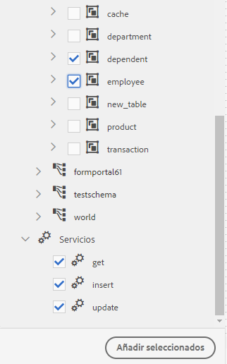

   Objetos y servicios del modelo de datos seleccionado

   La variable **[!UICONTROL Modelo]** muestra una representación gráfica de todos los objetos del modelo de datos y sus propiedades agregadas al modelo de datos del formulario. Cada objeto del modelo de datos se representa mediante un cuadro en el modelo de datos del formulario.

   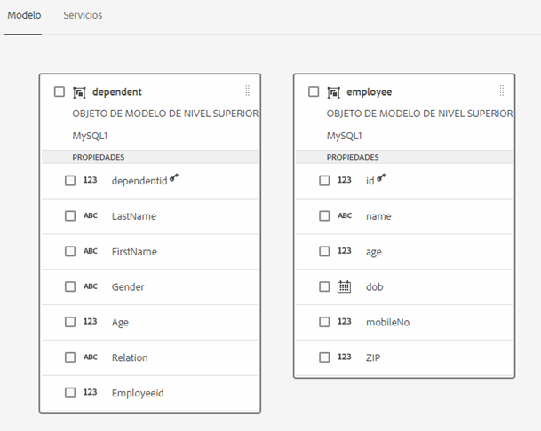

   **[!UICONTROL Modelo]** muestra los objetos del modelo de datos agregados

   >[!NOTE]
   >
   >Puede mantener y arrastrar cuadros de objetos del modelo de datos alrededor para organizarlos en el área de contenido. Todos los objetos del modelo de datos agregados en el Modelo de datos de formulario aparecen atenuados en el panel Fuentes de datos.

   La variable **[!UICONTROL Servicios]** lista de servicios añadidos.

   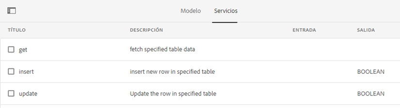

   **[!UICONTROL Servicios]** la pestaña muestra los servicios del modelo de datos

   >[!NOTE]
   >
   >Además de los objetos y servicios del modelo de datos, el documento de metadatos del servicio OData incluye propiedades de navegación que definen la asociación entre dos objetos del modelo de datos. Para obtener más información, consulte [Uso de las propiedades de navegación de los servicios de OData](#work-with-navigation-properties-of-odata-services).

1. Toque **[!UICONTROL Guardar]** para guardar el objeto del modelo de formulario.

   >[!NOTE]
   >
   >Puede invocar los servicios que configuró en la ficha Servicios de un Modelo de datos de formulario mediante las reglas del Formulario adaptable. Los servicios configurados están disponibles en la acción Invocar servicios del editor de reglas Para obtener más información sobre el uso de estos servicios en las reglas de Formulario adaptable, consulte Invocar servicios y establecer el valor de las reglas en [editor de reglas](rule-editor.md).

## Creación de objetos del modelo de datos y propiedades secundarias {#create-data-model-objects-and-child-properties}

### Creación de objetos del modelo de datos {#create-data-model-objects}

Aunque puede agregar objetos de modelo de datos desde orígenes de datos configurados, también puede crear objetos o entidades de modelo de datos sin orígenes de datos. Resulta útil, especialmente si no se han configurado orígenes de datos en el modelo de datos de formulario.

Para crear un objeto de modelo de datos sin orígenes de datos:

1. Inicie sesión en el [!DNL Experience Manager] instancia de autor, vaya a **[!UICONTROL Forms > Integraciones de datos]** y abra el Modelo de datos de formulario en el que desea crear una entidad u objeto del modelo de datos.
1. Toque **[!UICONTROL Crear entidad]**.
1. En el [!UICONTROL Crear modelo de datos] , especifique un nombre para el objeto del modelo de datos y toque **[!UICONTROL Agregar]**. Se agrega un objeto de modelo de datos al modelo de datos del formulario. El objeto del modelo de datos recién agregado no está enlazado a un origen de datos y no tiene propiedades como se muestra en la siguiente imagen.

   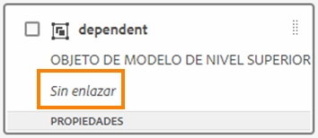

A continuación, puede agregar propiedades secundarias en objetos del modelo de datos no enlazados.

### Agregar propiedades secundarias {#child-properties}

El editor del Modelo de datos de formulario permite crear propiedades secundarias en un objeto del modelo de datos. La propiedad cuando se crea no está enlazada a ninguna propiedad de un origen de datos. Posteriormente, puede enlazar la propiedad secundaria con otra propiedad del objeto del modelo de datos que la contiene.

Para crear una propiedad secundaria:

1. En un modelo de datos de formulario, seleccione un objeto de modelo de datos y pulse **[!UICONTROL Crear propiedad secundaria]**.
1. En el **[!UICONTROL Crear propiedad secundaria]** , especifique un nombre y un tipo de datos para la propiedad en la variable **[!UICONTROL Nombre]** y **[!UICONTROL Tipo]** , respectivamente. Si lo desea, puede especificar un título y una descripción para la propiedad.
1. Habilitar Calculado si la propiedad es una propiedad calculada. El valor de una propiedad calculada se evalúa en función de una regla o una expresión. Para obtener más información, consulte [Editar propiedades](#properties).
1. Si el objeto del modelo de datos está enlazado a un origen de datos, la propiedad secundaria añadida se enlazará automáticamente a la propiedad del objeto del modelo de datos principal con el mismo nombre y tipo de datos.

   Para enlazar manualmente una propiedad secundaria con una propiedad de objeto del modelo de datos, pulse el icono Examinar situado junto al **[!UICONTROL Referencia de enlace]** campo . La variable **[!UICONTROL Seleccionar objeto]** el cuadro de diálogo muestra todas las propiedades del objeto del modelo de datos principal. Seleccione una propiedad con la que enlazar y pulse el icono de visto. Solo puede seleccionar una propiedad del mismo tipo de datos que la propiedad secundaria.

1. Toque **[!UICONTROL Listo]** para guardar la propiedad secundaria y pulse **[!UICONTROL Guardar]** para guardar el modelo de datos del formulario. La propiedad secundaria se agrega ahora al objeto del modelo de datos.

Después de crear objetos y propiedades del modelo de datos, puede seguir creando Forms adaptable <!--and interactive communications--> basado en el modelo de datos de formulario. Posteriormente, cuando haya orígenes de datos disponibles y configurados, puede enlazar el Modelo de datos de formulario con orígenes de datos. El enlace se actualiza automáticamente en la Forms adaptable asociada <!--and interactive communications-->. Para obtener más información sobre la creación de Forms adaptable <!--and interactive communications--> utilizando el modelo de datos de formulario, consulte [Uso del modelo de datos de formulario](using-form-data-model.md).

### Enlace de objetos y propiedades del modelo de datos {#bind-data-model-objects-and-properties}

Cuando los orígenes de datos que desea integrar con el Modelo de datos de formulario están disponibles, puede agregarlos al Modelo de datos de formulario como se describe en [Actualización de fuentes de datos](create-form-data-models.md#update). A continuación, haga lo siguiente para enlazar los objetos y propiedades del modelo de datos independiente:

1. En el modelo de datos de formulario, seleccione el origen de datos independiente que desea enlazar con un origen de datos.
1. Toque **[!UICONTROL Editar propiedades]**.
1. En el **[!UICONTROL Editar propiedades]** , pulse el icono Examinar situado junto al panel **[!UICONTROL Enlace]** campo . Abre el **[!UICONTROL Seleccionar objeto]** que enumera los orígenes de datos agregados en el modelo de datos de formulario.

   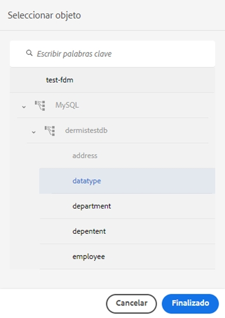

1. Expanda el árbol de fuentes de datos y seleccione un objeto de modelo de datos para enlazar con el icono de marca de verificación y tocarlo.
1. Toque **[!UICONTROL Listo]** para guardar las propiedades y, a continuación, pulse **[!UICONTROL Guardar]** para guardar el modelo de datos de formulario. El objeto del modelo de datos ahora está enlazado con un origen de datos. Observe que el objeto del modelo de datos ya no está marcado como Unbound.

   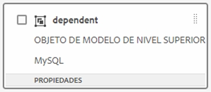

## Configurar servicios {#configure-services}

Para leer y escribir datos para un objeto de modelo de datos, haga lo siguiente para configurar los servicios de lectura y escritura:

1. Seleccione la casilla de verificación situada en la parte superior de un objeto del modelo de datos para seleccionarlo y pulsar **[!UICONTROL Editar propiedades]**.

   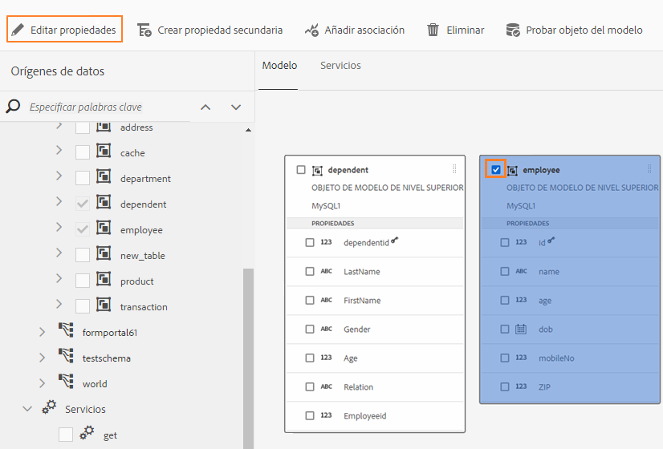

   Editar propiedades para configurar los servicios de lectura y escritura de un objeto de modelo de datos

   La variable [!UICONTROL Editar propiedades] se abre.

   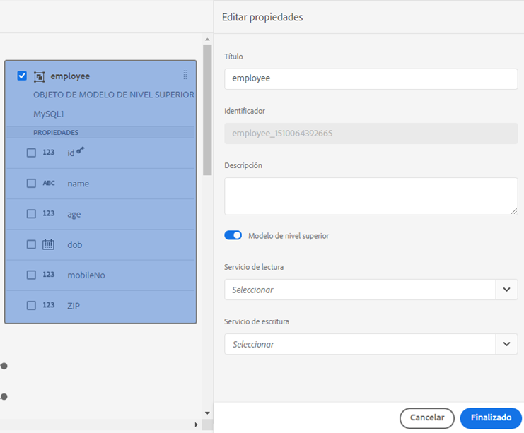

   Cuadro de diálogo Editar propiedades

   >[!NOTE]
   >
   >Además de los objetos y servicios del modelo de datos, el documento de metadatos del servicio OData incluye propiedades de navegación que definen la asociación entre dos objetos del modelo de datos. Cuando se agrega un origen de datos del servicio OData a un Modelo de datos de formulario, hay un servicio disponible en el Modelo de datos de formulario para todas las propiedades de navegación de un objeto del modelo de datos. Puede utilizar este servicio para leer las propiedades de navegación del objeto del modelo de datos correspondiente.
   >
   >
   >Para obtener más información sobre el uso del servicio, consulte [Uso de las propiedades de navegación de los servicios de OData](#work-with-navigation-properties-of-odata-services).

1. Alternar **[!UICONTROL Objeto de nivel superior]** para especificar si el objeto del modelo de datos es un objeto de modelo de nivel superior.

   Los objetos del modelo de datos configurados en un Modelo de datos de formulario están disponibles para su uso en la ficha Objetos del modelo de datos del explorador de contenido de un Formulario adaptable basado en el modelo de datos del formulario. Cuando se agrega una asociación entre dos objetos del modelo de datos, el objeto del modelo de datos con el que se asocia se anida en el objeto del modelo de datos que se asocia en la variable **[!UICONTROL Objetos del modelo de datos]** pestaña . Si el modelo de datos anidado es un objeto de nivel superior, también aparece por separado en la variable **[!UICONTROL Objetos del modelo de datos]** pestaña . Por lo tanto, se ven dos entradas, una dentro y otra fuera de la jerarquía anidada, que pueden confundir a los autores del formulario. Para que el objeto del modelo de datos asociado aparezca solo en la jerarquía anidada, desactive la propiedad Objeto de nivel superior.

1. Seleccione Read and Write services para los objetos del modelo de datos seleccionado. Aparecen los argumentos de los servicios.

   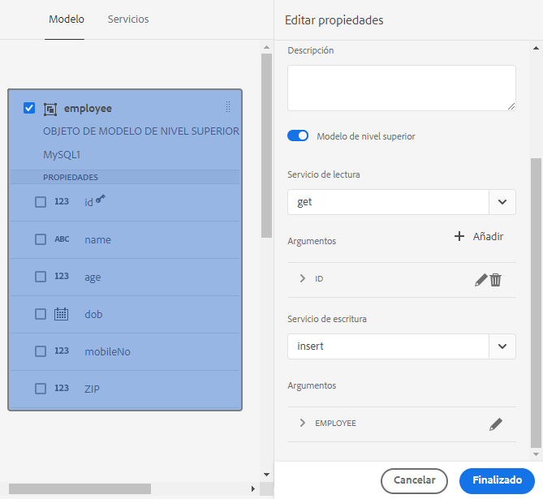

   Servicios de lectura y escritura configurados para la fuente de datos de los empleados

1. Toque  para el argumento de servicio de lectura a [enlazar el argumento a un atributo de perfil de usuario, atributo de solicitud o valor literal](#bindargument) y especifique el valor de enlace.
1. Toque **[!UICONTROL Listo]** para guardar el argumento, **[!UICONTROL Listo]** para guardar las propiedades y, a continuación, **[!UICONTROL Guardar]** para guardar el modelo de datos de formulario.

### Vincular argumentos de servicio de lectura {#bindargument}

Enlace el argumento de servicio de lectura a un atributo de perfil de usuario, atributo de solicitud o valor literal basado en un valor de enlace. El valor se pasa al servicio como un argumento para recuperar detalles asociados con el valor especificado del origen de datos.

#### Valor literal {#literal-value}

Select **[!UICONTROL Literal]** de la variable **[!UICONTROL Enlace a]** menú desplegable e introduzca un valor en la **[!UICONTROL Valor de enlace]** campo . Los detalles asociados con el valor se recuperan del origen de datos. Utilice esta opción para recuperar los detalles asociados a un valor estático.

En este ejemplo, los detalles asociados con **4367655678**, como el valor de la variable `mobilenum` , se recuperan del origen de datos. Los detalles asociados si transfiere el valor de un argumento de número móvil pueden incluir propiedades como nombre de cliente, dirección de cliente y ciudad.

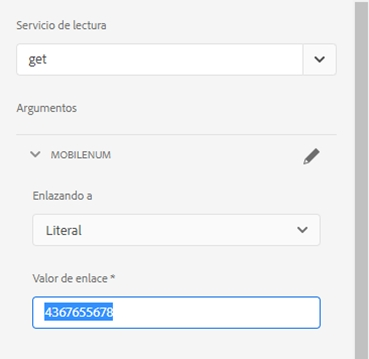

#### Atributo de perfil de usuario {#user-profile-attribute}

Select **[!UICONTROL Atributo de perfil de usuario]** de la variable **[!UICONTROL Enlace a]** menú desplegable e introduzca el nombre del atributo en la **[!UICONTROL Valor de enlace]** campo . Los detalles del usuario que ha iniciado sesión en la [!DNL Experience Manager] se recuperan del origen de datos en función del nombre del atributo.

El nombre de atributo especificado en la variable **[!UICONTROL Valor de enlace]** debe incluir la ruta de enlace completa hasta el nombre del atributo del usuario. Abra la siguiente URL para acceder a los detalles del usuario sobre CRXDE:

`https://[server-name]:[port]/crx/de/index.jsp#/home/users/`

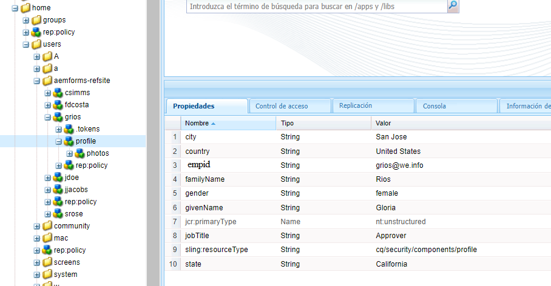

En este ejemplo, especifique `profile.empid` en el **[!UICONTROL Valor de enlace]** para la variable `grios` usuario.

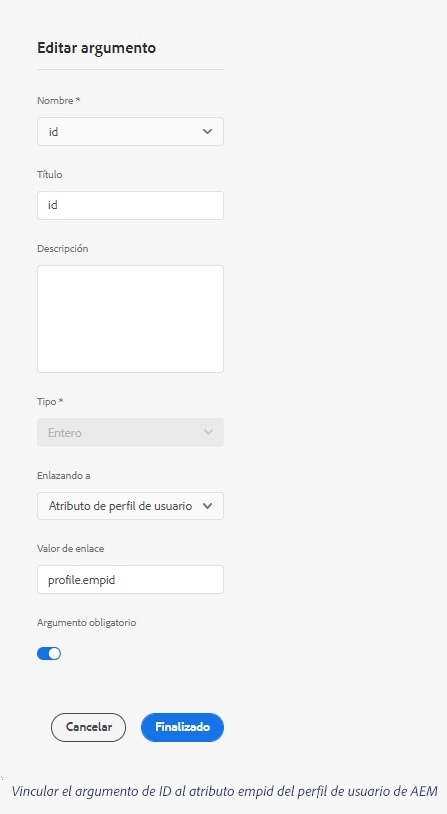

La variable `id` toma el valor de la variable `empid` del perfil de usuario y pasarlo como argumento al servicio de lectura. Lee y devuelve valores de propiedades asociadas del objeto del modelo de datos de empleado para el `empid` asociado al usuario que ha iniciado sesión.

#### Solicitar atributo {#request-attribute}

Utilice el atributo de solicitud para recuperar las propiedades asociadas del origen de datos.

1. Select **[!UICONTROL Atributo de solicitud]** de la variable **[!UICONTROL Enlace a]** menú desplegable e introduzca el nombre del atributo en la **[!UICONTROL Valor de enlace]** campo .

1. Cree un [superposición](https://experienceleague.adobe.com/docs/experience-manager-cloud-service/implementing/developing/full-stack/overlays.html?lang=en#developing) para head.jsp. Para crear la superposición, abra CRX DE y copie el `https://<server-name>:<port number>/crx/de/index.jsp#/libs/fd/af/components/page2/afStaticTemplatePage/head.jsp` a `https://<server-name>:<port number>/crx/de/index.jsp#/apps/fd/af/components/page2/afStaticTemplatePage/head.jsp`

   >[!NOTE]
   >
   > * Si utiliza una plantilla estática, superponga head.jsp en:
      >   `/libs/fd/af/components/page2/afStaticTemplatePage/head.jsp`
   > * Si utiliza una plantilla editable, superponga aftemplatedpage.jsp en:
      >   `/libs/fd/af/components/page2/aftemplatedpage/aftemplatedpage.jsp`


1. Establezca [!DNL paramMap] para el atributo de solicitud. Por ejemplo, incluya el siguiente código en el archivo .jsp de la carpeta de aplicaciones:

   ```javascript
   <%Map paraMap = new HashMap();
    paraMap.put("<request_attribute>",request.getParameter("<request_attribute>"));
    request.setAttribute("paramMap",paraMap);
   ```

   Por ejemplo, utilice el siguiente código para recuperar el valor de petid de la fuente de datos:


   ```javascript
   <%Map paraMap = new HashMap();
   paraMap.put("petId",request.getParameter("petId"));
   request.setAttribute("paramMap",paraMap);%>
   ```

Los detalles se recuperan de la fuente de datos en función del nombre de atributo especificado en la solicitud.

Por ejemplo, si especifica el atributo como `petid=100` en la solicitud recupera las propiedades asociadas al valor del atributo desde el origen de datos.

## Añadir asociaciones {#add-associations}

Normalmente, hay asociaciones creadas entre objetos del modelo de datos en un origen de datos. La asociación puede ser de uno a uno o de uno a varios. Por ejemplo, puede haber varios dependientes asociados a un empleado. Se denomina asociación &quot;uno a varios&quot; y se representa mediante `1:n` en la línea que conecta los objetos del modelo de datos asociados. Sin embargo, si una asociación devuelve un nombre de empleado único para un ID de empleado determinado, se denomina asociación uno a uno.

Cuando se agregan objetos del modelo de datos asociados en un origen de datos a un modelo de datos de formulario, sus asociaciones se retienen y se muestran como conectadas mediante líneas de flecha. Puede agregar asociaciones entre objetos del modelo de datos en distintos orígenes de datos en un modelo de datos de formulario.

>[!NOTE]
>
>Las asociaciones predefinidas en un origen de datos JDBC no se conservan en el modelo de datos de formulario. Debe crearlos manualmente.

Para añadir una asociación:

1. Seleccione la casilla de verificación situada en la parte superior de un objeto del modelo de datos para seleccionarlo y pulsar **[!UICONTROL Agregar asociación]**. Se abre el cuadro de diálogo Agregar asociación .

   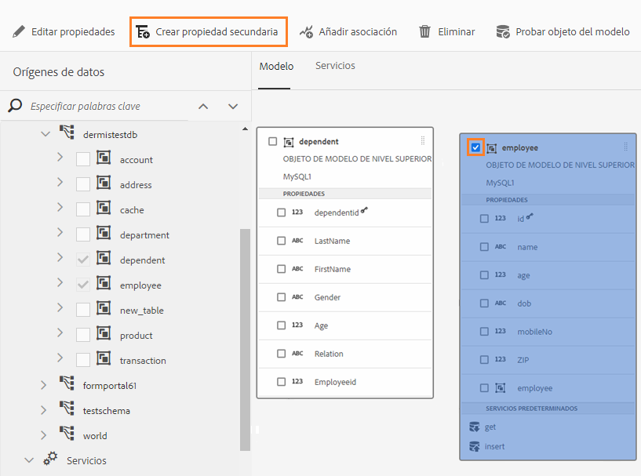

   >[!NOTE]
   >
   >Además de los objetos y servicios del modelo de datos, el documento de metadatos del servicio OData incluye propiedades de navegación que definen la asociación entre dos objetos del modelo de datos. Puede utilizar estas propiedades de navegación cuando agregue asociaciones en el Modelo de datos de formulario. Para obtener más información, consulte [Uso de las propiedades de navegación de los servicios de OData](#work-with-navigation-properties-of-odata-services).

   La variable [!UICONTROL Agregar asociación] se abre.

   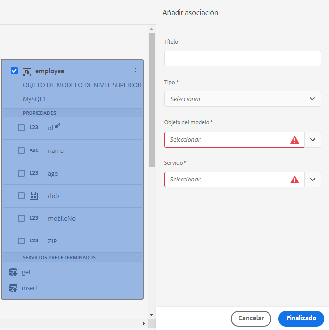

   Cuadro de diálogo Agregar asociación

1. En el panel Agregar asociación :

   * Especifique un título para la asociación.
   * Seleccione el tipo de asociación — **[!UICONTROL Uno a uno]** o **[!UICONTROL Uno a muchos]**.
   * Seleccione el objeto del modelo de datos que desea asociar.
   * Seleccione el servicio de lectura para leer los datos del objeto de modelo seleccionado. Aparece el argumento de servicio de lectura. Edite para cambiar el argumento, si es necesario, y enlácelo a la propiedad del objeto del modelo de datos que desea asociar.

   En el siguiente ejemplo, el argumento predeterminado para el servicio de lectura del objeto del modelo de datos Dependent es `dependentid`.

   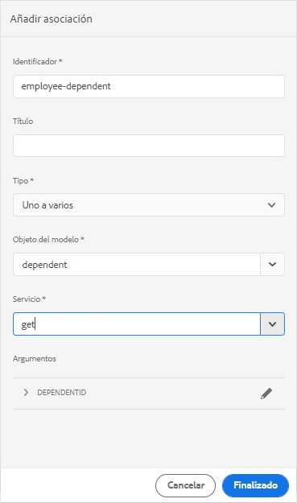

   El argumento predeterminado para el servicio de lectura de dependientes es dependiente

   Sin embargo, el argumento debe ser una propiedad común entre el objeto del modelo de datos asociado, que en este ejemplo es `Employeeid`. Por lo tanto, la variable `Employeeid` El argumento debe enlazarse a la variable `id` propiedad del objeto del modelo de datos Empleado para recuperar los detalles de dependientes asociados del objeto del modelo de datos Dependientes.

   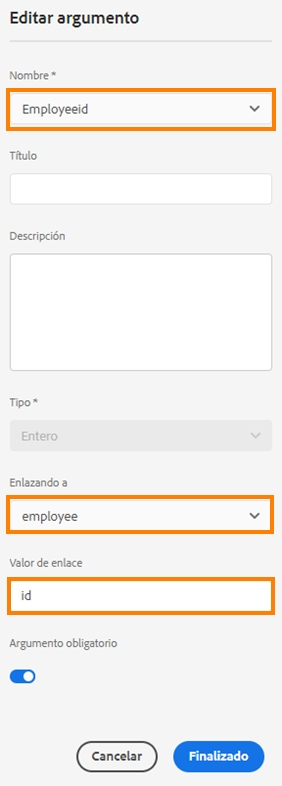

   Argumento y enlace actualizados

   Toque **[!UICONTROL Listo]** para guardar el argumento .

1. Toque **[!UICONTROL Listo]** para guardar la asociación y, a continuación, **[!UICONTROL Guardar]** para guardar el modelo de datos de formulario.
1. Repita los pasos para crear más asociaciones según sea necesario.

>[!NOTE]
>
>La asociación añadida aparece en el cuadro de objetos del modelo de datos con el título especificado y una línea que conecta los objetos del modelo de datos asociados.
>
>Para editar una asociación, seleccione la casilla de verificación correspondiente y pulse **[!UICONTROL Editar asociación]**.

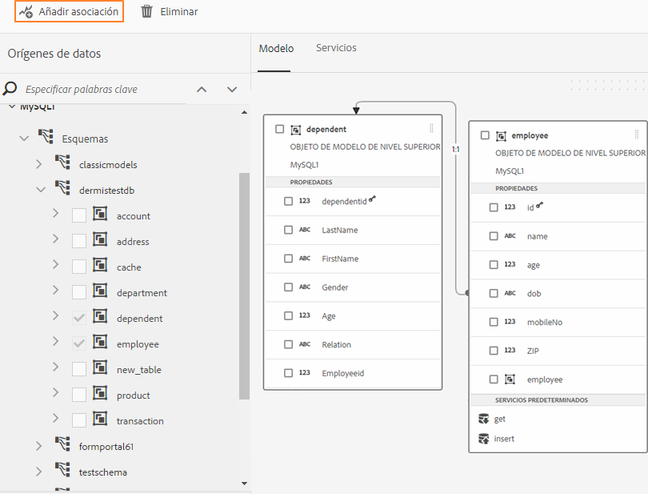

## Editar propiedades {#properties}

Puede editar las propiedades de los objetos del modelo de datos, sus propiedades y los servicios que se agreguen en el modelo de datos de formulario.

Para editar propiedades:

1. Active la casilla de verificación situada junto a un objeto de modelo de datos, una propiedad o un servicio del modelo de datos de formulario.
1. Toque **[!UICONTROL Editar propiedades]**. La variable **[!UICONTROL Editar propiedades]** para las aperturas de objeto, propiedad o servicio del modelo seleccionado.

   * **[!UICONTROL Objeto del modelo de datos]**: Especifique los servicios de lectura y escritura y edite los argumentos.
   * **[!UICONTROL Propiedad]**: Especifique el tipo, subtipo y formato de la propiedad. También puede especificar si la propiedad seleccionada es la clave principal del objeto del modelo de datos.
   * **[!UICONTROL Servicio]**: Especifique el objeto del modelo de entrada, el tipo de salida y los argumentos del servicio. Para un servicio Get, puede especificar si se espera que devuelva una matriz.

      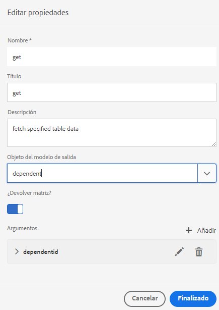
   Cuadro de diálogo Editar propiedades para obtener un servicio

1. Toque **[!UICONTROL Listo]** para guardar las propiedades y, a continuación, **[!UICONTROL Guardar]** para guardar el modelo de datos de formulario.

### Crear propiedades calculadas {#computed}

Una propiedad calculada es aquella cuyo valor se calcula en función de una regla o una expresión. Con una regla, puede establecer el valor de una propiedad calculada en una cadena literal, un número, el resultado de una expresión matemática o el valor de otra propiedad en el modelo de datos del formulario.

Por ejemplo, puede crear una propiedad calculada **FullName** cuyo valor es resultado de la concatenación de la variable **Nombre** y **Apellido** propiedades. Para ello:

1. Crear una nueva propiedad con el nombre `FullName` cuyo tipo de datos es String.
1. Habilitar **[!UICONTROL Calculado]** y toque **[!UICONTROL Listo]** para crear la propiedad.

   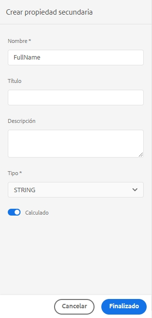

   Se crea la propiedad calculada FullName. Fíjese en el icono que aparece junto a la propiedad para mostrar una propiedad calculada.

   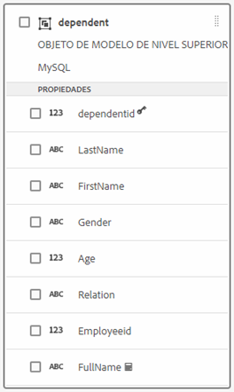

1. Seleccione la propiedad FullName y pulse **[!UICONTROL Editar regla]**. Se abre una ventana del editor de reglas.
1. En la ventana del editor de reglas, pulse **[!UICONTROL Crear]**. A **[!UICONTROL Definir valor]** se abre la ventana de regla.

   En la lista desplegable Seleccionar opción , seleccione **[!UICONTROL Expresión matemática]**. Otras opciones disponibles son **[!UICONTROL Objeto Modelo de datos de formulario]** y **[!UICONTROL Cadena]**.

1. En la expresión matemática, seleccione **[!UICONTROL Nombre]** y **[!UICONTROL Apellido]** en los objetos primero y segundo, respectivamente. Select **[!UICONTROL plus]** como operador.

   Toque **[!UICONTROL Listo]** y, a continuación, toque **[!UICONTROL Cerrar]** para cerrar la ventana del editor de reglas. La regla tiene un aspecto similar al siguiente.

   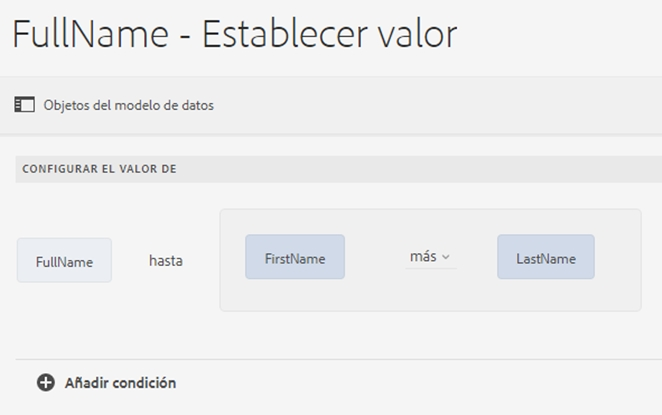

1. En el modelo de datos de formulario, pulse **[!UICONTROL Guardar]**. La propiedad calculada está configurada.

## Trabajar con propiedades de navegación de los servicios de OData {#work-with-navigation-properties-of-odata-services}

En los servicios OData, las propiedades de navegación se utilizan para definir asociaciones entre dos objetos del modelo de datos. Estas propiedades se definen en un tipo de entidad o un tipo complejo. Por ejemplo, en el siguiente extracto del archivo de metadatos de la muestra [TripPin](https://www.odata.org/blog/trippin-new-odata-v4-sample-service/) Servicios de ejemplo de OData, la entidad persona contiene tres propiedades de navegación: Amigos, BestFriend y Viajes.

Para obtener más información sobre las propiedades de navegación, consulte [Documentación de OData](https://docs.oasis-open.org/odata/odata/v4.0/errata03/os/complete/part3-csdl/odata-v4.0-errata03-os-part3-csdl-complete.html#_Toc453752536).

```xml
<edmx:Edmx xmlns:edmx="https://docs.oasis-open.org/odata/ns/edmx" Version="4.0">
<script/>
<edmx:DataServices>
<Schema xmlns="https://docs.oasis-open.org/odata/ns/edm" Namespace="Microsoft.OData.Service.Sample.TrippinInMemory.Models">
<EntityType Name="Person">
<Key>
<PropertyRef Name="UserName"/>
</Key>
<Property Name="UserName" Type="Edm.String" Nullable="false"/>
<Property Name="FirstName" Type="Edm.String" Nullable="false"/>
<Property Name="LastName" Type="Edm.String"/>
<Property Name="MiddleName" Type="Edm.String"/>
<Property Name="Gender" Type="Microsoft.OData.Service.Sample.TrippinInMemory.Models.PersonGender" Nullable="false"/>
<Property Name="Age" Type="Edm.Int64"/>
<Property Name="Emails" Type="Collection(Edm.String)"/>
<Property Name="AddressInfo" Type="Collection(Microsoft.OData.Service.Sample.TrippinInMemory.Models.Location)"/>
<Property Name="HomeAddress" Type="Microsoft.OData.Service.Sample.TrippinInMemory.Models.Location"/>
<Property Name="FavoriteFeature" Type="Microsoft.OData.Service.Sample.TrippinInMemory.Models.Feature" Nullable="false"/>
<Property Name="Features" Type="Collection(Microsoft.OData.Service.Sample.TrippinInMemory.Models.Feature)" Nullable="false"/>
<NavigationProperty Name="Friends" Type="Collection(Microsoft.OData.Service.Sample.TrippinInMemory.Models.Person)"/>
<NavigationProperty Name="BestFriend" Type="Microsoft.OData.Service.Sample.TrippinInMemory.Models.Person"/>
<NavigationProperty Name="Trips" Type="Collection(Microsoft.OData.Service.Sample.TrippinInMemory.Models.Trip)"/>
</EntityType>
```

Al configurar un servicio OData en un Modelo de datos de formulario, todas las propiedades de navegación de un contenedor de entidades están disponibles a través de un servicio del Modelo de datos de formulario. En este ejemplo del servicio de OData de TripPin, las tres propiedades de navegación de la variable `Person` el contenedor de entidad puede leerse utilizando un `GET LINK` en el Modelo de datos de formulario.

A continuación se resalta el `GET LINK of Person /People` en el Modelo de datos de formulario, que es un servicio combinado para las tres propiedades de navegación de la variable `Person` entidad del servicio TripPin OData.

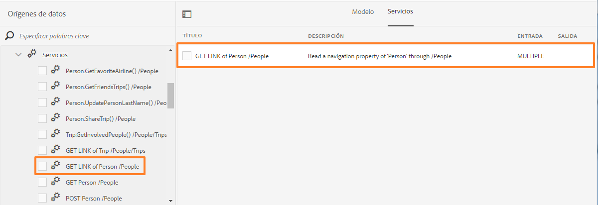

Una vez que agregue la variable `GET LINK` para acceder a la ficha Servicios del Modelo de datos de formulario, puede editar las propiedades para elegir el objeto del modelo de salida y la propiedad de navegación que se utilizará en el servicio. Por ejemplo: `GET LINK of Person /People` en el siguiente ejemplo utiliza Trip como objeto del modelo de salida y la propiedad navigation como Trips.

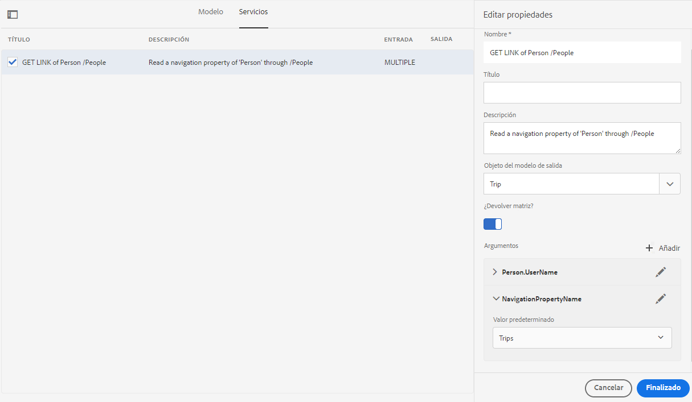

>[!NOTE]
>
>Los valores disponibles en la variable **[!UICONTROL Valor predeterminado]** del campo **NavigationPropertyName** dependen del estado de la variable **[!UICONTROL ¿Devolver matriz?]** botón de alternancia. Cuando está activada, muestra las propiedades de navegación del tipo Collection.

En este ejemplo, también puede elegir el objeto del modelo de salida como argumento de propiedad Persona y navegación como Amigos o BestFriend (en función de si **[!UICONTROL ¿Devolver matriz?]** está activada o desactivada).


Del mismo modo, puede elegir un `GET LINK` y configure sus propiedades de navegación al agregar asociaciones en el Modelo de datos de formulario. Sin embargo, para poder seleccionar una propiedad de navegación, asegúrese de que la variable **[!UICONTROL Enlace al campo]** está configurado como **[!UICONTROL Literal]**.

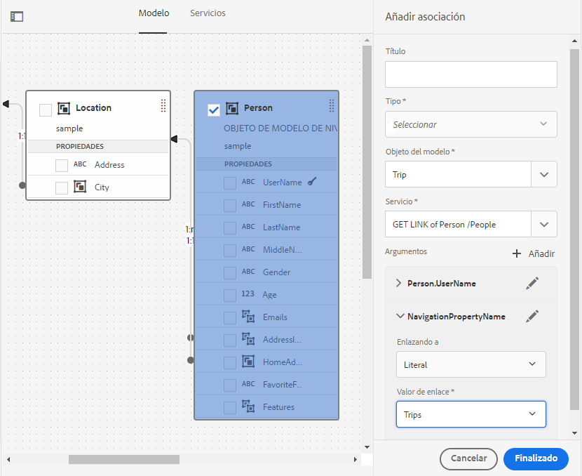

## Generar y editar datos de ejemplo {#sample}

El editor del Modelo de datos de formulario permite generar datos de ejemplo para todas las propiedades de objetos del modelo de datos, incluidas las propiedades calculadas, en un modelo de datos de formulario. Es un conjunto de valores aleatorios que cumplen con el tipo de datos configurado para cada propiedad. También puede editar y guardar datos, que se conservan incluso si se regeneran los datos de ejemplo.

Para generar y editar datos de ejemplo, haga lo siguiente:

1. Abra un modelo de datos de formulario y pulse **[!UICONTROL Editar datos de ejemplo]**. Genera y muestra los datos de ejemplo en la ventana Editar datos de ejemplo .

   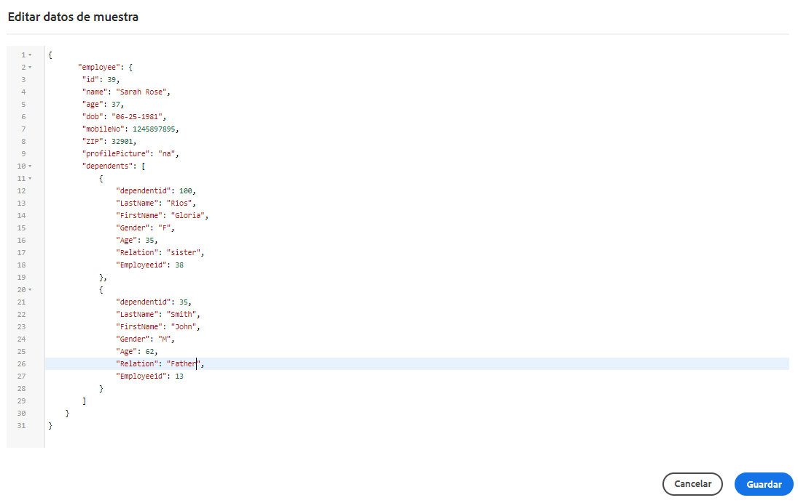

1. En **[!UICONTROL Editar datos de ejemplo]** ventana, editar datos, según sea necesario, y pulse **[!UICONTROL Guardar]**.

<!--Next, you can use the sample data to prefill and test interactive communications based on the form data model. For more information, see [Use form data model](using-form-data-model.md).-->

## Comprobación de objetos y servicios del modelo de datos {#test-data-model-objects-and-services}

El Modelo de datos de formulario está configurado, pero antes de ponerlo en uso, es posible que desee comprobar si los objetos y servicios del modelo de datos configurado funcionan según lo esperado. Para probar los objetos y servicios del modelo de datos:

1. Seleccione un objeto de modelo de datos o un servicio en el Modelo de datos de formulario y pulse **[!UICONTROL Objeto de modelo de prueba]** o **[!UICONTROL Servicio de prueba]**, respectivamente.

   Se abre la ventana Modelo de datos de formulario de prueba.

   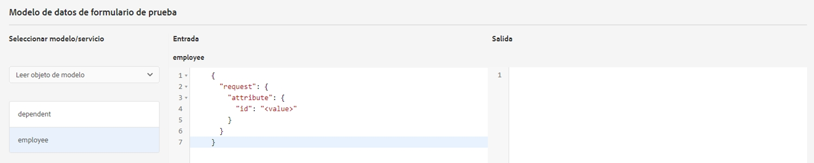

1. En el [!UICONTROL Modelo de datos de formulario de prueba] , seleccione el objeto o servicio del modelo de datos que desea probar en el panel Entrada.

1. Especifique un valor de argumento en el código de prueba y pulse **[!UICONTROL Prueba]**. Una prueba correcta devuelve el resultado en el panel Salida.

   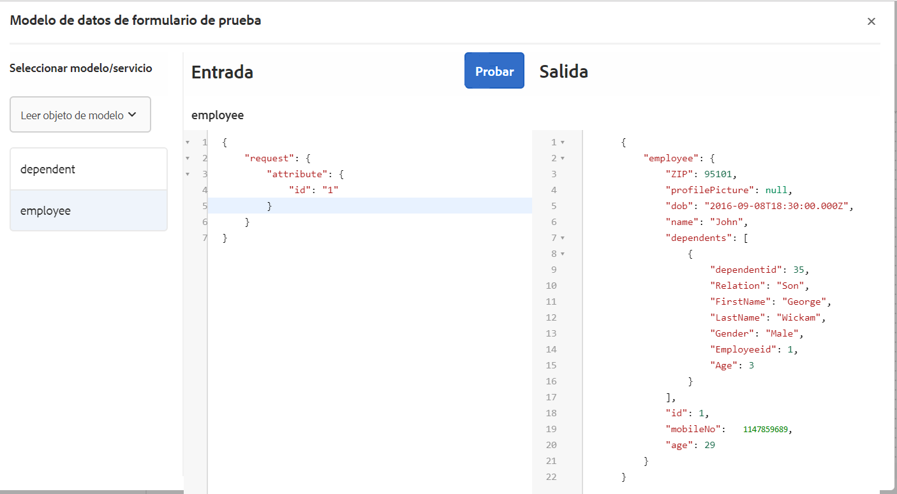

Del mismo modo, se pueden probar otros objetos y servicios del modelo de datos de formulario.

## Validación automatizada de los datos de entrada {#automated-validation-of-input-data}

El Modelo de datos de formulario valida los datos recibidos como entrada al invocar la API DermisBridge (según los criterios de validación disponibles en el modelo de datos de formulario). La validación se basa en la variable `ValidationOptions` indicador establecido en el objeto de consulta que se utiliza para invocar la API.

El indicador se puede establecer en cualquiera de los siguientes valores:

* **COMPLETO**: FDM realiza la validación en función de todas las restricciones
* **OFF**: Sin validación
* **BÁSICO**: FDM realiza la validación en función de las restricciones &quot;requeridas&quot; y &quot;admisibles&quot;

Si no se establece ningún valor para la variable `ValidationOptions`indicador, **BÁSICO** la validación se realiza en los datos de entrada.

A continuación se muestra un ejemplo de cómo configurar el indicador de validación en **COMPLETO**:

```java
operationOptions.setValidationOptions(ValidationOptions.FULL);
```

>[!NOTE]
>
>El valor que proporcione para un atributo en los datos de entrada debe coincidir con el tipo de datos definido para el atributo en el documento de metadatos.\
>Si el valor no coincide con el tipo de datos definido para el atributo, la API DermisBridge muestra una excepción independientemente del valor de la variable `ValidationOptions` indicador. Si el nivel de registro está configurado en Debug, se registra un error en la variable **error.log** archivo.

El Modelo de datos de formulario valida los datos de entrada basándose en una lista de restricciones de tipo de datos. La lista de restricciones para los datos de entrada puede variar en función del origen de datos.

En la tabla siguiente se enumeran las restricciones para los datos de entrada en función del origen de datos:

<table>
 <tbody> 
  <tr> 
   <td>Restricciones</td> 
   <td>Descripción</td> 
   <td>Fuente de datos de entrada</td> 
  </tr> 
  <tr> 
   <td>required</td> 
   <td>Si es true, el parámetro debe incluirse en los datos de entrada.</td> 
   <td>Swagger, WSDL y base de datos</td> 
  </tr> 
  <tr> 
   <td>NULL</td> 
   <td>Si es true, el valor del parámetro se puede establecer en Null en los datos de entrada.</td> 
   <td>WSDL, Odata y base de datos</td> 
  </tr> 
  <tr> 
   <td>máximo</td> 
   <td>Especifica el límite superior de los valores numéricos. El valor máximo especificado como límite superior también se puede asignar al parámetro en los datos de entrada.</td> 
   <td>Swagger y WSDL</td> 
  </tr> 
  <tr> 
   <td>mínimo</td> 
   <td>Especifica el límite inferior de los valores numéricos. El valor mínimo especificado como límite inferior también se puede asignar al parámetro en los datos de entrada.</td> 
   <td>Swagger y WSDL</td> 
  </tr> 
  <tr> 
   <td>exclusivoMaximum</td> 
   <td>Especifica el límite superior de los valores numéricos. El valor máximo especificado como límite superior no debe asignarse al parámetro en los datos de entrada.</td> 
   <td>Swagger y WSDL</td> 
  </tr> 
  <tr> 
   <td>exclusivoMinimum</td> 
   <td>Especifica el límite inferior de los valores numéricos. El valor mínimo especificado como límite inferior no debe asignarse al parámetro en los datos de entrada.</td> 
   <td>Swagger y WSDL</td> 
  </tr> 
  <tr> 
   <td>minLength</td> 
   <td>Especifica el límite inferior del número de caracteres incluidos en una cadena. El valor mínimo especificado como límite inferior también se puede asignar al parámetro en los datos de entrada.</td> 
   <td>Swagger y WSDL</td> 
  </tr> 
  <tr> 
   <td>maxLength</td> 
   <td>Especifica el límite superior del número de caracteres incluidos en una cadena. El valor máximo especificado como límite superior también se puede asignar al parámetro en los datos de entrada.</td> 
   <td>Swagger, WSDL, Odata y base de datos</td> 
  </tr> 
  <tr> 
   <td>pattern</td> 
   <td>Especifica una secuencia fija de caracteres. La cadena de entrada solo se valida correctamente si los caracteres se ajustan al patrón especificado.</td> 
   <td>Swagger</td> 
  </tr> 
  <tr> 
   <td>minItems</td> 
   <td>Especifica el número mínimo de elementos de una matriz. El valor mínimo especificado como límite inferior también se puede asignar al parámetro en los datos de entrada.</td> 
   <td>Swagger y WSDL</td> 
  </tr> 
  <tr> 
   <td>maxItems</td> 
   <td>Especifica el número máximo de elementos de una matriz. El valor máximo especificado como límite superior también se puede asignar al parámetro en los datos de entrada.</td> 
   <td>Swagger y WSDL</td> 
  </tr> 
  <tr> 
   <td>uniqueItems</td> 
   <td>Si es true, todos los elementos de la matriz deben ser únicos en los datos de entrada.</td> 
   <td>Swagger</td> 
  </tr> 
  <tr> 
   <td>enum (cadena)<br /> <br /> </td> 
   <td>Restringe el valor de un parámetro en los datos de entrada a un conjunto fijo de valores de cadena. Debe ser una matriz con al menos un elemento, donde cada elemento sea único.</td> 
   <td>Swagger, WSDL y Odata</td> 
  </tr> 
  <tr> 
   <td>enum (número)<br /> <br /> </td> 
   <td>Restringe el valor de un parámetro en los datos de entrada a un conjunto fijo de valores numéricos. Debe ser una matriz con al menos un elemento, donde cada elemento sea único.</td> 
   <td>WSDL</td> 
  </tr> 
 </tbody> 
</table>

En este ejemplo, los datos de entrada se validan en función de las restricciones máximas, mínimas y requeridas definidas en el archivo Swagger. Los datos de entrada solo cumplen los criterios de validación si el ID de pedido está presente y su valor está entre 1 y 10.

```json
   parameters: [
   {
   name: "orderId",
   in: "path",
   description: "ID of pet that needs to be fetched",
   required: true,
   type: "integer",
   maximum: 10,
   minimum: 1,
   format: "int64"
   }
   ]
```

Se muestra una excepción si los datos de entrada no cumplen los criterios de validación. Si el nivel de registro está establecido en **Depuración**, se registra un error en la variable **error.log** archivo. Por ejemplo,

```verilog
21.01.2019 17:26:37.411 *ERROR* com.adobe.aem.dermis.core.validation.JsonSchemaValidator {"errorCode":"AEM-FDM-001-044","errorMessage":"Input validations failed during operation execution.","violations":{"/orderId":["numeric instance is greater than the required maximum (maximum: 10, found: 16)"]}}
```

## Pasos siguientes {#next-steps}

Tiene un Modelo de datos de formulario en funcionamiento que ya está listo para su uso en Forms adaptable <!--and interactive communications--> flujos de trabajo. Para obtener más información, consulte [Uso del modelo de datos de formulario](using-form-data-model.md).
