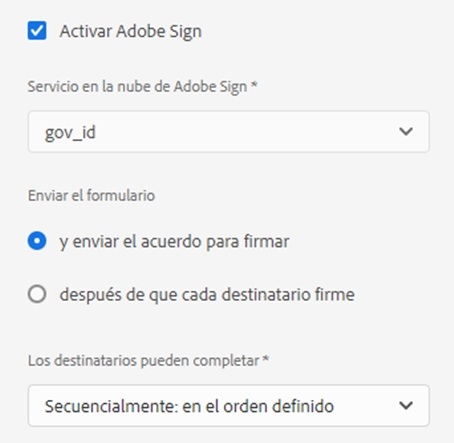

# Uso [!DNL Adobe Sign] en un formulario adaptable {#using-adobe-sign-in-an-adaptive-form}


>[!NOTE]
>
>La función para utilizar funciones de Adobe Sign en un formulario adaptable se encuentra en el canal de prelanzamiento de agosto de 2021. La función estará disponible para el público en general en la versión de septiembre de 2021.


[!DNL Adobe Sign] activa los flujos de trabajo de firma electrónica para Adaptive Forms. Las firmas electrónicas mejoran los flujos de trabajo para procesar documentos para áreas legales, de ventas, de nómina, de gestión de recursos humanos y más.

En un [!DNL Adobe Sign] y Adaptive Forms , un usuario rellena un Formulario adaptable para solicitar un servicio que requiera firmas de una o más partes. Por ejemplo, una solicitud de hipoteca y tarjeta de crédito requiere firmas legales de todos los prestatarios y cosolicitantes. Para habilitar los flujos de trabajo de firma electrónica para situaciones similares, se puede integrar [!DNL Adobe Sign] con un formulario adaptable. Algunos ejemplos más son: [!DNL Adobe Sign] a:

* Cierre las ofertas de cualquier dispositivo con procesos de propuesta, presupuesto y contrato totalmente automatizados.
* Finalice los procesos de Recursos Humanos más rápido y ofrezca a sus empleados las experiencias digitales.
* Reduzca los tiempos de ciclo de contrato e incorpore a sus proveedores más rápido.
* Cree flujos de trabajo digitales que automaticen procesos comunes.

[!DNL Adobe Sign] integración con [!DNL AEM Forms] admite:

* Flujos de trabajo de firma de usuarios únicos y múltiples
* Flujos de trabajo de firma secuenciales y simultáneos
* Firma de formularios como usuario anónimo o con sesión iniciada
* Procesos de firma dinámica (integración con [!DNL AEM Forms] Flujo de trabajo)
* Autenticación a través de una base de conocimiento, teléfono, perfiles sociales e ID de gobierno
* Asigne funciones a cada destinatario del acuerdo. Adobe Sign para los niveles de servicio empresarial y empresarial tiene la opción de ampliar el [funciones para los destinatarios del acuerdo](#addsignerstoanadaptiveform).

<!-- * In-form and out-of-form signing experiences -->

## Requisitos previos {#prerequisites}

Antes de usar [!DNL Adobe Sign] en un formulario adaptable:

* Asegúrese de que [!DNL AEM Forms] as a Cloud Service está configurado para utilizar Adobe Sign. Para obtener más información, consulte [Integrar Adobe Sign con [!DNL AEM Forms]](adobe-sign-integration-adaptive-forms.md).
* Mantenga la lista de destinatarios lista. Se requiere al menos una dirección de correo electrónico para cada destinatario.

## Configurar [!DNL Adobe Sign] para un formulario adaptable {#configure-adobe-sign-for-an-adaptive-form}

Para configurar [!DNL Adobe Sign] para un formulario adaptable:

1. [Habilitar [!DNL Adobe Sign] para un formulario adaptable](#enableadobsignforanadaptiveform)
1. [Agregar [!DNL Adobe Sign] campos a un formulario adaptable](#addadobesignfieldstoanadaptiveform)
1. [Select [!DNL Adobe Sign] Cloud Service de un formulario adaptable](#select-adobe-sign-cloud-service-and-signing-order)

1. [Agregar [!DNL Adobe Sign] destinatario a un formulario adaptable](#addsignerstoanadaptiveform)
1. [Seleccione Enviar acción para un formulario adaptable](#selectsubmitactionforanadaptiveform)


### Habilitar [!DNL Adobe Sign] para un formulario adaptable  {#enableadobesign}

Puede habilitar [!DNL Adobe Sign] para un formulario adaptable existente o crear un [!DNL Adobe Sign] formulario adaptable activado. Elija una de las siguientes opciones:

* [Cree un [!DNL Adobe Sign] formulario adaptable habilitado](#create-an-adaptive-form-for-adobe-sign)
* [Habilitar [!DNL Adobe Sign] para un formulario adaptable existente](#editafsign).

#### Creación de un formulario adaptable para Adobe Sign {#create-an-adaptive-form-for-adobe-sign}

Para crear un formulario adaptable habilitado para firmar:

1. Vaya a **[!UICONTROL Adobe Experience Manager]** > **[!UICONTROL Forms]** > **[!UICONTROL Forms y documentos]**.
1. Toque **[!UICONTROL Crear]** y seleccione **[!UICONTROL Formulario adaptable]**. Aparece una lista de plantillas. Seleccione una plantilla y pulse **[!UICONTROL Siguiente]**.
1. En el **[!UICONTROL Básico]** pestaña:

   1. Especifique la variable **[!UICONTROL Nombre]** y **[!UICONTROL Título]** para el formulario adaptable.

   1. Seleccione el [contenedor de configuración](adobe-sign-integration-adaptive-forms.md#configure-adobe-sign-with-aem-forms) created while [integrar [!DNL Adobe Sign] con [!DNL AEM Forms]](adobe-sign-integration-adaptive-forms.md).
   El contenedor de configuración contiene el [!DNL Adobe Sign] Cloud Services configurados para su entorno. Estos servicios están disponibles para su selección en el editor de formularios adaptables.

1. En el **[!UICONTROL Modelo de formulario]** , seleccione una de las siguientes opciones:

   * Si tiene una plantilla de formulario personalizada y necesita un documento de registro basado en la plantilla de formulario, seleccione la opción **[!UICONTROL Asociar plantilla de formulario como la plantilla Documento de registro]** y seleccione una plantilla Documento de registro. Cuando se utiliza la opción , los documentos enviados para firmar solo muestran los campos basados en la plantilla de formulario asociada. No muestra todos los campos del formulario adaptable.

   * Si no tiene una plantilla de formulario personalizada, seleccione la **[!UICONTROL Generar documento de registro]** . Cuando se utiliza la opción , el documento enviado para firmar muestra todos los campos del formulario adaptable.

1. Toque **[!UICONTROL Crear.]** Se crea un formulario adaptable con firma habilitada. Puede añadir [!DNL Adobe Sign] al formulario y envíelo para su firma.

#### Habilitar [!DNL Adobe Sign] para un formulario adaptable {#editafsign}

Para usar [!DNL Adobe Sign] en un formulario adaptable existente:

1. Vaya a **[!UICONTROL Adobe Experience Manager]** > **[!UICONTROL Forms]** > **[!UICONTROL Forms y documentos]**.
1. Seleccione el formulario adaptable y pulse **[!UICONTROL Propiedades]**.
1. En el **[!UICONTROL Básico]** , seleccione [contenedor de configuración](adobe-sign-integration-adaptive-forms.md#configure-adobe-sign-with-aem-forms) creado al integrar [!DNL Adobe Sign] con [!DNL AEM Forms].
1. En el **[!UICONTROL Modo de formulario]** , seleccione una de las siguientes opciones:

   * Si tiene una plantilla de formulario personalizada y necesita un documento de registro basado en la plantilla de formulario, seleccione la opción **[!UICONTROL Asociar plantilla de formulario como la plantilla Documento de registro]** y seleccione una plantilla Documento de registro. Cuando se utiliza la opción , los documentos enviados para firmar solo muestran los campos basados en la plantilla de formulario asociada. No muestra todos los campos del formulario adaptable.

   * Si no tiene una plantilla de formulario personalizada, seleccione la **[!UICONTROL Generar documento de registro]** . Cuando se utiliza la opción , el documento enviado para firmar muestra todos los campos del formulario adaptable.

1. Toque **[!UICONTROL Guardar y cerrar]**. El formulario adaptable está habilitado para [!DNL Adobe Sign]. Ahora, puede agregar su [!DNL Adobe Sign] al formulario y envíelo para su firma.

### Agregar [!DNL Adobe Sign] campos a un formulario adaptable {#addadobesignfieldstoanadaptiveform}

[!DNL Adobe Sign] tiene varios campos que se pueden colocar en un formulario adaptable. Estos campos aceptan varios tipos de datos, como firmas, iniciales, empresa o título, y ayudan a recopilar información adicional durante la firma, junto con las firmas. Puede usar la variable [!DNL Adobe Sign] Bloque el componente a colocar [!DNL Adobe Sign] campos en varias ubicaciones en un formulario adaptable.

Para agregar campos a un formulario adaptable y personalizar varias opciones relacionadas con estos campos:

1. Arrastrar y soltar **[!UICONTROL Bloque de Adobe Sign]** del navegador de componentes al formulario adaptable. La variable [!DNL Adobe Sign] El componente Bloque tiene todo lo compatible [!DNL Adobe Sign] campos. De forma predeterminada, agrega un **[!UICONTROL Firma]** al formulario adaptable.

   

   De forma predeterminada, la variable [!DNL Adobe Sign] El bloque no está visible en el formulario adaptable publicado. Solo está visible en los documentos de firma. Puede cambiar la visibilidad de [!DNL Adobe Sign] Bloque de las propiedades del [!DNL Adobe Sign] Componente de bloque.

   >[!NOTE]
   >
   >  * Uso [!DNL Adobe Sign] el bloque no es obligatorio para usar [!DNL Adobe Sign] en un formulario adaptable. Si no usa [!DNL Adobe Sign] bloquear y agregar campos para los destinatarios, el campo de firma predeterminado se muestra en la parte inferior de los documentos de firma.
   >  * Uso [!DNL Adobe Sign] solo para los Forms adaptables que generan automáticamente el documento de registro. Si utiliza un XDP personalizado para generar un documento de registro o un formulario basado en un formulario adaptable, [!DNL Adobe Sign] no es compatible.


1. Seleccione el **[!UICONTROL Bloque de Adobe Sign]** y toque el **[!UICONTROL Editar]**  icono. Muestra las opciones para añadir campos y dar formato al aspecto de un campo.

   

   **A.** Seleccione y agregue [!DNL Adobe Sign] campos. **B.** Expanda el [!DNL Adobe Sign] bloquear a la vista de pantalla completa

1. Toque . **[!UICONTROL Adobe Sign]** Campo  icono. Muestra las opciones para seleccionar y agregar [!DNL Adobe Sign] campos.

   Expanda el **[!UICONTROL Tipo]** campo desplegable para seleccionar un [!DNL Adobe Sign] pulse el campo Listo  para añadir el campo seleccionado a [!DNL Adobe Sign] bloque. La variable **[!UICONTROL Tipo]** el campo desplegable incluye los tipos de campo Firma, Información de destinatario y Datos . [!DNL Adobe Sign] integración con AEM [!DNL Forms] campos de asistencia enumerados en la [!UICONTROL Tipo] solo cuadro desplegable. Para obtener información detallada sobre [!DNL Adobe Sign] campos, consulte [Documentación de Adobe Sign](https://helpx.adobe.com/sign/help/field-types.html).

   

   Es obligatorio proporcionar un nombre único para un campo. También puede seleccionar la opción necesaria para marcar un campo como obligatorio. Además del **[!UICONTROL Nombre]** y **[!UICONTROL Requerido]** , algo [!DNL Adobe Sign] tiene más opciones. Por ejemplo, máscara y líneas múltiples. Además, especifique un nombre único para cada [!DNL Adobe Sign] campo si los campos residen en el mismo o en diferentes [!DNL Adobe Sign] bloques.

   Si selecciona **[!UICONTROL Firma digital]** en la lista desplegable, puede aplicar firmas digitales al formulario adaptable:

   * En línea, se usan firmas de la nube para firmar con un [ID digital](https://helpx.adobe.com/sign/kb/digital-certificate-providers.html) alojado por un proveedor de servicios de confianza.
   * Localmente descargando el documento con Adobe Acrobat o Reader usando una tarjeta inteligente, un token USB o un ID digital basado en archivos.

### Habilitar [!DNL Adobe Sign] para un formulario adaptable {#enableadobsignforanadaptiveform}

Fuera de la caja, [!DNL Adobe Sign] no está habilitado para un formulario adaptable. Para habilitarlo:

1. En el navegador de contenido, pulse **[!UICONTROL Contenedor de formulario]** y pulse el botón **[!UICONTROL Configurar]**  icono. Abre el explorador de propiedades y muestra las propiedades del contenedor de formularios adaptables.
1. En el navegador de propiedades, expanda el **[!UICONTROL Firma electrónica]** y seleccione el **[!UICONTROL Habilitar Adobe Sign]** . Habilita [!DNL Adobe Sign] para un formulario adaptable.

### Select [!DNL Adobe Sign] Cloud Service y orden de firma {#select-adobe-sign-cloud-service-and-signing-order}

Puede configurar varias [!DNL Adobe Sign] servicios para una instancia de AEM [!DNL Forms]. Es aconsejable tener un conjunto de servicios separados para cada función (Recursos Humanos, Finanzas, etc.). Facilita el seguimiento y la creación de informes de documentos firmados. Por ejemplo, un banco tiene varios departamentos. Puede tener una configuración separada para cada departamento para un mejor seguimiento de los documentos.

Un documento también puede tener varios destinatarios. Por ejemplo, una solicitud de tarjeta de crédito puede tener varios solicitantes. Un banco requiere firmas de todos los solicitantes antes de iniciar la solicitud de procesamiento. En los casos de varios destinatarios, puede seleccionar firmar el documento en orden secuencial o simultáneo.

Para seleccionar un Cloud Service y el orden de firma:



1. En el navegador de contenido, pulse **[!UICONTROL Contenedor de formulario]** y pulse el botón **[!UICONTROL Configurar]**  icono. Abre el explorador de propiedades y muestra las propiedades del contenedor de formularios adaptables.
1. En el navegador de propiedades, expanda el **[!UICONTROL Firma electrónica]** y seleccione el **[!UICONTROL Habilitar Adobe Sign]** . Habilita [!DNL Adobe Sign] para un formulario adaptable.
1. Seleccione un Cloud Service de la lista ya configurada de [!DNL Adobe Sign] Cloud Services.

   Si la variable **[!UICONTROL Adobe Sign Cloud Service]** está vacía, siga la [Configurar [!DNL Adobe Sign] con [!DNL AEM Forms]](adobe-sign-integration-adaptive-forms.md) para configurar el servicio.

   La lista desplegable enumera los Cloud Services que existen en la `global` carpeta en Herramientas > **[!UICONTROL Cloud Services]** > **[!UICONTROL Adobe Sign]**. Además, la lista desplegable también enumera los Cloud Services que existen en la carpeta seleccionada en la **[!UICONTROL Contenedor de configuración]** al crear un formulario adaptable.

1. Seleccione el orden de firma de la lista **[!UICONTROL Los destinatarios pueden completar]** para abrir el Navegador. Los destinatarios pueden firmar un formulario adaptable **[!UICONTROL Secuencialmente]** - uno tras otro destinatario, o **[!UICONTROL Simultáneamente]** - en cualquier orden.

   En orden secuencial, un destinatario recibe el acuerdo de Adobe Sign a la vez. Una vez que el destinatario completa la acción asignada, el acuerdo se envía al siguiente destinatario, etc.

   En orden simultáneo, todos los destinatarios reciben el acuerdo de Adobe Sign y pueden actuar en paralelo entre sí.

1. Utilice el campo de id. de acuerdo para asociar un bindref al id. de acuerdo (AgreementId). Agrega el ID de acuerdo a la sección afBoundData de envío de datos para formularios basados en esquema. El ID de acuerdo también se agrega a la sección afSubmissionInfo de los datos enviados para todos los formularios habilitados para Adobe Sign. Puede utilizar el ID del acuerdo para rastrear el estado del acuerdo mediante código personalizado (requiere implementación personalizada).

1. [Agregar destinatarios a un formulario adaptable](working-with-adobe-sign.md#addsignerstoanadaptiveform) y pulse Listo  para guardar los cambios.

### Agregar destinatarios a un formulario adaptable {#addsignerstoanadaptiveform}

Puede tener uno o varios destinatarios para un acuerdo de Adobe Sign. Al añadir un destinatario, también se pueden configurar los detalles de autenticación del destinatario y seleccionar si el usuario que rellena el formulario y el destinatario son la misma persona. Realice los siguientes pasos para añadir y proporcionar varios detalles sobre un destinatario:

1. En el navegador de contenido, pulse **[!UICONTROL Contenedor de formulario]** y pulse el botón **[!UICONTROL Configurar]**  icono. Abre el explorador de propiedades con propiedades del contenedor de formularios adaptables.
1. En el navegador de propiedades, expanda el **[!UICONTROL Firma electrónica]** y seleccione el **[!UICONTROL Habilitar Adobe Sign]** . Habilita [!DNL Adobe Sign] para un formulario adaptable.
1. Toque **[!UICONTROL Agregar destinatario]**. Agrega un destinatario al formulario adaptable. Puede agregar varios destinatarios a un formulario adaptable. Todos los destinatarios reciben un acuerdo de Adobe Sign sobre el envío del formulario adaptable.
   

1. Haga clic en el **[!UICONTROL Editar]**  para especificar la siguiente información sobre el destinatario:

   * **[!UICONTROL Título]:** Especifique un título para identificar un destinatario de forma única.

   * **[!UICONTROL ¿Son la misma persona el destinatario y quien rellena el formulario?]:** Select **[!UICONTROL Sí]**, si la persona que rellena el formulario y el primer destinatario son la misma persona. <!-- If the option is set to **No,** then do not use the signature step component in the Adaptive Form. If the form contains a Signature Step component, then the field is automatically set to Yes. -->

   * **[!UICONTROL Función de destinatario]:** Seleccione la función de un destinatario. Adobe Sign para los niveles de servicio empresarial y empresarial tiene la opción de ampliar el [funciones para los destinatarios del acuerdo](https://helpx.adobe.com/sign/using/set-up-signer-approver-roles.html), más allá de **Firmante**, para que coincida mejor con sus requisitos de flujo de trabajo.

   * **[!UICONTROL Dirección de correo electrónico del destinatario]:** Especifique la dirección de correo electrónico del destinatario. El destinatario recibe el acuerdo de Adobe Sign en la dirección de correo electrónico especificada. Puede elegir utilizar una dirección de correo electrónico proporcionada en un campo de formulario, en el perfil de usuario Experience Manager del usuario que ha iniciado sesión o escribir manualmente una dirección de correo electrónico. Es un paso obligatorio.

      >[!NOTE]
      >
      >Asegúrese de que la dirección de correo electrónico del primer destinatario o del único destinatario (si hay un único destinatario) no sea idéntica a [!DNL Adobe Sign] cuenta utilizada para configurar AEM Cloud Services.

   * **[!UICONTROL Método de autenticación de destinatario]:** Especifique el método para autenticar un destinatario antes de abrir el acuerdo de Adobe Sign. Puede elegir entre teléfono, base de conocimientos, autenticación social basada en identidad y [ID de gobierno](https://helpx.adobe.com/sign/using/adobesign-authentication-government-id.html).
   >[!NOTE]
   >
   >    * De forma predeterminada, la autenticación basada en la identidad social proporciona una opción para autenticarse con Facebook, Google y LinkedIn. Puede ponerse en contacto con [!DNL Adobe Sign] compatibilidad para habilitar otros proveedores de autenticación social.


   * **[!DNL Adobe Sign]campos para rellenar o firmar:** Select [!DNL Adobe Sign] para el destinatario. Un formulario adaptable puede tener varios [!DNL Adobe Sign] campos. Puede elegir habilitar campos específicos para un destinatario. El campo muestra todas las [!DNL Adobe Sign] Bloques. Al seleccionar un bloque, se seleccionan todos los campos del bloque. Puede utilizar el icono X para anular la selección de un campo.

   

   La imagen anterior tiene dos ejemplos [!DNL Adobe Sign] Bloques: Información personal y detalles de Office

   Toque .  icono. Se añade el destinatario.

### Seleccione Enviar acción para un formulario adaptable {#selectsubmitactionforanadaptiveform}

Después de agregar [!DNL Adobe Sign] campos a un formulario adaptable, activar [!DNL Adobe Sign] en el contenedor de formularios, seleccione [!DNL Adobe Sign] Cloud Service y agregue destinatarios de acuerdo con Adobe Sign, seleccione una acción de envío adecuada para el formulario adaptable. Para obtener información detallada sobre las acciones de envío de Forms adaptable, consulte [Configuración de la acción de envío](configuring-submit-actions.md).

La firma y el envío de un formulario son independientes entre sí. El envío del formulario adaptable se produce en cuanto se crea un acuerdo de Adobe Sign después de que un usuario envía un formulario. [!DNL AEM Forms] as a Cloud Service no espera a que los destinatarios firmen o completen otras acciones para enviar un formulario adaptable. Un formulario se envía en cuanto un usuario hace clic en el botón Enviar o un paso Resumen muestra el resumen del formulario.

Además, un [!DNL Adobe Sign] formulario adaptable activado incrusta el ID de acuerdo de Adobe Sign para enviar datos. Puede utilizar el ID del acuerdo para rastrear el estado del acuerdo mediante código personalizado (requiere implementación personalizada).

El ID del acuerdo de Adobe Sign (AgreementId) se incluye en los datos de envío del formulario adaptable. De forma predeterminada, el ID del acuerdo está presente en la variable `afSubmissionInfo` nodo de datos enviados.

```xml
   <?xml version="1.0" encoding="UTF-8"?>
   <afData>
      <afUnboundData>
         <data>
            <textbox1613455050902>ff</textbox1613455050902>
         </data>
      </afUnboundData>
      <afBoundData>
         <data xmlns:xfa="http://www.xfa.org/schema/xfa-data/1.0/" />
      </afBoundData>
      <afSubmissionInfo>
         <lastFocusItem>guide[0].guide1[0].guideRootPanel[0].textbox1613455050902[0]</lastFocusItem>
         <stateOverrides />
         <signers>
            <signer0>
               <email />
            </signer0>
         </signers>
         <afPath>/content/dam/formsanddocuments/testsign</afPath>
         <afSubmissionTime>20210311031009</afSubmissionTime>
         <agreementId>xxxxxxxxxxxxxxxxxxxxxxxxxxxxxxxxxxxxxxxxxxxxx</agreementId>
      </afSubmissionInfo>
   </afData>
```

De forma opcional, también puede asociar un bindref al ID del acuerdo (AgreementId). Agrega el ID de acuerdo a la sección afBoundData de los datos enviados. Por ejemplo, en los siguientes datos enviados, el ID de acuerdo está enlazado a `<userName>` nodo:

```xml
      <?xml version="1.0" encoding="UTF-8"?>
      <afData>
         <afUnboundData>
            <data />
         </afUnboundData>
         <afBoundData>
            <config xmlns:xfa="http://www.xfa.org/schema/xfa-data/1.0/" xmlns:xsi="http://www.w3.org/2001/XMLSchema-instance">
               <agreementID>3AAABLblqZhC2MWu7GFauKh45j_t2ih8mAtmbdIcNSl1HgQubhMJfDaDfylyN7NQiYRam_44ISKm45enIOafHqWZrdaxShf9r</agreementID>
               <dateOfBirth>0001-01-01</dateOfBirth>
            </config>
         </afBoundData>
         <afSubmissionInfo>
            <lastFocusItem>guide[0].guide1[0].guideRootPanel[0].projectDetails[0]</lastFocusItem>
            <stateOverrides />
            <signers>
               <signer0>
                  <email />
               </signer0>
            </signers>
            <afPath>/content/dam/formsanddocuments/testathon2021-1/gaurav/xsd-based</afPath>
            <afSubmissionTime>20210311095211</afSubmissionTime>
            <agreementId>xxxxxxxxxxxxxxxxxxxxxxxxxxxxxxxxxxxxxxxxxxxx</agreementId>
         </afSubmissionInfo>
      </afData>
```

<!-- Remove when forms portal goes live
>[!NOTE]
>
>Data of the Adaptive Form is stored temporarily on Forms Portal. It is recommended to use [custom storage for Forms Portal](/help/forms/using/configuring-draft-submission-storage.md). It ensures that the PII (personally identifiable information) data is not stored on AEM servers. 
-->

La experiencia de firma de formularios está lista. Puede obtener una vista previa del formulario para comprobar la experiencia de firma. En el formulario publicado, [!DNL Adobe Sign] Los campos de bloque se muestran cuando un destinatario recibe el formulario para firmar a través de un correo electrónico. Cuando la variable **[!UICONTROL ¿Cuándo son iguales el destinatario y la persona que rellena el formulario?]** se marca como sí y se cumple la condición, se redirige al usuario al acuerdo de Adobe Sign después de los envíos y el usuario puede firmar el documento inmediatamente, en lugar de esperar a que el acuerdo aparezca en el correo electrónico.

## Configuración de firmas de nube para un formulario adaptable {#configure-cloud-signatures-for-an-adaptive-form}

Las firmas digitales o firmas remotas basadas en la nube son una nueva generación de firmas digitales que funcionan en equipos de escritorio, dispositivos móviles y la web, y cumplen los niveles más altos de conformidad y seguridad para la autenticación de destinatarios. Puede firmar un formulario adaptable con firmas digitales basadas en la nube.

Después [edición de las propiedades del formulario adaptable para Adobe Sign](working-with-adobe-sign.md#enableadobesign), realice los siguientes pasos para agregar el campo de firma en la nube a un formulario adaptable:

1. Arrastrar y soltar **[!UICONTROL Bloque de Adobe Sign]** del navegador de componentes al formulario adaptable. La variable [!UICONTROL Bloque de Adobe Sign] tiene todo el soporte [!DNL Adobe Sign] campos. De forma predeterminada, agrega un **[!UICONTROL Firma]** al formulario adaptable.

   

1. Seleccione el **[!UICONTROL Bloque de Adobe Sign]** y toque el **[!UICONTROL Editar]**  icono. Muestra las opciones para añadir campos y dar formato al aspecto de un campo.

   

   **A.** Seleccione y agregue [!DNL Adobe Sign] campos. **B.** Expanda el [!DNL Adobe Sign] bloquear a la vista de pantalla completa

1. Toque . **[!UICONTROL Campo Adobe Sign]**  icono. Muestra las opciones para seleccionar y agregar [!DNL Adobe Sign] campos.

   Expanda el **[!UICONTROL Tipo]** campo desplegable que desea seleccionar **[!UICONTROL Firma digital]** y pulse **[!UICONTROL Listo]** para añadir el campo seleccionado a [!DNL Adobe Sign] bloque.

   

   Es obligatorio proporcionar un nombre único para un campo.

   Aplicar firmas digitales al formulario adaptable mediante:

   * Firmas en la nube: Firme con un [ID digital](https://helpx.adobe.com/sign/kb/digital-certificate-providers.html) alojado por un proveedor de servicios de confianza.
   * Adobe Acrobat o Reader: Descargue y abra el documento con Adobe Acrobat o Reader para firmarlo con una tarjeta inteligente, un token USB o un ID digital basado en archivos.

   Después de agregar el campo de firma de nube al formulario adaptable, realice los siguientes pasos para completar el proceso de configuración:

   * [Habilitar Adobe Sign para un formulario adaptable](#enableadobsignforanadaptiveform)
   * [Seleccionar Adobe Sign Cloud Service para un formulario adaptable](#selectadobesigncloudserviceforanadaptiveform)
   * [Agregar destinatarios a un formulario adaptable](#addsignerstoanadaptiveform)
   * [Seleccione Enviar acción para un formulario adaptable](#selectsubmitactionforanadaptiveform)


### Configurar la página de agradecimiento o el componente de paso de resumen {#configure-the-thank-you-page-or-summary-step-component}

La variable **[!UICONTROL Paso de resumen]** envía automáticamente el formulario, rellena la información dentro de la página Resumen personalizada y muestra el resumen del formulario enviado. El componente Paso de resumen ocupa el ancho completo disponible para el formulario. Se recomienda no tener ningún otro componente en la sección que contenga el componente Paso de resumen.

## Preguntas frecuentes {#frequently-asked-questions}

**P:** Puede incrustar un formulario adaptable en otro formulario adaptable. ¿Puede el formulario adaptable incrustado ser [!DNL Adobe Sign] activado?
**Ans:** No, Experience Manager Forms no es compatible con el uso de un formulario adaptable que incrusta un [!DNL Adobe Sign] formulario adaptable habilitado para firmar

**P:** Cuando creo un formulario adaptable utilizando la plantilla avanzada y lo abro para editarlo, aparece un mensaje de error &quot;La firma electrónica o los destinatarios no están correctamente configurados&quot;. aparece. ¿Cómo se resuelve el mensaje de error?
**Ans:** El formulario adaptable creado con la plantilla avanzada está configurado para usar [!DNL Adobe Sign]. Para resolver el error, cree y seleccione un [!DNL Adobe Sign] configuración de nube y configurar un [!DNL Adobe Sign] destinatario del formulario adaptable.

**P:** ¿Puedo usar [!DNL Adobe Sign] etiquetas de texto en un componente de texto estático de un formulario adaptable?
**Ans:** Sí, puede utilizar etiquetas de texto en un componente de texto para agregar [!DNL Adobe Sign] campos a un documento de registro (sólo la opción Documento de registro generado automáticamente) activados Formulario adaptable. Para obtener más información sobre el procedimiento y las reglas para crear una etiqueta de texto, consulte [Documentación de Adobe Sign](https://helpx.adobe.com/sign/using/text-tag.html). Tenga en cuenta también que Forms adaptable tiene una compatibilidad limitada con las etiquetas de texto. Puede utilizar las etiquetas de texto para crear solo los campos que [Bloque de Adobe Sign](working-with-adobe-sign.md#configure-cloud-signatures-for-an-adaptive-form) admite .

## Solución de problemas {#troubleshoot}

### [!DNL Adobe Sign] errores de acuerdo {#adobe-sign-agreement-failures}

**Problema**
When [!DNL Adobe Sign] está configurado para un formulario adaptable, el servicio no crea un [!DNL Adobe Sign] acuerdo para el formulario adaptable subyacente.

**Resolución**

* Marque la [configuración de Adobe Sign Cloud Service](adobe-sign-integration-adaptive-forms.md) se utiliza en el formulario adaptable.
* Asegúrese de que la aplicación API está activada. [!DNL Adobe Sign] servidor utilizado para configurar [!DNL Adobe Sign] El Cloud Service tiene los permisos necesarios.
* Si utiliza varias [!DNL Adobe Sign] Cloud Services, señale el **[!UICONTROL URL oAuth]** de todos los servicios a la misma **[!UICONTROL Compartimiento de Adobe Sign]**.

* Usar direcciones de correo electrónico independientes para configurar [!DNL Adobe Sign] y para el primer o único destinatario. La dirección de correo electrónico del primer destinatario o del único destinatario (si hay un único destinatario) no puede ser idéntica a [!DNL Adobe Sign] cuenta utilizada para configurar AEM Cloud Services.

## Artículos relacionados {#related-articles}

* [Integrar [!DNL Adobe Sign] con [!DNL AEM Forms]](adobe-sign-integration-adaptive-forms.md)
* [Prácticas recomendadas para usar [!DNL Adobe Sign] con Forms adaptable](https://medium.com/adobetech/using-adobe-sign-to-e-sign-an-adaptive-form-heres-the-best-way-to-do-it-dc3e15f9b684)
