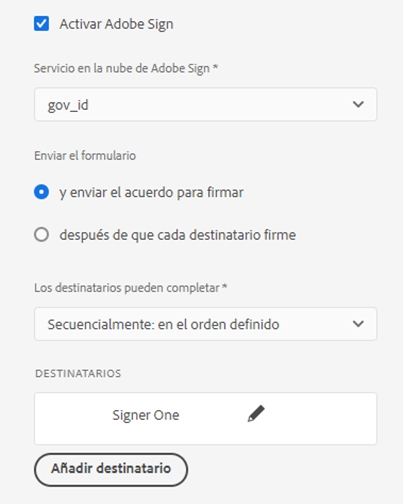
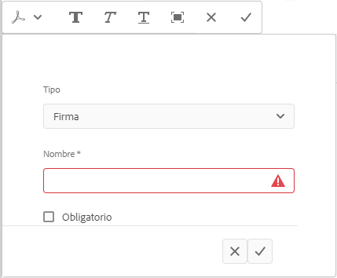
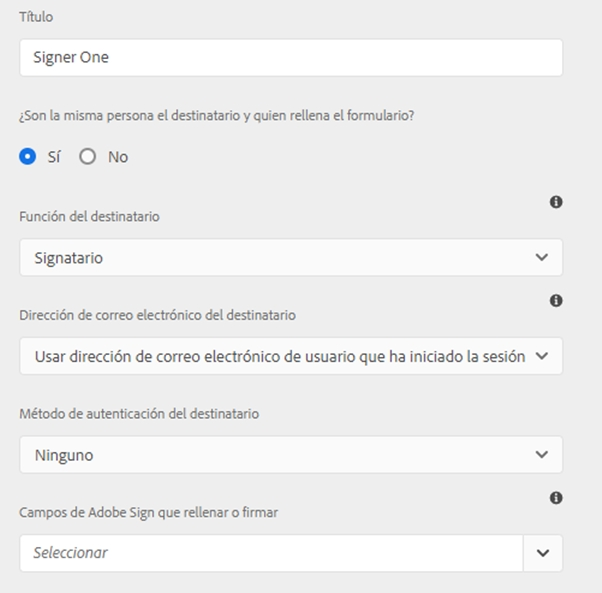
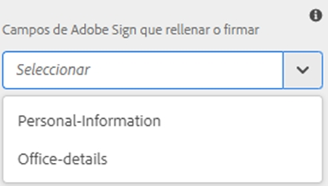
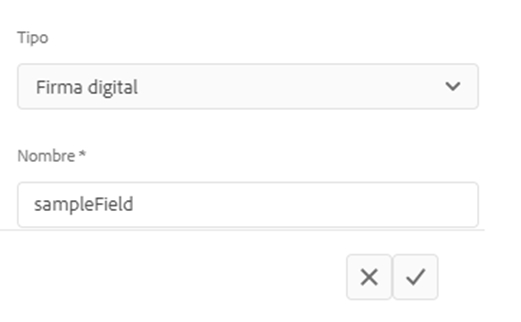

# Utilice [!DNL Adobe Sign] en un formulario adaptable {#using-adobe-sign-in-an-adaptive-form}

>[!NOTE]
>
> Adobe recomienda utilizar la captura de datos moderna y ampliable [Componentes principales](https://experienceleague.adobe.com/docs/experience-manager-core-components/using/adaptive-forms/introduction.html?lang=es) para [crear nuevos formularios adaptables](/help/forms/creating-adaptive-form-core-components.md) o [añadir formularios adaptables a páginas de AEM Sites](/help/forms/create-or-add-an-adaptive-form-to-aem-sites-page.md). Estos componentes representan un avance significativo en la creación de formularios adaptables, lo que garantiza experiencias de usuario impresionantes. Este artículo describe un enfoque más antiguo para crear formularios adaptables con componentes de base.


| Versión | Vínculo del artículo |
| -------- | ---------------------------- |
| AEM 6.5 | [Haga clic aquí](https://experienceleague.adobe.com/docs/experience-manager-65/forms/adaptive-forms-advanced-authoring/working-with-adobe-sign.html?lang=es) |
| AEM as a Cloud Service | Este artículo |


[!DNL Adobe Sign] habilita los flujos de trabajo de firma electrónica para formularios adaptables. Las firmas electrónicas mejoran los flujos de trabajo para procesar documentos para áreas legales, de ventas, de nómina, de administración de recursos humanos y más.

En un escenario típico de [!DNL Adobe Sign] y formularios adaptables, un usuario rellena un formulario adaptable para solicitar un servicio que requiera firmas de una o más partes. Por ejemplo, una solicitud de hipoteca y tarjeta de crédito requiere firmas legales de todos los prestatarios y cosolicitantes. Para habilitar los flujos de trabajo de firma electrónica para situaciones similares, se puede integrar [!DNL Adobe Sign] con un formulario adaptable. Algunos ejemplos más. Puede usar [!DNL Adobe Sign] para lo siguiente:

* Cerrar acuerdos desde cualquier dispositivo con procesos de propuesta, presupuesto y contrato totalmente automatizados.
* Finalizar los procesos de Recursos Humanos más rápido y ofrecer a sus empleados las experiencias digitales.
* Reducir los tiempos de ciclo de contrato e incorporar a sus proveedores más rápido.
* Crear flujos de trabajo digitales que automaticen procesos comunes.

La integración de [!DNL Adobe Sign] con [!DNL AEM Forms] es compatible con los siguientes elementos:

* Flujos de trabajo de firma de usuarios únicos y múltiples
* Flujos de trabajo de firma secuenciales y simultáneos
* Firma de formularios como usuario anónimo o con sesión iniciada
* Procesos de firma dinámica (integración con flujos de trabajo de [!DNL AEM Forms])
* Autenticación a través de una base de conocimiento, teléfono, perfiles sociales e id. oficial
* Asignación de funciones para cada destinatario del acuerdo. Adobe Sign para los niveles de servicio empresarial y para empresa tiene la opción de ampliar las [funciones para los destinatarios del acuerdo](#addsignerstoanadaptiveform).

<!-- * In-form and out-of-form signing experiences -->

## Requisitos previos {#prerequisites}

Antes de usar [!DNL Adobe Sign] en un formulario adaptable:

* Asegúrese de que [!DNL AEM Forms] as a Cloud Service está configurado para utilizar Adobe Sign. Para obtener más información, consulte [Integrar Adobe Sign con [!DNL AEM Forms]](adobe-sign-integration-adaptive-forms.md).
* Tenga la lista de destinatarios preparada. Se requiere al menos una dirección de correo electrónico para cada destinatario.

## Configurar [!DNL Adobe Sign] para un formulario adaptable {#configure-adobe-sign-for-an-adaptive-form}

Para configurar [!DNL Adobe Sign] para un formulario adaptable:

1. [Habilitar [!DNL Adobe Sign] para un formulario adaptable](#enableadobsignforanadaptiveform)
1. [Agregar campos de  [!DNL Adobe Sign]  a un formulario adaptable](#addadobesignfieldstoanadaptiveform)
1. [Seleccionar [!DNL Adobe Sign] Cloud Service para un formulario adaptable](#select-adobe-sign-cloud-service-and-signing-order)

1. [Agregar destinatario de [!DNL Adobe Sign] a un formulario adaptable](#addsignerstoanadaptiveform)
1. [Seleccionar acción de envío para un formulario adaptable](#selectsubmitactionforanadaptiveform)



### Habilitar [!DNL Adobe Sign] para un formulario adaptable  {#enableadobesign}

Puede habilitar [!DNL Adobe Sign] para un formulario adaptable existente o crear un formulario adaptable con [!DNL Adobe Sign] habilitado. Elija una de las acciones siguientes:

* [Crear un formulario adaptable con [!DNL Adobe Sign] habilitado](#create-an-adaptive-form-for-adobe-sign)
* [Habilitar [!DNL Adobe Sign] para un formulario adaptable existente](#editafsign).

#### Crear un formulario adaptable para Adobe Sign {#create-an-adaptive-form-for-adobe-sign}

Para crear un formulario adaptable habilitado para firmar:

1. Vaya a **[!UICONTROL Adobe Experience Manager]** > **[!UICONTROL Forms]** > **[!UICONTROL Formularios y documentos]**.
1. Seleccione **[!UICONTROL Crear]** y seleccione **[!UICONTROL Formulario adaptable]**. Aparece una lista de plantillas. Seleccione una plantilla y seleccione **[!UICONTROL Siguiente]**.
1. En la pestaña **[!UICONTROL Básico]**:

   1. Especifique el **[!UICONTROL Nombre]** y el **[!UICONTROL Título]** para el formulario adaptable.

   1. Seleccione el [contenedor de configuración](adobe-sign-integration-adaptive-forms.md#configure-adobe-sign-with-aem-forms) creado al [integrarse [!DNL Adobe Sign] con [!DNL AEM Forms]](adobe-sign-integration-adaptive-forms.md).

   El contenedor de configuración contiene [!DNL Adobe Sign] Cloud Service configurado para su entorno. Estos servicios están disponibles para su selección en el creador de formularios adaptables.

1. En la pestaña **[!UICONTROL Modelo de formulario]**, seleccione una de las siguientes opciones:

   * Si tiene una plantilla de formulario personalizada y necesita un documento de registro basado en la plantilla de formulario, seleccione la opción **[!UICONTROL Asociar plantilla de formulario como la plantilla de documento de registro]** y elija una plantilla de documento de registro. Cuando se utiliza la opción, los documentos enviados para firmar solo muestran los campos basados en la plantilla de formulario asociada. No muestra todos los campos del formulario adaptable.

   * Si no cuenta con una plantilla de formulario personalizada, seleccione la opción **[!UICONTROL Generar documento de registro]**. Cuando se utiliza la opción, el documento enviado para firmar muestra todos los campos del formulario adaptable.

1. Seleccione **[!UICONTROL Crear]**. Se crea un formulario adaptable con firma habilitada. Puede agregar campos de [!DNL Adobe Sign] al formulario y enviarlo para su firma.

#### Habilitar [!DNL Adobe Sign] para un formulario adaptable {#editafsign}

Para usar [!DNL Adobe Sign] en un formulario adaptable existente:

1. Vaya a **[!UICONTROL Adobe Experience Manager]** > **[!UICONTROL Forms]** > **[!UICONTROL Formularios y documentos]**.
1. Seleccione el formulario adaptable y seleccione **[!UICONTROL Propiedades]**.
1. En la pestaña **[!UICONTROL Básico]**, seleccione el [contenedor de configuración](adobe-sign-integration-adaptive-forms.md#configure-adobe-sign-with-aem-forms) creado al integrarse [!DNL Adobe Sign] con [!DNL AEM Forms].
1. En la pestaña **[!UICONTROL Modelo de formulario]**, seleccione una de las siguientes opciones:

   * Si tiene una plantilla de formulario personalizada y necesita un documento de registro basado en la plantilla de formulario, seleccione la opción **[!UICONTROL Asociar plantilla de formulario como la plantilla de documento de registro]** y elija una plantilla de documento de registro. Cuando se utiliza la opción, los documentos enviados para firmar solo muestran los campos basados en la plantilla de formulario asociada. No muestra todos los campos del formulario adaptable.

   * Si no cuenta con una plantilla de formulario personalizada, seleccione la opción **[!UICONTROL Generar documento de registro]**. Cuando se utiliza la opción, el documento enviado para firmar muestra todos los campos del formulario adaptable.

1. Seleccione **[!UICONTROL Guardar y cerrar]**. El formulario adaptable está habilitado para [!DNL Adobe Sign]. Ahora, puede agregar campos de [!DNL Adobe Sign] al formulario y enviarlo para su firma.

### Adición de campos de [!DNL Adobe Sign] a un formulario adaptable {#addadobesignfieldstoanadaptiveform}

[!DNL Adobe Sign] tiene varios campos que se pueden colocar en un formulario adaptable. Estos campos aceptan varios tipos de datos, como firmas, iniciales, empresa o título, y ayudan a recopilar información adicional durante la firma, junto con las firmas. Puede usar el componente [!DNL Adobe Sign] Block para colocar campos de [!DNL Adobe Sign] en varias ubicaciones en un formulario adaptable.

Para agregar campos a un formulario adaptable y personalizar varias opciones relacionadas con estos campos:

1. Arrastre y suelte el componente **[!UICONTROL Adobe Sign Block]** del explorador del componente en el formulario adaptable. El componente [!DNL Adobe Sign] Block cuenta con los campos [!DNL Adobe Sign] compatibles. De forma predeterminada, agrega un campo de **[!UICONTROL Firma]** al formulario adaptable.

   

   De forma predeterminada, [!DNL Adobe Sign] Block no es visible en el formulario adaptable publicado. Solo se ve en los documentos de firma. Puede cambiar la visibilidad de [!DNL Adobe Sign] Block en las propiedades del componente [!DNL Adobe Sign] Block.

   >[!NOTE]
   >
   > * El uso del bloque de [!DNL Adobe Sign] no es obligatorio para utilizar [!DNL Adobe Sign] en un formulario adaptable. Si no usa el bloque de [!DNL Adobe Sign] y agrega campos para los destinatarios, el campo de firma predeterminado se muestra al final de los documentos de firma.
   > * Use el bloque de [!DNL Adobe Sign] solo para los formularios adaptables que generan automáticamente el documento de registro. Si utiliza un XDP personalizado para generar un documento de registro o una plantilla de formulario basada en un formulario adaptable, el bloque [!DNL Adobe Sign] no es compatible.


1. Seleccione el componente **[!UICONTROL Adobe Sign Block]** y seleccione el icono **[!UICONTROL Editar]** . Muestra las opciones para agregar campos y formatear la apariencia de un campo.

   

   **A.** Seleccione y agregue campos de [!DNL Adobe Sign]. **B.** Amplíe el bloque [!DNL Adobe Sign] a vista de pantalla completa.

1. Seleccione el icono  del campo **[!UICONTROL Adobe Sign]**. Muestra las opciones para seleccionar y agregar campos de [!DNL Adobe Sign].

   Amplíe el campo desplegable **[!UICONTROL Tipo]** para seleccionar un campo de [!DNL Adobe Sign] y seleccione el icono de Listo  para agregar el campo seleccionado al bloque de [!DNL Adobe Sign]. El campo desplegable **[!UICONTROL Tipo]** incluye los tipos de campo Firma, Información de destinatario y Datos. La integración de [!DNL Adobe Sign] con AEM [!DNL Forms] admite campos enumerados solo en el cuadro desplegable [!UICONTROL Tipo]. Para obtener información detallada sobre los campos de [!DNL Adobe Sign], consulte [Documentación de Adobe Sign](https://helpx.adobe.com/es/sign/help/field-types.html).

   

   Es obligatorio proporcionar un nombre único para un campo. También puede seleccionar la opción necesaria para marcar un campo como obligatorio. Además de las opciones **[!UICONTROL Nombre]** y **[!UICONTROL Requerido]**, otros campos de [!DNL Adobe Sign] cuentan con más donde elegir. Por ejemplo, máscara y líneas múltiples. Además, especifique un nombre único para cada campo de [!DNL Adobe Sign] si los campos residen en el mismo o en diferentes bloques de [!DNL Adobe Sign].

   Si selecciona **[!UICONTROL Firma digital]** en la lista desplegable, puede aplicar firmas digitales al formulario adaptable:

   * En línea, se usan firmas de la nube para firmar con un [ID digital](https://helpx.adobe.com/es/sign/kb/digital-certificate-providers.html) alojado por un proveedor de servicios de confianza.
   * De forma local, se descarga el documento con Adobe Acrobat o Reader usando una tarjeta inteligente, un token USB o un ID digital basado en archivos.

### Habilitar [!DNL Adobe Sign] para un formulario adaptable {#enableadobsignforanadaptiveform}

De serie, [!DNL Adobe Sign] no está habilitado para un formulario adaptable. Para habilitarlo:

1. En el navegador de contenido, seleccione **[!UICONTROL Contenedor de formulario]** y seleccione el icono **[!UICONTROL Configurar]** . Se abrirá el explorador de propiedades, donde verá las propiedades del contenedor de formularios adaptables.
1. En el navegador de propiedades, amplíe el acordeón **[!UICONTROL Firma electrónica]** y seleccione la opción **[!UICONTROL Habilitar Adobe Sign]**. Se habilita [!DNL Adobe Sign] para un formulario adaptable.

### Seleccione [!DNL Adobe Sign] Cloud Service y la petición de firma {#select-adobe-sign-cloud-service-and-signing-order}

Puede configurar varios servicios de [!DNL Adobe Sign] para una instancia de AEM [!DNL Forms]. Es aconsejable tener un conjunto de servicios separados para cada función (Recursos Humanos, Finanzas, etc.). Facilita el seguimiento y la creación de informes de documentos firmados. Por ejemplo, un banco tiene varios departamentos. Puede tener una configuración separada para cada departamento para realizar un mejor seguimiento de los documentos.

Un documento también puede tener varios destinatarios. Por ejemplo, una solicitud de tarjeta de crédito puede tener varios solicitantes. Un banco requiere firmas de todos los solicitantes antes de iniciar la solicitud de procesamiento. En los casos de varios destinatarios, puede seleccionar firmar el documento en orden secuencial o simultáneo.

Para seleccionar un servicio de Cloud Service y la petición de firma:


1. En el explorador de contenido, seleccione **[!UICONTROL Contenedor de formulario]** y seleccione el icono **[!UICONTROL Configurar]** . Se abrirá el explorador de propiedades, donde verá las propiedades del contenedor de formularios adaptables.
1. En el navegador de propiedades, amplíe el acordeón **[!UICONTROL Firma electrónica]** y seleccione la opción **[!UICONTROL Habilitar Adobe Sign]**. Se habilita [!DNL Adobe Sign] para un formulario adaptable.
1. Seleccione un servicio de Cloud Service de la lista ya configurada de [!DNL Adobe Sign] Cloud Service.

   Si la lista **[!UICONTROL Adobe Sign Cloud Service]** está vacía, consulte el artículo [Configurar [!DNL Adobe Sign] con [!DNL AEM Forms]](adobe-sign-integration-adaptive-forms.md) para configurar el servicio.

   La lista desplegable enumera los servicios de Cloud Service que existen en la carpeta `global` en Herramientas > **[!UICONTROL Cloud Service]** > **[!UICONTROL Adobe Sign]**. Además, la lista desplegable también enumera los servicios de Cloud Service que existen en la carpeta que seleccionas en el campo **[!UICONTROL Contenedor de configuración]** al crear un formulario adaptable.

1. Seleccione la opción para configurar la acción de envío mediante **[!UICONTROL Enviar el formulario]**. Puede seleccionar cualquiera de las dos opciones siguientes:
   * **Enviar el formulario (y enviar el acuerdo para su firma)**: Esta opción envía el formulario inmediatamente y, a continuación, lo envía para su firma a los destinatarios.
   * **Enviar el formulario (después de que cada destinatario complete la ceremonia de firma)**: Esta opción envía un Formulario adaptable solo después de que todos los firmantes completen el proceso de firma. Puede configurar el intervalo para comprobar el estado de la firma de todos los firmantes. Para obtener más información, consulte [Configurar [!DNL Adobe Acrobat Sign] planificador](/help/forms/adobe-sign-integration-adaptive-forms.md#configure-dnl-adobe-acrobat-sign-scheduler-to-sync-the-signing-status).

1. Seleccione el orden de firma del cuadro de diálogo **[!UICONTROL Los destinatarios pueden completar]**. Los destinatarios pueden firmar un formulario adaptable **[!UICONTROL secuencialmente]** (un destinatario tras otro) o **[!UICONTROL simultáneamente]** (en cualquier orden).

   En orden secuencial, un solo destinatario recibe el acuerdo de Adobe Sign a la vez. Una vez que el destinatario completa la acción asignada, el acuerdo se envía al siguiente destinatario, etc.

   En orden simultáneo, todos los destinatarios reciben el acuerdo de Adobe Sign y pueden actuar en paralelo entre sí.

1. Utilice el campo de id. de acuerdo para asociar una referencia vinculante a la identificación del acuerdo (agreementId). Agrega el ID de acuerdo a la sección afBoundData de envío de datos para formularios basados en esquemas. El ID de acuerdo también se agrega a la sección afSubmissionInfo de los datos enviados para todos los formularios habilitados para Adobe Sign. Puede utilizar el ID del acuerdo para rastrear el estado del acuerdo mediante código personalizado (requiere implementación personalizada).

   >[!NOTE]
   >
   > Si se crea un formulario adaptable mediante un modelo de datos de formulario, el campo ID del acuerdo se vuelve visible en el cuadro de diálogo.

1. [Agregue destinatarios a un formulario adaptable](working-with-adobe-sign.md#addsignerstoanadaptiveform) y seleccione el icono Listo  para guardar los cambios.

### Agregar destinatarios a un formulario adaptable {#addsignerstoanadaptiveform}

Puede tener uno o varios destinatarios para un acuerdo de Adobe Sign. Al agregar un destinatario, también se pueden configurar los detalles de autenticación del mismo y seleccionar si el usuario que rellena el formulario y el destinatario son la misma persona. Realice los siguientes pasos para agregar y proporcionar varios detalles sobre un destinatario:

1. En el explorador de contenido, seleccione **[!UICONTROL Contenedor de formulario]** y seleccione el icono **[!UICONTROL Configurar]** . Se abrirá el explorador de propiedades con las propiedades del contenedor de formularios adaptables.
1. En el navegador de propiedades, amplíe el acordeón **[!UICONTROL Firma electrónica]** y seleccione la opción **[!UICONTROL Habilitar Adobe Sign]**. Se habilita [!DNL Adobe Sign] para un formulario adaptable.
1. Seleccione **[!UICONTROL Agregar destinatario]**. Se agrega un destinatario al formulario adaptable. Puede agregar varios destinatarios a un formulario adaptable. Todos los destinatarios reciben un acuerdo de Adobe Sign al presentar el formulario adaptable.
   

1. Haga clic en el icono **[!UICONTROL Editar]**  para especificar la siguiente información sobre el destinatario:

   * **[!UICONTROL Título]:** especifique un título para identificar un destinatario de forma única.

   * **[!UICONTROL ¿Son la misma persona el destinatario y quien rellena el formulario?]:** seleccione **[!UICONTROL Sí]**, si la persona que rellena el formulario y el primer destinatario son la misma persona. <!-- If the option is set to **No,** then do not use the signature step component in the Adaptive Form. If the form contains a Signature Step component, then the field is automatically set to Yes. -->

   * **[!UICONTROL Función de destinatario]:** seleccione la función de un destinatario. Adobe Sign para los niveles de servicio empresarial y para empresa tiene la opción de ampliar las [funciones para los destinatarios del acuerdo](https://helpx.adobe.com/es/sign/using/set-up-signer-approver-roles.html), más allá de **Firmante**, para que coincida mejor con sus requisitos de flujo de trabajo.

   * **[!UICONTROL Dirección de correo electrónico del destinatario]:** especifique la dirección de correo electrónico del destinatario. El destinatario recibe el acuerdo de Adobe Sign en la dirección de correo electrónico especificada. Puede elegir utilizar una dirección de correo electrónico proporcionada en un campo de formulario, en el perfil de Experience Manager del usuario que ha iniciado sesión o escribir manualmente una dirección de correo electrónico. Es un paso obligatorio.

     >[!NOTE]
     >
     >Asegúrese de que la dirección de correo electrónico del primer destinatario o del único destinatario (si hay solo uno) no sea idéntica al de la cuenta de [!DNL Adobe Sign] utilizada para configurar AEM Cloud Service.

   * **[!UICONTROL Método de autenticación de destinatario]:** especifique el método para autenticar un destinatario antes de abrir el acuerdo de Adobe Sign. Puede elegir entre teléfono, base de conocimientos, autenticación social basada en identidad e [ID oficial ](https://helpx.adobe.com/es/sign/using/adobesign-authentication-government-id.html) para [!DNL Adobe Acrobat Sign]. Para [!DNL Adobe Acrobat Sign for Government], puede elegir entre autenticación telefónica y basada en conocimientos.

   >[!NOTE]
   >
   > * De forma predeterminada, la autenticación basada en la identidad social proporciona una opción para autenticarse con Facebook, Google y LinkedIn. Puede ponerse en contacto con la ayuda técnica de [!DNL Adobe Sign] para habilitar otros proveedores de autenticación social.
   >

   * Campos de **[!DNL Adobe Sign]para rellenar o firmar:** seleccione campos de [!DNL Adobe Sign] para el destinatario. Un formulario adaptable puede tener varios campos de [!DNL Adobe Sign]. Puede elegir habilitar campos específicos para un destinatario. El campo muestra todos los bloques de [!DNL Adobe Sign] Block disponibles. Al seleccionar un bloque, se seleccionan todos los campos del bloque. Puede utilizar el icono X para anular la selección de un campo.

   

   La imagen anterior tiene dos ejemplos de [!DNL Adobe Sign] Block: Información personal y detalles de Office

   Seleccione el icono . Se agrega el destinatario.

### Seleccionar acción de envío para un formulario adaptable {#selectsubmitactionforanadaptiveform}

Después de agregar campos de [!DNL Adobe Sign] a un formulario adaptable, habilite [!DNL Adobe Sign] en el contenedor de formularios, seleccione [!DNL Adobe Sign] Cloud Service y agregue destinatarios del acuerdo de Adobe Sign. Finalmente, seleccione una acción de envío adecuada para el formulario adaptable. Para obtener información detallada sobre las acciones de envío de los formularios adaptable, consulte [Configuración de la acción de envío](configuring-submit-actions.md).

La firma y el envío de un formulario son independientes entre sí. El envío del formulario adaptable se produce en cuanto se crea un acuerdo de Adobe Sign después de que un usuario envía un formulario. [!DNL AEM Forms] as a Cloud Service no espera a que los destinatarios firmen o completen otras acciones para enviar un formulario adaptable. Un formulario se envía en cuanto un usuario hace clic en el botón Enviar o un paso de resumen muestra el resumen del formulario.

Además, un formulario adaptable con [!DNL Adobe Sign] habilitado incrusta el ID de acuerdo de Adobe Sign para enviar datos. Puede utilizar el ID del acuerdo para rastrear el estado del acuerdo mediante código personalizado (requiere implementación personalizada).

El ID del acuerdo de Adobe Sign (agreementId) se incluye en los datos de envío del formulario adaptable. De forma predeterminada, el ID del acuerdo está presente en el nodo `afSubmissionInfo` de datos enviados.

```xml
   <?xml version="1.0" encoding="UTF-8"?>
   <afData>
      <afUnboundData>
         <data>
            <textbox1613455050902>ff</textbox1613455050902>
         </data>
      </afUnboundData>
      <afBoundData>
         <data xmlns:xfa="http://www.xfa.org/schema/xfa-data/1.0/" />
      </afBoundData>
      <afSubmissionInfo>
         <lastFocusItem>guide[0].guide1[0].guideRootPanel[0].textbox1613455050902[0]</lastFocusItem>
         <stateOverrides />
         <signers>
            <signer0>
               <email />
            </signer0>
         </signers>
         <afPath>/content/dam/formsanddocuments/testsign</afPath>
         <afSubmissionTime>20210311031009</afSubmissionTime>
         <agreementId>xxxxxxxxxxxxxxxxxxxxxxxxxxxxxxxxxxxxxxxxxxxxx</agreementId>
      </afSubmissionInfo>
   </afData>
```

De forma opcional, también puede asociar un bindref al ID del acuerdo (agreementId). Agrega el ID de acuerdo a la sección afBoundData de los datos enviados. Por ejemplo, en los siguientes datos enviados, el ID de acuerdo está enlazado al nodo `<userName>`:

```xml
      <?xml version="1.0" encoding="UTF-8"?>
      <afData>
         <afUnboundData>
            <data />
         </afUnboundData>
         <afBoundData>
            <config xmlns:xfa="http://www.xfa.org/schema/xfa-data/1.0/" xmlns:xsi="http://www.w3.org/2001/XMLSchema-instance">
               <userName>3AAABLblqZhC2MWu7GFauKh45j_t2ih8mAtmbdIcNSl1HgQubhMJfDaDfylyN7NQiYRam_44ISKm45enIOafHqWZrdaxShf9r</userName>
               <dateOfBirth>0001-01-01</dateOfBirth>
            </config>
         </afBoundData>
         <afSubmissionInfo>
            <lastFocusItem>guide[0].guide1[0].guideRootPanel[0].projectDetails[0]</lastFocusItem>
            <stateOverrides />
            <signers>
               <signer0>
                  <email />
               </signer0>
            </signers>
            <afPath>/content/dam/formsanddocuments/testathon2021-1/gaurav/xsd-based</afPath>
            <afSubmissionTime>20210311095211</afSubmissionTime>
            <agreementId>xxxxxxxxxxxxxxxxxxxxxxxxxxxxxxxxxxxxxxxxxxxx</agreementId>
         </afSubmissionInfo>
      </afData>
```

<!-- Remove when forms portal goes live
>[!NOTE]
>
>Data of the Adaptive Form is stored temporarily on Forms Portal. Adobe recommends using [custom storage for Forms Portal](/help/forms/using/configuring-draft-submission-storage.md). It ensures that the PII (personally identifiable information) data is not stored on AEM servers. 
-->

La experiencia de firma de formularios está lista. Puede obtener una vista previa del formulario para comprobar la experiencia de firma. En el formulario publicado, los campos de [!DNL Adobe Sign] Block se muestran cuando un destinatario recibe el formulario para firmar a través de un correo electrónico. Si la opción **[!UICONTROL ¿Cuándo son la misma persona el destinatario y quien rellena el formulario?]** se marca como sí y se cumple la condición, se redirige al usuario al acuerdo de Adobe Sign después de los envíos y el usuario puede firmar el documento inmediatamente, en lugar de esperar a que el acuerdo aparezca en el correo electrónico.

## Configuración de firmas en la nube para un formulario adaptable {#configure-cloud-signatures-for-an-adaptive-form}

Las firmas digitales o firmas remotas basadas en la nube son una nueva generación de firmas digitales que funcionan en equipos de escritorio, dispositivos móviles y la web, y cumplen los niveles más altos de conformidad y seguridad para la autenticación de destinatarios. Puede firmar un formulario adaptable con firmas digitales basadas en la nube.

Después de [editar las propiedades del formulario adaptable para Adobe Sign](working-with-adobe-sign.md#enableadobesign), siga estos pasos para agregar el campo de firma en la nube a un formulario adaptable:

1. Arrastre y suelte el componente **[!UICONTROL Adobe Sign Block]** del explorador del componente en el formulario adaptable. El componente [!UICONTROL Adobe Sign Block] cuenta con los campos de [!DNL Adobe Sign] compatibles. De forma predeterminada, agrega un campo de **[!UICONTROL Firma]** al formulario adaptable.

   

1. Seleccione el componente **[!UICONTROL Adobe Sign Block]** y seleccione el icono **[!UICONTROL Editar]** . Muestra las opciones para agregar campos y formatear la apariencia de un campo.

   

   **A.** Seleccione y agregue campos de [!DNL Adobe Sign]. **B.** Amplíe el bloque [!DNL Adobe Sign] a vista de pantalla completa.

1. Seleccione el icono  del **[!UICONTROL campo Adobe Sign]**. Muestra las opciones para seleccionar y agregar campos de [!DNL Adobe Sign].

   Amplíe el campo desplegable **[!UICONTROL Tipo]** para seleccionar **[!UICONTROL Firma digital]** y seleccione el icono **[!UICONTROL Listo]** para agregar el campo seleccionado al bloque de [!DNL Adobe Sign].

   

   Es obligatorio proporcionar un nombre único para un campo.

   Aplicar firmas digitales al formulario adaptable mediante:

   * Firmas en la nube: firme con un [ID digital](https://helpx.adobe.com/es/sign/kb/digital-certificate-providers.html) alojado por un proveedor de servicios de confianza.
   * Adobe Acrobat o Reader: descargue y abra el documento con Adobe Acrobat o Reader para firmarlo con una tarjeta inteligente, un token USB o un ID digital basado en archivos.

     >[!NOTE]
     >
     > La firma digital también se aplica a [!DNL Adobe Acrobat Sign for Government], pero no puede aplicarla usando Cloud Signatures.

   Después de agregar el campo de firma de nube al formulario adaptable, realice los siguientes pasos para completar el proceso de configuración:

   * [Habilitar Adobe Sign para un formulario adaptable](#enableadobsignforanadaptiveform)
   * [Seleccionar Adobe Sign Cloud Service para un formulario adaptable](#selectadobesigncloudserviceforanadaptiveform)
   * [Agregar destinatarios a un formulario adaptable](#addsignerstoanadaptiveform)
   * [Seleccionar acción de envío para un formulario adaptable](#selectsubmitactionforanadaptiveform)

### Configurar la página de agradecimiento o el componente de paso de resumen {#configure-the-thank-you-page-or-summary-step-component}

El componente **[!UICONTROL Paso de resumen]** envía automáticamente el formulario, rellena la información dentro de la página Resumen personalizada y muestra el resumen del formulario enviado. El componente Paso de resumen ocupa el ancho completo disponible para el formulario. Se recomienda no tener ningún otro componente en la sección que contenga el componente Paso de resumen.

## Preguntas frecuentes {#frequently-asked-questions}

**P:** Puede incrustar un formulario adaptable en otro formulario adaptable. ¿Se puede habilitar [!DNL Adobe Sign] para el formulario adaptable incrustado?
**R:** No, Experience Manager Forms no es compatible con el uso de un formulario adaptable que incrusta un formulario adaptable con [!DNL Adobe Sign] habilitado para firmar.

**P:** Cuando creo un formulario adaptable utilizando la plantilla avanzada y lo abro para editarlo, aparece un mensaje de error “La firma electrónica o los destinatarios no están correctamente configurados” . ¿Cómo se resuelve el mensaje de error?
**R:** El formulario adaptable creado con la plantilla avanzada está configurado para usar [!DNL Adobe Sign]. Para resolver el error, cree y seleccione una configuración de nube de [!DNL Adobe Sign] y configure un destinatario de [!DNL Adobe Sign] para el formulario adaptable.

**P:** ¿Puedo usar etiquetas de texto de [!DNL Adobe Sign] en un componente de texto estático de un formulario adaptable?
**R:** Sí, puede utilizar etiquetas de texto en un componente de texto para agregar campos de [!DNL Adobe Sign] a un documento de registro (solo para la opción Documento de registro generado automáticamente) habilitado como formulario adaptable. Para obtener más información sobre el procedimiento y las reglas para crear una etiqueta de texto, consulte [Documentación de Adobe Sign](https://helpx.adobe.com/es/sign/using/text-tag.html). Tenga en cuenta también que los formularios adaptables tienen una compatibilidad limitada con las etiquetas de texto. Puede utilizar las etiquetas de texto para crear solo los campos compatibles con [Adobe Sign Block](working-with-adobe-sign.md#configure-cloud-signatures-for-an-adaptive-form).

## Solución de problemas {#troubleshoot}

### Errores del acuerdo de [!DNL Adobe Sign] {#adobe-sign-agreement-failures}

**Problema**
Cuando el servicio de [!DNL Adobe Sign] está configurado para un formulario adaptable, el servicio no consigue crear un acuerdo de [!DNL Adobe Sign] para el formulario adaptable subyacente.

**Resolución**

* Compruebe la [configuración de Adobe Sign Cloud Service](adobe-sign-integration-adaptive-forms.md) que se utiliza en el formulario adaptable.
* Asegúrese de que la aplicación API en el servidor [!DNL Adobe Sign] utilizada para configurar [!DNL Adobe Sign] Cloud Service tiene los permisos necesarios.
* Si utiliza varios servicios de [!DNL Adobe Sign] Cloud Service, señale el **[!UICONTROL URL oAuth]** de todos los servicios al mismo sistema para **[!UICONTROL compartir de Adobe Sign]**.

* Use direcciones de correo electrónico independientes para configurar la cuenta de [!DNL Adobe Sign] y para el primer o único destinatario. La dirección de correo electrónico del primer destinatario o del único destinatario (si hay solo uno) no sea idéntica al de la cuenta de [!DNL Adobe Sign] utilizada para configurar AEM Cloud Service.

>[!MORELIKETHIS]
>
>* [Integrar [!DNL Adobe Sign]  con  [!DNL AEM Forms]](adobe-sign-integration-adaptive-forms.md)
>* [Prácticas recomendadas para usar  [!DNL Adobe Sign]  con formularios adaptables](https://medium.com/adobetech/using-adobe-sign-to-e-sign-an-adaptive-form-heres-the-best-way-to-do-it-dc3e15f9b684)


## Ver también {#see-also}

{{see-also}}
