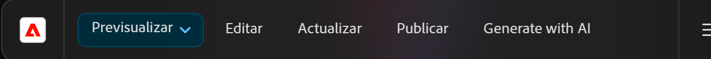

# Generar variaciones: integrado en editores AEM {#generate-variations-integrated-in-aem-editors}

Si está buscando una manera de optimizar sus canales digitales y acelerar la creación de contenido, puede utilizar “Generar variaciones” integrado en los editores AEM. 

Generar variaciones utiliza inteligencia artificial (IA) generativa para crear variaciones de contenido basadas en los datos introducidos. Después de crear variaciones, puede usar el contenido de su sitio web y también medir su éxito usando la funcionalidad [Experimentación](https://www.aem.live/docs/experimentation) de [Edge Delivery Services](/help/edge/overview.md).

Esto ayuda a acelerar la velocidad del contenido mediante la creación rápida de contenido de la marca en minutos. Esto, a su vez, ayuda a mejorar la conversión con nuevas variantes de copia.

Puede [acceder a Generar variaciones](#access-generate-variations) desde los siguientes editores ([una vez ya configurados](#access-generate-variations)):

* [en la barra de tareas de AEM Edge Delivery Services; para la creación basada en documentos](#access-aem-sidekick)
* [el editor universal](#access-aem-universal-editor)
* [el editor de fragmentos de contenido](#access-aem-content-fragment-editor)

>[!IMPORTANT]
>
>Esta página utiliza la creación basada en documentos como base para los ejemplos, pero los principios se aplican a los demás editores.

>[!NOTE]
>
>En todos los casos, para usar “Generar variaciones” debe asegurarse de que se cumplan los [requisitos previos de acceso](#access-prerequisites).

>[!NOTE]
>
>Se recomienda usar esta versión, ya que aunque se puede acceder directamente a la versión independiente de [Generar variaciones](/help/generative-ai/generate-variations.md), quedará obsoleta en el futuro.

Podrá hacer lo siguiente:

* [Seleccione el contenido con el que desea trabajar](#select-the-content) entre los bloques existentes de su contenido
   * El bloque seleccionado determina lo que se muestra y las acciones disponibles
* [Describir los cambios que desee](#describe-the-changes-you-want)
* [Generar variaciones de su contenido](#generate-copy) y, luego, [tomar acciones adicionales si lo desea](#take-further-action-on-a-variation)
* [Seleccionar y utilizar una variación](#use-a-generated-variation)
* Revisar su [historial](#history)
* Ver sus [favoritos](#favorites)

## Aviso legal y de uso {#legal-usage-note}

<!--
Generative AI and Generate Variations for AEM are powerful tools – but **you** are responsible for use of the output.

Your inputs to the service should be tied to a context. This context can be your branding materials, website content, data, schemas for such data, templates, or other trusted documents.

You must evaluate the accuracy of any output as appropriate to your use case.

Before using Generate Variations you are recommended to read the [Adobe Experience Cloud Generative AI User Guidelines](https://www.adobe.com/legal/licenses-terms/adobe-dx-gen-ai-user-guidelines.html).
-->

[El uso de “Generar variaciones”](#generative-action-usage) se refiere al consumo de acciones generativas.

>[!NOTE]
>
>Consulte la [hoja informativa de seguridad para obtener detalles relacionados con Generar variaciones en AEM](https://www.adobe.com/content/dam/cc/es/trust-center/ungated/whitepapers/experience-cloud/aem-sites-generate-variations-security-fact-sheet.pdf).

## Información general {#overview}

Cuando abra “Generar variaciones” integrado en un editor, verá la extensión como un panel flotante con tres pestañas.


* El editor:
   * Muestra el flujo de contenido en el editor.
   * Aquí puede seleccionar un bloque de contenido para utilizarlo en **Generar variaciones**.
* **Generar variaciones**:
   * Es un panel flotante con tres pestañas, que se puede reubicar como desee
   * [Generar](#get-started-with-generate-variations):
      * Muestra el [contenido que ha seleccionado](#select-the-content).
      * Proporciona **Sugerencias** de ejemplo para realizar cambios.
      * Le permite [describir los cambios que desea](#describe-the-changes-you-want).
      * Le permite [Generar](#generate-copy) nuevas variaciones.
      * Muestra las variaciones generadas. <!--, together with their [brand score](#the-brand-score).-->
      * [Adoptar acciones adicionales en una variación](#take-further-action-on-a-variation).
      * [Usar una variación generada](#use-a-generated-variation).
   * [Historial](#history):
      * Muestra su historial reciente de generaciones.
   * [Favoritos](#favorites):
      * Muestra los resultados de generaciones anteriores que ha marcado como favoritos.
   * **Términos de IA generativa de Adobe**: vínculos a las [Directrices del usuario de IA generativa de Adobe Experience Cloud](https://www.adobe.com/legal/licenses-terms/adobe-dx-gen-ai-user-guidelines.html).

## Introducción a Generar variaciones {#get-started-with-generate-variations}

La interfaz le guía a través del proceso de generación de contenido. Tras abrir la interfaz, el primer paso es seleccionar el bloque de contenido que desea utilizar.

### Seleccionar el contenido {#select-the-content}

En el flujo de contenido principal del editor, seleccione el contenido para el que desea generar variaciones. Esta **selección** se mostrará en la pestaña **Generar**.

### Describir los cambios que desee {#describe-the-changes-you-want}

Para generar variaciones del contenido, debe describir los cambios que desee realizar. Puede seleccionar una de las **sugerencias** ofrecidas o proporcionar su propia descripción.

También puede especificar **Modificadores** para proporcionar más contexto:

* **Hacer referencia a una página web**
Proporcione una URL para más contexto.
* **Cargar resumen de contenido**
Actualice un archivo `.docx` que contenga detalles de resumen del contenido (10 MB o menos).

### Generar copia {#generate-copy}

Después de describir los cambios que desea, seleccione **Generar** para ver las respuestas de la IA generativa.


<!--
### The Brand Score {#the-brand-score}

The brand score shows you how on-brand the generated variation is.
-->

### Adoptar acciones adicionales en una variación {#take-further-action-on-a-variation}

Al seleccionar una sola variación, puede utilizar las siguientes acciones:

* **Editar**
   * Puede editar el texto de la variación generada.

      * Las actualizaciones se pueden previsualizar en la página web.

   * Guardar los cambios para utilizarlos más adelante.
* **Favorito**
   * Marcar esta variación para referencia futura.
   * Una vez marcada, se mostrará en la pestaña [Favoritos](#favorites).
* **Motivo de IA**
   * Para lograr mayor transparencia, esto proporciona una breve descripción de por qué la IA generativa ha generado esa variación en particular.

### Usar una variación generada {#use-a-generated-variation}

Para utilizar el contenido generado con IA generativa, primero debe seleccionarlo y **Exportarlo a CSV**.

Después de la exportación, puede utilizar el contenido en cualquier otra parte; por ejemplo, al crear contenido para su sitio web. También puede ejecutar un [experimento](https://www.aem.live/docs/experimentation).

>[!NOTE]
>
>Cuando se accede a Generar variaciones desde el [Editor universal de AEM](#access-aem-universal-editor) o el [Editor de fragmentos de contenido de AEM](#access-aem-content-fragment-editor), el contenido generado seleccionado se guarda automáticamente en AEM.

## Historia {#history}

Esta pestaña muestra su actividad anterior después de seleccionar **Generar**. Se añade una entrada **Historial**.

Si, en un momento posterior, selecciona el mismo contenido en el flujo principal y abre la pestaña **Historial**, verá todas las variaciones generadas para ese bloque.

## Favoritos {#favorites}

Después de revisar el contenido, puede guardar las variaciones seleccionadas como favoritas.

Una vez guardadas, se muestran en **Favoritos**. Los favoritos se mantienen (hasta que los **quite de Favoritos** o borre la caché del explorador).

* Puede **Editar**, **Quitar de Favoritos** o mostrar el **Motivo de IA** para una entrada.
* Una vez seleccionada una variación, también puede **Exportar a CSV**.

## Uso de acciones generativas {#generative-action-usage}

La administración del uso depende de la acción realizada:

* Generar variaciones

  Una generación de una variante de copia es igual a una acción generativa. Como cliente, dispone de un determinado número de acciones generativas que vienen con su licencia de AEM. Una vez que haya consumido los derechos básicos, podrá adquirir acciones adicionales.

  >[!NOTE]
  >
  >Consulte [Adobe Experience Manager: Cloud Service | Descripción del producto](https://helpx.adobe.com/legal/product-descriptions/aem-cloud-service.html) para obtener más información acerca de los derechos básicos, y póngase en contacto con el equipo de la cuenta si desea adquirir acciones más generativas.

## Acceso a “Generar variaciones” {#access-generate-variations}

Después de cumplir los requisitos previos, puede acceder a “Generar variaciones” desde AEM as a Cloud Service o desde la barra de tareas de Edge Delivery Services.

### Requisitos previos de acceso {#access-prerequisites}

Para utilizar “Generar variaciones”, debe asegurarse de que se cumplen los requisitos previos:

* [Acceso a Experience Manager as a Cloud Service con Edge Delivery Services](#access-to-aemaacs-with-edge-delivery-services)

#### Acceso a Experience Manager as a Cloud Service con Edge Delivery Services{#access-to-aemaacs-with-edge-delivery-services}

Los usuarios que necesiten acceder a “Generar variaciones” deben tener derecho a un entorno de Experience Manager as a Cloud Service con Edge Delivery Services.

>[!NOTE]
>
>Si su contrato de AEM Sites as a Cloud Service no incluye Edge Delivery Services, deberá firmar un nuevo contrato para obtener acceso.
>
>Debe ponerse en contacto con su equipo de cuentas para hablar sobre cómo puede pasarse a AEM Sites as a Cloud Service con Edge Delivery Services.

Para conceder acceso a usuarios específicos, asigne su cuenta de usuario al perfil de producto correspondiente. Consulte [Asignación de perfiles de productos de AEM para obtener más detalles](/help/journey-onboarding/assign-profiles-cloud-manager.md).

### Acceso desde AEM Sidekick para la creación basada en documentos {#access-aem-sidekick}

El acceso desde AEM Sidekick se usa para la [creación basada en documentos](/help/edge/wysiwyg-authoring/authoring.md).

Es necesario realizar alguna configuración antes de poder acceder a “Generar variaciones” desde la barra de tareas (de Edge Delivery Services).

>[!NOTE]
>
>Consulte el documento [Instalación de la barra de tareas de AEM](https://www.aem.live/docs/sidekick-extension) para obtener información sobre cómo instalar y configurar la barra de tareas.

Para utilizar “Generar variaciones” en la barra de tareas (de Edge Delivery Services), incluya la siguiente configuración en sus proyectos de Edge Delivery Services en:

1. Habilitar nuestra aplicación en:

   * `tools/sidekick/config.json`

   Esto debe combinarse con la configuración existente y luego implementarse.

   Por ejemplo:

   ```prompt
   {
     "plugins": [
       {
         "id": "aem-genai-variations",
         "titleI18n": {
           "en": "Generate with AI"
         },
         "environments": [
           "preview"
         ],
         "includePaths": [
           "**.docx**"
         ],
         "event": "aem-genai-variations-sidekick"
       }
     ]
   }
   ```

1. Crear:

   * `/tools/sidekick/aem-genai-variations.js`

   Debe crear este archivo con el siguiente contenido:

   ```prompt
   (function () {
     let isAEMGenAIVariationsAppLoaded = false;
     function loadAEMGenAIVariationsApp() {
       const script = document.createElement('script');
       script.src = 'https://experience.adobe.com/solutions/aem-sites-genai-aem-genai-variations-mfe/static-assets/resources/sidekick/client.js?source=plugin';
       script.onload = function () {
         isAEMGenAIVariationsAppLoaded = true;
       };
       script.onerror = function () {
         console.error('Error loading AEMGenAIVariationsApp.');
       };
       document.head.appendChild(script);
     }
   
     function handlePluginButtonClick() {
       if (!isAEMGenAIVariationsAppLoaded) {
         loadAEMGenAIVariationsApp();
       }
     }
   
     // The code snippet for the Sidekick V1 extension, https://chromewebstore.google.com/detail/aem-sidekick/ccfggkjabjahcjoljmgmklhpaccedipo?hl=en
     const sidekick = document.querySelector('helix-sidekick');
     if (sidekick) {
       // sidekick already loaded
       sidekick.addEventListener('custom:aem-genai-variations-sidekick', handlePluginButtonClick);
     } else {
       // wait for sidekick to be loaded
       document.addEventListener('sidekick-ready', () => {
         document.querySelector('helix-sidekick')
           .addEventListener('custom:aem-genai-variations-sidekick', handlePluginButtonClick);
       }, { once: true });
     }
   
     // The code snippet for the Sidekick V2 extension, https://chromewebstore.google.com/detail/aem-sidekick/igkmdomcgoebiipaifhmpfjhbjccggml?hl=en
     const sidekickV2 = document.querySelector('aem-sidekick');
     if (sidekickV2) {
       // sidekick already loaded
       sidekickV2.addEventListener('custom:aem-genai-variations-sidekick', handlePluginButtonClick);
     } else {
       // wait for sidekick to be loaded
       document.addEventListener('sidekick-ready', () => {
         document.querySelector('aem-sidekick')
           .addEventListener('custom:aem-genai-variations-sidekick', handlePluginButtonClick);
       }, { once: true });
     }
   }());
   ```

1. Actualizar:

   * `/scripts/scripts.js`

   Se debe actualizar para incluir la instrucción siguiente en la función `loadLazy()`:

   ```prompt
     import('../tools/sidekick/aem-genai-variations.js');
   ```

   Esto garantiza que `/tools/sidekick/aem-genai-variations.js` se cargue como parte del proceso de carga a medida.

   

1. A continuación, es posible que tenga que asegurarse de que los usuarios disponen de [Acceso a Experience Manager as a Cloud Service con Edge Delivery Services](#access-to-aemaacs-with-edge-delivery-services).

1. A continuación, puede acceder a la función seleccionando **Generar con IA** en la barra de herramientas de la barra de tareas:

   

### Acceso desde el Editor universal de AEM {#access-aem-universal-editor}

El acceso desde el [Editor universal de AEM](/help/sites-cloud/authoring/universal-editor/authoring.md) está implementado como una extensión. Consulte [Extension Manager en AEM Experience Manager](https://developer.adobe.com/uix/docs/extension-manager/) para obtener más información.

### Acceso desde el editor de fragmentos de contenido de AEM {#access-aem-content-fragment-editor}

El acceso desde el [Editor de fragmentos de contenido de AEM](/help/sites-cloud/administering/content-fragments/authoring.md#generate-variations-ai) está implementado como una extensión. Consulte [Extension Manager en AEM Experience Manager](https://developer.adobe.com/uix/docs/extension-manager/) para obtener más información.

## Información adicional {#further-information}

Para obtener más información, también puede leer:

* [Generar variaciones de IA generativa en GitHub](https://github.com/adobe/aem-genai-assistant#setting-up-aem-genai-assistant)
* [Experimentación de Edge Delivery Services](https://www.aem.live/docs/experimentation)
* [IA generativa en productos de Experience Cloud](https://experienceleague.adobe.com/en/docs/core-services/interface/features/generative-ai)

   * [IA generativa en productos de Experience Cloud - Adobe Experience Manager](https://experienceleague.adobe.com/en/docs/core-services/interface/features/generative-ai#aem)

## Historial de versiones {#release-history}

Para más detalles sobre la versión actual, y las anteriores, consulte las [Notas de la versión de “Generar variaciones”](/help/generative-ai/release-notes-generate-variations.md).
