# Generar variaciones {#generate-variations}


>[!NOTE]
>
>Se recomienda acceder a [Generar variaciones integradas en los editores de AEM](/help/generative-ai/generate-variations-integrated-editor.md), ya que la versión que se describe en esta página quedará obsoleta en el futuro.

Si está buscando una manera de optimizar sus canales digitales y acelerar la creación de contenido, puede utilizar “Generar variaciones”. “Generar variaciones” utiliza inteligencia artificial (IA) generativa para crear variaciones de contenido basadas en indicaciones; estas indicaciones las proporciona Adobe o las crean y administran los usuarios. Después de crear variaciones, puede usar el contenido de su sitio web y también medir su éxito usando la funcionalidad [Experimentación](https://www.aem.live/docs/experimentation) de [Edge Delivery Services](/help/edge/overview.md).

Puede [acceder a “Generar variaciones”](#access-generate-variations) desde:

* [en Adobe Experience Manager (AEM) as a Cloud Service](#access-aemaacs)
* [la barra de tareas de AEM Edge Delivery Services](#access-aem-sidekick)
* [el editor de fragmentos de contenido](/help/sites-cloud/administering/content-fragments/authoring.md#generate-variations-ai)

>[!NOTE]
>
>En todos los casos, para usar “Generar variaciones” debe asegurarse de que se cumplan los [requisitos previos de acceso](#access-prerequisites).

Podrá hacer lo siguiente:

* [Empezar](#get-started) mediante una plantilla de indicación que Adobe ha creado para un caso de uso específico.
* Puede [editar una indicación existente](#edit-the-prompt)
* O [crear y usar sus propias indicaciones](#create-prompt):
   * [Guardar sus indicaciones](#save-prompt) para utilizarlas en el futuro
   * [Acceder y utilizar indicaciones compartidas](#select-prompt) de toda su organización
* Defina los segmentos de [público](#audiences) que se utilizarán en la indicación al [generar contenido personalizado específico para un público](#generate-copy).
* Previsualice el resultado junto a la indicación, antes de realizar modificaciones y afinar los resultados, si fuera necesario.
* Utilice [Adobe Express para generar imágenes](#generate-image) basadas en las variaciones de la copia; esto aprovecha las capacidades de IA generativa de Firefly.
* Seleccione el contenido que desea utilizar en el sitio web o en un experimento.

## Aviso legal y de uso {#legal-usage-note}

La IA generativa y “Generar variaciones” para AEM son herramientas potentes; pero **usted** es responsable del uso que haga de los resultados.

Lo que introduzca en el servicio debe estar vinculado a un contexto. Este contexto puede ser el material de personalización de la marca, el contenido del sitio web, los datos, los esquemas para dichos datos, las plantillas u otros documentos de confianza.

Debe evaluar la precisión de cualquier resultado según corresponda para su caso de uso.

Antes de usar “Generar variaciones”, debe aceptar las [Directrices del usuario de IA generativa de Adobe](https://www.adobe.com/legal/licenses-terms/adobe-dx-gen-ai-user-guidelines.html).

[El uso de “Generar variaciones”](#generative-action-usage) está ligado al consumo de acciones generativas.

## Información general {#overview}

Cuando abra “Generar variaciones” (y expanda el panel izquierdo), verá lo siguiente:

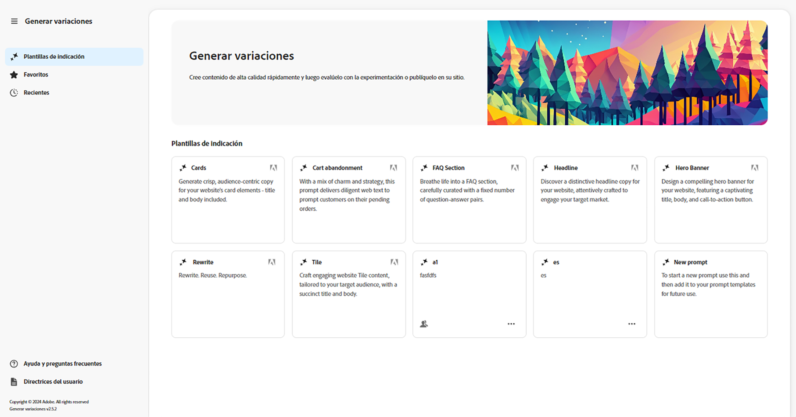

* Panel derecho
   * Esto depende de la selección que realice en el panel de navegación izquierdo.
   * De manera predeterminada, se muestran **plantillas de indicación**.
* Navegación izquierda
   * A la izquierda de **Generar variaciones**, existe la opción (menú de sándwich) de expandir u ocultar el panel de navegación izquierdo.
   * **Plantillas de indicación**:
      * Muestra vínculos a las distintas indicaciones, que pueden incluir:
         * Proporcionadas por Adobe para ayudarle a generar contenido; marcadas con el icono de Adobe.
         * Creadas por usted mismo.
         * Creadas dentro de su organización IMS; marcadas con un icono que muestra varias cabezas.
      * Incluye el vínculo [Nueva indicación](#create-prompt) para crear su propia indicación.
      * Puede **eliminar** indicaciones creadas por usted mismo o dentro de su organización IMS. Esto se realiza mediante el menú al que se accede con los puntos suspensivos de la tarjeta correspondiente.
   * [Favoritos](#favorites): muestra los resultados de generaciones anteriores que ha marcado como favoritos.
   * [Recientes](#recents): proporciona vínculos a las indicaciones y sus entradas que ha utilizado recientemente.
   * **Ayuda y preguntas frecuentes**: vínculos a documentación, incluidas las preguntas frecuentes.
   * **Directrices de usuario**: vínculos a las directrices legales.

## Introducción {#get-started}

La interfaz le guía a través del proceso de generación de contenido. Tras abrir la interfaz, el primer paso es seleccionar la indicación que desea utilizar.

### Seleccionar indicación {#select-prompt}

En el panel principal, puede seleccionar:

* una plantilla de indicación proporcionada por Adobe para empezar a generar contenido,
* la opción [Nueva indicación](#create-prompt) para crear su propia indicación,
* una plantilla que ha creado para su uso exclusivo,
* una plantilla que usted o alguien de su organización hayan creado.

Cómo diferenciarlas:

* Las indicaciones proporcionadas por Adobe están marcadas con el icono de Adobe.
* Las indicaciones disponibles en toda su organización IMS están marcadas con un icono de varias cabezas.
* Las indicaciones privadas no están marcadas de forma específica.

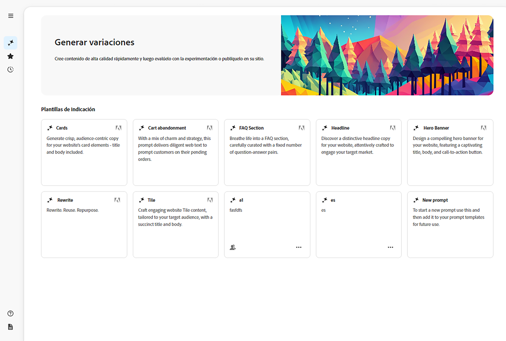

### Proporcionar entradas {#provide-inputs}

Cada indicación necesita que usted proporcione cierta información para que la IA generativa pueda devolverle el contenido adecuado.

Los campos de entrada le guiarán sobre la información necesaria. Para ayudarle, ciertos campos tienen valores predeterminados que puede utilizar o modificar según sea necesario, así como descripciones que explican los requisitos.

Hay varios campos de entrada clave que son comunes a varias indicaciones (algunos campos no siempre están disponibles):

* **Recuento de**/**Número de**
   * Puede seleccionar cuántas variaciones de contenido desea crear en una generación.
   * Dependiendo de la indicación, esto puede tener una de varias etiquetas; por ejemplo Recuento, Número de variaciones, Número de ideas, etc.
* **Fuente de público**/**Público destinatario**
   * Ayuda a generar contenido personalizado para un público específico.
   * Adobe proporciona públicos predeterminados; o puede especificar públicos adicionales. Consulte [Públicos](#audiences).
* **Contexto adicional**
   * Inserte contenido relevante para ayudar a la IA generativa a elaborar una respuesta mejor basada en la entrada. Por ejemplo, si está creando un banner web para una página o producto en particular, es posible que desee incluir información sobre la página o el producto.
* **Temperatura**
Utilice esta opción para modificar la temperatura de la IA generativa de Adobe:
   * Una temperatura más alta se aleja de la indicación y conduce a una mayor variación, aleatoriedad y creatividad.
   * Una temperatura más baja es más determinística y se ciñe más a lo que dice la indicación.
   * Por defecto, la temperatura está establecida en 1. Puede experimentar con diferentes temperaturas si los resultados generados no son de su agrado.
* **Editar indicación**
   * La indicación subyacente [puede editarse](#edit-the-prompt) para afinar los resultados generados.

### Generar copia {#generate-copy}

Después de rellenar los campos de entrada o de modificar la indicación, ya podrá generar contenido y revisar las respuestas.

Seleccione **Generar** para ver las respuestas generadas por la IA generativa. Las variaciones de contenido generadas se muestran bajo la indicación que las generó.

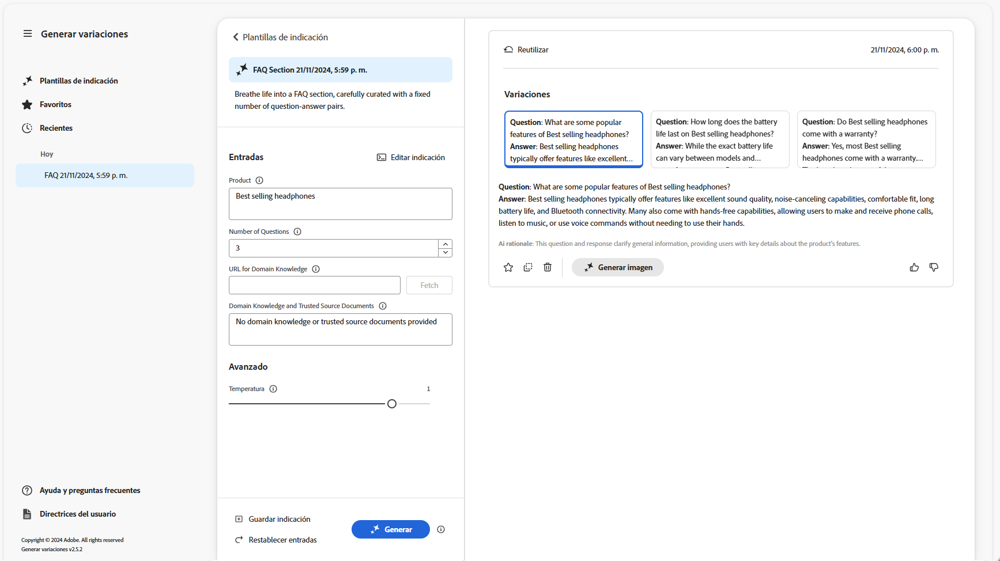

>[!NOTE]
>
>La mayoría de las plantillas de indicación de Adobe incluyen un **motivo de IA** en la variación. Esto proporciona transparencia sobre por qué la IA generativa generó esa variación en particular.

Cuando seleccione una única variación, dispondrá de las siguientes acciones:

* **Favorito**
   * Marcar como **favorito** para su uso futuro (se mostrará en [Favoritos](#favorites)).
* Pulgar arriba/abajo
   * Utilice los indicadores de pulgar arriba/abajo para informar a Adobe sobre la calidad de las respuestas.
* **Copiar**
   * Copie la variación en el portapapeles para utilizarla durante la creación de contenido en su sitio web o en un [Experimento](https://www.aem.live/docs/experimentation).
* **Quitar**

Si necesita afinar las entradas o la indicación, puede realizar ajustes y seleccionar **Generar** de nuevo para obtener un conjunto de respuestas nuevas. La nueva indicación y respuesta se muestran debajo de la indicación y la respuesta iniciales; puede desplazarse hacia arriba y hacia abajo para ver los distintos conjuntos de contenido.

Encima de cada conjunto de variaciones aparece la indicación que las creó, junto con la opción **Reutilizar**. Si alguna vez necesita volver a ejecutar una indicación con sus entradas, seleccione **Reutilizar** para volver a cargarlas en **Entradas**.

### Generar imagen {#generate-image}

Después de haber generado variaciones de texto, puede generar imágenes en Adobe Express utilizando las capacidades de IA generativa de Firefly.

>[!NOTE]
>
>**Generar imagen** solo está disponible si dispone de un derecho de Adobe Express como parte de su organización IMS y se le ha concedido acceso en Admin Console.

Seleccione una variación, seguida de **Generar imagen**, para abrir directamente **Texto a imagen** en [Adobe Express](https://www.adobe.com/express/). La indicación se rellena previamente en función de su selección de variantes y las imágenes se generan automáticamente de acuerdo con esa indicación.

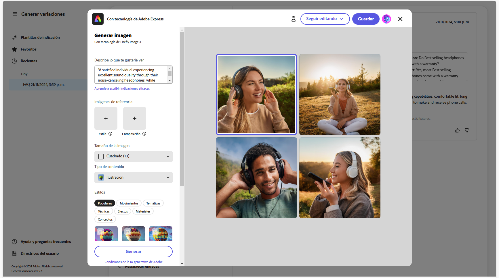

Puede realizar más cambios:

* [escriba su propia indicación en Adobe Express](https://helpx.adobe.com/firefly/using/tips-and-tricks.html) describiendo lo que le gustaría ver,
* ajuste las opciones **Texto a imagen**,
* luego **Actualice** las imágenes generadas.

También puede utilizar **Explorar más** para obtener más opciones.

Cuando haya terminado, seleccione la imagen deseada y **Guardar** para cerrar Adobe Express. La imagen se devuelve y se guarda con la variación.


Aquí puede pasar el ratón por encima de la imagen para mostrar los siguientes elementos de acción:

* **Copiar**: [copiar la imagen en el portapapeles para usarla en otro lugar](#use-content)
* **Editar**: abre Adobe Express para poder realizar cambios en la imagen
* **Descargar**: descargar la imagen en el equipo local
* **Eliminar**: eliminar la imagen de la variación

>[!NOTE]
>
>[Las Content Credentials](https://helpx.adobe.com/creative-cloud/help/content-credentials.html) no se conservan cuando se utilizan en la creación basada en documentos.

### Utilizar el contenido {#use-content}

Para utilizar el contenido generado con IA generativa, debe copiar el contenido en el portapapeles para utilizarlo en otra parte.

Esto se realiza mediante los iconos de copia:

* Para el texto, utilice el icono de copia visible en el panel de variaciones
* Para la imagen, pase el ratón sobre la imagen para ver el icono de copia

Una vez copiada en el portapapeles, puede pegar la información para utilizarla al crear contenido para el sitio web. También puede ejecutar un [experimento](https://www.aem.live/docs/experimentation).

## Favoritos {#favorites}

Después de revisar el contenido, puede guardar las variaciones seleccionadas como favoritas.

Una vez guardadas, se muestran en **Favoritos** en el panel de navegación izquierdo. Los favoritos se mantienen (hasta que los **elimine** o borre la caché del explorador).

* Los favoritos y las variaciones se pueden copiar y pegar en el portapapeles para su uso en el contenido del sitio web.
* Los favoritos pueden **quitarse**.

## Recientes {#recents}

Esta sección incluye vínculos a su actividad reciente. Se añade una entrada **Reciente** después de seleccionar **Generar**. Tiene el nombre de la indicación y una marca de tiempo. Si selecciona un vínculo, se carga la indicación, se rellenan los campos de entrada según corresponda y se muestran las variaciones generadas.

## Editar la indicación {#edit-the-prompt}

La indicación subyacente puede editarse. Puede que quiera hacer esto:

* Si los resultados generados que obtiene necesitan un mayor refinamiento
* Desea modificar y [guardar la indicación](#save-prompt) para utilizarla en el futuro

Seleccione **Editar indicación**:

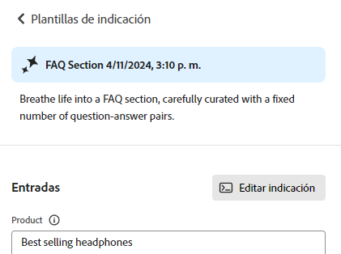

Esto abre el editor de indicaciones, donde puede realizar los cambios:

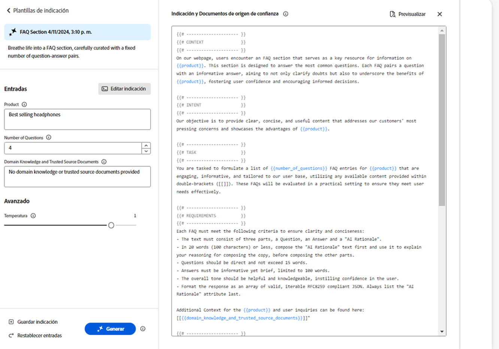

### Añadir entradas de indicación {#add-prompt-inputs}

Al crear o editar una indicación, es posible que desee añadir campos de entrada. Los campos de entrada actúan como variables en la indicación y dan flexibilidad para utilizar la misma indicación en varios escenarios. Permiten a los usuarios definir elementos específicos de la indicación, sin tener que escribir toda la indicación.

* Un campo se define con llaves dobles `{{ }}` que encierran un nombre de marcador de posición.
Por ejemplo, `{{tone_of_voice}}`.

  >[!NOTE]
  >
  >No se permiten espacios entre llaves dobles.

* También se define en `METADATA`, con los siguientes parámetros:
   * `label`
   * `description`
   * `default`
   * `type`

#### Ejemplo: Añadir nuevo campo de texto: tono de voz {#example-add-new-text-field-tone-of-voice}

Para añadir un nuevo campo de texto titulado **Tono de voz**, utilice la siguiente sintaxis en su indicación:

```prompt
{{@tone_of_voice, 
  label="Tone of voice",
  description="Indicate the desired tone of voice",
  default="optimistic, smart, engaging, human, and creative",
  type=text
}}
```

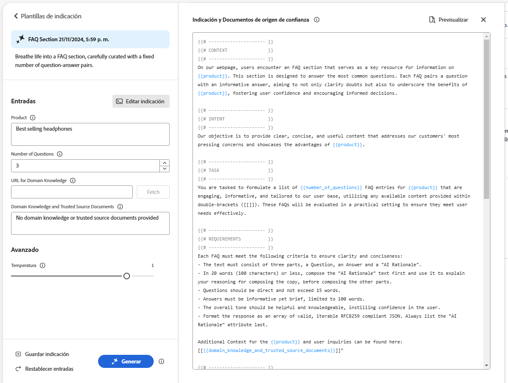

<!--
#### Example: Add new dropdown field - Page Type {#example-add-new-dropdown-field-page-type}

To create an input field Page Type providing a dropdown selection:

1. Create a spreadsheet named `pagetype.xls` in the top-level directory of your folder structure.
1. Edit the spreadsheet:

   1. Create two columns: **Key** and **Value**.
   1. In the **Key** column, enter labels that will appear in the dropdown.
   1. In the **Value** column, describe the key value so the generative AI has context.

1. In your prompt, refer to the title of the spreadsheet along with the appropriate type. 

   ```prompt
   {{@page_type, 
     label="Page Type",
     description="Describes the type of page",
     spreadsheet=pagetype
   }}
   ```
-->

## Crear una indicación {#create-prompt}

Al seleccionar **Nueva indicación** en **Plantillas de indicación**, un nuevo panel le permitirá introducir una nueva indicación. A continuación, puede especificarlas, junto con la **Temperatura**, para **generar** contenido.

Consulte [Guardar indicación](#save-prompt) para saber cómo guardar la indicación para el futuro.

Consulte [Añadir entradas de indicación](#add-prompt-inputs) para obtener más información sobre cómo añadir sus propias entradas de indicación.

Si desea conservar el formato tanto en la interfaz de usuario como al copiar y pegar en el flujo de creación basado en documentos, incluya lo siguiente en la indicación:

<!-- CHECK - are the double-quotes needed? -->

* `"Format the response as an array of valid, iterable RFC8259 compliant JSON"`

La siguiente imagen muestra las ventajas de hacerlo:

* en el primer ejemplo se combinan `Title` y `Description`
* mientras que en el segundo ejemplo se les aplica formato por separado: esto se ha hecho incluyendo la solicitud JSON en la indicación.


## Guardar indicación {#save-prompt}

Después de editar o crear indicaciones, es posible que desee guardarlas para utilizarlas en el futuro; ya sea para su organización IMS o para usted solo. La indicación guardada aparecerá como una tarjeta de **plantilla de indicación**.

Cuando haya editado la indicación, la opción **Guardar** estará disponible en la parte inferior de la sección Entradas, a la izquierda de la opción **Generar**.

Cuando se selecciona, se abre el cuadro de diálogo **Guardar indicación**:

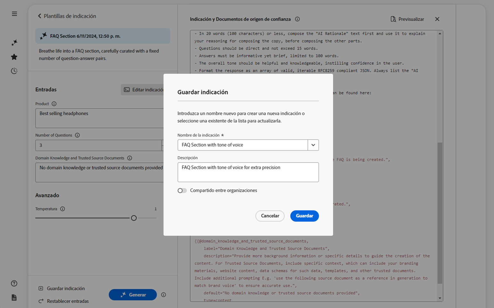

1. Añada un **Nombre de indicación** único; se utiliza para identificar la indicación dentro de **Plantillas de indicación**.
   1. Un nombre nuevo y único crea una nueva plantilla de indicación.
   1. Introducir un nombre existente sobrescribe esa indicación; se muestra un mensaje.
1. Si lo desea, añada una descripción.
1. Active o desactive la opción **Compartido en toda la organización**, dependiendo de si la indicación debe ser privada para usted o estar disponible en toda su organización IMS. Este estado se muestra en la [tarjeta resultante que aparece en las plantillas de indicación](#select-prompt).
1. **Guarde** la indicación; o **cancele** la acción.

>[!NOTE]
>
>Se le informará (advertirá) si está sobrescribiendo o actualizando una indicación existente.

>[!NOTE]
>
>Desde **Plantillas de indicación** puede eliminar las indicaciones (utilizando el menú al que se accede haciendo clic en los tres puntos) creadas por usted mismo o dentro de su organización IMS.

## Públicos {#audiences}

Para generar contenido personalizado, la IA generativa debe contar con información sobre el público. Adobe proporciona una serie de públicos predeterminados; también puede añadir los suyos propios.

Al añadir un público, debe describirlo en lenguaje natural. Por ejemplo:

* para crear un público:
   * `Student`
* podría decir:
   * `The audience consists of students, typically individuals who are pursuing education at various academic levels, such as primary, secondary, or tertiary education. They are engaged in learning and acquiring knowledge in diverse subjects, seeking academic growth, and preparing for future careers or personal development.`

Se admiten dos fuentes de público:

* [Adobe Target](#audience-adobe-target)
* [Archivo CSV](#audience-csv-file)

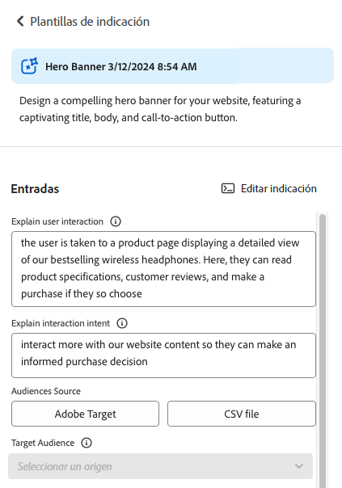

### Público: Adobe Target {#audience-adobe-target}

La selección de un público de **Adobe Target** en la indicación permite generar contenido personalizado para ese público.

>[!NOTE]
>
>Para utilizar esta opción, su organización IMS debe tener acceso a Adobe Target.

1. Seleccione **Adobe Target**.
1. A continuación, seleccione el **público destinatario** deseado de la lista proporcionada.

   >[!NOTE]
   >
   >Para utilizar un público de **Adobe Target**, debe rellenarse el campo de descripción. En caso contrario, el público aparece en la lista desplegable como no disponible. Para añadir una descripción, vaya a Target y [añada una descripción del público](https://experienceleague.adobe.com/es/docs/target-learn/tutorials/audiences/create-audiences).

   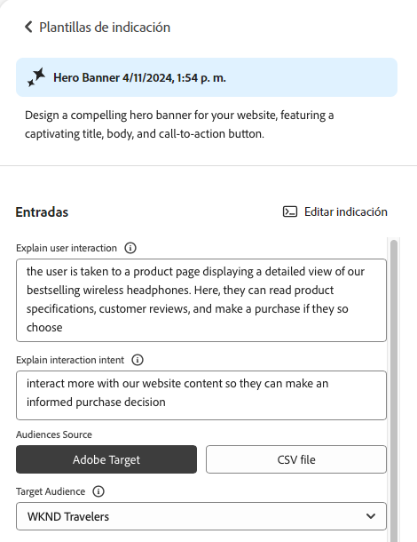

#### Añadir público de Adobe Target {#add-adobe-target-audience}

Consulte [Crear públicos](https://experienceleague.adobe.com/es/docs/target-learn/tutorials/audiences/create-audiences) para crear un público en Adobe Target.

### Público: archivo CSV {#audience-csv-file}

La selección de un público de **archivo CSV** en la indicación permite generar contenido personalizado para el **público destinatario** seleccionado.

Adobe ofrece una serie de públicos para su uso.

1. Seleccione **archivo CSV**.
1. A continuación, seleccione el **público destinatario** deseado de la lista proporcionada.

   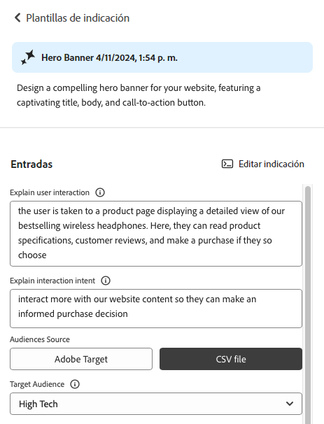

#### Añadir público de archivo CSV {#add-audience-csv-file}

Puede añadir un archivo CSV desde varias plataformas (por ejemplo, Google Drive, Dropbox o SharePoint) que tengan la capacidad de proporcionar una URL al archivo una vez que esté disponible públicamente.

>[!NOTE]
>
>En las plataformas compartidas, *debe* tener la capacidad de hacer que el archivo sea de acceso público.

Por ejemplo, para añadir un público desde un archivo de Google Drive:

1. En Google Drive, cree un archivo de hoja de cálculo con dos columnas:
   1. La primera columna aparecerá en la lista desplegable.
   1. La segunda columna será la descripción del público.
1. Publique el archivo:
   1. Archivo -> Compartir -> publicar en la web -> CSV
1. Copie la URL en el archivo publicado.
1. Vaya a “Generar variaciones”.
1. Abra el editor de indicaciones.
1. Busque el público de **Adobe Target** en los metadatos y sustituya la URL.

   >[!NOTE]
   >
   >Asegúrese de que las comillas dobles (&quot;) se mantienen en ambos extremos de la dirección URL.

   Por ejemplo:

   

## Uso de acciones generativas {#generative-action-usage}

La administración del uso depende de la acción realizada:

* Generar variaciones

  Una generación de una variante de copia es igual a una acción generativa. Como cliente, dispone de un determinado número de acciones generativas que vienen con su licencia de AEM. Una vez que haya consumido los derechos básicos, podrá comprar acciones adicionales.

  >[!NOTE]
  >
  >Consulte [Adobe Experience Manager: Cloud Service | Descripción del producto](https://helpx.adobe.com/legal/product-descriptions/aem-cloud-service.html) para obtener más información acerca de los derechos básicos, y póngase en contacto con el equipo de la cuenta si desea comprar acciones más generativas.

* Adobe Express

  El uso de generación de imágenes se administra mediante derechos de Adobe Express y [créditos generativos](https://helpx.adobe.com/firefly/using/generative-credits-faq.html).

## Acceso a “Generar variaciones” {#access-generate-variations}

Después de cumplir los requisitos previos, puede acceder a “Generar variaciones” desde AEM as a Cloud Service o desde la barra de tareas de Edge Delivery Services.

### Requisitos previos de acceso {#access-prerequisites}

Para utilizar “Generar variaciones”, debe asegurarse de que se cumplen los requisitos previos:

* [Acceso a Experience Manager as a Cloud Service con Edge Delivery Services](#access-to-aemaacs-with-edge-delivery-services)

#### Acceso a Experience Manager as a Cloud Service con Edge Delivery Services{#access-to-aemaacs-with-edge-delivery-services}

Los usuarios que necesiten acceder a “Generar variaciones” deben tener derecho a un entorno de Experience Manager as a Cloud Service con Edge Delivery Services.

>[!NOTE]
>
>Si su contrato de AEM Sites as a Cloud Service no incluye Edge Delivery Services, deberá firmar un nuevo contrato para obtener acceso.
>
>Debe ponerse en contacto con su equipo de cuentas para hablar sobre cómo puede pasarse a AEM Sites as a Cloud Service con Edge Delivery Services.

Para conceder acceso a usuarios específicos, asigne su cuenta de usuario al perfil de producto correspondiente. Consulte [Asignación de perfiles de productos de AEM para obtener más detalles](/help/journey-onboarding/assign-profiles-cloud-manager.md).

### Acceso desde AEM as a Cloud Service {#access-aemaacs}

Se puede acceder a “Generar variaciones” desde el [panel de navegación](/help/sites-cloud/authoring/basic-handling.md#navigation-panel) de AEM as a Cloud Service:


### Acceso desde la barra de tareas de AEM {#access-aem-sidekick}

Es necesario realizar alguna configuración antes de poder acceder a “Generar variaciones” desde la barra de tareas (de Edge Delivery Services).

1. Consulte el documento [Instalación de la barra de tareas de AEM](https://www.aem.live/docs/sidekick-extension) para obtener información sobre cómo instalar y configurar la barra de tareas.

1. Para utilizar la función “Generar variaciones” en la barra de tareas (de Edge Delivery Services), incluya la siguiente configuración en sus proyectos de Edge Delivery Services en:

   * `tools/sidekick/config.json`

   Esto debe combinarse con la configuración existente y luego implementarse.

   Por ejemplo:

   ```prompt
   {
     // ...
     "plugins": [
       // ...
       {
         "id": "generate-variations",
         "title": "Generate Variations",
         "url": "https://experience.adobe.com/aem/generate-variations",
         "passConfig": true,
         "environments": ["preview","live", "edit"],
         "includePaths": ["**.docx**"]
       }
       // ...
     ]
   }
   ```

1. A continuación, es posible que tenga que asegurarse de que los usuarios disponen de [Acceso a Experience Manager as a Cloud Service con Edge Delivery Services](#access-to-aemaacs-with-edge-delivery-services).

1. A continuación, puede acceder a la función seleccionando **Generar variaciones** en la barra de herramientas de la barra de tareas:

   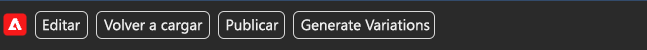

## Información adicional {#further-information}

Para obtener más información, también puede leer:

* [Generar variaciones de IA generativa en GitHub](https://github.com/adobe/aem-genai-assistant#setting-up-aem-genai-assistant)
* [Experimentación de Edge Delivery Services](https://www.aem.live/docs/experimentation)
* [IA generativa en AEM as a Cloud Service](/help/ai-in-aem/overview.md#generative-ai-in-aem)

## Preguntas frecuentes {#faqs}

### Resultados con formato {#formatted-outpu}

**La respuesta generada no me ofrece el resultado con el formato que necesito. ¿Cómo se modifica el formato? Por ejemplo: necesito un título y un subtítulo, pero la respuesta es solo el título.**

1. Abra la indicación en cuestión en modo de edición.
1. Vaya a los requisitos.
1. Encontrará requisitos relativos a los resultados.
   1. Ejemplo: “El texto debe constar de tres partes: un título, un cuerpo y una etiqueta de botón”. o “Formatear la respuesta como una matriz de objetos JSON válida con los atributos &quot;Title&quot;, &quot;Body&quot; y &quot;ButtonLabel&quot;”.
1. Modifique los requisitos para adaptarlos a sus necesidades.

   >[!NOTE]
   >
   >Si tiene restricciones de número de palabras/caracteres para los nuevos resultados introducidos, cree un requisito.

   Ejemplo: “El texto del título no debe superar las 10 palabras o los 50 caracteres, incluidos los espacios”.
1. Guarde la indicación para utilizarla en el futuro.

### Longitud de la respuesta {#length-of-response}

**La respuesta generada es demasiado larga o demasiado corta. ¿Cómo se cambia la longitud?**

1. Abra la indicación en cuestión en modo de edición.
1. Vaya a los requisitos.
1. Verá que para cada resultado hay un límite de palabras/caracteres correspondiente.
   1. Ejemplo: “El texto del título no debe superar las 10 palabras o los 50 caracteres, incluidos los espacios”.
1. Modifique los requisitos para adaptarlos a sus necesidades.
1. Guarde la indicación para utilizarla en el futuro.

### Mejorar las respuestas {#improve-responses}

**Las respuestas que obtengo no son exactamente las que esperaba. ¿Qué puedo hacer para mejorarlas?**

1. Intente cambiar la temperatura en Ajustes avanzados.
   1. Una temperatura más alta se aleja de la indicación y conduce a una mayor variación, aleatoriedad y creatividad.
   1. Una temperatura más baja es más determinística y se ciñe a lo que dice la indicación.
1. Abra la indicación en cuestión en el modo de edición y revísela. Preste especial atención a la sección de requisitos que describe el tono de voz y otros criterios importantes.

### Comentarios en una indicación {#comments-in-prompt}

**¿Cómo puedo utilizar comentarios en una indicación?**

Los comentarios en una indicación se utilizan para incluir notas, explicaciones o instrucciones que no deben formar parte de los resultados generados. Estos comentarios se encapsulan dentro de una sintaxis específica: comienzan y finalizan con llaves dobles y comienzan con un hash (por ejemplo, `{{# Comment Here }}`). Los comentarios ayudan a aclarar la estructura o la intención de la indicación sin afectar a la respuesta generada.

### Encontrar una indicación compartida {#find-a-shared-prompt}

**¿Qué puedo hacer si no encuentro una plantilla de indicación que alguien ha compartido?**

En esta situación hay diversos aspectos que debe comprobar:

1. Utilice la URL de su entorno.
Por ejemplo, https://experience.adobe.com/#/aem/generate-variations
1. Asegúrese de que la organización de IMS seleccionada sea la correcta.
1. Confirme que la indicación se ha guardado como “Compartida”.

### Indicaciones personalizadas en la versión 2.0.0 {#custom-prompts-v200}

**En la versión 2.0.0, mis indicaciones personalizadas han desaparecido: ¿qué puedo hacer?**

El paso a la versión 2.0.0 provocará la rotura de las plantillas de indicación personalizadas, por lo que no estarán disponibles.

Para recuperarlas:

1. Vaya a la carpeta “prompt-template” de Sharepoint.
1. Copie la indicación.
1. Abra la aplicación “Generar variaciones”.
1. Seleccione la tarjeta “Nueva indicación”.
1. Pegue la indicación.
1. Compruebe que la indicación funciona.
1. Guarde la indicación.

## Historial de versiones {#release-history}

Para más detalles sobre la versión actual, y las anteriores, consulte las [Notas de la versión de “Generar variaciones”](/help/generative-ai/release-notes-generate-variations.md).
