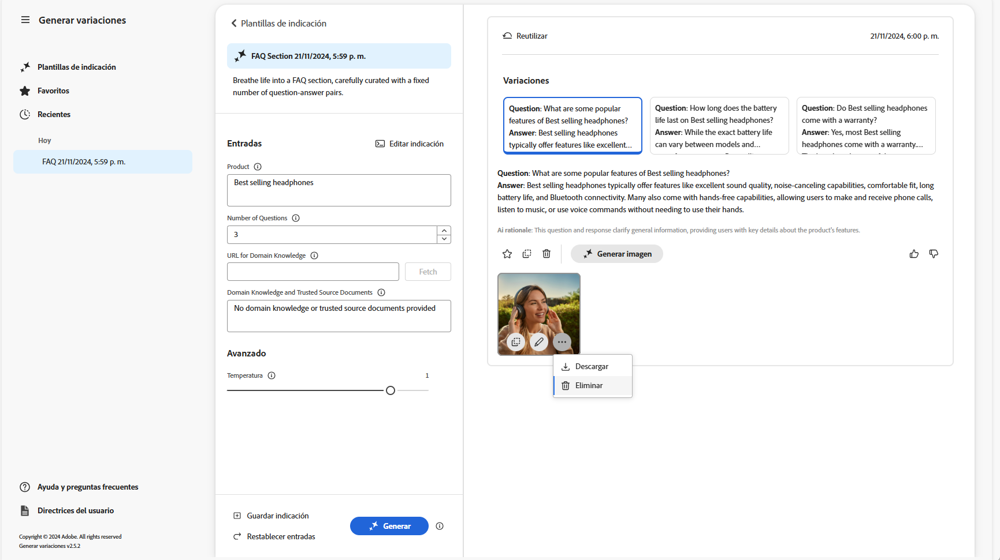

# Generar variaciones {#generate-variations}

Si está buscando una manera de optimizar sus canales digitales y acelerar la creación de contenido, puede utilizar Generar variaciones. Generate Variations utiliza inteligencia artificial (IA) generativa para crear variaciones de contenido basadas en mensajes; estos mensajes los proporciona Adobe o los crean y administran los usuarios. Después de crear variaciones, puede utilizar el contenido de su sitio web y también medir su éxito mediante la variable [Experimentación](https://www.aem.live/docs/experimentation) funcionalidad de [Edge Delivery Services](/help/edge/overview.md).

Puede [Acceso a Generar variaciones](#access-generate-variations) de:

* [dentro de Adobe Experience Manager AEM () as a Cloud Service](#access-aemaacs)
* [el Sidekick AEM de Edge Delivery Services de la](#access-aem-sidekick)
* [en el Editor de fragmentos de contenido](#authoring-content-fragments)

>[!NOTE]
>
>En todos los casos, para utilizar Generar variaciones debe asegurarse de que la variable [requisitos previos de acceso](#access-prerequisites) se han cumplido.

Podrá hacer lo siguiente:

* [Introducción a](#get-started) mediante una plantilla de solicitud que el Adobe ha creado para un caso de uso específico.
* Puede [editar una solicitud existente](#edit-the-prompt)
* O [crear y utilizar sus propios indicadores](#create-prompt):
   * [Guarde las indicaciones](#save-prompt) para uso futuro
   * [Acceso y uso de indicadores compartidos](#select-prompt) desde su organización
* Defina el [audiencia](#audiences) segmentos que se utilizarán en la solicitud cuando [generación de contenido personalizado específico de la audiencia](#generate-copy).
* Previsualice el resultado junto al mensaje, antes de realizar modificaciones y refinar los resultados si es necesario.
* Uso [Adobe Express para generar imágenes](#generate-image) en función de las variaciones de copia; utiliza las capacidades de IA generativa de Firefly.
* Seleccione el contenido que desea utilizar en el sitio web o en un experimento.

## Nota legal y de uso {#legal-usage-note}

AEM La IA generativa y la generación de variaciones para los son herramientas potentes, pero **usted** son responsables del uso de la salida.

Las entradas del servicio deben estar vinculadas a un contexto. Este contexto puede ser el material de promoción de la marca, el contenido del sitio web, los datos, los esquemas para dichos datos, las plantillas u otros documentos de confianza.

Debe evaluar la precisión de cualquier resultado según corresponda para su caso de uso.

Antes de usar Generar variaciones, es necesario que acepte el [Adobe Directrices del usuario de IA generativa](https://www.adobe.com/legal/licenses-terms/adobe-dx-gen-ai-user-guidelines.html).

[Uso de Generar variaciones](#generative-action-usage) está ligado al consumo de acciones generativas.

## Información general {#overview}

Cuando abra Generar variaciones (y expanda el panel izquierdo), verá lo siguiente:


* Panel derecho
   * Esto depende de la selección que realice en el panel de navegación izquierdo.
   * De forma predeterminada, **Plantillas de mensajes** se muestran.
* Navegación izquierda
   * A la izquierda de **Generar variaciones** Además, existe la opción (menú sándwich) para expandir u ocultar el panel de navegación izquierdo.
   * **Plantillas de mensajes**:
      * Muestra vínculos a los distintos indicadores, que pueden incluir:
         * Proporcionado por el Adobe para ayudarle a generar contenido; marcado con el Adobe.
         * Creado por usted mismo.
         * Creado dentro de su organización IMS; marcado con un icono que muestra varios encabezados.
      * Incluye el [Nueva solicitud](#create-prompt) para crear su propio mensaje.
      * Puede **Eliminar** indicadores creados por usted mismo o dentro de su organización IMS. Esto se realiza mediante el menú al que se accede con los puntos suspensivos de la tarjeta correspondiente.
   * [Favoritos](#favorites): Muestra los resultados de generaciones anteriores que ha marcado como Favoritos.
   * [Recientes](#recents): proporciona vínculos a mensajes que ha utilizado recientemente, así como sus entradas.
   * **Ayuda y preguntas frecuentes**: vínculos a documentación, incluidas las preguntas frecuentes.
   * **Directrices de usuario**: vínculos a las directrices legales.

## Introducción {#get-started}

La interfaz le guía a través del proceso de generación de contenido. Después de abrir la interfaz, el primer paso es seleccionar la solicitud que desee utilizar.

### Seleccionar indicador {#select-prompt}

En el panel principal, puede seleccionar:

* una plantilla de indicador proporcionada por el Adobe para empezar a generar contenido,
* el [Nueva solicitud](#create-prompt) para crear su propio indicador,
* una plantilla que haya creado únicamente para su uso,
* una plantilla que usted o alguien de su organización hayan creado.

Para diferenciar:

* Las indicaciones proporcionadas por el Adobe se marcan con el Adobe
* Los indicadores disponibles en toda la organización IMS se marcan con un icono de varios encabezados.
* Los indicadores privados no se marcan específicamente.


### Proporcionar entradas {#provide-inputs}

Cada mensaje le pedirá que proporcione cierta información para que pueda obtener el contenido adecuado de la IA generativa.

Los campos de entrada le guían a través de qué información es necesaria. Para ayudarle, ciertos campos tienen valores predeterminados que puede utilizar o modificar según sea necesario, así como descripciones que explican los requisitos.

Existen varios campos de entrada clave que son comunes a varios indicadores (algunos campos no siempre están disponibles):

* **Recuento de**/**Número de**
   * Puede seleccionar cuántas variaciones de contenido desea crear en una generación.
   * Según el mensaje, puede tener una de varias etiquetas; por ejemplo, Recuento, Número de variaciones, Número de ideas, etc.
* **Fuente de audiencia**/**Audiencia objetivo**
   * Ayuda a generar contenido personalizado para una audiencia específica.
   * El Adobe proporciona audiencias predeterminadas; o puede especificar audiencias adicionales; consulte [Audiencias](#audiences).
* **Contexto adicional**
   * Inserte contenido relevante para ayudar a la inteligencia artificial aplicada a la generación a crear una mejor respuesta basada en la entrada. Por ejemplo, si está creando un banner web para una página o producto en particular, es posible que desee incluir información sobre la página o el producto.
* **Temperatura**
Utilice para modificar la temperatura del Adobe IA generativa:
   * Una temperatura más alta se aleja del indicador y conduce a más variación, aleatoriedad y creatividad.
   * Una temperatura más baja es más determinista y permanece más cerca de lo que está en el indicador.
   * De forma predeterminada, la temperatura se establece en 1. Puede experimentar con diferentes temperaturas si los resultados generados no son de su agrado.
* **Editar indicador**
   * El subyacente [el mensaje se puede editar](#edit-the-prompt) para refinar los resultados generados.

### Generar copia {#generate-copy}

Después de rellenar los campos de entrada o modificar el mensaje, está listo para generar contenido y revisar las respuestas.

Seleccionar **Generar** para ver las respuestas generadas por la IA generativa. Las variaciones de contenido generadas se muestran en el mensaje que las generó.


>[!NOTE]
>
>La mayoría de las plantillas de Adobe incluyen **Razonamiento de IA** en la respuesta de variación. Esto proporciona transparencia sobre por qué la IA generativa generó esa variación en particular.

Cuando selecciona una sola variación, están disponibles las siguientes acciones:

* **Favorito**
   * Marcar como **Favorito** para uso futuro (se mostrará en [Favoritos](#favorites)).
* Pulgares arriba/Pulgares abajo
   * Utilice los indicadores de pulgares hacia arriba / hacia abajo para notificar al Adobe de la calidad de las respuestas.
* **Copiar**
   * Copie en el portapapeles para utilizarlo al crear contenido en el sitio web o en un [Experimento](https://www.aem.live/docs/experimentation).
* **Eliminar**

Si necesita restringir las entradas o la solicitud, puede realizar ajustes y seleccionar **Generar** de nuevo para obtener un conjunto de nuevas respuestas. Las nuevas peticiones de datos y respuestas se muestran debajo de la petición de datos y respuesta iniciales; puede desplazarse hacia arriba y hacia abajo para ver los distintos conjuntos de contenido.

Por encima de cada conjunto de variaciones se encuentra el indicador que las creó, junto con una **Reutilización** opción. Si alguna vez necesita volver a ejecutar una solicitud con sus entradas, seleccione **Reutilización** para volver a cargarlos en **Entradas**.

### Generar imagen {#generate-image}

Después de generar variaciones de texto, puede generar imágenes en Adobe Express mediante las capacidades de IA generativa de Firefly.

>[!NOTE]
>
>**Generar imagen** solo está disponible si tiene un derecho de Adobe Express como parte de su organización IMS y el acceso se le concede en el Admin Console.

Seleccione una variación, seguida de **Generar imagen**, para abrir directamente **Texto a imagen** in [Adobe Express](https://www.adobe.com/express/). El mensaje se rellena previamente en función de la selección de variante y las imágenes se generan automáticamente según ese mensaje.


Puede realizar más cambios:

* [escriba su propio mensaje en el Adobe Express](https://helpx.adobe.com/firefly/using/tips-and-tricks.html) describiendo lo que le gustaría ver,
* ajuste el **Texto a imagen** opciones,
* entonces **Actualizar** las imágenes generadas.

También puede utilizar **Explorar más** para obtener más información.

Cuando termine, seleccione la imagen que desee y **Guardar** para cerrar el Adobe Express. La imagen se devuelve y se guarda con la variación.



Aquí puede pasar el ratón sobre la imagen para mostrar los elementos de acción de:

* **Copiar**: [copiar la imagen en el portapapeles para usarla en otra parte](#use-content)
* **Editar**: abra el Adobe Express para poder realizar cambios en la imagen
* **Descargar**: descargue la imagen en el equipo local
* **Eliminar**: elimine la imagen de la variación

>[!NOTE]
>
>[Contentes credentials](https://helpx.adobe.com/creative-cloud/help/content-credentials.html) no persisten cuando se utilizan en la creación basada en documentos.

### Usar contenido {#use-content}

Para utilizar el contenido generado con IA generativa, debe copiar el contenido en el portapapeles para utilizarlo en otra parte.

Esto se realiza mediante los iconos de copia:

* Para texto: utilice el icono de copia visible en el panel de variaciones
* Para la imagen: pase el ratón sobre la imagen para ver el icono de copia

Una vez copiada en el portapapeles, puede pegar la información para utilizarla al crear contenido para el sitio web. También puede ejecutar una [experimento](https://www.aem.live/docs/experimentation).

## Favoritos {#favorites}

Después de revisar el contenido, puede guardar las variaciones seleccionadas como favoritas.

Una vez guardados, se muestran debajo de **Favoritos** en el panel de navegación izquierdo. Los favoritos se mantienen (hasta que **Eliminar** o borre la caché del explorador).

* Los favoritos y las variaciones se pueden copiar y pegar en el portapapeles para su uso en el contenido del sitio web.
* Los favoritos pueden ser **Eliminado**.

## Recientes {#recents}

Esta sección incluye vínculos a su actividad reciente. A **Reciente** La entrada se añade después de seleccionar **Generar**. Tiene el nombre del mensaje y una marca de tiempo. Si selecciona un vínculo, se carga el mensaje, se rellenan los campos de entrada según corresponda y se muestran las variaciones generadas.

## Editar el indicador {#edit-the-prompt}

El mensaje subyacente se puede editar. Puede que desee hacer lo siguiente:

* Si los resultados generados que obtiene necesitan un mayor refinamiento
* Desea modificar y [guardar el mensaje](#save-prompt) para uso futuro

Seleccionar **Editar indicador**:


Esto abre el editor de mensajes, donde puede realizar los cambios:


### Agregar entradas de indicador {#add-prompt-inputs}

Al crear o editar una solicitud, es posible que desee añadir campos de entrada. Los campos de entrada actúan como variables en el mensaje y proporcionan la flexibilidad de usar el mismo mensaje en distintos escenarios. Permiten a los usuarios definir elementos específicos del mensaje, sin tener que escribir todo el mensaje.

* Un campo se define con llaves dobles `{{ }}` que incluye un nombre de marcador de posición.
Por ejemplo, `{{tone_of_voice}}`.

  >[!NOTE]
  >
  >No se permiten espacios entre llaves dobles.

* También se define en `METADATA`, con los siguientes parámetros:
   * `label`
   * `description`
   * `default`
   * `type`

#### Ejemplo: Agregar nuevo campo de texto: tono de voz {#example-add-new-text-field-tone-of-voice}

Para agregar un nuevo campo de texto titulado **Tono de voz**, utilice la sintaxis siguiente en el mensaje:

```prompt
{{@tone_of_voice, 
  label="Tone of voice",
  description="Indicate the desired tone of voice",
  default="optimistic, smart, engaging, human, and creative",
  type=text
}}
```


<!--
#### Example: Add new dropdown field - Page Type {#example-add-new-dropdown-field-page-type}

To create an input field Page Type providing a dropdown selection:

1. Create a spreadsheet named `pagetype.xls` in the top-level directory of your folder structure.
1. Edit the spreadsheet:

   1. Create two columns: **Key** and **Value**.
   1. In the **Key** column, enter labels that will appear in the dropdown.
   1. In the **Value** column, describe the key value so the generative AI has context.

1. In your prompt, refer to the title of the spreadsheet along with the appropriate type. 

   ```prompt
   {{@page_type, 
     label="Page Type",
     description="Describes the type of page",
     spreadsheet=pagetype
   }}
   ```
-->

## Crear una solicitud {#create-prompt}

Al seleccionar **Nueva solicitud** de **Plantillas de mensajes**, un nuevo panel le permitirá introducir un nuevo mensaje. A continuación, puede especificarlas, junto con el **Temperatura**, a **Generar** contenido.

Consulte [Guardar indicador](#save-prompt) para obtener más información sobre cómo guardar el mensaje para el futuro.

Consulte [Agregar entradas de solicitud](#add-prompt-inputs) para obtener más información sobre cómo agregar sus propias entradas de solicitud.

Si desea conservar el formato tanto en la interfaz de usuario como cuando se copia y pega en el flujo de creación basado en documentos, incluya lo siguiente en el mensaje:

<!-- CHECK - are the double-quotes needed? -->

* `"Format the response as an array of valid, iterable RFC8259 compliant JSON"`

La siguiente imagen muestra las ventajas de hacerlo:

* en el primer ejemplo, la variable `Title` y `Description` están combinados
* mientras que en el segundo ejemplo se les aplica formato por separado: esto se ha hecho incluyendo la solicitud JSON en el indicador.


## Guardar indicación {#save-prompt}

Después de editar o crear mensajes, es posible que desee guardarlos para usarlos en el futuro; solo para su organización IMS o para usted. La solicitud guardada aparecerá como un **Plantilla de mensaje** Tarjeta de.

Cuando haya editado el mensaje, la variable **Guardar** está disponible en la parte inferior de la sección Entradas, a la izquierda de **Generar**.

Cuando se selecciona, la variable **Guardar indicador** se abre el cuadro de diálogo:


1. Añadir un único **Nombre del indicador**; se utiliza para identificar el mensaje en **Plantillas de mensajes**.
   1. Un nombre nuevo y único crea una nueva plantilla de solicitud.
   1. Un nombre existente sobrescribe esa solicitud; se muestra un mensaje.
1. Si lo desea, añada una descripción.
1. Activar o desactivar la opción **Compartido entre organizaciones**, en función de si el mensaje debe ser privado para usted o estar disponible en toda la organización IMS. Este estado se muestra en la [tarjeta resultante mostrada en las plantillas de indicador](#select-prompt).
1. **Guardar** el indicador; o **Cancelar** la acción.

>[!NOTE]
>
>Se le informará (advertirá) si está sobrescribiendo o actualizando un mensaje existente.

>[!NOTE]
>
>Desde **Plantillas de mensajes** puede eliminar los indicadores (mediante el menú al que se accede con los puntos suspensivos) creados por usted o dentro de su organización IMS.

## Audiencias {#audiences}

Para generar contenido personalizado, la inteligencia artificial aplicada a la generación debe comprender la audiencia. El Adobe proporciona varias audiencias predeterminadas o puede agregar las suyas propias.

Al añadir una audiencia, debe describirla en lenguaje natural. Por ejemplo:

* para crear una audiencia:
   * `Student`
* podría decir:
   * `The audience consists of students, typically individuals who are pursuing education at various academic levels, such as primary, secondary, or tertiary education. They are engaged in learning and acquiring knowledge in diverse subjects, seeking academic growth, and preparing for future careers or personal development.`

Se admiten dos fuentes de audiencia:

* [Adobe Target](#audience-adobe-target)
* [Archivo CSV](#audience-csv-file)


### Audience - Adobe Target {#audience-adobe-target}

Selección de un **Adobe Target** La audiencia en el mensaje permite personalizar la generación de contenido para esa audiencia.

>[!NOTE]
>
>Para utilizar esta opción, su organización IMS debe tener acceso a Adobe Target.

1. Seleccione **Adobe Target**.
1. A continuación, seleccione la **Audiencia objetivo**, de la lista proporcionada.

   >[!NOTE]
   >
   >Para utilizar un **Adobe Target** audiencia se debe rellenar el campo description. Si no es así, la audiencia se muestra en la lista desplegable como no disponible. Para añadir una descripción, vaya a Target y [añadir una descripción de audiencia](https://experienceleague.adobe.com/en/docs/target-learn/tutorials/audiences/create-audiences).

   

#### Añadir audiencia de Adobe Target {#add-adobe-target-audience}

Consulte [Crear audiencias](https://experienceleague.adobe.com/en/docs/target-learn/tutorials/audiences/create-audiences) para crear una audiencia en Adobe Target.

### Audience: archivo CSV {#audience-csv-file}

Selección de una **Archivo CSV** La audiencia en el mensaje permite personalizar la generación de contenido para la audiencia seleccionada **Audiencia objetivo**.

El Adobe proporciona una serie de audiencias para utilizar.

1. Seleccionar **Archivo CSV**.
1. A continuación, seleccione la **Audiencia objetivo**, de la lista proporcionada.

   

#### Añadir archivo CSV de Audience {#add-audience-csv-file}

Puede agregar un archivo CSV desde varias plataformas (por ejemplo, Google Drive, Dropbox o Sharepoint) que tengan la capacidad de proporcionar una URL al archivo una vez que esté disponible públicamente.

>[!NOTE]
>
>En las plataformas de uso compartido, *debe* tienen la capacidad de hacer que el archivo sea accesible públicamente.

Por ejemplo, para agregar una audiencia de un archivo en Google Drive:

1. En Google Drive, cree un archivo de hoja de cálculo con dos columnas:
   1. La primera columna se muestra en la lista desplegable.
   1. La segunda columna es la descripción de la audiencia.
1. Publique el archivo:
   1. Archivo -> Compartir -> publicar en la web -> CSV
1. Copie la URL en el archivo publicado.
1. Vaya a Generar variaciones.
1. Abra el Editor de mensajes.
1. Buscar **Adobe Target** audiencia en los metadatos y reemplace la dirección URL.

   >[!NOTE]
   >
   >Asegúrese de que las comillas dobles (&quot;) se mantienen en ambos extremos de la dirección URL.

   Por ejemplo:

   

## Uso de acciones generativas {#generative-action-usage}

La administración del uso depende de la acción realizada:

* Generar variaciones

  Una generación de una variante de copia es igual a una acción generativa. AEM Como cliente, tiene una serie de acciones generativas que se incluyen con su licencia de. Una vez consumida la asignación de derechos base, puede adquirir acciones adicionales.

  >[!NOTE]
  >
  >Consulte [Adobe Experience Manager: Cloud Service | Descripción del producto](https://helpx.adobe.com/legal/product-descriptions/aem-cloud-service.html) para obtener más información sobre las autorizaciones de base y póngase en contacto con el equipo de la cuenta si desea adquirir acciones más generativas.

* Adobe Express

  El uso de generación de imágenes se gestiona mediante los derechos de Adobe Express y [créditos generativos](https://helpx.adobe.com/firefly/using/generative-credits-faq.html).

## Acceso a Generar variaciones {#access-generate-variations}

AEM Después de cumplir los requisitos previos, puede acceder a Generar variaciones desde el as a Cloud Service de la o desde el Sidekick de los Edge Delivery Services.

### Requisitos previos de acceso {#access-prerequisites}

Para utilizar Generar variaciones, debe asegurarse de que se cumplen los requisitos previos:

* [Acceso a un Experience Manager as a Cloud Service de Edge Delivery Services](#access-to-aemaacs-with-edge-delivery-services)

#### Acceso a un Experience Manager as a Cloud Service de Edge Delivery Services{#access-to-aemaacs-with-edge-delivery-services}

Los usuarios que necesiten acceder a Generación de variaciones deben tener derecho a un entorno as a Cloud Service Experience Manager con Edge Delivery Services.

>[!NOTE]
>
>Si el contrato para AEM Sites as a Cloud Service no incluye Edge Delivery Services, deberá firmar un nuevo contrato para obtener acceso.
>
>Póngase en contacto con el equipo de su cuenta para discutir cómo puede pasar a AEM Sites as a Cloud Service con los Edge Delivery Services.

Para conceder acceso a usuarios específicos, asigne su cuenta de usuario al perfil de producto correspondiente. Consulte [AEM Asignación de perfiles de producto de para obtener más información](/help/journey-onboarding/assign-profiles-cloud-manager.md).

### AEM Acceso desde el as a Cloud Service {#access-aemaacs}

Se puede acceder a Generar variaciones desde el [Panel de navegación](/help/sites-cloud/authoring/basic-handling.md#navigation-panel) AEM de as a Cloud Service:


### Acceso desde el AEM Sidekick {#access-aem-sidekick}

Se necesita alguna configuración para poder acceder a Generate Variations desde el Sidekick (de Edge Delivery Services).

1. Ver el documento [Instalación del AEM Sidekick](https://www.aem.live/docs/sidekick-extension) para obtener información sobre cómo instalar y configurar el Sidekick.

1. Para utilizar la opción Generate Variations en el Sidekick (de Edge Delivery Services), incluya la siguiente configuración en sus proyectos de Edge Delivery Services en:

   * `tools/sidekick/config.json`

   Esto debe combinarse con la configuración existente y luego implementarse.

   Por ejemplo:

   ```prompt
   {
     // ...
     "plugins": [
       // ...
       {
         "id": "generate-variations",
         "title": "Generate Variations",
         "url": "https://experience.adobe.com/aem/generate-variations",
         "passConfig": true,
         "environments": ["preview","live", "edit"],
         "includePaths": ["**.docx**"]
       }
       // ...
     ]
   }
   ```

1. Es posible que deba asegurarse de que los usuarios tengan [Acceso a un Experience Manager as a Cloud Service de Edge Delivery Services](#access-to-aemaacs-with-edge-delivery-services).

1. A continuación, puede acceder a la función seleccionando **Generar variaciones** en la barra de herramientas del Sidekick:

   

## Información adicional {#further-information}

Para obtener más información, también puede leer:

* [GenAI Generar variaciones en GitHub](https://github.com/adobe/aem-genai-assistant#setting-up-aem-genai-assistant)
* [Experimentación con Edge Delivery Services](https://www.aem.live/docs/experimentation)

## Preguntas frecuentes {#faqs}

### Salida con formato {#formatted-outpu}

**La respuesta generada no me está dando el resultado con formato que necesito. ¿Cómo se modifica el formato? ex: Necesito un título y un subtítulo, pero la respuesta es solo un título**

1. Abra la solicitud real en modo de edición.
1. Vaya a Requisitos.
1. Encontrará requisitos que hablan sobre el resultado.
   1. Ejemplo: &quot;El texto debe constar de tres partes, un título, un cuerpo y una etiqueta de botón&quot;. o &quot;Dé formato a la respuesta como una matriz de objetos JSON válida con los atributos &quot;Title&quot;, &quot;Body&quot; y &quot;ButtonLabel&quot;.
1. Modifique los requisitos para adaptarlos a sus necesidades.

   >[!NOTE]
   >
   >Si tiene restricciones de recuento de palabras/caracteres en la nueva salida introducida, cree un requisito.

   Ejemplo: &quot;El texto del título no debe superar las 10 palabras o los 50 caracteres, incluidos los espacios&quot;.
1. Guarde la solicitud para uso futuro.

### Duración de la respuesta {#length-of-response}

**La respuesta generada es demasiado larga o demasiado corta. ¿Cómo cambio la longitud?**

1. Abra la solicitud real en modo de edición.
1. Vaya a Requisitos.
1. Verá que para cada salida hay un límite correspondiente de palabra/carácter.
   1. Ejemplo: &quot;El texto del título no debe superar las 10 palabras o los 50 caracteres, incluidos los espacios&quot;.
1. Modifique los requisitos para adaptarlos a sus necesidades.
1. Guarde la solicitud para uso futuro.

### Mejore las respuestas {#improve-responses}

**Las respuestas que estoy recibiendo no son exactamente lo que estoy buscando. ¿Qué puedo hacer para mejorarlos?**

1. Intente cambiar la temperatura en Configuración avanzada.
   1. Una temperatura más alta se aleja del indicador y conduce a más variación, aleatoriedad y creatividad.
   1. Una temperatura más baja es más determinista y se adhiere a lo que está en el indicador.
1. Abra la solicitud real en el modo de edición y revísela. Preste especial atención a la sección de requisitos que describe el tono de voz y otros criterios importantes.

### Comentarios en una solicitud {#comments-in-prompt}

**¿Cómo se pueden utilizar los comentarios en una solicitud?**

Los comentarios de una solicitud se utilizan para incluir notas, explicaciones o instrucciones que no están pensadas para formar parte del resultado real. Estos comentarios se encapsulan dentro de una sintaxis específica: comienzan y finalizan con llaves dobles y comienzan con un hash (por ejemplo, `{{# Comment Here }}`). Los comentarios ayudan a aclarar la estructura o la intención del mensaje de texto sin afectar a la respuesta generada.

### Buscar una solicitud compartida {#find-a-shared-prompt}

**¿Qué puedo hacer si no encuentro una plantilla de mensaje que alguien haya compartido?**

En esta situación hay varios detalles que comprobar:

1. Utilice la dirección URL de su entorno.
Por ejemplo, https://experience.adobe.com/#/aem/generate-variations
1. Asegúrese de que la organización de IMS seleccionada sea correcta.
1. Confirme que la solicitud se ha guardado como Compartida.

### Mensajes personalizados en la versión 2.0.0 {#custom-prompts-v200}

**En la versión 2.0.0, mis mensajes personalizados han desaparecido. ¿Qué puedo hacer?**

Si se cambia a la versión 2.0.0, las plantillas de mensajes personalizadas se romperán, por lo que no estarán disponibles.

Para recuperarlos:

1. Vaya a la carpeta prompt-template de Sharepoint.
1. Copie el mensaje.
1. Abra la aplicación Generar variaciones.
1. Seleccione la tarjeta Nuevo mensaje.
1. Pegue el mensaje.
1. Compruebe que el mensaje funciona.
1. Guarde el mensaje.

## Historial de versiones {#release-history}

Para obtener más información sobre las versiones actuales y anteriores, consulte la [Notas de la versión para generar variaciones](/help/generative-ai/release-notes-generate-variations.md)
