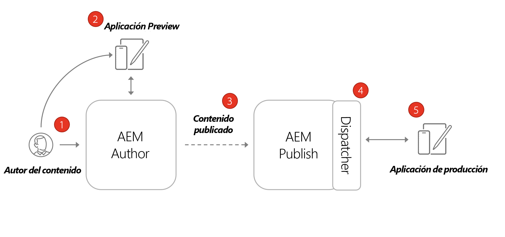
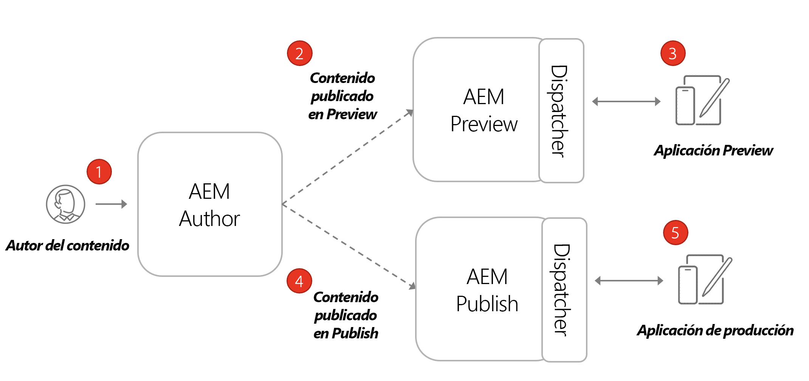

# Arquitectura de AEM Headless

Un entorno de AEM típico está formado por un servicio de creación, un servicio de publicación y un servicio de previsualización opcional.

* **El servicio de creación** es donde los usuarios internos crean, administran y previsualizan contenido.

* **El servicio de publicación** se considera el entorno “activo” y suele ser con el que interactúan los usuarios finales. El contenido, después de editarse y aprobarse en el servicio de creación, se distribuye al de publicación. El patrón de implementación más común con las aplicaciones sin encabezado de AEM es tener la versión de producción de la aplicación conectada a un servicio de publicación de AEM.

* **El servicio de previsualización**, funcionalmente, es igual que el de **publicación**. Sin embargo, solo está disponible para usuarios internos. Esto lo convierte en un sistema ideal para que los aprobadores revisen los próximos cambios de contenido antes de que se publiquen para los usuarios finales.

* **Dispatcher** es un servidor web estático ampliado con el módulo Dispatcher de AEM. Proporciona capacidades de almacenamiento en caché y otra capa de seguridad. **Dispatcher** se encuentra delante de los servicios **Publicación** y **Previsualización**.

Dentro de un programa de AEM as a Cloud Service puede tener varios entornos: Desarrollo, Ensayo y Producción. Cada entorno tendría su propio servicio de **creación**, **publicación** y **previsualización**. Consulte [Administración de entornos](/help/implementing/cloud-manager/manage-environments.md) para obtener más información.

## Modelo de creación y publicación

El patrón de implementación más común con las aplicaciones sin encabezado de AEM es tener la versión de producción de la aplicación conectada a un servicio de publicación de AEM.

El diagrama anterior muestra este patrón de implementación común.

1. Un **autor de contenido** utiliza el servicio de AEM de creación para crear, editar y administrar contenido.
1. El **autor de contenido** y otros usuarios internos pueden obtener una previsualización del contenido directamente en el servicio de creación. Se puede configurar una versión de previsualización de la aplicación que se conecte al servicio de creación.
1. Una vez aprobado el contenido, puede publicarse en el servicio de publicación de AEM.
1. **Dispatcher** es una capa delante del servicio de **publicación** que puede almacenar en caché determinadas solicitudes y proporcionar una capa de seguridad.
1. Los usuarios finales interactúan con la versión de producción de la aplicación. La aplicación de producción se conecta al servicio de publicación a través de Dispatcher y utiliza las API de GraphQL para solicitar y consumir contenido.

## Implementación de creación, previsualización y publicación

Otra opción para implementaciones sin encabezado es incorporar un servicio de **previsualización de AEM**. Con este enfoque, el contenido se puede publicar primero en el servicio de **previsualización** y una versión de vista previa de la aplicación sin encabezado pueden conectarse a él. La ventaja de este enfoque es que el servicio de **previsualización** se puede configurar con los mismos requisitos y permisos de autenticación que el de **publicación**, lo que facilita la simulación de la experiencia de producción.

1. Un **autor de contenido** utiliza el servicio de creación de AEM para crear, editar y administrar contenido.
1. El contenido se publica primero en el servicio de previsualización de AEM.
1. Se puede configurar una versión de previsualización de la aplicación que se conecte al servicio de previsualización.
1. Una vez revisado y aprobado el contenido, puede publicarse en el servicio de publicación de AEM.
1. Los usuarios finales interactúan con la versión de producción de la aplicación. La aplicación de producción se conecta al servicio de publicación a través de Dispatcher y utiliza las API de GraphQL para solicitar y consumir contenido.
