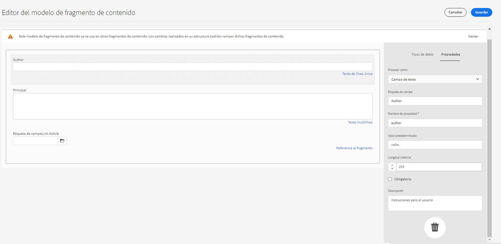
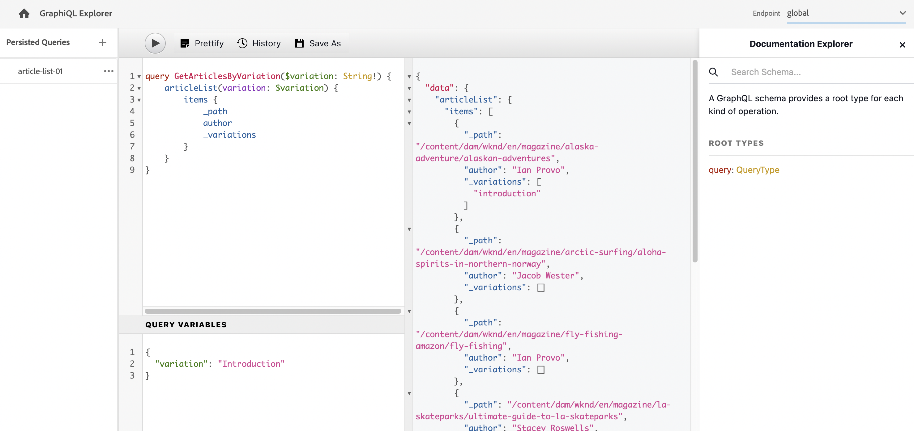

# API de GraphQL de AEM para su uso con fragmentos de contenido {#graphql-api-for-use-with-content-fragments}

Aprenda a utilizar los fragmentos de contenido en Adobe Experience Manager (AEM) as a Cloud Service con la API de GraphQL de AEM para la entrega de contenido sin encabezado.

La API de GraphQL de AEM as a Cloud Service que se utiliza con fragmentos de contenido se basa principalmente en la API estándar de código abierto de GraphQL.

El uso de la API de GraphQL en AEM permite la entrega eficiente de fragmentos de contenido a clientes JavaScript en implementaciones de CMS sin encabezado:

* Evita solicitudes de API iterativas como con REST,
* Garantiza que la entrega se limite a los requisitos específicos,
* Permite la entrega masiva de exactamente lo que se necesita para procesar como respuesta a una sola consulta de API.

>[!NOTE]
>
>GraphQL se utiliza actualmente en dos escenarios (independientes) en Adobe Experience Manager (AEM) as a Cloud Service:
>
>* [AEM Commerce consume datos de una plataforma Commerce a través de GraphQL.](/help/commerce-cloud/cif-storefront/integrating/magento.md)
>* Los fragmentos de contenido de AEM trabajan junto con la API de GraphQL de AEM (una implementación personalizada, basada en GraphQL estándar) para ofrecer contenido estructurado para su uso en aplicaciones.

>[!NOTE]
>
>Consulte [API de AEM para la administración y entrega de contenido estructurado](/help/headless/apis-headless-and-content-fragments.md) para obtener una descripción general de las diversas API disponibles y una comparación de algunos de los conceptos involucrados.

>[!NOTE]
>
>Para obtener la información más reciente sobre las API de Experience Manager, visite también [API de Adobe Experience Manager as a Cloud Service](https://developer.adobe.com/experience-cloud/experience-manager-apis/).

## La API de GraphQL {#graphql-api}

GraphQL es:

* “*...un idioma de consulta para API y un tiempo de ejecución para cumplir esas consultas con los datos existentes. GraphQL proporciona una descripción completa y comprensible de los datos de su API, ofrece a los clientes la posibilidad de preguntar exactamente lo que necesitan y nada más, facilita la evolución de las API con el paso del tiempo y habilita potentes herramientas para desarrolladores”.*

  Consulte [GraphQL.org](https://graphql.org)

* “*...una especificación abierta para una capa de API flexible. Coloque GraphQL sobre los back-ends existentes para crear productos más rápido que nunca...*”.

  Consulte [Exploración de GraphQL](https://www.graphql.com).

* *“...una especificación y lenguaje de consulta de datos desarrollado internamente por Facebook en 2012, antes de pasar a ser de código abierto público en 2015. Proporciona una alternativa a las arquitecturas basadas en REST con el propósito de aumentar la productividad del desarrollador y minimizar las cantidades de datos transferidos. Cientos de organizaciones de todos los tamaños utilizan GraphQL en producción...”*

  Consulte [Fundamentos de GraphQL](https://foundation.graphql.org/).

<!--
"*Explore GraphQL is maintained by the Apollo team. Our goal is to give developers and technical leaders around the world the tools they need to understand and adopt GraphQL.*". 
-->

Para obtener información acerca de la API de GraphQL, consulte las siguientes secciones (entre muchos otros recursos):

* En [graphql.org](https://graphql.org):

   * [Introducción a GraphQL](https://graphql.org/learn)

   * [Especificación de GraphQL](https://spec.graphql.org/)

* En [graphql.com](https://graphql.com):

   * [Guías](https://www.graphql.com/guides/)

   * [Tutoriales](https://www.graphql.com/tutorials/)

   * [Casos prácticos](https://www.graphql.com/case-studies/)

La implementación de GraphQL para AEM se basa en la biblioteca Java estándar de GraphQL. Consulte:

* [graphQL.org: Java](https://graphql.org/code/#java)

* [GraphQL Java en GitHub](https://github.com/graphql-java)

### Terminología de GraphQL {#graphql-terminology}

GraphQL utiliza lo siguiente:

* **[Consultas](https://graphql.org/learn/queries/)**

* **[Esquemas y tipos](https://graphql.org/learn/schema/)**:

   * AEM genera los esquemas basándose en los modelos de fragmentos de contenido.
   * Con sus esquemas, GraphQL presenta los tipos y operaciones permitidos para la implementación de GraphQL para AEM.

* **[Campos](https://graphql.org/learn/queries/#fields)**

* **[Punto de conexión de GraphQL](graphql-endpoint.md)**
   * La ruta en AEM que responde a las consultas de GraphQL y proporciona acceso a los esquemas de GraphQL.

   * Consulte [Habilitación del punto de conexión de GraphQL](graphql-endpoint.md) para obtener más información.

Consulte la [Introducción a GraphQL (GraphQL.org)](https://graphql.org/learn/) para obtener información detallada, incluidas las [Prácticas recomendadas](https://graphql.org/learn/best-practices/).

### Tipos de consulta de GraphQL {#graphql-query-types}

Con GraphQL puede realizar consultas para devolver lo siguiente:

* Una **entrada única**

* Una **[lista de entradas](https://graphql.org/learn/schema/#lists-and-non-null)**

AEM proporciona funciones para convertir consultas (ambos tipos) en [Consultas persistentes](/help/headless/graphql-api/persisted-queries.md) que Dispatcher y la red de distribución de contenido (CDN) pueden almacenar en caché.

### Prácticas recomendadas para consultas de GraphQL (Dispatcher y CDN) {#graphql-query-best-practices}

Las [consultas persistentes](/help/headless/graphql-api/persisted-queries.md) son el método recomendado para usar en instancias de publicación como estas:

* Se almacenan en caché.
* Se administran centralmente mediante AEM as a Cloud Service

>[!NOTE]
>
>Normalmente, no hay ningún Dispatcher/red de distribución de contenido (CDN) en creación, por lo que no hay beneficio en usar consultas persistentes allí, excepto para probarlas.

No se recomiendan las consultas GraphQL que utilizan peticiones POST, ya que no se almacenan en caché, por lo que en una instancia predeterminada, Dispatcher está configurado para bloquear dichas consultas.

Aunque GraphQL también admite solicitudes de GET, estas pueden alcanzar límites (por ejemplo, la longitud de la URL) que se pueden evitar utilizando Consultas persistentes.

Consulte [Habilitar el almacenamiento en caché de consultas persistentes](/help/headless/deployment/dispatcher-caching.md) para obtener más información.

>[!NOTE]
>
>Para permitir consultas directas o POST en Dispatcher, puede pedir al administrador del sistema que realice lo siguiente:
>
>* Crea una [variable de entorno de Cloud Manager](/help/implementing/cloud-manager/environment-variables.md) llamada `ENABLE_GRAPHQL_ENDPOINT`.
>* con el valor `true`

>[!NOTE]
>
>La capacidad de realizar consultas directas puede quedar obsoleta en algún momento futuro.

### IDE de GraphiQL {#graphiql-ide}

Puede probar y depurar consultas de GraphQL usando el [IDE de GraphiQL](/help/headless/graphql-api/graphiql-ide.md).

## Casos de uso para la creación, previsualización y publicación {#use-cases-author-preview-publish}

Los casos de uso pueden depender del tipo de entorno de AEM as a Cloud Service:

* Entorno de publicación; se usa para:
   * Datos de consulta para la aplicación JS (caso de uso estándar)

* Entorno de previsualización; se usa para:
   * Previsualización de consultas antes de implementarlas en el entorno de publicación
      * Datos de consulta para la aplicación JS (caso de uso estándar)

* Entorno de creación; se usa para:
   * Datos de consulta para “fines de administración de contenido”:
      * GraphQL en AEM as a Cloud Service es actualmente una API de solo lectura.
      * La API de REST se puede utilizar para operaciones CR(u)D.

## Permisos {#permission}

Los permisos son los necesarios para acceder a Assets.

Las consultas de GraphQL se ejecutan con el permiso del usuario de AEM de la solicitud subyacente. Si el usuario no tiene acceso de lectura a algunos fragmentos (almacenados como activos), no pasarán a formar parte del conjunto de resultados.

Además, el usuario debe tener acceso a un extremo de GraphQL para poder ejecutar consultas de GraphQL.

## Generación de esquemas {#schema-generation}

GraphQL es una API muy tipificada, lo que significa que los datos deben estar claramente estructurados y organizados por tipo.

La especificación de GraphQL proporciona una serie de directrices sobre cómo crear una API robusta para buscar datos en una instancia determinada. Para ello, un cliente debe obtener el [Esquema](#schema-generation), que contiene todos los tipos necesarios para una consulta.

Para los fragmentos de contenido, los esquemas (estructura y tipos) de GraphQL se basan en [Modelos de fragmentos de contenido](/help/sites-cloud/administering/content-fragments/managing-content-fragment-models.md) **habilitados** y sus tipos de datos.

>[!CAUTION]
>
>Todos los esquemas de GraphQL (derivados de los modelos de fragmentos de contenido que se han **habilitado**) se pueden leer a través del punto de conexión de GraphQL.
>
>Esto significa que debe asegurarse de que no hay datos confidenciales disponibles, ya que podrían filtrarse de esta manera; por ejemplo, esto incluye información que podría estar presente como nombres de campo en la definición del modelo.

Por ejemplo, si un usuario crea un modelo de fragmento de contenido denominado `Article`, luego AEM genera un tipo de GraphQL `ArticleModel`. Los campos dentro de este tipo corresponden a los campos y tipos de datos definidos en el modelo. Además, crea algunos puntos de entrada para las consultas que funcionan en este tipo, como `articleByPath` o `articleList`.

1. Un modelo de fragmento de contenido:

   

1. El esquema correspondiente de GraphQL (salida de la documentación automática de GraphiQL):
   

   Esto muestra que el tipo generado `ArticleModel` contiene varios [campos](#fields).

   * Tres de ellos han sido controlados por el usuario: `author`, `main` y `referencearticle`.

   * Los otros campos los añadió automáticamente AEM, y representan métodos útiles para proporcionar información acerca de un determinado Fragmento de contenido; en este ejemplo, (los [campos de ayuda](#helper-fields)) `_path`, `_metadata`, `_variations`.

1. Después de que un usuario cree un fragmento de contenido basado en el modelo de artículo, se puede buscar a través de GraphQL. Para ver ejemplos, consulte las [Consultas de muestra](/help/headless/graphql-api/sample-queries.md#graphql-sample-queries) (basadas en una [estructura de fragmentos de contenido de muestra para usar con GraphQL](/help/headless/graphql-api/sample-queries.md#content-fragment-structure-graphql)).

En GraphQL para AEM, el esquema es flexible. Esto significa que se genera automáticamente cada vez que se crea, actualiza o elimina un modelo de fragmento de contenido. Las cachés del esquema de datos también se refrescan al actualizar el modelo de fragmento de contenido.

<!-- move the following to a separate "in depth" page -->

Las cachés del esquema de datos también se refrescan al actualizar el modelo de fragmento de contenido.

El servicio Sites de GraphQL escucha (en segundo plano) cualquier modificación realizada en un modelo de fragmento de contenido. Cuando se detectan actualizaciones, solo se regenera esa parte del esquema. Esta optimización ahorra tiempo y proporciona estabilidad.

Por ejemplo, si:

1. Instala un paquete que contenga `Content-Fragment-Model-1` y `Content-Fragment-Model-2`:

   1. Se generan tipos de GraphQL para `Model-1` y `Model-2`.

1. A continuación, modifique `Content-Fragment-Model-2`:

   1. Solo el tipo de GraphQL `Model-2` se actualizará.

   1. Mientras que `Model-1` seguirá siendo el mismo.

>[!NOTE]
>
>Esto es importante tenerlo en cuenta en caso de que desee realizar actualizaciones masivas en los modelos de fragmento de contenido a través de la API de REST o de otro modo.

El esquema se sirve a través del mismo punto de conexión que las consultas de GraphQL, y el cliente gestiona el hecho de que se llama al esquema con la extensión `GQLschema`. Por ejemplo, realizar una solicitud `GET` simple en `/content/cq:graphql/global/endpoint.GQLschema` resultará en la salida del esquema con el tipo contenido: `text/x-graphql-schema;charset=iso-8859-1`.

<!-- move through to here to a separate "in depth" page -->

### Generación de esquemas: modelos no publicados {#schema-generation-unpublished-models}

Cuando los fragmentos de contenido están anidados, puede ocurrir que se publique un modelo de fragmento de contenido principal, pero no un modelo al que se hace referencia.

>[!NOTE]
>
>La IU de AEM evita que esto ocurra, pero si la publicación se realiza mediante programación o con paquetes de contenido, puede ocurrir.

Cuando esto sucede, AEM genera un esquema *incompleto* del modelo de fragmento del contenido principal. Esto significa que la referencia de fragmento, que depende del modelo no publicado, se elimina del esquema.

## Campos {#fields}

Dentro del esquema hay campos individuales, de dos categorías básicas:

* Campos que genera usted.

  Una selección de [Tipos de datos](#Data-types) se utiliza para crear campos en función de cómo configure el modelo de fragmentos de contenido. Los nombres de campo se toman del campo **Nombre de propiedad** de la pestaña **Tipo de datos**.

   * También hay que tener en cuenta el ajuste **Procesar como**, ya que los usuarios pueden configurar determinados tipos de datos. Por ejemplo, se puede configurar un campo de texto de una sola línea para que contenga varios textos de una sola línea eligiendo `multifield` de la lista desplegable.

* GraphQL para AEM también genera [campos de ayuda](#helper-fields).

### Tipos de datos {#data-types}

GraphQL para AEM admite una lista de tipos. Se representan todos los tipos de datos del modelo de fragmento de contenido compatibles y los tipos de GraphQL correspondientes:

| Modelo de fragmento de contenido: tipo de datos | Tipo de GraphQL | Descripción |
|--- |--- |--- |
| Texto de línea única | `String`, `[String]` | Se utiliza para cadenas simples como nombres de autor, nombres de ubicación, etc. |
| Texto multilínea | `String`, `[String]` | Se utiliza para generar texto como el cuerpo de un artículo |
| Número | `Float`, `[Float]` | Se utiliza para mostrar números de coma flotante y números regulares |
| Booleano | `Boolean` | Se utiliza para mostrar casillas de verificación → instrucciones simples verdaderas/falsas |
| Fecha y hora | `Calendar` | Se utiliza para mostrar la fecha y la hora en formato ISO 8601. Según el tipo seleccionado, hay tres variantes disponibles para usar en AEM GraphQL: `onlyDate`, `onlyTime`, `dateTime` |
| Enumeración | `String` | Se utiliza para mostrar una opción de una lista de opciones definidas en la creación del modelo |
| Etiquetas | `[String]` | Se utiliza para mostrar una lista de cadenas que representan las etiquetas utilizadas en AEM |
| Referencia de contenido | `String`, `[String]` | Se utiliza para mostrar la ruta hacia otro recurso en AEM |
| Referencia de contenido (UUID) | `String`, `[String]` | Se utiliza para mostrar la ruta, representada por un UUID hacia otro recurso en AEM |
| Referencia al fragmento |  *Un tipo de modelo* <br><br>Campo único: `Model` - Tipo de modelo, al que se hace referencia directamente <br><br>Multicampo, con un tipo al que se hace referencia: `[Model]` - Matriz de tipo `Model`, al que se hace referencia directamente desde la matriz <br><br>Multicampo, con varios tipos a los que se hace referencia: `[AllFragmentModels]` - Matriz de todos los tipos de modelo, a la que se hace referencia desde la matriz con tipo de unión |  Se utiliza para hacer referencia a uno o más fragmentos de contenido de ciertos tipos de modelo, definidos cuando se creó el modelo |
| Referencia de fragmento (UUID) |  *Un tipo de modelo* <br><br>Campo único: `Model` - Tipo de modelo, al que se hace referencia directamente <br><br>Multicampo, con un tipo al que se hace referencia: `[Model]` - Matriz de tipo `Model`, al que se hace referencia directamente desde la matriz <br><br>Multicampo, con varios tipos a los que se hace referencia: `[AllFragmentModels]` - Matriz de todos los tipos de modelo, a la que se hace referencia desde la matriz con tipo de unión |  Se utiliza para hacer referencia a uno o más fragmentos de contenido de ciertos tipos de modelo, definidos cuando se creó el modelo |

{style="table-layout:auto"}

### Campos de ayuda {#helper-fields}

Además de los tipos de datos de los campos generados por el usuario, GraphQL para AEM también genera varios campos *de ayuda* para ayudar a identificar un fragmento de contenido o para proporcionar información adicional acerca de un fragmento de contenido.

Estos [campos de ayuda](#helper-fields) se marcan con un `_` que los precede para distinguir entre lo que ha definido el usuario y lo que se ha generado automáticamente.

#### Ruta {#path}

El campo de ruta se utiliza como identificador en AEM GraphQL. Representa la ruta del recurso de fragmento de contenido dentro del repositorio de AEM. Lo hemos elegido como identificador de un fragmento de contenido, por los motivos siguientes:

* es único dentro de AEM,
* se puede recuperar fácilmente.

El siguiente código muestra las rutas de todos los fragmentos de contenido creados en función del modelo de fragmento de contenido `Author`, tal y como se proporciona en el tutorial de WKND.

```graphql
{
  authorList {
    items {
      _path
    }
  }
}
```

Para recuperar un solo fragmento de contenido de un tipo específico, también debe determinar primero su ruta. Por ejemplo:

```graphql
{
  authorByPath(_path: "/content/dam/wknd-shared/en/contributors/sofia-sj-berg") {
    item {
      _path
      firstName
      lastName
    }
  }
}
```

Consulte [Consulta de muestra: un solo fragmento de ciudad específico](/help/headless/graphql-api/sample-queries.md#sample-single-specific-city-fragment).

#### ID (UUID) {#id-uuid}

El campo de ID también se utiliza como identificador en AEM GraphQL. Representa la ruta del recurso de fragmento de contenido dentro del repositorio de AEM, pero en lugar de contener la ruta real, contiene un UUID que representa el recurso. Lo hemos elegido como identificador de un fragmento de contenido, por los motivos siguientes:

* es único dentro de AEM,
* se puede recuperar fácilmente,
* no cambia cuando se mueve el recurso.

El UUID de un fragmento de contenido y de un fragmento de contenido o recurso al que se hace referencia se puede devolver mediante la propiedad JSON `_id`.

```graphql
{
  articleList {
    items {
        _id
        _path
    }
  }
}
```

#### Metadatos {#metadata}

A través de GraphQL, AEM también expone los metadatos de un fragmento de contenido. Los metadatos son la información que describe un fragmento de contenido, como su título, la ruta de la miniatura, la descripción de un fragmento de contenido o la fecha en que se creó, entre otros.

Dado que los metadatos se generan mediante el Editor de esquemas y, como tales, no tienen una estructura específica, el tipo de GraphQL `TypedMetaData` se ha implementado para exponer los metadatos de un fragmento de contenido. `TypedMetaData` expone la información agrupada por los siguientes tipos escalares:

| Campo |
|--- |
| `stringMetadata:[StringMetadata]!` |
| `stringArrayMetadata:[StringArrayMetadata]!` |
| `intMetadata:[IntMetadata]!` |
| `intArrayMetadata:[IntArrayMetadata]!` |
| `floatMetadata:[FloatMetadata]!` |
| `floatArrayMetadata:[FloatArrayMetadata]!` |
| `booleanMetadata:[BooleanMetadata]!` |
| `booleanArrayMetadata:[booleanArrayMetadata]!` |
| `calendarMetadata:[CalendarMetadata]!` |
| `calendarArrayMetadata:[CalendarArrayMetadata]!` |

Cada tipo escalar representa un único par nombre-valor o una matriz de pares nombre-valor, donde el valor de ese par es del tipo en el que se agrupó.

Por ejemplo, si desea recuperar el título de un fragmento de contenido, sabemos que esta propiedad es de cadena, por lo que consultaremos todos los metadatos de cadena:

Para consultar metadatos:

```graphql
{
  authorByPath(_path: "/content/dam/wknd-shared/en/contributors/sofia-sj-berg") {
    item {
      _metadata {
        stringMetadata {
          name
          value
        }
      }
    }
  }
}
```

Puede ver todos los tipos de metadatos de GraphQL si ve el esquema de GraphQL generado. Todos los tipos de modelo tienen el mismo `TypedMetaData`.

>[!NOTE]
>
>**Diferencia entre metadatos normales y de matriz**
>Tenga en cuenta que `StringMetadata` y `StringArrayMetadata` hacen referencia a lo que se almacena en el repositorio, no a cómo se recuperan.
>
>Por ejemplo, llamando al campo `stringMetadata`, recibirá una matriz de todos los metadatos almacenados en el repositorio como `String`, y si llama a `stringArrayMetadata` recibirá una matriz de todos los metadatos almacenados en el repositorio como `String[]`.

Consulte [Consulta de muestra para metadatos: enumera los metadatos de los premios titulados GB](/help/headless/graphql-api/sample-queries.md#sample-metadata-awards-gb).

#### Variaciones {#variations}

El campo `_variations` se ha implementado para simplificar la consulta de las variaciones que tiene un fragmento de contenido. Por ejemplo:

```graphql
{
  authorByPath(_path: "/content/dam/wknd-shared/en/contributors/ian-provo") {
    item {
      _variations
    }
  }
}
```

>[!NOTE]
>
>El campo `_variations` no contiene una variación `master`, ya que técnicamente los datos originales (a los que se hace referencia como *Principal* en la interfaz de usuario) no se consideran una variación explícita.

Consulte [Consulta de muestra: todas las ciudades con una variación con nombre](/help/headless/graphql-api/sample-queries.md#sample-cities-named-variation).

>[!NOTE]
>
>Si la variación dada no existe para un Fragmento de contenido, los datos originales (también conocidos como la variación principal) se devuelven como una predeterminada (alternativa).

<!--
## Security Considerations {#security-considerations}
-->

## Variables de GraphQL {#graphql-variables}

GraphQL permite colocar variables en la consulta. Para obtener más información, consulte [Documentación de GraphQL para variables](https://graphql.org/learn/queries/#variables).

Por ejemplo, para obtener todos los fragmentos de contenido del tipo `Author` en una variación específica (si está disponible), puede especificar el argumento `variation` en GraphiQL.



**Consulta**:

```graphql
query($variation: String!) {
  authorList(variation: $variation) {
    items {
      _variation
      lastName
      firstName
    }
  }
}
```

**Variables de consulta**:

```json
{
  "variation": "another"
}
```

Esta consulta devolverá la lista completa de autores. Los autores sin la variación `another` volverán a los datos originales (`_variation` informará de `master` en este caso).

Aplique un [filtro](#filtering), si desea restringir la lista a autores que proporcionan la variación especificada (y omitir autores que recurren a los datos originales):

```graphql
query($variation: String!) {
  authorList(variation: $variation, filter: {
    _variation: {
      _expressions: {
        value: $variation
      }
    }
  }) {
    items {
      _variation
      lastName
      firstName
    }
  }
}
```

## Directivas de GraphQL {#graphql-directives}

En GraphQL existe la posibilidad de cambiar la consulta en función de variables, denominadas Directivas de GraphQL.

Por ejemplo, puede incluir el campo `adventurePrice` en una consulta para todos los `AdventureModels`, en función de una variable `includePrice`.


**Consulta**:

```graphql
query GetAdventureByType($includePrice: Boolean!) {
  adventureList {
    items {
      title
      price @include(if: $includePrice)
    }
  }
}
```

**Variables de consulta**:

```json
{
    "includePrice": true
}
```

## Filtrado {#filtering}

También puede utilizar el filtrado en las consultas de GraphQL para devolver datos específicos.

El filtrado utiliza una sintaxis basada en operadores lógicos y expresiones.

La parte más atómica es una sola expresión que se puede aplicar al contenido de un campo determinado. Compara el contenido del campo con un valor constante determinado.

Por ejemplo, la expresión

```graphql
{
  value: "some text"
  _op: EQUALS
}
```

compararía el contenido del campo con el valor `some text` y se ejecuta correctamente si es igual al valor. De lo contrario, la expresión fallará.

Los siguientes operadores pueden utilizarse para comparar campos con un determinado valor:

| Operador | Tipo(s) | La expresión es correcta si... |
|--- |--- |--- |
| `EQUALS` | `String`, `ID`, `Boolean` | ... el valor es exactamente el mismo que el contenido del campo |
| `EQUALS_NOT` | `String`, `ID` | ... el valor *no* es igual que el contenido del campo |
| `CONTAINS` | `String` | ... el contenido del campo contiene el valor (`{ value: "mas", _op: CONTAINS }` coincidirá con `Christmas`, `Xmas`, `master`...) |
| `CONTAINS_NOT` | `String` | ... el contenido del campo *no* contiene el valor |
| `STARTS_WITH` | `ID` | ... el ID empieza con un determinado valor (`{ value: "/content/dam/", _op: STARTS_WITH` coincidirá con `/content/dam/path/to/fragment`, pero no con `/namespace/content/dam/something` |
| `EQUAL` | `Int`, `Float` | ... el valor es exactamente el mismo que el contenido del campo |
| `UNEQUAL` | `Int`, `Float` | ... el valor *no* es igual que el contenido del campo |
| `GREATER` | `Int`, `Float` | ... el contenido del campo es mayor que el valor |
| `GREATER_EQUAL` | `Int`, `Float` | ... el contenido del campo es mayor o igual al valor |
| `LOWER` | `Int`, `Float` | ... el contenido del campo es menor que el valor |
| `LOWER_EQUAL` | `Int`, `Float` | ... el contenido del campo es menor o igual que el valor |
| `AT` | `Calendar`, `Date`, `Time` | ... el contenido del campo es exactamente el mismo que el valor (incluida la configuración de zona horaria) |
| `NOT_AT` | `Calendar`, `Date`, `Time` | ... el contenido del campo *no* es igual que el valor |
| `BEFORE` | `Calendar`, `Date`, `Time` | ... el punto en el tiempo indicado por el valor es anterior al indicado por el contenido del campo |
| `AT_OR_BEFORE` | `Calendar`, `Date`, `Time` | ... el punto en el tiempo indicado por el valor es anterior o igual al indicado por el contenido del campo |
| `AFTER` | `Calendar`, `Date`, `Time` | ... el punto en el tiempo indicado por el valor es posterior al indicado por el contenido del campo |
| `AT_OR_AFTER` | `Calendar`, `Date`, `Time` | ... el punto en el tiempo indicado por el valor es posterior o igual al indicado por el contenido del campo |

Algunos tipos también permiten especificar opciones adicionales que modifican cómo se evalúa una expresión:

| Opción | Tipo(s) | Descripción |
|--- |--- |--- |
| `_ignoreCase` | `String` | Omite las mayúsculas y minúsculas de una cadena; por ejemplo, un valor de `time` coincide con `TIME`, `time`, `tImE`, ... |
| `_sensitiveness` | `Float` | Permite un cierto margen para que los valores `float` se consideren iguales (para sortear las limitaciones técnicas debidas a la representación interna de los valores `float`; debe evitarse, ya que esta opción podría repercutir negativamente en el rendimiento |

Las expresiones se pueden combinar en un conjunto con la ayuda de un operador lógico (`_logOp`):

* `OR`: el conjunto de expresiones tendrá éxito si al menos una expresión es correcta
* `AND`: el conjunto de expresiones tendrá éxito si todas las expresiones son correctas (opción predeterminada).

Cada campo se puede filtrar por su propio conjunto de expresiones. Los conjuntos de expresiones de todos los campos mencionados en el argumento de filtro se combinarán finalmente con su propio operador lógico.

Una definición de filtro (que se transfiere como el argumento `filter` a una consulta) contiene lo siguiente:

* Una subdefinición para cada campo (se puede acceder al campo a través de su nombre, por ejemplo, hay un campo `lastName` en el filtro para el campo `lastName` en el tipo de datos (campo))
* Cada subdefinición contiene la matriz `_expressions`, que proporciona el conjunto de expresiones, y el campo `_logOp` que define el operador lógico con el que deben combinarse las expresiones
* Cada expresión está definida por el valor (campo `value`) y el operador (campo `_operator`), el contenido de un campo debe compararse con

Puede omitir `_logOp` si desea combinar elementos con `AND` y `_operator` si desea comprobar la igualdad, ya que estos son los valores predeterminados.

El siguiente ejemplo muestra una consulta completa que filtra todas las personas que tienen un `lastName` de `Provo` o con `sjö`, independientemente del caso:

```graphql
{
  authorList(filter: {
    lastname: {
      _logOp: OR
      _expressions: [
        {
          value: "sjö",
          _operator: CONTAINS,
          _ignoreCase: true
        },
        {
          value: "Provo"
        }
      ]
    }
  }) {
    items {
      lastName
      firstName
    }
  }
}
```

Aunque también puede filtrar por campos anidados, no se recomienda, ya que puede provocar problemas de rendimiento.

Para ver más ejemplos, consulte lo siguiente:

* detalles de [GraphQL para extensiones de AEM](#graphql-extensions)

* [Ejemplos de consultas que utilizan este contenido y estructura de muestra](/help/headless/graphql-api/sample-queries.md#graphql-sample-queries-sample-content-fragment-structure)

   * Y el [Contenido y estructura de muestra](/help/headless/graphql-api/sample-queries.md#content-fragment-structure-graphql) preparados para su uso en consultas de muestra

* [Consultas de muestra basadas en el proyecto WKND](/help/headless/graphql-api/sample-queries.md#sample-queries-using-wknd-project)

## Ordenación {#sorting}

>[!NOTE]
>
>Para obtener el mejor rendimiento, considere [Actualizar los fragmentos de contenido para paginación y ordenación en el filtrado de GraphQL](/help/headless/graphql-api/graphql-optimized-filtering-content-update.md).

Esta función permite ordenar los resultados de la consulta según un campo especificado.

Los criterios de clasificación son los siguientes:

* una lista de valores separados por comas que representa la ruta del campo
   * el primer campo de la lista definirá el criterio de ordenación principal, el segundo campo se utiliza si dos valores del criterio de ordenación principal son iguales, el tercero si los dos primeros criterios son iguales, y así sucesivamente.
   * notación de puntos, es decir, field1.subfield.subfield, etc.
* una dirección de orden opcional
   * ASC (de subida) o DESC (de bajada); ASC se aplica como predeterminado
   * se puede especificar la dirección por campo; esto significa que puede ordenar un campo en orden de subida y otro en orden de bajada (nombre, apellido DESC)

Por ejemplo:

```graphql
query {
  authorList(sort: "lastName, firstName") {
    items {
      firstName
      lastName
    }
  }
}
```

Y también:

```graphql
{
  authorList(sort: "lastName DESC, firstName DESC") {
    items {
        lastName
        firstName
    }
  }
}
```

También puede ordenar un campo dentro de un fragmento anidado, utilizando el formato de `nestedFragmentname.fieldname`.

>[!NOTE]
>
>Esto puede tener un impacto negativo en el rendimiento.

Por ejemplo:

```graphql
query {
  articleList(sort: "authorFragment.lastName")  {
    items {
      title
      authorFragment {
        firstName
        lastName
        birthDay
      }
      slug
    }
  }
}
```

## Paginación {#paging}

>[!NOTE]
>
>Para obtener el mejor rendimiento, considere [Actualizar los fragmentos de contenido para paginación y ordenación en el filtrado de GraphQL](/help/headless/graphql-api/graphql-optimized-filtering-content-update.md).

Esta función permite realizar paginación en los tipos de consulta que devuelven una lista. Se proporcionan dos métodos:

* `offset` y `limit` en una consulta `List`
* `first` y `after` en una consulta `Paginated`

### Consulta de lista: desplazamiento y límite {#list-offset-limit}

En una consulta `...List` puede utilizar `offset` y `limit` para devolver un subconjunto específico de resultados:

* `offset`: especifica el primer conjunto de datos que se va a devolver
* `limit`: especifica el número máximo de conjuntos de datos que se van a devolver

Por ejemplo, para generar la página de resultados que contiene hasta cinco artículos, a partir del quinto artículo de la lista de resultados *completa*:

```graphql
query {
   articleList(offset: 5, limit: 5) {
    items {
      authorFragment {
        lastName
        firstName
      }
    }
  }
}
```

<!-- When available link to BP and replace "JCR query level" with a more neutral term. -->

<!-- When available link to BP and replace "JCR query result set" with a more neutral term. -->

>[!NOTE]
>
>* La paginación requiere un orden de clasificación estable para funcionar correctamente en varias consultas que soliciten diferentes páginas del mismo conjunto de resultados. De forma predeterminada, utiliza la ruta del repositorio de cada elemento del conjunto de resultados para asegurar que el orden sea siempre el mismo. Si se utiliza un orden de clasificación diferente y si esa clasificación no se puede realizar en el nivel de consulta JCR, se produce un impacto negativo en el rendimiento, ya que todo el conjunto de resultados debe cargarse en la memoria antes de que se puedan determinar las páginas.
>
>* Cuanto mayor sea el desplazamiento, más tiempo tardará en omitir los elementos del conjunto de resultados completo de la consulta JCR. Una solución alternativa para grandes conjuntos de resultados es utilizar la consulta paginada con el método `first` y `after`.

### Consulta paginada: primero y después {#paginated-first-after}

El tipo de consulta `...Paginated` reutiliza la mayoría de las funciones de tipo de consulta `...List` (filtrado, clasificación), pero en lugar de usar argumentos `offset`/`limit`, emplea los argumentos `first`/`after` definidos por [la especificación de las conexiones del cursor de GraphQL](https://relay.dev/graphql/connections.htm). Puede encontrar una introducción menos formal en la [Introducción a GraphQL](https://graphql.org/learn/pagination/#pagination-and-edges).

* `first`: los primeros `n` artículos que se van a devolver.
El valor predeterminado es `50`.
El número máximo es `100`.
* `after`: el cursor que determina el comienzo de la página solicitada; tenga en cuenta que el elemento representado por el cursor no se incluye en el conjunto de resultados; el cursor de un elemento se determina mediante el campo `cursor` de la estructura `edges`.

Por ejemplo, mostrar la página de resultados que contiene hasta cinco aventuras, empezando por el elemento de cursor dado en la lista de resultados *completa*:

```graphql
query {
    adventurePaginated(first: 5, after: "ODg1MmMyMmEtZTAzMy00MTNjLThiMzMtZGQyMzY5ZTNjN2M1") {
        edges {
          cursor
          node {
            title
          }
        }
        pageInfo {
          endCursor
          hasNextPage
        }
    }
}
```

<!-- When available link to BP -->
<!-- Due to internal technical constraints, performance will degrade if sorting and filtering is applied on nested fields. Therefore it is recommended to use filter/sort fields stored at root level. For more information, see the [Best Practices document](link). -->

>[!NOTE]
>
>* De forma predeterminada, la paginación utiliza el UUID del nodo del repositorio que representa el fragmento para ordenar a fin de garantizar que el orden de los resultados sea siempre el mismo. Cuando se utiliza `sort`, el UUID se utiliza implícitamente para garantizar una clasificación única; incluso para dos elementos con claves de clasificación idénticas.
>
>* Debido a limitaciones técnicas internas, el rendimiento se degradará si se aplica clasificación y filtrado en los campos anidados. Por lo tanto, se recomienda utilizar campos de filtro/clasificación almacenados en el nivel raíz. Esta es también la forma recomendada si desea consultar grandes conjuntos de resultados paginados.

## Envío de imágenes optimizadas para la web en consultas de GraphQL {#web-optimized-image-delivery-in-graphql-queries}

La entrega de imágenes optimizadas para la web permite utilizar una consulta de Graphql para lo siguiente:

* Solicitar una URL a una imagen de recurso DAM (a la que hace referencia una **referencia de contenido**)

* Pase parámetros con la consulta para que se genere y devuelva automáticamente una representación específica de la imagen

  >[!NOTE]
  >
  >La representación especificada no se almacena en AEM Assets. La representación se genera y se conserva en la caché durante un breve período.

* Devolución de la URL como parte del envío JSON

Puede utilizar AEM para lo siguiente:

* Pase [Envío de imágenes optimizadas para la web](https://experienceleague.adobe.com/docs/experience-manager-core-components/using/developing/web-optimized-image-delivery.html?lang=es) en consultas de GraphQL.

Esto significa que los comandos se aplican durante la ejecución de la consulta, de la misma manera que los parámetros de URL en las solicitudes de GET para esas imágenes.

Esto permite crear de forma dinámica representaciones de imágenes para la entrega JSON, lo que evita tener que crear y almacenar manualmente esas representaciones en el repositorio.

La solución de GraphQL significa que puede hacer lo siguiente:

* Solicitar una dirección URL: usar `_dynamicUrl` en la referencia `ImageRef`

* Pasar parámetros: agregar `_assetTransform` al encabezado de la lista donde se definen los filtros

>[!NOTE]
>
>Se puede usar una **referencia de contenido** tanto para recursos DAM como para recursos de Dynamic Media. Al recuperar la URL adecuada se utilizan parámetros diferentes:
>
>* `_dynamicUrl` : un recurso DAM
>* `_dmS7Url` : un recurso de Dynamic Media
> 
>Si el recurso al que se hace referencia es un recurso DAM, el valor de `_dmS7Url` será `null`. Consulte [Entrega de recursos de Dynamic Media por dirección URL en consultas de GraphQL](#dynamic-media-asset-delivery-by-url).

### Estructura de la solicitud de transformación {#structure-transformation-request}

`AssetTransform` (`_assetTransform`) se utiliza para efectuar las solicitudes de transformación de URL.

La estructura y la sintaxis son las siguientes:

* `format`: una enumeración con todos los formatos admitidos por su extensión: GIF, PNG, PNG8, JPG, PJPG, BJPG, WEBP, WEBPLL o WEBPLY
* `seoName`: una cadena que se utiliza como nombre de archivo en lugar del nombre de nodo
* `crop`: una subestructura de fotograma, si se omite la anchura o la altura, estas se utilizan como el mismo valor

   * `xOrigin`: el origen x del fotograma, es obligatorio
   * `yOrigin`: el origen y del fotograma, es obligatorio
   * `width`: la anchura del fotograma
   * `height`: la altura del fotograma

* `size`: una subestructura de dimensión, si se omite la anchura o la altura, estas se utilizan como el mismo valor

   * `width`: la anchura de la dimensión
   * `height`: la altura de la dimensión

* `rotation`: una enumeración de todas las rotaciones admitidas: R90, R180, R270
* `flip`: una enumeración de HORIZONTAL, VERTICAL, HORIZONTAL_AND_VERTICAL
* `quality`: un entero entre 1 y 100 que indica el porcentaje de calidad de la imagen
* `width`: un entero que define la anchura de la imagen de salida, pero que el Generador de imágenes ignora

La transformación de URL está disponible para todos los tipos de consulta: por ruta, lista o paginada.

### Envío de imágenes optimizado para la web con parámetros completos {#web-optimized-image-delivery-full-parameters}

A continuación se muestra una consulta de ejemplo con un conjunto completo de parámetros:

```graphql
{
  articleList(
    _assetTransform: {
      format:GIF
      seoName:"test"
      crop:{
        xOrigin:10
        yOrigin:20
        width:50
        height:45
      }
      size:{
        height:100
        width:200
      }
      rotation:R90
      flip:HORIZONTAL_AND_VERTICAL
      quality:55
      width:123
    }
  ) {
    items {
      _path
      featuredImage {
        ... on ImageRef {
          _dynamicUrl
        }
      }
    }
  }
}
```

### Envío de imágenes optimizadas para la web con una sola variable de consulta {#web-optimized-image-delivery-single-query-variable}

El siguiente ejemplo muestra el uso de una sola variable de consulta:

```graphql
query ($seoName: String!) {
  articleList(
    _assetTransform: {
      format:GIF
      seoName:$seoName
      crop:{
        xOrigin:10
        yOrigin:20
        width:50
        height:45
      }
      size:{
        height:100
        width:200
      }
      rotation:R90
      flip:HORIZONTAL_AND_VERTICAL
      quality:55
      width:123
    }
  ) {
    items {
      _path
      featuredImage {
        ... on ImageRef {
          _dynamicUrl
        }
      }
    }
  }
}
```

### Envío de imágenes optimizadas para web con múltiples variables de consulta {#web-optimized-image-delivery-multiple-query-variables}

El siguiente ejemplo muestra el uso de múltiples variables de consulta:

```graphql
query ($seoName: String!, $format: AssetTransformFormat!) {
  articleList(
    _assetTransform: {
      format:$format
      seoName:$seoName
      crop:{
        xOrigin:10
        yOrigin:20
        width:50
        height:45
      }
      size:{
        height:100
        width:200
      }
      rotation:R90
      flip:HORIZONTAL_AND_VERTICAL
      quality:55
      width:123
    }
  ) {
    items {
      _path
      featuredImage {
        ... on ImageRef {
          _dynamicUrl
        }
      }
    }
  }
}
```

### Solicitud de envío de imágenes optimizadas para la web por dirección URL {#web-optimized-image-delivery-request-url}

Si guarda la consulta como una consulta persistente (por ejemplo, con el nombre `dynamic-url-x`), puede [ejecutar la consulta persistente directamente](/help/headless/graphql-api/persisted-queries.md#execute-persisted-query).

Por ejemplo, para ejecutar directamente los ejemplos anteriores (guardados como consultas persistentes), utilice las siguientes direcciones URL:

* [Parámetro único](#dynamic-image-delivery-single-specified-parameter); consulta persistente con el nombre `dynamic-url-x`

   * `http://localhost:4502/graphql/execute.json/wknd-shared/dynamic-url-x;seoName=xxx`

     La respuesta será la siguiente:

     

* [Múltiples parámetros](#dynamic-image-delivery-multiple-specified-parameters); consulta persistente con el nombre `dynamic`

   * `http://localhost:4502/graphql/execute.json/wknd-shared/dynamic;seoName=billiboy;format=GIF;`

     >[!CAUTION]
     >
     >El `;`final es obligatorio para terminar de forma limpia la lista de parámetros.

### Limitaciones de la entrega de imágenes optimizadas para la web {#web-optimized-image-delivery-limitations}

Existen las siguientes limitaciones:

* Modificadores aplicados a todas las imágenes que forman parte de la consulta (parámetros globales)

* Almacenamiento en caché de encabezados

   * Sin almacenamiento en caché en creación
   * Almacenamiento en caché en publicación: max-age de 10 minutos (el cliente no puede modificarlo)

## Entrega de recursos de Dynamic Media por dirección URL en consultas de GraphQL{#dynamic-media-asset-delivery-by-url}

GraphQL para fragmentos de contenido de AEM le permite solicitar una URL para un recurso de Dynamic Media de AEM (Scene7) (al que hace referencia una **referencia de contenido**).

La solución de GraphQL significa que puede hacer lo siguiente:

* use `_dmS7Url` en la referencia de `ImageRef`
   * consulte [Consulta de muestra para la entrega de recursos de Dynamic Media por dirección URL: referencia de imagen](#sample-query-dynamic-media-asset-delivery-by-url-imageref)
* usar `_dmS7Url` en múltiples referencias; `ImageRef`, `MultimediaRef` y `DocumentRef`
   * consulte [Consulta de muestra para la entrega de recursos de Dynamic Media por dirección URL: varias referencias](#sample-query-dynamic-media-asset-delivery-by-url-multiple-refs)

* usar `_dmS7Url` con funcionalidad de recorte inteligente

   * La propiedad `_smartCrops` expone las configuraciones de recorte inteligente disponibles para un recurso específico

   * consulte [Consulta de muestra para la entrega de recursos de Dynamic Media por dirección URL: con recorte inteligente](#sample-query-dynamic-media-asset-delivery-by-url-smart-crop)

>[!NOTE]
>
>Para ello, necesita tener una [configuración de nube de Dynamic Media](/help/assets/dynamic-media/config-dm.md).
>
>Esto agrega los atributos `dam:scene7File` y `dam:scene7Domain` a los metadatos del recurso cuando se crea.

>[!NOTE]
>
>Se puede usar una **referencia de contenido** tanto para recursos DAM como para recursos de Dynamic Media. Al recuperar la URL adecuada se utilizan parámetros diferentes:
>
>* `_dmS7Url` : un recurso de Dynamic Media
>* `_dynamicUrl` : un recurso DAM
> 
>Si el recurso al que se hace referencia es un recurso de Dynamic Media, el valor de `_dynamicURL` será `null`. Ver [entrega de imágenes optimizadas para la web en consultas de GraphQL](#web-optimized-image-delivery-in-graphql-queries).

### Consulta de muestra para la entrega de recursos de Dynamic Media por dirección URL: referencia de imagen{#sample-query-dynamic-media-asset-delivery-by-url-imageref}

A continuación se muestra un ejemplo de consulta:

* para varios fragmentos de contenido de tipo `team` y `person`, devolviendo un `ImageRef`

```graphql
query allTeams {
  teamList {
    items {
      _path
      title
      teamMembers {
        fullName
        profilePicture {
          __typename
          ... on ImageRef{
            _dmS7Url
            height
            width
          }
        }
      }
    }
  }
} 
```

### Consulta de muestra para la entrega de recursos de Dynamic Media por dirección URL: varias referencias{#sample-query-dynamic-media-asset-delivery-by-url-multiple-refs}

A continuación se muestra un ejemplo de consulta:

* para varios fragmentos de contenido de tipo `team` y `person`, devolviendo un `ImageRef`, `MultimediaRef` y `DocumentRef`:

```graphql
query allTeams {
  teamList {
    items {
      _path
      title
      teamMembers {
        fullName
        profilePicture {
          __typename
          ... on ImageRef{
            _dmS7Url
            height
            width
          }
        }
       featureVideo {
          __typename
          ... on MultimediaRef{
            _dmS7Url
            size
          }
        }
      about-me {
          __typename
          ... on DocumentRef{
            _dmS7Url
            _path
          }
        }
      }
    }
  }
}
```

### Consulta de muestra para la entrega de recursos de Dynamic Media por dirección URL: con recorte inteligente {#sample-query-dynamic-media-asset-delivery-by-url-smart-crop}

A continuación se muestra un ejemplo de consulta:

* para exponer las configuraciones de recorte inteligente disponibles para los recursos solicitados

```graphql
query allTeams {
  teamList {
    items {
      title
      teamMembers {
        profilePicture {
          ... on ImageRef {
            height
            width
            _dmS7Url
            _smartCrops {
              width
              height
              name
            }
          }
        }
      }
    }
  }
} 
```

## Compatibilidad con recursos de Dynamic Media para OpenAPI (Assets remoto) {#dynamic-media-for-openapi-asset-support}

La integración de [Recursos remotos](/help/sites-cloud/administering/content-fragments/authoring.md#reference-remote-assets) le permite hacer referencia a Assets, que no son locales de la instancia actual de AEM, desde el Editor de fragmentos de contenido. Se implementa mediante Dynamic Media para la compatibilidad con recursos OpenAPI en el Editor de fragmentos de contenido y GraphQL JSON.

### Consulta de muestra para Dynamic Media para la compatibilidad con recursos OpenAPI (Assets remoto) {#sample-query-dynamic-media-for-openapi-asset-support}

A continuación se muestra una solicitud de ejemplo:

* para ilustrar el concepto de referencia a recursos remotos

  ```graphql
  {
    testModelList {
      items {
        remoteasset {
          ... on RemoteRef {
              repositoryId
                  assetId
          }
        }
        multiplecontent {
          ... on ImageRef {
            _path
            _authorUrl
            _publishUrl
          }
          ... on RemoteRef {
              repositoryId
              assetId
          }
        }
      }
      _references {
        ... on ImageRef {
            _path
            _authorUrl
            _publishUrl
          }
          ... on RemoteRef {
              repositoryId
              assetId
          }
      }
    }
  }
  ```

* la respuesta

  ```graphql
  {
    "data": {
      "testModelList": {
        "items": [
          {
            "remoteasset": {
              "repositoryId": "delivery-p123456-e123456.adobeaemcloud.com",
              "assetId": "urn:aaid:aem:1fb05fe4-c12b-4f85-b1ca-aa92cdbd6a62"
            },
            "multiplecontent": [
              {
                "repositoryId": "delivery-p123456-e123456.adobeaemcloud.com",
                "assetId": "urn:aaid:aem:1fb05fe4-c12b-4f85-b1ca-aa92cdbd6a62"
              },
              {
                "_path": "/content/dam/test-folder/test.jpg",
                "_authorUrl": "http://localhost:4502/content/dam/test-folder/test.jpg",
                "_publishUrl": "http://localhost:4503/content/dam/test-folder/test.jpg"
              }
            ]
          }
        ],
        "_references": [
          {
            "repositoryId": "delivery-p123456-e123456.adobeaemcloud.com",
            "assetId": "urn:aaid:aem:1fb05fe4-c12b-4f85-b1ca-aa92cdbd6a62"
          },
          {
            "_path": "/content/dam/test-folder/test.jpg",
            "_authorUrl": "http://localhost:4502/content/dam/test-folder/test.jpg",
            "_publishUrl": "http://localhost:4503/content/dam/test-folder/test.jpg"
          }
        ]
      }
    }
  }  
  ```

**Limitaciones**

Las limitaciones actuales son:

* La entrega de GraphQL solo admite `repositoryId` y `assetId` (no se devuelven otros metadatos de recursos)

  >[!NOTE]
  >
  >A continuación, la dirección URL completa debe crearse en el lado del cliente en función de la [API de entrega de recursos](https://developer.adobe.com/experience-cloud/experience-manager-apis/api/stable/assets/delivery/#operation/getAssetSeoFormat).

* Solo los *recursos aprobados* estarán disponibles para su consulta en los repositorios remotos
* Si se elimina un recurso al que se hace referencia del repositorio remoto, se producirá una referencia a un recurso de fragmento de contenido roto.
* Todos los repositorios de recursos de entrega a los que el usuario tiene acceso estarán disponibles para su selección, la lista disponible no se puede limitar.
* Tanto la instancia de AEM como las instancias del repositorio de recursos remoto deben tener la misma versión.
* No se expusieron metadatos de recursos a través de la [API de sitios de administración](https://developer.adobe.com/experience-cloud/experience-manager-apis/api/stable/sites/) y la [entrega de fragmentos de contenido de AEM con OpenAPI](https://developer.adobe.com/experience-cloud/experience-manager-apis/api/stable/contentfragments/delivery/). Debe utilizar la API de metadatos del recurso para recuperar los detalles de los metadatos del recurso.

## GraphQL para AEM: resumen de extensiones {#graphql-extensions}

El funcionamiento básico de las consultas con GraphQL para AEM se adhiere a la especificación estándar de GraphQL. Para las consultas de GraphQL con AEM hay algunas extensiones:

* Si necesita un solo resultado:
   * use el nombre del modelo; por ejemplo, ciudad

* Si espera una lista de resultados:
   * añada `List` al nombre del modelo; por ejemplo, `cityList`
   * Consulte [Consulta de muestra: toda la información acerca de todas las ciudades](/help/headless/graphql-api/sample-queries.md#sample-all-information-all-cities)

  Podrá hacer lo siguiente:

   * [Clasificación de los resultados](#sorting)

      * `ASC`: ascendente
      * `DESC`: descendente

   * Devuelva una página de resultados utilizando lo siguiente:

      * [Una consulta de lista con desplazamiento y límite](#list-offset-limit)
      * [Una consulta paginada con primero y después](#paginated-first-after)

   * Consulte [Consulta de muestra: toda la información acerca de todas las ciudades](/help/headless/graphql-api/sample-queries.md#sample-all-information-all-cities)

* El filtro `includeVariations` está incluido en los tipos de consulta `List` y `Paginated`.  Para recuperar las variaciones de fragmentos de contenido en los resultados de la consulta, el filtro `includeVariations` debe establecerse en `true`.

   * Consulte [Consulta de muestra para varios fragmentos de contenido y sus variaciones de un modelo determinado](/help/headless/graphql-api/sample-queries.md#sample-wknd-multiple-fragment-variations-given-model)

  >[!CAUTION]
  >
  >El filtro `includeVariations` y el campo generado por el sistema `_variation` no se pueden usar juntos en la misma definición de consulta.

* Si desea utilizar un OR lógico:
   * use `_logOp: OR`
   * Consulte [Consulta de muestra: todas las personas que tienen el apellido “Jobs” o “Smith”](/help/headless/graphql-api/sample-queries.md#sample-all-persons-jobs-smith)

* El AND lógico también existe, pero (a menudo) está implícito

* Puede consultar los nombres de campo que se correspondan con los campos del modelo de fragmento de contenido
   * Consulte [Consulta de muestra: detalles completos del CEO y los empleados de una compañía](/help/headless/graphql-api/sample-queries.md#sample-full-details-company-ceos-employees)

* Además de los campos del modelo, hay algunos campos generados por el sistema (precedidos de guiones bajos):

   * Para el contenido:

      * `_locale`: para revelar el idioma; basado en el Administrador de idiomas
         * Consulte [Consulta de muestra para varios fragmentos de contenido de una configuración regional determinada](/help/headless/graphql-api/sample-queries.md#sample-wknd-multiple-fragments-given-locale)

      * `_metadata`: para mostrar los metadatos del fragmento
         * Consulte [Consulta de muestra para metadatos: enumera los metadatos de los premios titulados GB](/help/headless/graphql-api/sample-queries.md#sample-metadata-awards-gb)

      * `_model`: permitir la consulta de un modelo de fragmento de contenido (ruta y título)
         * Consulte [Consulta de muestra para un modelo de fragmento de contenido de un modelo](/help/headless/graphql-api/sample-queries.md#sample-wknd-content-fragment-model-from-model)

      * `_path`: la ruta al fragmento de contenido dentro del repositorio
         * Consulte [Consulta de muestra: un solo fragmento de ciudad específico](/help/headless/graphql-api/sample-queries.md#sample-single-specific-city-fragment)

      * `_id` : el UUID para el fragmento de contenido dentro del repositorio

         * Consulte [Consulta de muestra para un fragmento de contenido de un modelo específico con referencias de UUID](/help/headless/graphql-api/sample-queries.md#sample-wknd-fragment-specific-model-uuid-references)
         * [Consulte Consulta de muestra para fragmentos de contenido por referencia de UUID](/help/headless/graphql-api/sample-queries.md#sample-wknd-fragment-specific-model-uuid-reference)

      * `_reference`: para revelar referencias, incluyendo referencias en línea en el Editor de texto enriquecido
         * Consulte [Consulta de muestra para varios fragmentos de contenido con referencias recuperadas previamente](/help/headless/graphql-api/sample-queries.md#sample-wknd-multiple-fragments-prefetched-references)

      * `_variation`: para mostrar variaciones específicas dentro del fragmento de contenido

        >[!NOTE]
        >
        >Si la variación dada no existe para un Fragmento de contenido, la variación principal se devuelve como una predeterminada (alternativa).

        >[!CAUTION]
        >
        >El campo generado por el sistema `_variation` no se puede usar junto con el filtro `includeVariations`.

         * Consulte [Consulta de muestra: todas las ciudades con una variación con nombre](/help/headless/graphql-api/sample-queries.md#sample-cities-named-variation)

   * Para la entrega de imágenes:

      * `_authorURL`: la dirección URL completa del recurso de imagen en AEM Author
      * `_publishURL`: la dirección URL completa del recurso de imagen en AEM Publish

      * Para [entrega de imágenes optimizadas para la web](#web-optimized-image-delivery-in-graphql-queries) (de recursos DAM):

         * `_dynamicUrl`: la dirección URL completa del recurso DAM optimizado para la web en la referencia `ImageRef`

           >[!NOTE]
           >
           >`_dynamicUrl` es la dirección URL preferida que se usa para los recursos DAM optimizados para la web y debe reemplazar el uso de `_path`, `_authorUrl` y `_publishUrl` siempre que sea posible.

         * `_assetTransform`: para pasar parámetros en el encabezado de lista donde se definen los filtros

         * Consulte:

            * [Consulta de muestra para entrega de imágenes optimizadas para la web con parámetros completos](#web-optimized-image-delivery-full-parameters)

            * [Consulta de muestra para entrega de imágenes optimizadas para la web con un solo parámetro especificado](#web-optimized-image-delivery-single-query-variable)

      * `_dmS7Url`: en la referencia `ImageRef` para el envío de la URL a un [recurso de Dynamic Media](#dynamic-media-asset-delivery-by-url)

         * Consulte [Consulta de muestra para la entrega de recursos de Dynamic Media por dirección URL: ImageRef](#sample-query-dynamic-media-asset-delivery-by-url-imageref)

         * Consulte [Consulta de muestra para la entrega de recursos de Dynamic Media por dirección URL: varias referencias](#sample-query-dynamic-media-asset-delivery-by-url-multiple-refs)

   * `_tags`: para revelar los identificadores de los fragmentos de contenido o las variaciones que contienen etiquetas; se trata de una matriz de identificadores `cq:tags`.

      * Consulte [Consulta de muestra: nombres de todas las ciudades etiquetadas como escapadas](/help/headless/graphql-api/sample-queries.md#sample-names-all-cities-tagged-city-breaks)
      * Consulte [Consulta de muestra para variaciones de fragmentos de contenido de un modelo determinado que tienen una etiqueta específica adjunta](/help/headless/graphql-api/sample-queries.md#sample-wknd-fragment-variations-given-model-specific-tag)
      * Consulte [Consulta de muestra con filtrado por los ID _tags y excluyendo variaciones](/help/headless/graphql-api/sample-queries.md#sample-filtering-tag-not-variations)
      * Consulte [Consulta de muestra con filtrado por los ID _tags e incluyendo variaciones](/help/headless/graphql-api/sample-queries.md#sample-filtering-tag-with-variations)

     >[!NOTE]
     >
     >Las etiquetas también se pueden consultar enumerando los metadatos de un fragmento de contenido.

   * Y operaciones:

      * `_operator`: aplicar operadores específicos; `EQUALS`, `EQUALS_NOT`, `GREATER_EQUAL`, `LOWER`, `CONTAINS`, `STARTS_WITH`
         * Consulte [Consulta de muestra: todas las personas que no tienen el apellido “Jobs”](/help/headless/graphql-api/sample-queries.md#sample-all-persons-not-jobs)
         * Consulte [Consulta de muestra: todas las aventuras en las que la `_path` comienza con un prefijo específico](/help/headless/graphql-api/sample-queries.md#sample-wknd-all-adventures-cycling-path-filter)

      * `_apply`: para aplicar condiciones específicas; por ejemplo, `AT_LEAST_ONCE`
         * Consulte [Consulta de muestra: filtre en una matriz con un elemento que deba producirse al menos una vez](/help/headless/graphql-api/sample-queries.md#sample-array-item-occur-at-least-once)

      * `_ignoreCase`: para ignorar el caso al consultar
         * Consulte [Consulta de muestra: todas las ciudades con SAN en el nombre, sin importar las mayúsculas](/help/headless/graphql-api/sample-queries.md#sample-all-cities-san-ignore-case)

* Se admiten los tipos de unión de GraphQL:

   * use `... on`
      * Consulte [Consulta de muestra para un fragmento de contenido de un modelo específico con una referencia de contenido](/help/headless/graphql-api/sample-queries.md#sample-wknd-fragment-specific-model-content-reference)

* Alternativa cuando se consultan fragmentos anidados:

   * Si una variación determinada no existe en un fragmento anidado, se devolvería la variación **Principal**.

## Consulta del punto de conexión de GraphQL desde un sitio web externo {#query-graphql-endpoint-from-external-website}

Para acceder al punto de conexión de GraphQL desde un sitio web externo, debe configurar lo siguiente:

* [Filtro CORS](/help/headless/deployment/cross-origin-resource-sharing.md)
* [Filtro de referente](/help/headless/deployment/referrer-filter.md)

## Autenticación {#authentication}

Consulte [Autenticación para consultas de GraphQL de AEM remotas en fragmentos de contenido](/help/headless/security/authentication.md).

## Pruebas automatizadas {#automated-testing}

Al ejecutar una canalización de implementación en AEM Cloud Manager, las pruebas automatizadas se ejecutan durante la ejecución de la canalización.

Para proporcionar resultados precisos, el entorno de AEM as a Cloud Service **Stage** debe reflejar su entorno de **producción** lo más fielmente posible. Esto es especialmente importante para el contenido.

Puede conseguirlo utilizando la [herramienta de copia de contenido](/help/implementing/developing/tools/content-copy.md) de AEM as a Cloud Service para copiar el contenido de producción en el entorno de ensayo.

## Limitaciones {#limitations}

Para protegerse de posibles problemas, se han impuesto limitaciones predeterminadas a las consultas:

* La consulta no puede contener más de 1 millón de caracteres (1024 * 1024)
* La consulta no puede contener más de 15000 tokens
* La consulta no puede contener más de 200000 tokens de espacio en blanco

También debe tener en cuenta lo siguiente:

* Se devolverá un error de conflicto de campos cuando la consulta de GraphQL contenga campos con el mismo nombre en dos (o más) modelos y se cumplan las siguientes condiciones:

   * Entonces, ¿dónde?

      * Dos (o más modelos) se usan como posibles referencias; cuando se definen como un **Tipo de modelo** permitido en la referencia de fragmento de contenido.

     y:

      * Estos dos modelos tienen campos con un nombre común; es decir, el mismo nombre se produce en ambos modelos.

     y

      * Estos campos son de diferentes tipos de datos.

   * Por ejemplo:

      * Cuando se usan dos (o más) fragmentos con modelos diferentes (por ejemplo, `M1`, `M2`) como posibles referencias (Referencia de contenido o Referencia de fragmento) de otro fragmento; por ejemplo, `Fragment1` `MultiField/List`
      * Y estos dos fragmentos con diferentes modelos (`M1`, `M2`) tienen campos con el mismo nombre, pero de diferentes tipos.
Como ejemplo:
         * `M1.Title` como `Text`
         * `M2.Title` como `Text/MultiField`
      * Entonces, se producirá un error de conflicto de campos si la consulta de GraphQL contiene el campo `Title`.

## Preguntas frecuentes {#faqs}

Preguntas que han surgido:

1. **P**: “*¿En qué se diferencia la API de GraphQL para AEM de la API Generador de consultas?*”

   * **R**: “*La API de GraphQL de AEM ofrece control total sobre la salida JSON y es un estándar en la industria para consultar contenido.
En adelante, AEM tiene previsto invertir en la API de GraphQL de AEM.*”

## Tutorial: Introducción a AEM Headless y GraphQL {#tutorial}

¿Busca un tutorial práctico? Consulte el tutorial completo [Introducción a AEM Headless y GraphQL](https://experienceleague.adobe.com/docs/experience-manager-learn/getting-started-with-aem-headless/graphql/overview.html?lang=es), que ilustra cómo crear y exponer contenido mediante las API de GraphQL de AEM y consumido por una aplicación externa, en un escenario de CMS sin encabezado.
