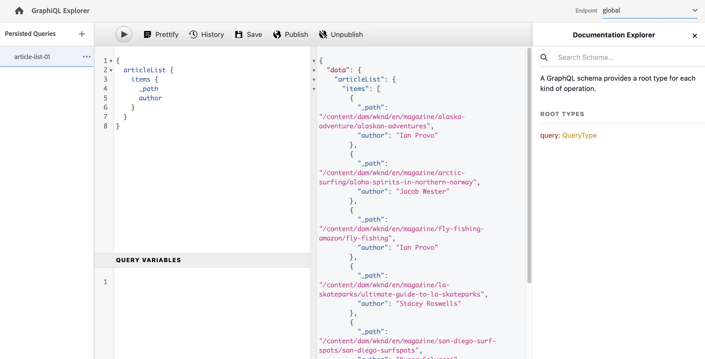
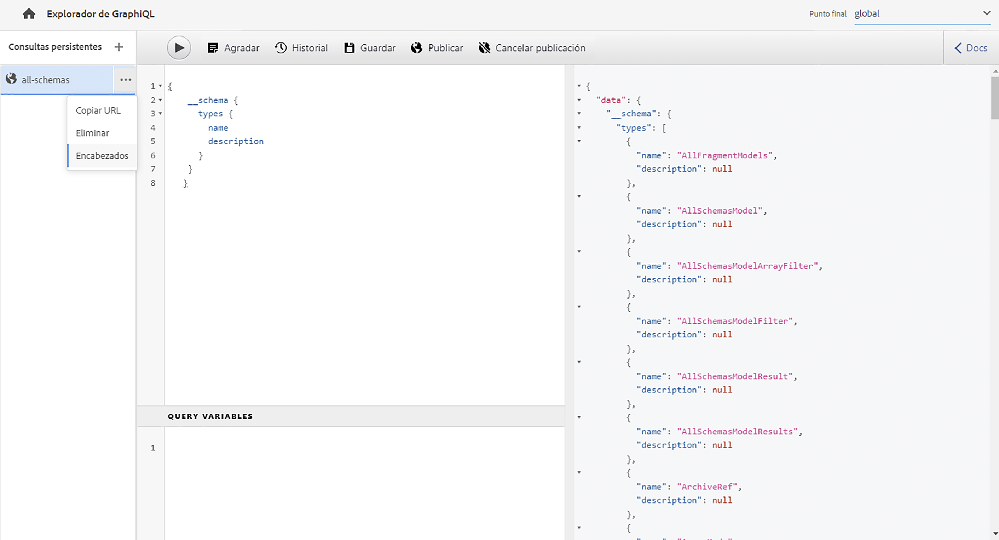
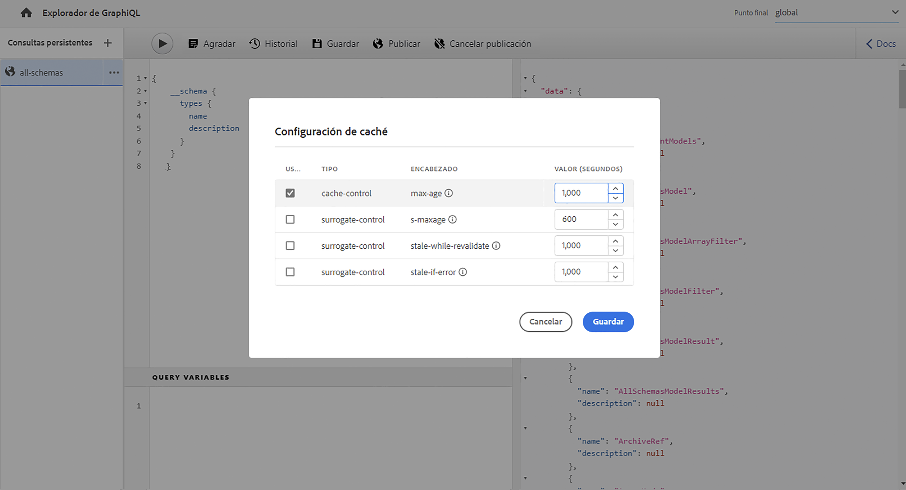
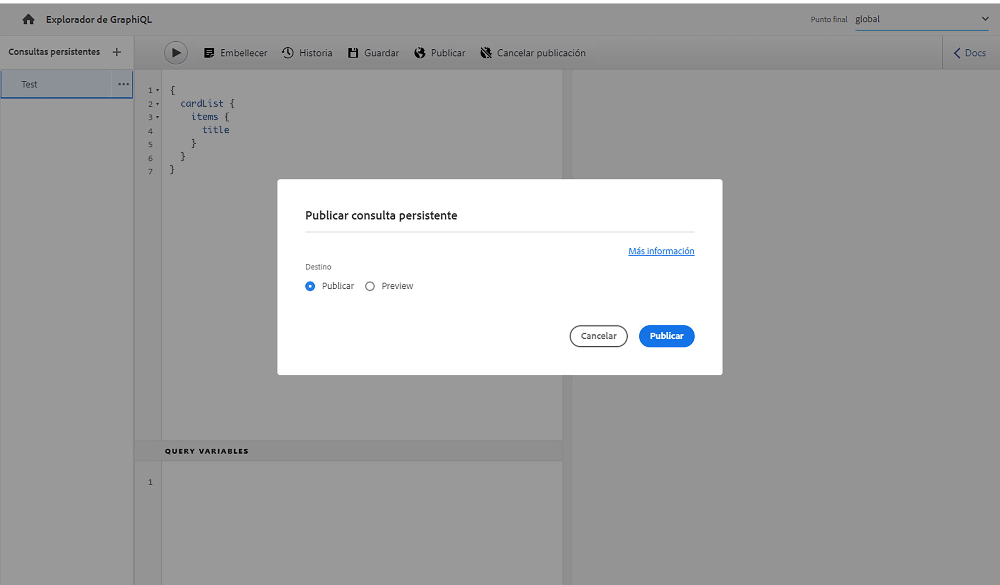
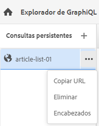

# Uso del IDE de GraphiQL {#graphiql-ide}

Hay una implementación del IDE de [GraphiQL](https://graphql.org/learn/serving-over-http/#graphiql) disponible para su uso con la API de GraphQL de Adobe Experience Manager (AEM) as a Cloud Service.

>[!NOTE]
>
>GraphiQL se incluye en todos los entornos de AEM (pero solo será accesible/visible al configurar los extremos).
>
>En versiones anteriores, se necesitaba un paquete para instalar el IDE de GraphiQL. Si tiene esto instalado, ahora lo puede quitar.

>[!NOTE]
>Debe tener [configurados los puntos de conexión](/help/headless/graphql-api/graphql-endpoint.md) en el [explorador de configuración](/help/sites-cloud/administering/content-fragments/setup.md#enable-content-fragment-functionality-configuration-browser) antes de utilizar el IDE de GraphiQL.

La herramienta **GraphiQL** le permite probar y depurar sus consultas de GraphQL permitiéndole lo siguiente:

* seleccionar el **punto de conexión** adecuado para la configuración de sitios que desee utilizar en sus consultas
* introducir directamente nuevas consultas
* crear y acceder a **[consultas persistentes](/help/headless/graphql-api/persisted-queries.md)**
* ejecutar las consultas para ver inmediatamente los resultados
* administrar **variables de consulta**
* guardar y administrar **consultas persistentes**
* publicar o cancelar la publicación, **Consultas persistentes**, ya sea a su servicio de **Publicación** o de **Previsualización**; por ejemplo, hacia/desde `dev-publish`
* consultar el **historial** de las consultas anteriores
* usar el **Explorador de documentación** para acceder a la documentación; le ayuda a conocer y comprender qué métodos están disponibles.

Puede acceder al editor de consultas desde:

* **Herramientas** > **General** > **Editor de consultas de GraphQL**
* directamente; por ejemplo, `http://localhost:4502/aem/graphiql.html`

Puede utilizar GraphiQL en el sistema para que la aplicación cliente pueda solicitar consultas mediante peticiones GET y consultas de publicación. Para el uso en producción, debe [mover las consultas al entorno de producción](/help/headless/graphql-api/persisted-queries.md#transfer-persisted-query-production). Inicialmente, al creador de producción para validar contenido recién creado con las consultas y, después, para publicar la producción para consumo activo.

## Selección del punto de conexión {#selecting-endpoint}

Como primer paso, debe seleccionar el **[Punto de conexión](/help/headless/graphql-api/graphql-endpoint.md)** que desea utilizar para las consultas. El punto de conexión es apropiado para la configuración de sitios que desea usar para sus consultas.

Esta opción está disponible en la lista desplegable de la parte superior derecha.

## Creación y persistencia de una nueva consulta {#creating-new-query}

Puede introducir la nueva consulta en el editor, que se encuentra en el panel central izquierdo, directamente debajo del logotipo de GraphiQL.

>[!NOTE]
>
>Si ya ha seleccionado una consulta persistente y se muestra en el panel del editor, seleccione `+` (junto a **Consultas persistentes**) para vaciar el editor listo para la nueva consulta.

Empiece a escribir, el editor también hace lo siguiente:

* cuando pasa el ratón, muestra información adicional acerca de los elementos
* proporciona funciones como resaltado de sintaxis, autocompletado o autosugerencia

>[!NOTE]
>
>Las consultas de GraphQL suelen comenzar con un carácter `{`.
>
>Las líneas que comienzan con `#` se ignoran.

Use **Guardar como** para que persista la nueva consulta.

## Actualización de consultas persistentes {#updating-persisted-query}

Seleccione la consulta que desee actualizar en la lista del panel **Consultas persistentes** (extremo izquierdo).

La consulta se muestra en el panel del editor. Realice los cambios que necesite y, a continuación, utilice **Guardar** para confirmar las actualizaciones en la consulta persistente.

## Ejecución de consultas {#running-queries}

Puede ejecutar una nueva consulta inmediatamente, o bien puede cargar y ejecutar una consulta persistente. Para cargar una consulta persistente, selecciónela en la lista; se muestra en el panel Editor.

En cualquier caso, la consulta que se muestra en el panel Editor es la que se ejecuta cuando ocurre lo siguiente:

* seleccione en el icono **Ejecutar consulta**
* use la combinación de teclas `Control-Enter`

## Variables de consulta {#query-variables}

El IDE de GraphiQL también le permite administrar sus [variables de consulta](/help/headless/graphql-api/content-fragments.md#graphql-variables).

Por ejemplo:

## Administración de la caché para las consultas persistentes {#managing-cache}

Se recomiendan las [Consultas persistentes](/help/headless/graphql-api/persisted-queries.md), ya que se pueden almacenar en caché en las capas de Dispatcher y CDN, mejorando finalmente el rendimiento de la aplicación cliente solicitante. De forma predeterminada, AEM invalidará la caché de la red de distribución de contenido (CDN) en función de un tiempo de vida predeterminado (TTL).

>[!NOTE]
>
>Ver [Almacenamiento en caché de las consultas persistentes](/help/headless/graphql-api/persisted-queries.md#caching-persisted-queries).

>[!NOTE]
>
>Las reglas de reescritura personalizadas en Dispatcher pueden anular los valores predeterminados de publicación de AEM.
>
>En caso de que esté enviando encabezados de control de caché basados en TTL desde Dispatcher, según un patrón de coincidencia de ubicación, si es necesario, es posible que desee excluir `/graphql/execute.json/*` de las coincidencias.

Con GraphQL puede configurar los encabezados de caché HTTP para controlar estos parámetros para la consulta persistente individual.

1. La opción **Encabezados** es accesible a través de los tres puntos verticales a la derecha del nombre de la consulta persistente (panel de la izquierda):

   

1. Al seleccionar esta opción, se abre el cuadro de diálogo **Configuración de caché**:

   

1. Seleccione el parámetro adecuado y, a continuación, ajuste el valor según sea necesario:

   * **cache-control** - **max-age**
Las cachés pueden almacenar este contenido durante un número determinado de segundos. Normalmente, es el TTL del explorador (Tiempo de vida).
   * **control de sustitución** - **s-maxage**
Igual que max-age, pero se aplica específicamente a las cachés proxy.
   * **control de sustitución** - **stale-while-revalidate**
Las cachés pueden seguir ofreciendo una respuesta en caché después de que quede obsoleta, hasta el número especificado de segundos.
   * **control de sustitución** - **stale-if-error**
Las cachés pueden seguir ofreciendo una respuesta en caché en caso de error o de origen, hasta el número especificado de segundos.

1. Seleccione **Guardar** para mantener los cambios.

## Publicación y vista previa de consultas persistentes {#publishing-previewing-persisted-queries}

Una vez seleccionada la consulta persistente de la lista (panel izquierdo), puede utilizar la acción de **Publicación**.

Esto activará la consulta en el entorno que seleccione. Puede elegir tanto su entorno de **Publish** (por ejemplo, `dev-publish`), o su entorno de **Vista previa** para facilitar el acceso a las aplicaciones a la hora de realizar pruebas.

>[!NOTE]
>
>La definición de la caché de la consulta persistente `Time To Live` {&quot;cache-control&quot;:&quot;parameter&quot;:value} tiene un valor predeterminado de dos horas (7200 segundos).

## Cancelar publicación de consultas persistentes {#unpublishing-persisted-queries}

Al igual que al publicar, una vez seleccionada la consulta persistente en la lista (panel izquierdo), puede utilizar la acción de **Cancelar publicación**.

Esto desactivará la consulta del entorno que seleccione; o bien su entorno **Publish**, o su bien su entorno **Vista previa**.

>[!NOTE]
>
>También debe asegurarse de haber realizado los cambios necesarios en la aplicación del cliente para evitar posibles problemas.

## Copia de una URL para acceder directamente a la consulta {#copy-url}

La opción **Copiar URL** le permite simular una consulta copiando la URL utilizada para acceder directamente a la consulta persistente y ver los resultados. Esto se puede utilizar para hacer pruebas; por ejemplo, accediendo en un explorador:

<!--
  >[!NOTE]
  >
  >The URL needs [encoding before using programmatically](/help/headless/graphql-api/persisted-queries.md#encoding-query-url).
  >
  >The target environment might need adjusting, depending on your requirements.
-->

Por ejemplo:

`http://localhost:4502/graphql/execute.json/global/article-list-01`

Con esta dirección URL en un explorador, puede confirmar los resultados:

La opción **Copiar URL** es accesible a través de los tres puntos verticales a la derecha del nombre de la consulta persistente (panel de la izquierda):

## Eliminación de consultas persistentes {#deleting-persisted-queries}

La opción **Eliminar** también es accesible a través de los tres puntos verticales a la derecha del nombre de la consulta persistente (panel de la izquierda).

<!-- what happens if you try to delete something that is still published? -->

## Instalación de la consulta persistente en producción {#installing-persisted-query-production}

Después de desarrollar y probar la consulta persistente con GraphiQL, el objetivo final es [transferirlo a su entorno de producción](/help/headless/graphql-api/persisted-queries.md#transfer-persisted-query-production) para que lo usen sus aplicaciones.

## Métodos abreviados de teclado {#keyboard-shortcuts}

Hay una selección de métodos abreviados de teclado que proporcionan acceso directo a los iconos de acción en el IDE:

* Adornar consulta: `Shift-Control-P`
* Combinar consulta: `Shift-Control-M`
* Ejecutar consulta: `Control-Enter`
* Autocompletar: `Control-Space`

>[!NOTE]
>
>En algunos teclados, la tecla `Control` está etiquetada como `Ctrl`.
