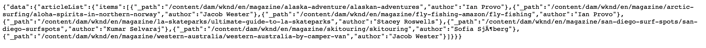

# Uso del IDE de GraphiQL {#graphiql-ide}

Hay una implementación del IDE de [GraphiQL](https://graphql.org/learn/serving-over-http/#graphiql) disponible para su uso con la API de GraphQL de Adobe Experience Manager (AEM) as a Cloud Service.

>[!NOTE]
>
>GraphiQL se incluye en todos los entornos de AEM (pero solo será accesible/visible al configurar los extremos).
>
>En versiones anteriores, se necesitaba un paquete para instalar el IDE de GraphiQL. Si tiene esto instalado, ahora se puede quitar.

>[!NOTE]
>Debe tener [configurados los puntos de conexión](/help/headless/graphql-api/graphql-endpoint.md) en el [explorador de configuración](/help/assets/content-fragments/content-fragments-configuration-browser.md) antes de utilizar el IDE de GraphiQL.


La herramienta **GraphiQL** permite probar y depurar las consultas de GraphQL permitiéndole lo siguiente:
* seleccionar el **punto de conexión** adecuado para la configuración de sitios que desee utilizar en sus consultas
* introducir directamente nuevas consultas
* crear y acceder a **[consultas persistentes](/help/headless/graphql-api/persisted-queries.md)**
* ejecutar las consultas para ver inmediatamente los resultados
* administrar **variables de consulta**
* guardar y administrar **consultas persistentes**
* publicar o cancelar la publicación, **Consultas persistentes** (por ejemplo, para/desde `dev-publish`)
* consultar el **historial** de las consultas anteriores
* usar el **Explorador de documentación** para acceder a la documentación; le ayuda a conocer y comprender qué métodos están disponibles.

Puede acceder al editor de consultas desde:

* **Herramientas** -> **General** -> **Editor de consultas de GraphQL**
* directamente; por ejemplo, `http://localhost:4502/aem/graphiql.html`


Puede utilizar GraphiQL en el sistema para que la aplicación cliente pueda solicitar consultas mediante solicitudes de GET y para publicar consultas. Para el uso de producción, puede [mueva las consultas al entorno de producción](/help/headless/graphql-api/persisted-queries.md#transfer-persisted-query-production). Inicialmente, al creador de producción para validar contenido recién creado con las consultas y, después, para publicar la producción para consumo activo.

## Selección del punto de conexión {#selecting-endpoint}

Como primer paso, debe seleccionar el **[Punto de conexión](/help/headless/graphql-api/graphql-endpoint.md)** que desea utilizar para las consultas. El punto de conexión es apropiado para la configuración de sitios que desea usar para sus consultas.

Esta opción está disponible en la lista desplegable de la parte superior derecha.

## Creación y persistencia de una nueva consulta {#creating-new-query}

Puede introducir la nueva consulta en el editor, que se encuentra en el panel central izquierdo, directamente debajo del logotipo de GraphiQL.

>[!NOTE]
>
>Si ya ha seleccionado una consulta persistente y se muestra en el panel del editor, seleccione `+` (junto a **Consultas persistentes**) para vaciar el editor listo para la nueva consulta.

Empiece a escribir, el editor también hace lo siguiente:

* cuando pasa el ratón, muestra información adicional acerca de los elementos
* proporciona funciones como resaltado de sintaxis, autocompletado o autosugerencia

>[!NOTE]
>
>Las consultas de GraphQL suelen comenzar con un carácter `{`.
>
>Las líneas que comienzan con `#` se ignoran.

Use **Guardar como** para que persista la nueva consulta.

## Actualización de consultas persistentes {#updating-persisted-query}

Seleccione la consulta que desee actualizar en la lista del panel **Consultas persistentes** (extremo izquierdo).

La consulta se mostrará en el panel del editor. Realice los cambios que necesite y, a continuación, utilice **Guardar** para confirmar las actualizaciones en la consulta persistente.

## Ejecución de consultas {#running-queries}

Puede ejecutar una nueva consulta inmediatamente, o bien puede cargar y ejecutar una consulta persistente. Para cargar una consulta persistente, selecciónela en la lista; se mostrará en el panel Editor.

En cualquier caso, la consulta que se muestra en el panel Editor es la que se ejecutará cuando:

* toque o haga clic en el icono **Ejecutar consulta**
* use la combinación de teclas `Control-Enter`

## Variables de consulta {#query-variables}

<!-- more details needed here? -->

El IDE de GraphiQL también le permite administrar sus [variables de consulta](/help/headless/graphql-api/content-fragments.md#graphql-variables).

Por ejemplo:


## Publicación de consultas persistentes {#publishing-persisted-queries}

Una vez seleccionada la consulta persistente en la lista (panel izquierdo), puede utilizar las acciones **Publicación** y **Cancelar la publicación**. Esto los activará en el entorno de publicación (por ejemplo, `dev-publish`) para facilitar el acceso de las aplicaciones durante las pruebas.

>[!NOTE]
>
>La definición de la caché de la consulta persistente `Time To Live` {&quot;cache-control&quot;:&quot;parameter&quot;:value} tiene un valor predeterminado de dos horas (7200 segundos).

## Almacenamiento en caché de las consultas persistentes {#caching-persisted-queries}

AEM invalidará la caché de la red de distribución de contenido (CDN) en función de un tiempo de vida predeterminado (TTL).

Este valor se establece en lo siguiente:

* 7200 segundos es el TTL predeterminado para Dispatcher y CDN; también conocido como *cachés compartidas*
   * predeterminado: s-maxage=7200
* 60 es el TTL predeterminado para el cliente (por ejemplo, un explorador)
   * default: maxage=60

Las consultas de GraphQL de AEM que persistieron con la IU de GraphiQL utilizarán el TTL predeterminado al ejecutarse. Si desea cambiar el TTL para la consulta de GraphLQ, la consulta debe persistir usando el método de API. Esto implica publicar la consulta en AEM usando CURL en la interfaz de línea de comandos.

Por ejemplo:

```xml
curl -X PUT \
    -H 'authorization: Basic YWRtaW46YWRtaW4=' \
    -H "Content-Type: application/json" \
    "http://localhost:4502/graphql/persist.json/wknd/plain-article-query-max-age" \
    -d \
'{ "query": "{articleList { items { _path author main { json } referencearticle { _path } } } }", "cache-control": { "max-age": 300 }}'
```

El `cache-control` se puede configurar en el momento de la creación (PUT) o más tarde (por ejemplo, mediante una petición POST). El control de caché es opcional al crear la consulta persistente, ya que AEM puede proporcionar el valor predeterminado. Consulte [Conservación de una consulta de GraphQL](/help/headless/graphql-api/persisted-queries.md#how-to-persist-query) para ver un ejemplo de persistencia de una consulta utilizando curl.

## Copia de una URL para acceder directamente a la consulta {#copy-url}

La opción **Copiar URL** permite simular una consulta copiando la URL utilizada para acceder directamente a la consulta persistente y ver los resultados. Esto se puede utilizar para hacer pruebas; por ejemplo, accediendo en un explorador:

<!--
  >[!NOTE]
  >
  >The URL will need [encoding before using programmatically](/help/headless/graphql-api/persisted-queries.md#encoding-query-url).
  >
  >The target environment might need adjusting, depending on your requirements.
-->

Por ejemplo:

`http://localhost:4502/graphql/execute.json/global/article-list-01`

Con esta dirección URL en un explorador, puede confirmar los resultados:



La opción **Copiar URL** es accesible a través de los tres puntos verticales a la derecha del nombre de la consulta persistente (panel de la izquierda):


## Eliminación de consultas persistentes {#deleting-persisted-queries}

La opción **Eliminar** también es accesible a través de los tres puntos verticales a la derecha del nombre de la consulta persistente (panel de la izquierda).

<!-- what happens if you try to delete something that is still published? -->


## Instalación de la consulta persistente en producción {#installing-persisted-query-production}

Después de desarrollar y probar la consulta persistente con GraphiQL, el objetivo final es [transferirlo a su entorno de producción](/help/headless/graphql-api/persisted-queries.md#transfer-persisted-query-production) para que lo usen sus aplicaciones.

## Métodos abreviados de teclado {#keyboard-shortcuts}

Hay una selección de métodos abreviados de teclado que proporcionan acceso directo a los iconos de acción en el IDE:

* Adornar consulta: `Shift-Control-P`
* Combinar consulta: `Shift-Control-M`
* Ejecutar consulta: `Control-Enter`
* Autocompletar: `Control-Space`

>[!NOTE]
>
>En algunos teclados, la tecla `Control` está etiquetada como `Ctrl`.
