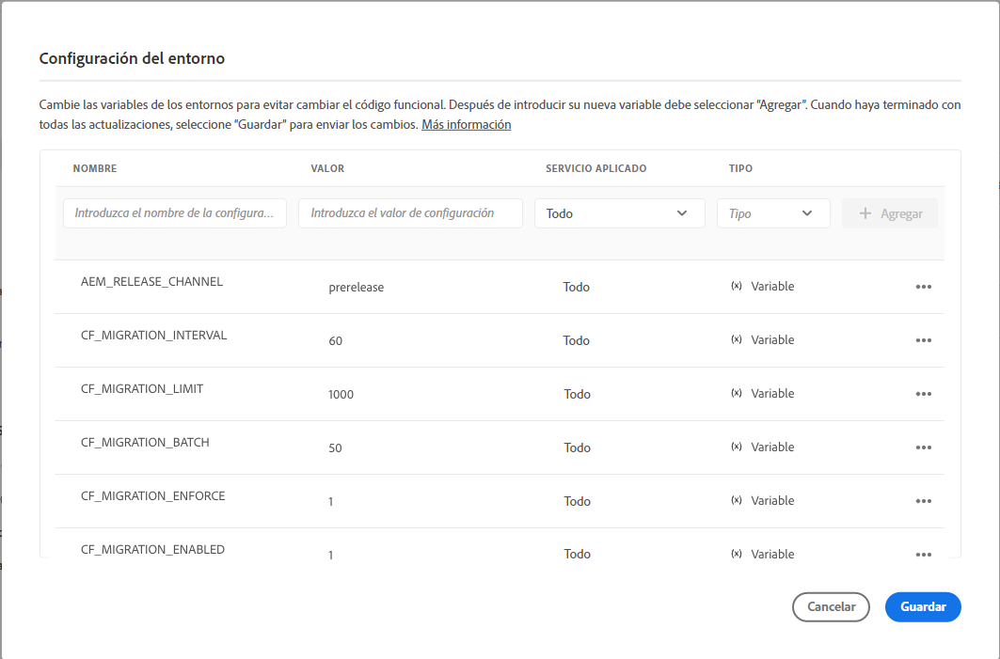

# Actualización de los fragmentos de contenido para el filtrado optimizado de GraphQL {#updating-content-fragments-for-optimized-graphql-filtering}

Para optimizar el rendimiento de los filtros de GraphQL, debe ejecutar un procedimiento para actualizar los fragmentos de contenido.

>[!NOTE]
>
>Después de actualizar los fragmentos de contenido, puede seguir las recomendaciones de [Optimización de consultas de GraphQL](/help/headless/graphql-api/graphql-optimization.md).


## Requisitos previos {#prerequisites}

Asegúrese de que tiene mínimo la versión 2023.1.0 de AEM as a Cloud Service.

## Actualización de los fragmentos de contenido {#updating-content-fragments}

Para ejecutar el procedimiento, siga estos pasos:

1. Habilite la actualización estableciendo las siguientes variables para su instancia mediante la IU de Cloud Manager:

   

   Las variables disponibles son las siguientes:

   <table style="table-layout:auto">
    <tbody>
     <tr>
      <th> </th>
      <th>Nombre</th>
      <th>Value</th>
      <th>Valor predeterminado</th>
      <th>Servicio</th>
      <th>Aplicado</th>
      <th>Tipo</th>
      <th>Notas</th>
     </tr>
     <tr>
      <td>1</td>
      <td>`AEM_RELEASE_CHANNEL` </td>
      <td>`prerelease` </td>
      <td> </td>
      <td>Todos </td>
      <td> </td>
      <td>Variable </td>
      <td>Necesario para habilitar la funcionalidad. </td>
     </tr>
     <tr>
      <td>2</td>
      <td>`CF_MIGRATION_ENABLED` </td>
      <td>`1` </td>
      <td>`0` </td>
      <td>Todos </td>
      <td> </td>
      <td>Variable </td>
      <td>Habilita (!=0) o deshabilita (0) la activación del trabajo de migración de fragmentos de contenido. </td>
     </tr>
     <tr>
      <td>3</td>
      <td>`CF_MIGRATION_ENFORCE` </td>
      <td>`1` </td>
      <td>`0` </td>
      <td>Todos </td>
      <td> </td>
      <td>Variable </td>
      <td>Aplica (!=0) la remigración de fragmentos de contenido.<br>Si este indicador se establece en 0, se hará una migración incremental de los fragmentos de contenido. Esto significa que, si el trabajo finaliza por cualquier motivo, la siguiente ejecución iniciará la migración desde el punto en el que se paró. Tenga en cuenta que se recomienda aplicar la primera migración (valor=1). </td>
     </tr>
     <tr>
      <td>4</td>
      <td>`CF_MIGRATION_BATCH` </td>
      <td>`50` </td>
      <td>`50` </td>
      <td>Todos </td>
      <td> </td>
      <td>Variable </td>
      <td>Tamaño del lote para guardar el número de fragmentos de contenido después de la migración.<br>Esto es relevante para ver cuántos fragmentos de contenido se guardarán en el repositorio en un lote y se puede usar para optimizar el número de escrituras en el repositorio. </td>
     </tr>
     <tr>
      <td>5</td>
      <td>`CF_MIGRATION_LIMIT` </td>
      <td>`1000` </td>
      <td>`1000` </td>
      <td>Todos </td>
      <td> </td>
      <td>Variable </td>
      <td>Número máximo de fragmentos de contenido para procesar a la vez.<br>Consulte también las notas de `CF_MIGRATION_INTERVAL`. </td>
     </tr>
     <tr>
      <td>6</td>
      <td>`CF_MIGRATION_INTERVAL` </td>
      <td>`60` </td>
      <td>`600` </td>
      <td>Todos </td>
      <td> </td>
      <td>Variable </td>
      <td>Intervalo (segundos) para procesar los fragmentos de contenido restantes hasta el siguiente límite<br>Este intervalo también se considera como un tiempo de espera antes de iniciar el trabajo, así como un retraso entre el procesamiento de cada número de CF_MIGRATION_LIMIT de fragmentos de contenido subsiguientes.<br>(*)</td>
     </tr>
    </tbody>
   </table>

   >[!NOTE]
   >
   >(*)
   >
   >El valor de `CF_MIGRATION_INTERVAL` también puede ayudar a aproximar el tiempo total de ejecución del trabajo de migración.
   >
   >Por ejemplo:
   >
   >* Número total de fragmentos de contenido = 20 000
   >* CF_MIGRATION_LIMIT = 1000
   >* CF_MIGRATION_INTERNAL = 60 (s)
   >* Tiempo aproximado necesario para completar la migración = 60 + (20 000/1000 * 60) = 1260 s = 21 min
      >  Los “60” segundos adicionales añadidos al inicio se deben al retraso inicial al comenzar el trabajo.

   >
   >También debe tener en cuenta que esto es solo el tiempo *mínimo* necesario para completar el trabajo y no incluye el tiempo de E/S. El tiempo real empleado podría ser significativamente mayor que esta estimación.

1. Monitorice el progreso y la finalización de la actualización.

   Para ello, monitorice los registros de creación y publicación maestra desde aquí:

   * `com.adobe.cq.dam.cfm.impl.upgrade.UpgradeJob`

      * Registros de creación; por ejemplo:

         ```shell
         23.01.2023 13:13:45.926 *INFO* [sling-threadpool-09cbdb47-4d99-4c4c-b6d5-781b635ee21b-(apache-sling-job-thread-pool)-1-Content Fragment Upgrade Job Queue Config(cfm/upgrader)] com.adobe.cq.dam.cfm.impl.upgrade.UpgradeJob This instance<dd9ffdc1-0c28-4d04-9a96-5d4d223e457e> is the leader, will schedule the upgrade schedule job.
         ...
         23.01.2023 13:13:45.941 *INFO* [sling-threadpool-09cbdb47-4d99-4c4c-b6d5-781b635ee21b-(apache-sling-job-thread-pool)-1-Content Fragment Upgrade Job Queue Config(cfm/upgrader)] com.adobe.cq.dam.cfm.impl.upgrade.UpgradeJob Scheduling content fragments upgrade from version 0 to 1, slingJobId: 2023/1/23/13/13/50e1a575-4cd7-497b-adf0-62cb5768eedb_0, enforce: true, limit: 1000, batch: 50, interval: 60s
         
         23.01.2023 13:20:40.960 *INFO* [sling-threadpool-09cbdb47-4d99-4c4c-b6d5-781b635ee21b-(apache-sling-job-thread-pool)-1-Content Fragment Upgrade Job Queue Config(cfm/upgrader)] com.adobe.cq.dam.cfm.impl.upgrade.UpgradeJob Finished content fragments upgrade in 6m, slingJobId: 2023/1/23/13/13/50e1a575-4cd7-497b-adf0-62cb5768eedb_0, status: MaintenanceJobStatus{jobState=SUCCEEDED, statusMessage='Upgrade to version '1' succeeded.', errors=[], successCount=3781, failedCount=0, skippedCount=0}
         ```

      * Registros de publicación maestra; por ejemplo:

         ```shell
         23.01.2023 12:35:05.150 *INFO* [sling-threadpool-8abcc1bb-cdcb-46d4-8565-942ad8a73209-(apache-sling-job-thread-pool)-1-Content Fragment Upgrade Job Queue Config(cfm/upgrader)] com.adobe.cq.dam.cfm.impl.upgrade.UpgradeJob This instance<ad1b399e-77be-408e-bc3f-57097498fddb> is the leader, will schedule the upgrade schedule job.
         
         23.01.2023 12:35:05.161 *INFO* [sling-threadpool-8abcc1bb-cdcb-46d4-8565-942ad8a73209-(apache-sling-job-thread-pool)-1-Content Fragment Upgrade Job Queue Config(cfm/upgrader)] com.adobe.cq.dam.cfm.impl.upgrade.UpgradeJob Scheduling content fragments upgrade from version 0 to 1, slingJobId: 2023/1/23/12/34/ad1b399e-77be-408e-bc3f-57097498fddb_0, enforce: true, limit: 1000, batch: 50, interval: 60s
         ...
         23.01.2023 12:40:45.180 *INFO* [sling-threadpool-8abcc1bb-cdcb-46d4-8565-942ad8a73209-(apache-sling-job-thread-pool)-1-Content Fragment Upgrade Job Queue Config(cfm/upgrader)] com.adobe.cq.dam.cfm.impl.upgrade.UpgradeJob Finished content fragments upgrade in 5m, slingJobId: 2023/1/23/12/34/ad1b399e-77be-408e-bc3f-57097498fddb_0, status: MaintenanceJobStatus{jobState=SUCCEEDED, statusMessage='Upgrade to version '1' succeeded.', errors=[], successCount=3781, failedCount=0, skippedCount=0}
         ```

1. Desactive el procedimiento de actualización.

   >[!IMPORTANT]
   >
   >Este paso es necesario para completar la actualización.

   Una vez ejecutado el procedimiento de actualización, restablezca la variable de entorno de la nube `CF_MIGRATION_ENABLED` a “0” para activar el reciclaje de todos los pods.

   <table style="table-layout:auto">
    <tbody>
     <tr>
      <th> </th>
      <th>Nombre</th>
      <th>Value</th>
      <th>Valor predeterminado</th>
      <th>Servicio</th>
      <th>Aplicado</th>
      <th>Tipo</th>
      <th>Notas</th>
     </tr>
     <tr>
      <td></td>
      <td>`CF_MIGRATION_ENABLED` </td>
      <td>`0` </td>
      <td>`0` </td>
      <td>Todos </td>
      <td> </td>
      <td>Variable </td>
      <td>Deshabilita (0) [o habilita (!=0)] activando el trabajo de migración de fragmentos de contenido. </td>
     </tr>
    </tbody>
   </table>

   >[!NOTE]
   >
   >Esto es particularmente importante para el nivel de publicación, ya que la actualización de contenido solo se realiza en la publicación maestra y, cuando se recicla de los pods, todos los pods de publicación normales se basan en ella.

1. Compruebe que se ha completado el procedimiento de actualización.

   Puede verificar la finalización correcta de la actualización mediante el explorador del repositorio en Developer Console de Cloud Manager para comprobar los datos del fragmento de contenido.

   * Antes de completar la primera migración, la propiedad `cfGlobalVersion` no existirá.
Por lo tanto, la presencia de esta propiedad en el nodo JCR `/content/dam` con un valor de `1` confirma la finalización de la migración.

   * También puede verificar las siguientes propiedades en los fragmentos de contenido individuales:

      * `_strucVersion` debe tener el valor de `1`
      * La estructura `indexedData` debe existir

      >[!NOTE]
      >
      >El procedimiento actualizará los fragmentos de contenido en las instancias de creación y publicación.
      >
      >Por lo tanto, se recomienda realizar la comprobación a través del explorador de repositorios para *al menos* una instancia de creación *y* una de publicación.


## Restricciones {#limitations}

Tenga en cuenta las siguientes limitaciones:

* Optimizar el rendimiento de los filtros de GraphQL solo será posible después de una actualización completa de todos los fragmentos de contenido (indicada por la presencia de la propiedad `cfGlobalVersion` para el nodo JCR `/content/dam`).

* Si los fragmentos de contenido se importan desde un paquete de contenido (mediante `crx/de`) después de ejecutar el procedimiento de actualización, esos fragmentos de contenido no se tendrán en cuenta en los resultados de la consulta de GraphQL hasta que se vuelva a ejecutar el procedimiento de actualización.
