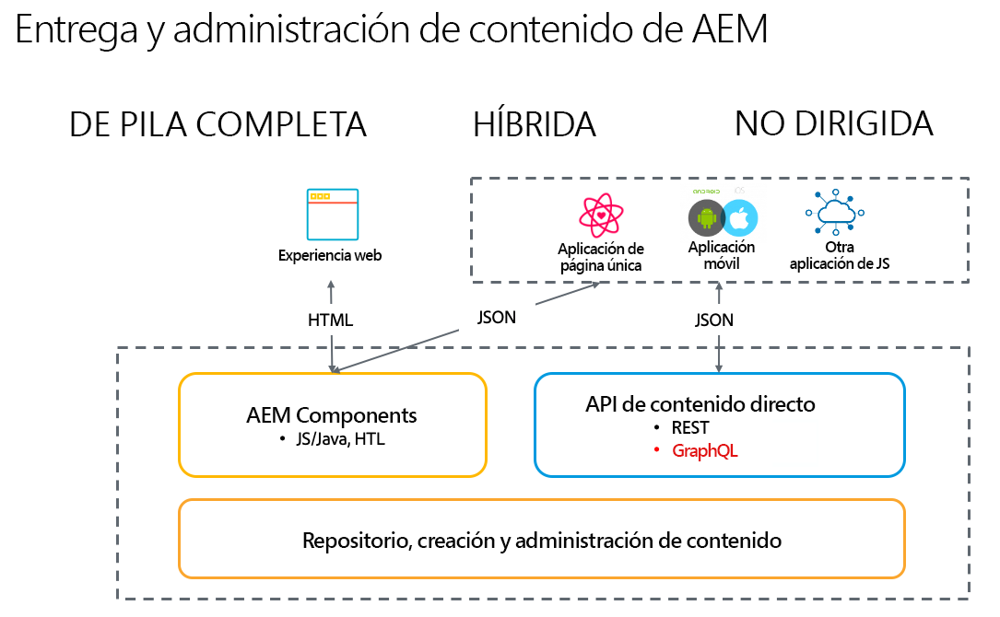

# Introducción a Adobe Experience Manager como CMS sin encabezado {#introduction-aem-headless}

Aprenda a utilizar Adobe Experience Manager (AEM) como CMS (sistema de administración de contenido) sin encabezado, con funciones como modelos de fragmento de contenido, fragmentos de contenido y la API de GraphQL que potencia experiencias sin encabezado a escala.

Puede leer la documentación detallada de las distintas funciones implicadas o seguir la selección de [Recorridos sin encabezado para obtener información general sobre los primeros pasos](#first-steps).

>[!NOTE]
>
>Consulte también [¿Qué es sin encabezado?](/help/headless/what-is-headless.md) para obtener una introducción a los conceptos y la terminología sin encabezado.

## Información general {#overview}

AEM Headless es una solución de CMS de Experience Manager que permite que cualquier aplicación a través de HTTP que use GraphQL consuma contenido estructurado (fragmentos de contenido) en AEM. Las implementaciones sin encabezado permiten la entrega de experiencias entre plataformas y canales a escala.

La implementación sin encabezado renuncia a la administración de páginas y componentes, como es tradicional en soluciones híbridas y de pila completa. En su lugar, se centra en la creación de fragmentos de contenido neutros para el canal y reutilizables y su envío a través de canales. Es un patrón de desarrollo moderno y dinámico para implementar experiencias web.

## Características {#aem-headless-features}

AEM as a Cloud Service es una herramienta flexible para el modelo de implementación sin encabezado que ofrece tres potentes características:

1. **Modelos de fragmentos de contenido**
   * Los modelos de fragmento de contenido son representaciones estructuradas del contenido.
   * Los modelos de fragmentos de contenido los definen los arquitectos de información en el editor del modelo de fragmentos de contenido de AEM.
   * Los modelos de fragmento de contenido sirven de base para los fragmentos de contenido.
1. **Fragmentos de contenido**
   * Un fragmento de contenido se crea basado en un modelo.
   * Los fragmentos de contenido los crean los autores de contenido mediante el editor de fragmentos de contenido de AEM.
   * Los fragmentos de contenido se almacenan como Recursos AEM, pero se pueden administrar mediante la consola Recursos o la [consola Fragmentos de contenido](/help/sites-cloud/administering/content-fragments/overview.md#content-fragments-console).
1. **API de contenido para entrega**
   * Consulte [API de AEM para la administración y entrega de contenido estructurado](/help/headless/apis-headless-and-content-fragments.md) para obtener una descripción general de las diversas API disponibles y una comparación de algunos de los conceptos involucrados.

   * La entrega de contenido directa también es posible con la [Exportación JSON del componente principal del fragmento de contenido](https://experienceleague.adobe.com/docs/experience-manager-core-components/using/components/content-fragment-component.html?lang=es).

## Sus primeros pasos {#first-steps}

Hay varios recursos disponibles para empezar a utilizar las funciones sin encabezado de AEM. Cada guía está diseñada para diferentes casos de uso y públicos.

| Recurso | Descripción | Tipo | Público | EST Hora |
|---|---|---|---|---|
| [Recorrido para desarrolladores de Headless](/help/journey-headless/developer/overview.md) | **Para desarrolladores nuevos en las tecnologías de AEM y sin encabezado**, es recomendable empezar aquí para ver una introducción completa a AEM y sus características sin encabezado, desde la teoría sobre esta tecnología hasta publicar su primer proyecto sin encabezado. | Guía  | Desarrolladores **nuevos en las tecnologías de AEM y sin encabezado** | 1 hora |
| [Configuración sin encabezado](/help/headless/setup/introduction.md) | **Para usuarios de AEM con experiencia** que necesiten un breve resumen de las funciones principales de AEM sin encabezado, se recomienda consultar esta descripción general de inicio rápido. | Configuración de referencia | Desarrolladores, administradores **con experiencia en AEM** | 20 minutos |
| [Tutorial práctico de Headless](https://experienceleague.adobe.com/docs/experience-manager-learn/getting-started-with-aem-headless/graphql/multi-step/overview.html?lang=es) | **Si prefiere un enfoque práctico y está familiarizado con AEM**, este tutorial se adentra directamente en la implementación de una aplicación sencilla sin encabezado. | Tutorial | Desarrolladores | 2 horas |
| [Recorrido para arquitectos de Headless](/help/journey-headless/architect/overview.md) | **Para desarrolladores nuevos en las tecnologías de AEM y sin encabezado**, es recomendable empezar aquí para ver una introducción a las potentes y flexibles funciones sin encabezado de Adobe Experience Manager as a Cloud Service y cómo diseñar el contenido de su proyecto. | Guía  | Arquitectos | 1 hora |
| [Recorrido de creación sin encabezado](/help/journey-headless/author/overview.md) | **Para usuarios comerciales nuevos en las tecnologías de AEM y sin encabezado**, es recomendable empezar aquí para ver una introducción a las potentes y flexibles funciones sin encabezado de Adobe Experience Manager as a Cloud Service y cómo diseñar el contenido de su proyecto. | Guía  | Creadores de contenido | 1 hora |
| [Recorrido de traducción sin encabezado](/help/journey-headless/translation/overview.md) | Para aquellos **interesados en el enfoque de traducción sin encabezado de AEM**. Obtenga información acerca de las tecnologías sin encabezado y cómo crear y actualizar proyectos de traducción en AEM de la A a la Z. | Guía  | Especialistas en traducción | 1 hora |

## Comparación entre con encabezado y sin encabezado {#headful-headless}

Esta guía se centra en el modelo completo de implementación sin encabezado de AEM. Sin embargo, con encabezado o sin encabezado no necesita ser una opción binaria en AEM. Las funciones sin encabezado se pueden usar para administrar y entregar contenido a varios puntos de contacto, al tiempo que permiten a los autores de contenido editar aplicaciones de una sola página. Todo en AEM.

>[!TIP]
>
>Consulte el documento [Con encabezado y sin encabezado en AEM](/help/implementing/developing/headful-headless.md) para obtener más información.
