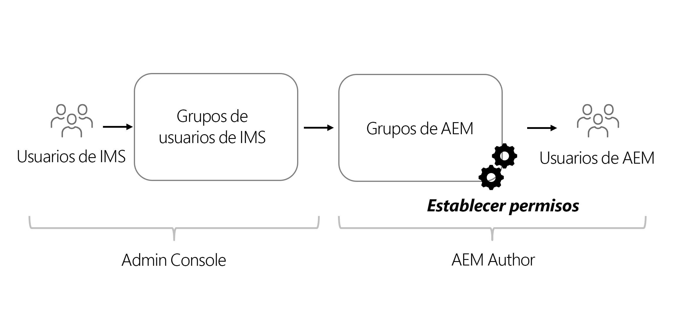

# Consideraciones de permisos para contenido sin encabezado

Con una implementación sin encabezado, deben abordarse varias áreas de seguridad y permisos. Los permisos y los perfiles se pueden considerar en general, en función del entorno de AEM **Creación** o **Publicación**. Cada entorno contiene diferentes perfiles con distintas necesidades.

## Consideraciones del servicio de creación

El servicio de creación es donde los usuarios internos crean, administran y publican contenido. Los permisos giran en torno a los diferentes perfiles que administran el contenido.

### Administración de permisos en el nivel de grupo

Como práctica recomendada, los permisos deben establecerse en Grupos en AEM. También conocidos como grupos locales, estos grupos se pueden administrar dentro del entorno de creación de AEM.

La forma más sencilla de administrar los miembros del grupo es utilizar los grupos de Adobe Identity Management System (IMS) y asignar [grupos de IMS a grupos de AEM locales](https://experienceleague.adobe.com/docs/experience-manager-cloud-service/content/security/ims-support.html?lang=es#managing-permissions-in-aem).

En un nivel superior, el proceso es el siguiente:

1. Añadir usuarios de IMS a un grupo de usuarios de IMS nuevo o existente mediante [Admin Console](https://adminconsole.adobe.com/).
1. Los grupos de IMS se sincronizan con AEM cuando los usuarios inician sesión.
1. Asigne grupos de IMS a grupos de AEM.
1. Establezca permisos en los grupos de AEM.
1. Cuando los usuarios inician sesión en AEM y se autentican mediante IMS, heredan los permisos del grupo de AEM.

>[!TIP]
>
>AEM Para ver un tutorial en vídeo detallado sobre la administración de usuarios y grupos de IMS y de los usuarios de la, consulte [Configuración del acceso a AEM as a Cloud Service](https://experienceleague.adobe.com/docs/experience-manager-learn/cloud-service/accessing/overview.html?lang=es).

Para administrar **grupos** en AEM, vaya a **Herramientas** > **Seguridad** > **Grupos**.

Para administrar los permisos de los grupos en AEM, vaya a **Herramientas** > **Seguridad** > **Permisos**.

### Usuarios de DAM

“DAM”, en este contexto, son las sigas en inglés para administración de activos digitales. **Usuarios de DAM** es un grupo predeterminado en AEM que puede utilizarse para usuarios “comunes” que administran recursos digitales y fragmentos de contenido. Este grupo proporciona permisos para **ver**, **añadir**, **actualizar**, **eliminar** y **publicar** fragmentos de contenido y todos los demás archivos en AEM Assets.

Si utiliza IMS para miembro del grupo, añada los grupos de IMS adecuados como miembros de **Usuarios de DAM**. Los miembros del grupo de IMS heredan los permisos del grupo Usuarios de DAM al iniciar sesión en el entorno de AEM.

#### Personalización del grupo de usuarios de DAM

Se recomienda no modificar directamente los permisos de un grupo predeterminado. En su lugar, también puede crear sus propios grupos siguiendo los permisos de grupo de **Usuarios de DAM** y restringir aún más el acceso a diferentes **carpetas** en AEM Assets.

Para obtener permisos más granulares, utilice la consola **Permisos** en AEM y actualice la ruta de `/content/dam` a una ruta más específica, como, `/content/dam/mycontentfragments`.

Puede ser deseable conceder a este grupo de usuarios permisos para crear y editar fragmentos de contenido, pero no para eliminarlos. Para revisar y asignar permisos de edición, pero no para eliminar, consulte [Fragmentos de contenido: eliminar consideraciones](/help/sites-cloud/administering/content-fragments/delete-considerations.md).

### Editores de modelos

La capacidad de modificar **Modelos de fragmentos de contenido** debe dejarse a los administradores o a un **grupo pequeño** de usuarios con permisos elevados. Modificar el modelo de fragmentos de contenido tiene muchos efectos posteriores.

>[!CAUTION]
>
>Las modificaciones en los modelos de fragmentos de contenido modifican la API de GraphQL subyacente en la que se basan las aplicaciones sin encabezado.

Si desea crear un grupo que administre los modelos de fragmentos de contenido, pero sin acceso de administrador completo, puede crear un grupo con las siguientes entradas de control de acceso:

| Ruta | Permiso | Privilegios |
|-----| -------------| ---------|
| `/conf` | **permitir** | `jcr:read` |
| `/conf/<config-name>/settings/dam/cfm` | **permitir** | `rep:write`, `crx:replicate` |

## Permisos del servicio de publicación

El servicio de publicación se considera el entorno “activo” y suele ser con el que interactúan los consumidores de la API de GraphQL. El contenido, después de editarse y aprobarse en el servicio de creación, se publica en el servicio Publicar. A continuación, la aplicación sin encabezado consume el contenido aprobado del servicio de publicación a través de las API de GraphQL.

De forma predeterminada, el contenido expuesto a través de los puntos de conexión de GraphQL del servicio de publicación de AEM es accesible para todos, incluidos los usuarios no autenticados.

### Permisos de contenido

El contenido expuesto a través de las API de AEM de GraphQL se puede restringir mediante [Grupos de usuarios cerrados (CUG)](https://experienceleague.adobe.com/docs/experience-manager-learn/assets/advanced/closed-user-groups.html?lang=es) configurados en carpetas de recursos, que especifican qué grupos de usuarios de AEM (y sus miembros) pueden acceder al contenido de las carpetas de recursos.

Los CUG de recursos funcionan de la siguiente manera:

* En primer lugar, deniegan todo acceso a la carpeta y las subcarpetas
* A continuación, permiten el acceso de lectura a la carpeta y subcarpetas para todos los grupos de usuarios de AEM que se enumeran en la lista de CUG

Los CUG se pueden configurar en carpetas de recursos que contengan contenido expuesto a través de las API de GraphQL. El acceso a las carpetas de recursos en la publicación de AEM debe controlarse mediante grupos de usuarios, en lugar de usuarios directamente. Cree (o reutilice) un grupo de usuarios de AEM que conceda acceso a carpetas de recursos que alberguen contenido expuesto por las API de GraphQL.

#### Selección del esquema de autenticación{#publish-permissions-users}

El [SDK sin encabezado de AEM](https://github.com/adobe/aem-headless-client-js#create-aemheadless-client) admite dos tipos de autenticación:

* [Autenticación basada en tokens](/help/implementing/developing/introduction/generating-access-tokens-for-server-side-apis.md) con credenciales de servicio enlazadas a una sola cuenta técnica.
* Autenticación básica con usuarios de AEM.

### Acceso a la API de GraphQL

Las solicitudes HTTP que proporcionan las [credenciales de autenticación adecuadas](https://github.com/adobe/aem-headless-client-js#create-aemheadless-client) a los puntos de conexión de la API de GraphQL del servicio de publicación de AEM incluyen contenido que las credenciales están autorizadas a leer y contenido accesible de forma anónima. Otros consumidores de la API de GraphQL no pueden leer el contenido de las carpetas protegidas con CUG.
