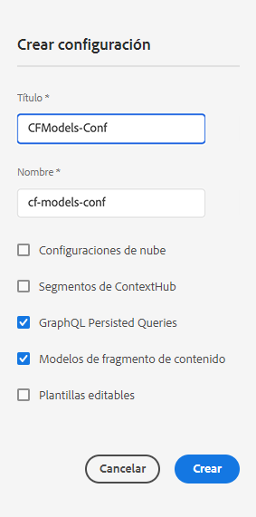

# Creación de una configuración: configuración sin encabezado {#creating-configuration}

Como primer paso para empezar a utilizar sin encabezado en AEM as a Cloud Service, debe crear una configuración.

## ¿Qué es una configuración? {#what-is-a-configuration}

El explorador de configuración proporciona una API de configuración genérica, una estructura de contenido y un mecanismo de resolución para las configuraciones en AEM.

En el contexto de la administración de contenido sin encabezado en AEM, piense en una configuración como lugar de trabajo dentro de AEM donde puede crear los modelos de contenido, que definen la estructura de su contenido futuro y los fragmentos de contenido. Puede tener varias configuraciones para separar estos modelos.

Si está familiarizado con las [plantillas de página en una implementación de AEM e de pila completa](/help/sites-cloud/authoring/sites-console/templates.md), el uso de configuraciones para la administración de modelos de contenido es similar.

## Cómo crear una configuración {#how-to-create-a-configuration}

Un administrador solo tendría que crear una configuración una vez, o poco a poco cuando se necesite un nuevo espacio de trabajo para organizar los modelos de contenido. Para los fines de esta guía de introducción, solo necesitamos crear una configuración.

1. AEM Inicie sesión en el as a Cloud Service y, en el menú principal, seleccione **Herramientas > General > Explorador de configuración**.
1. Proporcione un **Título** y **Nombre** para su configuración.
   * El **Título** debe ser descriptivo.
   * El **nombre** se convierte en el nombre de nodo del repositorio.
      * Se genera automáticamente en función del título y se ajusta según las [convenciones de nomenclatura de AEM](/help/implementing/developing/introduction/naming-conventions.md).
      * Se puede modificar si es necesario.
1. Compruebe las siguientes opciones:
   * **Modelos de fragmentos de contenido**
   * **Consultas persistentes de GraphQL**

   

1. Seleccionar **Crear**

Si es necesario, puede crear varias configuraciones. Las configuraciones también se pueden anidar.

>[!NOTE]
>
>Pueden ser necesarias las opciones de configuración además de los **Modelos de fragmentos de contenido** y **Consultas persistentes de GraphQL** en función de los requisitos de implementación.

## Siguientes pasos {#next-steps}

Con esta configuración, ahora puede pasar a la segunda parte de la guía de introducción y [crear modelos de fragmentos de contenido.](create-content-model.md)

>[!TIP]
>
>Para obtener información detallada acerca del Explorador de configuración, [consulte la documentación del Explorador de configuración](/help/implementing/developing/introduction/configurations.md).
