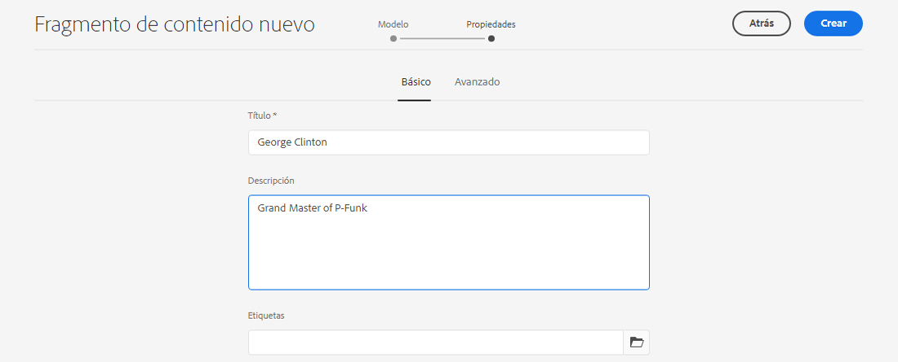

# Creación de fragmentos de contenido: configuración sin encabezado {#creating-content-fragments}

Aprenda a utilizar AEM fragmentos de contenido para diseñar, crear, depurar y utilizar contenido independiente de las páginas para una entrega sin encabezado.

## ¿Qué son los fragmentos de contenido? {#what-are-content-fragments}

[Ahora que ha creado una carpeta de recursos](create-assets-folder.md) donde puede almacenar los fragmentos de contenido, ahora puede crear los fragmentos.

Los fragmentos de contenido le permiten diseñar, crear, depurar y publicar contenido independiente de las páginas. Permiten preparar contenido listo para usar en varias ubicaciones y en varios canales.

Los fragmentos de contenido contienen contenido estructurado y se pueden entregar en formato JSON.

## Cómo crear un fragmento de contenido {#how-to-create-a-content-fragment}

Los autores de contenido crearán cualquier número de fragmentos de contenido para representar el contenido que crean. Esta será su tarea principal en AEM. Para los fines de esta guía de introducción, solo necesitamos crear una.

1. Inicie sesión en AEM as a Cloud Service y, en el menú principal, seleccione **Navegación -> Recursos**.
1. Toque o haga clic en el botón [carpeta creada anteriormente.](create-assets-folder.md)
1. Toque o haga clic **Crear -> Fragmento de contenido**.
1. La creación de un fragmento de contenido se presenta como un asistente en dos pasos. Seleccione primero qué modelo desea utilizar para crear el fragmento de contenido y toque o haga clic en **Siguiente**.
   * Los modelos disponibles dependen de la variable [**Configuración de nube** definió para la carpeta de recursos](create-assets-folder.md) en el que está creando el fragmento de contenido.
   * Si recibe el mensaje `We could not find any models`, compruebe la configuración de la carpeta de recursos.

   
1. Proporcione un **Título**, **Descripción** y **Etiquetas** según sea necesario, toque o haga clic en **Crear**.

   
1. Toque o haga clic **Apertura** en la ventana de confirmación.

   
1. Proporcione los detalles del fragmento de contenido en el Editor de fragmentos de contenido.

   
1. Toque o haga clic **Guardar** o  **Guardar y cerrar**.

Los fragmentos de contenido pueden hacer referencia a otros fragmentos de contenido, lo que permite una estructura de contenido anidada si es necesario.

Los fragmentos de contenido también pueden hacer referencia a otros recursos en AEM. [Estos recursos deben almacenarse en AEM](/help/assets/manage-digital-assets.md) antes de crear una referencia a un fragmento de contenido.

## Siguientes pasos {#next-steps}

Ahora que ha creado un fragmento de contenido, puede pasar a la parte final de la guía de introducción y [cree solicitudes de API para acceder y enviar fragmentos de contenido.](create-api-request.md)

>[!TIP]
>
>Para obtener información detallada sobre la administración de fragmentos de contenido, consulte la [Documentación de fragmentos de contenido](/help/assets/content-fragments/content-fragments.md)
