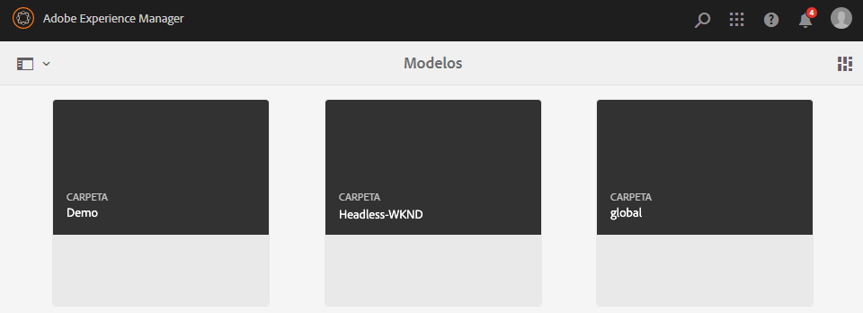
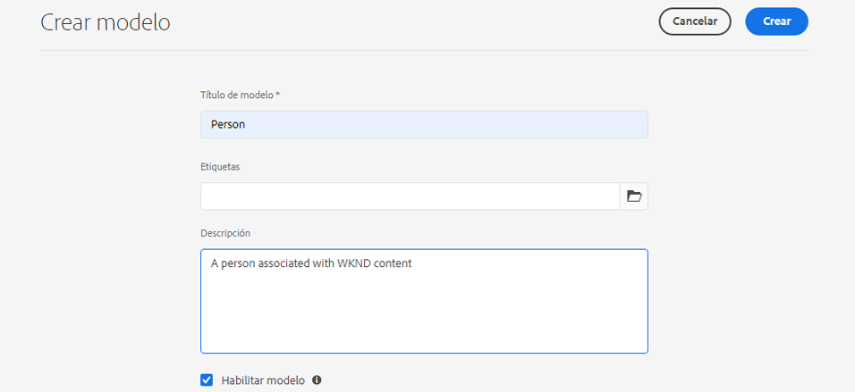
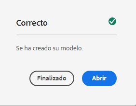
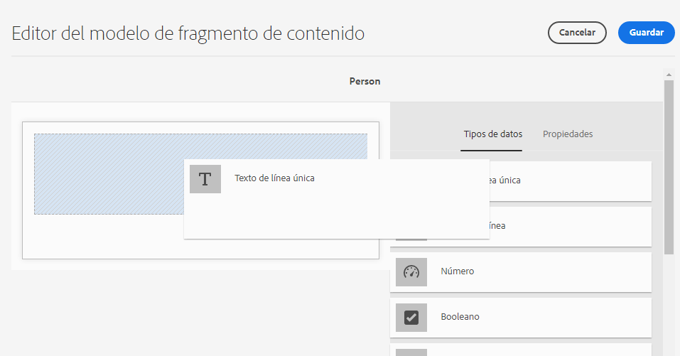
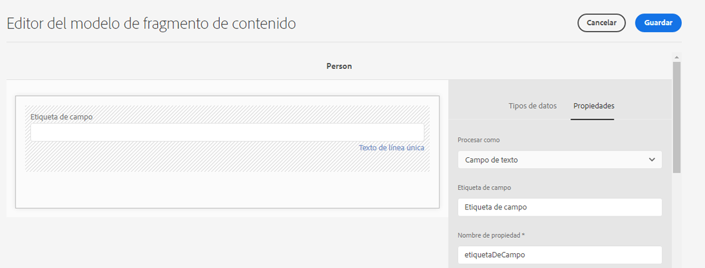
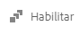
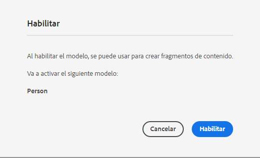
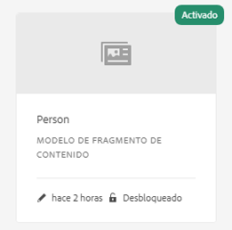

# Creación de modelos de fragmentos de contenido: configuración sin encabezado {#creating-content-fragment-models}

Defina la estructura del contenido que creará y servirá con las capacidades sin encabezado de AEM mediante modelos de fragmentos de contenido.

## ¿Qué son los modelos de fragmentos de contenido? {#what-are-content-fragment-models}

[Ahora que ha creado una configuración](create-configuration.md), puede utilizarla para crear modelos de fragmentos de contenido.

Los modelos de fragmentos de contenido definen la estructura de los datos y el contenido que creará y administrará en AEM. Sirven como una especie de andamiaje para el contenido. Al elegir crear contenido, los autores elegirán entre los modelos de fragmentos de contenido que defina, que los guiarán en la creación de contenido.

## Cómo crear un modelo de fragmento de contenido {#how-to-create-a-content-fragment-model}

Un arquitecto de la información realizaría estas tareas solo de forma esporádica, a medida que se necesiten nuevos modelos. Para los fines de esta guía de introducción, solo necesitamos crear un modelo.

1. Inicie sesión en AEM as a Cloud Service y, en el menú principal, seleccione **Herramientas**, **General**, **Modelos de fragmentos de contenido**.
1. Seleccione la carpeta que se formó al crear la configuración.

   
1. Seleccione **Crear**.
1. Proporcione un **Título de modelo**, **Etiquetas** y una **Descripción**. También puede seleccionar o anular la selección de **Habilitar modelo** para controlar si el modelo se activa inmediatamente tras la creación.

   
1. En la ventana de confirmación, selecciona **Abrir** para configurar el modelo.

   
1. Con el **Editor del modelo de fragmento de contenido**, cree su modelo de fragmento de contenido arrastrando y soltando campos de la columna **Tipos de datos**.

   

1. Una vez colocado un campo, se deben configurar sus propiedades. El editor cambiará automáticamente a la pestaña **Propiedades** para el campo añadido, donde puede proporcionar los campos obligatorios.

   

1. Cuando termine de crear el modelo, seleccione **Guardar**.

1. El modo del modelo creado depende de si seleccionó **Habilitar modelo** al crear el modelo:
   * Seleccionado: el nuevo modelo ya estará **Habilitado**
   * No seleccionado: el nuevo modelo se crea en modo **Borrador**

1. Si aún no lo está, el modelo debe estar **Habilitado** para utilizarlo.
   1. Seleccione el modelo que creó y luego seleccione **Habilitar**.

      
   1. Confirme la activación del modelo tocando o haciendo clic en **Habilitar** en el cuadro de diálogo de confirmación.

      
1. El modelo está ahora habilitado y listo para usarse.

   

El **Editor del modelo de fragmentos de contenido** admite muchos tipos de datos diferentes, como campos de texto simples, referencias de recursos, referencias a otros modelos y datos JSON.

Puede crear varios modelos. Los modelos pueden hacer referencia a otros fragmentos de contenido. Use [configuraciones](create-configuration.md) para organizar los modelos.

## Siguientes pasos {#next-steps}

Ahora que ha definido las estructuras de los fragmentos de contenido creando modelos, puede pasar a la tercera parte de la guía de introducción y [crear carpetas donde almacenará los fragmentos](create-assets-folder.md).

>[!TIP]
>
>Para obtener información detallada acerca de los modelos de fragmentos de contenido, consulte la [Documentación de modelos de fragmentos de contenido](/help/sites-cloud/administering/content-fragments/content-fragment-models.md).
