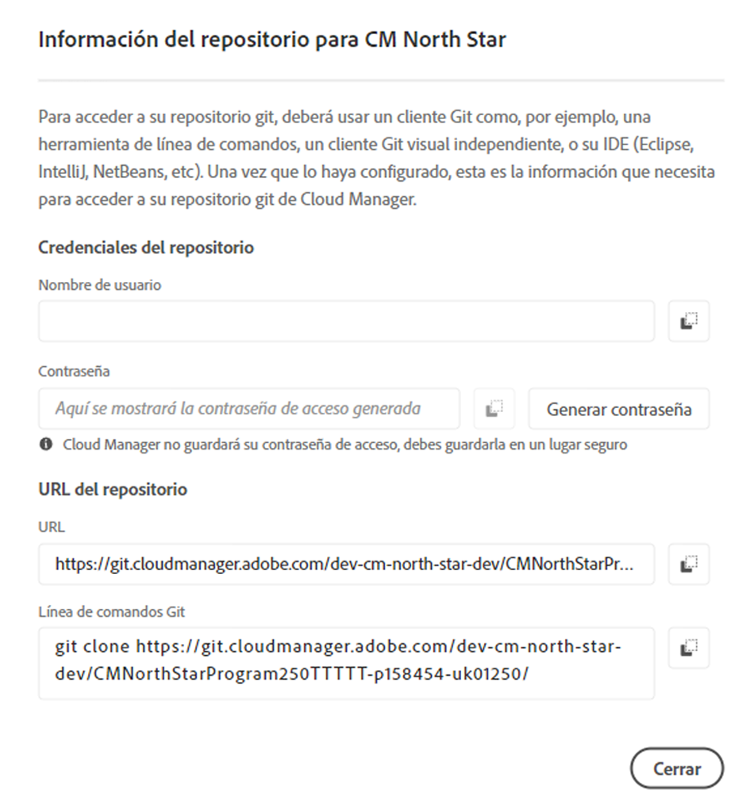

# Acceder a Git {#accessing-git}

Puede acceder a su repositorio Git y administrarlo mediante la administración de cuentas Git de autoservicio desde la interfaz de usuario de Cloud Manager.

## Uso de Administración de cuentas Git de autoservicio {#self-service-git}

Utilice el botón **Administrar Git** disponible en la interfaz de usuario del Administrador de nube, especialmente en la tarjeta de canalización.

1. Vaya a la página *Información general del Programa* y a la tarjeta de tuberías.

1. Vista la opción **Administrar Git** para acceder y administrar su repositorio Git.

   

   Además, si selecciona la ficha **Canalización sin producción**, también vista la opción **Administrar Git**.

   

>[!NOTE]
>La opción **Administrar Git** es visible para los usuarios en la función Desarrollador o Administrador de implementación. Al hacer clic en este botón, se abre un cuadro de diálogo que permite al usuario encontrar la dirección URL de su repositorio de Git del Administrador de nube junto con su nombre de usuario y contraseña.

Las consideraciones importantes para administrar su Git en Cloud Manager son:

* **Dirección URL**: La dirección URL del repositorio
* **Nombre de usuario**: El nombre de usuario
* **Contraseña**: Valor que se muestra cuando se hace clic en el botón **Generar contraseña**.

>[!NOTE]
>
>Un usuario puede extraer una copia de su código y realizar cambios en el repositorio de código local. Cuando esté listo, el usuario puede volver a transferir los cambios de código al repositorio de código remoto en Cloud Manager.

