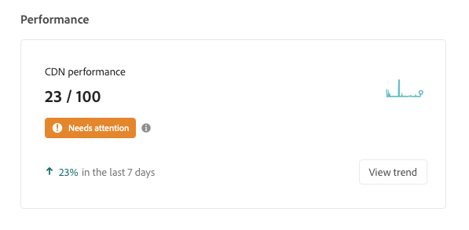
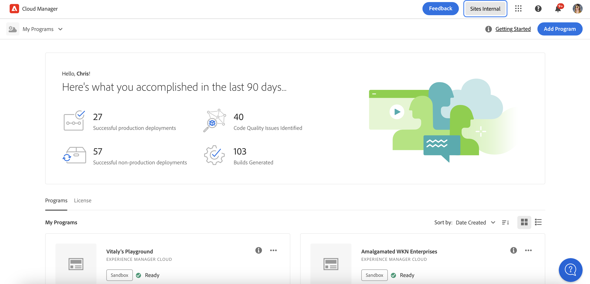
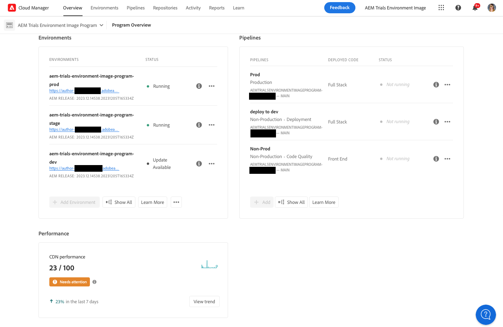

# Panel de rendimiento de CDN {#cdn-performance}

Comprenda cómo Cloud Manager evalúa el rendimiento de la red de entrega de contenido (CDN) y lo que puede aprender del tablero.

## Información general {#overview}

Cada programa de Cloud Manager tiene un panel de rendimiento de CDN. Este panel presenta una puntuación general para el rendimiento de la CDN junto con tendencias, alertas y sugerencias para la mejora, según sea necesario.



## Acceso al tablero {#accessing}

El panel CDN está disponible en la página de información general de cada programa.

{{sign-in-to-cloud-manager}}

1. En la consola **[Mis programas](/help/implementing/cloud-manager/navigation.md#my-programs)**, haga clic en el programa cuyo panel de CDN desee ver.

   

1. Para ver la tarjeta **Rendimiento**, desplácese hacia abajo por debajo de las tarjetas **Entornos** y **Canalizaciones** en la página **Información general del programa** de su programa.

   

## Uso del tablero {#using}

El panel presenta una puntuación general para el rendimiento de la CDN junto con tendencias, alertas y sugerencias para la mejora, según sea necesario.


Para obtener detalles sobre el rendimiento de su CDN y sugerencias sobre cómo mejorarlo, haga clic en **Ver tendencia**.


Haga clic en **Ver** debajo del gráfico para cambiar el lapso de tiempo del gráfico.

Para obtener sugerencias sobre cómo mejorar el rendimiento de su CDN, seleccione la pestaña **Recommendations**.


Haga clic en comillas angulares junto a cualquier recomendación de la lista para ver detalles sobre los pasos de mejora necesarios y la causa del problema.

## Definición de visita en caché {#cache-hit}

La proporción de visitas de caché mide cuántas solicitudes de contenido puede rellenar correctamente una caché en comparación con el número de solicitudes que recibe. Una mayor proporción de visitas de caché indica un mejor rendimiento de CDN.

>[!TIP]
>
>Adobe recomienda que los usuarios busquen una proporción de visitas de caché del 99 %.

```text
Cache Hit Ratio = Cache Hits / (Hits + Misses + Passes + Other)
```

* **Visita**: se han solicitado datos de la caché y se han encontrado.
* **Faltante**: se han solicitado datos de la caché y no se han encontrado.
* **Paso**: los datos se solicitan desde la caché y se establece para no almacenarlos en caché.
* **Otro**: todas las solicitudes de datos de la caché que no coinciden con ningún otro caso.

Las métricas de caché se actualizan cada 24 horas.

>[!TIP]
>
>Para obtener más información sobre cómo Cloud Manager y la red de distribución de contenido (CDN) interactúan con Dispatcher, consulte [Almacenamiento en caché en AEM as a Cloud Service](/help/implementing/dispatcher/caching.md).
