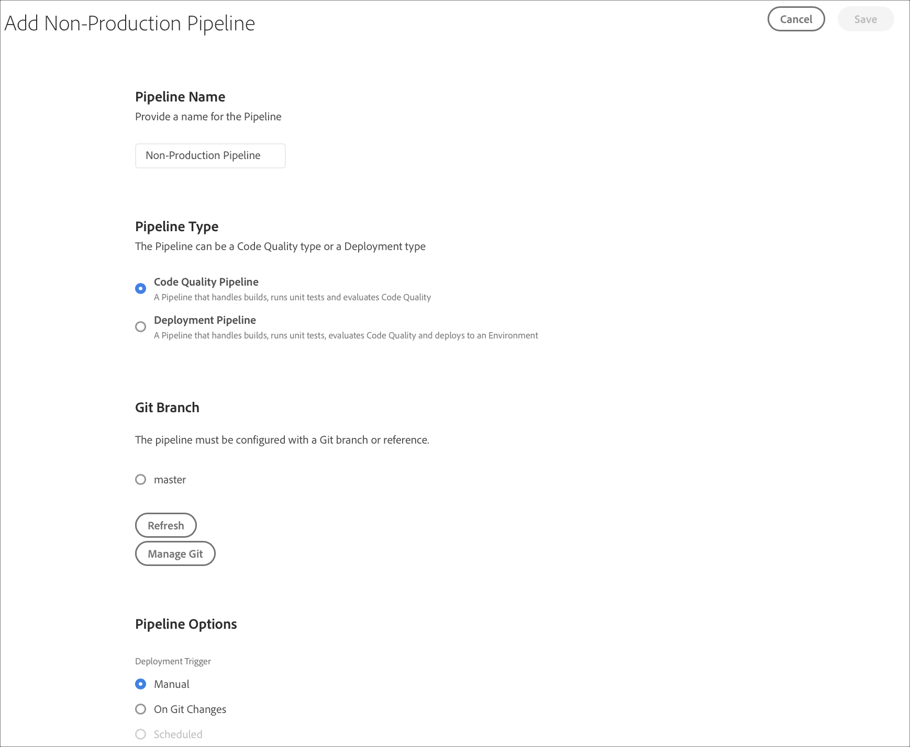

# Configuración de la canalización CI-CD {#configure-ci-cd-pipeline}

## Explicación del flujo {#understanding-the-flow}

Puede configurar la canalización desde el mosaico Configuración **de** canalización en la interfaz de usuario del Administrador [!UICONTROL de] nube.

El Administrador de implementación es responsable de configurar la canalización. Al hacerlo, primero se selecciona una rama del **repositorio** Git.

Para configurar la canalización, el usuario debe:

* defina el activador que iniciará la canalización.
* defina los parámetros que controlan la implementación de producción.
* configure los parámetros de prueba de rendimiento.

## Configuración de la canalización {#setting-up-the-pipeline}

>[!CAUTION]
>
>La canalización no se puede configurar hasta que se complete la creación de un programa y el repositorio Git tenga al menos una rama.

Antes de comenzar a implementar el código, debe configurar la configuración de la canalización desde el Administrador de [!UICONTROL nube].

>[!NOTE]
>
>Puede cambiar la configuración de la canalización después de la configuración inicial.

## Configuración de la canalización desde [!UICONTROL Cloud Manager]{#configuring-the-pipeline-settings-from-cloud-manager}

Una vez que haya configurado el programa y tenga al menos un entorno usando la interfaz de usuario de [!UICONTROL Cloud Manager] , estará listo para configurar la canalización de implementación.

Siga estos pasos para configurar el comportamiento y las preferencias de la canalización:

1. Haga clic en **Configurar tubería** para configurar y configurar la canalización.

   

1. Aparece la pantalla **Configurar tubería** . Select the branch and click **Next**.

   

1. Configure las opciones de implementación.

   

   Puede definir el activador para iniciar la canalización:

   * **Manual** : si se utiliza la interfaz de usuario, se iniciará la canalización manualmente.
   * **Al cambiar** Git: inicia la canalización CI/CD cada vez que se añaden confirmaciones a la ramificación git configurada. Aunque seleccione esta opción, siempre puede iniciar la canalización manualmente.
   Durante la configuración o edición de la canalización, el Administrador de implementación tiene la opción de definir el comportamiento de la canalización cuando se produce un error importante en cualquiera de las puertas de calidad.

   Esto resulta útil para los clientes que desean procesos más automatizados. Las opciones disponibles son:

   * **Preguntar cada vez** : Esta es la configuración predeterminada y requiere una intervención manual en caso de error importante.
   * **Error inmediato** : si se selecciona, la canalización se cancelará siempre que se produzca un error importante. Esto es, esencialmente, emular a un usuario rechazando manualmente cada error.
   * **Continuar inmediatamente** : si se selecciona, la canalización se realizará automáticamente cada vez que se produzca un error importante. Esto es, esencialmente, emular a un usuario aprobando manualmente cada error.

1. Haga clic en **Siguiente** para acceder a la ficha **Prueba** y definir los criterios de prueba del programa.

   

1. Haga clic en **Guardar.** La página *Información general* ahora muestra la tarjeta **Implementar el programa** . Haga clic en el botón **Implementar** para implementar el programa.

   

## Tuberías de calidad de código y de no producción

Además de la tubería principal que se despliega en el escenario y la producción, los clientes pueden establecer oleoductos adicionales, denominados **oleoductos** no productivos. Estas tuberías siempre ejecutan los pasos de generación y calidad del código. Opcionalmente, también pueden implementarse en el entorno de servicios gestionados de Adobe.

En la pantalla de inicio, estos oleoductos se muestran en una tarjeta nueva:

1. Acceda al mosaico de **las tuberías** que no son de producción desde la pantalla de inicio del Administrador de nube.

   

1. Haga clic en el botón **Agregar** para especificar el nombre de la canalización, el tipo de canalización y la rama Git.

   Además, también puede configurar Activador de implementación y Comportamiento de error importante desde Opciones de tubería.

   

1. Haga clic en **Guardar** y la canalización se mostrará en la tarjeta en la pantalla de inicio con tres acciones, como se muestra a continuación:

   

   * **Editar** : permite editar la configuración de la canalización
   * **Generar** : se desplaza a la página de ejecución, desde donde se puede ejecutar la canalización
   * **Administrar Git** : permite al usuario obtener la información necesaria para acceder al repositorio Git de Cloud Manager

## Pasos siguientes {#the-next-steps}

Una vez configurada la canalización, debe implementar el código.

Consulte [Implementación de código](deploy-code.md) para obtener más información.
