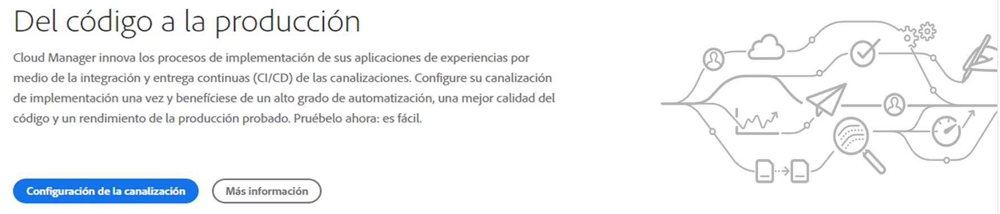
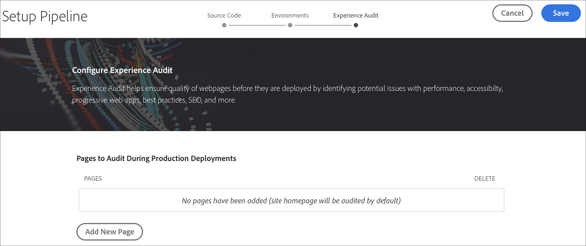
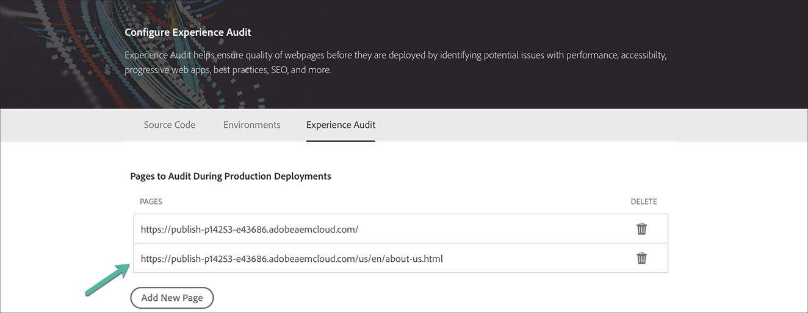
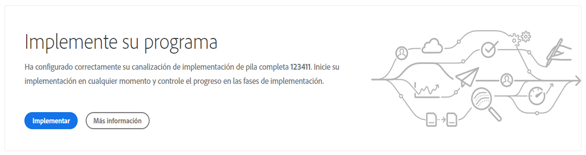
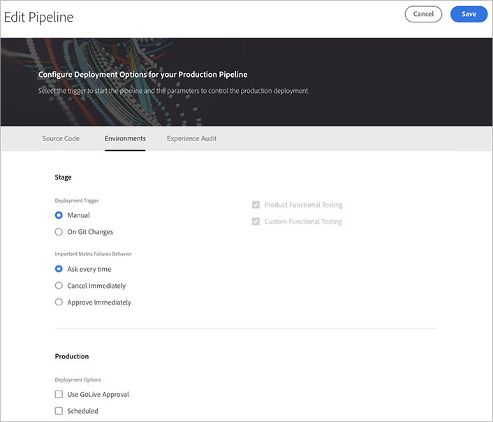
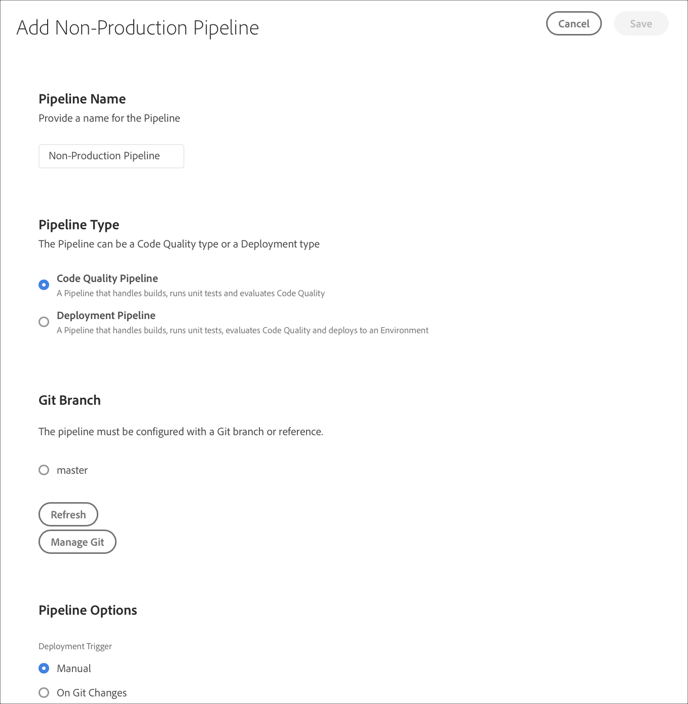
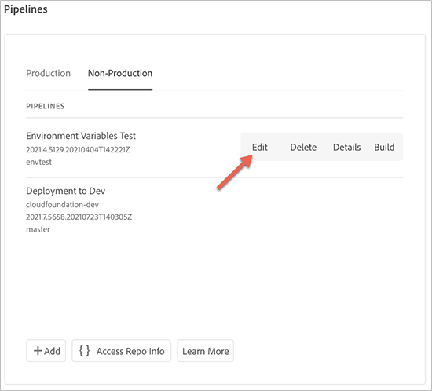

# Configuración de la canalización de CI/CD {#configure-ci-cd-pipeline}

En Cloud Manager, hay dos tipos de Canalización:

* **Canalización** de producción:

   Una canalización de producción solo se puede añadir una vez que se crea un conjunto de entornos de producción y de fase.

   Consulte [Configuración de la canalización de producción](configure-pipeline.md#setting-up-the-pipeline) para obtener más información.

* **Canalización que no es de producción**:

   Se puede añadir una canalización que no sea de producción desde la página **Overview** de la interfaz de usuario de Cloud Manager.

   Para obtener más información, consulte [Tutoriales de solo calidad de código y no producción](configure-pipeline.md#non-production-pipelines) .

>[!NOTE]
>Para configurar la canalización, debe:
> * defina el déclencheur que iniciará la canalización.
> * defina los parámetros que controlan la implementación de producción.
> * configure los parámetros de prueba de rendimiento.

## Configuración de canalización de producción {#setting-up-production-pipeline}

El administrador de implementación es responsable de configurar la canalización de producción.

>[!NOTE]
>No se puede configurar una canalización de producción hasta que no se haya completado la creación de un programa, el repositorio de Git tenga al menos una rama y se haya creado un conjunto de entornos de producción y ensayo.

Antes de comenzar a implementar el código, debe configurar la configuración de la canalización desde [!UICONTROL Cloud Manager].

>[!NOTE]
>
>Puede cambiar la configuración de la canalización después de la configuración inicial.

## Configuración de la canalización desde [!UICONTROL Cloud Manager] {#configuring-the-pipeline-settings-from-cloud-manager}

Una vez que haya configurado el programa y tenga al menos un entorno utilizando la interfaz de usuario de [!UICONTROL Cloud Manager], estará listo para configurar la canalización de implementación.

Siga estos pasos para configurar el comportamiento y las preferencias de la canalización:

1. Haga clic en **Configuración de canalización** para configurar la canalización.

   

1. Aparece la pantalla **Configuración de canalización**. Seleccione la rama y haga clic en **Next**.

   

1. Configure las opciones de implementación.

   

   Puede definir el déclencheur para iniciar la canalización:

   * **Manual** : al utilizar la IU, se inicia manualmente la canalización.
   * **Cambios en Git** : inicia la canalización CI/CD cada vez que se agregan confirmaciones a la rama git configurada. Incluso si selecciona esta opción, siempre puede iniciar la canalización manualmente.

   Durante la configuración o edición de la canalización, el administrador de implementación tiene la opción de definir el comportamiento de la canalización cuando se encuentra un error importante en cualquiera de las puertas de calidad.

   Esto resulta útil para los clientes que desean procesos más automatizados. Las opciones disponibles son:

   * **Pregunte cada vez** : esta es la configuración predeterminada y requiere una intervención manual en cualquier error importante.
   * **Cancelar inmediatamente** : si se selecciona, la canalización se cancelará siempre que se produzca un error importante. Básicamente, esto emula a un usuario rechazando manualmente cada error.
   * **Aprobar inmediatamente** : Si se selecciona, la canalización se realizará automáticamente cada vez que se produzca un error importante. Básicamente, esto está emulando a un usuario que aprueba manualmente cada error.

1. La configuración de la canalización de producción incluye una tercera pestaña etiquetada como **Experience Audit**. Esta opción proporciona una tabla para las rutas URL que siempre deben incluirse en la auditoría de experiencias.

   >[!NOTE]
   >Debe hacer clic en **Agregar nueva página** para definir su propio vínculo personalizado.

   

   Haga clic en **Agregar nueva página** para proporcionar una ruta URL que se incluirá en la auditoría de experiencias.

   Por ejemplo, si desea incluir `https://wknd.site/us/en/about-us.html` en la auditoría de experiencias, introduzca la ruta `us/en/about-us.html` en este campo y haga clic en **Guardar**.

   

   La dirección URL que aparece en la tabla es:

   `https://publish-p14253-e43686.adobeaemcloud.com/us/en/about-us.html`

   

   Se puede incluir un máximo de 25 filas. Si el usuario no envía páginas en esta sección, la página principal del sitio se incluirá en la auditoría de experiencias de forma predeterminada.

   Consulte [Explicación de los resultados de auditoría de experiencias](/help/implementing/cloud-manager/experience-audit-testing.md) para obtener más información.

   >[!NOTE]
   > Las páginas configuradas se enviarán al servicio y se evaluarán según las pruebas de rendimiento, accesibilidad, SEO (Optimización del motor de búsqueda), prácticas recomendadas y PWA (Aplicación web progresiva).

1. Haga clic en **Guardar** en la pantalla **Editar canalización**. La página **Información general** ahora muestra la tarjeta **Implementar el programa**. Haga clic en el botón **Deploy** para implementar el programa.

   

### Edición de una canalización de producción {#editing-prod-pipeline}

Puede editar las configuraciones de canalización desde la página **Información general del programa**.

Siga los pasos a continuación para editar la canalización configurada:

1. Vaya a la tarjeta **Canalizaciones** desde la página **Información general del programa**.

1. Haga clic en **Editar** en la tarjeta **Canalizaciones**.

   

1. La pestaña **Source Code** permite actualizar el repositorio. Haga clic en **Access Repo Info** para actualizar el repositorio.

   >[!NOTE]
   >Consulte [Adición y administración de repositorios](/help/implementing/cloud-manager/managing-code/cloud-manager-repositories.md) para obtener información sobre cómo agregar y administrar repositorios en Cloud Manager.

   

1. La pestaña **Environments** permite actualizar las opciones de fase y producción.

   

1. La opción **Auditoría de experiencias** permite actualizar o agregar nuevas páginas.

   

1. Haga clic en **Save** una vez que haya terminado de editar la canalización.

## Canalizaciones de calidad de código y no producción {#non-production-pipelines}

Además de la canalización principal que se implementa en las fases y la producción, los clientes pueden configurar canalizaciones adicionales, denominadas **Canalizaciones que no son de producción**. Estas canalizaciones siempre ejecutan los pasos de compilación y calidad del código. Opcionalmente, también pueden implementarse en AEM como entorno de Cloud Service.

En la pantalla de inicio, estas canalizaciones se enumeran en una tarjeta nueva:

1. Acceda al mosaico **Canalizaciones que no son de producción** desde la pantalla de inicio de Cloud Manager.

   

1. Haga clic en el botón **Add** para especificar el nombre de la canalización, el tipo de canalización y la rama de Git.

   Además, también puede configurar el Déclencheur de implementación y el Comportamiento de error importante desde Opciones de canalización.

   

1. Haga clic en **Guardar** y la canalización se mostrará en la tarjeta de la pantalla principal con cinco acciones, como se muestra a continuación:

   

   * **Editar** : permite editar la configuración de la canalización
   * **Detalles** : proporciona detalles de la ejecución de la canalización.
   * **Generar** : navega a la página de ejecución desde la que se puede ejecutar la canalización
   * **Acceso a información de repositorios** : permite al usuario obtener la información necesaria para acceder al repositorio de Git de Cloud Manager.
   * **Más información** : navega para comprender el recurso de documentación de canalización de CI/CD.

### Edición de una canalización que no es de producción {#editing-nonprod-pipeline}

Puede editar las configuraciones de canalización desde la página **Información general del programa**.

Siga los pasos a continuación para editar la canalización configurada que no sea de producción:

1. Vaya a la tarjeta **Canalizaciones** desde la página **Información general del programa**.

1. Seleccione la pestaña **Non-Production** y haga clic en **Edit** después de seleccionar las canalizaciones deseadas.

   

1. Seleccione el repositorio deseado y otras actualizaciones necesarias y haga clic en **Guardar**.

   

## Pasos siguientes {#the-next-steps}

Una vez configurada la canalización, debe implementar el código.

Consulte [Implementar el código](deploy-code.md) para obtener más información.
