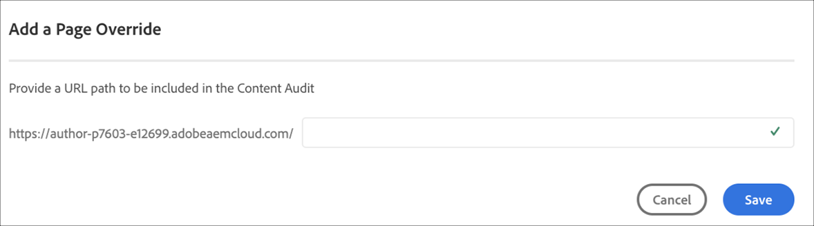

# Configuración de la canalización de CI/CD {#configure-ci-cd-pipeline}

En Cloud Manager, hay dos tipos de Canalización:

* **Canalizaciones**de producción:
Una canalización de producción solo se puede agregar una vez que se ha creado un entorno de producción y de fase. Consulte [Configuración de la sección Canalización](configure-pipeline.md#setting-up-the-pipeline) para obtener más detalles.

* **Tuberías** no productivas:

   Se puede añadir una canalización que no sea de producción desde la página **Información general** de la interfaz de usuario del Administrador de nube. Para obtener más información, consulte [No producción y sólo tuberías](configure-pipeline.md#non-production-pipelines) de calidad de código.

## Explicación del flujo {#understanding-the-flow}

Puede configurar la canalización desde el mosaico **Configuración de canalización** en la interfaz de usuario de [!UICONTROL Cloud Manager].

El Administrador de implementación es responsable de configurar la canalización. Al hacerlo, primero se selecciona una rama del **repositorio** Git.

Para configurar la canalización, el usuario debe:

* defina el activador que hará inicio a la canalización.
* defina los parámetros que controlan la implementación de producción.
* configure los parámetros de prueba de rendimiento.

## Configuración de la canalización {#setting-up-the-pipeline}

>[!CAUTION]
>
>La canalización no se puede configurar hasta que se complete la creación de un programa y el repositorio Git tenga al menos una rama.

Para poder implementar el código con inicio, debe configurar la configuración de la canalización desde [!UICONTROL Cloud Manager].

>[!NOTE]
>
>Puede cambiar la configuración de la canalización después de la configuración inicial.

## Configuración de la canalización desde [!UICONTROL Cloud Manager] {#configuring-the-pipeline-settings-from-cloud-manager}

Una vez que haya configurado el programa y tenga al menos un entorno usando la interfaz de usuario de [!UICONTROL Cloud Manager] , estará listo para configurar la canalización de implementación.

Siga estos pasos para configurar el comportamiento y las preferencias de la canalización:

1. Haga clic en **Configurar tubería** para configurar y configurar la canalización.

   

1. Aparece la pantalla **Configurar tubería** . Select the branch and click **Next**.

   

1. Configure las opciones de implementación.

   

   Puede definir el activador para el inicio de la canalización:

   * **Manual** : el uso de la interfaz de usuario inicio manualmente la canalización.
   * **Al cambiar** Git: inicio la canalización CI/CD cada vez que se añaden confirmaciones a la rama git configurada. Incluso si selecciona esta opción, siempre puede realizar el inicio de la canalización manualmente.

   Durante la configuración o edición de la canalización, el Administrador de implementación tiene la opción de definir el comportamiento de la canalización cuando se produce un error importante en cualquiera de las puertas de calidad.

   Esto resulta útil para los clientes que desean procesos más automatizados. Las opciones disponibles son:

   * **Preguntar cada vez** : Esta es la configuración predeterminada y requiere una intervención manual en caso de error importante.
   * **Error inmediato** : si se selecciona, la canalización se cancelará siempre que se produzca un error importante. Esto es, esencialmente, emular a un usuario rechazando manualmente cada error.
   * **Continuar inmediatamente** : si se selecciona, la canalización se realizará automáticamente cada vez que se produzca un error importante. Esto es, esencialmente, emular a un usuario aprobando manualmente cada error.

1. La configuración de la canalización de producción incluye una tercera ficha etiquetada como Auditoría **del contenido**.

   Esta opción proporciona una tabla para las rutas de URL que siempre deben incluirse en la auditoría de contenido. El usuario puede introducir manualmente una ruta URL para incluirla. Se puede incluir un máximo de 25 filas. Si el usuario no envía páginas en esta sección, la página principal del sitio se incluirá en la auditoría de contenido como opción predeterminada.

   >[!NOTE]
   > Las páginas configuradas se enviarán al servicio y se evaluarán según las pruebas de rendimiento, accesibilidad, SEO (Optimización de motores de búsqueda), prácticas recomendadas y PWA (Aplicación web progresiva).

   Consulte [Explicación de los resultados](/help/implementing/developing/introduction/understand-test-results.md#content-audit-testing) de auditoría de contenido para obtener más detalles.

   

   Haga clic en **Añadir nueva anulación** de página para proporcionar una ruta de URL que se incluirá en la auditoría de contenido. Una vez agregada la ruta, haga clic en **Guardar**.

   

1. Haga clic en **Guardar** en la pantalla **Editar tubería** . La página **Información general** ahora muestra la tarjeta **Implementar Programa** . Haga clic en el botón **Implementar** para implementar el programa.

   

## Tuberías de calidad de código y de no producción {#non-production-pipelines}

Además de la tubería principal que se despliega en el escenario y la producción, los clientes pueden establecer oleoductos adicionales, denominados **oleoductos** no productivos. Estas tuberías siempre ejecutan los pasos de generación y calidad del código. Opcionalmente, también pueden implementarse en Adobe Managed Services entorno.

En la pantalla de inicio, estos oleoductos se muestran en una tarjeta nueva:

1. Acceda al mosaico de **las tuberías** que no son de producción desde la pantalla de inicio del Administrador de nube.

   

1. Haga clic en el botón **Añadir** para especificar el nombre de la canalización, el tipo de canalización y la rama de Git.

   Además, también puede configurar Activador de implementación y Comportamiento de error importante desde Opciones de tubería.

   

1. Haga clic en **Guardar** y la canalización se mostrará en la tarjeta en la pantalla de inicio con tres acciones, como se muestra a continuación:

   

   * **Editar** : permite editar la configuración de la canalización
   * **Generar** : se desplaza a la página de ejecución, desde donde se puede ejecutar la canalización
   * **Administrar Git** : permite al usuario obtener la información necesaria para acceder al repositorio Git de Cloud Manager

## Pasos siguientes {#the-next-steps}

Una vez configurada la canalización, debe implementar el código.

Consulte [Implementación de código](deploy-code.md) para obtener más información.
