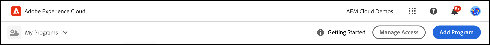
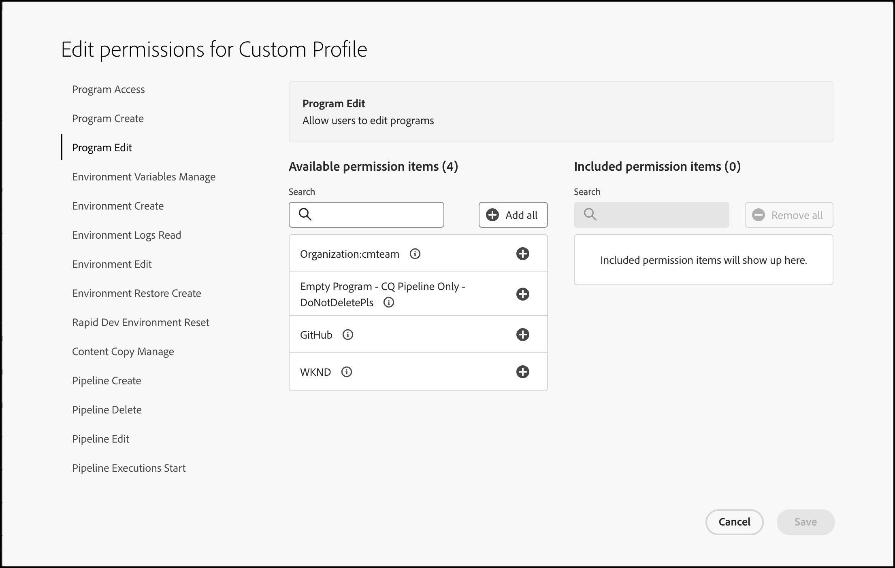

# Permisos personalizados {#custom-permissions}

Descubra cómo configurar perfiles de permisos personalizados en Cloud Manager. Puede configurar controles de acceso específicos para programas, canalizaciones y entornos, lo que le proporciona un control granular sobre lo que cada usuario puede hacer.

## Introducción {#introduction}

Cloud Manager tiene un conjunto de funciones predefinidas que regulan el acceso a las diversas funciones de Cloud Manager:

* Propietario del negocio
* Administrador de programa
* Administrador de implementación
* Desarrollador

Los permisos personalizados permiten a los usuarios crear perfiles de permisos personalizados con permisos configurables para restringir el acceso de los usuarios de Cloud Manager a programas, canalizaciones y entornos.

>[!TIP]
>Para obtener más información sobre las funciones predefinidas, consulte [Perfiles de equipo y producto de AEM as a Cloud Service](/help/onboarding/aem-cs-team-product-profiles.md).

## Utilizar los permisos personalizados {#using}

La creación y el uso de sus propios permisos personalizados requieren los tres pasos siguientes:

1. [Crear un perfil de producto](#create).
1. [Asignar permisos personalizados al perfil del producto](#assign-permissions).
1. [Asignar usuarios al perfil del producto](#assign-users).

>[!TIP]
>Revise las secciones [Términos](#terms) y [Permisos configurables](#configurable-permissions) a medida que crea sus propios permisos personalizados.

>[!IMPORTANT]
>Para crear perfiles de producto y administrar permisos para Cloud Manager, debe tener derechos de administrador de productos en Admin Console para Adobe Experience Manager as a Cloud Service.

### Creación de un perfil de producto {#create}

{{sign-in-to-cloud-manager}}

1. En la página de aterrizaje de Cloud Manager, haga clic en **Administrar acceso**.

   

1. En Admin Console, haga clic en **Nuevo perfil**.

   

1. Proporcione los detalles generales sobre el perfil.

   * **Nombre del perfil del producto**: un nombre descriptivo para el perfil
   * **Nombre para mostrar** - Un nombre abreviado que se muestra en la interfaz de usuario (opciones)
   * **Descripción**: una descripción informativa del perfil en la que se explique su finalidad (opcional)
   * **Notificar a los usuarios por correo electrónico**: los usuarios reciben una notificación por correo electrónico cuando se les agrega o elimina de este perfil.

1. Haga clic en **Guardar**.

El nuevo perfil de producto se guarda y es visible en la lista de perfiles de producto de Admin Console.

### Asignación de permisos personalizados al perfil del producto {#assign-permissions}

1. En Admin Console, haga clic en el nombre del [nuevo perfil de producto que creó](#create).

1. En la página **Perfil personalizado**, haga clic en la ficha **Permisos**.

   

1. En la fila de un nombre de permiso, haga clic en **Editar**.

1. En el cuadro de diálogo **Editar permisos para el perfil personalizado**, realice una de las siguientes acciones:

   * Cerca de la parte superior de la columna **Elementos de permisos disponibles**, haga clic en  **Agregar todo** para incluir todos los permisos.
   * Para agregar un solo permiso a la columna **Elementos de permiso incluidos**, haga clic en su  asociado.

     

1. Haga clic en **Guardar**.

### Asignación de usuarios al perfil de producto {#assign-users}

1. En Admin Console, haga clic en el nombre del [nuevo perfil de producto al que asignó permisos personalizados](#assign-permissions).

1. En la ventana que se abre, haga clic en la ficha **Usuarios**.

1. Haga clic en **Agregar usuarios** y asigne usuarios al perfil del producto con permisos personalizados.

En [Administrar perfiles de producto para usuarios empresariales](https://helpx.adobe.com/es/enterprise/using/support-for-experience-cloud.html?lang=es), consulte **Agregar usuarios y grupos de usuarios a un perfil de producto** para obtener más información sobre cómo usar Admin Console.

## Permisos configurables {#configurable-permissions}

Los siguientes permisos están disponibles cuando crea un perfil de producto personalizado.

| Permiso | Descripción |
| --- | --- |
| `Program Create` | Permitir que los usuarios creen un programa. |
| `Program Access` | Permitir que los usuarios accedan a programas. |
| `Program Edit` | Permitir que los usuarios editen programas. |
| `Environment Create` | Permitir que los usuarios creen un entorno. |
| `Environment Edit` | Permite que los usuarios actualicen y editen entornos. |
| `Environment Logs Read` | Permitir que los usuarios lean los registros de entorno. |
| `Environment Variables Manage` | Permite que los usuarios creen, editen o eliminen configuraciones de entorno. |
| `Environment Restore Create` | Permitir que los usuarios creen un entorno para restaurar. |
| `Rapid Development Environment Reset` | Permitir que los usuarios restablezcan el entorno de desarrollo rápido (RDE). |
| `Content Copy Manage` | Permita que los usuarios administren las operaciones de copia de contenido. |
| `Pipeline Create` | Permitir que los usuarios creen canalizaciones. |
| `Pipeline Delete` | Permitir que los usuarios eliminen canalizaciones. |
| `Pipeline Edit` | Permite que los usuarios editen canalizaciones. |
| `Production Deployments Approve/Reject` | Permita que los usuarios aprueben o rechacen un paso de implementación de producción. |
| `Pipeline Executions Cancel` | Permite que los usuarios cancelen las ejecuciones de canalización. |
| `Pipeline Executions Start` | Permite a los usuarios iniciar una nueva canalización de ejecución. |
| `Override/Reject Important Metric Failures` | Permitir que los usuarios anulen o rechacen errores de métricas importantes. |
| `Production Deployments Schedule` | Permita que los usuarios programen un paso de implementación de producción. |
| `Repository Info Access` | Permite que los usuarios accedan a la información del repositorio y generen una contraseña de acceso. |
| `Repository Create` | Permita que los usuarios creen repositorios Git. |
| `Repository Delete` | Permitir que los usuarios eliminen repositorios Git. |
| `Repository Edit` | Permite que los usuarios editen repositorios Git. |
| `Repository Code Generate` | Permitir que los usuarios generen un proyecto a partir de un tipo de archivo. |
| `Domain Name Manage` | Permite que los usuarios creen, editen o eliminen nombres de dominio. |
| `IP Allowlist Manage` | Permite a los usuarios crear, editar o eliminar listas de permitidos y enlaces de listas de permitidos IP. |
| `Network Infrastructure Manage` | Permitir que los usuarios creen, eliminen, editen o prueben la infraestructura de red. |
| `SSL Certificate Manage` | Permite que los usuarios creen, editen o eliminen certificados SSL. |
| `New Relic Sub Account User Manage` | Permitir que los usuarios lean o editen usuarios de subcuentas de New Relic. |

### Permisos de nivel de organización {#organization-level}

Los permisos de nivel de organización hacen referencia a permisos que siempre se conceden a todos los programas de una organización.

Los siguientes permisos son permisos de nivel de organización:

* **`Program Create`**: este permiso permite a los usuarios crear un programa en la organización.
* **Acceso a información de repositorio**: este permiso de nivel de inquilino/organización permite a los usuarios generar un nombre de usuario, una contraseña y una URL de repositorio para acceder a un proyecto de cliente y contribuir a él.
   * El nombre de usuario y la contraseña para acceder al repositorio son comunes en todos los repositorios de la organización. Sin embargo, la dirección URL del repositorio es única para cada programa.
   * Consulte [Acceder a repositorios](/help/implementing/cloud-manager/managing-code/accessing-repos.md) para obtener más información.

## Términos {#terms}

Los siguientes términos se utilizan para crear y administrar permisos personalizados y funciones predefinidas.

| Término | Descripción |
| --- | --- |
| Permisos predefinidos | Funciones predefinidas como **Propietario empresarial** y **Administrador de implementación** para regular varias funciones de Cloud Manager. Para obtener más información sobre las funciones predefinidas, consulte [Perfiles de equipo y producto de AEM as a Cloud Service](/help/onboarding/aem-cs-team-product-profiles.md). |
| Permisos personalizados | Las funciones de Cloud Manager permiten a los usuarios crear perfiles de permisos para definir funciones que rigen las funciones admitidas en Cloud Manager. |
| Perfil del producto | Se crea en Admin Console para administrar los permisos configurables que se aplican a los usuarios que forman parte del perfil de permisos. |
| Permiso configurable | Permisos de Cloud Manager que puede configurar en el perfil de permisos. |
| Elemento de permiso | Un programa, entorno o recurso de canalización en el que se puede aplicar un permiso. |

Los elementos de permisos hacen referencia al ámbito en el que se aplicará el permiso. Normalmente, será uno de los siguientes:

| Tipo de elemento de permiso | Ejemplos | Descripción |
| --- | --- | --- |
| Organización | organización:companyA | Todos los recursos aplicables de una organización. Un recurso puede ser un programa, un entorno o una canalización. Si el usuario añade una organización para cualquier permiso, todos los recursos nuevos de esa organización también tendrán ese permiso. |
| Programa | Programa A | Todos los recursos aplicables de un programa. |
| Entorno | Programa A: entorno | Aplicable a un entorno específico. |
| Canalización | Programa A: canalización | Aplicable a una canalización específica. |

## Notas de uso {#usage-notes}

* Un perfil de permisos personalizado también enumera programas, entornos y canalizaciones de AMS al configurar los permisos.
* Los recursos como programas, entornos y canalizaciones creados en Cloud Manager tardan varios minutos en mostrarse en Admin Console para la configuración de permisos.
* En los casos en los que un servicio de permisos personalizados no responde, los perfiles predefinidos siguen estando disponibles y los usuarios de perfiles predefinidos siguen teniendo el acceso adecuado.

## Preguntas frecuentes {#faq}

### ¿Qué perfiles de permiso están predefinidos?

* Propietario del negocio
* Administrador de programa
* Administrador de implementación
* Desarrollador

Para obtener más información sobre las funciones predefinidas, consulte [Perfiles de equipo y producto de AEM as a Cloud Service](/help/onboarding/aem-cs-team-product-profiles.md).

### ¿Qué les sucede a los perfiles de permisos predefinidos con la introducción de perfiles personalizados?

Los perfiles de producto predeterminados y las funciones de Cloud Manager siguen funcionando como antes.

### ¿Puedo editar perfiles de permisos predefinidos?

No. Los perfiles predeterminados no se pueden editar. No puede agregar ni quitar permisos del perfil de permisos predeterminado. Solo puede añadir o quitar usuarios de perfiles predefinidos.

### ¿Debería eliminar los perfiles de permiso predefinidos, ya que los perfiles personalizados ya están disponibles?

No elimine perfiles de permiso predefinidos de Admin Console.

### ¿Puedo añadir usuarios a varios perfiles de permisos?

Sí. Se puede asignar a un usuario varios perfiles, incluidos perfiles de permiso predefinidos y personalizados. Cuando se asigna a un usuario a varios perfiles, los permisos combinados de todos los perfiles de permiso asignados están disponibles para ese usuario.

### ¿Qué sucede si un usuario tiene permiso para editar un entorno o canalización pero no tiene acceso a un programa que contenga el entorno o canalización?

El usuario no puede acceder al entorno o la canalización si no tiene los permisos de **Acceso al programa** que contienen el entorno o la canalización.

