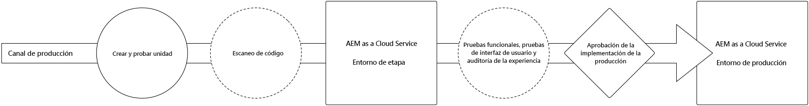
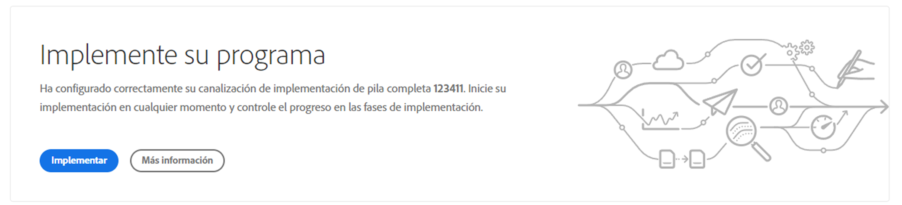
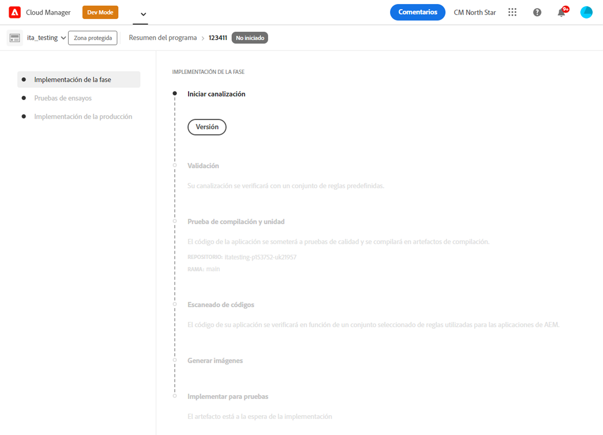
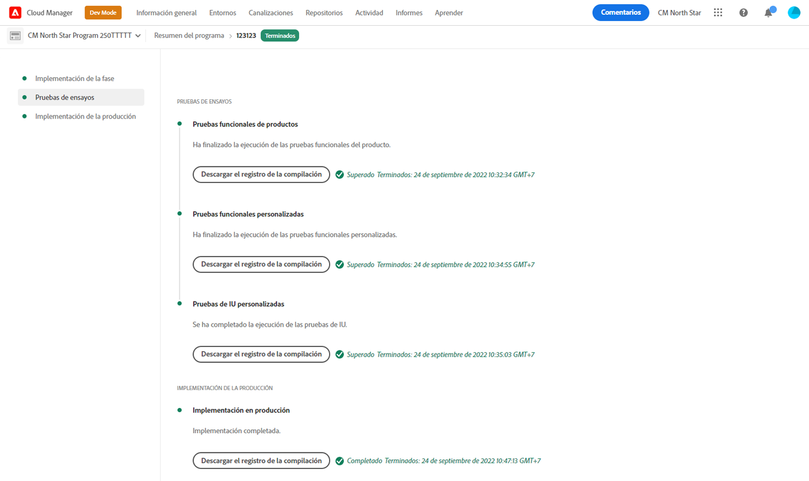
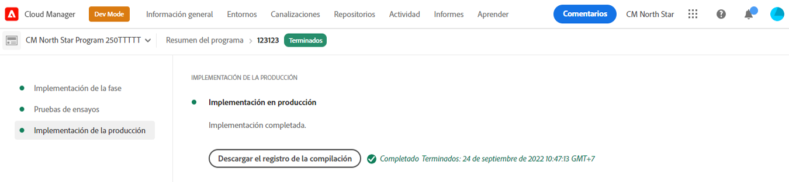

# Implemente su código {#deploy-your-code}

Obtenga información sobre cómo implementar su código en Producción mediante canalizaciones de Cloud Manager en AEM as a Cloud Service.



La implementación del código en Fase y hasta Producción se realiza mediante una canalización de producción. La ejecución de la canalización de producción se divide en las dos fases lógicas siguientes:

1. **Implementación en el entorno de ensayo**: el código se crea e implementa en el entorno de ensayo para pruebas funcionales automatizadas, pruebas de interfaz de usuario, auditoría de experiencias y pruebas de aceptación de usuarios (UAT).
1. **Implementación en el entorno de producción**: una vez validada la compilación en Fase y aprobada para su promoción en Producción, el mismo artefacto de compilación se implementa en el entorno de producción.

_Solo el tipo de canalización de código de pila completa admite la digitalización de código, las pruebas de funciones, las pruebas de interfaz de usuario y la auditoría de experiencias._

## Proceso de implementación {#deployment-process}

Todas las implementaciones de Cloud Service siguen un proceso gradual para garantizar que no haya tiempo de espera. Consulte [Cómo funcionan las implementaciones dinámicas](/help/implementing/deploying/overview.md#how-rolling-deployments-work) para obtener más información.

>[!NOTE]
>
>La caché de Dispatcher se borra en cada implementación. Posteriormente, se &quot;calienta&quot; antes de que los nuevos nodos de publicación acepten el tráfico.

## Implemente su código con Cloud Manager en AEM as a Cloud Service {#deploying-code-with-cloud-manager}

[Una vez configurada la canalización de producción](/help/implementing/cloud-manager/configuring-pipelines/configuring-production-pipelines.md) incluido repositorio, entorno y entorno de pruebas, estará listo para implementar el código.

1. Inicie sesión en Cloud Manager en [my.cloudmanager.adobe.com](https://my.cloudmanager.adobe.com/) y seleccione la organización adecuada.

1. En la consola **[Mis programas](/help/implementing/cloud-manager/navigation.md#my-programs)**, haga clic en el programa para el que desea implementar el código.

1. En la página **Información general**, en el área de call-to-action, haga clic en **Implementar**.

   

1. En la página **Implementar en producción**, haga clic en **Generar**.

   

El proceso de generación implementa el código en las tres fases ordenadas siguientes:

1. [Fase de implementación](#stage-deployment)
1. [Fase de prueba](#stage-testing)
1. [Fase de implementación de producción](#production-deployment)

>[!TIP]
>
>Puede revisar los pasos de varios procesos de implementación consultando los registros o los resultados de los criterios de prueba.

### Fase de implementación {#stage-deployment}

La fase **Implementación de fase** incluye los siguientes pasos:

| Paso de implementación de fase | Descripción |
| --- | --- |
| Validación | Garantiza que la canalización esté configurada para utilizar los recursos disponibles actualmente. por ejemplo, probar que la rama configurada existe y que los entornos están disponibles. |
| Pruebas de compilación y pruebas de unidad | Ejecuta un proceso de generación en contenedores.<br>Consulte [Detalles del entorno de compilación](/help/implementing/cloud-manager/getting-access-to-aem-in-cloud/build-environment-details.md) para obtener detalles sobre el entorno de compilación. |
| Escaneado de códigos | Evalúa la calidad del código de la aplicación.<br>Consulte [Prueba de calidad del código](/help/implementing/cloud-manager/code-quality-testing.md) para obtener detalles sobre el proceso de prueba. |
| Generar imágenes | Este proceso convierte el contenido y los paquetes de Dispatcher del paso Generar en imágenes Docker. También genera configuraciones de Kubernetes basadas en esos paquetes. |
| Implementar para pruebas | La imagen se implementa en el entorno de ensayo como preparación para la [fase de prueba](#stage-testing). |


### Fase de prueba {#stage-testing}

La fase **Prueba de fase** incluye los siguientes pasos:

| Paso de prueba de fase | Descripción |
| --- | --- |
| Prueba funcional del producto | La canalización de Cloud Manager ejecuta pruebas que se ejecutan en el entorno de ensayo.<br>Véase también [Prueba funcional del producto](/help/implementing/cloud-manager/functional-testing.md#product-functional-testing). |
| Prueba funcional personalizada | Este paso en la canalización siempre se ejecuta y no se puede omitir. Si la generación no produce un JAR de prueba, la prueba se aprueba automáticamente.<br>Vea también [Pruebas funcionales personalizadas](/help/implementing/cloud-manager/functional-testing.md#custom-functional-testing). |
| Prueba de IU personalizada | Característica opcional que ejecuta automáticamente pruebas de interfaz de usuario creadas para aplicaciones personalizadas.<br>Las pruebas de IU están basadas en Selenium y empaquetadas en una imagen Docker para ofrecer flexibilidad en el idioma y los marcos de trabajo. Este método permite utilizar Java y Maven, Node y WebDriver.io, o cualquier marco o tecnología basados en Selenium.<br>Véase también [Pruebas de IU personalizadas](/help/implementing/cloud-manager/functional-testing.md#custom-ui-testing). |
| Auditoría de experiencias | Este paso en la canalización siempre se ejecuta y no se puede omitir. A medida que se ejecuta una canalización de producción, se incluye un paso de auditoría de experiencias después de realizar pruebas funcionales personalizadas que ejecutan las comprobaciones.<ul><li>Las páginas configuradas se envían al servicio y se evalúan.</li><li>Los resultados son informativos y muestran las puntuaciones y el cambio entre la puntuación actual y la anterior.</li><li>Este conocimiento es importante para determinar si hay una regresión que se introduce con la implementación actual.</li></ul>Consulte [Comprender los resultados de la auditoría de experiencias](/help/implementing/cloud-manager/reports/report-experience-audit.md).</li></ul> |



### Fase de implementación de producción {#production-deployment}

El proceso de implementación en topologías de producción difiere ligeramente para minimizar el impacto sobre los visitantes de un sitio de AEM.

Las implementaciones de producción generalmente siguen los mismos pasos que se describieron anteriormente, pero de forma gradual. Estos pasos incluyen lo siguiente:

1. Implementar paquetes de AEM para crear.
1. Desasociar `dispatcher1` del equilibrador de carga.
1. Implemente paquetes de AEM en `publish1` y el paquete de Dispatcher en `dispatcher1`, vacíe la memoria caché de Dispatcher.
1. Vuelva a colocar `dispatcher1` en el equilibrador de carga.
1. Cuando `dispatcher1` vuelva a estar en servicio, desasocie `dispatcher2` del equilibrador de carga.
1. Implemente paquetes de AEM en `publish2` y el paquete de Dispatcher en `dispatcher2`, vacíe la memoria caché de Dispatcher.
1. Vuelva a colocar `dispatcher2` en el equilibrador de carga.

Este proceso continúa hasta que la implementación haya llegado a todos los editores y distribuidores de la topología.



## Tiempos de espera durante una implementación {#timeouts}

Los siguientes pasos agotan el tiempo de espera si se les deja esperando los comentarios del usuario durante una implementación:

| Paso | Tiempo de espera |
|--- |--- |
| Prueba de calidad del código | 14 días |
| Pruebas de seguridad | 14 días |
| Pruebas de rendimiento | 14 días |
| Solicitud de aprobación | 14 días |
| Programar implementación de producción | 14 días |
| Compatibilidad con CSE | 14 días |

## Volver a ejecutar una implementación de producción {#reexecute-deployment}

En raras ocasiones, los pasos de implementación de producción pueden fallar por motivos transitorios. En estos casos, se admite la nueva ejecución del paso de implementación de producción siempre y cuando el paso de implementación de producción se haya completado, independientemente del tipo de finalización (por ejemplo, cancelada o fallida). Volver a ejecutar crea una nueva ejecución que utiliza la misma canalización y que consta de los tres pasos siguientes:

1. **Validación**: la misma validación que se produce durante la ejecución normal de una canalización.
1. **Compilación**: en el contexto de una nueva ejecución, el paso de compilación copia artefactos y no ejecuta realmente un nuevo proceso de compilación.
1. **Implementación de producción**: utiliza la misma configuración y opciones que el paso de implementación de producción en una ejecución de canalización normal.

En estas circunstancias, cuando se puede volver a ejecutar, la página de estado de la canalización de producción contiene la opción **Volver a ejecutar** junto a la opción habitual **Descargar registro de compilación**.


>[!NOTE]
>
>En una nueva ejecución, el paso de compilación se etiqueta en la IU para reflejar que está copiando artefactos y no reconstruyendo.

### Notas de uso {#usage-notes}

* Volver a ejecutar el paso de implementación de producción solo está disponible para la última ejecución.
* Volver a ejecutar no está disponible para ejecuciones de actualización push. Si la última ejecución es una ejecución de actualización push, no será posible volver a ejecutarla.
* Si la última ejecución ha fallado en cualquier momento antes del paso de implementación de producción, no será posible volver a ejecutarla.

### Volver a ejecutar la API {#reexecute-API}

Además de estar disponible en IU, puede utilizar [la API de Cloud Manager](https://developer.adobe.com/experience-cloud/cloud-manager/reference/api/#tag/Pipeline-Execution) para activar las nuevas ejecuciones, así como identificar las que se activaron como ejecuciones nuevas.

#### Activación de una nueva ejecución {#reexecute-deployment-api}

Para almacenar en déclencheur una nueva ejecución, realice una petición PUT al vínculo HAL `https://ns.adobe.com/adobecloud/rel/pipeline/reExecute` en el estado del paso de implementación de producción.

* Si este vínculo está presente, la ejecución se puede reiniciar desde ese paso.
* Si está ausente, la ejecución no se puede reiniciar desde ese paso. 

Este vínculo solo está disponible para el paso de implementación de producción.

```JavaScript
 {
  "_links": {
    "https://ns.adobe.com/adobecloud/rel/pipeline/logs": {
      "href": "/api/program/4/pipeline/1/execution/953671/phase/1575676/step/2983530/logs",
      "templated": false
    },
    "https://ns.adobe.com/adobecloud/rel/pipeline/reExecute": {
      "href": "/api/program/4/pipeline/1/execution?stepId=2983530",
      "templated": false
    },
    "https://ns.adobe.com/adobecloud/rel/pipeline/metrics": {
      "href": "/api/program/4/pipeline/1/execution/953671/phase/1575676/step/2983530/metrics",
      "templated": false
    },
    "self": {
      "href": "/api/program/4/pipeline/1/execution/953671/phase/1575676/step/2983530",
      "templated": false
    }
  },
  "id": "6187842",
  "stepId": "2983530",
  "phaseId": "1575676",
  "action": "deploy",
  "environment": "weretail-global-b75-prod",
  "environmentType": "prod",
  "environmentId": "59254",
  "startedAt": "2022-01-20T14:47:41.247+0000",
  "finishedAt": "2022-01-20T15:06:19.885+0000",
  "updatedAt": "2022-01-20T15:06:20.803+0000",
  "details": {
  },
  "status": "FINISHED"
```

La sintaxis del valor href del vínculo HAL es solo un ejemplo. El valor real siempre debe leerse desde el vínculo HAL y no generarse.

Enviar una solicitud PUT a este extremo da como resultado una respuesta 201 si es correcta, y el cuerpo de la respuesta es la representación de la nueva ejecución. Este flujo de trabajo es similar a iniciar una ejecución normal a través de la API.

#### Identificación de una ejecución que se ha vuelto a ejecutar {#identify-reexecution}

El sistema identifica las reejecuciones estableciendo el campo `trigger` al valor `RE_EXECUTE`.
