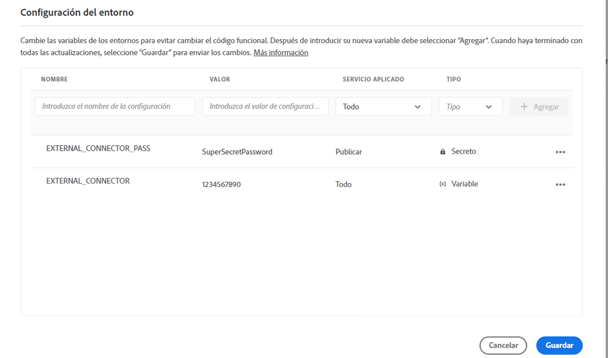

# Variables de entorno de Cloud Manager {#environment-variables}

Las variables de entorno estándar se pueden configurar y administrar mediante Cloud Manager. Se proporcionan al entorno del tiempo de ejecución y se pueden utilizar en configuraciones OSGi. Las variables de entorno pueden ser valores específicos del entorno o secretos del entorno, según lo que se vaya a cambiar.

## Información general {#overview}

Las variables de entorno ofrecen una serie de ventajas a los usuarios de AEM as a Cloud Service:

* Permiten que el comportamiento del código y de la aplicación varíe según el contexto y el entorno. Por ejemplo, se pueden utilizar para habilitar distintas configuraciones en el entorno de desarrollo en comparación con los entornos de producción o ensayo para evitar errores costosos.
* Solo deben configurarse una vez, y pueden actualizarse y eliminarse cuando sea necesario.
* Sus valores se pueden actualizar en cualquier momento y entrar en vigor inmediatamente sin necesidad de realizar cambios o implementaciones de código.
* Pueden separar el código de la configuración y eliminar la necesidad de incluir información confidencial en el control de versiones.
* Mejoran la seguridad de la aplicación de AEM as a Cloud Service ya que viven fuera del código.

Los casos de uso habituales para usar variables de entorno incluyen:

* Conexión de la aplicación de AEM con diferentes extremos externos
* Uso de una referencia al almacenar contraseñas en lugar de directamente en la base de código
* Cuando existen varios entornos de desarrollo en un programa y algunas configuraciones difieren de un entorno a otro

## Agregar variables de entorno {#add-variables}

>[!NOTE]
>
>Tiene que estar abonado a la función de [**Administrador de implementación**](/help/onboarding/cloud-manager-introduction.md#role-based-premissions) para agregar o modificar las variables de entorno.

1. Inicie sesión en Adobe Cloud Manager en [my.cloudmanager.adobe.com](https://my.cloudmanager.adobe.com/).
1. En la consola **[Mis programas](/help/implementing/cloud-manager/navigation.md#my-programs)**, seleccione el que desee administrar.
1. En la barra de navegación lateral, seleccione la ventana **Entornos** del programa elegido y, a continuación, seleccione el entorno para el que desea crear una variable de entorno.
1. En los detalles del entorno, seleccione la pestaña **Configuración** y a continuación, seleccione **Agregar** para abrir el cuadro de diálogo **Configuración del entorno**.
   * Si agrega una variable de entorno por primera vez, verá el botón **Agregar configuración** en el centro de la página. Puede utilizar este botón o **Agregar** para abrir el cuadro de diálogo **Configuración del entorno**.

   

1. Introduzca los detalles de la variable.
   * **Nombre**
   * **Valor**
   * **Servicio aplicado**: define para qué servicio (autor/Publish/vista previa) se aplica la variable o si se aplica a todos los servicios
   * **Tipo**: Define si la variable es una variable normal o un secreto

   

1. Después de introducir la nueva variable, debe seleccionar **Agregar** en la última columna de la fila que contiene la nueva variable.
   * Puede introducir varias variables a la vez al introducir una línea nueva y seleccionar **Agregar**.

   

1. Seleccione **Guardar** para mantener las variables.

Un indicador con el estado **Actualizando** se muestra en la parte superior de la tabla y junto a la variable recién agregada para indicar que el entorno se está actualizando con la configuración. Una vez finalizada, la nueva variable de entorno se puede ver en la tabla.

>[!TIP]
>
>Si desea agregar varias variables, se recomienda agregar la primera variable y luego usar el botón **Agregar** del cuadro de diálogo **Configuración del entorno** para agregar las variables adicionales. De este modo, puede agregarlas con una actualización al entorno.

## Actualizar variables de entorno {#update-variables}

Una vez creadas las variables de entorno, puede actualizarlas con el botón **Agregar/actualizar** para iniciar el cuadro de diálogo **Configuración del entorno**.

1. Inicie sesión en Adobe Cloud Manager en [my.cloudmanager.adobe.com](https://my.cloudmanager.adobe.com/).
1. Cloud Manager enumera los distintos programas disponibles. Seleccione el que desee administrar.
1. En el panel de navegación, seleccione la ventana **Entornos** del programa elegido y, a continuación, seleccione el entorno para el que desea modificar una variable de entorno.
1. En los detalles del entorno, seleccione la pestaña **Configuración** a continuación, seleccione **Agregar/actualizar** en la parte superior derecha para abrir el cuadro de diálogo **Configuración del entorno**.
1. Con el botón de los tres puntos de la última columna de la fila de la variable que desea modificar, seleccione **Editar** o **Eliminar**.

   

1. Edite la variable de entorno según sea necesario.
   * Al editar, el botón de los tres puntos cambia a Opciones para volver al valor original o confirmar el cambio.
   * Al editar secretos, los valores solo se pueden actualizar, no ver.

   

1. Después de hacer los cambios de configuración necesarios, selecciona **Guardar**.

[Al igual que cuando se agregan variables](#add-variables), se muestra un indicador con el estado **Actualizando** en la parte superior de la tabla y junto a las variables recién actualizadas para indicar que el entorno se está actualizando con la configuración. Una vez finalizadas, las variables de entorno actualizadas se pueden ver en la tabla.

>[!TIP]
>
>Si desea actualizar varias variables, se recomienda usar el cuadro de diálogo **Configuración del entorno** para actualizar todas las variables necesarias a la vez antes de pulsar o hacer clic en **Guardar**. De este modo, puede agregarlas con una actualización al entorno.

## Utilizar variables de entorno {#using}

Las variables de entorno pueden hacer que las `pom.xml` configuraciones sean más seguras y flexibles. Por ejemplo, las contraseñas no tienen que estar codificadas y la configuración se puede adaptar según los valores de las variables de entorno.

Puede acceder a las variables y los secretos de entorno a través de XML de la siguiente manera.

* `${env.VARIABLE_NAME}`

Consulte el documento [Configurar un proyecto](/help/implementing/cloud-manager/getting-access-to-aem-in-cloud/setting-up-project.md#password-protected-maven-repository-support-password-protected-maven-repositories) para ver un ejemplo de cómo utilizar ambos tipos de variables en un `pom.xml` archivo.

Consulte la [documentación oficial de Maven](https://maven.apache.org/settings.html#quick-overview) para obtener más información.

## Disponibilidad de variables de entorno {#availability}

Las variables de entorno se pueden utilizar en varios lugares.

### Creación, previsualización y publicación {#author-preview-publish}

Tanto las variables de entorno normales como los secretos se pueden usar en los entornos de creación, previsualización y publicación.

### Dispatcher {#dispatcher}

Solo se pueden usar variables de entorno normales con [los secretos de Dispatcher](https://experienceleague.adobe.com/docs/experience-manager-dispatcher/using/dispatcher.html?lang=es).

Sin embargo, las variables de entorno no se pueden usar en `IfDefine` directivas.

>[!TIP]
>
>Debe validar el uso de variables de entorno con [Dispatcher localmente](https://experienceleague.adobe.com/docs/experience-manager-learn/cloud-service/local-development-environment-set-up/dispatcher-tools.html?lang=es) antes de la implementación.

### Configuraciones de OSGi {#osgi}

Tanto las variables de entorno normales como los secretos se pueden utilizar en las [configuraciones OSGi](/help/implementing/deploying/configuring-osgi.md).

### Variables de canalización {#pipeline}

Además de las variables de entorno, también hay variables de canalización que se exponen durante la fase de compilación. Obtenga más información acerca de las variables de canalización en [Entorno de compilación](/help/implementing/cloud-manager/getting-access-to-aem-in-cloud/build-environment-details.md#pipeline-variables).
