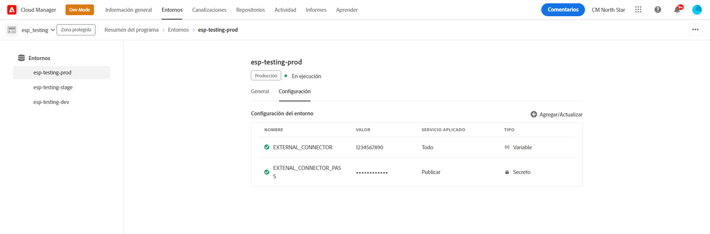

# Variables de entorno de Cloud Manager {#environment-variables}

Las variables de entorno estándar se pueden configurar y administrar mediante Cloud Manager. Se proporcionan al entorno de tiempo de ejecución y se pueden utilizar en configuraciones OSGi. Las variables de entorno pueden ser valores específicos de entorno o secretos de entorno, según lo que se esté cambiando.

## Información general {#overview}

Las variables de entorno ofrecen una serie de ventajas a los usuarios de AEM as a Cloud Service:

* Permiten que el comportamiento del código y la aplicación varíe según el contexto y el entorno. Por ejemplo, se pueden utilizar para habilitar distintas configuraciones en el entorno de desarrollo en comparación con los entornos de producción o ensayo para evitar errores costosos.
* Solo deben configurarse y configurarse una vez, y pueden actualizarse y eliminarse cuando sea necesario.
* Sus valores se pueden actualizar en cualquier momento y entrar en vigor inmediatamente sin necesidad de realizar cambios o implementaciones de código.
* Pueden separar el código de la configuración y eliminar la necesidad de incluir información confidencial en el control de versiones.
* Mejoran la seguridad de la aplicación as a Cloud Service AEM ya que viven fuera del código.

Los casos de uso habituales para usar variables de entorno incluyen:

* Conexión de la aplicación AEM con diferentes extremos externos
* Uso de una referencia al almacenar contraseñas en lugar de directamente en la base de código
* Cuando existen varios entornos de desarrollo en un programa y algunas configuraciones difieren de un entorno a otro

## Adición de variables de entorno {#add-variables}

>[!NOTE]
>
>Debe ser miembro de [**Administrador de implementación** función](/help/onboarding/cloud-manager-introduction.md#role-based-premissions) para agregar o modificar variables de entorno.

1. Inicie sesión en Adobe Cloud Manager en [my.cloudmanager.adobe.com](https://my.cloudmanager.adobe.com/).
1. Cloud Manager enumera los distintos programas disponibles. Seleccione el que desee administrar.
1. Seleccione el **Entornos** para el programa elegido, seleccione el entorno para el que desea crear una variable de entorno en el panel de navegación izquierdo.
1. En los detalles del entorno, seleccione la opción **Configuración** a continuación, seleccione **Agregar** para abrir el **Configuración del entorno** diálogo.
   * Si agrega una variable de entorno por primera vez, verá una **Agregar configuración** en el centro de la página. Puede utilizar este botón o **Agregar** para abrir el **Configuración del entorno** diálogo.

   

1. Introduzca los detalles de la variable.
   * **Nombre**
   * **Value**
   * **Servicio aplicado** - Define para qué servicio (autor/publicación/vista previa) se aplica la variable o si se aplica a todos los servicios
   * **Tipo** - Define si la variable es una variable normal o un secreto

   

1. Después de introducir la nueva variable, debe seleccionar **Agregar** en la última columna de la fila que contiene la nueva variable.
   * Puede introducir varias variables a la vez introduciendo una línea nueva y seleccionando **Agregar**.

   

1. Select **Guardar** para mantener las variables.

Un indicador con el estado **Actualización** se muestra en la parte superior de la tabla y junto a la variable recién añadida para indicar que el entorno se está actualizando con la configuración. Una vez completada, la nueva variable de entorno se puede ver en la tabla .

>[!TIP]
>
>Si desea agregar varias variables, se recomienda agregar la primera variable y luego usar la variable **Agregar** en el **Configuración del entorno** para agregar las variables adicionales. De este modo, puede agregarlas con una actualización al entorno.

## Actualización de variables de entorno {#update-variables}

Una vez creadas las variables de entorno, puede actualizarlas con la variable **Agregar/actualizar** para iniciar el **Configuración del entorno** diálogo.

1. Inicie sesión en Adobe Cloud Manager en [my.cloudmanager.adobe.com](https://my.cloudmanager.adobe.com/).
1. Cloud Manager enumera los distintos programas disponibles. Seleccione el que desee administrar.
1. Seleccione el **Entornos** para el programa elegido, seleccione el entorno para el que desea crear una variable de entorno en el panel de navegación izquierdo.
1. En los detalles del entorno, seleccione la opción **Configuración** a continuación, seleccione **Agregar/actualizar** en la parte superior derecha para abrir **Configuración del entorno** diálogo.

   

1. Con el botón de puntos suspensivos en la última columna de la fila de la variable que desea modificar, seleccione **Editar** o **Eliminar**.

   

1. Edite la variable de entorno según sea necesario.
   * Al editar, el botón de elipsis cambia a las opciones para volver al valor original o confirmar el cambio.
   * Al editar secretos, los valores solo se pueden actualizar, no ver.

   

1. Una vez que haya realizado todos los cambios de configuración necesarios, seleccione **Guardar**.

[Al igual que cuando se agregan variables,](#add-variables) un indicador con el estado **Actualización** se muestra en la parte superior de la tabla y junto a las variables recién actualizadas para indicar que el entorno se está actualizando con la configuración. Una vez finalizada, las variables de entorno actualizadas se pueden ver en la tabla .

>[!TIP]
>
>Si desea actualizar varias variables, se recomienda usar la variable **Configuración del entorno** para actualizar todas las variables necesarias a la vez antes de pulsar o hacer clic **Guardar**. De este modo, puede agregarlas con una actualización al entorno.

## Utilizar variables de entorno {#using}

Las variables de entorno pueden hacer que la variable `pom.xml` configuraciones más seguras y flexibles. Por ejemplo, las contraseñas no tienen que estar codificadas y la configuración se puede adaptar según los valores de las variables de entorno.

Puede acceder a las variables y los secretos de entorno a través de XML de la siguiente manera.

* `${env.VARIABLE_NAME}`

Consulte el documento [Configuración del proyecto](/help/implementing/cloud-manager/getting-access-to-aem-in-cloud/setting-up-project.md#password-protected-maven-repository-support-password-protected-maven-repositories) para ver un ejemplo de cómo utilizar ambos tipos de variables en una `pom.xml` archivo.

Consulte la [documentación oficial de Maven](https://maven.apache.org/settings.html#quick-overview) para obtener más información.
