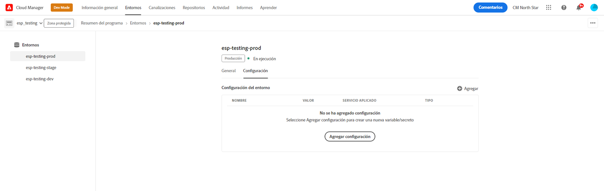
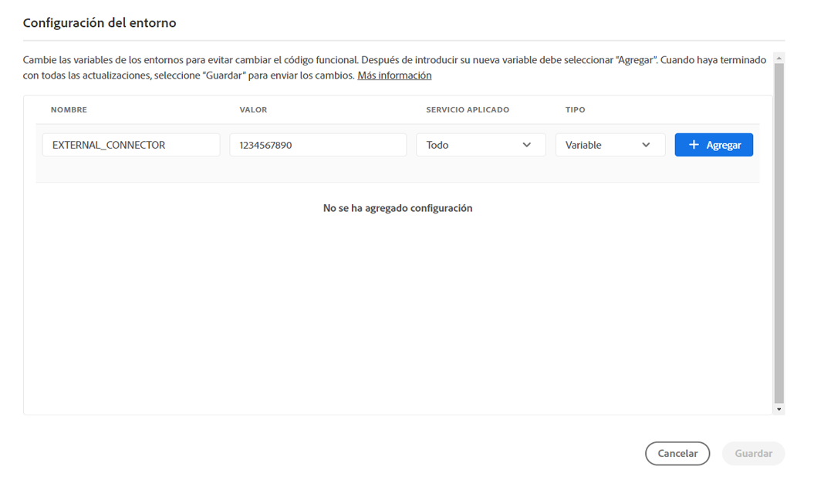
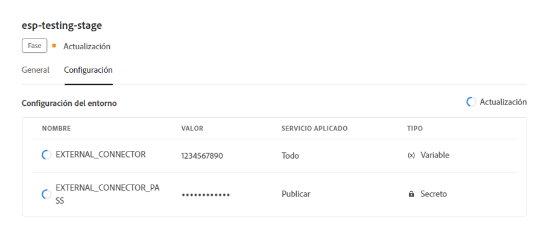
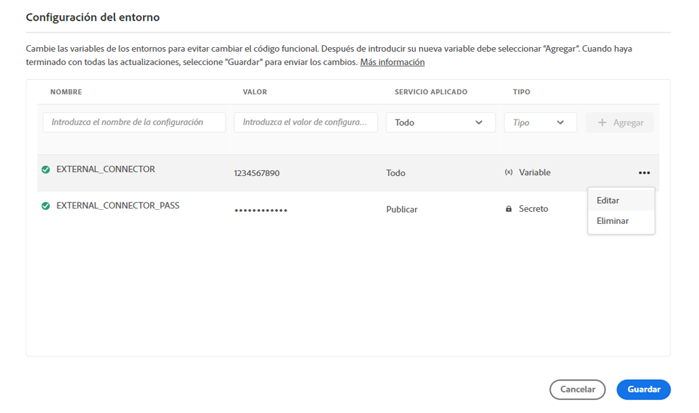
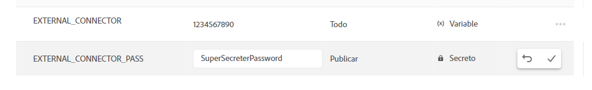

# Variables de entorno en Cloud Manager {#environment-variables}

Las variables de entorno estándar se pueden configurar y administrar mediante Cloud Manager. Se proporcionan al entorno del tiempo de ejecución y se pueden utilizar en configuraciones OSGi.

Las variables de entorno pueden ser valores específicos del entorno o secretos del entorno, según lo que se vaya a cambiar.

## Acerca de las variables de entorno {#overview}

Las variables de entorno ofrecen una serie de ventajas a los usuarios de AEM as a Cloud Service, como las siguientes:

* Permiten que el comportamiento del código y de la aplicación varíe según el contexto y el entorno. Por ejemplo, se pueden utilizar para habilitar diferentes configuraciones en el entorno de desarrollo en comparación con los entornos de producción o ensayo para evitar errores costosos.
* Solo deben configurarse una vez, y pueden actualizarse y eliminarse cuando sea necesario.
* Sus valores se pueden actualizar en cualquier momento y entrar en vigor inmediatamente sin necesidad de realizar cambios o implementaciones de código.
* Pueden separar el código de la configuración y eliminar la necesidad de incluir información confidencial en el control de versiones.
* Mejoran la seguridad de la aplicación de AEM as a Cloud Service ya que viven fuera del código.

Los casos de uso habituales para usar variables de entorno son los siguientes:

* Conexión de la aplicación de AEM con diferentes extremos externos
* Uso de una referencia al almacenar contraseñas en lugar de directamente en la base de código
* Cuando existen varios entornos de desarrollo en un programa y algunas configuraciones difieren de un entorno a otro

## Agregar una variable de entorno {#add-variables}

Si desea agregar varias variables, Adobe recomienda que agregue la primera variable y, a continuación, use  **Agregar** en el cuadro de diálogo **Configuración del entorno** para agregar las variables adicionales. Este método significa que puede agregarlos con una actualización al entorno.

Para agregar, actualizar o eliminar variables de entorno, debe ser miembro del rol [**Administrador de implementación**](/help/onboarding/cloud-manager-introduction.md#role-based-premissions).

**Para agregar una variable de entorno:**

1. Inicie sesión en Cloud Manager en [my.cloudmanager.adobe.com](https://my.cloudmanager.adobe.com/) y seleccione la organización adecuada.
1. En la consola **[Mis programas](/help/implementing/cloud-manager/navigation.md#my-programs)**, seleccione el que desee administrar.
1. En el menú lateral, haga clic en **Entornos**.
1. En la página **Entornos**, seleccione una fila de la tabla que tenga el entorno para el que desea agregar una variable de entorno.
1. En la página de detalles del entorno, haga clic en la ficha **Configuración**.
1. Haga clic en  **Agregar/actualizar**.
Si agrega una variable de entorno por primera vez, haga clic en **Agregar configuración** en el centro de la página.

   

1. En el cuadro de diálogo **Configuración del entorno**, escriba los detalles en la primera fila de la tabla.

   | Campo | Descripción |
   | --- | --- |
   | Nombre | Un nombre único de la variable de configuración. Identifica la variable específica que se utiliza en el entorno. Debe cumplir las siguientes convenciones de nomenclatura:<ul><li>Las variables solo pueden contener caracteres alfanuméricos y el guion bajo (`_`).</li><li>Hay un límite de 200 variables por entorno.</li><li>Cada nombre debe tener 100 caracteres o menos.</li></ul> |
   | Valor | El valor que contiene la variable. |
   | Paso aplicado | Seleccione el servicio al que se aplica la variable. Seleccione **Todos** para que la variable se aplique a todos los servicios.<ul><li>**Todos**</li><li>**Autor**</li><li>**Publish**</li><li>**Previsualizar**</li></ul> |
   | Tipo | Seleccione si la variable es normal o un secreto. |

   

1. Haga clic en **Agregar**.

   Añada variables adicionales según sea necesario.

1. Haga clic en **Guardar**.

   Se muestra un control de número con el estado **Actualizando** en la esquina superior derecha de la tabla. También aparecerá un control de número a la izquierda de las variables recién agregadas. Estos estados indican que el entorno se está actualizando con la configuración. Una vez finalizada, la nueva variable de entorno se puede ver en la tabla.

## Actualización de una variable de entorno {#update-variables}

Una vez que haya creado variables de entorno, puede actualizarlas con  **Agregar/Actualizar** para abrir el cuadro de diálogo **Configuración del entorno**.

Si desea actualizar varias variables, el Adobe recomienda que utilice el cuadro de diálogo **Configuración del entorno** para actualizar todas las variables necesarias a la vez antes de hacer clic en **Guardar**. De este modo, puede agregarlas con una actualización al entorno.

**Para actualizar una variable de entorno:**

1. Inicie sesión en Cloud Manager en [my.cloudmanager.adobe.com](https://my.cloudmanager.adobe.com/) y seleccione la organización adecuada.
1. En la consola **[Mis programas](/help/implementing/cloud-manager/navigation.md#my-programs)**, seleccione el que desee administrar.
1. En el menú lateral, haga clic en **Entornos**.
1. En la página **Entornos**, seleccione una fila de la tabla que tenga el entorno para el que desea actualizar una variable.
1. En la página de detalles del entorno, haga clic en la ficha **Configuración**.
1. Haga clic en  **Agregar/actualizar**.
1. En el cuadro de diálogo **Configuración del entorno**, haga clic en  en la última columna de la fila de la variable que desea cambiar.
1. En el menú desplegable, haga clic en **Editar**.

   

1. Actualice el valor de la variable de entorno según sea necesario.
Al editar un secreto, el valor solo se puede actualizar, no ver.

   

1. Realice una de las siguientes acciones:

   * Haga clic en  para aplicar el cambio.
   * Haga clic en  para deshacer el cambio.

1. Haga clic en **Guardar**.

   Se muestra un control de número con el estado **Actualizando** en la esquina superior derecha de la tabla. También aparece un control de número a la izquierda de las variables actualizadas. Estos estados indican que el entorno se está actualizando con la configuración. Una vez finalizada, la variable de entorno actualizada se puede ver en la tabla.

## Eliminar una variable de entorno {#delete-env-variable}

1. Inicie sesión en Cloud Manager en [my.cloudmanager.adobe.com](https://my.cloudmanager.adobe.com/) y seleccione la organización adecuada.
1. En la consola **[Mis programas](/help/implementing/cloud-manager/navigation.md#my-programs)**, seleccione el que desee administrar.
1. En el menú lateral, haga clic en **Entornos**.
1. En la página **Entornos**, seleccione una fila de la tabla que tenga el entorno para el que desea actualizar una variable.
1. En la página de detalles del entorno, haga clic en la ficha **Configuración**.
1. Haga clic en  **Agregar/actualizar**.
1. En el cuadro de diálogo **Configuración del entorno**, haga clic en  en la última columna de la fila de la variable que desea cambiar.
1. En el menú desplegable, haga clic en **Eliminar** para quitar la variable inmediatamente.
1. Haga clic en **Guardar**.

## Uso de variables de entorno {#using}

Las variables de entorno pueden hacer que las `pom.xml` configuraciones sean más seguras y flexibles. Por ejemplo, las contraseñas no tienen que estar codificadas y la configuración se puede adaptar según los valores de las variables de entorno.

Puede acceder a las variables y los secretos de entorno mediante XML de la siguiente manera:

`${env.VARIABLE_NAME}`

Vea [Configurar el proyecto](/help/implementing/cloud-manager/getting-access-to-aem-in-cloud/setting-up-project.md#password-protected-maven-repository-support-password-protected-maven-repositories) para ver un ejemplo de cómo usar ambos tipos de variables en un archivo `pom.xml`.

Consulte también la [documentación oficial de Maven](https://maven.apache.org/settings.html#quick-overview) para obtener más información.

## Disponibilidad de variables de entorno {#availability}

Las variables de entorno se pueden utilizar en varios lugares de la siguiente manera:

| Dónde se pueden utilizar variables de entorno | Descripción |
| --- | --- |
| Creación, previsualización y publicación | Tanto las variables de entorno normales como los secretos se pueden usar en los entornos de creación, previsualización y publicación. |
| Dispatcher | Solo se pueden usar variables de entorno normales con [Dispatcher](https://experienceleague.adobe.com/es/docs/experience-manager-dispatcher/using/dispatcher).<ul><li>Los secretos no se pueden usar.</li><li>No se pueden usar variables de entorno en directivas `IfDefine`.</li><li>Debe validar el uso de variables de entorno con [Dispatcher localmente](https://experienceleague.adobe.com/docs/experience-manager-learn/cloud-service/local-development-environment-set-up/dispatcher-tools.html?lang=es) antes de la implementación.</li></ul> |
| Configuraciones de OSGi | En [Configuraciones OSGi](/help/implementing/deploying/configuring-osgi.md) se pueden usar tanto variables de entorno regulares como secretos. |
| Variables de canalización | Además de las variables de entorno, también hay variables de canalización que se exponen durante la fase de compilación. Obtenga más información acerca de las variables de canalización en [Entorno de compilación](/help/implementing/cloud-manager/getting-access-to-aem-in-cloud/build-environment-details.md#pipeline-variables). |

