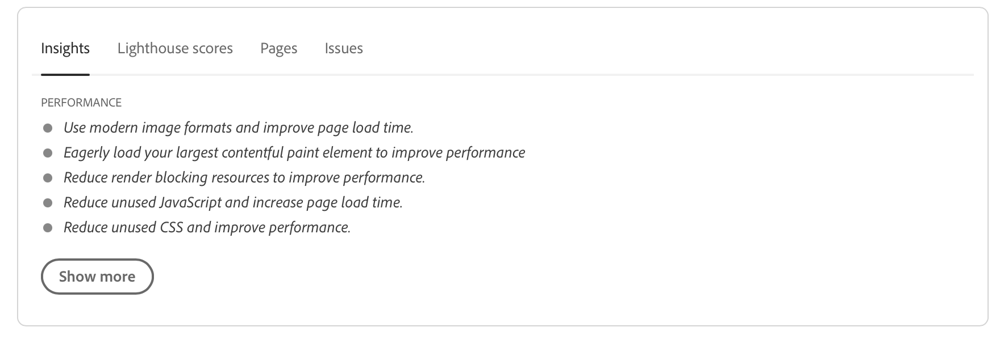
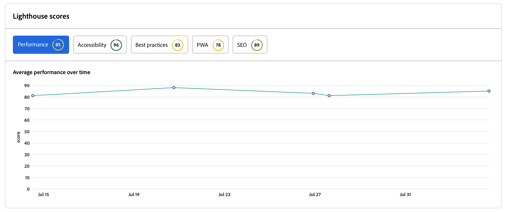

# Tablero de auditoría de experiencias {#experience-audit-dashboard}

Descubra cómo la auditoría de experiencias valida el proceso de implementación y ayuda a garantizar que los cambios implementados cumplan los estándares de línea de base para el rendimiento, la accesibilidad, las prácticas recomendadas y la SEO a través de una interfaz de panel clara e informativa.

>[!NOTE]
>
>Esta función solo está disponible para [el programa de adopción temprana.](/help/implementing/cloud-manager/release-notes/current.md#early-adoption)
>
>AEM Para obtener más información sobre la función de auditoría de experiencias existente para los informes as a Cloud Service, consulte [Pruebas de auditoría de experiencias](/help/implementing/cloud-manager/experience-audit-testing.md).

## Información general {#overview}

La auditoría de experiencia es una característica disponible en las canalizaciones de producción de Cloud Manager Sites que valida el proceso de implementación y que ayuda a garantizar que los cambios implementados:

1. Cumplan los estándares de línea de base para el rendimiento, la accesibilidad, las prácticas recomendadas, la SEO (optimización de motores de búsqueda) y la PWA (aplicación web progresiva).

1. No introduzcan regresiones.

La auditoría de experiencias en Cloud Manager garantiza que la experiencia del usuario final en el sitio sea de los más altos estándares.

Los resultados de la auditoría son informativos y permiten al administrador de implementación ver las puntuaciones y el cambio entre las puntuaciones actuales y anteriores. Esta perspectiva es importante para determinar si hay una regresión que se haya introducido con la implementación actual.

La auditoría de experiencias funciona con [Google Lighthouse](https://developer.chrome.com/docs/lighthouse/overview/), una herramienta de código abierto de Google y está habilitada en todas las canalizaciones de producción de Cloud Manager.

>[!TIP]
>
>Puede configurar qué páginas se incluyen en la Auditoría de experiencias al [configurar la canalización](/help/implementing/cloud-manager/configuring-pipelines/configuring-production-pipelines.md#full-stack-code).

## El panel de auditoría de experiencias {#dashboard}

Los resultados de la auditoría de experiencias se presentan en la **Pruebas de ensayos** fase de la canalización de producción a través de [página ejecución de canalización de producción](/help/implementing/cloud-manager/deploy-code.md).

La auditoría de experiencias proporciona resultados de prueba agregados y detallados a nivel de página resumidos en cuatro pestañas:

* **[Insights](#insights)** proporcione una breve descripción de las recomendaciones procesables para mejorar el rendimiento del sitio.
* **[Puntuaciones de Lighthouse](#lighthouse)** son un resumen de las puntuaciones de Lighthouse para el código implementado en esta ejecución de canalización.
* **[Páginas](#pages)** es un resumen del rendimiento de las páginas configuradas específicamente para ser analizadas.
* **[Problemas](#issues)** resume cualquier problema de rendimiento detectado en el código de esta ejecución de canalización.

### Perspectivas {#insights}

El **Insights** proporciona una breve descripción de las recomendaciones procesables para mejorar el rendimiento del sitio.

Seleccione el **Mostrar más** para abrir el tablero completo.

En el **Perspectivas y recomendaciones** En esta sección encontrará una lista detallada de recomendaciones procesables con un indicador de valor claro vinculado a las ganancias que se pueden esperar en el rendimiento, junto con el porcentaje de páginas afectadas. Esto le permite priorizar fácilmente estas recomendaciones para sus equipos.

Para volver a la página de ejecución de la canalización de producción, simplemente seleccione la flecha hacia atrás en el explorador.

### Puntuaciones de Lighthouse {#lighthouse}

El **Puntuaciones de Lighthouse** es un resumen de las puntuaciones de Lighthouse para el código implementado en esta ejecución de canalización.

Seleccione el **Mostrar más** para abrir el tablero completo.

En el **Puntuaciones de Lighthouse** , encontrará una vista de tendencias de las distintas puntuaciones. Seleccionar **Rendimiento**, **Accesibilidad**, **PWA**, o **SEO** para ver la vista de tendencias mensual de esos valores.

Tenga en cuenta que cada punto del gráfico es el promedio de todas las implementaciones en el mes de interés.

Para volver a la página de ejecución de la canalización de producción, simplemente seleccione la flecha hacia atrás en el explorador.

### Páginas {#pages}

El **Páginas** es un resumen del rendimiento de las páginas configuradas específicamente para ser analizadas.

Seleccione el **Mostrar más** para abrir el tablero completo.

El **Páginas** proporciona una lista de las páginas que se han probado, así como sus puntuaciones de rendimiento de Lighthouse más actuales y el desglose.

Puede configurar qué páginas se incluyen en la Auditoría de experiencias al [configurar la canalización](/help/implementing/cloud-manager/configuring-pipelines/configuring-production-pipelines.md#full-stack-code).

Para volver a la página de ejecución de la canalización de producción, simplemente seleccione la flecha hacia atrás en el explorador.

### Problemas {#issues}

El **Problemas** Esta pestaña resume los problemas de rendimiento detectados en el código de esta ejecución de canalización.

Seleccione el **Mostrar más** para abrir el tablero completo.

En el **Perspectivas y recomendaciones** En esta sección, encontrará una lista más detallada de recomendaciones procesables con un indicador de valor claro vinculado a las ganancias que se pueden esperar en el rendimiento, junto con el porcentaje de páginas afectadas. Esto le permite priorizar fácilmente estas recomendaciones para sus equipos.

Para volver a la página de ejecución de la canalización de producción, simplemente seleccione la flecha hacia atrás en el explorador.

### Detalles de página {#page-detail}

Si selecciona el vínculo de una página en una de las pestañas de **Auditoría de experiencias** de la página de ejecución de la canalización o en el **Páginas** del panel de auditoría de experiencias completo, puede ver los detalles de una página en particular.

Se puede ver la puntuación de las páginas individuales para la prueba específica junto con el cambio con respecto a la anterior.

Al hacer clic en los detalles de cualquier página individual se proporciona información sobre los elementos de la página que se evaluaron, así como las instrucciones para solucionar problemas si se detectan oportunidades de mejora.

Para volver a la página de ejecución de la canalización de producción, simplemente seleccione la flecha hacia atrás en el explorador.
