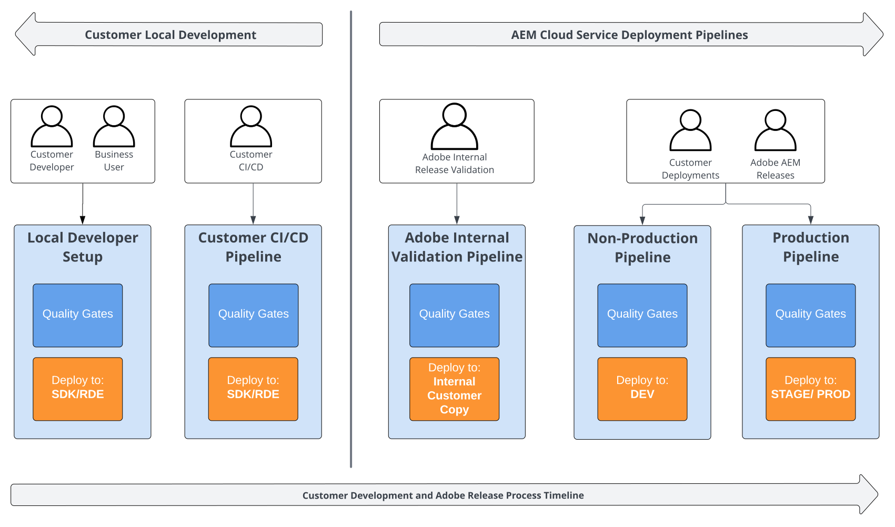

# Introducción {#functional-testing-introduction}

>[!CONTEXTUALHELP]
>id="aemcloud_nonbpa_functionaltesting"
>title="Pruebas funcionales"
>abstract="Obtenga información sobre los tres tipos diferentes de pruebas funcionales integradas en el proceso de implementación de AEM as a Cloud Service para garantizar la calidad y fiabilidad de su código."

Obtenga información acerca de las puertas de calidad disponibles en la [AEM proceso de implementación as a Cloud Service de](/help/implementing/cloud-manager/deploy-code.md), los diferentes tipos de pruebas funcionales integradas, cómo puede contribuir y cómo puede aprovecharlas al máximo en el contexto de una estrategia general de pruebas.

## Información general

En el siguiente diagrama se proporciona una amplia descripción general de las canalizaciones disponibles en el contexto de una estrategia general de pruebas y del [AEM proceso de implementación as a Cloud Service de](/help/implementing/cloud-manager/deploy-code.md).

## Función

El propósito de las canalizaciones de implementación de AEM Cloud Service AEM es facilitar implementaciones sólidas y seguras en varias etapas del ciclo de vida de su desarrollo y lanzamiento del producto. AEM AEM Estas canalizaciones incorporan varias puertas de calidad en diferentes niveles para garantizar la integridad y la seguridad de las implementaciones, tanto para los cambios de la aplicación de la como para las actualizaciones de productos.

El Adobe de proporciona varias puertas de calidad integradas, mientras que otras requieren su intervención para la implementación y configuración. Estas puertas de calidad son versátiles, y algunas de ellas se aplican en varias etapas del ciclo de vida e incluso se pueden integrar en su propia configuración de desarrollo y procesos de CI/CD.

AEM AEM Las puertas de calidad integradas validan principalmente la funcionalidad del producto de en el contexto de la aplicación. Por el contrario, las puertas de calidad personalizadas que configure están diseñadas para comprobar que las funciones críticas de la aplicación y las interacciones del usuario funcionan según lo previsto. AEM De forma conjunta, estos dos conjuntos de puertas de calidad trabajan juntos para garantizar implementaciones automatizadas sólidas y seguras, tanto para las modificaciones de código como para las actualizaciones de productos de la.

Es importante tener en cuenta que estas puertas de calidad no están pensadas para ser un marco de prueba completo para toda la estrategia de prueba. AEM AEM El producto se somete a pruebas exhaustivas antes de entrar en el proceso de implementación del servicio en la nube de la. Del mismo modo, la aplicación ya debe ser de alta calidad antes de que llegue a la fase de implementación. Este enfoque garantiza que las puertas de calidad se centren en su objetivo principal de salvaguardar el proceso de despliegue, en lugar de ser un sustituto de un régimen de pruebas completo.

## Puertas de calidad

El siguiente diagrama proporciona una vista detallada de las puertas de calidad disponibles y su uso en la estrategia general de pruebas y la [AEM proceso de implementación as a Cloud Service de](/help/implementing/cloud-manager/deploy-code.md).

### Puertas de calidad proporcionadas por el cliente

|                               | Pruebas de unidad | Personalizado  Pruebas funcionales | Personalizado  Pruebas de IU | Cliente  Validaciones | Manual  Pruebas |
|:------------------------------|:---------------------:|:-----------------------------------:|:-----------------------------------:|:-------------------------:|:-------------------:|
| **Canalización de producción** | Sí Bloqueo  | Sí Bloqueo Tiempo de espera de 60 m | Sí Bloqueo Tiempo de espera de 60 m | No | No |
| **Canalización que no es de producción** | Sí Bloqueo  | Opt-in Bloqueo Tiempo de espera de 60 m | Opt-in Bloqueo Tiempo de espera de 60 m | No | No |
| **Validación interna de Adobe** | Sí Bloqueo  | Sí Bloqueo Tiempo de espera de 60 m | Sí Bloqueo Tiempo de espera de 60 m | No | No |
| **CI/CD del cliente** | Sí | Sí | Sí | Sí | Sí |
| **Desarrollador local del cliente** | Sí | Sí | Sí | Sí | Sí |

### Prueba unitaria

AEM Se le recomienda que proporcione las pruebas unitarias para su aplicación de, que son la base de cada estrategia de prueba. Están pensados para correr rápido y a menudo y dar una respuesta temprana y rápida. AEM Están totalmente integradas en los flujos de trabajo de los desarrolladores, en sus propias canalizaciones de implementación de CI/CD y el servicio en la nube de la.

Se implementan mediante JUnit y se ejecutan con Maven. Consulte la
[AEM Módulo principal del tipo de archivo del proyecto de](https://experienceleague.adobe.com/docs/experience-manager-core-components/using/developing/archetype/core.html#unit-tests)
AEM para ver un ejemplo de prueba unitaria para obtener y empezar a utilizar la prueba de la forma de inicio de la.

### Calidad del código

AEM Esta puerta de calidad está configurada de forma predeterminada y ejecuta un análisis de código estático en el código de la aplicación de la.

Consulte [Prueba de calidad de código](/help/implementing/cloud-manager/code-quality-testing.md) y
[Reglas de calidad de código personalizadas](/help/implementing/cloud-manager/custom-code-quality-rules.md) para obtener más información.

### Pruebas de productos

Las pruebas funcionales del producto son un conjunto de pruebas de integración (TI) HTTP estables de funcionalidad central en AEM como las tareas de creación y replicación. Adobe los proporciona y los mantiene de forma predeterminada. AEM Su objetivo es evitar que se implementen cambios en el código de aplicación personalizado si rompen la funcionalidad principal del producto de la aplicación de la aplicación de la que se ha hecho el uso

Se implementan utilizando Junit, se ejecutan utilizando Maven y hacen uso del [AEM Cliente de prueba de](https://github.com/adobe/aem-testing-clients).
El grupo de pruebas del producto se mantiene como [proyecto de código abierto](https://github.com/adobe/aem-test-samples/tree/aem-cloud/smoke), sigue las prácticas recomendadas y se puede considerar un buen punto de partida para la implementación de pruebas.

### Pruebas funcionales personalizadas

Al igual que las pruebas de producto, las pruebas funcionales de cliente son pruebas de integración HTTP (TI) y también se implementan mediante Junit, se ejecutan mediante Maven y se basan en el [AEM Cliente de prueba de](https://github.com/adobe/aem-testing-clients).

>[!NOTE]
>
>AEM AEM Las pruebas funcionales personalizadas se ejecutan en las canalizaciones de producción y de no producción (inclusión) que utiliza la aplicación de la para cambiar las implementaciones y las actualizaciones push de productos y, por lo tanto, son una contribución clave para garantizar el funcionamiento adecuado de la aplicación y aumentar la seguridad de la versión.
>Las pruebas funcionales del cliente también se ejecutan en canalizaciones de validación internas previas al lanzamiento para cada cliente, lo que ayuda a proporcionar comentarios tempranos.

Para mantener la eficiencia de las ejecuciones de canalización, recomendamos centrarse en las funciones clave y en los flujos de interacción principales del usuario.
Se recomienda un tiempo de ejecución de ~15 minutos o menos para las pruebas funcionales. Se recomienda que los grupos de pruebas funcionales completos que no caben en esta puerta de calidad se ejecuten como parte de las canalizaciones generales de validación del cliente durante el flujo de desarrollo del cliente.

Consulte la [pruebas de productos de código abierto](https://github.com/adobe/aem-test-samples/tree/aem-cloud/smoke) o el
[AEM Módulo it.tests del tipo de archivo de los proyectos de](https://experienceleague.adobe.com/docs/experience-manager-core-components/using/developing/archetype/ittests.html)
para ver ejemplos.

Consulte [Pruebas funcionales de Java](/help/implementing/cloud-manager/java-functional-testing.md) para obtener más información.

### Pruebas de IU personalizadas

Para maximizar el control de riesgos para el desarrollo específico del cliente, Adobe le recomienda encarecidamente que capture las pruebas de interfaz de usuario críticas en AEM CS. Están pensados para mantenerse bastante limitados en número, pero con el mayor impacto en su experiencia de cliente.

Las pruebas se empaquetan en una imagen Docker diseñada para ser lo más volátil posible (con soporte para Cypress, Selenium, Java, Javascript, etc.). Siguen las mismas características y propósitos que las pruebas funcionales personalizadas.

>[!NOTE]
>
>AEM AEM Las pruebas de IU personalizadas se ejecutan en las canalizaciones de producción y de no producción (inclusión) que utiliza la aplicación de los cambios de las implementaciones de la aplicación y las actualizaciones push del producto, por lo que son una contribución clave para garantizar el funcionamiento adecuado de la aplicación y aumentar la seguridad de la versión.
>Las pruebas de interfaz de usuario del cliente también se ejecutan en canalizaciones de validación internas previas al lanzamiento para cada cliente, lo que ayuda a proporcionar comentarios tempranos.

Para mantener la eficiencia de las ejecuciones de canalización, recomendamos centrarse en las funciones clave y en los flujos de interacción principales del usuario.
Se recomienda ejecutar los grupos de pruebas de IU completa que no caben en esta puerta de calidad como parte de las canalizaciones generales de validación de clientes durante el flujo de desarrollo del cliente.

Consulte la [pruebas de ejemplo de código abierto](https://github.com/adobe/aem-test-samples/tree/aem-cloud/) o el
[AEM Módulo ui.tests del tipo de archivo de los proyectos de](https://experienceleague.adobe.com/docs/experience-manager-core-components/using/developing/archetype/uitests.html)
para ver ejemplos.

Consulte [Pruebas de IU personalizadas](/help/implementing/cloud-manager/ui-testing.md#custom-ui-testing) para obtener más información.

### Auditoría de experiencias

La puerta de calidad de auditoría de experiencias está funcionando [Google Lighthouse](https://developer.chrome.com/docs/lighthouse/overview/)
audita la página web del cliente.

AEM Esta puerta de calidad la proporciona la aplicación de forma predeterminada, pero no bloquea las canalizaciones de implementación. De forma predeterminada, una auditoría contra la página raíz (`/`) de la instancia de publicación. Puede contribuir configurando hasta 25 rutas personalizadas que se tienen en cuenta en las auditorías.

Consulte [Pruebas de auditoría de experiencias](/help/implementing/cloud-manager/experience-audit-testing.md)
para obtener más información.

### Validaciones de clientes

AEM La puerta de calidad de las validaciones del cliente es un marcador de posición para la estrategia y el esfuerzo de prueba propios del cliente, ejecutados antes de que los cambios de la aplicación del cliente lleguen a las canalizaciones de implementación en la nube de la.

Aquí puede, por supuesto, elegir las herramientas y los marcos que prefiera. AEM A diferencia de las pruebas de funciones de cliente y las pruebas de IU personalizadas, no existen límites relacionados con la as a Cloud Service y, por lo tanto, recomendamos realizar pruebas funcionales y de interfaz de usuario de larga duración aquí.

Aunque puede elegir cualquier herramienta y marco de trabajo, le recomendamos que alinee las pruebas de integración basadas en HTTP y las pruebas de interfaz de usuario con las herramientas y los marcos disponibles en las pruebas funcionales personalizadas y las puertas de calidad de las pruebas de IU personalizadas.
Se recomienda integrar
[Entornos de desarrollo rápido (RDE)](/help/implementing/developing/introduction/rapid-development-environments.md)
AEM en su estrategia de pruebas local para realizar pruebas lo más cerca posible de los entornos de nube de la.

### Pruebas manuales

La puerta de calidad de prueba manual es un marcador de posición para los clientes que realizan pruebas manuales. AEM Las canalizaciones de nube de no admiten las pruebas manuales y, por lo tanto, esto debe suceder como parte de su propia estrategia de pruebas local.

Para las pruebas manuales, puede resultar útil integrarse con un entorno de desarrollo de AEM Cloud Service adicional.
