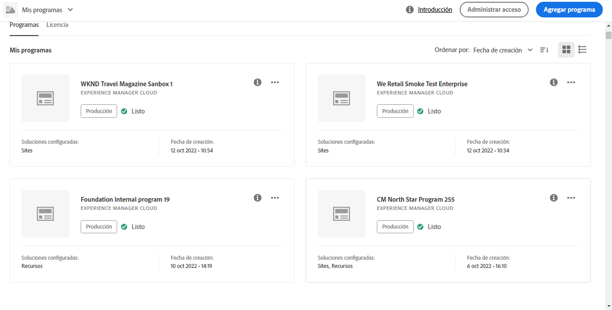

# Creación de un programa de producción {#create-production-program}

Un programa *Production* está pensado para un usuario familiarizado con AEM y Cloud Manager y listo para empezar a escribir, crear y probar código con el objetivo de implementarlo en Producción.

Vea los videotutoriales de dos partes para aprender a crear un programa en Cloud Manager:

>[!VIDEO](https://video.tv.adobe.com/v/334953)

>[!VIDEO](https://video.tv.adobe.com/v/334954)

Además,

Siga los pasos a continuación para crear un programa de producción:

1. Inicie la página de aterrizaje de Cloud Manager y haga clic en **Agregar programa** en la esquina superior derecha de la pantalla.

   

1. Seleccione **Configurar para producción** en el asistente Crear programa para crear un programa de producción. El usuario puede aceptar el nombre de programa predeterminado o editarlo antes de seleccionar **Crear**.

   

1. El usuario selecciona las soluciones que se incluirán en el programa en la pantalla que se presentará después de la pantalla anterior. Una vez que haya seleccionado la solución o las soluciones requeridas, haga clic en **Crear**.

   

   Además, puede seleccionar la opción del complemento **Comercio** en **Sitios**, como se muestra en la figura siguiente, y hacer clic en **Crear**.

   

1. Una vez que vea la tarjeta del programa en la página de aterrizaje, pase el ratón por encima para seleccionar el icono de Cloud Manager para navegar a la página **Información general** de Cloud Manager.

   

1. La tarjeta de llamada a acción principal guiará al usuario para crear un entorno, crear una canalización que no sea de producción y, finalmente, una canalización de producción.
   

   >[!NOTE]
   >Un programa de producción no tiene la función **Auto-setup**.
