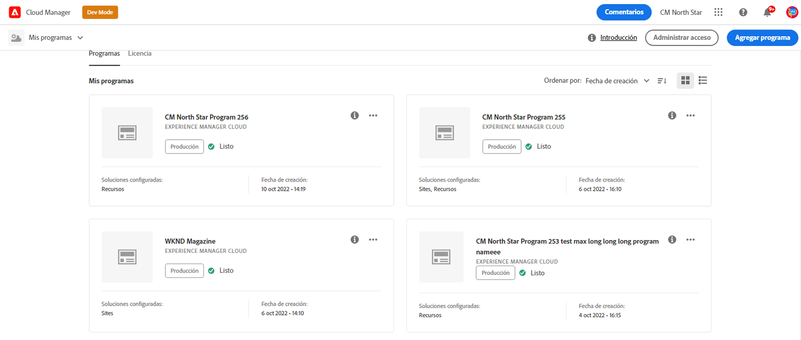
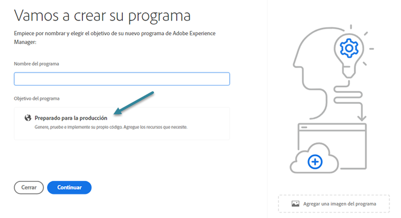

# Creación de programas de producción {#create-production-program}

Un programa de producción está diseñado para un usuario que esté familiarizado con AEM y Cloud Manager y que esté listo para empezar a escribir, crear y probar código con el objetivo de implementarlo para alojar tráfico en vivo.

Obtenga más información sobre los tipos de programas en el documento [Explicación de los programas y sus tipos.](program-types.md)

## Videotutoriales {#video-tutorials}

Puede ver estos dos videotutoriales para aprender a crear un programa en Cloud Manager o [seguir nuestras instrucciones documentadas.](#create)

>[!VIDEO](https://video.tv.adobe.com/v/334953)

>[!VIDEO](https://video.tv.adobe.com/v/334954)

## Creación de un programa de producción {#create}

Siga estos pasos para crear un programa de producción.

1. Inicie sesión en Cloud Manager en [my.cloudmanager.adobe.com](https://my.cloudmanager.adobe.com/) y seleccione la organización adecuada.

1. Haga clic en **Agregar programa** en la esquina superior derecha de la pantalla.

   

1. Seleccione **Configurar para producción** en el asistente Crear programa para crear un programa de producción. Puede aceptar el nombre de programa predeterminado o editarlo antes de hacer clic en **Continuar**.

   

1. En la pestaña **Soluciones y complementos**, seleccione las soluciones que desea incluir en el programa.

   

1. Haga clic en el elemento adicional antes de los nombres de las soluciones para mostrar complementos opcionales, como seleccionar la opción de complemento **Comercio** en **Sites**.

   

1. Con las soluciones y los complementos seleccionados, haga clic en **Continuar**.

1. En la pestaña **Fecha de lanzamiento**, introduzca la fecha en la que planea que su programa de producción se ponga en marcha.

   

   * Esta fecha se puede editar en cualquier momento.
   * Esta fecha es solo para uso informativo y activa el widget Go Live en la página de descripción general del programa para proporcionar vínculos internos del producto a la documentación de prácticas recomendadas de AEM as a Cloud Service de forma oportuna para que se ajuste a su recorrido y que culmine en una experiencia Go Live correcta y sin problemas.

1. Haga clic en **Crear**.

El programa lo crea Cloud Manager y aparece y se puede seleccionar en la página de aterrizaje.

## Acceso a su programa {#acessing}

1. Una vez que vea la tarjeta del programa en la página de aterrizaje, seleccione el botón de tres puntos para ver las opciones de menú disponibles.

   

1. Seleccione **Información general del programa** para navegar a la página **Información general**.

1. La tarjeta de llamada a la acción principal de la página de información general le guiará a través de la creación de un entorno, una canalización que no sea de producción y, finalmente, una canalización de producción.

   

Si en cualquier momento necesita cambiar a otro programa o volver a la página de información general para crear otro programa, haga clic en el nombre del programa en la parte superior izquierda de la pantalla para mostrar la opción **Vaya a**.

>[!NOTE]
>
>A diferencia de un [programa de zona protegida,](introduction-sandbox-programs.md#auto-creation) un programa de producción requerirá que el usuario con la función adecuada de Cloud Manager cree el proyecto y añada un entorno a través de la interfaz de usuario de autoservicio.
