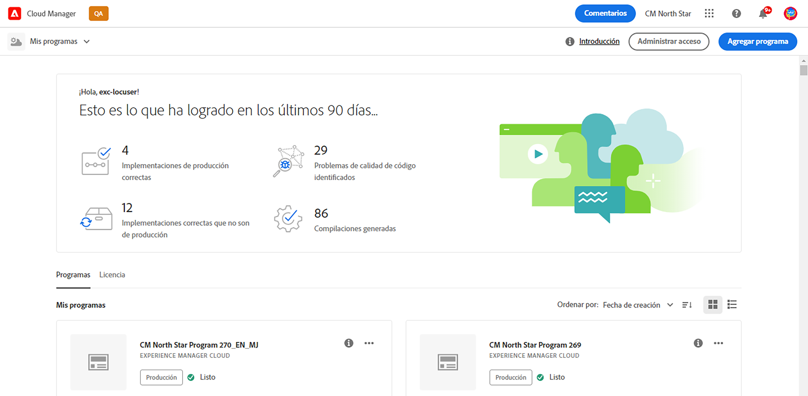
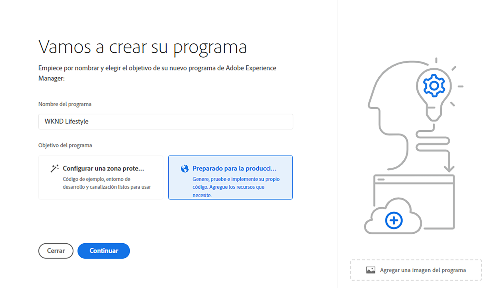
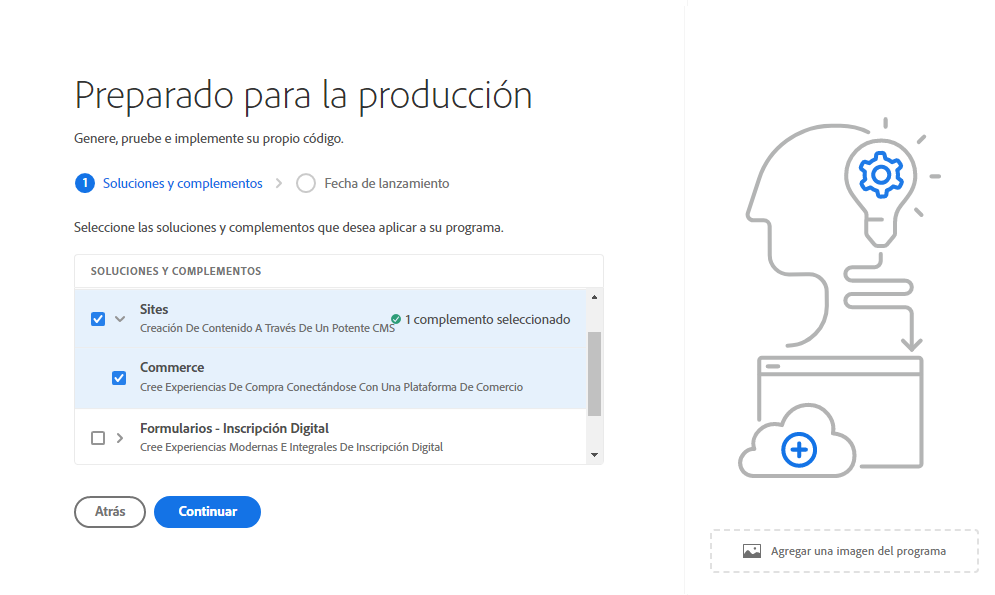
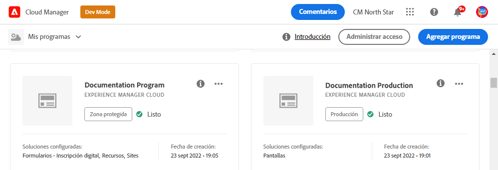
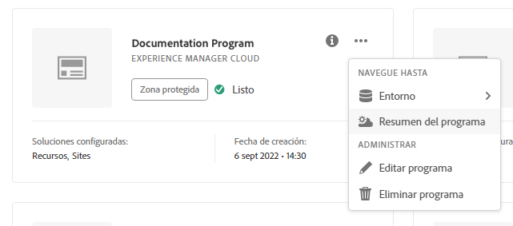
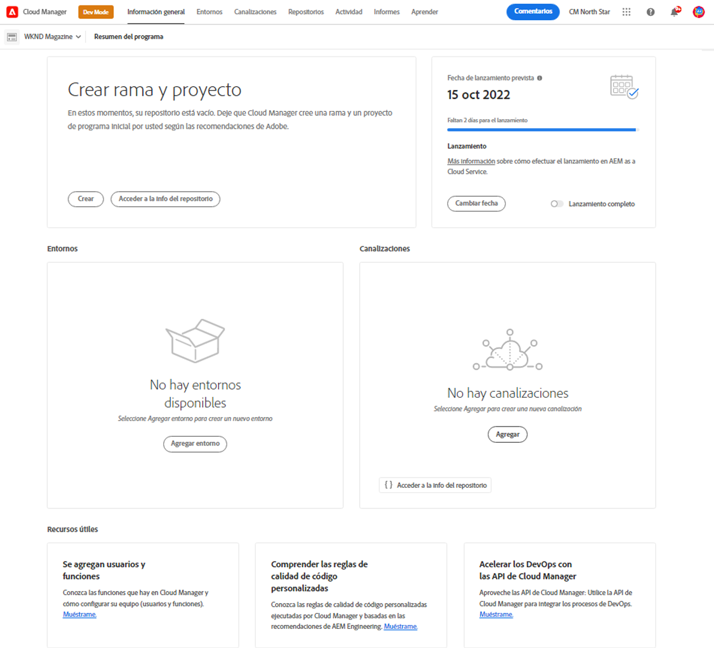

# Creación de programas de producción {#create-production-program}

Un programa de producción es para usuarios familiarizados con Adobe Experience Manager (AEM) y Cloud Manager, listos para escribir, generar y probar código, con el objetivo de implementarlo para gestionar el tráfico en directo.

Obtenga más información acerca de los tipos de programas en el documento [Explicación de los tipos de programas y programas](program-types.md).

## Creación de un programa de producción {#create}

Según los derechos de su organización, puede ver opciones de programa de producción adicionales al agregar su programa.
Ver [opciones adicionales del programa de producción](#options).

**Para crear un programa de producción:**

1. Inicie sesión en Cloud Manager en [my.cloudmanager.adobe.com](https://my.cloudmanager.adobe.com/) y seleccione la organización adecuada.

1. En la consola **[Mis programas](/help/implementing/cloud-manager/navigation.md#my-programs)**, cerca de la esquina superior derecha, haga clic en **Agregar programa**.

   

1. En el asistente *Vamos a crear su programa*, en el campo de texto **Nombre del programa**, escriba el nombre que desee para el programa.

1. En **Objetivo del programa**, seleccione **Configurado para producción**.

   

1. (Opcional) En la esquina inferior derecha del cuadro de diálogo del asistente, realice una de las acciones siguientes:

   * Arrastre y suelte un archivo de imagen en el  **Agregue un destino de imagen de programa**.
   * Haga clic en  **Agregar una imagen de programa** y, a continuación, seleccione una imagen de un explorador de archivos.
   * Haga clic en  para eliminar una imagen que haya agregado.

1. Haga clic en **Continuar**.

1. En el cuadro de lista **Soluciones y complementos**, seleccione una o varias soluciones para incluirlas en el programa.

   * Si tiene dudas sobre si necesita uno o más programas para las distintas soluciones disponibles, seleccione la que le interese. Si desea activar soluciones adicionales, [puede editar el programa](/help/implementing/cloud-manager/getting-access-to-aem-in-cloud/editing-programs.md) más tarde. Consulte el [Documento de introducción a los programas de producción](/help/implementing/cloud-manager/getting-access-to-aem-in-cloud/introduction-production-programs.md) para conocer más recomendaciones sobre la configuración del programa.
   * Es necesario seleccionar al menos una solución para la creación del programa. Por ejemplo, puede elegir **Edge Delivery Services** para una solución de CDN completamente administrada que optimice las experiencias digitales. Ver [Acerca del uso de Edge Delivery Services para entregar el proyecto Cloud Manager](/help/implementing/cloud-manager/edge-delivery/introduction-to-edge-delivery-services.md)

   

   <!-- * If you selected the **[Enable Enhanced Security](#security)** option, you can select only as many solutions for which HIPAA entitlements are available. -->

   * Haga clic en  a la izquierda del nombre de una solución para mostrar los complementos opcionales. <!-- such as the **Commerce** add-on option under **Sites**. -->

   

1. Cuando termine de seleccionar las soluciones y los complementos, haga clic en **Continuar**.

1. En la ficha **Fecha de lanzamiento**, escriba la fecha en la que planea que su programa de producción se ponga en marcha.

   

   * Puede editar esta fecha en cualquier momento.
   * La fecha tiene fines informativos y déclencheur para el widget Go Live en la [**página Información general del programa**](/help/implementing/cloud-manager/getting-access-to-aem-in-cloud/editing-programs.md#program-overview). Esta funcionalidad proporciona vínculos oportunos dentro del producto a las prácticas recomendadas de AEM as a Cloud Service para permitir una experiencia Go Live sin problemas.

1. Haga clic en **Crear**. Cloud Manager crea el programa y lo muestra en la página de aterrizaje para su selección.

   

## Opciones adicionales del programa de producción {#options}

Según los derechos disponibles para su organización, puede tener las siguientes opciones adicionales disponibles al crear un programa de producción.

### Seguridad {#security}

Si tiene los derechos necesarios, la ficha **Security** se muestra como la primera ficha del cuadro de diálogo **`Set up for production`**.

La pestaña **Security** proporciona las opciones para activar **HIPAA**, **Protección WAF-DDOS** o ambas para tu programa de producción.

Compatible con HIPAA de Adobe y WAF-DDOS (cortafuegos de aplicaciones web - denegación de servicio distribuida) facilita la seguridad basada en la nube como parte de un enfoque de varios niveles para la protección contra vulnerabilidades.

* **HIPAA**: esta opción habilita la implementación de la solución compatible con HIPPA de Adobe.
   * [Más información](https://www.adobe.com/trust/compliance/hipaa-ready.html) acerca de la implementación de la solución compatible con HIPAA de Adobe.
   * HIPAA no se puede habilitar o deshabilitar después de la creación del programa.
* **Protección WAF-DDOS**: esta opción habilita el firewall de aplicaciones web mediante reglas para proteger la aplicación.
   * Una vez activada, la protección WAF-DDOS se puede configurar configurando una [canalización que no sea de producción](/help/implementing/cloud-manager/configuring-pipelines/configuring-non-production-pipelines.md).
   * Consulte [Reglas de filtro de tráfico, incluidas las reglas de WAF](/help/security/traffic-filter-rules-including-waf.md), para obtener información sobre cómo administrar las reglas de filtro de tráfico en el repositorio a fin de que se implementen correctamente.

### SLA {#sla}

Si tiene los derechos necesarios, la ficha **SLA** se muestra como la segunda o tercera ficha en el cuadro de diálogo **`Set up for production`**.

Sites y Forms ofrecen un 99,9 % de service level agreement estándar (SLA). La opción **99,99% de Service level agreement** garantiza un tiempo de actividad mínimo del 99,99% para los entornos de producción, ya sea para Sites, Forms, Edge Delivery Services o los tres.

El 99,99 % de SLA ofrece ventajas que incluyen una mayor disponibilidad y una menor latencia.

Para los programas de Sites y Forms, el 99,99 % de SLA requiere que se aplique una [región de publicación adicional](/help/implementing/cloud-manager/manage-environments.md#multiple-regions) al entorno de producción en el programa. Cuando se cumplan los [requisitos](#sla-requirements) para habilitar el 99,99 % de SLA, debe ejecutar una [canalización de pila completa](/help/implementing/cloud-manager/configuring-pipelines/configuring-production-pipelines.md) para activarla.

Para Edge Delivery Services, no hay *ningún* requisito aparte de configurar la licencia de SLA al 99,99% en el programa.

#### Requisitos para SLA al 99,99 % {#sla-requirements}

Además de los derechos requeridos, el uso del 99,99 % de SLA para sitios o programas de Forms incluye los siguientes requisitos adicionales:

* La organización debe tener un 99,99 % de SLA y derechos de región de publicación adicionales disponibles al aplicar un 99,99 % de SLA al programa.
* Cloud Manager comprueba que hay disponible un derecho de [región de publicación adicional](/help/implementing/cloud-manager/manage-environments.md#multiple-regions) sin usar antes de aplicar el 99,99 % de SLA al programa.
* Al editar un programa, si ya contiene un entorno de producción con al menos una región de publicación adicional, Cloud Manager solo comprueba la disponibilidad de un derecho de SLA del 99,99 %.
* Para la activación del 99,99 % de SLA y los informes, se debe haber creado el [entorno de producción/ensayo](/help/implementing/cloud-manager/manage-environments.md#adding-environments) y se debe haber aplicado al menos una región de publicación adicional en el entorno de producción/ensayo.
   * Si usa [red avanzada](/help/security/configuring-advanced-networking.md), asegúrese de comprobar el documento [Agregar varias regiones de publicación a un nuevo entorno](/help/implementing/cloud-manager/manage-environments.md#adding-regions) para ver las recomendaciones, de modo que se mantenga la conectividad si se produce un error regional.
* El programa SLA al 99,99 % siempre debe incluir al menos una región de publicación adicional. Los usuarios no pueden eliminar la última región de publicación adicional restante del programa.
* Su SLA al 99,99 % es compatible con programas de producción que tengan activada la solución Sites o Forms.
* Ejecute una [canalización de pila completa](/help/implementing/cloud-manager/configuring-pipelines/configuring-production-pipelines.md) para activar o, al editar un programa, desactivar el SLA 99,99%.

## Acceso a su programa {#accessing}

1. Cuando vea la tarjeta del programa en la página de aterrizaje, haga clic en  para ver las opciones de menú disponibles.

   

1. Seleccione **Información general del programa** para navegar a la página **Información general**.

1. La tarjeta de call-to-action principal de la página de información general le guía a través de la creación de un entorno, una canalización que no sea de producción y, finalmente, una canalización de producción.

   

>[!TIP]
>
>Consulte [Navegar por la interfaz de usuario de Cloud Manager](/help/implementing/cloud-manager/navigation.md) para obtener más información sobre cómo navegar por Cloud Manager y comprender la consola **Mis programas**.

>[!NOTE]
>
>A diferencia de [programa de zona protegida](introduction-sandbox-programs.md#auto-creation), un programa de producción requiere que el usuario con la función de Cloud Manager adecuada cree el proyecto y agregue un entorno a través de la interfaz de usuario de autoservicio.

