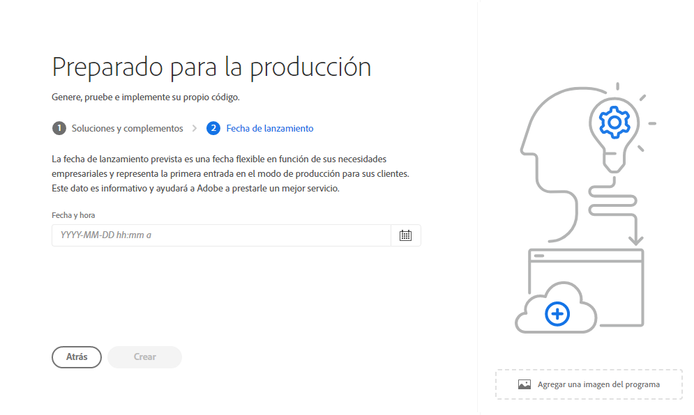

# Creación de programas de producción {#create-production-program}

Un programa de producción está diseñado para un usuario que esté familiarizado con AEM y Cloud Manager y que esté listo para empezar a escribir, crear y probar código con el objetivo de implementarlo para alojar tráfico en vivo.

Obtenga más información sobre los tipos de programas en el documento [Explicación de los programas y sus tipos.](program-types.md)

## Creación de un programa de producción {#create}

Siga estos pasos para crear un programa de producción. Tenga en cuenta que, según los derechos de su organización, puede ver lo siguiente [opciones adicionales](#options) al añadir el programa.

1. Inicie sesión en Cloud Manager en [my.cloudmanager.adobe.com](https://my.cloudmanager.adobe.com/) y seleccione la organización adecuada.

1. En el **[Mis programas](/help/implementing/cloud-manager/getting-access-to-aem-in-cloud/editing-programs.md#my-programs)** pantalla, toque o haga clic en **Agregar programa** en la esquina superior derecha de la pantalla.

   

1. Seleccione **Configurar para producción** en el asistente Crear programa para crear un programa de producción y proporcionar un nombre de programa.

   

1. Para añadir, si lo desea, una imagen al programa, arrastre y suelte un archivo de imagen en el destino **Añadir una imagen del programa** o haga clic en él para seleccionar una imagen de un explorador de archivos. Seleccione **Continuar**.

1. En la pestaña **Soluciones y complementos**, seleccione las soluciones que desea incluir en el programa.

   * Si tiene dudas sobre si necesita uno o más programas para las distintas soluciones disponibles, seleccione la que le interese. Si desea activar soluciones adicionales, [puede editar el programa](/help/implementing/cloud-manager/getting-access-to-aem-in-cloud/editing-programs.md) más tarde. Consulte el [Documento de introducción a los programas de producción](/help/implementing/cloud-manager/getting-access-to-aem-in-cloud/introduction-production-programs.md) para conocer más recomendaciones sobre la configuración del programa.
   * Se requiere al menos una solución para la creación del programa.
   * Si seleccionó la **[Habilitar seguridad mejorada](#security)** , solo se le permite seleccionar tantas soluciones para las que están disponibles los derechos de HIPAA.

   

1. Haga clic en las comillas angulares antes de los nombres de las soluciones para mostrar complementos opcionales, como seleccionar la opción **Comercio** opción de complemento en **Sites**.

   

1. Con las soluciones y los complementos seleccionados, haga clic en **Continuar**.

1. En la pestaña **Fecha de lanzamiento**, introduzca la fecha en la que planea que su programa de producción se ponga en marcha.

   

   * Esta fecha se puede editar en cualquier momento.
   * Esta fecha es solo para uso informativo y déclencheur el widget Go Live en la [**Resumen del programa** página](/help/implementing/cloud-manager/getting-access-to-aem-in-cloud/editing-programs.md#program-overview) AEM proporcionar vínculos internos del producto a la documentación de prácticas recomendadas as a Cloud Service de forma oportuna para que se ajuste a su recorrido y que culmine en una experiencia de Go Live correcta y sin problemas.

1. Haga clic en **Crear**.

El programa lo crea Cloud Manager y aparece y se puede seleccionar en la página de aterrizaje.

## Opciones adicionales del programa de producción {#options}

Según los derechos disponibles para su organización, puede tener opciones adicionales disponibles al crear un programa de producción.

### Seguridad {#security}

Si tiene los derechos necesarios, la variable **Seguridad** se mostrará como la primera pestaña de la **Configurado para producción** diálogo.

El **Seguridad** proporciona las opciones para activar **HIPAA** y/o **Protección WAF-DDOS** para su programa de producción.

Adobe Compatible con HIPAA y Firewall de aplicaciones web (WAF) facilita la seguridad basada en la nube como parte de un enfoque de varios niveles para la protección contra vulnerabilidades.

* **HIPAA** - Esta opción habilita la implementación de soluciones preparadas para HIPPA de Adobe.
   * [Más información](https://www.adobe.com/go/hipaa-ready_es) acerca de la implementación de la solución compatible con HIPAA de Adobe.
   * HIPAA no se puede habilitar o deshabilitar después de la creación del programa.
* **Protección WAF-DDOS** : Esta opción habilita el cortafuegos de la aplicación web mediante reglas para proteger la aplicación.
   * Una vez activada, la protección WAF-DDOS se puede configurar mediante la configuración de una [canalización que no sea de producción.](/help/implementing/cloud-manager/configuring-pipelines/configuring-non-production-pipelines.md)
   * Ver el documento [Reglas de filtro de tráfico, incluidas las reglas WAF](/help/security/traffic-filter-rules-including-waf.md) para obtener información sobre cómo administrar las reglas de filtro de tráfico en el repositorio para que se implementen correctamente.

### SLA {#sla}

Si tiene los derechos necesarios, la variable **SLA** se mostrará como la segunda o tercera pestaña en la **Configurado para producción** diálogo.

AEM Sites ofrece un contrato de nivel de servicio (SLA) estándar del 99,9 %. El **Contrato de nivel de servicio al 99,99%** activa un porcentaje de tiempo de actividad mínimo del 99,99 % para sus entornos de producción.

El 99,99 % de SLA ofrece beneficios que incluyen una mayor disponibilidad y una menor latencia, y requiere una [región de publicación adicional](/help/implementing/cloud-manager/manage-environments.md#multiple-regions) se aplicará al entorno de producción en el programa.

Una vez que [requisitos](#sla-requirements) para habilitar el cumplimiento del SLA del 99,99 %, debe ejecutar un [canalización de pila completa](/help/implementing/cloud-manager/configuring-pipelines/configuring-production-pipelines.md) para poder activarlo.

#### Requisitos para el SLA del 99,99 % {#sla-requirements}

Más allá de los derechos requeridos, el 99,99 % de SLA tiene requisitos adicionales para su uso.

* Tanto el SLA al 99,99 % como los derechos de región de publicación adicionales deben estar disponibles para la organización en el momento de aplicar el SLA al 99,99 % al programa.
* Para aplicar un SLA del 99,99 % al programa, Cloud Manager comprobará que un [región de publicación adicional](/help/implementing/cloud-manager/manage-environments.md#multiple-regions) el derecho de también está disponible y se puede aplicar al programa.
* Al editar un programa, si ya contiene un entorno de producción con al menos una región de publicación adicional, Cloud Manager solo comprueba la disponibilidad de un derecho de SLA del 99,99 %.
* Para que se activen el SLA del 99,99 % y la creación de informes, la variable [entorno de producción/ensayo](/help/implementing/cloud-manager/manage-environments.md#adding-environments) debe haberse creado y debe haberse aplicado al menos una región de publicación adicional en el entorno de producción/ensayo.
   * Si se usa [redes avanzadas,](/help/security/configuring-advanced-networking.md) asegúrese de comprobar el [Adición de varias regiones de publicación en un entorno nuevo](/help/implementing/cloud-manager/manage-environments.md#adding-regions) documento de recomendaciones para mantener la conectividad en caso de fallo regional.
* Al menos una región de publicación adicional debe permanecer en su programa de SLA al 99,99%. Los usuarios no pueden eliminar la última región de publicación adicional de su programa de SLA al 99,99 %.
* El 99,99 % de SLA es compatible con programas de producción que tienen la solución Sites habilitada.
* Debe ejecutar un [canalización de pila completa](/help/implementing/cloud-manager/configuring-pipelines/configuring-production-pipelines.md) para activar (o, al editar un programa, desactivar) el SLA del 99,99 %.

## Acceso a su programa {#accessing}

1. Cuando vea la tarjeta del programa en la página de aterrizaje, seleccione el botón de puntos suspensivos para ver las opciones de menú disponibles.

   

1. Seleccione **Información general del programa** para navegar a la página **Información general**.

1. La tarjeta de llamada a la acción principal de la página de información general le guiará a través de la creación de un entorno, una canalización que no sea de producción y, finalmente, una canalización de producción.

   

Si en cualquier momento necesita cambiar a otro programa o volver a la página de información general para crear otro programa, haga clic en el nombre del programa en la parte superior izquierda de la pantalla para mostrar el **Vaya a** opción.

>[!NOTE]
>
>A diferencia de un [programa de zona protegida,](introduction-sandbox-programs.md#auto-creation) un programa de producción requerirá que el usuario con la función adecuada de Cloud Manager cree el proyecto y añada un entorno a través de la interfaz de usuario de autoservicio.
