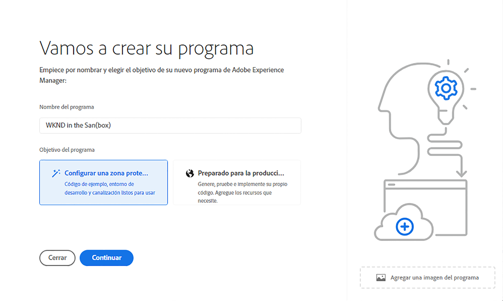

# Creación de un programa de espacio aislado {#create-sandbox-program}

Siga los pasos a continuación para crear un programa de simulación de pruebas:

1. Inicie la página de aterrizaje de Cloud Manager y haga clic en **Agregar programa** en la esquina superior derecha de la pantalla.

   

   >[!NOTE]
   >Para obtener más información sobre cómo acceder a Cloud Manager, consulte [Página de aterrizaje de Cloud Manager](/help/onboarding/what-is-required/navigate-to-cloud-manager.md) para obtener más información.

1. En el asistente de creación de programa, seleccione **Configurar un simulador de pruebas**. El usuario envía el nombre del programa antes de seleccionar **Crear**.

   

1. El usuario verá la nueva tarjeta de programa de simulación de pruebas en la página de aterrizaje y podrá pasar el ratón por encima para seleccionar el icono de Cloud Manager para navegar a la página de información general de Cloud Manager. La tarjeta informará al usuario sobre el estado de la configuración automática del programa de espacio aislado recién creado. El usuario verá progresión.

   

1. Una vez que se haya configurado el programa y se haya completado el paso de creación del proyecto, el usuario puede acceder al enlace **Administrar Git**, como se muestra en la figura siguiente:

   

   >[!NOTE]
   >
   >Para obtener más información sobre el acceso y la administración del repositorio de Git mediante la administración de cuentas de Git de autoservicio desde la interfaz de usuario de Cloud Manager, consulte [Acceso a Git](/help/implementing/cloud-manager/accessing-repos.md).

1. Una vez creado el entorno de desarrollo, el usuario puede **Access AEM** vincular, como se muestra en la figura siguiente:

   

1. Una vez completada la implementación de la canalización de no producción en el desarrollo, el asistente guía al usuario para acceder a AEM (en desarrollo) o implementar código en el entorno de desarrollo:

   

   >[!NOTE]
   >También puede editar, cambiar o agregar un programa desde la página Información general de Cloud Manager , como se muestra a continuación:

   
